# 1. ROSpider User Manual

## 1.1 Product Introduction

ROSpider is a comprehensive hexapod robot developed for ROS educational scenarios, operating on Ubuntu 22.04 and equipped with the ROS2 Humble robot system.

It is equipped with high-performance hardware configurations such as NVIDIA Jetson Orin Nano, high-voltage bus servos, LiDAR, a depth camera, and a 6-microphone array. It supports applications including robot motion control, mapping and navigation, tracking and obstacle avoidance, autonomous patrolling, human feature recognition, body motion interaction, and large AI models.

Furthermore, the robot integrates the depth camera with a robotic arm, allowing it to function as both a desktop visual robotic arm and a mobile visual robotic arm. The robot can perform tasks such as navigation and handling, autonomous grasping, and garbage classification, fulfilling requirements for learning and verifying ROS2 and machine vision.

Regarding mobility, a hexapod ripple gait is adopted, and the body's running posture, height, and speed are adjustable, providing a smoother control experience.

## 1.2 Hardware Introduction

This chapter primarily introduces the hardware components of the ROSpider robot, including the electronic control system, Jetson Orin Nano controller, LiDAR, depth camera, and other sensors.

### 1.2.1 Assembly Instructions

For details, please refer to the **[Video Tutorial](https://www.youtube.com/playlist?list=PLFbzd0m6AcmKRgvwlMZkxmDms8BGc_XYk)** in the same directory for robot assembly.

<p id ="1.2.2"></p>

### 1.2.2 Hardware System

**1.2.2.1 Wiring Instructions**

* **Jetson Nano Controller**

The following figure illustrates the interfaces connecting various modules to the Jetson Nano controller in the flagship edition. Wiring can be performed according to the standards in the table below. **Skip this interface if the purchased package does not include the relevant modules.**

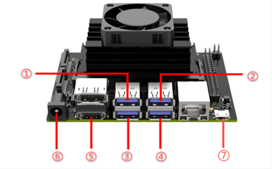

<table border="1">
<thead>
<tr>
<th>No.</th>
<th>Interface / Port</th>
</tr>
</thead>
<tbody>
<tr>
<td>①</td>
<td>Depth Camera / Monocular Camera</td>
</tr>
<tr>
<td>②</td>
<td>STM32 Controller Communication</td>
</tr>
<tr>
<td>③</td>
<td>Custom Expansion</td>
</tr>
<tr>
<td>④</td>
<td>Microphone Array Module / WonderEcho Pro AI Voice Box</td>
</tr>
<tr>
<td>⑤</td>
<td>LCD Display HDMI / DP</td>
</tr>
<tr>
<td>⑥</td>
<td>Jetson Nano Controller Power Supply</td>
</tr>
<tr>
<td>⑦</td>
<td>Wired Connection</td>
</tr>
</tbody>
</table>


* **Jetson Orin Nano/Orin NX Controller**

The following figure illustrates the interfaces connecting various modules to the Jetson Orin Nano controller in the flagship edition. Wiring can be performed according to the standards in the table below. **Skip this interface if the purchased package does not include the relevant modules.**

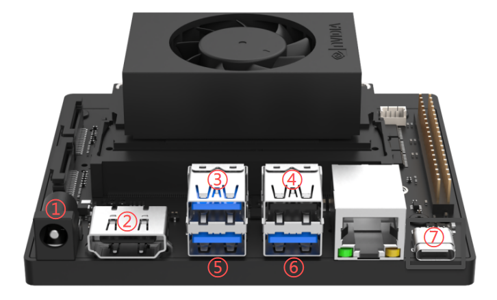

<table border="1">
<thead>
<tr>
<th>No.</th>
<th>Interface / Port</th>
</tr>
</thead>
<tbody>
<tr>
<td>①</td>
<td>Jetson Orin Nano Controller Power Supply</td>
</tr>
<tr>
<td>②</td>
<td>Virtual Display Emulator HDMI / DP</td>
</tr>
<tr>
<td>③</td>
<td>Depth Camera / Monocular Camera</td>
</tr>
<tr>
<td>④</td>
<td>STM32 Controller Communication</td>
</tr>
<tr>
<td>⑤</td>
<td>Custom Expansion</td>
</tr>
<tr>
<td>⑥</td>
<td>Microphone Array Module / WonderEcho Pro AI Voice Box</td>
</tr>
<tr>
<td>⑦</td>
<td>Wired Connection</td>
</tr>
</tbody>
</table>


* **Raspberry Pi 5 Controller**

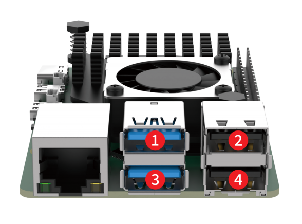

<table border="1">
<thead>
<tr>
<th>No.</th>
<th>Interface / Port</th>
</tr>
</thead>
<tbody>
<tr>
<td>①</td>
<td>Depth Camera / Monocular Camera</td>
</tr>
<tr>
<td>②</td>
<td>STM32 Controller Communication</td>
</tr>
<tr>
<td>③</td>
<td>Custom Expansion</td>
</tr>
<tr>
<td>④</td>
<td>Microphone Array Module / WonderEcho Pro AI Voice Box</td>
</tr>
</tbody>
</table>


**1.2.2.2 Hardware System Connection Diagram**

The robot hardware connection system diagram based on the ROS controller Jetson Nano is shown below:

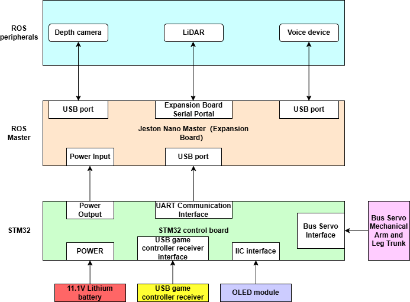

The robot hardware connection system diagram based on the ROS controller Jetson Orin Nano/Orin NX is shown below:

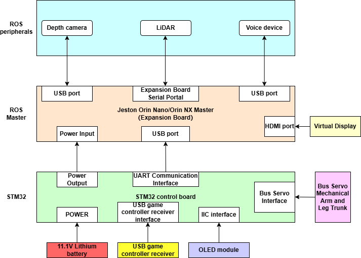

The robot hardware connection system diagram based on the ROS controller Raspberry Pi 5 is shown below:

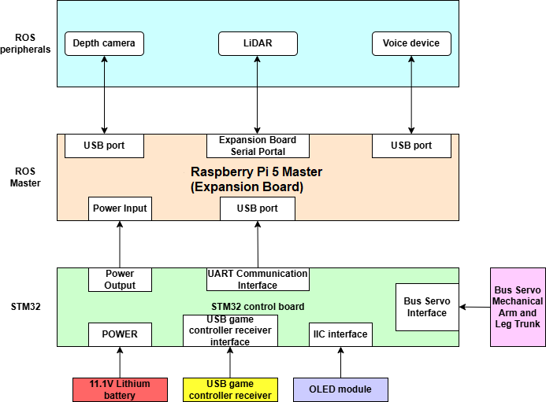

### 1.2.3 Electronic Control System Introduction

The robot's electronic control utilizes a Jetson/Raspberry Pi expansion board and a Jetson Nano, Jetson Orin Nano/Orin NX, or Raspberry Pi 5 controller as the upper-level computer to connect the LiDAR, depth camera, and voice device. The STM32 main control board serves as the lower-level controller, connecting multiple bus servos, and features a built-in IMU accelerometer and gyroscope sensor to achieve robot motion control and data acquisition.

**1.2.3.1 ROS Controller**

* **Jetson Nano:**

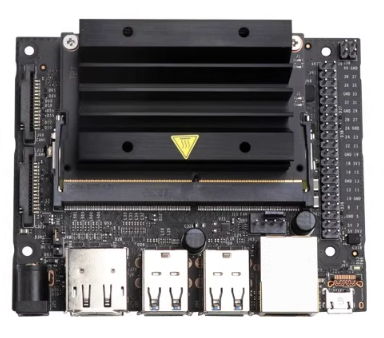

**Jetson Orin Nano/Orin NX:**

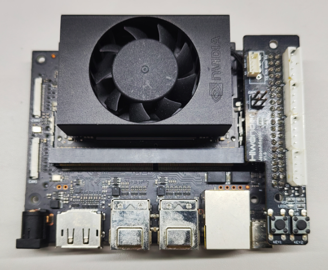

**Raspberry Pi 5:**

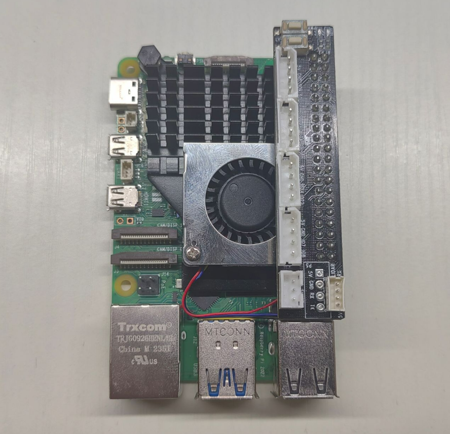

The robot uses Jetson Nano, Jetson Orin Nano/Orin NX, or Raspberry Pi 5 as the ROS controller. It consists of a Jetson/Raspberry Pi controller and an expansion board. The controller is a compact yet powerful computer capable of running mainstream deep learning frameworks, satisfying the computing power required for most artificial intelligence projects.

The expansion board routes out LEDs and buttons, making it convenient to check the network status via LED flashes and to switch network modes via a mobile phone. It also reserves GPIO and I2C interfaces, as well as a LiDAR communication interface.

**The controller is installed with the Ubuntu 22.04.5 system, along with the ROS2 Humble robot operating system environment.**

For fundamental courses on the ROS controller, please refer to the tutorial **[Basic Courses\ROS Controller Tutorial](https://drive.google.com/drive/folders/1mJOYpvnyMda1xGvtPgTvoBUd1zHdh9Db?usp=sharing)**.

**1.2.3.2 STM32 Controller**

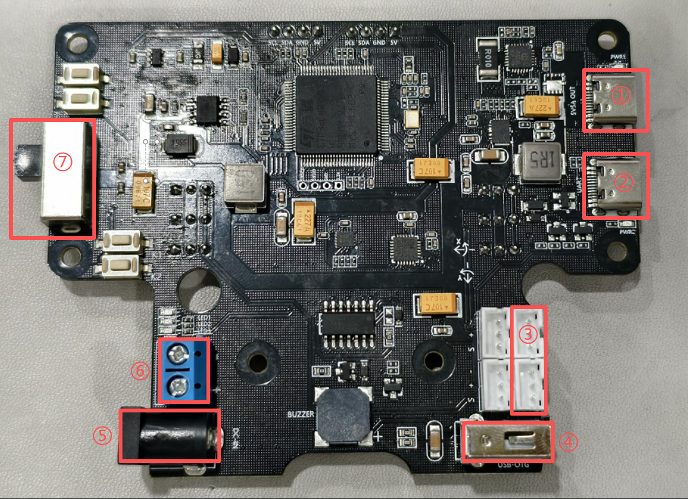

<table border="1">
<thead>
<tr>
<th>No.</th>
<th>Function Description</th>
</tr>
</thead>
<tbody>
<tr>
<td>①</td>
<td>5V output port for Jetson Nano/Raspberry Pi 5 power supply</td>
</tr>
<tr>
<td>②</td>
<td>UART serial port, used for communication with the main controller</td>
</tr>
<tr>
<td>③</td>
<td>Jetson Orin Nano/Orin NX power supply port and robotic arm servo port</td>
</tr>
<tr>
<td>④</td>
<td>USB wireless controller receiver port</td>
</tr>
<tr>
<td>⑤</td>
<td>12.6V charger port</td>
</tr>
<tr>
<td>⑥</td>
<td>Lithium battery power supply port</td>
</tr>
<tr>
<td>⑦</td>
<td>Power switch</td>
</tr>
</tbody>
</table>


**1.2.3.3 Depth Camera**

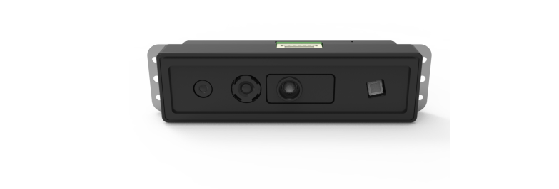

As one of the most critical components in the robot structure, the camera functions similarly to human eyes.

This robot utilizes the Orbbec Binocular Structured Light Depth Camera **Aurora930**. The Deptrum® Aurora 930 series depth camera uses 3D structured light technology to acquire the three-dimensional structure of objects and spaces, fusing the RGB image of the color camera with depth data to provide convenient and efficient 3D perception capabilities.

Within the robot, it is primarily used to implement functions related to OpenCV, while also supporting visual applications such as deep learning and KCF object tracking. For fundamental courses on the depth camera, please refer to the tutorial **[Monocular and Depth Camera Foundation Course\Depth Camera Basics Study](https://drive.google.com/drive/folders/1uy-YGHti9VpGF2JlAVd-2E1DjvZ4eg9w?usp=sharing)**.

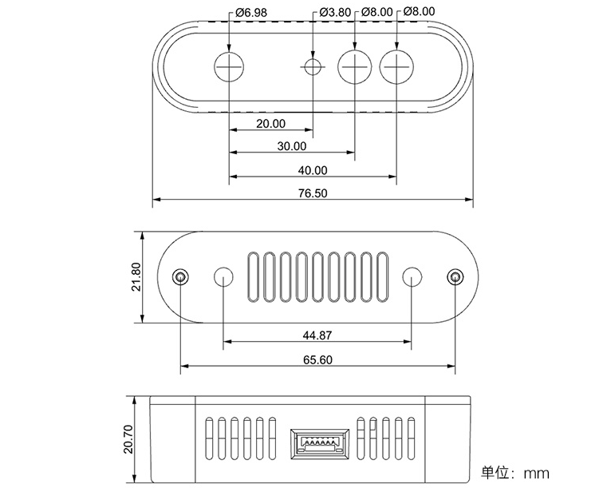

Specific camera parameters are shown in the table below:

<table border="1">
<thead>
<tr>
<th>Parameter Category</th>
<th>Parameter Name</th>
<th>Parameter Details</th>
</tr>
</thead>
<tbody>
<tr>
<td rowspan="12">Module Parameters</td>
<td>Overall Dimensions</td>
<td>76.5*20.7*21.8 mm</td>
</tr>
<tr>
<td>Baseline</td>
<td>40mm</td>
</tr>
<tr>
<td>Interface</td>
<td>USB 2.0 Wafer Interface</td>
</tr>
<tr>
<td>Depth Accuracy</td>
<td>8mm@1m</td>
</tr>
<tr>
<td>Depth Precision</td>
<td>3mm@0.5m, 7mm@1m</td>
</tr>
<tr>
<td>Working Distance</td>
<td>30~300cm</td>
</tr>
<tr>
<td>Operating Temperature</td>
<td>-10℃~55℃</td>
</tr>
<tr>
<td>Operating Humidity</td>
<td>0%~95%, non-condensing</td>
</tr>
<tr>
<td>Operating Illuminance</td>
<td>3~6000Lux</td>
</tr>
<tr>
<td>Power Supply</td>
<td>5V±10%, 1.5A</td>
</tr>
<tr>
<td>Device Power Consumption</td>
<td>Overall Power Consumption Avg<1.6W</td>
</tr>
<tr>
<td>Safety</td>
<td>Class 1 Laser Safety</td>
</tr>
<tr>
<td rowspan="6">Image Performance</td>
<td>Depth Data Format</td>
<td>Raw 16</td>
</tr>
<td>Depth Resolution/Frame Rate</td>
<td>640*400 (320*240) / 5~15fps/ H71° x V46°</td>
</tr>
<tr>
<td>Color Data Format</td>
<td>NV12</td>
</tr>
<tr>
<td>Color Resolution/Frame Rate</td>
<td>640*400 (320*240) / 5~15fps/ H71° x V46°</td>
</tr>
<tr>
<td>Infrared Data Format</td>
<td>Raw 8</td>
</tr>
<tr>
<td>Infrared Resolution/Frame Rate</td>
<td>640*400 (320*240) / 5~15fps/ H71° x V46°</td>
</tr>
<tr>
<td rowspan="2">System Compatibility</td>
<td>System Compatibility</td>
<td>Linux/armv8/ROS/windows/Android</td>
</tr>
</tbody>
</table>


> [!NOTE]
> **3D camera products may exhibit individual differences. Product specifications are theoretical values for reference only; please refer to actual performance.**

**1.2.3.4 LiDAR**

LiDAR is a sensor that acquires precise location information through laser beams. LiDAR has numerous application scenarios; those related to the robot's functions include radar obstacle avoidance, following, SLAM mapping, and navigation. For courses related to LiDAR, please check the **[LiDAR Course](https://wiki.hiwonder.com/projects/ROSpider/en/latest/docs/3.%20LiDAR%20Course.html#lidar-course)**.

This robot can be equipped with the LD19 LiDAR. This radar primarily consists of a laser ranging core, a wireless power transmission unit, a wireless communication unit, an angle measurement unit, a motor drive unit, and a mechanical shell. After power-on, the rotation speed stabilizes to 10±0.1Hz within 3 seconds. It also provides a PWM external input interface to support external speed control. After the external control unit obtains the rotation speed, closed-loop control is performed via the PID algorithm, and a PWM signal is input to make the LD19 reach the specified rotation speed.

The LD19 LiDAR uses a ZH1.5T-4P 1.5mm connector to connect with the external system for power supply and data reception. Specific interface definitions and parameter requirements are detailed in the figure and table below:

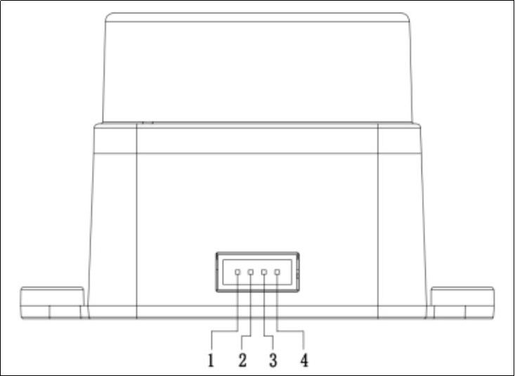

<table border="1">
<thead>
<tr>
<th>No.</th>
<th>Signal Name</th>
<th>Type</th>
<th>Description</th>
<th>Minimum Value</th>
<th>Typical Value</th>
<th>Maximum Value</th>
</tr>
</thead>
<tbody>
<tr>
<td>1</td>
<td>Tx</td>
<td>Output</td>
<td>Radar data output</td>
<td>0V</td>
<td>3.3V</td>
<td>3.5V</td>
</tr>
<tr>
<td>2</td>
<td>PWM</td>
<td>Input</td>
<td>Motor control signal</td>
<td>0V</td>
<td>-</td>
<td>3.3V</td>
</tr>
<tr>
<td>3</td>
<td>GND</td>
<td>Power</td>
<td>Power negative</td>
<td>-</td>
<td>0V</td>
<td>-</td>
</tr>
<tr>
<td>4</td>
<td>P5V</td>
<td>Power</td>
<td>Power positive</td>
<td>4.5V</td>
<td>5V</td>
<td>5.5V</td>
</tr>
</tbody>
</table>

**1.2.3.5 6-Microphone Array Module**

This module is an optional hardware component. It enables voice wake-up and voice control functions on the robot. For courses related to the microphone array module, please refer to **[1. Tutorials\9. Voice Control Course](https://wiki.hiwonder.com/projects/ROSpider/en/latest/docs/9.%20Voice%20Control%20Course.html)**.

This robot utilizes a six-channel microphone array adopting a planar distribution structure. It consists of six microphones that sample and process the spatial characteristics of the sound field. It can perform sound source localization and suppress background noise, interference, reverberation, and echo, achieving 360° equivalent audio reception.

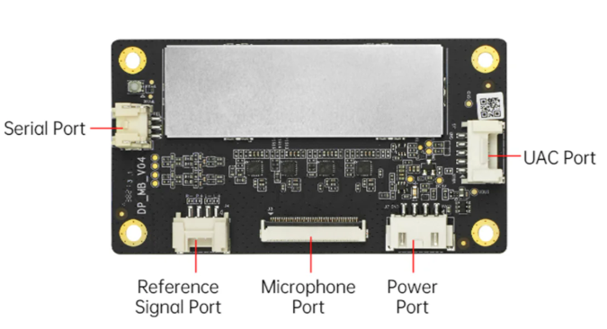

<table border="1">
<thead>
<tr>
<th>Interface</th>
<th>Description</th>
</tr>
</thead>
<tbody>
<tr>
<td>UAC Interface</td>
<td>Audio output interface</td>
</tr>
<tr>
<td>Reference Signal Interface</td>
<td>Amplifier/Echo cancellation reference signal</td>
</tr>
<tr>
<td>Independent Power Interface</td>
<td>Power input interface, used to connect to power</td>
</tr>
<tr>
<td>Microphone Interface</td>
<td>Connects the 6-microphone array and supports linear microphones</td>
</tr>
<tr>
<td>Serial Interface</td>
<td>Upper-level computer communication interface, used to communicate with PC or embedded devices</td>
</tr>
</tbody>
</table>
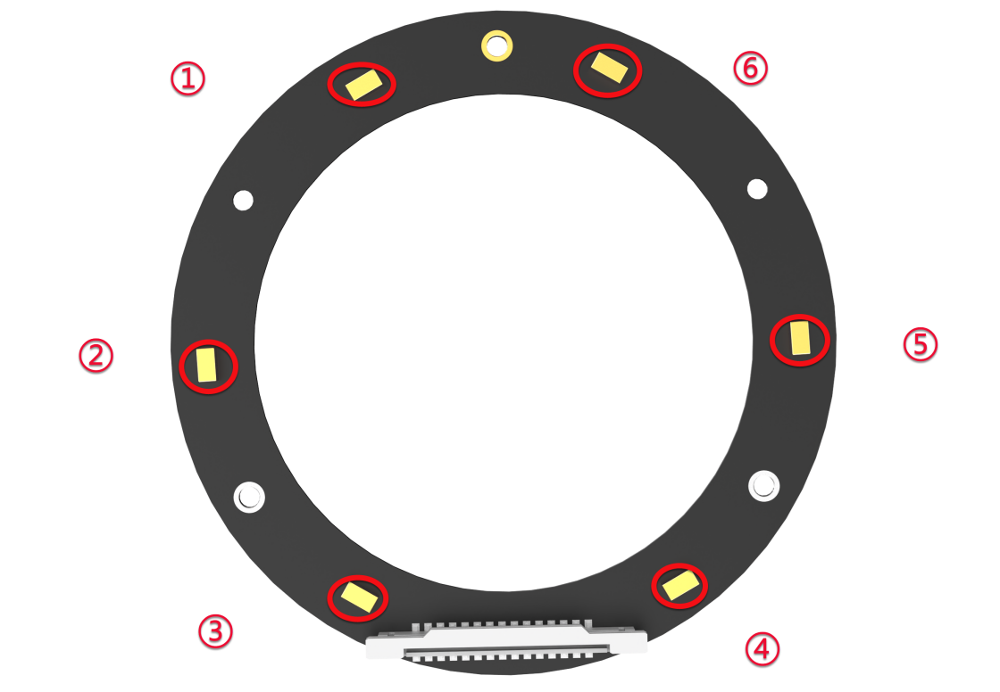

For more information, please consult the **[4. Hardware Materials\Microphone Array](https://drive.google.com/drive/folders/1SHBySUxUyhu8klCVsFCp_3jWskAuYuTP?usp=sharing)** document content.

**1.2.3.6 WonderEcho Pro**

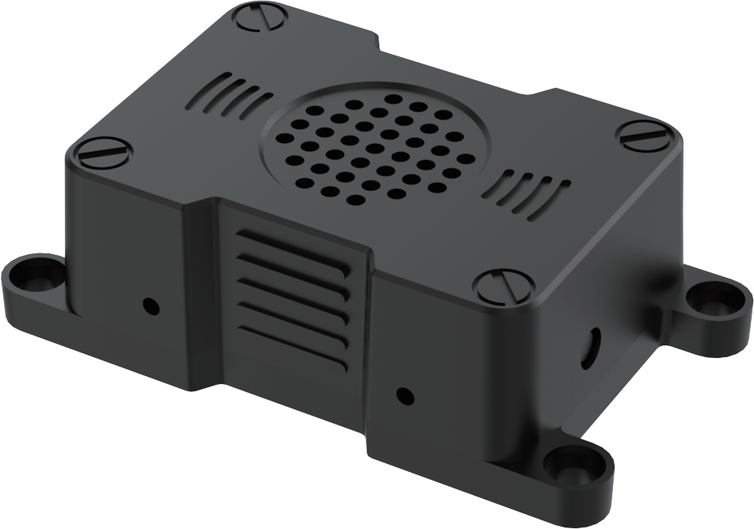

WonderEcho Pro, also known as the AI voice interaction box, features a built-in high-performance noise-canceling microphone and a high-fidelity speaker. It utilizes a USB-to-audio module, offering driver-free plug-and-play functionality and compatibility with multiple systems for playback and recording.

It integrates various voice processing technology modules and employs advanced noise suppression algorithms to effectively filter background noise from the environment, supporting a complete workflow from wake-up to voice recognition and interaction. The interaction box utilizes a modular design, allowing each functional component, such as wake-up, detection, recognition, and synthesis, to be developed and tested independently.

For more information, please consult the **[1. Tutorials\9. Voice Control Course](https://wiki.hiwonder.com/projects/ROSpider/en/latest/docs/9.%20Voice%20Control%20Course.html)** document content.

**1.2.3.7 Bus Servo**

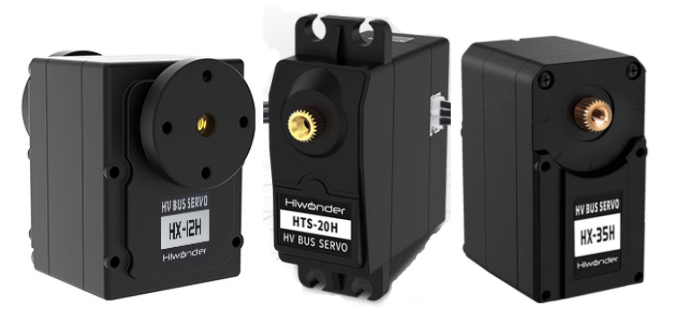

ROSpider is composed of 24 intelligent high-voltage bus servos connected by metal sheet parts. There are three types of servos: HX-12H bus servo, HTS-20H bus servo, and HX-35H bus servo.

For more detailed information, please consult the **[4. Hardware Materials\Bus Servo](https://drive.google.com/drive/folders/1SHBySUxUyhu8klCVsFCp_3jWskAuYuTP?usp=sharing)** document content.

## 1.3 Basic Robot Usage

This section covers the power-on state of the robot and the functional inspection of various modules. After completion, proceed to subsequent chapters to learn about app control and wireless controller control.

If remote tools are required to connect to the robot for further learning of related applications and to view programs, please refer to the content under section **[1.4 Development Environment Setup](#p1-4)** in this document.

### 1.3.1 Charging Instructions

Since the robot must be powered off during transportation and the battery cannot be fully charged, it is necessary to connect the battery adapter cable prior to first use and then perform charging. Charging the battery from 10V to approximately 12.3V takes about 2 to 3 hours.

**1.3.1.1 Lithium Battery Usage Precautions**

1. Please use the dedicated charger provided in the kit to charge the robot. Turn off the robot switch while charging. Do not use the robot while the battery is charging.
2. When the charger is connected to the battery without being plugged into a power source, its indicator light will show green. During charging, the charger indicator light is red. When fully charged, the indicator light will turn green again.
3. Upon completion of charging, promptly unplug the charging cable to prevent overcharging from damaging the battery.
4. When the battery voltage falls below 10V, the expansion board buzzer emits a 'beep-beep' alarm sound. To ensure stable robot operation, it must be charged first before performing any corresponding operations.
5. If the robot is not expected to be used for a long period, please charge the battery fully and disconnect the battery adapter cable from the power cable.
6. The battery should be stored in a cool and dry environment to prevent battery life reduction due to overheating, moisture, etc. Do not hit, throw, or trample on the battery.
7. Do not use the battery in an environment with strong static electricity or strong magnetic fields, as this can easily damage the battery's safety protection devices.
8. Do not plug the battery into a power outlet, and do not use metal objects to connect the positive and negative terminals of the battery.
9. An inherent characteristic of lithium batteries is that over-discharging will prevent them from accepting a charge, potentially leading to battery scrapping. If the battery is not used for a long time, please charge it fully first.
10. It is strictly prohibited to privately modify, weld, or alter the battery charger or lithium battery.
11. Store the battery away from high temperatures and all kinds of liquids to prevent overheating, fire, or moisture from causing functional degradation or reduction.

> [!NOTE]
> **Solemn Declaration: No responsibility will be assumed for any product damage, economic loss, or safety accidents caused by failure to follow the above specifications. Please strictly adhere to the precautions and battery usage specifications!**

**1.3.1.2 Charging Method**

> [!NOTE]
> **Before using the robot for the first time, ensure that the battery at the bottom of the robot and the adapter cable are properly connected. The two screws at the bottom can be unscrewed to open the sheet metal parts for inspection.**

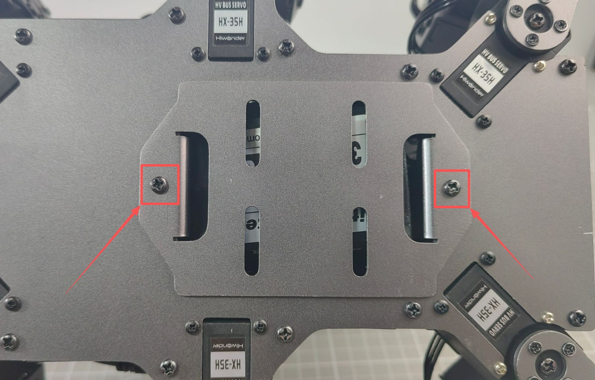

1. Ensure the robot's switch is toggled to OFF.

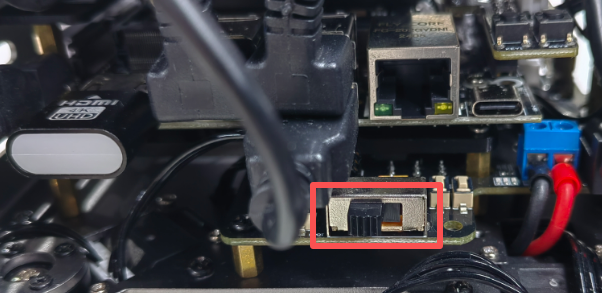

2. Insert the 12.6V charger plug into the charging port of the STM32 controller from the side to charge.

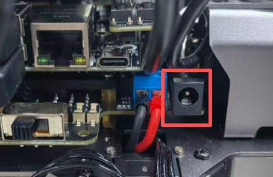

3. The charging status can be checked by observing the indicator light on the charger. Red indicates charging, and green indicates charging is complete.

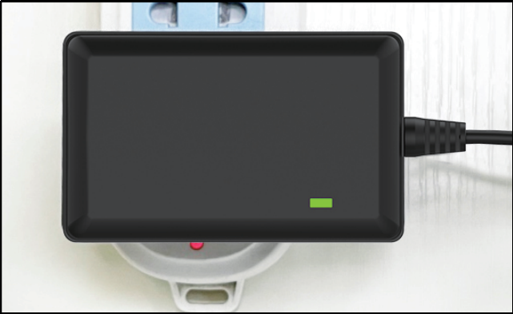

> [!NOTE]
> **After charging is complete, promptly unplug the charger to avoid battery overcharging.**

<p id ="p1-3-2"></p>

### 1.3.2 Initial Power-on and Inspection

**1.3.2.1 Precautions Before Power-on**

1. To ensure the stability of the body's operation, please charge the battery promptly when the battery voltage falls below 10V.
2. Do not place the robot on the edge of a high platform to prevent damage from falling from a height.
3. Ensure that the robot is on a flat surface during use.
4. Do not stack the robotic arm to avoid starting in a stalled state, which may damage the servos.
5. Do not leave the robotic arm operating under high load power for a long time, as this will shorten the service life of the servos or damage them directly.
6. Before starting, maintain a safe distance from the robot within a certain range to avoid injury from contact with the body after powering on.
7. Inspection requires ensuring correct wiring, correct connection of the virtual display emulator and wireless controller receiver, audio turned on at the top right corner of the desktop, and the robot being fully charged.

**1.3.2.2 Power-on State and Inspection Instructions**

> [!NOTE]
> **Before powering on, the robot must be placed in the correct posture. An incorrect placement posture may cause the robot servos to stall.**

**Correct Posture:**

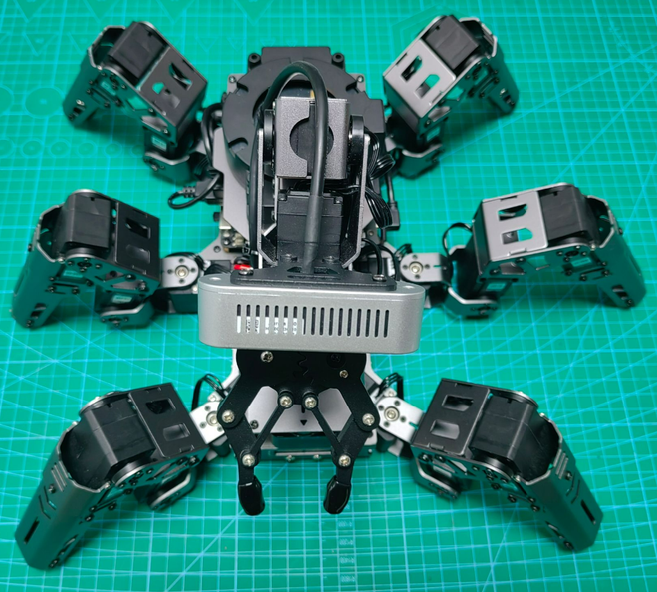

**Incorrect Posture:**

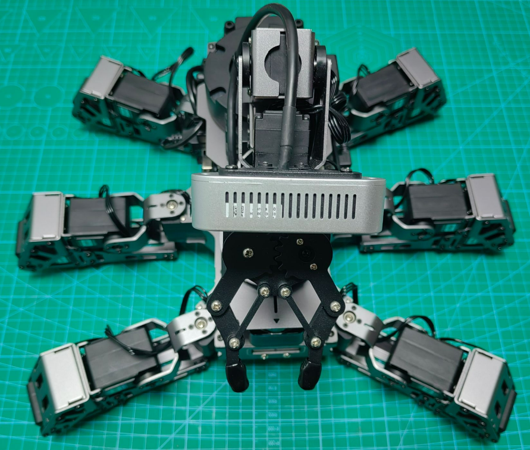

1. Place the robot on a flat, smooth surface and turn on the switch on the right side of the robot. At this time, the red LED (PWR) light and the blue LED light on the STM32 control board will illuminate and remain steady.


2. The blue LED 1 at the bottom right of the expansion board will illuminate and keep blinking. At this time, only the network configuration service is started, but the ROS system and other services have not finished booting. Wait for the buzzer to emit a short beep for machine reset, indicating the device has finished booting.

**Jetson Series Controller:**

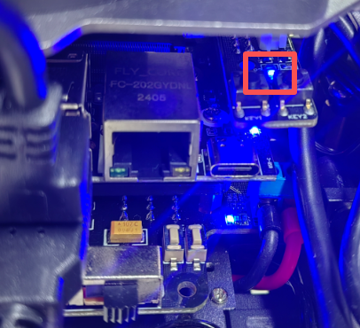

**Raspberry Pi 5 Controller:**

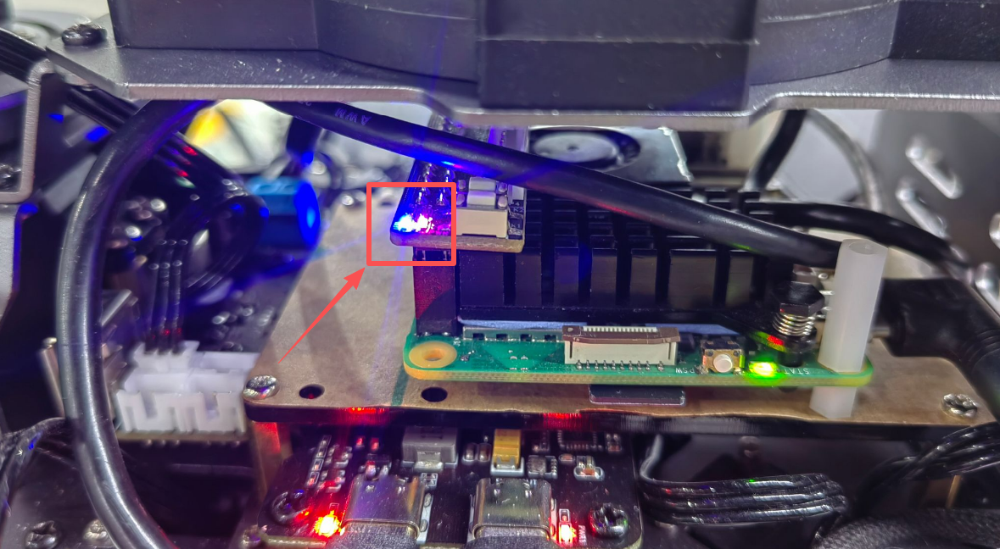

**Robot Reset Posture:**

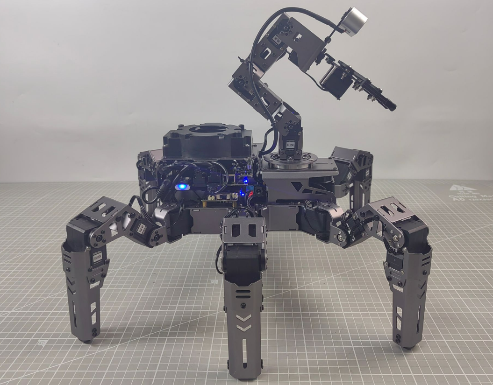

> [!NOTE]
> **If the buzzer does not emit a short beep, it indicates that hardware such as the IMU, buzzer, or buttons may have problems. Usually, this does not happen under normal use. If the above problems occur, please contact customer service for processing.**

3. The factory default setting is AP Direct Connection Mode. After a successful boot, a hotspot starting with **WN** will be generated. The password **12345678** must be entered when connecting via the app or remote desktop.

> [!NOTE]
> **If the device hotspot cannot be found, troubleshooting can be performed from below:**
>
> * **Check step 2 above to ensure whether LED1 on the expansion board is solid blue and blinking.**
> * **Insert a Type-C cable into the Type-C port of the Jetson controller, and remotely connect to the robot system desktop to check if the robot boots normally. For how to remotely connect, please refer to [1.4.2.3 Type-C Data Cable Fixed IP Connection](#1.4.2.3).**
>

4. Next, refer to the table below to inspect the hardware modules:

<table border="1">
<tr>
<th style="background-color: ;">Module</th>
<th style="background-color: ;">Inspection Steps</th>
<th style="background-color: ;">Status</th>
</tr>
<tr>
<td>Expansion Board LED</td>
<td>Observe the illumination and blinking of the LED</td>
<td>Factory default is AP Direct Connection mode, LED is blue and blinking, indicating the network service configuration is complete.</td>
</tr>
<tr>
<td>Buzzer</td>
<td>Check for short beep</td>
<td>The buzzer emits a short beep, indicating the hardware on the expansion board is normal.</td>
</tr>
<tr>
<td>Button KEY1 on Expansion Board</td>
<td>Switch network status</td>
<td>After connecting to the STA LAN mode via the app, long-press the KEY1 key to see if the LED1 indicator blinks</td>
</tr>
<tr>
<td>Six-Microphone Array</td>
<td>After booting, there will be a voice broadcast "I'm ready" </td>
<td>Responds to the wake-up word. After booting, say "Hello Hiwonder" to the robot, and the microphone will give a voice feedback "I'm here"</td>
</tr>
<tr>
<td>Depth Camera + Robotic Arm</td>
<td>
1) Open the app and connect to the robot.
2) Open the "Robot Control" interface to view the current return image from the depth camera.
3) Bring up the robotic arm control buttons and drag each joint servo sequentially.
   </td>
   <td>Real-time return image is displayed and servos rotate</td>
   </tr>
   <tr>
   <td>STM32 Controller</td>
   <td>After booting, control via wireless controller or the app's "Robot Control" interface.</td>
   <td>The robot can be controlled normally.</td>
   </tr>
   </table>


<p id ="p1-3-3"></p>

### 1.3.3 App Installation and Connection

The app **WonderNex** can be used to control the robot. This section explains how to obtain the app installation package.

There are two ways to obtain the app: one is to download and install from the application store, and the other is to obtain the installation package from the Hiwonder official website.

> [!NOTE]
> * **Please grant all permissions to the app to avoid affecting its normal use.**
> * **Before opening the app, turn on the phone's GPS location and Wi-Fi functions, and turn off cellular data.**
>

**1.3.3.1 App Installation**

* **Method One: Mobile Application Store**

Android System: The app installation package is located in the **[2. Softwares\App Installation Package](https://drive.google.com/drive/folders/1XVdQxgO1nwjS2LK_cEEF1u2-p9RqMtPO?usp=sharing)** directory, which can be imported into the phone for installation.

iOS System: Open the App Store, search for **WonderNex**, and proceed with the installation.

* **Method Two: Hiwonder Official Website**

1. Visit the Hiwonder course official website at https://www.hiwonder.net/app-software.

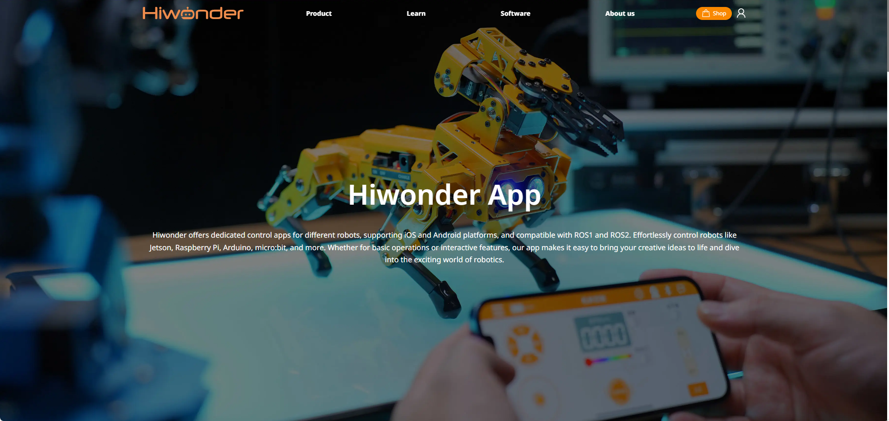

2. Click **Software** and switch to the **Robot Control App** interface.

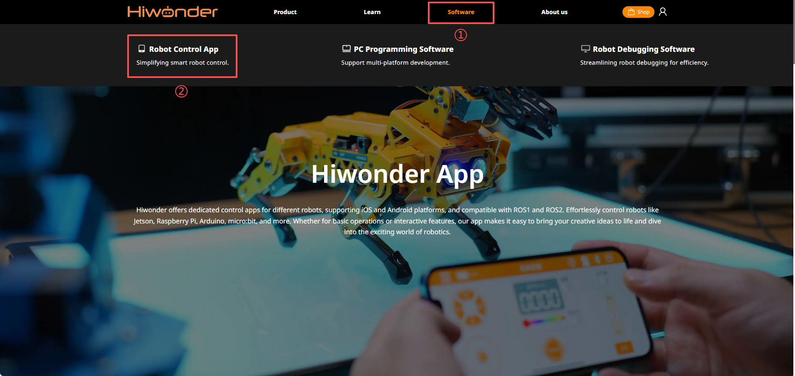

3. Locate **WonderNex**. The method to obtain the app installation package can be chosen based on actual circumstances.


The following table details feasible download schemes for various situations:

<table border="1">
<tr>
<th style="background-color: ;">Client</th>
<th style="background-color: ;">Mobile System</th>
<th style="background-color: ;">Operation</th>
<th style="background-color: ;">Corresponding Result</th>
</tr>
<tr>
<td>PC Client</td>
<td>Android System</td>
<td>Click "Android Download"</td>
<td>The browser will automatically start downloading the APP installation package. Once downloaded, it can be imported into the phone for installation.</td>
</tr>
<tr>
<td rowspan="2">Mobile Client</td>
<td>Android System</td>
<td>
Click "Android Download" and scan the QR code with the phone
</td>
<td>It will automatically start downloading the app installation package. Once downloaded, install directly.</td>
</tr>
<tr>
<td>iOS System</td>
<td>
Click "iOS Download" and scan the QR code with the phone
</td>
<td>It will automatically redirect to the App Store for direct installation.</td>
</tr>
</table>


**1.3.3.2 Connection Mode Introduction**

After installing the app, the robot can be connected by the following steps. Below are the two network modes of the robot:

1. AP Direct Connection Mode: The development board can activate a hotspot to be connected by the phone, but cannot connect to external networks.
2. STA LAN Mode: The development board can proactively connect to a specified hotspot/Wi-Fi and can connect to external networks.

**The robot defaults to AP Direct Connection Mode. Regardless of whether AP Direct Connection or STA LAN Mode is chosen, the robot's application functions remain identical.**

It is recommended to first learn the configuration method of the direct connection mode to experience the corresponding functions, while the LAN mode can be reviewed selectively based on needs.

**1.3.3.3 Direct Connection Mode Connection (Must-Read)**

The Android system is used as an example for demonstration. This operational process also applies to the iOS system.

1. Open the app **WonderNex** and tap **ROSpider**.

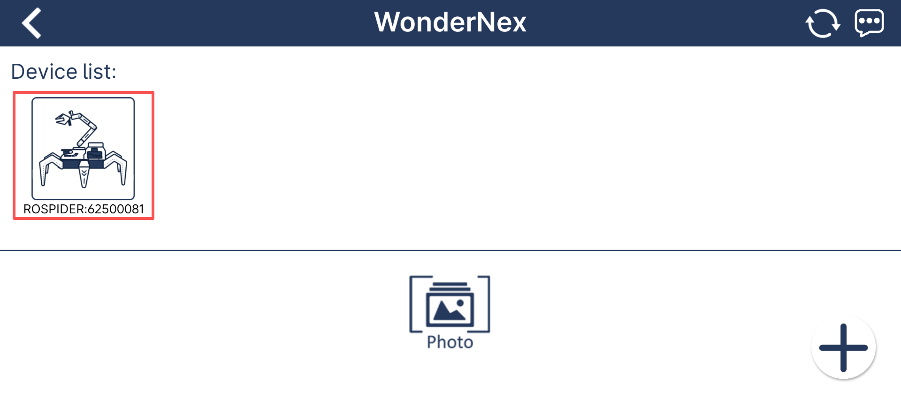

2. Click the **+** button at the bottom right of the interface and select **Direct Connection Mode**.

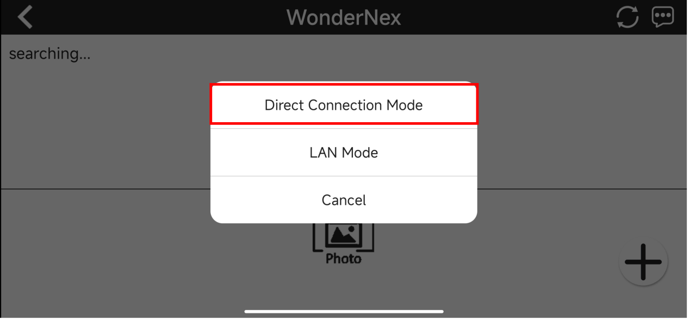

> [!NOTE]
> **If a LAN mode connection is desired, refer to the directory [1.3.3.4 LAN Mode Connection (Optional)](#anther1.3.3.4).**

3. Click the **Go to connect device hotspots** button to proceed to the settings interface and connect to the hotspot generated by the robot.

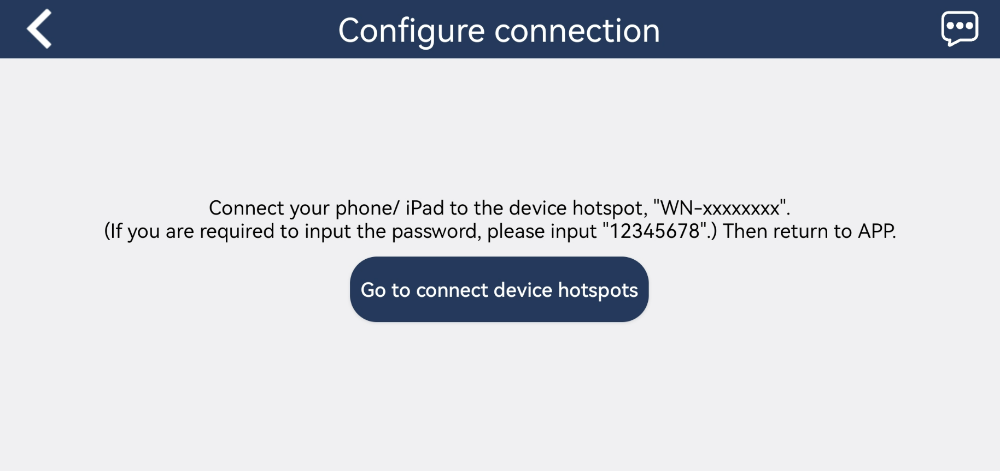

4. The hotspot name starts with **WN**, and the hotspot password is **12345678**.

> [!NOTE]
> **In the iOS system, it is necessary to wait for the phone status bar to display the Wi-Fi icon**  **before returning to the app; otherwise, the device may not be found. If the device cannot be found, click the refresh icon at the top right of the app interface** .

5. Return to the app, click the corresponding robot icon to enter the mode selection interface.

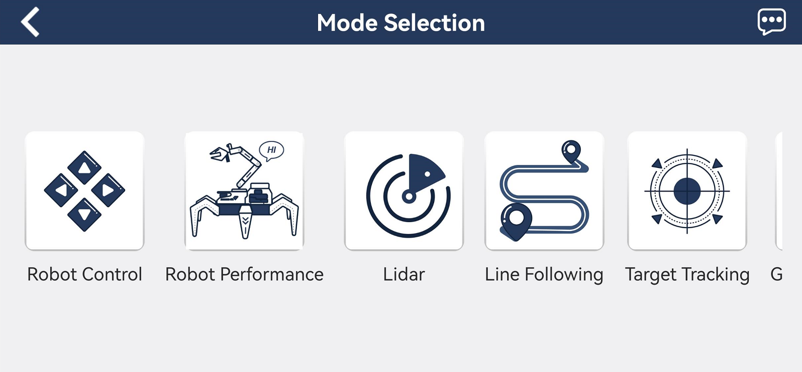

> [!NOTE]
> **If the prompt "Network unavailable, do you want to continue connecting?" appears, simply click the "Keep Connection" button.**

6. If prompted **Whether to switch and enter the searched product interface?**, it indicates an incorrect product selection in Step 1. Click the **OK** button to switch directly to the mode selection interface of the correct version.

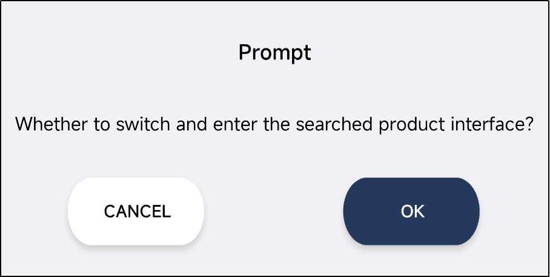

7. The mode selection interface is shown as follows:


To understand the specific usage methods of each mode, refer to the content under the directory **[1.3.4.2 App Application Overview](#1.3.4.2)**.

<p id ="anther1.3.3.4"></p>

**1.3.3.4 LAN Mode Connection (Optional)**

1. First connect the phone to a 5G network. Here, connecting to the "Hiwonder_5G" Wi-Fi is taken as an example. For dual-band routers, when dual bands are configured separately, the Wi-Fi names are separated by default. For instance, Hiwonder is the 2.4G band, and 5G is the 5G band.

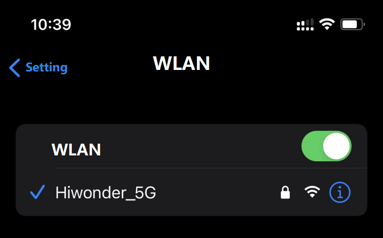

2. Open the app **WonderNex** and click **ROSpider**.
3. Then click the **+** button at the bottom right and select **LAN Mode**.

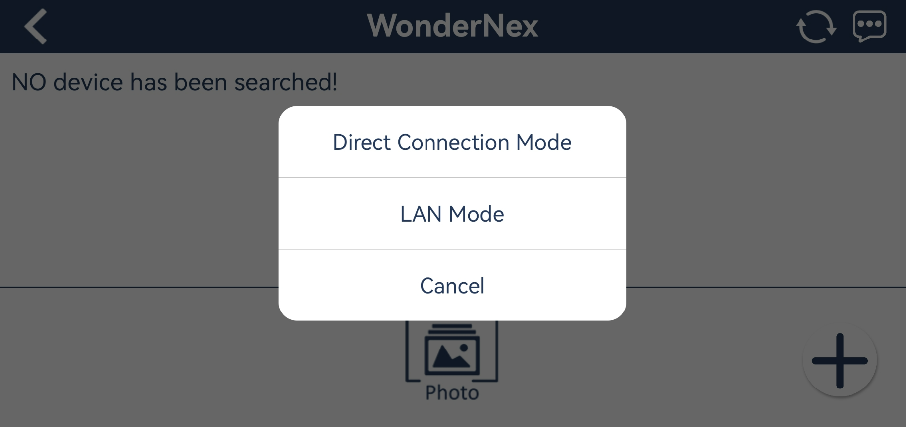

4. The app will prompt for the password of the connected Wi-Fi. Please confirm whether the entered password is correct, because an incorrect entry will lead to connection failure. Once entered, click **OK**.

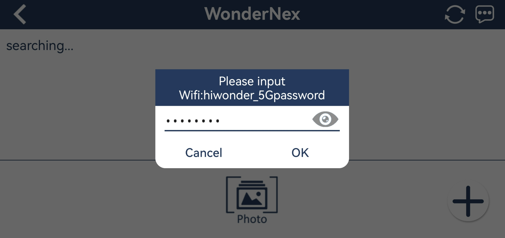

5. Then click **Go to connect device hotspots**.

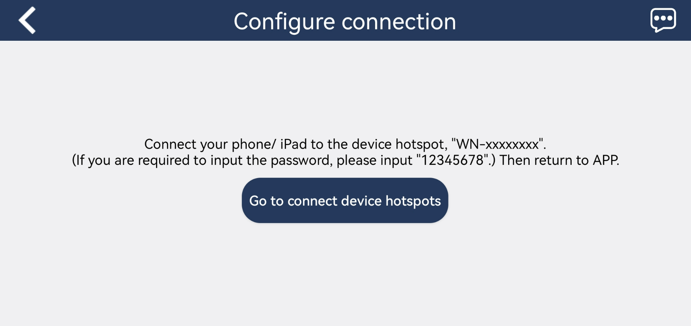

6. It will automatically redirect to the Wi-Fi connection page. Locate the hotspot starting with **WN**, enter the password **12345678**, and then click the **Return** icon upon completion.
7. At this point, the app will be observed to have started connecting.

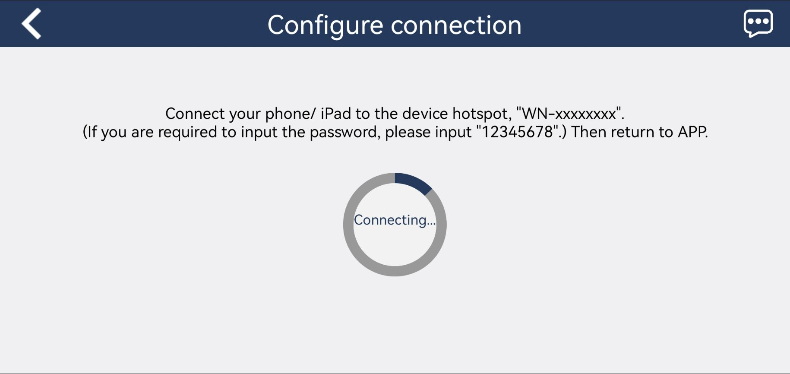

8. Wait a moment, the main interface will display the corresponding robot icon and name, and LED1 on the expansion board will remain steady.
9. Long-press the robot icon in the app to view the IP address and device ID assigned to the robot.

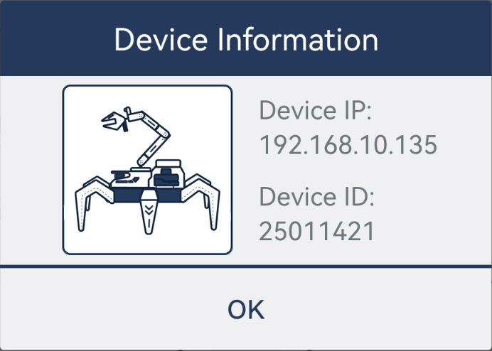

10. Its IP address can be searched on a remote desktop connection tool to establish a connection. Specific connection methods can be referred to in the **[1.4 Development Environment Setup](#p1-4)** course content.
11. To switch the LAN mode back to the direct connection mode, long-press the KEY1 button on the expansion board until the blue light blinks, indicating the switch is complete.

### 1.3.4 App Control

The app **WonderNex** can be used to control the robot and experience some of the AI visual functions. This section will explain the operation methods of various functions in the app. Furthermore, this section uses the iOS system as an example, but the methods also apply to the Android system.

**1.3.4.1 Preparations**

1. Power on the robot. For information on the power-on state, refer to the document under the directory **[1.3.2 Initial Power-on and Inspection](#p1-3-2)**.
2. Install the app **WonderNex** and connect the robot. For specific operational steps, refer to the content under section **[1.3.3 App Installation and Connection](#1-3-3)** in this document.

<p id ="1.3.4.2"></p>

**1.3.4.2 App Application Overview**

The app provides 6 application modes: Robot Control, Robot Performance, LiDAR, Line Following, Target Tracking, and Gesture Control.


The following table presents a brief description of each application mode:

<table>
<thead>
<tr>
<th>Icon</th>
<th>Application Mode</th>
<th>Description</th>
</tr>
</thead>
<tbody>
<tr>
<td></td>
<td>Body Remote Control</td>
<td>Controls the movement of the robot, allows switching of gaits, and adjusts parameters such as stride length, speed, and pitch angle.</td>
</tr>
<tr>
<td></td>
<td>Robot Performance</td>
<td>Can execute built-in action groups and custom action groups, and the self-balancing function can be enabled.</td>
</tr>
<tr>
<td></td>
<td>LiDAR</td>
<td>Provides three modes: LiDAR obstacle avoidance, LiDAR following, and LiDAR guarding.</td>
</tr>
<tr>
<td></td>
<td>Line Following</td>
<td>Prepares lines, select the line color as the target recognition color, and the robot will travel along the line.</td>
</tr>
<tr>
<td></td>
<td>Auto Shooting</td>
<td>Select the color of the target object, and the robot will track it.</td>
</tr>
<tr>
<td>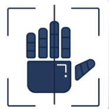</td>
<td>Gesture Control</td>
<td>Recognizes specific gesture actions, and the robot will provide corresponding feedback.</td>
</tr>
</tbody>
</table>


**1.3.4.3 Robot Control**

* **Interface Introduction**

Click **Robot Control** in the mode selection interface to enter the operational interface for this application.

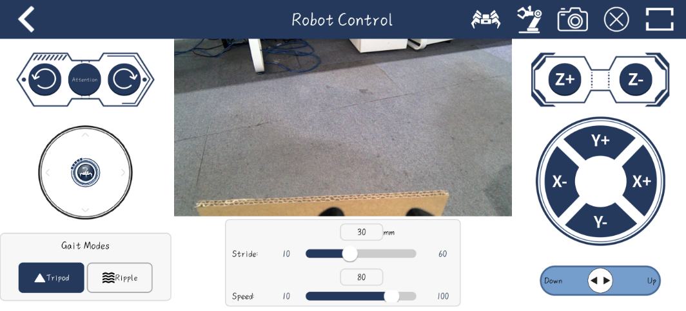

* **Function Description**

<table>
<thead>
<tr>
<th>Icon</th>
<th>Function Description</th>
</tr>
</thead>
<tbody>
<tr>
<td>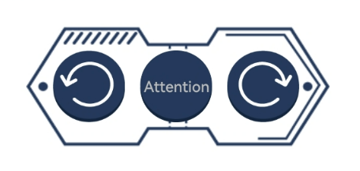</td>
<td>The buttons on both sides are used to control the robot's left and right rotation. The "Attention" button is used to restore the robot to its initial posture.</td>
</tr>
<tr>
<td></td>
<td>Dragging the joystick controls the hexapod robot to move forward, backward, left, and right.</td>
</tr>
<tr>
<td>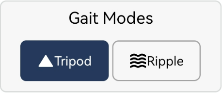</td>
<td>Selects the robot's movement gait.</td>
</tr>
<tr>
<td>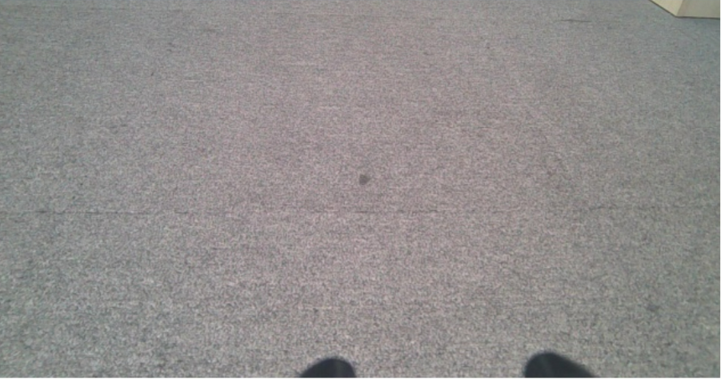</td>
<td>Displays the current real-time image return.</td>
</tr>
<tr>
<td>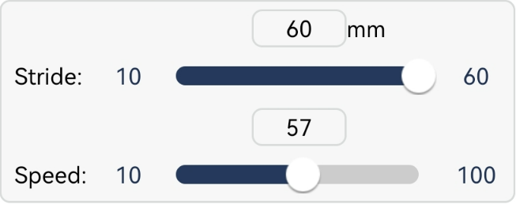</td>
<td>Adjusts the robot's movement stride, numerical range is 10-60.<br />Adjusts the robot's movement speed, numerical range is 10-100.</td>
</tr>
<tr>
<td>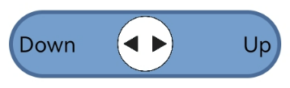</td>
<td>Adjusts the height of the robot body.</td>
</tr>
<tr>
<td></td>
<td>From the robot's first-person perspective, the "Z+" button controls the hexapod robot to twist left, and the "Z-" button controls the hexapod robot to twist right.</td>
</tr>
<tr>
<td></td>
<td>From the robot's first-person perspective, the "Y+" button controls the hexapod robot to pitch forward, i.e., body lower in front and higher in back.<br />The "Y-" button controls the hexapod robot to pitch backward, i.e., body higher in front and lower in back.<br />The "X-" button controls the hexapod robot to tilt left, i.e., body lower on the left and higher on the right.<br />The "X+" button controls the hexapod robot to tilt right, i.e., body higher on the left and lower on the right.</td>
</tr>
<tr>
      <td>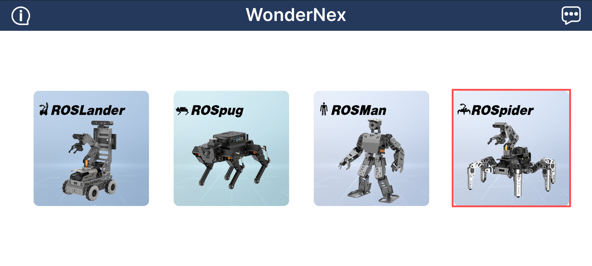</td>
      <td>Add executable action group.</td>
    </tr>
    <tr>
<td></td>
<td>Controls the movement of the robotic arm.</td>
</tr>
</tbody>
</table>


**1.3.4.4 Robot Performance**

* **Interface Introduction**

Click **Robot Performance** in the mode selection interface to enter the operational interface for this application.

1. The left side of the interface is the action group selection area, offering built-in actions and custom actions for selection.
2. The right side of the interface is the self-balancing function switch area.

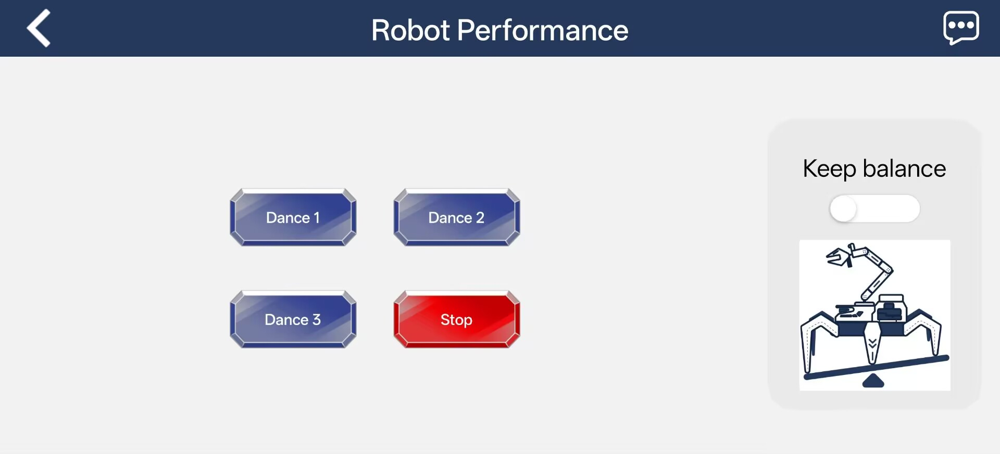

<table>
<thead>
<tr>
<th>Icon</th>
<th>Function Description</th>
</tr>
</thead>
<tbody>
<td>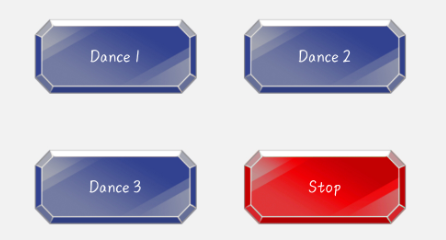</td>
<td>Click the button to control the robot to execute built-in action groups and custom action groups.</td>
</tr>
<tr>
<td>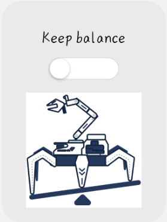</td>
<td>Enable/disable the self-balancing function of the hexapod robot.</td>
</tr>
</tbody>
</table>
**1.3.4.5 LiDAR**

* **Interface Introduction**

Click **LiDAR** in the mode selection interface to enter the operational interface for this application. This interface can be divided into two parts:

1. The left side of the interface is the feature switch and parameter adjustment area.
2. The right side of the interface is the camera return image display area.

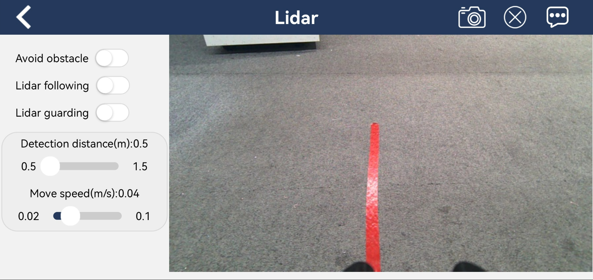

<table>
<thead>
<tr>
<th>Icon</th>
<th>Function Description</th>
</tr>
</thead>
<tbody>
<tr>
<td>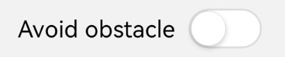</td>
<td>Enable/disable the LiDAR obstacle avoidance application.</td>
</tr>
<tr>
<td>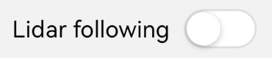</td>
<td>Enable/disable the LiDAR following application.</td>
</tr>
<tr>
<td>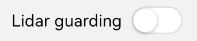</td>
<td>Enable/disable the LiDAR guarding application.</td>
</tr>
<tr>
<td>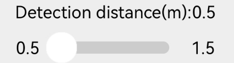</td>
<td>Adjusts the detection distance of the radar, numerical range is 0.5-1.5, unit is meters (m).</td>
</tr>
<tr>
<td>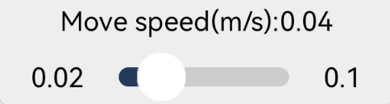</td>
<td>Adjusts the movement speed of the hexapod robot, numerical range is 0.02-0.1, unit is meters per second (m/s).</td>
</tr>
</tbody>
</table>


* **Operation Steps and Outcome**

> [!NOTE]
> **In this application, the LiDAR's detection range is an unobstructed fan-shaped area in front. After starting the application, please place obstacles within the effective detection area, otherwise, the implementation of the feature may be affected.**

1. Avoid Obstacle
Click the switch button on the right of **Avoid obstacle** to start this feature, and ROSpider will continuously move forward.
When an obstacle is detected, ROSpider will automatically steer to avoid the obstacle.
2. LiDAR Following
Click the switch button on the right of **LiDAR following** to start this feature.
When an obstacle is detected, ROSpider will adjust its position to maintain a certain distance between the body and the obstacle.
3. LiDAR Guarding
Click the switch button on the right of **LiDAR guarding** to start this feature.
When an obstacle is detected, ROSpider will adjust its body orientation so that the body faces the obstacle.

**1.3.4.6 Line Following**

> [!NOTE]
> * **Before starting the feature, please lay out a tracking track with tape and place the robot on the track.**
> * **The color picking range should be moderate, neither too large nor too small. An overly large range will include colors other than the target, while an overly small range easily loses the target. At the same time, objects with colors similar to the target color should not appear in the camera's view.**
> * **After starting the feature, ensure that there are no other objects containing the target recognition color within the camera's field of view to avoid affecting the implementation results of the feature.**
>

* **Interface Introduction**

Click **Line Following** in the mode selection interface to enter the operational interface for this feature. This interface can be divided into two parts:

1. The left side of the interface is the feature switch and color picking area.
2. The right side of the interface is the camera return image display area.

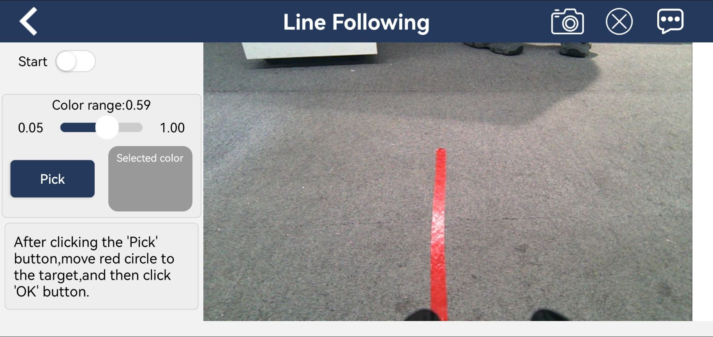

* **Function Description**

<table>
<thead>
<tr>
<th>Icon</th>
<th>Function Description</th>
</tr>
</thead>
<tbody>
<tr>
<td></td>
<td>Enable/disable application.</td>
</tr>
<tr>
<td>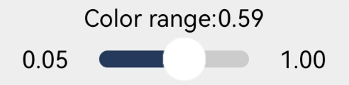</td>
<td>Adjusts the color threshold range, numerical range is 0.05-1.00.</td>
</tr>
<tr>
<td></td>
<td>Extracts the color of a designated area within the return image.</td>
</tr>
<tr>
<td>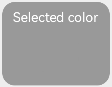</td>
<td>Displays the extracted color.</td>
</tr>
<tr>
<td></td>
<td>After clicking the "Pick" button, the button switches to the "OK" button. Used to confirm the extracted color.</td>
</tr>
<tr>
<td>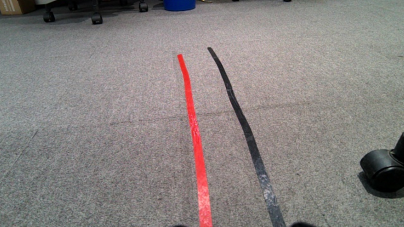</td>
<td>Displays the current camera image.</td>
</tr>
</tbody>
</table>


* **Operation Steps and Outcome**

1. After clicking the **Pick** button, drag the circle within the return image to the track to select the color.
2. After clicking the **OK** button, the currently selected color will be displayed at **Selected Color**.
3. Click the **Start** button to launch the feature, and the robot will travel along the track.

**1.3.4.7 Auto Shooting**

> [!NOTE]
> * **Ensure the target object and the robot are on the same ground level, and move the target object translationally. This provides a better experience.**
> * **The color picking range should be moderate, neither too large nor too small. An overly large range will include colors other than the target, while an overly small range easily loses the target. At the same time, objects with colors similar to the target color should not appear in the camera's view.**
>

* **Interface Introduction**

Click **Auto Shooting** in the mode selection interface to enter the operational interface for this feature. This interface can be divided into two parts:

1. The left side of the interface is the feature switch and color picking area.
2. The right side of the interface is the camera return image display area.

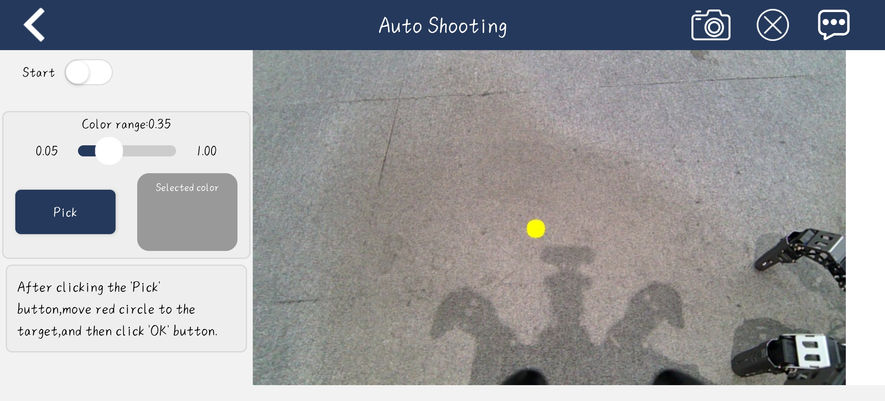

* **Function Description**

<table>
<thead>
<tr>
<th>Icon</th>
<th>Function Description</th>
</tr>
</thead>
<tbody>
<tr>
<td></td>
<td>Enable/disable application.</td>
</tr>
<tr>
<td></td>
<td>Adjusts the color threshold range, numerical range is 0.05-1.00.</td>
</tr>
<tr>
<td></td>
<td>Extracts the color of a designated area within the return image.</td>
</tr>
<tr>
<td></td>
<td>Displays the extracted color.</td>
</tr>
<tr>
<td></td>
<td>After clicking the "Pick" button, the button switches to the "OK" button. Used to confirm the extracted color.</td>
</tr>
<tr>
<td>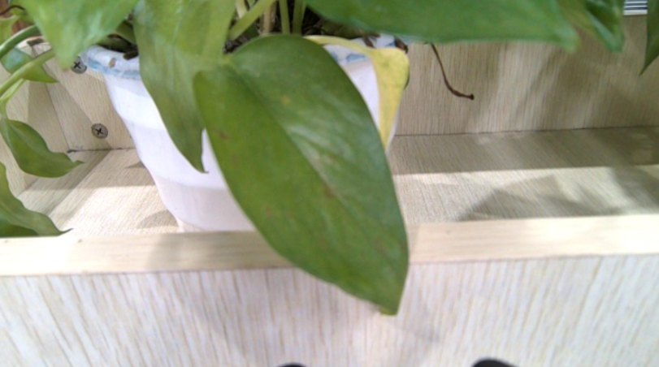</td>
<td>Displays the current camera image.</td>
</tr>
</tbody>
</table>


* **Operation Steps and Outcome**

1. After clicking the **Pick** button, drag the circle within the return image to the ball to select the color.
2. After clicking the **OK** button, the currently selected color will be displayed in the **Selected Color** area.
3. Click the **Start** button to launch the feature, and the robot will track the ball and kick it.

**1.3.4.8 Gesture Control**

* **Interface Introduction**

Click **Gesture Control** in the mode selection interface to enter the operational interface for this feature. This interface can be divided into two parts:

1. The left side of the interface is the feature switch and operation instructions.
2. The right side of the interface is the camera return image display area.

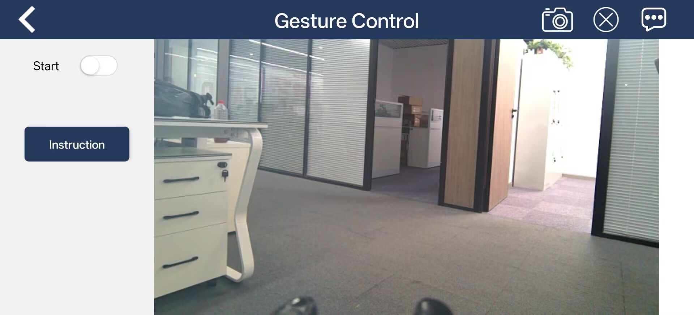

* **Function Description**

<table>
<thead>
<tr>
<th>Icon</th>
<th>Function Description</th>
</tr>
</thead>
<tbody>
<tr>
<td></td>
<td>Enable/disable feature.</td>
</tr>
<tr>
<td></td>
<td>Click to obtain operation help.</td>
</tr>
</tbody>
</table>


* **Operation Steps and Outcome**

Click the **Start** button to launch the application. Perform different gestures, and the robot will provide different action feedback.

<table>
<thead>
<tr>
<th>Gesture Name</th>
<th>Gesture Description</th>
<th>Example</th>
<th>Feedback Action</th>
</tr>
</thead>
<tbody>
<tr>
<td>rock</td>
<td>rock</td>
<td></td>
<td>Attack</td>
</tr>
<tr>
<td>thumbs_up</td>
<td>Thumbs up</td>
<td></td>
<td>Twist body</td>
</tr>
<tr>
<td>OK</td>
<td>OK</td>
<td></td>
<td>Wave arm to greet</td>
</tr>
<tr>
<td>yes</td>
<td>yes</td>
<td></td>
<td>Fast left and right rotation</td>
</tr>
</tbody>
</table>
<p id ="3.5"></p>

<p id ="p1-3-5"></p>

### 1.3.5 Wireless Controller Control

**1.3.5.1 Precautions**

1. Confirm whether the wireless controller receiver is inserted before powering on the device. If already inserted, this can be ignored. The USB wireless controller receiver is inserted into the robot upon factory default.
2. When installing batteries, it is necessary to differentiate the positive and negative terminals of the battery.

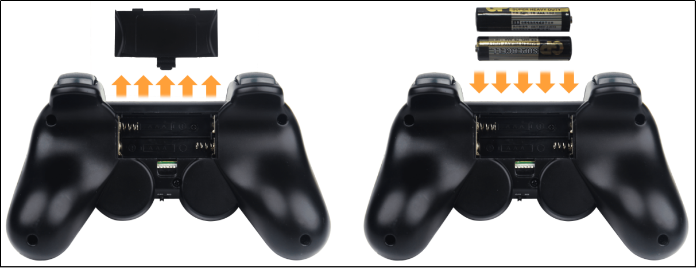

3. Every time the robot is turned on, the app auto-start service will automatically start, which includes the wireless controller control service. If the robot is not turned off, no additional operation is required before connecting with the wireless controller.
4. Since wireless controller control has cross-interference characteristics, if multiple robots are in the same venue, it is recommended not to use this function to avoid incorrect connection and control.
5. After turning on the wireless controller switch, if it is not connected to the robot within 30 seconds, or if the wireless controller is not used for 5 minutes after connecting to the robot, the wireless controller will automatically enter sleep mode. To wake up the wireless controller, i.e., exit sleep mode, simply press the **START** button.

**1.3.5.2 Device Connection**

1. After the robot finishes booting, push the wireless controller switch to the **ON** position. At this point, the two LED lights, red and green, on the wireless controller will flash simultaneously.
2. Wait a few seconds, and the robot and wireless controller will begin to pair automatically. Upon successful pairing, the green LED light will remain steady, and the red LED light will turn off.

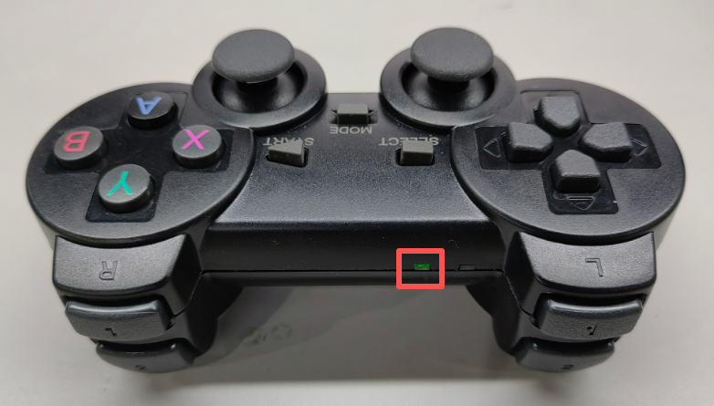

<p id ="anther1.3.5.3"></p>

**1.3.5.3 Button Descriptions**

The table below describes the functions of the wireless controller buttons and joysticks from the robot's first-person perspective:

> [!NOTE]
> * **Buttons and joysticks can be used simultaneously for linked control of the robot.**
> * **After pressing any button, the robot will continuously step in place at the gait of its last movement until any button is pressed again. After resetting the robot, it will stop stepping in place.**
> * **Press SELECT+START buttons to switch to the robotic arm control mode. One beep from the buzzer indicates body remote control mode, while two beeps indicate robotic arm control mode.**
>

<table border="1">
<thead>
<tr>
<th style="background-color: ;">Button</th>
<th style="background-color: ;">Function in Robot Control Mode</th>
<th style="background-color: ;">Description</th>
</tr>
</thead>
<tbody>
<tr>
<td>START</td>
<td>Stop and restore body / Exit sleep mode</td>
<td>Press</td>
</tr>
<tr>
<td>SELECT+START</td>
<td>Switch control mode. One beep for body control mode, two beeps for robotic arm control mode.</td>
<td>Press</td>
</tr>
<tr>
<td>L1</td>
<td>Increase movement speed / step frequency</td>
<td>Long press</td>
</tr>
<tr>
<td>L2</td>
<td>Decrease movement speed / step frequency</td>
<td>Long press</td>
</tr>
<tr>
<td>R1</td>
<td>Increase pickup arm height / step height</td>
<td>Long press</td>
</tr>
<tr>
<td>R2</td>
<td>Decrease pickup arm height / step height</td>
<td>Long press</td>
</tr>
<tr>
<td>Left Joystick Up</td>
<td>Tripod gait forward in a large stride.</td>
<td>Long press</td>
</tr>
<tr>
<td>Left Joystick Down</td>
<td>Tripod gait backward in a large stride.</td>
<td>Long press</td>
</tr>
<tr>
<td>Left Joystick Left</td>
<td>Tripod gait move left in a large stride.</td>
<td>Long press</td>
</tr>
<tr>
<td>Left Joystick Right</td>
<td>Tripod gait move right in a large stride.</td>
<td>Long press</td>
</tr>
<tr>
<td style="color: green;">Y</td>
<td>Body pitch up.</td>
<td>Long press</td>
</tr>
<tr>
<td style="color: blue;">A</td>
<td>Body pitch down.</td>
<td>Long press</td>
</tr>
<tr>
<td style="color: pink;">X</td>
<td>Ripple gait left turn in a small stride.</td>
<td>Press</td>
</tr>
<tr>
<td style="color: red;">B</td>
<td>Ripple gait right turn in a small stride.</td>
<td>Press</td>
</tr>
<tr>
<td>Up</td>
<td>Ripple gait forward in a small stride.</td>
<td>Long press</td>
</tr>
<tr>
<td>Down</td>
<td>Ripple gait backward in a small stride.</td>
<td>Long press</td>
</tr>
<tr>
<td>Left</td>
<td>Ripple gait move left in a small stride.</td>
<td>Long press</td>
</tr>
<tr>
<td>Right</td>
<td>Ripple gait move right in a small stride.</td>
<td>Long press</td>
</tr>
<tr>
<td>Right Joystick Up</td>
<td>Body ascend.</td>
<td>Long press</td>
</tr>
<tr>
<td>Right Joystick Down</td>
<td>Body descend.</td>
<td>Long press</td>
</tr>
<tr>
<td>Right Joystick Left</td>
<td>Tripod gait left turn in a large stride.</td>
<td>Long press</td>
</tr>
<tr>
<td>Right Joystick Right</td>
<td>Tripod gait right turn in a large stride.</td>
<td>Long press</td>
</tr>
</tbody>
</table>

<table border="1">
<thead>
<tr>
<th style="background-color: ;">Button</th>
<th style="background-color: ;">Function in Robotic Arm Control Mode</th>
<th style="background-color: ;">Description</th>
</tr>
</thead>
<tbody>
<tr>
<td>START</td>
<td>Stop and restore body / Exit sleep mode</td>
<td>Press</td>
</tr>
<tr>
<td>SELECT+START</td>
<td>Switch control mode. One beep for body control mode, two beeps for robotic arm control mode.</td>
<td>Press</td>
</tr>
<tr>
<td>L1</td>
<td>Servo 21 forward tilt.</td>
<td>Long press</td>
</tr>
<tr>
<td>L2</td>
<td>Servo 21 backward tilt.</td>
<td>Long press</td>
</tr>
<tr>
<td>R1</td>
<td>Servo 22 backward tilt.</td>
<td>Long press</td>
</tr>
<tr>
<td>R2</td>
<td>Servo 22 forward tilt.</td>
<td>Long press</td>
</tr>
<tr>
<td>Left Joystick Up</td>
<td>Tripod gait forward in a large stride.</td>
<td>Long press</td>
</tr>
<tr>
<td>Left Joystick Down</td>
<td>Tripod gait backward in a large stride.</td>
<td>Long press</td>
</tr>
<tr>
<td>Left Joystick Left</td>
<td>Tripod gait move left in a large stride.</td>
<td>Long press</td>
</tr>
<tr>
<td>Left Joystick Right</td>
<td>Tripod gait move right in a large stride.</td>
<td>Long press</td>
</tr>
<tr>
<td style="color: green;">Y</td>
<td>Servo 24 (Gripper) open.</td>
<td>Long press</td>
</tr>
<tr>
<td style="color: blue;">A</td>
<td>Servo 24 (Gripper) close.</td>
<td>Long press</td>
</tr>
<tr>
<td style="color: pink;">X</td>
<td>Servo 23 counterclockwise rotation.</td>
<td>Press</td>
</tr>
<tr>
<td style="color: red;">B</td>
<td>Servo 23 clockwise rotation.</td>
<td>Press</td>
</tr>
<tr>
<td>Up</td>
<td>Servo 20 forward tilt.</td>
<td>Long press</td>
</tr>
<tr>
<td>Down</td>
<td>Servo 20 backward tilt.</td>
<td>Long press</td>
</tr>
<tr>
<td>Left</td>
<td>Servo 19 (Robotic arm) left turn.</td>
<td>Long press</td>
</tr>
<tr>
<td>Right</td>
<td>Servo 19 (Robotic arm) right turn.</td>
<td>Long press</td>
</tr>
<tr>
<td>Right Joystick Up</td>
<td>Body ascend.</td>
<td>Long press</td>
</tr>
<tr>
<td>Right Joystick Down</td>
<td>Body descend.</td>
<td>Long press</td>
</tr>
<tr>
<td>Right Joystick Left</td>
<td>Tripod gait left turn in a large stride.</td>
<td>Long press</td>
</tr>
<tr>
<td>Right Joystick Right</td>
<td>Tripod gait right turn in a large stride.</td>
<td>Long press</td>
</tr>
</tbody>
</table>
<p id ="p4"></p>

<p id ="p1-4"></p>

## 1.4 Development Environment Setup

> [!NOTE]
> * **Individuals needing to execute applications on a computer or view and modify application codes should study this chapter first.**
> * **If the robot's mainboard is a Jetson Orin Nano/Orin NX, the HDMI virtual display emulator must be connected to the controller interface for the remote connection desktop to display correctly.**
>
>
> 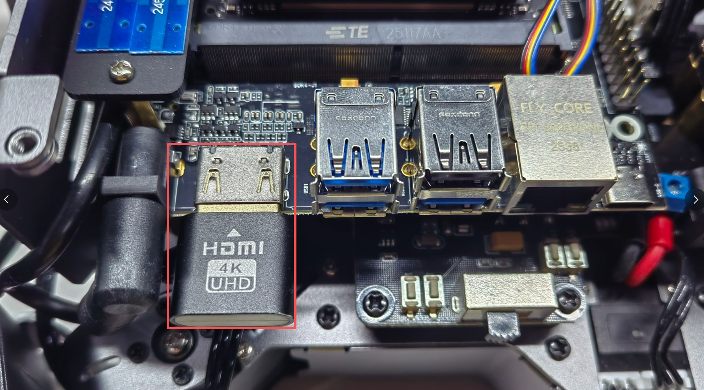

### 1.4.1 Remote Tool Introduction and Installation

**Jetson Series Controller:**

NoMachine is a graphical remote control software. Upon installation, the robot can be controlled directly on a computer by connecting to the robot's hotspot. Prior to starting, it is recommended to prepare a 5G band wireless network card for desktop computers to ensure a better experience.

Installation steps are as follows:

1. Enter the directory of this document, navigate to folder **[2. Softwares\2. Remote Desktop Software\1. Graphical Remote Desktop Access Tool](https://drive.google.com/drive/folders/1VacQOxK3gC51wm_ntJUIE9yAadvw371t?usp=sharing)**, and double-click to open the installation package **nomachine_8.4.2_10_x64.exe**.
2. Click the **Next** button.

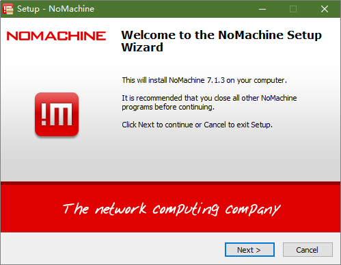

3. Select the installation language as **English**, check to accept the license agreement, and click the **Next** button.

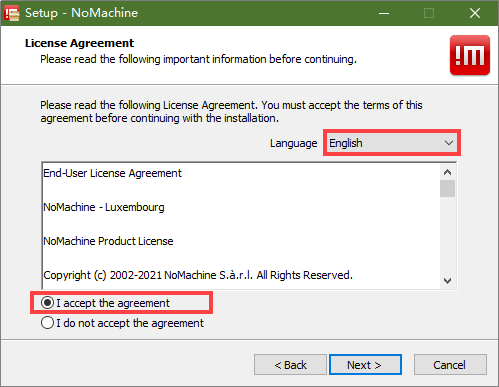

4. Keep the default installation location and click the **Next** button.

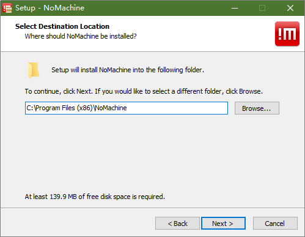

5. Wait a moment until the installation completion prompt interface appears, then simply click the **Finish** button.

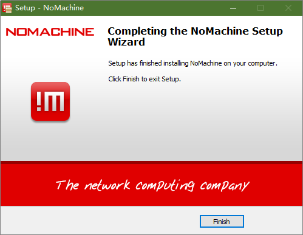

6. Click the **Yes** button to restart the computer. **Do not skip this step!**

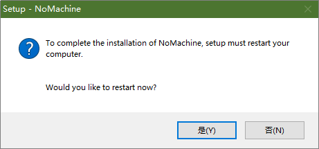

**Raspberry Pi 5 Controller:**

VNC is a graphical remote control software. Upon installation, the robot can be controlled directly on a computer by connecting to the robot's hotspot. Prior to starting, it is recommended to prepare a 5G band wireless network card for desktop computers to ensure a better experience.

Installation steps are as follows:

1. Enter the directory of this document, navigate to folder **[2. Softwares\2. Remote Desktop Software\1. Graphical Remote Desktop Access Tool](https://drive.google.com/drive/folders/1VacQOxK3gC51wm_ntJUIE9yAadvw371t?usp=sharing)**, and double-click to open the installation package **VNC-Viewer-6.17.731-Windows .exe**.
2. Select the installation language as **English** and click the **OK** button.

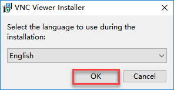

3. Click the **Next** button.

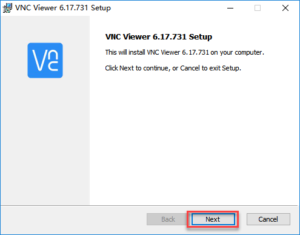

4. Check to accept the license agreement, and click the **Next** button.

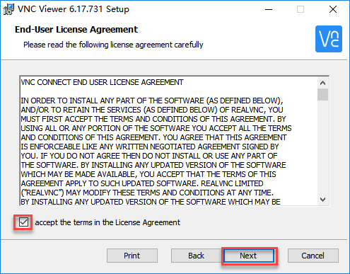

5. In the newly popped-up page, click **Install**.

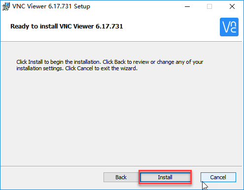

6. Wait a moment until the installation completion prompt interface appears, then simply click the **Finish** button.

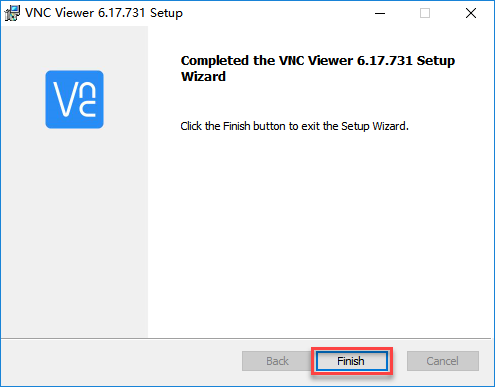

7. Once the VNC installation is complete, simply click the  icon to launch it.

### 1.4.2 Remote Device Connection

**1.4.2.1 Direct Connection Mode Connection**

**AP Direct Connection Mode: The development board can activate a hotspot to be connected by a phone, but cannot connect to external networks.**

**Jetson Series Controller:**

1. The factory default setting for the robot is AP Direct Connection Mode. After a successful boot, a hotspot starting with **WN** will be generated. This hotspot can be searched for and connected to on the computer terminal, as shown below:

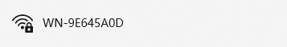

2. Open NoMachine, enter the IP address **192.168.149.1** into the search bar of the software interface, and click **Configure connection to new host 192.168.149.1**.

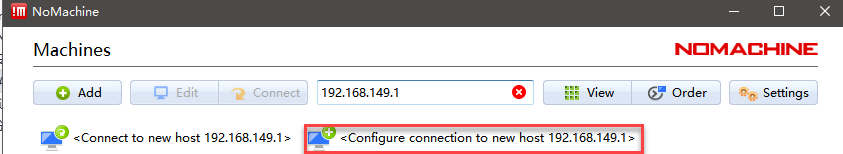

3. After opening, modify the Name field to **ROSpider**, keep other options unchanged, and then click **Connect**.

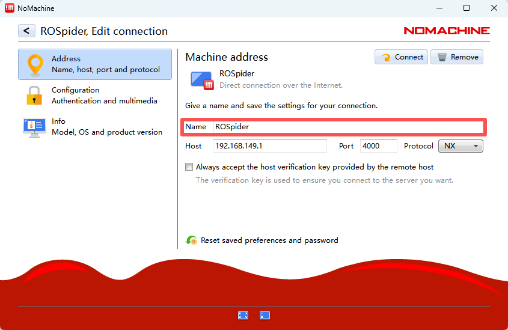

4. In the Username field, enter **ubuntu**, and in the Password field, enter **ubuntu**. Check the save password box, and click the **OK** button.

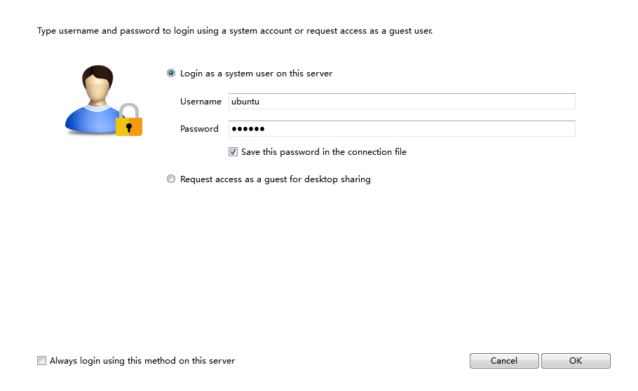

> [!NOTE]
> **If the robot has been configured to STA LAN mode, the exact same steps above can be followed, merely replacing the corresponding IP, UserName, and Password in steps 2), 3), and 4).**

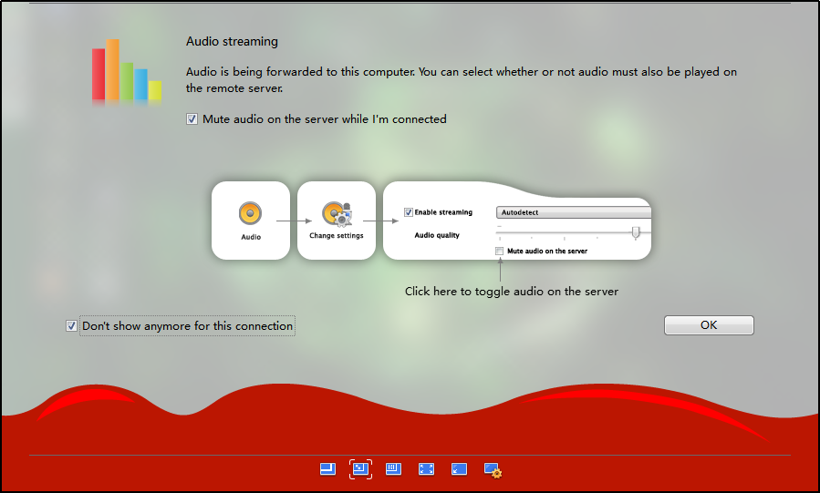

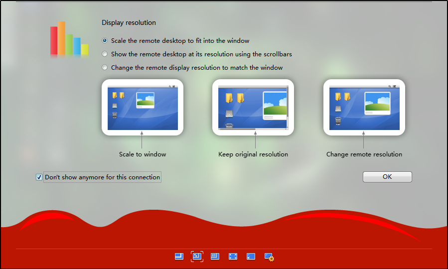

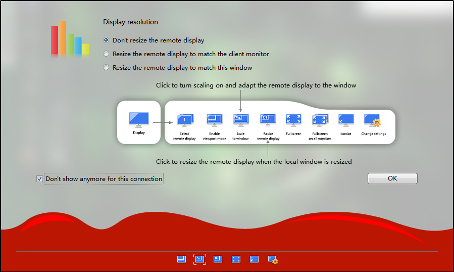

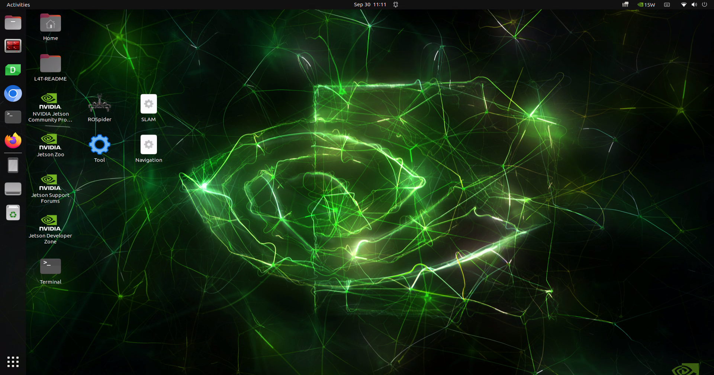

**Raspberry Pi 5 Controller:**

1. The factory default setting for the robot is AP Direct Connection Mode. After a successful boot, a hotspot starting with **WN** will be generated. This hotspot can be searched for and connected to on the computer terminal. The connection password is: **12345678**, as shown below:


2. Next, open the installed VNC client. In the opened VNC Viewer, enter the Raspberry Pi 5 IP address: **192.168.149.1** under AP mode, and press **Enter**. If prompted that it is not a secure connection, click **Continue**.

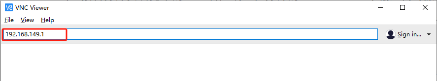

3. In the Username field, enter **pi**, and in the Password field, enter **raspberrypi**. Check the save password box, and click the **OK** button.

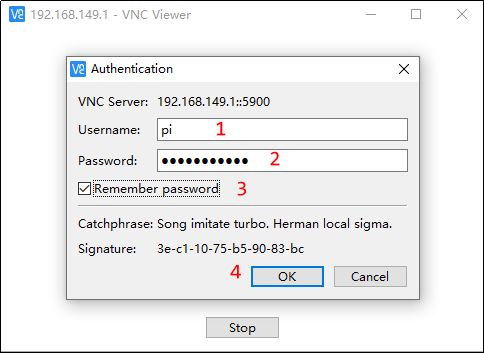

> [!NOTE]
> **If the robot has been configured to STA LAN mode, the exact same steps above can be followed, merely replacing the corresponding IP, UserName, and Password in steps 2), 3), and 4).**

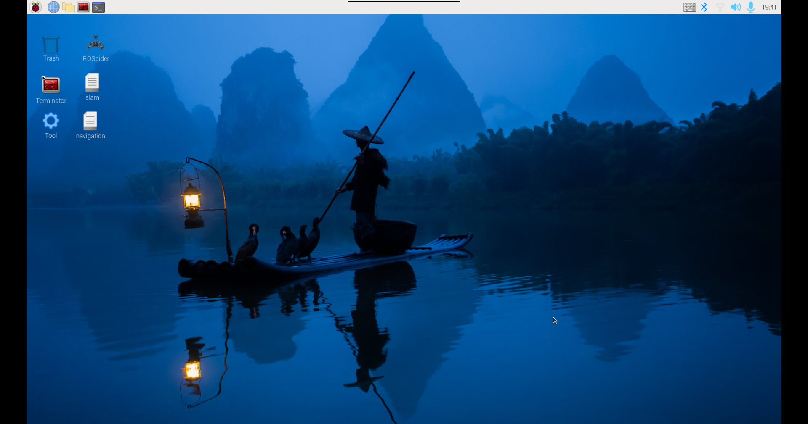

**1.4.2.2 LAN Mode Connection**

**STA LAN Mode: The development board can proactively connect to a specified hotspot/Wi-Fi and can connect to external networks.**

> [!NOTE]
> * **If a phone is to be used to configure the LAN, the phone's location service must be turned on first.**
> * **It is not possible to switch to LAN mode through the system's network configuration, as shown in the figure below, because the Wi-Fi has undergone special configuration. Relevant network configurations must be performed according to the operations later in this document.**
>

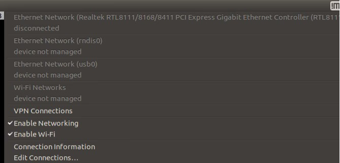

Using the Jetson controller as an example, the operational steps are as follows:

1. Click the 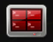 on the left side of the system desktop to open the command line terminal.

> [!NOTE]
> **For Raspberry Pi 5 controller, use the black desktop terminal. 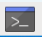**

2. Enter the command and press **Enter** to navigate to the configuration file directory.

```
cd wifi_manager
```

3. Enter the command and press **Enter** to open the configuration file.

```
gedit wifi_conf.py
```

4. First, modify the value of `WIFI_MODE` to 2. A value of 1 represents direct connection mode, where the robot autonomously generates Wi-Fi, while 2 represents LAN mode, where the robot connects to an internal local area network. Set it to 2 here.

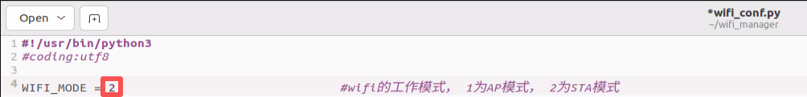

5. Next, modify `WIFI_STA_SSID` and `WIFI_STA_PASSWORD` to set them to the account and password of the router Wi-Fi. Note that the content must be enclosed in **''**. **Similarly, the robot supports connecting to 5G Wi-Fi networks.**

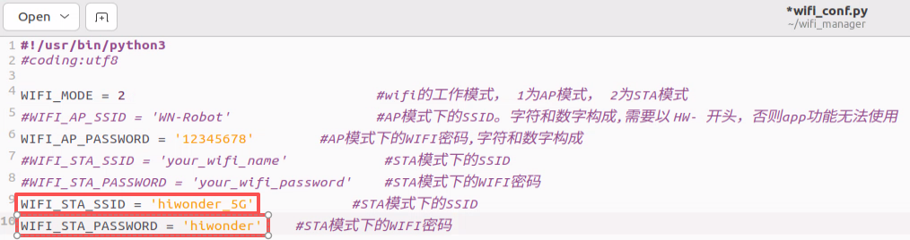

6. After confirming the input is correct, use the key combination **Ctrl + S** to save, and then click the exit button at the top right.
7. Return to the command line terminal and enter the command to restart the robot Wi-Fi service.

```
sudo systemctl restart wifi.service
```

8. To switch back to direct connection mode, re-edit this configuration file, set `WIFI_MODE` to 1, and then restart the robot Wi-Fi service following the previous step.

<p id ="1.4.2.3"></p>

**1.4.2.3 Type-C Data Cable Fixed IP Connection**

> [!NOTE]
> **This connection method is only applicable to the Jetson series controllers.**

The robot can enhance remote operational fluency by enabling Remote NDIS compatible devices and utilizing a fixed IP **192.168.55.1**. This method eliminates the need to connect to the robot's hotspot or Wi-Fi under a LAN. The specific operational steps are as follows:

1. Use a **Type-C** data cable to connect the robot to the computer.

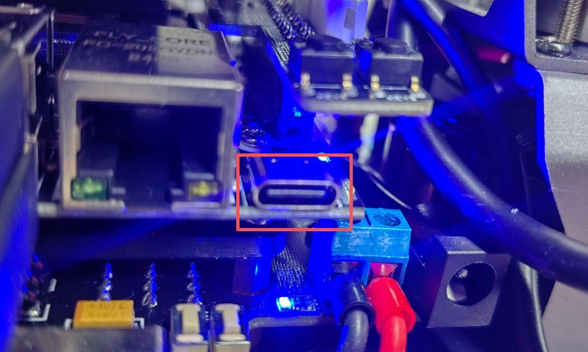

2. Right-click **This PC** on the computer desktop and select the **Manage** option.

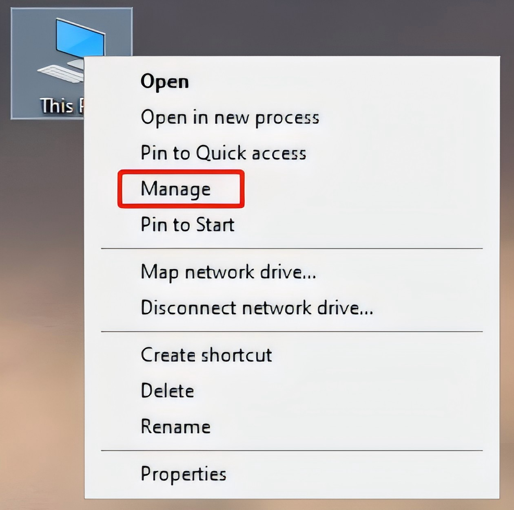

3. Click **Device Manager** in the left-side directory of the interface, locate the NDIS driver under the **Network Adapters** section, right-click this driver item, and select the **Update Driver** option.

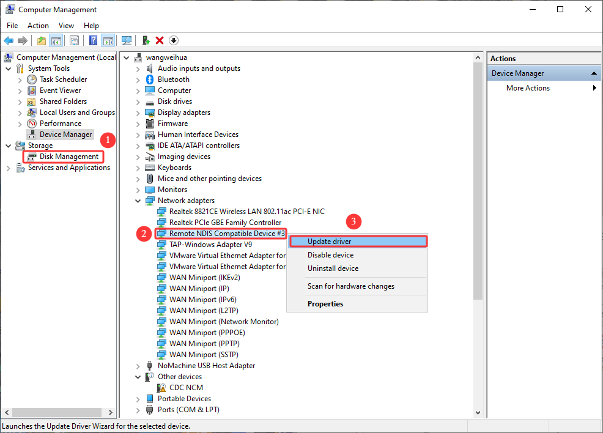

4. After completing the driver installation, refer to **Direct Connection Mode** and use the NoMachine remote connection tool to connect via the IP address **192.168.55.1**.

**1.4.2.4 SSH Connection**

Compared to NoMachine/VNC, MobaXterm does not display the robot system's desktop. It only provides a command line window, facilitating quick use of commands to control the robot. Because it does not open excessively large or numerous windows, the SSH tool also saves a portion of the computational power and memory required by NoMachine/VNC.

1. Locate the installation package in the **[2. Softwares\2. Remote Desktop Software\2. SSH Remote Login Client](https://drive.google.com/drive/folders/1zBYydgiParB25K-X1pzuNjOR3T_iHSQ4?usp=sharing)** folder under the same directory as **1. Tutorials**. Open it and follow the prompts for a one-click installation.
2. Obtain the corresponding IP by connecting the ROS mainboard via the previously mentioned **Direct Connection Mode Connection** or **LAN Mode Connection** methods.

**New Session and Connection:**

Taking the direct connection mode method as an example for explanation, the exact same steps can be referenced under LAN mode, simply replacing the IP.

(1) On the main interface, click **Session** in the upper right corner to create a new session. On the session interface, enter the recorded IP for direct connection mode **192.168.149.1**, and click the **OK** option.

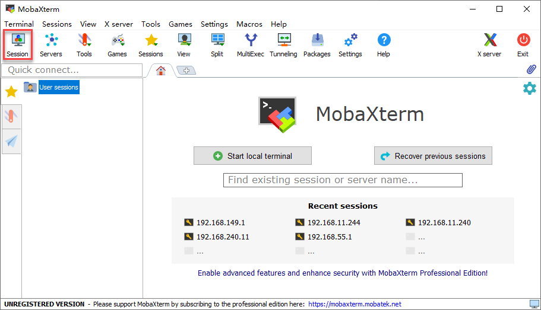

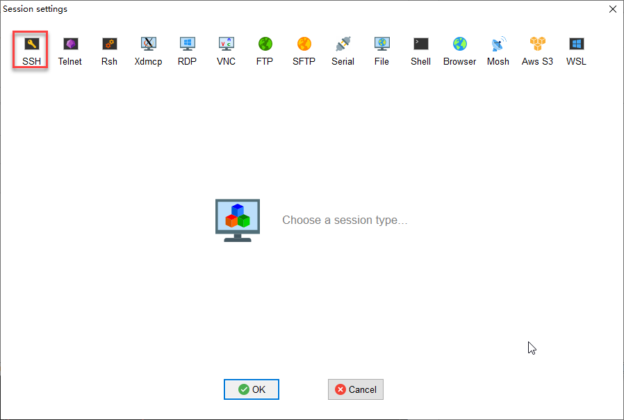

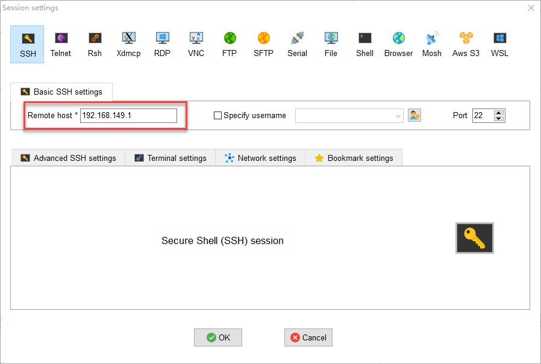

If the following image appears, simply click the third option.

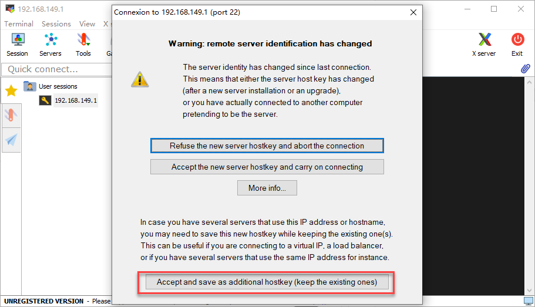

(2) The interface will prompt for an account name and password, which are identical to the account name and password of the corresponding controller under direct connection mode or LAN mode. After entering, press **Enter**. Note that password entry is the same as in Linux systems, with no visual display whatsoever.

> [!NOTE]
> **Special Note: The account name must be in lowercase. Even if the set account name contains uppercase letters, it must be lowercase upon login.**

(3) If the password is correct, system entry will be successful. The system interface is shown below:

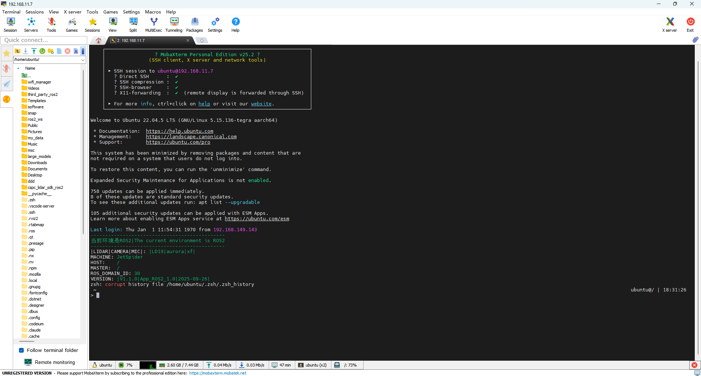

### 1.4.3 Volume Adjustment

According to default system settings, if a remote connection tool such as NoMachine connects to the robot system desktop before the robot fully boots up, the speaker volume will automatically be lowered. The sound button at the top right of the system desktop can be clicked to adjust the robot speaker's playback volume. This adjustment method also applies to subsequent voice courses.

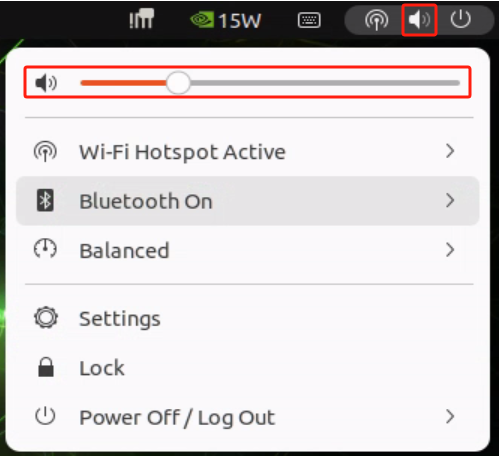

### 1.4.4 Remote Connection Resolution Setup (Optional)

If the resolution is incorrect after logging in remotely using the NoMachine remote connection tool, the following steps are required to set the remote connection resolution. This setup will need to be repeated upon subsequent reconnections:

1. Move the mouse cursor to the upper right of the remote connection tool and wait for the page curl status to display, as indicated by the red arrow in the figure below:

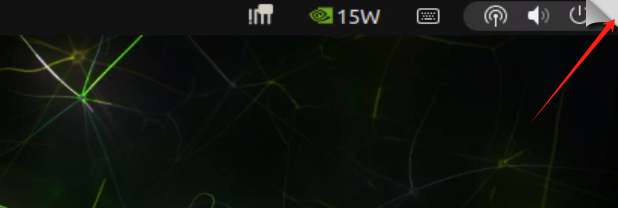

2. Next, press the left mouse button and select **Display** in the pop-up interface.

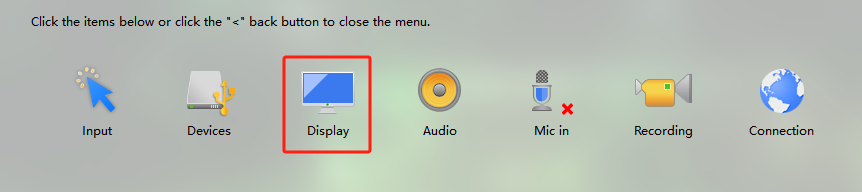

3. Then click **Change settings**.

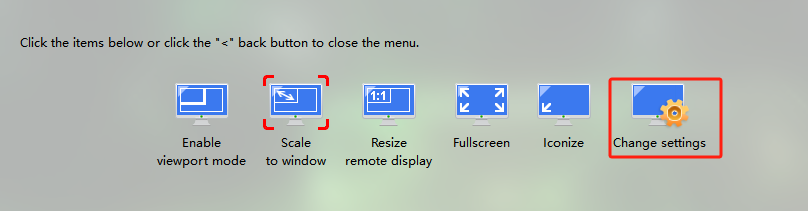

4. Adjust the **Resolution** slider to 1920x1080 or appropriate for the local computer resolution, then click **Modify** to implement the change.

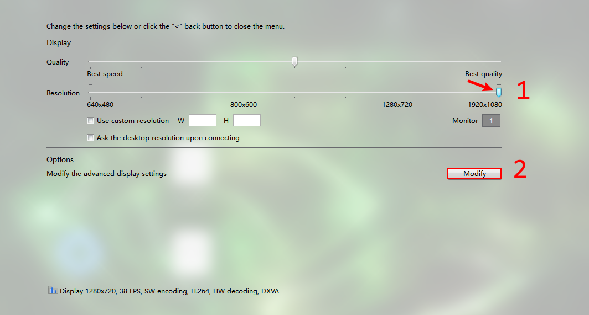

5. Continuously click the return button to return to the desktop, and the remote desktop resolution will be observed to have changed.

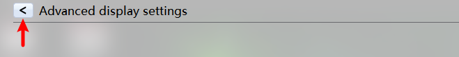

## 1.5 Quick Mapping and Navigation

> [!NOTE]
> **The Jetson controller is used below as a demonstration. Operations for quick mapping and navigation on the Raspberry Pi 5 are identical.**

### 1.5.1 Quick Mapping Experience

This lesson offers a rapid experience of mapping and navigation functions without executing complex operations. Simply clicking the corresponding icons on the remote connection desktop realizes these functions.

Quick mapping requires controlling the robot's movement via a wireless controller or keyboard. If the usage scenario involves only a single robot, controlling via a wireless controller is recommended for convenience. If there are multiple robots in the environment, controlling via a keyboard is suggested. This is because the wireless controller's control features cause cross-interference. If multiple robots are in the same venue, it is advised not to use this function to prevent incorrect connections and control.

Once mapping is completed, the corresponding map will be saved. Subsequently, the autonomous navigation function can be enabled to view the mapping effect. Note that the map opened by the autonomous navigation function is the last successfully built map. Regardless of the mapping method used, newly created maps will overwrite the previous ones.

The manual mapping algorithm used is slam_toolbox. The SLAM Toolbox package forms a 2D map of space based on LaserScan messages combined with information from the laser rangefinder and TF transformations from odom-> base link. This package permits fully serialized reloading of the SLAM map's data and pose graph for continuous mapping, localization, merging, or other operations. The SLAM Toolbox can run in synchronous and asynchronous modes. In synchronous mode, it processes all valid sensor measurements irrespective of lag, while in asynchronous mode, it processes valid sensor measurements when possible.

For more principles on mapping algorithms, enabling mapping and navigation via commands, and how to save multiple maps, please review **[1. Tutorials\5. Mapping and Navigation Course\5.1 Mapping Tutorial](https://wiki.hiwonder.com/projects/ROSpider/en/latest/docs/5.%20Mapping%20and%20Navigation%20Course.html#mapping-tutorial)**.

**1.5.1.1 Mapping Preparations**

Before starting the robot, first confirm that the touchscreen is installed and the wires are connected properly. Next, confirm whether the USB wireless controller receiver is inserted into the robot's USB port securely. Finally, follow **[1.4 Development Environment Setup](#p1-4)** to connect to the robot via a remote connection tool and access the desktop.

> [!NOTE]
> **Upon factory default, the wireless controller receiver is already inserted into the robot's STM32 controller to receive wireless controller signals.**

For wireless controller control methods, refer to **[1.3.5 Wireless Controller Control](#p1-3-5)**. Further details will not be provided here.

After the robot is turned on, the icons on the system desktop correspond to functions: 

Quick Mapping: 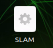

Autonomous Navigation: 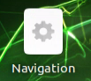

> [!NOTE]
> **In this mode, an enclosed area must be set up in advance on a flat surface. If obstacles are included, their height must at least exceed the horizontal position of the LiDAR.**

**1.5.1.2 Operation Steps**

1. Place the robot inside the space to be mapped.
2. Click the desktop icon to select and open the SLAM icon for the quick mapping application.
3. Several terminals will open and run programs simultaneously. Wait a moment at this stage.

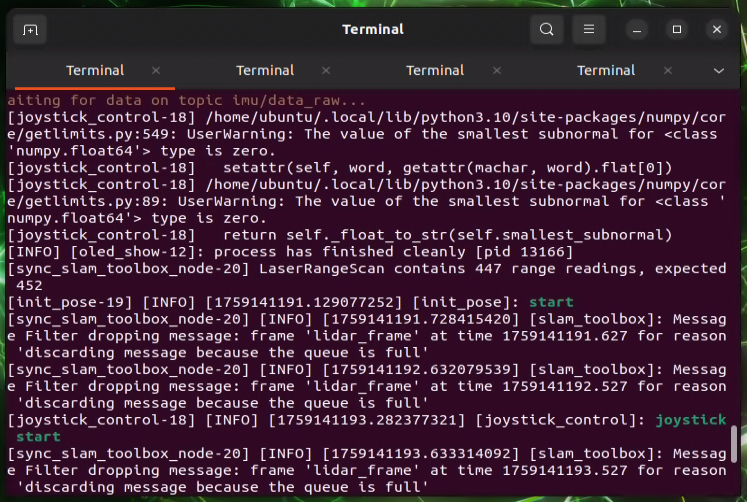

4. Successful activation is indicated when the display interface is visible.
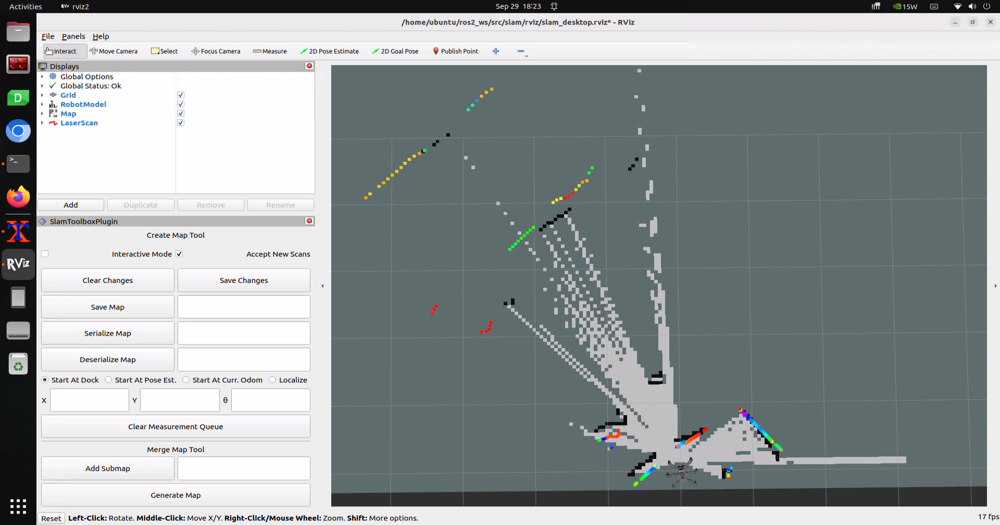
5. The wireless controller can now be used to control the robot for mapping. For wireless controller control button functions, refer to [**1.3.5.3 Button Descriptions**](#anther1.3.5.3).

> [!NOTE]
> **When using the wireless controller, do not stay too far from the robot to prevent disconnection.**

Alternatively, keyboard control can be chosen, although it is not recommended here. Keyboard control will be introduced in later sections. If keyboard control is used, a remote desktop connection is required, and the terminal must be configured to a terminal that accepts keyboard control.

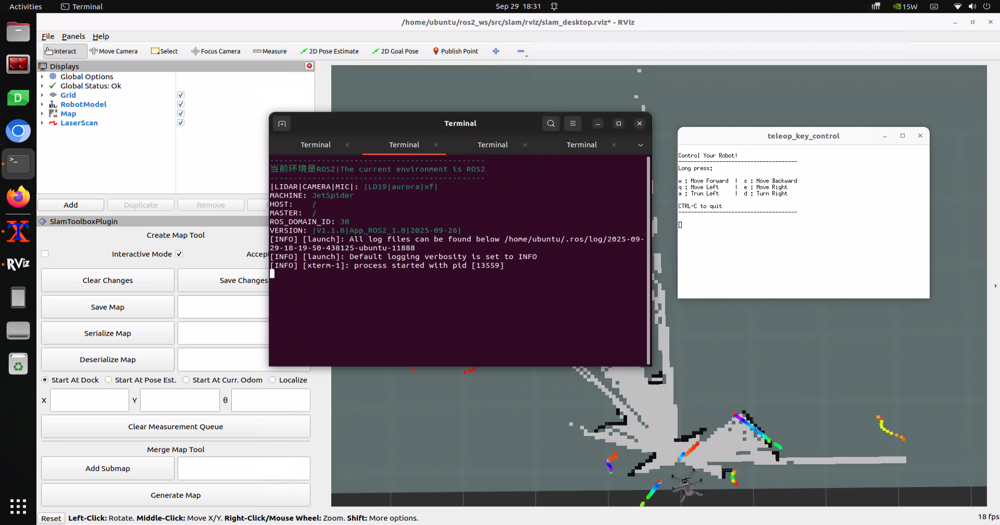

The button descriptions for keyboard control are as follows:

<table border="1">
<thead>
<tr>
<th>Button</th>
<th>Function</th>
<th>Description</th>
</tr>
</thead>
<tbody>
<tr>
<td>W</td>
<td>Forward</td>
<td>Short press switches to forward state, moves forward continuously.</td>
</tr>
<tr>
<td>S</td>
<td>Backward</td>
<td>Short press switches to backward state, moves backward continuously.</td>
</tr>
<tr>
<td>A</td>
<td>Left turn</td>
<td>Long press interrupts forward or backward state and turns left counterclockwise in place.</td>
</tr>
<tr>
<td>D</td>
<td>Right turn</td>
<td>Long press interrupts forward or backward state and turns right clockwise in place.</td>
</tr>
</tbody>
</table>


When the **W** or **S** key is pressed, the robot continuously moves forward or backward, respectively. When the **A** or **D** key is pressed, the robot interrupts the forward or backward motion and rotates counterclockwise or clockwise in place, while releasing the **A** or **D** key stops the rotation and holds the position in place.

6. After mapping is completed, click the **Save Map** button to save the map. The robot will save the built map.

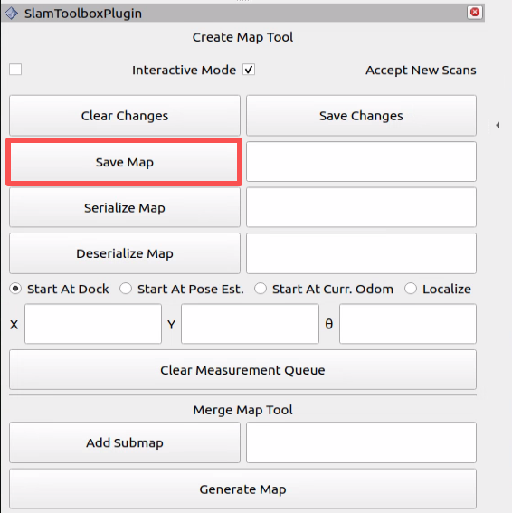

7. The built map is shown below:

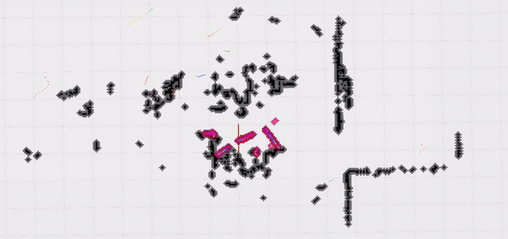

8. Once mapping is completed, to close the quick mapping function, enter **Ctrl + C** in the four command terminals.

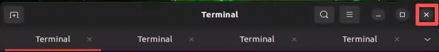

### 1.5.2 Autonomous Navigation

> [!NOTE]
> * **Navigation will read the most recently manually or autonomously built map. If both methods were used for mapping simultaneously, the most recently successfully built and saved map will be kept.**
> * **To learn how to save multiple maps, please study the course [5. Mapping and Navigation Course](https://wiki.hiwonder.com/projects/ROSpider/en/latest/docs/5.%20Mapping%20and%20Navigation%20Course.html#mapping-and-navigation-course) later on.**
>

**1.5.2.1 Operation Steps**

1. It is recommended to place the robot at the initial position from which the map was built.
2. Start the robot and select the Navigation icon on the touchscreen to open the quick navigation application.
3. Upon opening, terminals will run programs. Wait for the following interface to be visible, which indicates successful opening.

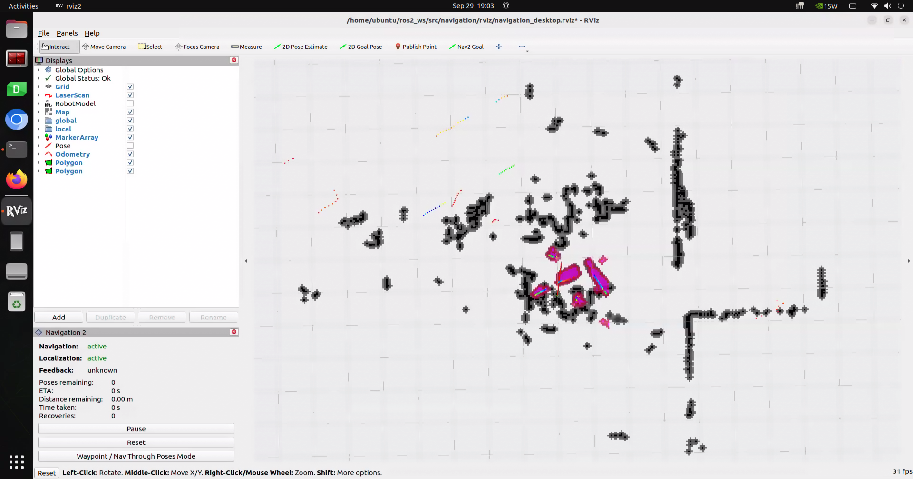

4. In the software menu bar, **2D Pose Estimate** is used to set the robot's initial position, **2D Goal Pose** sets a single target point for the robot, and **Nav2 Goal** sets multiple target points.

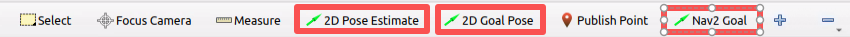

5. Click the **2D Goal Pose** icon, then single-click an area on the map interface to select it as a target point. Pressing tightly with the mouse and dragging can also determine the robot's orientation after reaching the target point. Upon completion of selection, the robot will automatically generate a route and move to the target point.

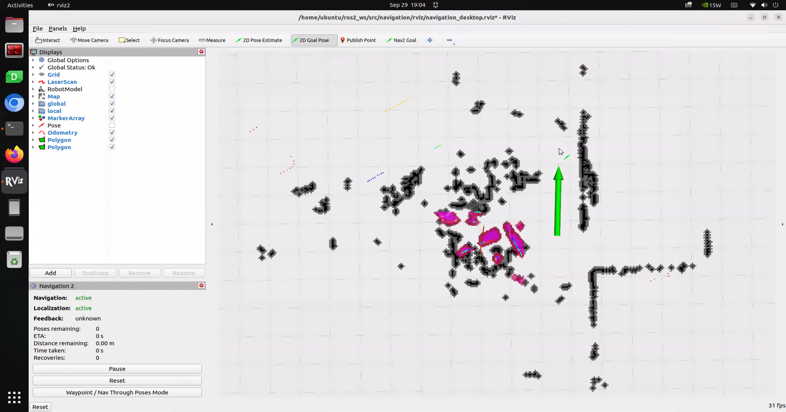

6. Click the  icon at the bottom left to enable multi-point navigation. Then click the **Nav2 Goal** icon once to set a target point. Clicking and dragging the mouse can select the target point direction. Set multiple target points by repeating this operation.

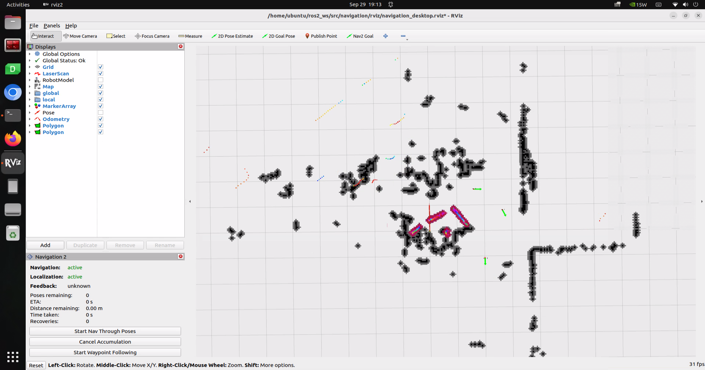

7. After setting target points, click **Start Waypoint Following** at the bottom left to begin multi-point navigation. During navigation, the robot will also automatically avoid obstacles.

## 1.6 ROS Usage Introduction

The robot control core primarily comprises two major parts. The first part is the body and robotic arm, specifically the lower-level STM32 controller responsible for robot motion control and sensor data acquisition. The second part is the ROS controller, which mainly runs the ROS system and related function routine algorithms.

### 1.6.1 ROS Controller Hardware Connection

The standard connection method requires one power cable and one USB serial cable, communicating with the ROS controller via the onboard USB serial port. For STM32, a 9~12V voltage supply is required. The ROS controller can directly connect to the power output port of the STM32 to draw power through the STM32 power supply port. For ROS wiring, reference the **[1.2.2 Hardware System](#1.2.2)** schematic diagram.

### 1.6.2 ROS Serial Communication

Serial communication is a common transmission method used in microcontroller development and robot building. Similarly, ROSpider uses serial communication to enable data exchange between the upper-level ROS controller and the lower-level STM32 controller.

To facilitate communication between software tools and various products, a communication protocol—the RRC communication protocol based on hexadecimal data transmission—has been standardized. Future products will also utilize this communication protocol for code programming and communication between upper and lower-level controllers.

## 1.7 System Software Architecture

### 1.7.1 System Desktop

Using the Jetson Orin Nano controller as an example, start the ROSpider hexapod robot and connect it to the remote control software NoMachine. It is also applicable to other ROS controllers. The system desktop is displayed as follows:

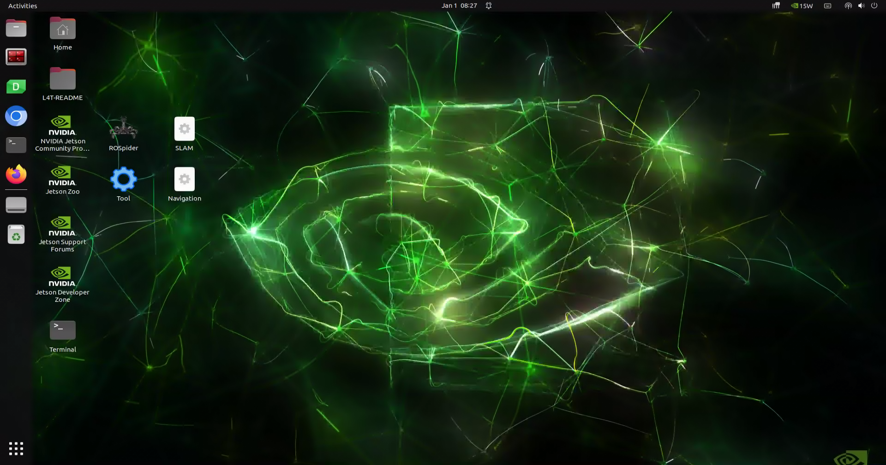

The desktop primarily includes the following functions:

<table border="1">
<thead>
<tr>
<td>Icon</td>
<td>Function Description</td>
</tr>
<thead>
<tbody>
<tr>
<td>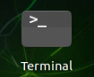</td>
<td>Command Line Terminal</td>
</tr>
<tr>
<td>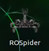
<td>ROSpider Upper-Level PC Software</td>
</tr>
<tr>
<td>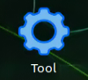</td>
<td>Robot Version Configuration Tool</td>
</tr>
<tr>
<td>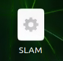</td>
<td>Quick Mapping</td>
</tr>
<tr>
<td>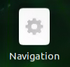</td>
<td>Autonomous Navigation</td>
</tr>
</tbody>
</table>


### 1.7.2 File Directory Composition Introduction

1. Double-click the  icon to launch the command line, enter the command `ls`, and press **Enter** to view the files under the home directory.

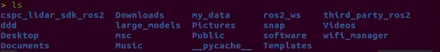

The table below introduces the main folders:

<table border="1">
<thead>
<tr>
<th>File Name</th>
<th>Function</th>
</tr>
</thead>
<tbody>
<tr>
<td>ros2_ws</td>
<td>Workspace, containing various functions</td>
</tr>
<tr>
<td>third_party_ros2</td>
<td>Stores function package files, such as models trained by Yolov8</td>
</tr>
<tr>
<td>large_models</td>
<td>Large model foundation function files</td>
</tr>
<tr>
<td>wifi_manager</td>
<td>Wi-Fi configuration files</td>
</tr>
<tr>
<td>Music</td>
<td>Music files</td>
</tr>
<tr>
<td>Pictures</td>
<td>Stores pictures</td>
</tr>
<tr>
<td>Public</td>
<td>User-customized folder</td>
</tr>
<tr>
<td>Videos</td>
<td>Stores video files</td>
</tr>
<tr>
<td>Pictures</td>
<td>Stores pictures</td>
</tr>
<tr>
<td>Public</td>
<td>User-customized folder</td>
</tr>
<tr>
<td>Templates</td>
<td>Custom template directory</td>
</tr>
<tr>
<td>Downloads</td>
<td>Stores downloaded files</td>
</tr>
</tbody>
</table>


2. Enter the command and press **Enter** to navigate to the robot function package directory. Enter `ls` to view the files in the directory.

```
cd ros2_ws
ls
```

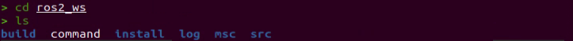

The table below introduces the main folders:

<table border="1">
<thead>
<tr>
<th>Directory/File Name</th>
<th>Description</th>
</tr>
</thead>
<tbody>
<tr>
<td>build</td>
<td>Build space, stores cache information during compilation.</td>
</tr>
<tr>
<td>command</td>
<td>Stores commands implementing various functions for easy retrieval.</td>
</tr>
<tr>
<td>install</td>
<td>Stores target files and executable files after compilation.</td>
</tr>
<tr>
<td>logs</td>
<td>Folder storing logs.</td>
</tr>
<tr>
<td>src</td>
<td>Source code folder storing function packages.</td>
</tr>
</tbody>
</table>


3. Next, enter the command and press **Enter** to navigate deeper into the robot function package directory to view the files under the **src** directory.

```
cd src
ls
```

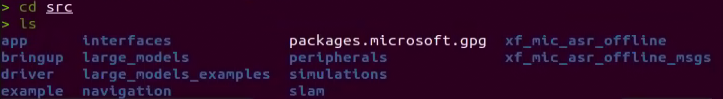

The table below introduces each folder:

<table border="1">
<tr>
<th style="background-color: ;">Directory Name</th>
<th style="background-color: ;">Type Description</th>
<th style="background-color: ;">Function Description</th>
</tr>
<tr>
<td>app</td>
<td>Storage directory for various mobile APP applications</td>
<td>Gesture control, LiDAR, line following, etc.</td>
</tr>
<tr>
<td>exapmle</td>
<td>Storage directory for related visual applications</td>
<td>Color sorting, waste classification, navigation transportation, etc.</td>
</tr>
<tr>
<td>interfaces</td>
<td>Communication interface file directory</td>
<td>ROS message communication and service communication files</td>
</tr>
<tr>
<td>slam</td>
<td>Storage directory for mapping-related applications</td>
<td>Various algorithm mapping, map saving</td>
</tr>
<tr>
<td>navigation</td>
<td>Storage directory for navigation-related applications</td>
<td>Publishing navigation points, RViz navigation, etc.</td>
</tr>
<tr>
<td>xf_mic_asr_offline</td>
<td>Storage directory for voice control applications</td>
<td>Voice control type applications</td>
</tr>
<tr>
<td>xf_mic_asr_offline_msgs</td>
<td>Voice control application messages storage directory</td>
<td>Voice control application directory</td>
</tr>
<tr>
<td>peripherals</td>
<td>External device settings directory</td>
<td>Includes different models of LiDAR, wireless controller control, keyboard control, etc.</td>
</tr>
<tr>
<td>simulations</td>
<td>Simulation files storage directory</td>
<td>Gazebo, MoveIt simulation, URDF, etc.</td>
</tr>
<tr>
<td>driver</td>
<td>Driver file directory</td>
<td>Kinematics, communication between Jetson Orin Nano controller and STM32 controller</td>
</tr>
</table>


4. Next, the function files will be introduced. Below uses `/ros2_ws/src/app` as an example to explain feature files. Enter the command to proceed to the feature's file directory. Two folders, `launch` and `app`, can be seen.

```
cd app
ls
```

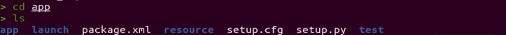

The **launch** folder corresponds to startup files, and **app** corresponds to the feature source code.

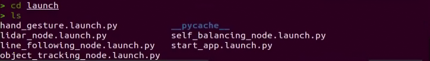

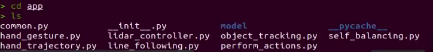

The corresponding startup file directories and source code directories for other feature packages are similar.

### 1.7.3 Enabling and Disabling Auto-Start Services

Because the robot system defaults to starting the app service, the auto-start service must be manually disabled during development and learning; otherwise, hardware will be occupied, preventing the experience of related applications.

1. Click the  icon on the left side of the system desktop to open the command line terminal.
2. Enter one of the two commands below and press **Enter** to disable the auto-start service.

```bash
~/.stop_ros.sh
```

```bash
sudo systemctl stop start_app_node.service
```

> [!NOTE]
> * **The first command closes all ROS-related nodes, while the second command only closes nodes related to auto-start.**
> * **For the Raspberry Pi 5, the second command must be executed by entering it into the black terminal .**
>

3. Remember to enable the auto-start service after learning is complete, otherwise the robot cannot be controlled via app or wireless controller.
4. Enter the command in the command line to start the auto-start service. For Raspberry Pi 5, this must be executed by entering it into the black terminal .

```bash
sudo systemctl restart start_app_node.service
```

## 1.8 Image Burning

### 1.8.1 Preparations

**Hardware aspects:**

**Jetson Nano and Raspberry Pi 5 Versions**: An SD card, a card reader, and a computer are required. The SD storage capacity depends on the size of the image to be burned, with the left figure below showing a 64GB SD card as an example. A Windows 10 operating system is recommended for the computer.

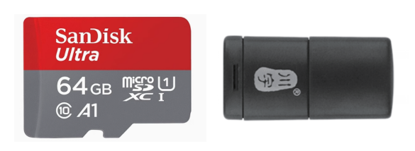

**Jetson Orin Nano and Jetson Orin NX Versions**: A solid-state drive, an SSD burner enclosure, and a computer are required. The SSD storage capacity depends on the size of the image to be burned. The SSD burner enclosure must be prepared separately. A Windows 10 operating system is recommended for the computer.

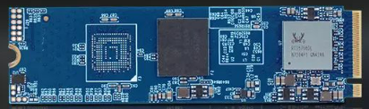

**Software aspects**: A hard drive initialization tool, [DiskGenius.exe](https://drive.google.com/drive/folders/1uFEaElz7I1UhjmQR1N11HN8Q_4WM4i6S?usp=sharing), and an image burning tool, [Win32DiskImager](https://drive.google.com/drive/folders/16IQP7LawZT7-EX_C3t7IApM-s_3ir4xP?usp=sharing), must be installed. This chapter will illustrate using these two tools as examples.

> [!NOTE]
> * **Before burning the image, all redundant partitions on the drive can be deleted via the hard drive initialization tool, and then proceed with burning.  The compressed package can be found in [2. Softwares\3. Image Burning Tool\Hard Drive Initialization Tool](https://drive.google.com/drive/folders/1uFEaElz7I1UhjmQR1N11HN8Q_4WM4i6S?usp=sharing). **
> * **After the image burning is complete, multiple independent disk prompts will pop up. Do not click format, but cancel directly.**
>
>
> 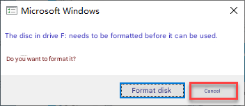

### 1.8.2 SD Card/SSD Formatting

> [!NOTE]
> **If the SD card or SSD is blank, formatting operations are unnecessary.**

1. Remove the SD card from the Jetson Nano or Raspberry Pi 5, or remove the SSD from the Jetson Orin Nano or Jetson Orin NX.

* **Jetson Nano**


* **Raspberry Pi 5**

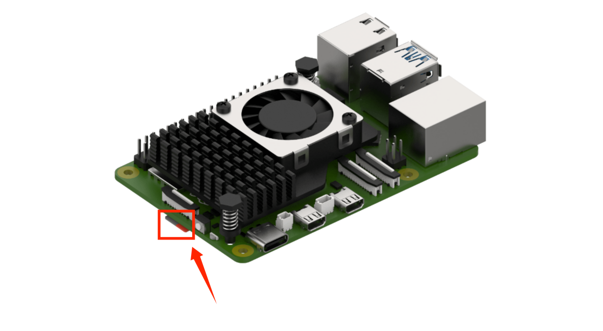

* **Jetson Orin Nano/Jetson Orin NX**

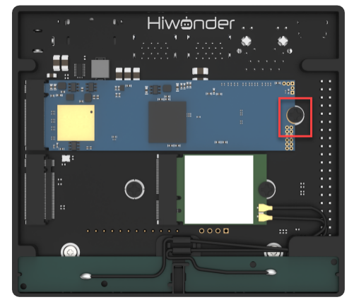

2. Locate the compressed package in directory **[2. Softwares\3. Image Burning Tool\Hard Drive Initialization Tool](https://drive.google.com/drive/folders/1uFEaElz7I1UhjmQR1N11HN8Q_4WM4i6S?usp=sharing)**. After extracting, find the **DiskGenius.exe** tool to format the SD card or SSD. Pay attention to selecting the correct drive letter. Do not select the wrong drive letter and accidentally format the computer's hard drive.
3. After inserting the SD card or SSD into the computer, drive letters other than the computer's own will be detected.

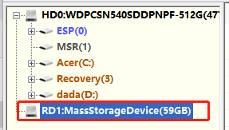

4. Right-click and select **Delete All Partitions**.

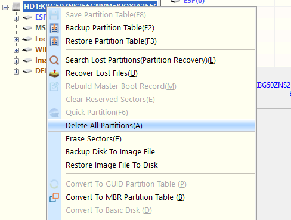

5. Upon successful deletion, it will appear as shown below:

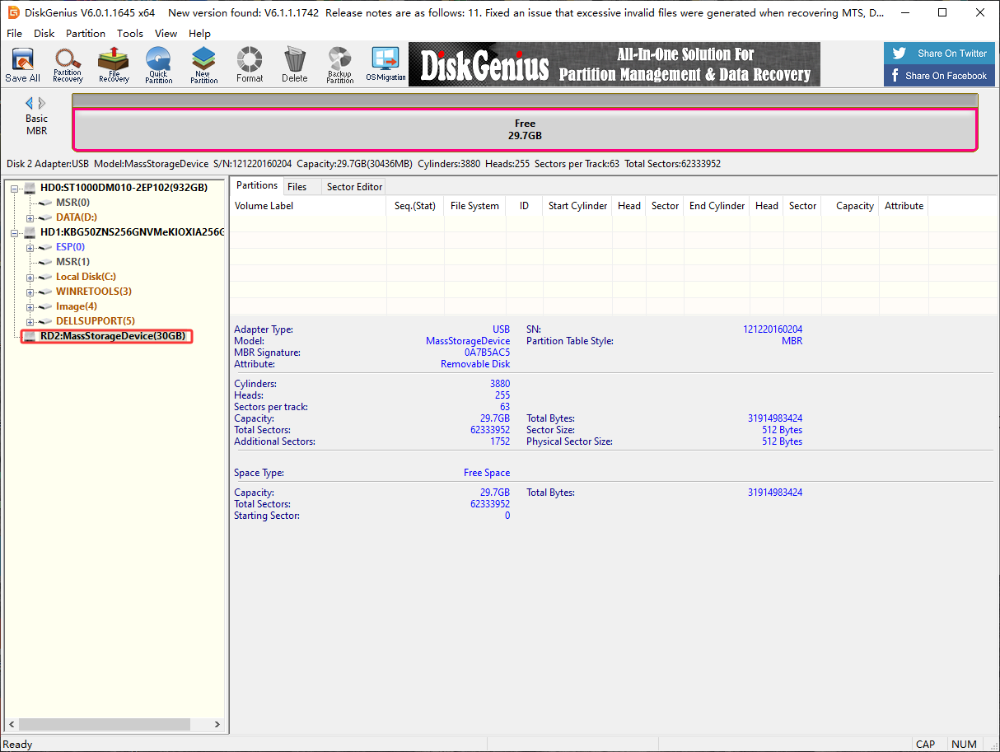

6. Create a new partition so the computer can recognize it properly. If informational prompts pop up, click **OK**, as shown below:

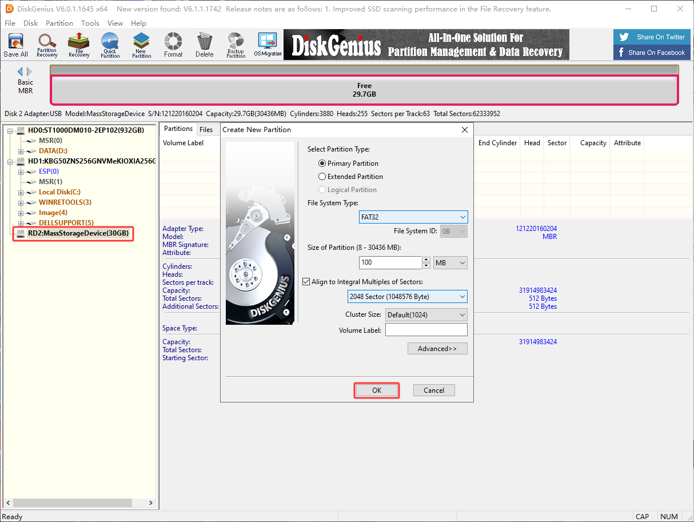

7. Then click **Save**.

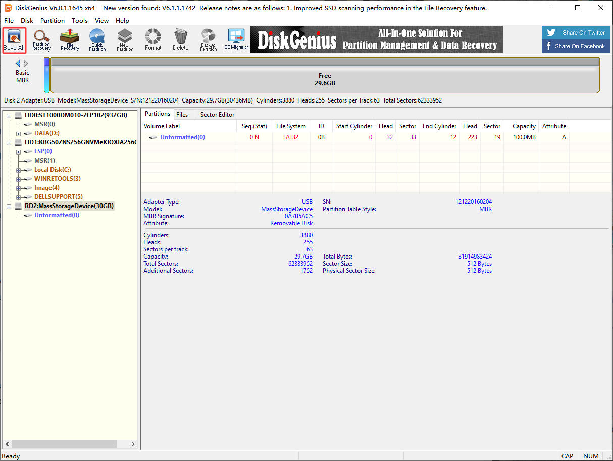

8. Upon success, the following information will be visible, indicating the SD card/SSD formatting is complete.

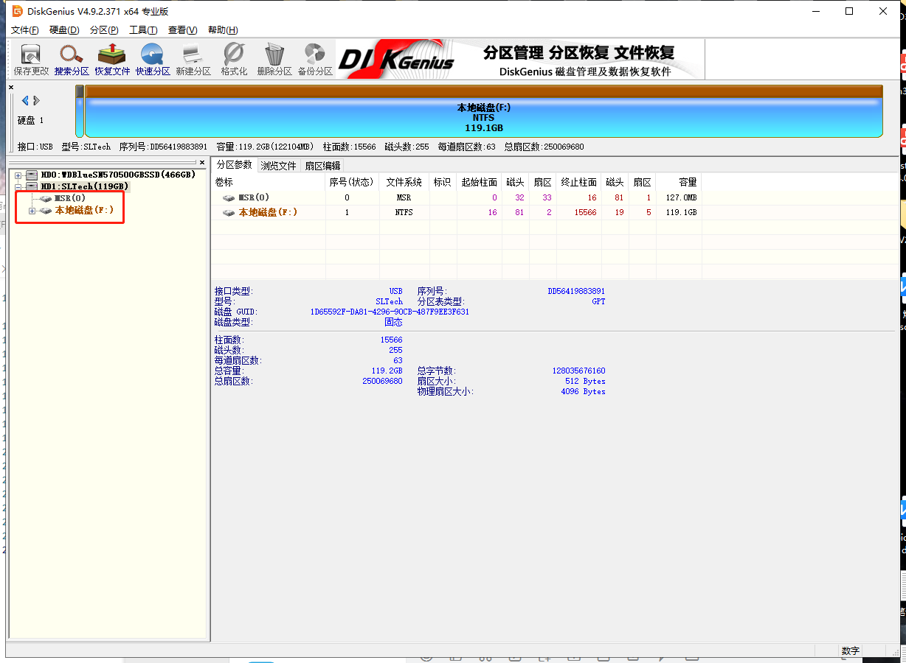

### 1.8.3 Image Burning

1. Open the image burning tool Win32DiskImager and click the icon  to select the image file, which must be downloaded and extracted beforehand. The screenshot is for illustrative purposes only, and the actual software image may differ. Under the **Device** section, select the drive letter of the SD card or SSD, and click the **Write** button to begin burning the image.

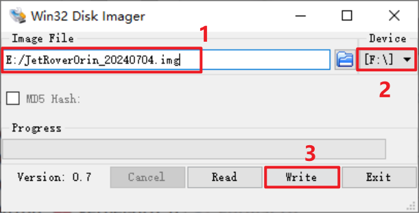

> [!NOTE]
> **The storage path for the image file should contain English characters only.**

2. If the prompt shown in the figure below appears, simply click the **Yes** button.

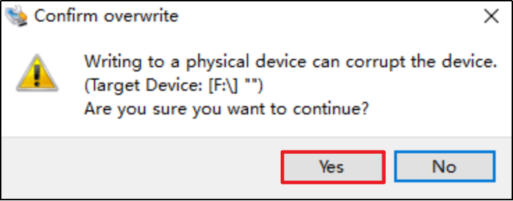

3. If **Write Successful** is prompted, burning is complete. If an error occurs, close software such as firewalls, re-insert the SSD, and repeat the operations in this section.

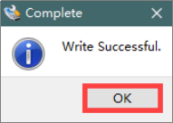

> [!NOTE]
> **After successful burning, if prompts regarding partition formatting appear, ignore them entirely.**

4. Wait for the image burning to complete, reinsert the SD card or SSD into the controller, power on, and after a while, a successful boot-up will be achieved.