# 10\. Movelt & Gazebo Simulation

## 10.1 Virtual Machine Installation and Import
<p id ="anther10.1"></p>

### 10.1.1 Virtual Machine Installation

- **VMware Installation**

A virtual machine is software that allows one operating system to run another operating system inside it. Here, VMware Workstation is used as an example. The installation steps are as follows:

1. Extract the virtual machine software package located in [Resources\\1. Virtual Machine Software](https://drive.google.com/drive/folders/1wZWJmUw1YIjROQfcy25hXeLstuZkbhRK?usp=sharing) in the same folder as this document.

2. Locate the extracted folder and double-click the virtual machine executable file with the **.exe** extension.


3. Follow the on-screen instructions to complete the installation.

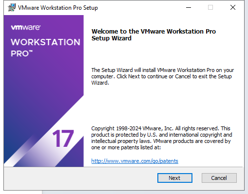

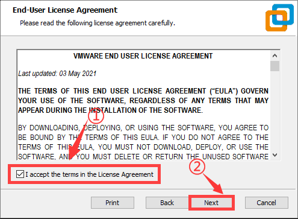

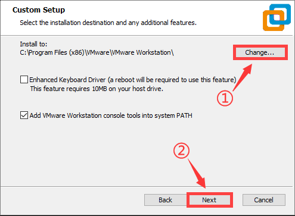

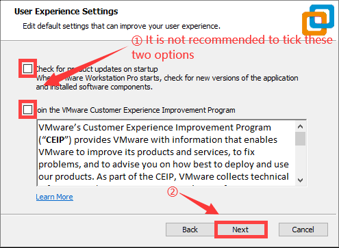

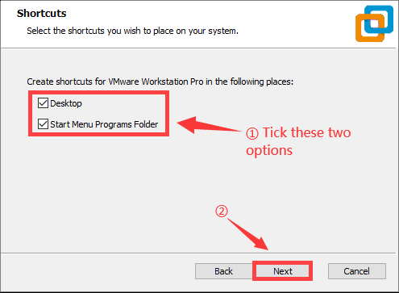

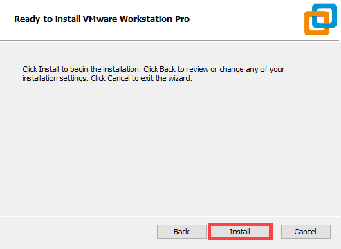

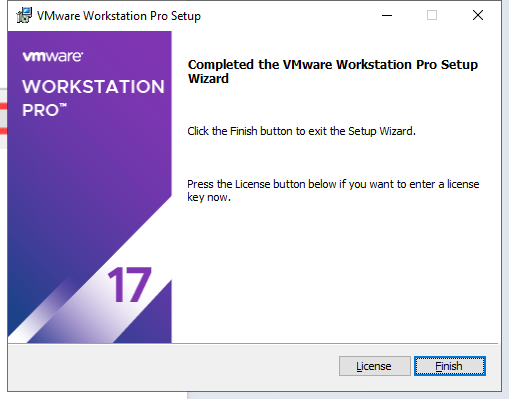

4. When starting the virtual machine for the first time, enter the product key and click **Continue**.

### 10.1.2 Virtual System Image Import

1. In the software interface, click on **Open a Virtual Machine**.

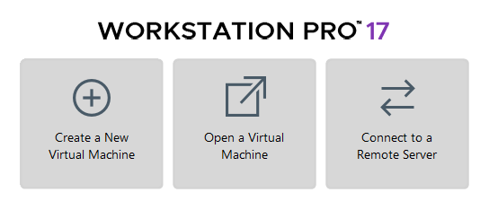

2. Navigate to the required virtual machine file in the directory [Resources  \\ 2. Virtual Machine Image](https://drive.google.com/drive/folders/1X4YpzpV2waLjg4yVEAitWRNZqSHtcJQT?usp=sharing), and open it.

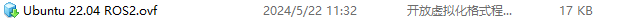

3. Select a storage path and click **Import**. Wait for the import to complete.

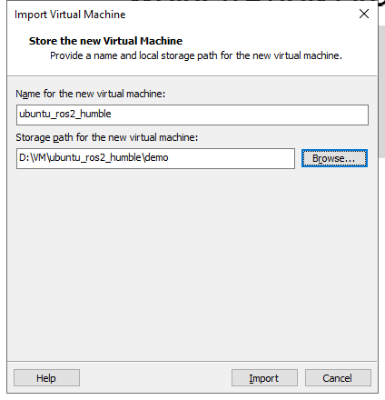

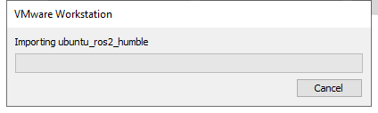

4. After the import is complete, the virtual machine is ready to use.

### 10.1.3 Virtual Machine Settings

1. Locate the virtual machine that was imported and click **Edit virtual machine settings**.

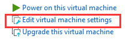

2. Click on **Network Adapter** and select **Bridged**.

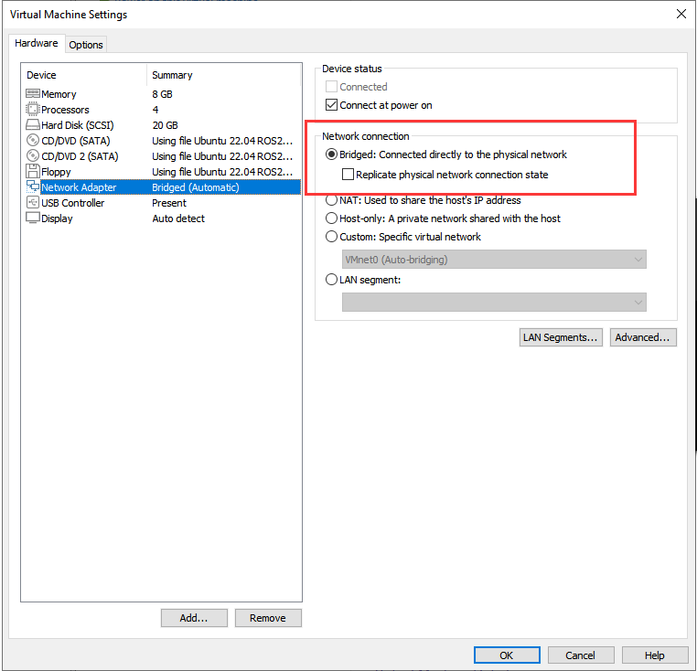

3. Click on **Display** and uncheck the **Accelerate 3D graphics** option.

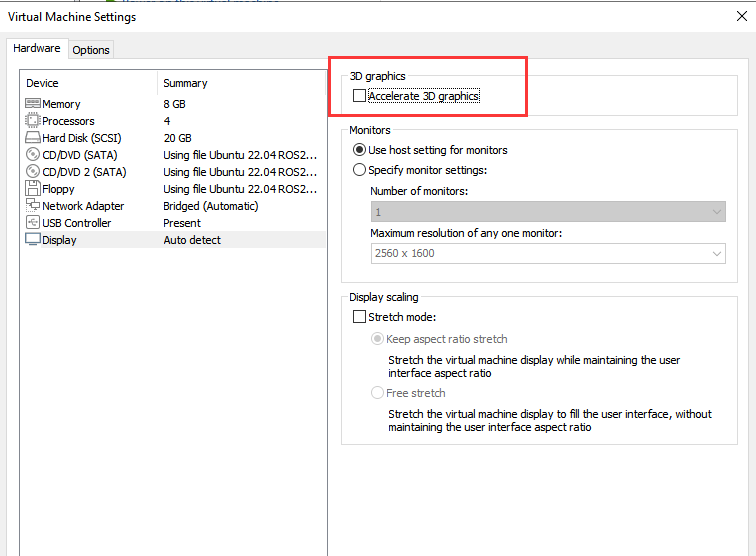

<p id ="p10-2"></p>

## 10.2 Configuration

> [!NOTE]
>
> **It’s normal for the virtual machine to take longer than usual during the first startup.**

The virtual machine interface is as follows:


### 10.2.1 Importing the Feature Package

1. Launch the virtual machine. Click the terminal icon 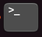 in the system desktop to open a command-line terminal.

2. Click the Home folder 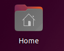 on the desktop to enter the directory.

3. Locate the compressed **simulations** file and the `.typerc` file in the directory [Resources \\ 3. Feature Package](https://drive.google.com/drive/folders/14vpqxGBRmrJOEMnqXS1iwp8ipDndMqwE?usp=sharing). Drag the compressed file into the **Home** directory of the virtual machine.

4. Right-click in the **Home** directory and select **Open in terminal** to open the terminal.

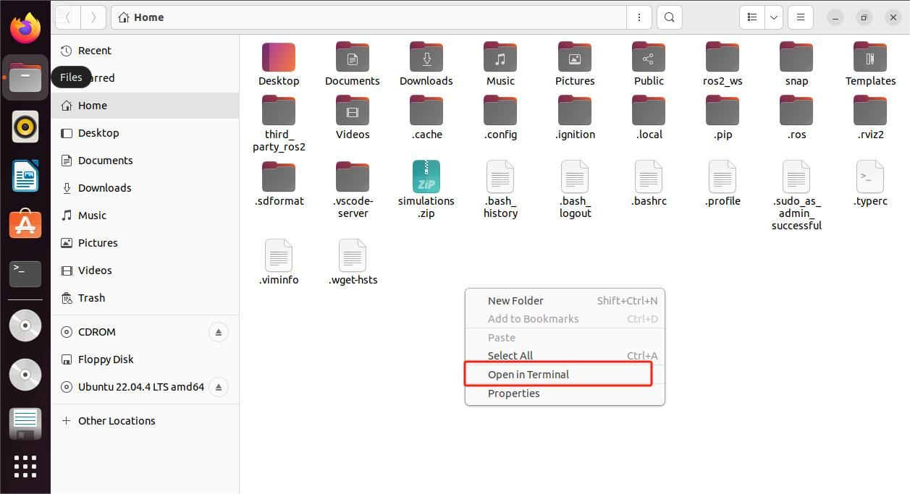

5. Enter the following command to create a directory.

```bash
mkdir -p ~/ros2_ws/src
```

6. Enter the following commands to extract the files and place the feature packages in the workspace directory.

```bash
unzip ~/simulations.zip
mv ~/simulations ~/ros2_ws/src/simulations 
```

7. Enter the following command to compile the package, then wait for the process to complete.

```bash
cd ~/ros2_ws && colcon build --symlink-install
```

8. Run the following command to move the **.typerc** file.

```bash
mv /home/ubuntu/.typerc ~/ros2_ws/.typerc
```

9. Enter the command to verify that the file was moved successfully.

```bash
cd ~/ros2_ws/ && ls -a
```

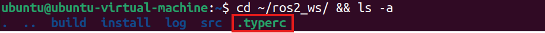

10. Enter the command to enable automatic loading of the configuration file.

```bash
echo "source ~/ros2_ws/install/setup.bash">>~/.bashrc
echo "source ~/ros2_ws/.typerc">>~/.bashrc
```

11. Reload the configuration file to apply the updated settings.

```bash
source ~/.bashrc
```

### 10.2.2 Network Configuration on the Robot

To ensure normal communication between the virtual machine and the robot during subsequent linkage operations, the device network must be configured first.

1. Start the robot and open a command terminal.

2. Enter the following command to configure the WiFi file.

```bash
cd wifi_manager && gedit wifi_conf.py
```

3. Modify the configuration to Local Area Network mode and enter the WiFi name and password. A self-provided WiFi router or a mobile phone hotspot is required for subsequent connections.

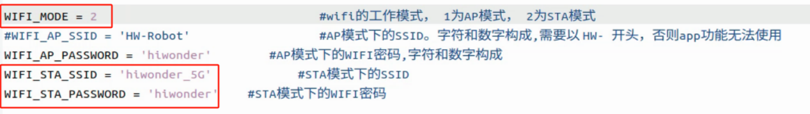

4. Press **Ctrl + S** to save and close the file.

5. For subsequent connections, it is necessary to ensure that the device and the virtual machine are on the same network segment. Enter the following command in the terminal to check.

```bash
ifconfig
```

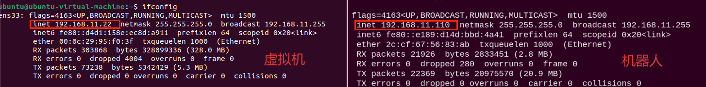

In this case, the virtual machine and the robot are both on the 192.168.11 network segment, enabling normal communication.

Common connection methods:

* Connection via router (Recommended): Connect the computer and the Jetson motherboard to the same router using a network cable.
* Connection via Local Area Network (Recommended): Configure the STA Local Area Network according to the tutorial, then connect the robot and the computer to the same WiFi or mobile phone hotspot.
* Connection via direct link (Not recommended): Set the robot to AP mode for direct connection, then connect the computer to the robot's WiFi.

### 10.2.3 Device Configuration on the Virtual Machine

The network environment has been configured in the previous section. However, under the same network, the virtual machine and the robot must have matching ID numbers to communicate with each other. The configuration method is as follows.

1. Start the robot and open a command terminal.

2. The terminal will display the `DOMAIN_ID` of the device as shown in the following figure. The following information is for reference only and needs to be modified according to the actual situation.


3. Start the virtual machine, click the icon  on the system desktop, and open a command terminal.

4. Enter the following command to open the configuration file.

```bash
gedit ~/ros2_ws/.typerc
```

5. Modify the ID shown in the following figure to 10.

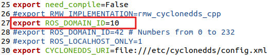

6. Press **Ctrl + S** to save and close the file.

7. Close the previous terminal and restart a new one to observe that the ID number has been successfully modified to 10.

   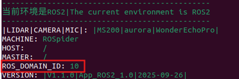

## 10.3 Introduction to URDF Models

<p id ="anther10.3.1"></p>

### 10.3.1 Overview and Basics of URDF Models

> [!NOTE]
> 
> **This section is based on configuration and simulation within a virtual machine. If the virtual machine is not yet installed, please first refer to section [10.1 Virtual Machine Installation and Import](#anther10.1) to complete the installation.**

* **URDF Model Introduction**

URDF is a format based on the XML specification, designed for describing the structure of robots. Its purpose is to provide a robot description standard that is as general and widely applicable as possible.

Robots are typically composed of multiple links and joints. A link is defined as a rigid object with certain physical properties, while a joint connects two links and constrains their relative motion.

By connecting links with joints and imposing motion restrictions, a kinematic model is formed. The URDF file specifies the relationships between joints and links, their inertial properties, geometric characteristics, and collision models.

* **Comparison between Xacro and URDF Model**

The URDF model serves as a description file for simple robot models, offering a clear and easily understandable structure. However, when it comes to describing complex robot structures, using URDF alone can result in lengthy and unclear descriptions.

To address this limitation, the xacro model extends the capabilities of URDF while maintaining its core features. The Xacro format provides a more advanced approach to describing robot structures. It greatly improves code reusability and helps avoid excessive description length.

For instance, when describing the two legs of a humanoid robot, the URDF model would require separate descriptions for each leg. On the other hand, the Xacro model allows for describing a single leg and reusing that description for the other leg, resulting in a more concise and efficient representation.

* **Install URDF Dependency**

> [!NOTE]
> 
> **The URDF and Xacro models are already installed in the virtual machine, so there is no need to reinstall them. This section is provided for reference only.**

1. Run the following command and press **Enter** to update the package information:

```bash
sudo apt update
```

2. Run the following command and press **Enter** to install the URDF dependencies:

```bash
sudo apt-get install ros-humble-urdf
```

When the output matches the image below, the installation is successful:

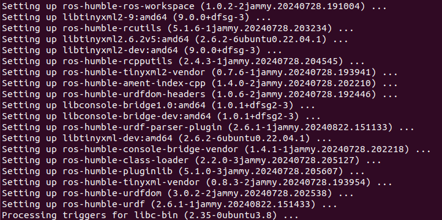

3. Run the following command and press **Enter** to install the Xacro model extension for URDF:

```bash
sudo apt-get install ros-humble-xacro
```

When the output matches the image below, the installation is successful:


* **URDF Model Basic Syntax**

1. XML Basic Syntax

Since URDF models are written based on the XML specification, it is necessary to understand the basic structure of the XML format.

(1) An element can be defined as desired using the following formula:

**\<Element>**

**\</Element>**

(2) Attributes are contained within an element and are used to define certain properties and parameters of that element. When defining an element, the following format can be used:

**\<Element attribute_1="value1" attribute_2="value2">**

**\</Element>**

(3) Comments do not affect other attributes or elements. The following syntax can be used to define a comment:

<**！ \-- Comment content \-->**

2. Link

The Link element describes the visual and physical properties of the robot's rigid component. The following tags are commonly used to define the motion of a link:

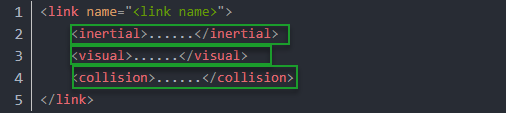

\<visual>: Describe the appearance of the link, such as size, color, and shape.

\<inertial>: Describe the inertia parameters of the link, which will be used in the dynamics calculation.

\<collision>: Defines the collision properties of the link.

Each tag contains its own child elements and serves different purposes. Refer to the table below for details.

| **Tag**  | **Function**                                                 |
| -------- | ------------------------------------------------------------ |
| origin   | Describes the pose of the link. xyz defines the link’s position in the simulation map, and rpy defines its orientation in the simulation map. |
| mass     | Describes the mass of the link.                              |
| inertia  | Describes the inertia of the link. Due to the symmetry of the inertia matrix, six parameters ixx, ixy, ixz, iyy, iyz, izz must be provided as attributes. These values need to be calculated. |
| geometry | Describes the shape of the link. The mesh parameter loads the texture file, and the filename parameter loads the texture path. It includes three child tags: box, cylinder, sphere, used for rectangular, cylindrical, and spherical shapes. |
| material | Describes the material of the link. The name parameter is required. The color child tag adjusts color and transparency. |


3. Joint

In a URDF model, a joint is represented by the \<joint> tag. It describes the kinematic and dynamic properties of the robot joint, including motion type, as well as position and velocity limits. According to the type of motion, joints in a URDF model can be categorized into six types:

| **Type & Description**                                       | **Label**  |
| ------------------------------------------------------------ | ---------- |
| Rotational joint: can rotate infinitely around a single axis | continuous |
| Rotational joint: similar to continuous, but with rotation angle limits | revolute   |
| Prismatic joint: moves along an axis with position limits    | prismatic  |
| Planar joint: allows translation or rotation in orthogonal plane directions | planar     |
| Floating joint: allows both translation and rotation         | floating   |
| Fixed joint: a special joint that does not allow movement    | fixed      |

When defining joint behavior, the following tags are commonly used:

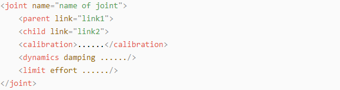

\<parent_link>: Specifies the parent link.

\<child_link>: Specifies the child link.

\<calibration>: Used to calibrate the joint angle.

\<dynamics>: Describes certain physical properties of the motion.

\<limit>: Defines motion constraints.

Each tag contains its own child elements and serves different purposes. Refer to the table below for details.

| **Label**         | **Function**                                                 |
| ----------------- | ------------------------------------------------------------ |
| origin            | Describes the pose of the parent link. It contains two parameters: xyz specifies the link's position in the simulation map, and rpy specifies the link's orientation in the simulation map. |
| axis              | Sets the child link to rotate around any of the XYZ axes relative to the parent link. |
| limit             | Restricts the child link. The lower and upper attributes define the rotation range in radians, the effort attribute limits the force during rotation with a positive or negative value, in Newtons or N, and the velocity attribute limits the rotational speed in meters per second or m/s. |
| mimic             | Describes the relationship of this joint with other joints.  |
| safety_controller | Defines safety control parameters to protect the robot's joint movement. |

4. robot Tag

The top-level tag of a complete robot is \<robot>. All \<link> and \<joint> tags must be included within \<robot>, as shown below:

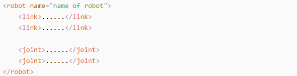

5. Gazebo Tag

Used with the Gazebo simulator, this tag allows configuration of simulation parameters, including Gazebo plugins and physical property settings.

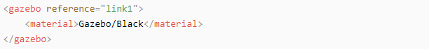

6. Creating a Simple URDF Model

(1) Set the Robot Model Name

At the beginning of the URDF model, set the robot’s name using: **\<robot name="Robot_Model_Name">** At the end of the model, enter **\</robot>** to indicate that the robot model definition is complete.

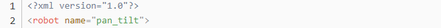

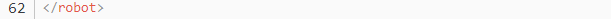

(2) Define Links

① To write the first link and use indentation to indicate that it is part of the currently set model. Set the name of the link using the following format: **\<link name="Link_Name">**. At the end of the link definition, enter **\</link>** to indicate that the link definition is complete.

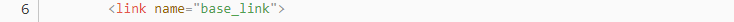

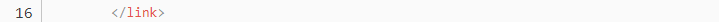

② When writing the link description, use indentation to indicate that the description belongs to the current link. Start the description with **\<visual>** and end it with **\</visual>**.


③ The **\<geometry>** tag is employed to define the shape of a link. Once the description is complete, end it with **\</geometry>**. Within the **\<geometry>** tag, indentation is used to specify the detailed description of the link's shape. The code below shows the shape of a link: **\<cylinder&nbsp;length=“0.01”&nbsp;radius=“0.2”/>**. Here, length="0.01" indicates that the link is 0.01 meters long, and radius="0.2" indicates that the link has a radius of 0.2 meters, forming a cylinder.


④ The **\<origin>** tag is utilized to specify the position of a link, with indentation used to indicate the detailed description of the link's position. The following example demonstrates the position of a link: **\<origin rpy="0 0 0" xyz="0 0 0" />**. In this example, rpy represents the angles of the link, while xyz represents the coordinates of the link's position. This example places the link at the origin of the coordinate system.

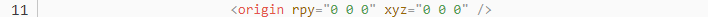

⑤ The **\<material>** tag is used to define the visual appearance of a link, with indentation used to specify the detailed description of the link's color. To start describing the color, include **\<material>**, and end with **\</material>** when the description is complete. The following example demonstrates setting a link color to yellow: **\<color rgba="1 1 0 1" />**. In this example, rgba="1 1 0 1" represents the color threshold for achieving a yellow color.

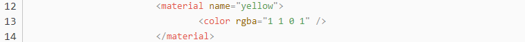

(3) Define Joints

① To define the first joint, use indentation to indicate that the joint belongs to the current model being set. Then, specify the name and type of the joint as follows: **\<joint name="Joint_Name" type="Joint_Type">**. At the end of the joint definition, enter **\</joint>** to indicate that the joint definition is complete.


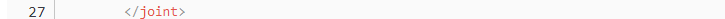

② Define the parent and child links of the joint. Indent the contents to show that this description belongs to the current joint. Set the parent and child parameters as follows: Format: **\<parent link="Parent_Link"/>

\<child link="Child_Link"/>** When the joint rotates, the parent link serves as the pivot, and the child link rotates relative to it.


③ **\<origin>** describes the position of the joint, with indentation used to specify the detailed coordinates of the joint. The code below describes the position of the joint: **\<origin xyz=“0 0 0.1” />**. Here, xyz specifies the coordinates of the joint, placing it at x=0, y=0, z=0.1 in the coordinate system.


④ **\<axis>** specifies the joint’s orientation. Indent its contents to define the joint’s axis and rotation direction. The code below shows a joint’s orientation: **\<axis&nbsp;xyz=“0&nbsp;0&nbsp;1”&nbsp;/>**. Here, xyz specifies the orientation of the joint.

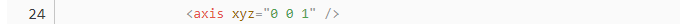

⑤ **\<limit>** defines motion constraints for the joint. Indent its contents to provide detailed limits on the joint’s angle. The code below shows a joint whose maximum torque does not exceed 300 N, with an upper rotation limit of 3.14 radians and a lower limit of -3.14 radians. These limits are defined according to the following formula: effort = joint torque (N), velocity = joint movement speed, lower = lower rotation limit (rad), upper = upper rotation limit (rad).


⑥ **\<dynamics>** describes the joint’s dynamics, with indentation used to define the joint’s dynamic properties. The code below shows an example of a joint’s dynamics parameters: **\<dynamics damping="50" friction="1" />**, where damping specifies the damping value, and friction specifies the friction coefficient.

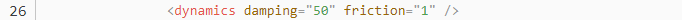

The complete code is as follows:


### 10.3.2 Robot URDF Model Instructions

* **Preparation**

To understand the URDF model, refer to section [10.3.1 Overview and Basics of URDF Models](#anther10.3.1) in this file for related syntax. This section provides a brief analysis of the robot model code and component models.

* **Viewing the Robot Model Code**

1. Launch the virtual machine. Click the terminal icon  on the left of the system desktop to open a command-line window.

2. Enter the command and press **Enter** to navigate to the program’s startup directory.

```bash
cd ros2_ws/src/simulations/rospider_description/urdf
```

3. Enter the following command to open the robot simulation model file.

```bash
vim rospider.xacro
```

Multiple URDF models are invoked to assemble the complete robot:

| **File Name**   | **Device**                |
| --------------- | ------------------------- |
| materials       | Color                     |
| inertial_matrix | Inertial Matrix           |
| base            | Base                      |
| lidar           | LiDAR                     |
| imu             | Inertial Measurement Unit |
| depth_camera    | Depth Camera              |
| arm             | Robotic Arm               |
| gripper         | Robotic Gripper           |

* **Brief Robot Model Analysis**

Open a new command terminal and enter the command to open the robot model file.

```Bash
vim arm.urdf.xacro
```

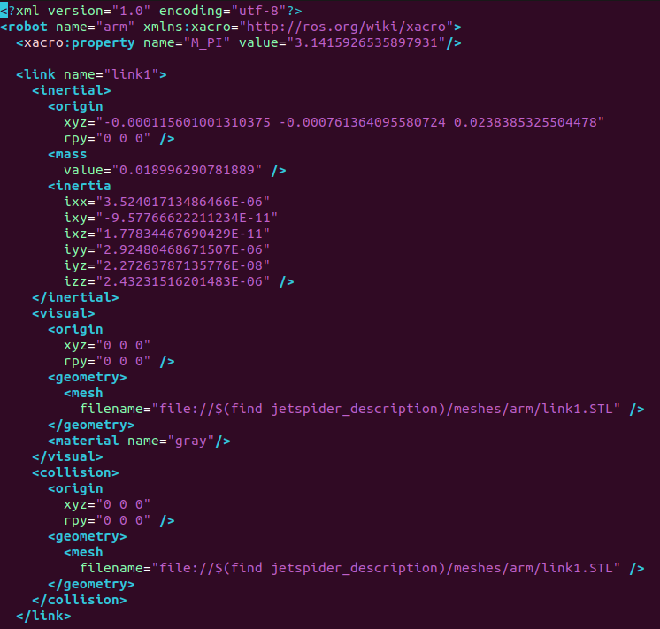

The beginning of the URDF file specifies the XML version and encoding and defines a robot model named **arm**. The **xmlns:xacro** namespace is used to generate the URDF using Xacro macro definitions. The constant M_PI defines the ratio of a circle's circumference to its diameter with a value of 3.14159... and is utilized for joint angle calculations.


The following provides an analysis of the link named link1:

| **Sub-tag**   | **Function and Parameter Description**                       |
| ------------- | ------------------------------------------------------------ |
| `<inertial>`  | Defines the physical inertial properties of the link. These properties affect the mechanical behavior during simulation.<br/>**origin**：The pose of the inertial coordinate system relative to the link coordinate system. Here, xyz represents the position and rpy represents the orientation. **mass**: The mass of the link with a value of 0.018996290781889 kg. **inertia**: The inertial matrix contains 6 parameters. This describes the rotational inertia around each axis. |
| `<visual>`    | Defines the visual model of the link. This is used for display in tools like RViz. **origin**: The pose of the visual model relative to the link. This coincides with the link coordinate system in this instance. **geometry**: Loads the STL model file via mesh. The path is **link1.STL** under the **jetspider_description** package.  **material**: Specifies the color as gray. |
| `<collision>` | Defines the collision detection model. This is utilized for collision judgment during simulation. It shares the same STL model with the `<visual>` tag to ensure the visual and collision ranges are identical. The **origin** coincides with the link coordinate system so the collision detection range perfectly matches the appearance model. |

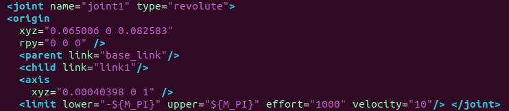

The following details the analysis of the joint named **joint1**:

| **Parameter** | **Description**                                              |
| ------------- | ------------------------------------------------------------ |
| `name`        | Joint name is joint1.                                        |
| `type`        | Joint type is revolute. This signifies a rotating joint.     |
| `origin`      | The pose of the joint coordinate system relative to the parent link. The position is 0.065006, 0, 0.082583 meters and the orientation is 0. |
| `parent`      | Parent link is base_link. This is the robotic arm base.      |
| `child`       | Child link is link1. This represents the first arm segment.  |
| `axis`        | The rotation axis is 0.00040398, 0, 1. This is approximately the vertical Z axis. |
| `limit`       | Motion limits. The angle range is -π to π which means -180 degrees to 180 degrees allowing omnidirectional rotation. The maximum effort is 1000N. The maximum velocity is 10m/s. |

> [!NOTE]
>
> **This tutorial uses a virtual machine as an example for configuration and learning. If a virtual machine is not yet installed, proceed with the installation according to the relevant content in section [10.1 Virtual Machine Installation and Import](#anther10.1) before continuing the study.**


## 10.4 Movelt2 Simulation

### 10.4.1 MoveIt2 Kinematics Design

* **Kinematics Introduction**

Kinematics is a branch of mechanics that describes and studies the changes in the position of an object over time from a geometric perspective, without involving the physical properties of the object or the forces applied to it. In robotics, forward kinematics and inverse kinematics are two methods used to solve the motion of robots.

Forward Kinematics involves determining the position and orientation of the end effector by knowing the values of the joint variables. In other words, it calculates the final position and orientation of the robot based on the angles of the servos.

Inverse Kinematics involves determining the required joint variables to achieve a desired position and orientation of the end effector. In this case, it calculates the angles that the servos need to rotate to achieve the final position and orientation of the robot.

* **Inverse Kinematics Analysis**

**1. Geometry**

For a robotic arm, inverse kinematics involves determining the rotation angles of each joint given the position and orientation of the gripper. The three-dimensional motion of a robotic arm can be quite complex. To simplify the model, we eliminate the rotation joint at the base, allowing us to perform kinematic analysis in a two-dimensional plane.

Inverse kinematic analysis typically involves extensive matrix computations, and the process is complex with significant computational requirements, making implementation challenging. To better suit our needs, we use a geometric approach to analyze the robotic arm.

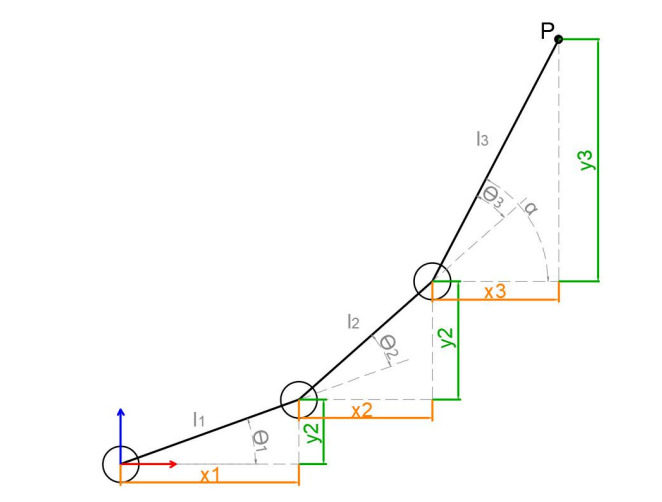

We simplify the model of the robotic arm by removing the base pan-tilt and the end effector, focusing on the main body of the arm. From the diagram, we can see the coordinates (x, y) of the endpoint P of the robotic arm. Ultimately, it is composed of three parts (x1 + x2 + x3, y1 + y2 + y3).

In the diagram, θ1, θ2, and θ3 are the angles of the servos that we need to solve, and α is the angle between the gripper and the horizontal plane. From the diagram, it's evident that the top-down angle of the gripper α = θ1 + θ2 + θ3. Based on this observation, we can formulate the following equation:

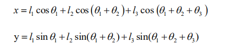

The values of x and y are provided by the user, while l1, l2, and l3 represent the inherent mechanical properties of the robotic arm's structure.

For ease of calculation, we will preprocess the known components for a holistic consideration:

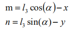

Substituting m and n into the existing equation and simplifying further, we can obtain:

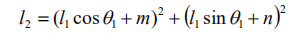

Through calculation, we have:

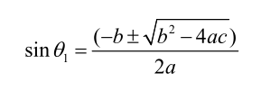

We observe that the above expression is the quadratic formula for a single variable, where:

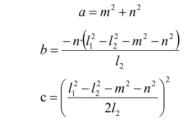

With this information, we can determine the angles θ1 and, similarly, calculate θ2. Consequently, we can determine the angles for all three servos. By controlling the servos based on these angles, we can achieve control over the coordinate position.

**2. DH Modeling**

The DH Parameter Table (Denavit-Hartenberg Parameter Table) is a standardized method used to describe the relative position and orientation of robotic arm joints and links. It uses four parameters to represent the relationship between each pair of adjacent joints. These four DH parameters have very clear physical meanings, as described below:

(1) Link Length: The length of the common normal between the axes of two adjacent joints, the rotation axis for rotational joints, and the translation axis for prismatic joints.

(2) Link Twist: The angle by which the axis of one joint is rotated around the common normal relative to the axis of the adjacent joint.

(3) Link Offset: The distance along the axis of a joint between the common normal of the current joint and the common normal of the next joint.

(4) Joint Angle: The angle of rotation around the joint axis between the common normal of the current joint and the common normal of the next joint.

While these definitions might seem complex, they become much clearer when viewed in the context of coordinate systems.

First, you should focus on the two most important "lines": - The axis of a joint (axis). - The common normal between the axis of one joint and the axis of the adjacent joint.

In the DH parameter system, we define the axis as the z-axis, and the common normal as the x-axis, where the direction of the x-axis is from the current joint to the next joint.

However, these two rules alone are not enough to fully determine the coordinate system of each joint. Let's now go over the detailed steps for determining the coordinate system.

In applications such as robotic arm simulations, we may use other methods to establish coordinate systems. However, understanding the method described here is crucial for grasping the mathematical expressions of robotic arms and for understanding the subsequent analyses.

The diagram below shows two typical robot joints. Although these joints and links may not resemble any specific joints or links from real robots, they are quite common and can easily represent any joint in a real robot.

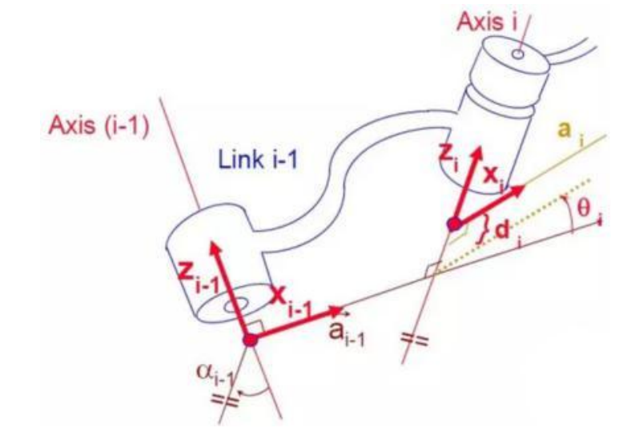

* **Determine Coordinate System**

There are generally several steps involved in determining the coordinate system:

(1) To model a robot using the DH notation, the first step is to assign a reference coordinate system to each joint. For each joint, both the Z-axis and the X-axis must be specified.

(2) Defining the Z-axis: For a rotational joint, the Z-axis is aligned with the direction of rotation according to the right-hand rule. The joint variable is the rotation angle around the Z-axis. For a prismatic joint (sliding joint), the Z-axis aligns with the direction of linear motion. The link length d along the Z-axis is the joint variable.

(3) Defining the X-axis: When two joints are neither parallel nor intersecting, the Z-axes are usually skew lines, but there always exists a common perpendicular that is the shortest distance between them. This perpendicular is orthogonal to both skew lines. Define the local reference frame's X-axis along the direction of the common perpendicular. If a n represents the common normal between the Z-axes of joint n and joint n+1, then the direction of the X-axis,  Xn, will be along an.

Special Cases: When the Z-axes of two joints are parallel, there are infinitely many common normal lines. In this case, one can choose the common normal that is collinear with the common normal of the previous joint, simplifying the model. When the Z-axes of two joints intersect, there is no common normal. In this case, the X-axis can be defined along the line perpendicular to the plane formed by the two axes, simplifying the model.

Once the coordinate system is assigned to each joint, the model can be represented as shown in the diagram below:

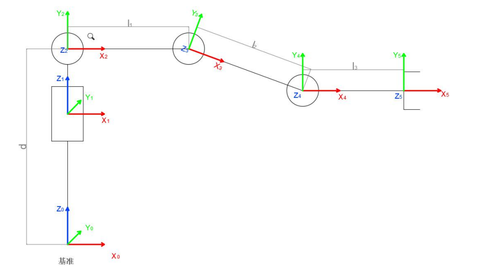

After determining the coordinate system, we can represent the four parameters more simply:

Link Length l<sub>i</sub>: Defined as the distance along the positive X<sub>i - 1</sub> axis from Z<sub>i - 1</sub> axis to Z<sub>i</sub> axis.

Link Twist α<sub>i</sub>: Defined as the angle of rotation along the positive direction X<sub>i - 1</sub> using the left-hand or right-hand rule between Z<sub>i - 1</sub> axis and Z<sub>i</sub> axis.

Joint distance d<sub>i</sub>: Defined as the distance measured along the positive direction of Z<sub>i - 1</sub>, from the X<sub>i - 1</sub> axis to the X<sub>i</sub> axis.

Joint angle θ<sub>i</sub>: Defined as the rotation angle measured around the positive direction of Z<sub>i - 1</sub>, from the X<sub>i - 1</sub> axis to the X<sub>i</sub> axis.

> [!NOTE]
>
> **This tutorial uses a virtual machine as an example for configuration and learning. If the virtual machine is not yet installed, please follow the instructions in the [10.1 Virtual Machine Installation and Import](#anther10.1) to install it before proceeding with the tutorial.**

### 10.4.2 MoveIt2 Configuration

* **MoveIt2 Introduction**

MoveIt2 is an open-source robotic motion planning framework specifically designed for ROS 2. It enables complex motion control and path planning for robots and serves as the ROS 2 version of MoveIt, a highly popular motion planning framework in ROS.

Compared to MoveIt1, MoveIt2 offers enhanced support for real-time control, thanks to improvements in ROS 2. These advancements allow for more precise and reliable robot motion control. By adopting DDS (Data Distribution Service) as its communication middleware, ROS 2 enables MoveIt2 to achieve more flexible and efficient data transmission.

MoveIt2 provides a user-friendly platform for developing advanced robotic applications, evaluating new robot designs, and integrating robotic solutions into various architectures. It is widely applied across industries, commercial ventures, research, and other fields, making it one of the most popular open-source robotic software solutions available today.

Additionally, MoveIt2 offers a suite of robust plugins and tools for the quick configuration of robotic arm control. It also provides a wealth of APIs, enabling users to easily perform secondary development on MoveIt2 modules and create innovative applications.

* **Launch Configuration Program**

> [!NOTE]
>
> * **The factory configuration is already complete and requires no reconfiguration. This information is provided for reference only.**
>
> * **Command entry is strictly case-sensitive. The "Tab" key can be utilized to auto-complete keywords.**

1. Launch the virtual machine. Click the terminal icon  in the system desktop to open a command-line window.

2. Entering the following command to launch the MoveIt2 configuration tool.

```
ros2 launch moveit_setup_assistant setup_assistant.launch.py
```

3. Click **Edit Existing MoveIt2 Configuration Package** to begin editing an existing configuration package.

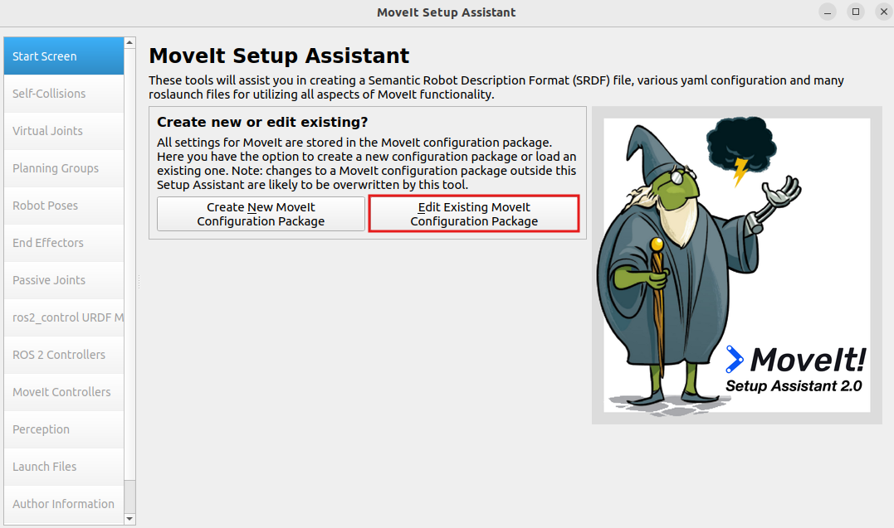

4. Click **Browse** and navigate to the **robot_moveit_config** folder under the directory **home/ubuntu/ros2_ws/src/simulations**, then click **Open**.

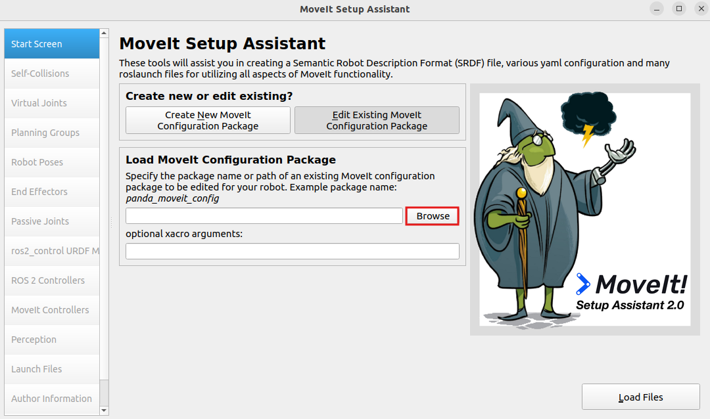

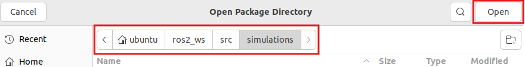

5. Click **Load Files** and wait for the files to load.

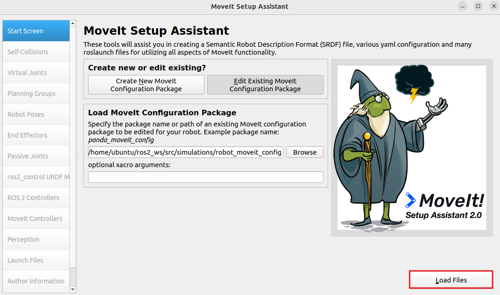

Once the progress reaches 100%, the robot model will appear on the right side, indicating a successful load.


> [!NOTE]
>
> **Reconfiguring will overwrite previous settings. Errors during this process may result in functionality issues. The system comes pre-configured from the factory and requires no reconfiguration. This information is provided strictly for reference purposes.**

* **Configuration Introduction**

**1. Self-Collisions**

Generate a custom collision matrix. The default collision matrix generator scans all joints of the robot. This custom collision matrix can safely disable specific collision checks, thereby reducing the processing time for motion planning.

Sampling density refers to the number of random joint configurations sampled to check for collisions. Higher density increases computation time. The default value is 10,000 collision checks.


**2. Virtual joints**

Add virtual joints, which are primarily used to connect the robot to a simulation environment. In this step, a virtual joint is defined to link the **base_footprint** frame to the **world_frame**.


**3. Planning Groups**

Add joint groups, which are used to define the various joint components required to assemble the robot.


**4. Robot Poses**

Define robot pose and custom pose names for the robot and specify the joint groups involved in achieving each pose.


**5. End Effectors**

End effector, the gripper of the robotic arm.


**6. Passive Joints**

Define unused joints, specify which joints are available and which are disabled.


**7. ros2_control URDF Modifications**

Configure the URDF file required for the simulation.


**8. ROS2 Controllers**

Using the ROS2 Controllers panel, you can add simulated controllers for the joints. This enables MoveIt2 to simulate the motion of the robotic arm.


**9. MoveIt Controllers**

Configure the controller for trajectory execution in MoveIt.


**10. Author Information**

Provide the author's details.


**11. Configuration Files**

Generate configuration files, after confirming the file path, click **Generate Package** to generate the configuration package.


### 10.4.3 MoveIt2 Control

In this section, MoveIt2 will be used to plan the path and control the simulation model and robotic arm to move along the path to the specified position.

* **Start MoveIt2 Tool**

1. Start a new command-line terminal, and run the following command to launch the MoveIt2 tool.

   ```
   ros2 launch robot_moveit_config demo.launch.py
   ```

The program interface is shown in the image below:

Position 1: RViz Toolbar. Position 2: MoveIt Debugging Area. Position 3: Simulation Model Adjustment Area.


* **Control Instructions**

1. In the MoveIt2 Debugging Area, find and click the **Planning** section.

   

2. In the Simulation Model Adjustment Area, you will see arrows in red, green, and blue colors. Click and drag the arrows to adjust the robotic arm's pose. In the robot's first-person view: Green represents the X-axis, with the positive direction pointing to the robot's left. Red represents the Y-axis, with the positive direction pointing to the robot's front. Blue represents the Z-axis, with the positive direction pointing upwards from the robot.

   

3. Besides adjusting the pose using the arrows, you can also adjust individual joints directly. Click the triangle icon on the right, then locate and open the **Joints** panel.

   

4. Drag the sliders for the corresponding joints to adjust their angles individually.

   

5. After successfully planning the robotic arm's motion path, the new position will be highlighted in orange. If the new position causes a collision with other parts of the robot, it will be marked in red. You must adjust the configuration to avoid collisions. Otherwise, the motion cannot be executed.

   Orange Executable State is shown in the following image.

   

For example, if the robotic arm is planned to be in the position shown in the image, it will collide with the depth camera. Turn the state red to non-executable, as shown in the figure below:


6. After planning the path, return to the **Planning** section and click the **Plan** option. The simulation model will display the motion path from the original position to the newly planned position.

   

7. Then, click the **Execute** option to make both the simulation model and robotic arm follow the planned motion path.

   

   

8. Alternatively, you can click **Plan & Execute**, where the robotic arm will first display the new planned motion path and then execute the movement.


9)  To exit the feature, press **Ctrl+C** in the terminal. If the program does not close successfully, try pressing **Ctrl + C** again.


### 10.4.4 MoveIt2 Random Movement

In this section, MoveIt2 will be used to plan a path and control the simulation model and the real robotic arm to move to random positions.

* **Start MoveIt2 Tool**

1. Open a new command terminal, then enter the command to launch the MoveIt2 tool.

   ```
   ros2 launch robot_moveit_config demo.launch.py
   ```


2. The program interface is shown in the image below:

Position 1: RViz Toolbar. Position 2: MoveIt Debugging Area. Position 3: Simulation Model Adjustment Area.


* **Control Instructions**

1. In the MoveIt2 Debugging Area, find and click the **Planning** section.

   

2. In the simulation model adjustment area, there are arrows in red, green, and blue colors. In the robot's first-person view: Green represents the X-axis, with the positive direction pointing to the robot's left. Red represents the Y-axis, with the positive direction pointing to the robot's front. Blue represents the Z-axis, with the positive direction pointing upwards from the robot.

   

3. In the **Query** category, click the dropdown menu under **Planning Group** and select the joint group, which is also servo group, you wish to control. For example, the default selection is the **arm** group.

   

4. Click the dropdown menu under **Goal State** and choose the desired target position.

   

5. The parameter list in the dropdown menu is as follows:

   

   The description of the parameters are as follows:

   `random valid`: A valid random position where no collisions will occur.

   `random`: A random position that may potentially result in a collision.

   `current`: The current position.

   `same as start`: The same as the starting position.

   `previous`: The previous target position.

   The positions `home` and `p1` are the default preset positions in the program.

6. To avoid the possibility of collisions, select **random valid** to randomly generate a valid target position. Each time you click this option, a new target position will be randomly generated and displayed in the simulation model.

   

7. Click **Plan & Execute**, and both the simulation model and robotic arm will perform the motion simultaneously. The simulation model will show the newly planned movement path, and the robotic arm will execute the motion.

   

8. To exit the feature, press **Ctrl + C** in the terminal. If the program does not close successfully, try pressing **Ctrl + C** again.

   

### 10.4.5 MoveIt2 Cartesian Path

* **Overview of MoveIt2 Cartesian Path**

Cartesian path planning is a method of trajectory planning where the robot's end effector moves within Cartesian space.

In MoveIt2, Cartesian path planning allows you to specify the starting and target positions of the robot's end effector, and generates a smooth path for the end effector to move from the starting position to the target position.

* **Cartesian Coordinate System**

The Cartesian coordinate system is a general term for both orthogonal and skewed coordinate systems. It consists of two axes intersecting at the origin, forming a planar affine coordinate system. If the measurement units along both axes are equal, it is called a Cartesian coordinate system. If the two axes are perpendicular to each other, it is known as a Cartesian orthogonal coordinate system. Otherwise, it is called a Cartesian skew coordinate system.

In most cases when describing spatial position, velocity, and acceleration, we use the Cartesian coordinate system. When referring to rotations around an axis, the positive direction is determined by the right-hand rule, as shown in the diagram below:


* **Cartesian Path Analysis**

Cartesian path planning can be divided into point-to-point Cartesian path planning and continuous Cartesian path planning based on the nature of the path. This involves predefining the robot's target points or target paths and using kinematic calculations to determine the joint-level trajectory, allowing the robot to follow the desired path.

In joint space, the space composed of all joint vectors, the movement of the robot's axes is controlled individually. Each axis moves independently through interpolation, without affecting the other axes. The trajectory between two points taken by the robot's end effector is an arbitrary curve.

However, in some cases, the shape of the end effector's trajectory needs to be a straight line or arc, for example. In these cases, Cartesian path planning is used to add constraints on the shape of the trajectory.

This section will add Cartesian path constraints to the path planning, restricting both the simulation model and the real robotic arm to perform linear motion.

* **Cartesian Path Planning Steps**

1. Set Up the Motion Group: First, specify the motion group in MoveIt2. A motion group is a set of robot joints used to define the robot's degrees of freedom and controllable parts. By defining the motion group, you can limit the degrees of freedom in the planning process, allowing for better control over the robot's movement.

2. Set Path Constraints (Optional): If you need to constrain the robot's motion path, such as keeping a specific joint's orientation fixed, you can set path constraints. These constraints ensure that certain conditions are met during the planning process.

3.  Specify the Start and Target Poses: Define the robot's motion target by specifying the start and target poses of the robot's end effector. These poses can be described using the robot's coordinate system.

4. Perform Path Planning: By calling MoveIt2's path planning interface, the robot's Cartesian path can be generated. MoveIt2 will plan the path based on the robot model, constraints, and target poses, resulting in a smooth trajectory.

5. Execute the Path: Finally, the generated path can be sent to the robot controller to execute the motion. The robot will move step-by-step along the planned path to reach the target pose.

* **Start MoveIt2 Tool**

1. Start a new command-line terminal, and run the following command to launch the MoveIt2 tool.

   ```
   ros2 launch robot_moveit_config demo.launch.py
   ```

2. The program interface is shown in the image below:


Position 1: RViz Toolbar. Position 2: MoveIt Debugging Area. Position 3: Simulation Model Adjustment Area.


3. Locate the **Planning** section, and tick **Use Cartesian Path** to enable Cartesian path planning.

   

4. Next, use the mouse to drag the arrows in the **Simulation Model Adjustment Area** to plan the robotic arm's path. In the robot's first-person view: Green represents the X-axis, with the positive direction pointing to the robot's left. Red represents the Y-axis, with the positive direction pointing to the robot's front. Blue represents the Z-axis, with the positive direction pointing upwards from the robot.

   

5. Once the planning is complete, click **Plan & Execute**. The simulation model will execute the action and attempt to linearly move the end effector in Cartesian space. If the action cannot be performed within the Cartesian path constraints, it will display a failure message.

6. To exit the feature, press **Ctrl + C** in the terminal. If the program does not close successfully, try pressing **Ctrl + C** again.

### 10.4.6 MoveIt2 Collision Detection

* **MoveIt2 Collision Detection Explanation**

MoveIt2's collision detection is a critical feature that uses the robot's motion planning path and information about surrounding objects to detect potential collisions. This ensures that the robot does not collide with any objects in its environment while performing its movements.

1. Collision Detection Configuration Overview

In MoveIt2, collision detection is configured using the CollisionWorld object in the planning scene. The collision detection in this configuration primarily uses the FCL (Flexible Collision Library) package, which is a key CC library in MoveIt2.

2. Collision Object Introduction

MoveIt2 supports collision detection for various types of objects, including:

(1) Meshes.

(2) Basic Shapes – such as cuboids, cylinders, cones, spheres, and planes.

(3) Octomap – Octomap objects can be directly used for collision detection.

3. Allowed Collision Matrix (ACM)

The Allowed Collision Matrix (ACM) encodes a binary value indicating whether collision detection is required between objects, which may be on the robot or in the robot's environment.

If the value corresponding to two objects in the ACM is set to 1, it means collision detection between these objects is not required. Otherwise, collision detection will be performed.

4. Collision Detection Steps

(1) Robot Description: First, provide a geometric and kinematic description of the robot, typically using a URDF (Unified Robot Description Format) file to describe the robot's structure and connectivity. This description includes information about the robot's joints, links, collision bodies, and sensors.

(2) Environment Modeling: Model the environment surrounding the robot, including the geometric shape and location of obstacles. These obstacles can be either static or dynamic.

(3) Motion Planning: Using MoveIt2's motion planner, specify the robot's starting and target poses, and generate the robot's motion trajectory.

(4) Collision Detection: MoveIt2 will perform collision detection for each pose along the generated trajectory. It uses both the robot model and the environment model to check for potential collisions between the robot and obstacles.

(5) Collision Avoidance: If collisions are detected, MoveIt2 will adjust the robot's pose or path to avoid them. The system will re-plan the robot's motion trajectory until it finds a collision-free path.

* **Start MoveIt2 Tool**

1. Open a new command-line window and enter the command to launch MoveIt2 tool.

   ```
   ros2 launch robot_moveit_config demo.launch.py
   ```


2. The program interface is shown in the image below:

Position 1: RViz Toolbar. Position 2: MoveIt Debugging Area. Position 3: Simulation Model Adjustment Area.


3. In the Simulation Model Adjustment Area, you will see arrows in red, green, and blue colors. Click and drag the arrows to adjust the robotic arm's pose. In the robot's first-person view: Green represents the X-axis, with the positive direction pointing to the robot's left. Red represents the Y-axis, with the positive direction pointing to the robot's front. Blue represents the Z-axis, with the positive direction pointing upwards from the robot.

   

4. Once the robotic arm's path is planned, click the **Scene Objects** section to add a collision model.

   

5. The section is divided into 4 areas, as described below:

   

6. Click the **Box** dropdown menu and select a collision model. Here, we will use the **Sphere** model as an example.

   

   

7. Click the **+** icon to add the currently selected collision model.

   

   The model will be placed at the robot's base by default, as shown in the image below:

   

8. Use the slider to adjust the size of the collision model. It is recommended to shrink it to about 50% of the original size.

   

9. Drag the 3D arrows on the sphere to move the collision model between the start and target positions to test the collision detection effect.

   

10. Click the **Planning** section and check the **Collision-aware IK** option to enable the collision detection for the model.

    

11. Next, click **Plan & Execute** to begin moving along the planned path. When the following prompt appears, select **Yes**.

    

12. After confirming, the robot arm will plan the movement path, avoiding any obstacles along the way to prevent collisions.

13. To exit the feature, press **Ctrl+C** in the terminal. If the program does not close successfully, try pressing **Ctrl + C** again.

    

### 10.4.7 MoveIt2 Scene Design

When using MoveIt2 for scene design, you can create a virtual environment that includes the robot, obstacles, and target positions. This scene can be used for tasks such as motion planning, collision detection, and path optimization.

* **Scene Design Steps**

1.  Robot Description: The robot's structure, connections, and joint limits are typically defined using a URDF (Unified Robot Description Format) file. This description includes the robot's geometry, kinematic parameters, and sensor information.

2.  Obstacle Modeling: During scene design, obstacles can be added to simulate the robot's environment. These obstacles can be static, such as walls, tables, or boxes, or dynamic, such as moving objects or other robots.

3.  Target Position Setup: You can specify the robot's target position or desired pose within the scene. These target positions could be specific locations the robot needs to reach or tasks to perform, such as grasping an object or completing a specific action.

4.  Motion Planning: Using MoveIt2's motion planner, you can plan the robot's path. By defining the robot's starting and target positions, MoveIt2 calculates a smooth trajectory to move the robot from the start to the target.

5.  Collision Detection: During motion planning, MoveIt2 performs collision detection to ensure the robot does not collide with obstacles during movement. If a collision is detected, MoveIt2 will replan the path to avoid the obstacle and find a viable route.

* **Introduction to the Rviz Plugin**

Rviz is a 3D visualization platform in the ROS system and one of the key plugins for MoveIt2. It enables the graphical display of external information and allows the publishing of control messages to the monitored objects.

Using the MoveIt2 Rviz plugin, users can set up a virtual environment (scene), interactively configure the robot's starting and target states, test various motion planning algorithms, and visualize the results.

In this section, we will explain how to add object models to the scene.

* **Start MoveIt2 Tool**

1. Open a new command-line terminal, and run the following command to launch the MoveIt2 tool.


```
ros2 launch robot_moveit_config demo.launch.py
```

2. The program interface is shown in the image below:

Position 1: RViz Toolbar. Position 2: MoveIt Debugging Area. Position 3: Simulation Model Adjustment Area.


3. In the debugging area, locate the **Scene Objects** section to add scene object models.


4. The section is divided into 4 areas, as described below:


5. In the **Custom Model** section, select the required basic model. Here, we use the cube model as an example.


6. Above the model selection, adjust the initial size of the object model in meters. As shown below:


7. After adjusting, click the **+** button to add the currently configured object model to the scene.


8. Once added, the model list will be updated with the newly added model, which will appear at the center of the scene, which is the robot's center.


9. In the **Simulation Model Adjustment Area**, you will see arrows in red, green, and blue colors. Click and drag the arrows to adjust the robotic arm's pose. In the robot's first-person view: Green represents the X-axis, with the positive direction pointing to the robot's left. Red represents the Y-axis, with the positive direction pointing to the robot's front. Blue represents the Z-axis, with the positive direction pointing upwards from the robot.


10. In addition to using arrow dragging, you can also make adjustments in the position and scale adjustment area.


**Position**: Adjust the object's position on the X, Y, and Z axes.

**Rotation**: Adjust the object's angle along the X, Y, and Z axes. 

**Scale**: Adjust the object's size by dragging the slider.

11. After making adjustments, click **Publish** to send the model's topic message. MoveIt2 will automatically subscribe to this message.


12. To prevent object models from colliding, go to the **Planning** section and check the **Collision-aware IK** box to enable collision detection for the model.


13. To exit the feature, press **Ctrl+C** in the terminal. If the program does not close successfully, try pressing **Ctrl + C** again.

### 10.4.8 MoveIt2 Trajectory Planning

* **Introduction to the Trajectory Planner**

**1. Open-Source Motion Planning Library (OMPL)**

OMPL is an open-source motion planning library based on sampling methods and written in C++. Most of the algorithms in OMPL are derived from RRT and RPM, such as RRTStar and RRT-Connect.

Due to its modular design, support for front-end GUIs, and stable updates, OMPL has become the most widely used motion planning software. OMPL is the default for ROS.

The sampling-based planning method does not consider the dimensionality of the planning target, avoiding the dimensional explosion. This makes it highly effective for path planning in high-dimensional spaces and complex constraint environments, which is a key reason OMPL is applicable to MoveIt2 robotic arm control.

For an N-degree-of-freedom robotic arm motion planning problem, OMPL can plan a trajectory for the end effector within the robot's joint space. This trajectory consists of M arrays, with M control points. Each with N dimensions represents the joint sequence for each control point. The robotic arm will follow this trajectory without colliding with obstacles in the environment.

**2. Industrial Motion Planner (Pilz)**

The Pilz industrial motion planner is a deterministic generator designed for circular and linear motion. It also supports combining multiple motion segments using MoveIt2 functionality.

**3. Stochastic Trajectory Optimization for Motion Planning (STOMP)**

STOMP is an optimization-based motion planner built upon the PI^2 algorithm. It is capable of planning smooth trajectories for robotic arms, avoiding obstacles, and optimizing constraints. This algorithm does not require gradients, allowing it to optimize any terms in the cost function.

**4. Search-Based Planning Library (SBPL)**

The SBPL is a collection of general-purpose motion planners that use search-based methods to discretize space.

**5. Covariant Hamiltonian Optimization for Motion Planning (CHOMP)**

CHOMP is an innovative gradient-based trajectory optimization program that simplifies many common motion planning problems and makes them trainable.

Most high-dimensional motion planners divide the trajectory generation process into two distinct stages: planning and optimization. In contrast, CHOMP uses covariant gradients and function gradients during the optimization stage to design a motion planning algorithm entirely based on trajectory optimization.

Given an infeasible initial trajectory, CHOMP quickly responds to the surrounding environment to avoid collisions while optimizing dynamic parameters like joint velocity and acceleration. This algorithm can rapidly converge to a smooth, collision-free trajectory, allowing the robot to efficiently execute the path.

This section integrates the OMPL and CHOMP planners. By default, the OMPL planner is used. Below, we will demonstrate how to switch to and use the CHOMP planner.

* **Start MoveIt2 Tool**

1. Open a command-line window and enter the command to launch the MoveIt2 tool.


```
ros2 launch robot_moveit_config demo.launch.py
```

The program interface is shown in the image below:

Position 1: RViz Toolbar. Position 2: MoveIt Debugging Area. Position 3: Simulation Model Adjustment Area.


3. In the **Simulation Model Adjustment Area**, you will see arrows in red, green, and blue colors. Click and drag the arrows to adjust the robotic arm's pose. In the robot's first-person view: Green represents the X-axis, with the positive direction pointing to the robot's left. Red represents the Y-axis, with the positive direction pointing to the robot's front. Blue represents the Z-axis, with the positive direction pointing upwards from the robot.


4. Besides adjusting the pose using the arrows, you can also adjust individual joints directly. Find and click the **Joints** panel.


5. Drag the sliders for the corresponding joints to adjust their angles individually.


6. After successfully planning the robotic arm's motion path, the new position will be highlighted in orange. If the new position causes a collision with other parts of the robot, it will be marked in red. You must adjust the configuration to avoid collisions. Otherwise, the motion cannot be executed.


7. In the RVIZ toolbar, click **Motion Planning** and **Planned Path**, then check the **Show Trail** option. This will display the visual trail of each frame of the robotic arm's movement.


8. Return to the **Planning** section and click the **Plan** option. The simulation model will display the motion path from the original position to the newly planned position.


9. After observing the demonstration, uncheck the **Show Trail** option. Then, click the **Execute** button. The simulation model and the robot will simultaneously execute the planned motion.


10. To exit the feature, press **Ctrl + C** in the terminal. If the program does not close successfully, try pressing **Ctrl + C** again.

### 10.4.9 Simulation and Robotic Arm Synchronization

In this section, we will plan a motion trajectory in the simulation and execute it to synchronize the real robotic arm's movements.

> [!NOTE]
>
> * **The virtual machine and the robot must be on the same network segment and able to communicate with each other in order to control the robot. Otherwise, only simulation is possible, and the robot will not execute the planned movements. Refer to [10.2 Configuration](#p10-2) to configure the network for the robot and the virtual machine.**
>
> * **Before starting, make sure there is enough space around the robot. Keep a safe distance during operation to prevent the robotic arm from colliding with your body and causing injury.**

* **Starting Robot Services**

1. First, turn on the robot. Click the terminal icon  in the system desktop to open a command-line window, then enter the command to disable the auto-start service.

```
~/.stop_ros.sh
```

2. Start the robot chassis control node, which is used for linkage between simulation and the real robotic arm.

```
ros2 launch controller controller.launch.py
```

* **Starting Services on Virtual Machine**

1. Launch the virtual machine. Click the terminal icon  in the system desktop to open a command-line window.

2. Run the following command to launch the MoveIt2 tool.

```
ros2 launch robot_moveit_config demo.launch.py
```

4. Use the slider to adjust the motion planning for the robotic arm, then click **Plan & Execute**. The simulated robotic arm and the real robotic arm will execute the action synchronously.


## 10.5 Gazebo Simulation

### 10.5.1 Introduction to Gazebo

To simulate a realistic virtual physical environment where robots can perform tasks more effectively, a simulation software named Gazebo can be used.

Gazebo is a standalone software and is the most commonly used simulation tool in the ROS ecosystem. It provides high-fidelity physical simulation conditions, a comprehensive set of sensor models, and a user-friendly interactive interface, enabling robots to function effectively even in complex environments.

Gazebo supports URDF and SDF file formats for describing simulation environments. The robot models use the URDF format. Additionally, Gazebo provides many pre-built model modules that can be used directly.

* **Gazebo GUI Introduction**

The Gazebo simulation interface is shown below.


The functions of each section are described in the table below:

| **Name**           | **Function**                                                 |
| ------------------ | ------------------------------------------------------------ |
| Area 1: Toolbar    | Provides the most commonly used options for interacting with the simulator. |
| Area 2: Menu Bar   | Configures or modifies simulation software parameters, as well as some interactive functions. |
| Area 3: Timestamp  | Allows manipulation of time within the virtual space.        |
| Area 4: Action Bar | Operates on models and allows parameter modifications.       |
| Area 5: Scene      | The main area of the simulator where simulation models are displayed. |


For more information about Gazebo, please visit the official website: http://gazebosim.org/.

* **Gazebo Learning Resources**

Gazebo Official Website: https://gazebosim.org/

Gazebo Tutorials: https://gazebosim.org/tutorials

Gazebo GitHub Repository: https://github.com/osrf/gazebo

Gazebo Answers Forum: http://answers.gazebosim.org/

### 10.5.2 Gazebo Xacro Model Visualization

To better understand the robot's model and structure, you can use Gazebo for visualization. Follow these steps:

* **Start the Simulation**

> [!NOTE]
> 
> **Commands must be entered with correct capitalization. The Tab key can be used to auto-complete keywords.**

1) Launch the virtual machine. Click the terminal icon  in the system desktop to open a command-line window.

2) Enter the following command to open the Gazebo simulation model:

```bash
ros2 launch robot_gazebo worlds.launch.py
```

If the interface shown below appears, the tool has launched successfully:


3) To close the currently running program in the terminal window, press the shortcut **Ctrl + C**.

* **Introduction to Shortcuts and Tools**

This section introduces some commonly used shortcuts and tools in Gazebo, using mouse controls as examples:

Left Mouse Button: In Gazebo simulation, the left mouse button is used for dragging the map and selecting objects. Press and hold the left mouse button on the map to drag it, or click on a model to select it.

Middle Mouse Button or Shift + Left Mouse Button:  

Press and hold while moving the mouse to rotate the view around the current target position.

Right Mouse Button or Mouse Wheel: Hold the right mouse button or scroll the wheel to zoom in and out, focusing on the point under the cursor.

For the toolbar tools, the following three will be used as examples for explanation.

1\. Selection Tool : The default tool in Gazebo, used to select models.


2\. Move Tool : After selecting a model with this tool, drag along the three axes to move the model.


3\. Rotate Tool : After selecting a model with this tool, drag along the three axes to rotate the model.


For more information about Gazebo, please visit the official website: http://gazebosim.org/.
