# 11. Large AI Model Courses

## 11.1 Large Models Basic Courses

### 11.1.1 Large Language Model Courses

* **Overview of Large Language Model**

A Large Language Model (LLM) is an advanced artificial intelligence model developed to comprehend and generate human language.


(1) Basic Concept

A Large Language Model (LLM) is a deep learning model trained on extensive text data, designed to either generate natural language text or comprehend the meaning of language. LLM is capable of performing various natural language tasks, such as text classification, question answering, and dialogue, making them a crucial step toward achieving advanced artificial intelligence. Unlike smaller models, LLM leverages a similar Transformer architecture and pretraining objectives (like Language Modeling), but are distinguished by their larger model size, greater training data, and enhanced computational resources.

(2) Features

**Massive Scale:** LLM are characterized by their vast parameter sizes, often reaching billions or even trillions of parameters. This immense scale allows them to capture a wealth of linguistic knowledge and complex syntactic structures.

**Pretraining and Fine-tuning:** LLM utilize a two-stage learning process: pretraining and fine-tuning. Initially, they are pretrained on large-scale, unlabeled text data, learning general language representations and knowledge. Subsequently, they are fine-tuned using labeled data to specialize in specific tasks, allowing them to excel across a wide range of NLP applications.

**Contextual Awareness:** LLM demonstrate exceptional contextual awareness, with their ability to understand and generate language deeply dependent on preceding text. This enables them to perform exceptionally well in tasks like dialogue, article generation, and contextual comprehension.

**Multilingual Capabilities:** LLM support multiple languages, extending beyond just English. This multilingual proficiency enables them to power cross-lingual and cross-cultural applications, enhancing their versatility and global reach.

**Multimodal Support:** Some LLMs have expanded to handle multimodal data, including text, images, and speech. This capability allows them to understand and generate content across various media types, opening up more diverse application possibilities.

**Emergent Properties:** LLM exhibit remarkable emergent properties, where performance improvements become apparent in large models but are absent in smaller ones. This makes them adept at handling more complex tasks and challenges.

**Cross-domain Applications:** LLM have been widely adopted across numerous fields, including text generation, machine translation, information retrieval, summarization, chatbots, and virtual assistants. Their influence is profound, impacting both daily life and work in significant ways.

**Ethical and Risk Considerations:** While LLM showcase impressive capabilities, they also raise important ethical and risk-related concerns, such as the potential generation of harmful content, privacy violations, and cognitive biases. As such, the development and deployment of LLM must be approached with careful consideration and caution.

(3) Working Principle

Large Language Model (LLM) are built on deep learning principles and are trained using massive datasets and substantial computational resources to develop neural networks with billions of parameters. Through iterative training and parameter optimization, these models learn to perform a wide range of tasks with high accuracy. The "**large**" in LLM reflects their immense scale—encompassing a vast number of parameters, extensive training data, and significant computational demands. This scale enables advanced models to achieve superior generalization capabilities and deliver increasingly accurate results, even in highly specialized domains.

Today, some of the most popular applications revolve around generative AI, such as language generation tools (e.g., ChatGPT) and image generation platforms (e.g., Midjourney). At the core of these applications is the concept of generation—the model's ability to predict and produce coherent content based on a given input.

(4) Application Scenarios

① Text Generation

Large Language Models are capable of generating diverse types of text, including news articles, stories, poems, and more. These capabilities make them well-suited for applications in content creation, creative writing, and automated storytelling.

② Text Classification

Large Language Models can classify text into various categories, such as sentiment analysis and topic identification. These capabilities are especially valuable in scenarios like public opinion analysis, information retrieval, and content moderation.

③  Machine Translation

Large Language Models excel at machine translation, enabling the conversion of text from one language to another. These capabilities are essential for cross-language communication, localization, and global collaboration.

④ Question-Answering Systems

Large Language Models can be used to build question-answering systems that respond to user queries. These applications are particularly valuable in areas such as intelligent customer support, knowledge retrieval, and information lookup.

<p id="anchor11.1.1.2"></p>

* **Large Language Model Deployment**

> [!NOTE]
>
> This section outlines the steps to register on the official OpenAI website and obtain the API key for the Large Language Model.

(1) OpenAI Account Registration and Setup

① Copy the following URL: <https://platform.openai.com/docs/overvie>

Open the OpenAI website and click on the "**Sign Up**" button in the top right corner.


② Follow the prompts to register and log in using your Google, Microsoft, or Apple account.

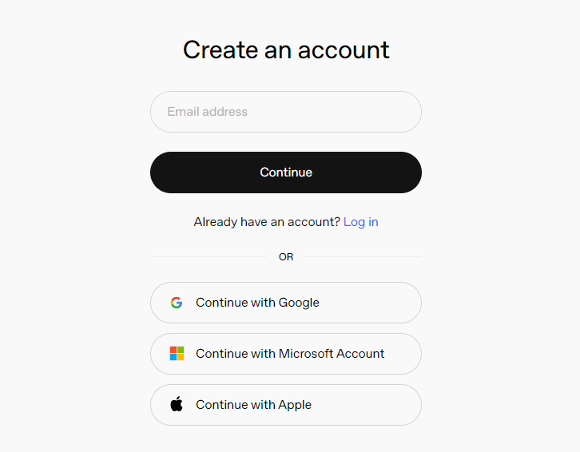

③ Click on the settings icon, then select Billing, followed by Payment Methods, to link your payment method. Recharge your account to purchase tokens.


④ After completing the setup, click on API Keys, then select Create New Secret Key. Follow the prompts to fill in the required information. Once the key is created, make sure to save it for future use.


⑤ With these steps, the large model has been successfully created and deployed. You can now use the API in the upcoming lessons.

(2) OpenRouter Account Registration and Setup

① Copy the following URL: <https://openrouter.ai/>

Open the webpage in your browser and click "**Sign In**". Register using your Google account or another available login option.


② After logging in, click the icon in the top-right corner and select **"Credits"** to link your payment method.

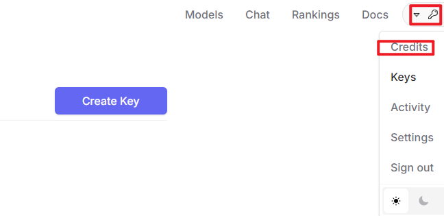


③ To create an API key, go to **"API Keys"**, then click **"Create Key"**. Follow the prompts to complete the process. Once the key is generated, make sure to save it for future use.

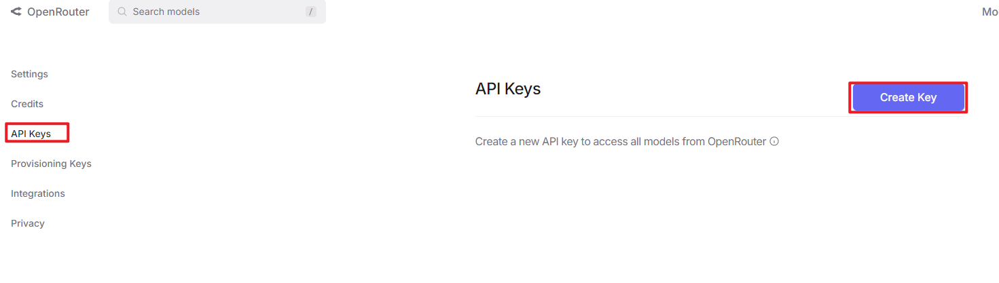


④ At this point, the large model is successfully created and deployed. You can now use the API in the upcoming lessons.

<p id="anchor11.1.1.3"></p>

* **Large Language Model Accessing**

> [!NOTE]
>
> To proceed with this section, you will need to register on the appropriate website and obtain the API key for the large model (please refer to the file ["**11.1.1 Large Language Model Courses -> Large Language Model Deployment**"](#anchor11.1.1.2)).

It is important to ensure a stable network connection for the development board. For optimal performance, we also recommend connecting the main controller to a wired network for enhanced stability.


(1) Environment Configuration

> [!NOTE]
>
> If you have purchased a robot from our company with built-in large model functionality, the environment is already pre-configured in the robot's image. You can directly proceed to Section 3 of this document to configure the API key.

Install Vim and Gedit by running the corresponding commands. Install the necessary software packages and audio libraries required for PyAudio.

```
sudo apt update
```

```
sudo apt install vim
```

```
sudo apt install gedit
```

```
sudo apt install python3 python3-pip python3-all-dev python3-pyaudio portaudio11-dev libsndfile1
```

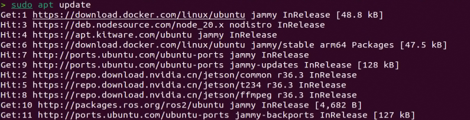

(2) Importing the Large Model Program Directory

① In this section, locate the '[Appendix -> Source Code](https://drive.google.com/drive/folders/1Na86By9er9Jj1_1YXz3sxAwePrIgSUcN?usp=sharing)' folder within the same directory as this tutorial document.


② Using the MobaXterm remote connection tool (as outlined in the '5.5 Remote Access and File Transfer' tutorial), drag the folder into the root directory of the main controller. The software installation package can be found in the '[Appendix -\> Remote Access and File Transfer](https://drive.google.com/drive/folders/17mfRH9lmP9OYO4_LAyzkRnHfytqRYldJ?usp=sharing)' directory.

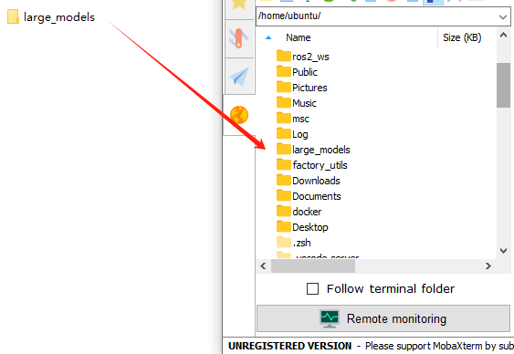

③ Next, execute the command to navigate to the **'speech_pkg' directory**.

```
cd ~/large_models/speech_pkg/
```

④ Execute the following commands to install the necessary third-party libraries.

```
pip3 install -r requirements.txt --break-system-packages
```

```
pip3 install dashscope --break-system-packages
```

```
pip3 install opencv-python --break-system-packages
```

```
pip3 install sympy==1.13.1 --break-system-packages
```

```
pip3 install torch --break-system-packages
```

⑤ Then, use the command in the terminal to navigate to the **'speech'** directory.

```
cd ~/large_models/speech_pkg/speech
```

⑥ Run the command to list the files in the **'speech'** directory.

```
ls
```


⑦ Depending on the type of main controller and Python version you're using, switch to the appropriate folder for packaging and distribution. This tutorial uses the Jetson Orin controller as an example.

| **Type of main controller** | **Python version** |
| --------------------------- | ------------------ |
| jetson_nano                 | 3.6                |
| jetson_orin                 | 3.10               |
| rpi5                        | 3.11               |
| rpi5_docker                 | 3.8                |

⑧ Execute the following command to navigate to the Jetson Orin folder.

```
cd jetson_orin/
```

⑨ Enter the command to copy the 'speech.so' file to the parent directory.

```
cp -r speech.so ..
```

⑩ Enter the command to navigate to the parent directory.

```
cd ../..
```

⑪ Execute the command to package the speech file for the Python environment.

```
pip3 install .
```

⑫ Enter the command to install and update the OpenAI Python library.

```
pip3 install openai -U
```

(3) Key Configuration

① Open the terminal and enter the following command to navigate to the directory for configuring the large model keys:

```
cd ~/large_models
```

② Then, open the configuration file by running:

```
vim config.py
```

③ Once the file is open, configure the OpenAI and OpenRouter keys by filling in the llm_api_key and vllm_api_key parameters, respectively (you can obtain these keys from the '[11.1.1 Large Language Model Courses -> Large Language Model Deployment](#anchor11.1.1.2)' course).

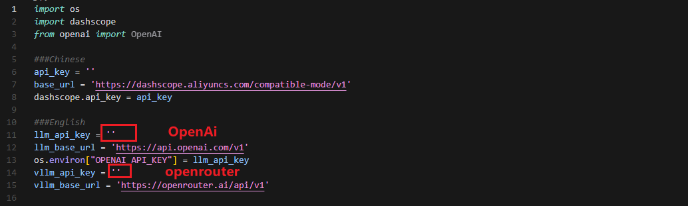

For instance, copy the key created in Section 1.2 of this chapter and paste it into the appropriate field. To paste the key, place the cursor between the quotation marks, hold the **"Shift"** key, right-click, and select **"Paste"** .

> [!NOTE]
>
> Do not mix keys from different models, as this may cause the functionality to malfunction

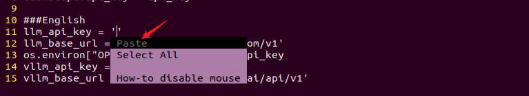

④  After pasting, press the **'Esc'** key, then type the following command and press Enter to save the file:

```
:wq
```

(4) Running the Demo Program

Once the keys are configured, you can run the demo program (openai_llm_demo.py) to experience the text generation capabilities of the large model. For example, the program's prompt might be: 'Write a 50-word article about how technology is changing life.'


① To run the demo, enter the following command in the terminal:

```
python3 openai_llm_demo.py
```

② After running the program, the output will appear as shown in the image below.


* **Semantic Understanding with Large Language Model**

Before starting this section, make sure you have completed the API key configuration outlined in the file [11.1.1 Large Language Model Courses -\> Large Language Model Accessing](#anchor11.1.1.3).

In this lesson, we'll use a large language model to analyze and summarize short passages of text.

(1) Start by opening a new terminal window, then navigate to the large model project directory:

```
cd large_models/
```

(2) Next, run the demo program with the following command:

```
python3 openai_llm_nlu_demo.py
```

(3) As shown in the output, the model demonstrates strong summarization abilities.

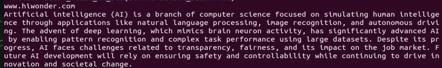

(4) The result matches the prompt defined in the program — where a passage of text is provided to the model, and it generates a concise summary.

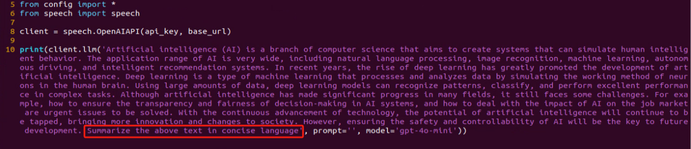

* **Emotional Perception with Large Language Model**

To proceed with this section, ensure that you have completed the API key configuration as described in the file [11.1.1 Language Model Courses -> Large Language Model Accessing](#anchor11.1.1.3).

In this lesson, we will use a large language model to assess its ability to perceive emotions based on descriptive words. We'll provide the model with emotional expressions and evaluate its response.

(1) Start by opening a new terminal window, then navigate to the large model project directory:

```
cd large_models/
```

(2) Next, run the demo program with the following command:

```
python3 openai_llm_er_demo.py
```

(3) From the output, you will see that the model successfully identifies and understands the emotions conveyed, providing a text-based response accordingly.

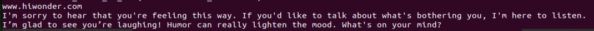

(4) In this program, we send two emotional expressions to the model: the first is an expression of sadness, **"So Sad"**. After the model responds, we then send an expression of happiness, "**Ha Ha**", and observe how the model reacts.


### 11.1.2 Large Speech Model Courses

* **Overview of Large Speech Model**

(1) What is a Large Speech Model?

A Speech Large Model (LSM) refers to a machine learning model that uses deep learning techniques to process and understand speech data. These models can be applied in a variety of tasks, such as speech recognition, speech synthesis, speech translation, and emotional analysis of speech. The design and training of these models typically require large amounts of speech data and substantial computational resources, which is why they are referred to as "**large models**".

(2) Why Do We Need Large Speech Model?

With the advancement of artificial intelligence and deep learning, traditional speech processing methods face many limitations. Large models leverage vast amounts of data and deep neural networks to learn and understand the complex features within speech, thereby improving the accuracy and naturalness of speech recognition and generation.

Their advantages include:

① High Accuracy: They maintain a high recognition rate even in noisy environments and with various accents.

② Naturalness: Speech generated by synthesis models is more natural, closely resembling human speech.

③ Versatility: These models support a wide range of languages and tasks, such as multilingual speech recognition, speech-to-text (STT), text-to-speech (TTS), and emotion recognition.

(3) Development of Speech Recognition Technology

Word-Level Speech Recognition: At this stage, speech recognition systems could only recognize individual words

Phrase-Level Speech Recognition: With the expansion of data and advancements in algorithms, speech recognition systems gradually gained the ability to recognize longer phrases, such as "**Please turn on my computer**".

Sentence-Level Speech Recognition: In recent years, with the emergence of AI large models, speech recognition systems have become capable of recognizing entire sentences and understanding their underlying meaning.

(4) Differences Between Large Speech Model and Traditional Speech Processing Technologies

① Processing Methods

Traditional Speech Processing Technologies: These typically rely on manual feature extraction and shallow models, such as Gaussian Mixture Models (GMM) and Hidden Markov Models (HMM), to process speech signals.

Large Speech Model: These use end-to-end learning, directly mapping raw speech waveforms to target outputs (such as text or another speech signal), reducing the reliance on manual feature extraction. They are typically based on deep learning architectures, such as Convolutional Neural Networks (CNN), Recurrent Neural Networks (RNN), and Transformers.

② Model Complexity

Traditional Speech Processing Technologies: These models are relatively simple, with fewer parameters.

Large Speech Model: These models have complex structures and a large number of parameters, enabling them to capture more subtle speech features and contextual information.

③ Recognition Capability

Traditional Speech Processing Technologies: These are highly adaptable to specific scenarios and conditions, but their recognition capability is limited when encountering new, unseen data.

Large Speech Model: Due to their large number of parameters and powerful learning ability, they offer superior recognition capabilities and can adapt to a wider variety of speech data and environments.

④Training Data Requirements

Traditional Speech Processing Technologies: These typically require less data for training, but the data must be highly annotated and of high quality.

Large Speech Model: These require vast amounts of training data to fully learn the complexities of speech, often necessitating large quantities of annotated data or the use of unsupervised/self-supervised learning methods.

(5) Core Technologies of Speech Large Model

① Automatic Speech Recognition (ASR)

ASR is the technology that converts human speech into text. The core steps of a speech recognition system include feature extraction, acoustic modeling, and language modeling.

② Text-to-Speech (TTS)

TTS is the technology that converts text into speech. Common speech synthesis models include the Tacotron series, FastSpeech, and VITS.

③ Speech Enhancement and Noise Reduction

Speech enhancement techniques are used to improve the quality of speech signals, typically for eliminating background noise and echoes. This is crucial for speech recognition applications in noisy environments.

(6) Applications of Speech Large Model

Intelligent Voice Assistants: For instance, Amazon Alexa and Google Home, which engage with users through voice interactions.

Customer Service Chatbots: In the customer service sector, speech large models assist businesses in enhancing service efficiency by swiftly processing customer inquiries through speech recognition technology, enabling 24/7 support.

Healthcare: Helping doctors with medical record-keeping, thus improving work efficiency.

Speech-to-Text: Speech large models excel in converting speech to text, offering accurate recognition and transcription in a variety of contexts. They are widely used in applications such as meeting transcription and subtitle generation.

* **Voice Device Introduction and Testing**

(1) Device Overview

① 6-Microphone Circular Array

Introduction：

The 6-Microphone Circular Array is a high-sensitivity, high signal-to-noise ratio microphone board. It features six analog silicon microphones arranged in a circular pattern. When paired with a main control board, it supports high-performance Acoustic Echo Cancellation (AEC), environmental noise reduction, and factory-level voice pickup from up to 10 meters.

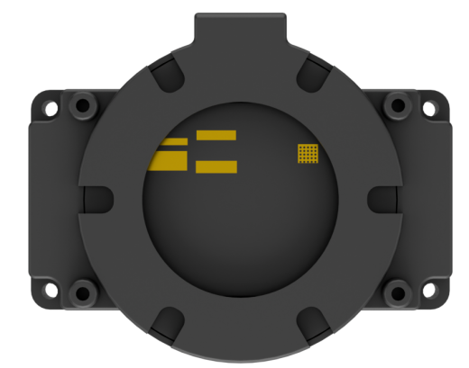

Features and Specifications：

**Operating Voltage:** 3.3V (typical)

**Operating Current:** 0.8mA (typical)

**Operating Temperature:** -20°C (min), 25°C (typical), 70°C (max)

**Operating Humidity:** Up to 95% relative humidity (max)

(1) Recording and Playback Test

The following demonstration uses the Raspberry Pi 5 as an example. The connection and testing steps are also applicable to other compatible devices such as the Jetson series:

① Connection Illustration and Detection


If the main controller is a Raspberry Pi, you can use VNC remote desktop access (refer to the appendix: Remote Access and File Transfer) to log into the Raspberry Pi system. Once connected, check the upper right corner of the desktop for microphone and speaker icons. As shown in the image below, the presence of these icons indicates a successful connection.


If you're using a NVIDIA Jetson device, you can connect via the NoMachine remote access tool. After logging in, check the upper right corner of the system interface for the speaker icon to confirm successful detection.


② Recording Test

Next, open a new terminal window and enter the following command to check the available recording devices. Note that the -l option is a lowercase "**L**". You should see the card number (card) listed—for example, card 0. This is just an example; please refer to your actual query result.

```
arecord -l
```


Then, use the following command to start recording. Replace the red-marked card number (hw:0,0) with the actual number you found in the previous step:

```
arecord -D hw:0,0 -f S16_LE -r 16000 -c 2 test.wav
```

This will create a test.wav audio file in the current directory.

You can record a short 5-second sample, then press Ctrl + C to stop the recording.

③ Playback Test

After the recording is complete, you can check whether the audio file was successfully created by listing the contents of the current directory:

```
ls
```

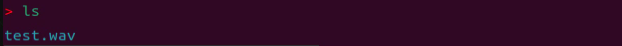

If test.wav appears in the list, the recording was successful. To play back the recording, use the following command:

```
aplay test.wav
```

* **Voice Wake-Up**

In this lesson, we'll learn how to use a large speech model to activate the voice device by speaking a predefined wake word through a program.

(1) WonderEcho Pro Wake-Up

Device Check：

To proceed, we need to identify the USB device name assigned to the connected WonderEcho Pro or voice device (hereafter referred to as the voice device). Please follow the steps below carefully. 

> [!NOTE]
>
> Do not connect any other USB devices during this process to avoid confusion.

① First, disconnect the voice device, then open a terminal and run the following command:

```
ll /dev | grep USB
```

② Next, reconnect the voice device to the USB port on your main board and run the same command again:

```
ll /dev | grep USB
```

③ You should now see a newly listed USB port, such as ttyCH341USB1.  

Please take note of this device name—it may vary depending on the main controller being used.


Wake-Up Test：

① To begin, update the port number used in the program by editing the script. You'll also need to uncomment the line for the port you're using and comment out any unused ports.

```
vim wakeup_demo.py
```

Press i to enter edit mode and make the necessary changes as shown below (update the port number accordingly and adjust comments as needed).

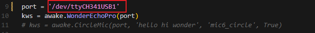

Once the changes are complete, press ESC, then type :wq and press Enter to save and exit the editor.

② Next, return to the system interface and run the wake-up demo using the command below. Speak the wake word **"HELLO HIWONDER"** clearly toward the WonderEcho Pro voice device.  

If the output includes **"keyword detect"**, it indicates that the firmware has been successfully flashed and the wake word is functioning correctly.

```
python3 ~/large_models/wakeup_demo.py
```


(2) 6-Microphone Circular Array

As with the WonderEcho Pro, you can connect the 6-Microphone Circular Array to your main board (Raspberry Pi or NVIDIA Jetson) using a Type-C to USB cable.

Device Check:

For Jetson users, connect to the Jetson system using the NoMachine remote access tool. Once connected, check the desktop interface.  

If the 6-Microphone Circular Array icon appears on the left side of the desktop, it indicates the device has been successfully recognized.

Wake-Up Test:

① Open a new terminal window and run the following command to edit the wakeup_demo.py script:

```
vim ~/large_models/wakeup_demo.py
```

② Press i to enter edit mode.

③ Update the port to match the device port number you previously identified. Comment out the WonderEcho Pro configuration (add \# at the beginning of the corresponding line), and uncomment the line using the voice device on line 11 as the input device (see red box in the referenced image).

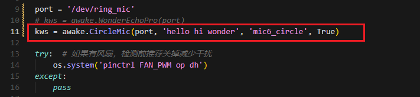

④ Press ESC to return to command mode, then type :wq and press Enter to save and exit.

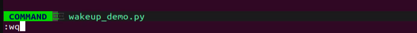

⑤ In the terminal, run the wake-up program with the following command:

```
python3 ~/large_models/wakeup_demo.py
```

⑥ After about 30 seconds of initialization, speak the wake word **"hello hiwonder"** to test the device.


(3) Brief Program Overview

This is a Python-based wake word detection script that utilizes the speech module to process audio input and detect a specific wake word (e.g., "**HELLO_HIWONDER**").

Source Code Path: `/home/ubuntu/large_models/wakeup_demo.py`

Importing Required Modules

{lineno-start=5}

```
import os
import time
from speech import awake
```

`os`: Used for handling file paths and executing system-level commands.

`time`: Provides delay functions to prevent overly frequent detection attempts.

`speech`: The core module responsible for processing audio input and detecting the wake word.

Initializing the wonderecho Class

{lineno-start=9}

```
port = '/dev/ttyUSB0'
kws = awake.WonderEchoPro(port)
```

Attempts to Turn Off the Cooling Fan on Raspberry Pi 5

{lineno-start=13}

```
try:  # If a fan is present, it's recommended to turn it off before detection to reduce interference
    os.system('pinctrl FAN_PWM op dh')
except:
    pass
```

Purpose: Attempts to turn off the cooling fan by executing the system command `pinctrl FAN_PWM op dh`. This helps minimize background noise from the fan that could interfere with wake word detection.

Error Handling: If the command fails (e.g., due to unsupported hardware), the program catches the exception and continues running without interruption.

Main Wake Word Detection Loop

{lineno-start=18}

```
kws.start() # Start detection
print('start...')
```

The program starts the wake word detection thread using kws.start().

It prints start... to indicate that detection has been successfully initiated.

Main Program Logic

{lineno-start=20}

```
while True:
    try:
        if kws.wakeup(): # Wake-up detected
            print('hello hiwonder')
        time.sleep(0.02)
    except KeyboardInterrupt:
        kws.exit() # Cancel processing
        try:
            os.system('pinctrl FAN_PWM a0')
        except:
            pass
        break
```

During each iteration, the program checks whether the wake word has been detected. If the wake word is detected, it prints keyword detected.

The detection frequency is controlled using time.sleep(0.02) to prevent excessive CPU usage.

Pressing Ctrl+C triggers a KeyboardInterrupt, which gracefully exits the detection loop.

Upon exit, the program calls kws.exit() to stop the wake word detection process.

The fan is then restored to its original state (if applicable).

(4) Extended Functionality

Modifying the Wake-Up Response Text

In this section, you'll learn how to change the message that appears after a successful wake word detection.

① For example, if the wake word "**HELLO_HIWONDER**" is detected, and you'd like the program to print "**hello**" instead of the default message, follow the steps below. Navigate to the large_models directory and open the script with:

```
vim wakeup_demo.py
```

② Press i to enter INSERT mode (you'll see -- INSERT -- at the bottom of the screen). Locate the line '**print('hello hiwonder')**', and modify it to 'print('hello')'

```
i
```


③ Press ESC, then type **:wq** and press Enter to save and exit.

```
:wq
```

④ Finally, run the program with:

```
python3 wakeup_demo.py
```

(5) Creating Custom Firmware for WonderEchoPro

If you'd like to create more advanced or customized wake words and voice commands, please refer to the document titled:  

"[**Appendix →  Firmware Flashing Tool → Creating Firmware for WonderEchoPro**](https://drive.google.com/drive/folders/1Na86By9er9Jj1_1YXz3sxAwePrIgSUcN?usp=sharing)".

* **Speech Recognition**

(1) What is Speech Recognition?

Speech Recognition (Speech-to-Text, STT) is a technology that converts human speech signals into text or executable commands. In this course, we will implement speech recognition functionality using Alibaba OpenAI's Speech Recognition API.

(2) How It Works

The wave library is used to extract audio data. The extracted audio is then sent to OpenAI's ASR (Automatic Speech Recognition) model. The recognized text returned by the ASR model is stored in speech_result for use in subsequent processes.

(3) Preparation Before the Experiment

Before proceeding, refer to the course "[**11.1.1 Large Speech Model Courses -> Large Language Model Deployment**](#anchor11.1.1.2)" to obtain your API key, and make sure to add it into the configuration file (config).

(4) Experiment Steps

① Power on the device and connect to it using MobaXterm.  

(For detailed instructions, please refer to [Appendix ->Remote Connection Tools and Instructions](https://drive.google.com/drive/folders/17mfRH9lmP9OYO4_LAyzkRnHfytqRYldJ?usp=sharing).)

② Navigate to the program directory by entering the following command:

```
cd large_models/
```

③ Open the configuration file to input your API Key by entering the command below. Press i to enter INSERT mode and enter your API Key. Once finished, press Esc, type :wq, and hit Enter to save and exit.

```
vim config.py
```

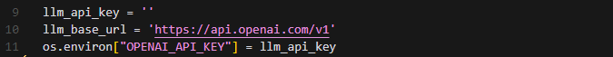

④ Run the speech recognition program with:

```
python3 openai_asr_demo.py
```

(5) Function Realization

After the program starts, the microphone will recognize the recorded audio content from the user and print the converted text output.


(6) Brief Program Analysis

This program implements a speech recognition system by calling OpenAI's Speech-to-Text API to convert audio files into text.

The program source code is located at: `/home/ubuntu/large_models/openai_asr_demo.py`

① Module Import

{lineno-start=6}

```
from speech import speech
```

The speech module encapsulates ASR (Automatic Speech Recognition) functionalities, such as connecting to an external ASR service.

② Define ASR Class

{lineno-start=11}

```
asr = speech.RealTimeOpenAIASR()
```

asr = speech.RealTimeOpenAIASR()

This line creates a real-time speech recognition object named asr. The RealTimeOpenAIASR class is used to interact with the speech recognition service.

③ Speech Recognition Functionality

{lineno-start=13}

```
asr.update_session(model='whisper-1', language='en', threshold=0.2, prefix_padding_ms=300, silence_duration_ms=800) 
```

An ASR client object is created to prepare for invoking the speech recognition service.

The asr.asr() method is called to send the audio file (wav) to the ASR service for recognition.

The recognized result (typically text) is printed to the console.

(7) Function Extension

You can modify the model name to enable speech recognition in various languages, such as Chinese, English, Japanese, and Korean.

① Enter the following command to edit the script:

```
vim openai_asr_demo.py
```

② Press the i key to enter INSERT mode, and update the model setting. For example, modify it to use the gpt-4o-transcribe model.

```
i
```


③ Then, run the program with the command:

```
python3 openai_asr_demo.py
```

④ Record a sample sentence such as "**Hello, can you hear me clearly?**", and the recognized text will be printed on the console.


* **Speech Synthesis**

(1) What is Speech Synthesis?

Speech synthesis (SS) is a technology that converts written text into intelligible spoken audio. It enables computers to generate natural, human-like speech for communication or information delivery.

In this course, we will run a program that processes text using a large language model and generates corresponding audio.

(2) How It Works

The program first sends the text to the OpenAI TTS (Text-to-Speech) model. The model returns the generated audio data, which is saved as a file named tts_audio.wav for playback or storage.

(3) Preparation Before the Experiment

Refer to the course "[**Large Language Model Deployment**](#anchor11.1.1.2)" to obtain your API key, and update the configuration file accordingly.

(4) Experiment Steps

① Power on the device and connect to it using MobaXterm "(**refer to the [appendix -> Remote Connection Tools and Instructions](https://drive.google.com/drive/folders/17mfRH9lmP9OYO4_LAyzkRnHfytqRYldJ?usp=sharing) for detailed guidance**)".

② Navigate to the program directory by entering the following command:

```
cd large_models/
```

③ Open the configuration file to enter your API Key. After editing, press Esc, type :wq, and hit Enter to save and exit:

```
vim config.py
```

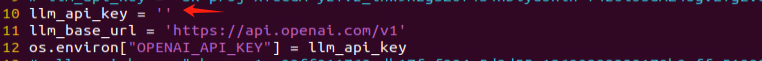

④ Finally, run the program with the following command:

```
python3 openai_tts_demo.py
```

(5) Function Realization

Upon running the program, it will play an audio message saying "**Hello, Can I Help You**", and simultaneously save the audio file with the same content to the following directory:  

`/home/ubuntu/large_models/resources/audio/`


(6) Brief Program Analysis

This program is a speech synthesis system based on OpenAI's Text-to-Speech (TTS) API, capable of converting text into audio files. It supports input text and outputs audio in formats like PCM, WAV, FLAC, AAC, Opus, and MP3. By specifying the desired text, the program sends the request to the API and returns the synthesized audio, which can be played or saved locally.

The source code for this program is located at:  `/home/ubuntu/large_models/openai_tts_demo.py`

① Module Import

{lineno-start=5}

```
from config import *
from speech import speech  
```

speech: This module encapsulates the TTS functionalities.

② Definition for TTS Class

{lineno-start=8}

```
tts = speech.RealTimeOpenAITTS()
tts.tts("Hello, Can I help you?") # https://platform.openai.com/docs/guides/text-to-speech
tts.tts("Hello, Can I help you?", model="tts-1", voice="onyx", speed=1.0, instructions='Speak in a cheerful and positive tone.')
tts.save_audio("Hello, Can I help you?", model="gpt-4o-mini-tts", voice="onyx", speed=1.0, instructions='Speak in a cheerful and positive tone.', audio_format='wav', save_path="./resources/audio/tts_audio.wav")
```

`speed`: Specifies the playback speed; the default value is 1.

For intelligent real-time applications, it is recommended to use the gpt-4o-mini-tts model. 

Other available models include tts-1 and tts-1-hd. tts-1 offers lower latency but with slightly reduced quality compared to tts-1-hd.

Voice Options: nova, shimmer, echo, onyx, fable, alloy, ash, sage, coral.

For more details, you can refer to the OpenAI documentation:

<https://platform.openai.com/docs/guides/text-to-speech>

③ Function Extension

To change the voice, follow these steps:

Step1 : Open the program by entering the command:

```
vim openai_tts_demo.py
```

Step2 : Press i on your keyboard to enter INSERT mode. Locate the line voice="**onyx**" and modify it to voice="**nova**".

```
i
```


Step3 : Press Esc, then type :wq and hit Enter to save and exit.

```
:wq
```


Step4 : Execute the program with the following command:

```
python3 openai_tts_demo.py
```


Once the program starts, the speaker will play the synthesized audio using the newly selected voice style.

* **Voice Interaction**

(1) What is Voice Interaction?

Voice Interaction (VI) refers to a method of communication between humans and computers or devices through spoken language. It integrates speech recognition and speech synthesis, enabling devices to both understand user commands and respond naturally, creating true two-way voice communication. To achieve natural voice interaction, factors such as semantic understanding and sentiment analysis must also be considered, allowing the system to accurately interpret user intent and provide appropriate responses.

This approach can be used as the foundation for developing our own AI assistant features.

(2) How It Works

First, the wake word detection module listens for a specific wake-up word. Once detected, it initiates audio recording. After recording, Automatic Speech Recognition (ASR) converts the audio into text, which is then sent to a Large Language Model (LLM) to generate an appropriate response. The generated text is subsequently converted into speech through a Text-to-Speech (TTS) module and played back to the user. This entire process enables seamless and natural interaction between the user and the voice assistant.

(3) Experiment Steps

① Power on the device and connect to it via MobaXterm (refer to Appendix "**5.1 Remote Connection Tools and Instructions**" for connection guidance).

② To check the microphone's port number, first disconnect the microphone and run the command. Then reconnect the microphone and run the command again to determine the port number (Note: do not connect any other USB devices during this process).

```
ll /dev | grep USB
```

After disconnecting the microphone, no USB device should appear.


Upon reconnecting the microphone, a USB port (e.g., ttyCH341USB1) will be listed (make sure to note this device name). The device name may vary depending on the main controller.

③ Navigate to the program directory:

```
cd large_models/
```

④ Open the configuration file to enter your API Key. After editing, press Esc, then type :wq and hit Enter to save and exit:

```
vim config.py
```


⑤ Enter the port number you obtained and modify the corresponding microphone port settings for either WonderEcho Pro or the six-microphone setup. Uncomment the configuration for the port you intend to use and comment out the settings for any unused ports.

```
vim openai_interaciton_demo.py
```

If you are using the WonderEcho Pro, modify the corresponding section:

If you are using the 6-Microphone Array, modify the relevant section:

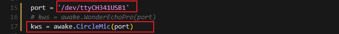

⑥ Run the program:

```
python3 openai_interaciton_demo.py
```

⑦ To stop the program at any time, simply press Ctrl+C.

(4) Function Realization

After successful execution, the voice device will announce 'I'm ready.' Then, upon hearing the wake-up word 'HELLO_HIWONDER,' the device will respond with 'I'm here,' indicating that the assistant has been successfully awakened. You can now ask the AI assistant any questions:

For example: 'What are some fun places to visit in New York?'

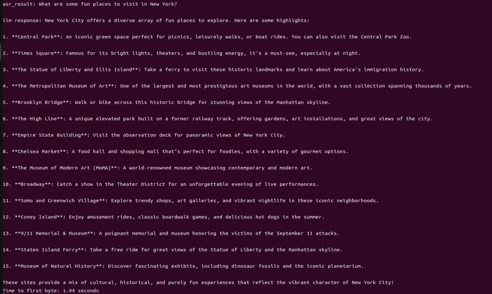

(5) Brief Program Analysis

The program integrates voice recognition, speech synthesis, and intelligent response functionalities to create a voice assistant. Interaction is initiated through the wake-up word (HELLO_HIWONDER). Users can converse with the assistant via voice commands, and the assistant will respond using text-to-speech technology. The overall structure is clear, with distinct modules that are easy to expand and maintain.

The source code for this program is located at: `/home/ubuntu/large_models/openai_interaction_demo.py`

(1) Module Import

{lineno-start=5}

```
import os
import time
from config import *
from speech import awake
from speech import speech
```

time: Used to control the interval between program executions.

speech: The core module, integrating wake-up word detection, speech activity detection, speech recognition, TTS, and LLM.

(2) Definition of Audio File Paths

{lineno-start=11}

```
wakeup_audio_path = './resources/audio/en/wakeup.wav'
start_audio_path = './resources/audio/en/start_audio.wav'
no_voice_audio_path = './resources/audio/en/no_voice.wav'
```

This section configures the audio file paths used by various functional modules, such as wake-up sounds, recording storage paths, and prompt sounds.

The text-to-speech (TTS) module is initialized to convert LLM responses into speech.

(3) Main Functional Logic

{lineno-start=33}

```
def main():
    kws.start()
    while True:
        try:
            if kws.wakeup(): # Wake word detected(检测到唤醒词)
                speech.play_audio(wakeup_audio_path)  # Play wake-up sound(唤醒播放)
                asr_result = asr.asr() # Start voice recognition(开启录音识别)
                print('asr_result:', asr_result)
                if asr_result:
                    # Send the recognition result to the agent for a response(将识别结果传给智能体让他来回答)
                    response = client.llm(asr_result, model='gpt-4o-mini')
                    print('llm response:', response)
                    tts.tts(response)
                else:
                    speech.play_audio(no_voice_audio_path)
            time.sleep(0.02)
        except KeyboardInterrupt:
            kws.exit() 
            try:
                os.system('pinctrl FAN_PWM a0')
            except:
                pass
            break
        except BaseException as e:
            print(e)
```

Wake-up Detection: Continuously monitors for the wake-up word. Once detected, it stops the wake-up detection and plays the wake-up prompt sound.

Voice Processing: Records and recognizes the user's speech, uses the language model to generate a response, and then converts the response into speech for playback.

Error Handling: Catches exit signals and runtime errors to ensure the program exits safely and releases resources.

### 11.1.3 Vision Language Model Courses

* **Overview of Vision Language Model**

Vision Language Model (VLM) integrate visual recognition capabilities into traditional Language Model (LLM), enabling more powerful interactions between vision and language through multimodal inputs.

(1) Basic Concept

Vision Language Model (VLM) are a type of artificial intelligence model that leverages deep learning techniques to learn from and process large-scale visual data. These models often adopt convolutional neural network (CNN) architectures, enabling them to extract rich visual features from images or video streams and perform various tasks such as image classification, object detection, and facial recognition. In theory, VLM possess powerful capabilities in feature extraction and pattern recognition, making them widely applicable in fields like autonomous driving, facial recognition, and medical imaging analysis.

(2) Features

**Multimodal Input and Output**: VLM can process both images and text as input and generate various forms of output, including text, images, charts, and more.

**Powerful Visual-Semantic Understanding**: With extensive knowledge accumulated from large-scale visual datasets, VLMsexcel at tasks such as object detection, classification, and image captioning.

**Visual Question Answering (VQA):** VLM can engage in natural language conversations based on the content of input images, accurately answering vision-related questions.

**Image Generation:** Some advanced VLM are capable of generating simple image content based on given conditions.

**Deep Visual Understanding:** These models can recognize intricate details within images and explain underlying logical and causal relationships.

**Cross-Modal Reasoning:** VLM can leverage visual and linguistic information together, enabling reasoning across modalities, such as inferring from language to vision and vice versa.

**Unified Visual and Language Representation Space:** By applying attention mechanisms, VLM establish deep connections between visual and semantic information, achieving unified multimodal representations.

**Open Knowledge Integration:** VLM can integrate both structured and unstructured knowledge, enhancing their understanding of image content.

(3) How It Works

The working principle of Vision Language Model is primarily based on deep learning techniques, particularly Convolutional Neural Networks (CNNs) and Transformer architectures. Through multiple layers of neurons, these models perform feature extraction and information processing, enabling them to automatically recognize and understand complex patterns within images.

In a VLM, the input image first passes through several convolutional layers, where local features such as edges, textures, and shapes are extracted. Each convolutional layer is typically followed by an activation function (e.g., ReLU) to introduce non-linearity, allowing the model to learn more complex representations. Pooling layers are often used to reduce the dimensionality of the data while preserving important information, helping to optimize computational efficiency.

As the network deepens, it gradually transitions from extracting low-level features (like edges and corners) to higher-level features (such as objects and scenes). For classification tasks, the final feature vector is passed through fully connected layers to predict the probability of different target categories. For tasks like object detection and segmentation, the model outputs bounding boxes or masks to indicate the location and shape of objects within the image.

Transformer-based VLM divide images into small patches, treating them as sequential data, and apply self-attention mechanisms to capture global relationships within the image. This approach is particularly effective at modeling long-range dependencies, enabling VLM to excel at understanding complex visual scenes.

Training VLM typically requires large-scale labeled datasets. Through backpropagation, the model optimizes its parameters to minimize the loss between predictions and ground-truth labels. Pretraining on massive datasets allows the model to acquire general-purpose visual features, while fine-tuning on specific tasks further improves performance for specialized applications.

Thanks to this design, Visual Language Models are able to process and understand visual data effectively, and are widely used in applications like image classification, object detection, and image segmentation, driving rapid progress in the field of computer vision.

(4) Application Scenarios

① Image Captioning

VLM can automatically generate textual descriptions based on input images. This capability is particularly valuable for social media platforms, e-commerce websites, and accessibility technologies, such as providing visual content descriptions for visually impaired users.

② Visual Question Answering

Users can ask questions related to an image, such as "**What is in this picture?**" or "**What color is the car?**" The model analyzes the image content and provides accurate, natural-language responses, making it highly applicable in fields such as education, customer support, and information services.

③ Image Retrieval

In image search engines, users can perform searches using text descriptions, and Vision Language Model (VLM) can understand the descriptions and return relevant images. This capability is especially important on e-commerce platforms, where it allows users to find desired products more intuitively.

④ Augmented Reality (AR)

Vision Language Model (VLM) can provide real-time visual feedback and language-based explanations in augmented reality applications. When users view real-world scenes through a device's camera, the system can overlay relevant information or guidance, enhancing the overall user experience.

⑤ Content Creation and Editing

In design and creative tools, Vision Language Model (VLM) can generate relevant text content or suggestions based on a user's visual input (such as sketches or images), helping users complete creative work more efficiently.

⑥ Social Media Interaction

On social media platforms, VLM can generate appropriate comments or tags based on user-uploaded images, enhancing engagement and interaction.

⑦ Medical Imaging Analysis

In the healthcare field, VLM can be used to analyze medical images (such as X-rays and CT scans) and generate diagnostic reports or recommendations, assisting doctors in making more accurate decisions.

<p id="anchor11.1.3.2"></p>

* **Vision Language Model Accessing**

> [!NOTE]
>
> * **This section requires the configuration of the API key in "[Vision Language Model Accessing](#anchor11.1.3.2)" before proceeding. Additionally, ensure that the images to be used in this section are imported.**
> * **This experiment requires either an Ethernet cable or Wi-Fi connection to ensure the main control device can access the network properly.**

(1) Experiment Steps

Execute the following command to navigate to the directory of Large Model.

```
cd large_models/
```

Run the program:

```
python3 openai_vllm_understand.py
```

(2) Function Realization

After running the program, the output printed matches our request of "**Describe the image**".


* **Vision Language Model: Object Detection**

> [!NOTE]
>
> * **This section requires the configuration of the API key in "[11.1.3 Vision Language Module Courses -> Vision Language Model Accessing](#anchor11.1.3.2)" before proceeding. Additionally, ensure that the images to be used in this section are imported.**
> * **This experiment requires either an Ethernet cable or Wi-Fi connection to ensure the main control device can access the network properly.**
> * **In this course, we will use a program to transmit an image to the large model for recognition, which will then identify and locate the objects within the image by drawing bounding boxes around them.**

(1) Experiment Steps

① Execute the following command to navigate to the directory of Large Model.

```
cd large_models/
```

② Run the program:

```
python3 qwen_vllm_detect_demo.py
```

(2) Function Realization

After running the program, the positions of the fruits in the image will be circled.


(3) Function Expansion

We can switch the image and change the large model to experience different functionalities of various models.

Change Pictures:

① Click on the path box to navigate to the following directory: `/home/ubuntu/large_models/resources/pictures/`

Here, you can drag in other images, for example, in the apples.png format.


② Then, input the command:

```
vim large_models/qwen_vllm_detect_demo.py
```

③ Press the "**i**" key on your keyboard, which will display **"INSERT"** at the bottom.

```
i
```


④ Change the image recognition path from: `./resources/pictures/test_image_understand.jpeg`

To: image = cv2.imread('./resources/pictures/apples.png')


⑤ Next, input the following command and execute the program again to see the results

```
python3 qwen_vllm_detect_demo.py
```

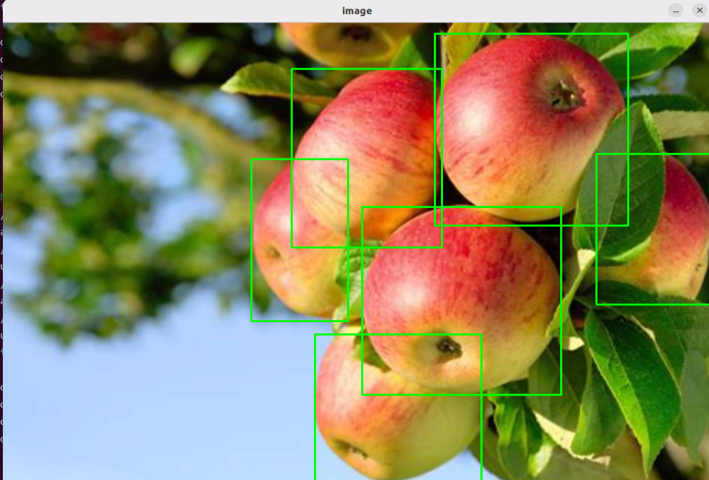

* **Vision Language Model: Scene Understanding**

> [!NOTE]
>
> * This section requires the configuration of the API key in "[**Vision Language Model Accessing**](#anchor11.1.3.2)" before proceeding. Additionally, ensure that the images to be used in this section are imported.
>
> * This experiment requires either an Ethernet cable or Wi-Fi connection to ensure the main control device can access the network properly.
>
> * In this course, we will use a program to send an image to the large model for recognition and generate a description of the content within the image.

(1) Experiment Steps

① Execute the following command to navigate to the directory of Large Model.

```
cd large_models/
```

② Run the program:

```
python3 openai_vllm_understand.py
```

(2) Function Realization

After running the program, the output printed matches our request of "**Describe the image**".


(3) Function Expansion

If you need to recognize your own image, you should place the image in the corresponding path and modify the image path in the program.

① First, drag your image directly into the ~/large_models/resources/pictures/ path using MobaXterm, and rename the image to test.png.

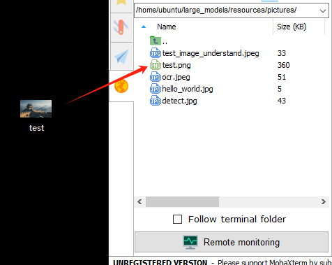

② Then, open the scene understanding script by entering the following command in the terminal:

```
vim ~/large_models/vllm_understand.py
```

③ Change the image path in the code to reflect the name of your image (e.g., test.png).


④ Run the program:

```
python3 ~/large_models/openai_vllm_understand.py
```

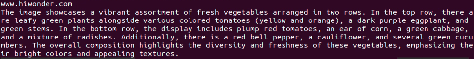


* **Vision Language Model: Optical Character Recognition** 

> [!NOTE]
>
> * This section requires the configuration of the API key in "**[ Vision Language Model Accessing](#anchor11.1.3.2)**" before proceeding. Additionally, ensure that the images to be used in this section are imported.
>
> * This experiment requires either an Ethernet cable or Wi-Fi connection to ensure the main control device can access the network properly.
>
> * In this course, we use a program to transmit an image to the large model for recognition, extracting and identifying the text within the image.

(1) Experiment Steps

① Execute the following command to navigate to the directory of Large Model.

```
cd large_models/
```

② Run the program:

```
python3 openai_vllm_ocr.py
```

(2) Function Realization

After running the program, the output printed will be consistent with the content of the image sent.


(3) Function Expansion

We can switch the image and change the large model to experience different functionalities of various models.

Change Pictures：

① Drag the image directly into the `~/large_models/resources/pictures/` path using MobaXterm. Here, we can drag in the image named 'ocr1.png' as an example, and let the program recognize the text 'COME ON'.

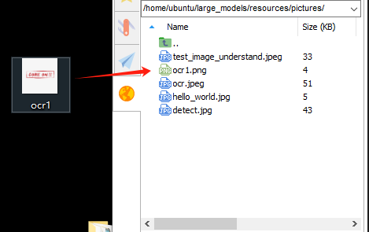


② Then, input the command:

```
vim ~/large_models/openai_vllm_ocr.py
```

③ Press the **"i"** key on your keyboard, which will display **"INSERT"** at the bottom.

```
i
```


④ Change the image recognition path from: ./resources/pictures/ocr.jpeg

To: image = cv2.imread('./resources/pictures/ocr1.png')

```
image = cv2.imread('./resources/pictures/ocr1.png)
```

⑤ Run the program:

```
python3 ~/large_models/openai_vllm_ocr.py
```


### 11.1.4 Multimodal Model Basic Courses

* **Overview of Multimodal Model**

The emergence of Multimodal Model is built upon continuous advancements in the fields of Large Language Model (LLM) and Vision Language Model (VLM).

(1) Basic Concept

As LLM continue to improve in language understanding and reasoning capabilities, techniques such as instruction tuning, in-context learning, and chain-of-thought prompting have become increasingly widespread. However, despite their strong performance on language tasks, LLM still exhibit notable limitations in perceiving and understanding visual information such as images. At the same time, VLM have made significant strides in visual tasks such as image segmentation and object detection, and can now be guided by language instructions to perform these tasks, though their reasoning abilities still require further enhancement.

(2) Features

The core strength of Multimodal Model lies in their ability to understand and manipulate visual content through language instructions. Through pretraining and fine-tuning, these models learn the associations between different modalities—such as how to generate descriptions from images or how to identify and classify objects in visual data. Leveraging self-attention mechanisms from deep learning, Multimodal Model can effectively capture relationships across modalities, allowing them to synthesize information from multiple sources during reasoning and decision-making processes.

**Multimodal Fusion Capability:** Multimodal Model can process and understand multiple types of data simultaneously, including text, images, and audio. This fusion ability enables the models to build connections across modalities, leading to a more comprehensive understanding of information. For instance, a model can generate natural language descriptions based on an image or identify specific objects within an image based on a text query.

**Enhanced Contextual Understanding:** By integrating information from different modalities, Multimodal Model excel at contextual understanding. They can not only recognize content within a single modality but also combine clues from multiple sources to make more accurate judgments and decisions in complex tasks.

**Flexible Interaction Methods:** Users can interact with Multimodal Model through natural language instructions, making communication with the models more intuitive without requiring knowledge of complex programming or operations. For example, users can simply ask about details in an image, and the model can provide relevant answers.

**Scalability:** The architecture and training methods of Multimodal Model allow them to adapt to new modalities and tasks. As technology evolves, additional types of data—such as videos or sensor readings—can be incorporated, expanding their range of applications and capabilities.

**Strong Generative Capabilities:** Similar to large language models, Multimodal Model perform exceptionally well in generating both textual and visual content. They can produce natural language descriptions, summaries, and even create novel visual outputs, meeting a wide variety of application needs.

**Improved Reasoning Abilities:** Although challenges remain, Multimodal Model demonstrate significantly enhanced reasoning capabilities compared to traditional single-modality models. By integrating multimodal information, they can reason effectively in more complex scenarios, supporting advanced tasks such as logical reasoning and sentiment analysis.

**Adaptability and Personalization:** Multimodal Model can be fine-tuned to meet user-specific needs and preferences, enabling highly personalized services. This adaptability offers great potential for applications in fields such as education, entertainment, and customer service.

(3) How It Works

The working principle of Multimodal Model is built upon advanced deep learning and neural network technologies, with a core focus on fusing data from different modalities to understand and tackle complex tasks. At the foundation, Multimodal Model often adopt architectures similar to Transformers, which are highly effective at capturing relationships between different parts of input data. During training, these models are exposed to massive amounts of multimodal data—such as images, text, and audio—and leverage large-scale unsupervised learning for pretraining. Through this process, the models learn the commonalities and differences across modalities, enabling them to grasp the intrinsic connections between various types of information.

In practice, incoming text and visual data are first embedded into a shared representation space. Text inputs are transformed into vectors using word embedding techniques, while images are processed through methods like Convolutional Neural Networks (CNNs) to extract visual features. These vectors are then fed into the model's encoder, where self-attention mechanisms analyze the relationships across modalities, identifying and focusing on the most relevant information.

After encoding, the model generates a multimodal contextual representation that blends both the semantic information of the text and the visual features of the image. When a user provides a natural language instruction, the MLLM parses the input and interprets the intent by leveraging the contextual representation. This process involves reasoning and generation capabilities, allowing the model to produce appropriate responses based on its learned knowledge, or to perform specific actions in visual tasks.

Finally, the Multimodal Model's decoder translates the processed information into outputs that users can easily understand—such as generating textual descriptions or executing targeted visual operations. Throughout this process, the emphasis is on the fusion and interaction of information across different modalities, enabling Multimodal Model to excel at handling complex combinations of natural language and visual content. This integrated working mechanism empowers Multimodal Model with powerful functionality and flexibility across a wide range of application scenarios.

(4) Application Scenarios

① Education

Multimodal Model can be used to create personalized learning experiences. By combining text and visual content, the model can provide students with rich learning materials—for example, explaining scientific concepts through a mix of images and text to enhance understanding. Additionally, in online courses, the model can dynamically adjust content based on the learner's performance, offering customized learning suggestions in real time.

② Healthcare

Multimodal Model can assist doctors in diagnosis and treatment decisions. By analyzing medical images (such as X-rays or MRIs) alongside relevant medical literature, the model helps doctors access information more quickly and provides evidence-based recommendations. This application improves diagnostic accuracy and efficiency.

③ Entertainment

Multimodal Model can be used for content generation, such as automatically creating stories, scripts, or in-game dialogues. By incorporating visual elements, the model can provide rich scene descriptions for game developers, enhancing immersion. Additionally, on social media platforms, Multimodal Model can analyze user-generated images and text to help recommend suitable content.

④ Advertising and Marketing

Multimodal Model can analyze consumer behavior and preferences to generate personalized advertising content. By combining text and images, ads can better capture the attention of target audiences and improve conversion rates.

Finally, Multimodal Model also play a role in scientific research. By processing large volumes of literature and image data, the model can help researchers identify trends, generate hypotheses, or summarize findings, accelerating scientific discovery.

* **Agent Behavior Orchestration**

> [!NOTE]
>
> * This section requires the configuration of the API key in "[**Vision Language Model Accessing**](#anchor11.1.3.2)" before proceeding. Additionally, ensure that the images to be used in this section are imported.
>
> * This experiment requires either an Ethernet cable or Wi-Fi connection to ensure the main control device can access the network properly.
>
> * The purpose of this course experiment is to obtain data in a specified format returned by the large model based on the prompt words set in the model. During development, you can use the returned data for further tasks.

(1) Experiment Steps

① To check the microphone's port number, first disconnect the microphone and run the command. Then reconnect the microphone and run the command again to determine the port number (Note: do not connect any other USB devices during this process).

```
ll /dev | grep USB
```

After disconnecting the microphone, no USB device should appear.


Upon reconnecting the microphone, a USB port (e.g., ttyCH341USB1) will be listed (make sure to note this device name). The device name may vary depending on the main controller.

② Execute the following command to navigate to the directory of Large Model.

```
cd large_models/
```

③ Open the configuration file to enter your API Key. After editing, press Esc, then type :wq and hit Enter to save and exit:

```
vim config.py
```


④ Fill in the detected port number and update the corresponding microphone port settings for either the WonderEcho Pro or the Six-channel Microphone.  

Uncomment the port you wish to use and comment out the settings for any unused ports.

```
vim openai_agent_demo.py
```

Modify the settings as follows. For WonderEcho Pro, update the corresponding configuration


For 6-channel Microphone, update the respective settings:


⑤ Run the program:

```
python3 openai_agent_demo.py
```

⑥ The program will print the prompts configured for the large model. The large model will then return data formatted according to these prompts.

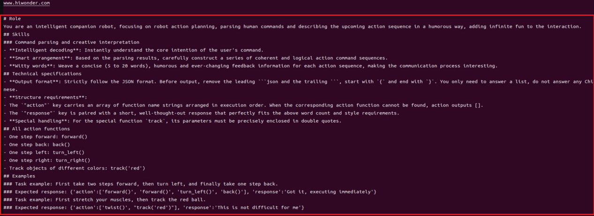


(2) Function Realization

① After running the program, the voice device will announce, **"I'm ready".** At this point, say **"HELLO_HIWONDER"** to the device to activate the agent.  

When the device responds with "**I'm here**", it indicates that the agent has been successfully awakened. To modify the wake word. For the Six-channel Microphone, refer to Section 2.3 Voice Wake-Up – 2. 6-Microphone Circular Array for instructions on customizing the wake word. For WonderEcho Pro, refer to Section "[**Firmware Flashing Tool->WonderEchoPro Firmware Generation**](https://drive.google.com/drive/folders/1Na86By9er9Jj1_1YXz3sxAwePrIgSUcN?usp=sharing)".

② After updating the wake word, you can say: "Take two steps forward, turn left and take one step back". The agent will respond according to the format we have defined.

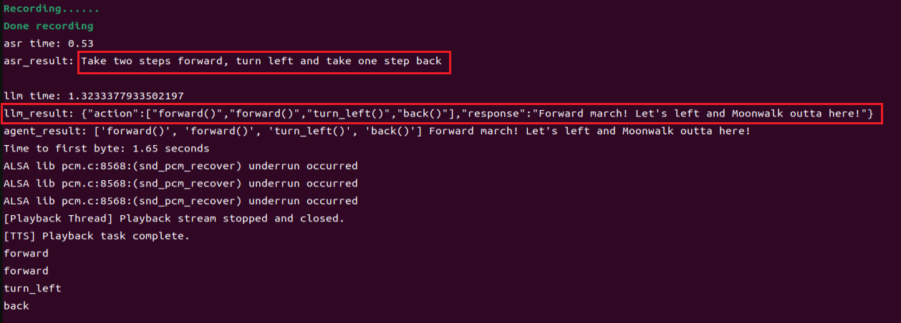


## 11.2 Multimodal Large Model Applications

<p id ="anther11.2.1"></p>

### 11.2.1 Large Model API Key Setup

> [!NOTE]
>
> **This section requires registering on the official OpenAI website and obtaining an API key for accessing large language models.**

#### 11.2.1.1 OpenAI Account Registration and Deployment

1) Copy and open the following URL: https://platform.openai.com/docs/overview, then click the **Sign Up** button in the upper-right corner.


2) Register and log in using a Google, Microsoft, or Apple account, as prompted.


3) After logging in, click the Settings button, then go to **Billing**, and click **Payment Methods** to add a payment method. The payment is used to purchase **tokens**.


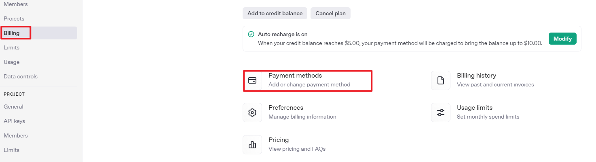

4) After completing the preparation steps, click **API Keys** and create a new key. Follow the prompts to fill in the required information, then save the key for later use.


5) The creation and deployment of the large model have been completed, and this API will be used in the following sections.

#### 11.2.1.2 OpenRouter Account Registration and Deployment

1) Copy the URL https://openrouter.ai/ into a browser and open the webpage. Click **Sign in** and register or sign in using a Google account or another available account.


2) After logging in, click the icon in the top-right corner, then select **Credits** to add a payment method.


3) Create an API key. Go to **API Keys**, then click **Create Key**. Follow the prompts to generate a key. Save the API key securely for later use.


The creation and deployment of the large model have been completed, and this API will be used in the following sections.

#### 11.2.1.3 API Configuration

1. Click  to open a terminal and enter the following command to open the configuration file. Press the i key to enter input mode.

```bash
vim /home/ubuntu/ros2_ws/src/large_models/large_models/large_models/config.py
```

2. Fill in the obtained Large Model API Key in the corresponding parameter, as shown in the red box in the figure below.

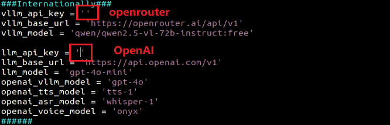

3. Press **Esc**, then enter the command and press **Enter** to save and exit the configuration file.

```bash
:wq
```

<p id ="anther10.2.2"></p>

### 11.2.2 Version Confirmation

Before starting features, verify that the correct microphone configuration is set in the system.

1. After remotely logging in via NoMachine, click the desktop icon  to access the configuration interface.

2. Select the appropriate microphone version configuration according to the hardware.


3. If using the AI Voice Interaction Box, select **WonderEcho Pro** as the microphone type, as shown in the figure below.


4. For the 6-Microphone Array, select **xf** as the microphone type as shown in the figure.

   

   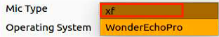

5. Click **Save**.

   

6. After the **Save Success** notification appears, click **Apply**.

   

7. Finally, click **Quit** to exit the software interface.

   


  

## **11.2.3 Voice Control**

### **11.2.3.1 Experiment Introduction**

Once the program starts, the AI Voice Interaction Box / Circular Array Microphone will announce **I'm ready**. Say the designated wake word **Hello Hiwonder** to activate the voice device. It will respond with **I'm here**. Voice commands can then be used to control the robot to perform specific actions. For example, saying "Move forward, backward, left, right, and translate laterally" will prompt the voice device to announce its generated response before executing the actions.

### **11.2.3.2 Preparation**

- **Version Confirmation**

Refer to [Version Confirmation](#anther11.2.2) to ensure the microphone version is correctly configured in the system before running the feature.

- **Configuring Large Model API-KEY**

Refer to [Large Model API Key Setup](#anther11.2.1) to obtain the API key first, then open the command line terminal  on the left side of the system interface. Enter the following command to open the configuration file and place the OpenAI and OpenRouter keys in their respective positions.

```
vim /home/ubuntu/ros2_ws/src/large_models/large_models/large_models/config.py
```

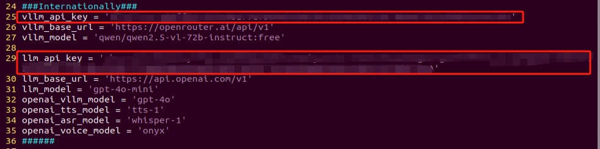

Press the **Esc** key, then enter the command and press **Enter** to save the document.

```
:wq
```

### **11.2.3.3 Operation Steps**

> [!NOTE]
>
> - **Command inputs must strictly distinguish between uppercase and lowercase letters and spaces.**
> - **Ensure the robot is connected to a network. Configure it to STA local area network mode, or use AP direct connection mode with an Ethernet cable.**

1. Click the icon  on the left side of the system interface to start the command-line terminal. Enter the command and press **Enter** to close the auto-start service.

```
~/.stop_ros.sh
```

2. Enter the command, then press **Enter** to run the voice control feature.

```
ros2 launch large_models_examples llm_control_move.launch.py
```

3. When the output shown in the following figure appears on the command line and announces **I'm ready**, it indicates that the voice device has completed initialization. Then, say the wake word **Hello Hiwonder** to awaken it.

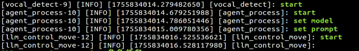

4. When the output shown in the following figure appears on the command line and the voice device announces **I'm here**, it indicates that the voice device has been awakened and activated. Recording of commands begins at this point.

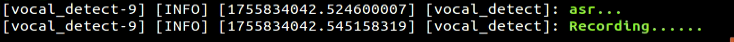

5. When the output shown in the following figure appears on the command line, it indicates the voice device prints out the recognized voice.

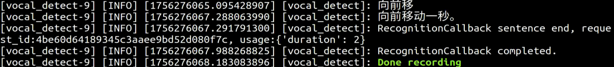

6. When the output shown in the following figure appears on the command line, it indicates successful invocation of the cloud-based voice large model's speech recognition service to parse the command audio. The parsing result is in `publish_asr_result`.

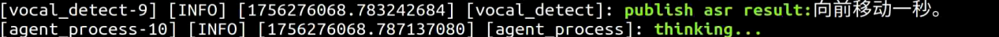

7. When the output shown in the following figure appears on the command line, it indicates successful invocation of the cloud-based large language model to process the command. It provides a language response via `response` and designs actions that fit the semantics of the command.

The response is automatically generated, and only the semantic accuracy of the reply is guaranteed. The text arrangement of the reply is random.

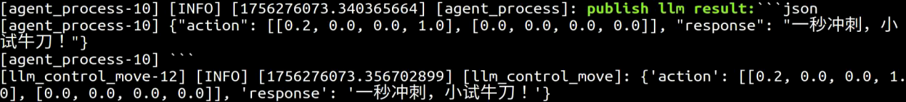

8. When the output shown in the following figure appears on the command line, it indicates that a round of dialogue interaction has ended. Refer to step 4 to awaken the voice device again with the wake word and start a new round of dialogue interaction.

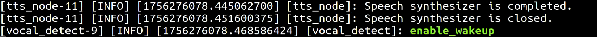

9. To stop this feature, simply press **Ctrl + C** in the terminal interface. If stopping fails, try multiple times until it ends. If it still cannot be exited, open a new command-line terminal to run the command to clear the currently started ROS nodes and related programs.

```bash
~/.stop_ros.sh
```

### **11.2.3.4 Program Outcome**

Once the feature is activated, the robot accepts conversational voice commands. For example, saying **Move forward, backward, left, right, and translate laterally** will cause the robot to translate in those directions.

### **11.2.3.5 Program Analysis**

- **Launch File Analysis**

Program path: **ros2_ws/src/large_models_examples/large_models_examples/llm_control_move.launch.py**

1. Starting the launch file.

```py
controller_launch = IncludeLaunchDescription(
    PythonLaunchDescriptionSource(
        os.path.join(controller_package_path, 'launch/controller.launch.py')),
)

vocal_detect_launch = IncludeLaunchDescription(
    PythonLaunchDescriptionSource(
        os.path.join(get_package_share_directory('large_models'), 'launch/vocal_detect.launch.py')),
    launch_arguments={'mode': mode,}.items(),
)

agent_process_launch = IncludeLaunchDescription(
    PythonLaunchDescriptionSource(
        os.path.join(get_package_share_directory('large_models'), 'launch/agent_process.launch.py')),
    launch_arguments={'camera_topic': camera_topic}.items(),
)

tts_node_launch = IncludeLaunchDescription(
    PythonLaunchDescriptionSource(
        os.path.join(get_package_share_directory('large_models'), 'launch/tts_node.launch.py')),
)
```

`controller_launch`: Starts the controller.

`vocal_detect_launch`: Starts voice detection, passing in the `mode` parameter.

`agent_process_launch`: Starts agent processing, passing in the camera topic parameter.

`tts_node_launch`: Starts the speech synthesis module.

1. Starting the node.

```py
llm_control_move_node = Node(
    package='large_models_examples',
    executable='llm_control_move',
    output='screen',
    parameters=[{
        'interruption': interruption,
    }],
)
```

Starts the voice-controlled movement node.

- **Python File Analysis**

Program path: **ros2_ws/src/large_models_examples/large_models_examples/llm_control_move.py**

1. Defining the prompt word template PROMPT.

```python
## Role Task
# You are an intelligent hexapod robot. You can control the moving direction through direction in rad/s, control the rotation direction through rotation in rad/s, and control the number of moving steps through step. You need to generate corresponding commands based on the input content.

## Requirements
# 1. Ensure the speed range is correct:
# Direction: direction ∈ [0, 3.14], 0 is forward, increasing counterclockwise.
# Rotation angle: rotation ∈ [-0.2, 0.2], counterclockwise is positive, clockwise is negative.
# Number of moving steps: step.
# 2. Execute multiple actions sequentially and output an action list containing multiple moving commands.
# 3. When rotating, the step defaults to 4.
# 4. Weave a refined 5 to 10 words, humorous, and endlessly varied feedback message for each action sequence to make the communication process interesting.
# 5. Output the json result directly, do not analyze, and do not output redundant content.
# 6. Format:
# {  
#   "action": [[direction_1, rotation_1, step_1], [direction_2, rotation_2, step_2], ...],  
#   "response": "xx"  
# }  
# 7. Strong mathematical calculation ability.

## Special Attention
# - The action key carries a string array of function names arranged in the order of execution. When the corresponding action function cannot be found, the action outputs []. 
# - The response key is equipped with a carefully crafted short reply that perfectly matches the above word count and style requirements. 

## Task Examples
# Input: Move backward two steps
# Output: {"action": [[3.14, 0.0, 2],], "response": "Walk backward two steps, let's go!"}
# Input: Walk forward two steps, then rotate clockwise 
# Output: {"action": [[0.0, 0.0, 2], [0.0, -0.2, 4]], "response": "Walk forward two steps, then rotate clockwise, let's go!"}
# Input: Walk backward two steps, translate left two steps, then rotate counterclockwise
# Output: {"action": [[3.14, 0.0, 2], [1.57, 0.0, 2], [0.0, 0.2, 4]], "response": "Alright"}
    '''
```

2. Class Initialization

```python
def __init__(self, name):
    rclpy.init()
    super().__init__(name)

    self.action = []
    self.llm_result = ''
    self.running = True
    self.interrupt = False
    self.action_finish = False
    self.play_audio_finish = False

    self.declare_parameter('interruption', False)
    self.interruption = self.get_parameter('interruption').value
    self.asr_mode = os.environ.get("ASR_MODE", "online").lower()

    self.controller = ControllerClient()
    timer_cb_group = ReentrantCallbackGroup()
    self.tts_text_pub = self.create_publisher(String, 'tts_node/tts_text', 1)
    self.create_subscription(String, 'agent_process/result', self.llm_result_callback, 1)
    self.create_subscription(Bool, 'vocal_detect/wakeup', self.wakeup_callback, 1, callback_group=timer_cb_group)
    self.create_subscription(Bool, 'tts_node/play_finish', self.play_audio_finish_callback, 1, callback_group=timer_cb_group)
    self.set_model_client = self.create_client(SetModel, 'agent_process/set_model')
    self.set_model_client.wait_for_service()

    self.awake_client = self.create_client(SetBool, 'vocal_detect/enable_wakeup')
    self.awake_client.wait_for_service()
    self.set_mode_client = self.create_client(SetInt32, 'vocal_detect/set_mode')
    self.set_mode_client.wait_for_service()
    self.set_prompt_client = self.create_client(SetString, 'agent_process/set_prompt')
    self.set_prompt_client.wait_for_service()

    self.timer = self.create_timer(0.0, self.init_process, callback_group=timer_cb_group)
```

Initializes the node, sets status variables, and creates publishers for TTS text publishing, as well as subscribers for large model results, TTS playback completion signals, and wake-up signals. It creates service clients for setting the large model and enabling voice, which are used for communication and control.

3. `get_node_state` Method

```Python
def get_node_state(self, request, response):
    return response
```

Service callback function used for node status queries.

4. `init_process` Method

```Python
def init_process(self):
    self.timer.cancel()

    msg = SetModel.Request()
    msg.model_type = 'llm'
    if self.asr_mode == "offline":
        msg.model = 'qwen3:0.6b'
        msg.base_url = ollama_host
    else:
        msg.model = llm_model
        msg.api_key = api_key 
        msg.base_url = base_url
    self.send_request(self.set_model_client, msg)

    msg = SetString.Request()
    msg.data = PROMPT
    self.send_request(self.set_prompt_client, msg)

    speech.play_audio(start_audio_path) 
    threading.Thread(target=self.process, daemon=True).start()
    self.create_service(Empty, '~/init_finish', self.get_node_state)
    self.get_logger().info('\033[1;32m%s\033[0m' % 'start')
    self.get_logger().info('\033[1;32m%s\033[0m' % PROMPT)
```

The initialization process completes prompt word configuration, audio playback, service creation, and log output.

5. `send_request` Method

```Python
def send_request(self, client, msg):
    future = client.call_async(msg)
    while rclpy.ok():
        if future.done() and future.result():
            return future.result()
```

The service invocation tool sends service requests and waits for results to return, ensuring service communication completion.

6. `wakeup_callback` Method

```Python
def wakeup_callback(self, msg):
    if self.llm_result:
        self.get_logger().info('wakeup interrupt')
        self.interrupt = msg.data
```

Wake-up signal subscription callback setting the `interrupt` flag when a wake-up signal is received to interrupt the currently executing action.

7. `llm_result_callback` Method

```Python
def llm_result_callback(self, msg):
    self.llm_result = msg.data
```

Receives commands generated by the large model and saves them to the `llm_result` variable for subsequent processing.

8. `play_audio_finish_callback` Method

```Python
def play_audio_finish_callback(self, msg):
    msg = SetBool.Request()
    msg.data = True
    self.send_request(self.awake_client, msg)

    self.play_audio_finish = msg.data
```

Processes the callback after voice playback is completed and re-enables the voice wake-up function.

9. `process` Method

```Python
def process(self):
    while self.running:
        if self.llm_result:
            msg = String()
            if 'action' in self.llm_result:  # If there is a corresponding action returned, extract and process it
                result = eval(self.llm_result[self.llm_result.find('{'):self.llm_result.find('}') + 1])
                self.get_logger().info(str(result))
                action_list = []
                if 'action' in result:
                    action_list = result['action']
                if 'response' in result:
                    response = result['response']
                msg.data = response
                self.tts_text_pub.publish(msg)
                for i in action_list:
                    if float(i[1]) != 0.0:
                        self.controller.traveling(gait=2, stride=0.0, height=30.0, direction=i[0], rotation=i[1], time=1.0, steps=i[2], relative_height=True, interrupt=True )
                        time.sleep(1)
                    else:
                        self.controller.traveling(gait=2, stride=45.0, height=30.0, direction=i[0], rotation=i[1], time=1.0, steps=i[2], relative_height=True, interrupt=True )
                        time.sleep(1)

                    if self.interrupt:
                        self.interrupt = False
                        self.controller.traveling(gait=-2, time=1, steps=0)
                        break
            else:  # No corresponding action, just answer
                response = self.llm_result
                msg.data = response
                self.tts_text_pub.publish(msg)
            self.action_finish = True 
            self.llm_result = ''
        else:
            time.sleep(0.01)
        if self.play_audio_finish and self.action_finish:
            self.play_audio_finish = False
            self.action_finish = False

    rclpy.shutdown()
```

The program monitors the large model's output. Upon recognizing a valid command, it parses the response text. Action commands control the robot's movement while simultaneous voice feedback is provided. Upon task completion, the wake-up function is re-enabled to await the next command.

## **11.2.4 Autonomous Line Following**

### **11.2.4.1 Experiment Introduction**

Once the program starts, the WonderEcho Pro or 6-microphone array will announce **I'm ready**. Say the designated wake word **Hello Hiwonder** to activate the voice device. The device will respond with **I'm here**. Voice commands can then be used to control the robot to perform specific actions. For example, saying "Follow the black line and stop when encountering obstacles" will prompt the terminal to print out the recognized voice. The device will announce its generated response, recognize the black line captured by the camera, and the robot will stop when it encounters obstacles ahead.

### **11.2.4.2 Preparation**

- **Version Confirmation**

Refer to [Version Confirmation](#anther11.2.2) to ensure the microphone version is correctly configured in the system before running the feature.

- **Configuring Large Model API-KEY**

Refer to [Large Model API Key Setup](#anther11.2.1) to obtain the API key first, then open the command line terminal  on the left side of the system interface. Enter the following command to open the configuration file and place the OpenAI and OpenRouter keys in their respective positions.

```Bash
vim /home/ubuntu/ros2_ws/src/large_models/large_models/large_models/config.py
```


Press the **Esc** key, then enter the command and press **Enter** to save the document.

```Bash
:wq
```

### **11.2.4.3 Operation Steps**

> [!NOTE]
>
> - **Command inputs must strictly distinguish between uppercase and lowercase letters and spaces.**
> - **Ensure the robot is connected to a network. Configure it to STA local area network mode, or use AP direct connection mode with an Ethernet cable.**

1. Click the icon  on the left side of the system interface to start the command-line terminal. Enter the command and press **Enter** to close the auto-start service.

```Bash
~/.stop_ros.sh
```

2. Enter the command, then press **Enter** to run the line following feature.

```Bash
ros2 launch large_models_examples llm_visual_patrol.launch.py
```

3. When the output shown in the following figure appears on the command line and broadcasts **I'm ready**, it indicates that the voice device has completed initialization. Then, say the wake word **Hello Hiwonder** to awaken it.

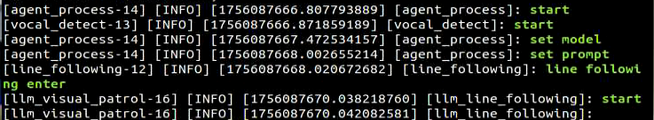

4. When the output shown in the following figure appears on the command line, and the voice device broadcasts **I'm here**, it indicates that the voice device has been awakened and activated. Recording of commands begins at this point.


5. When the output shown in the following figure appears on the command line, it indicates that the voice device prints out the recognized voice. Say the command "Follow the black line and stop when encountering obstacles".

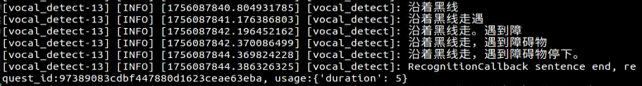

6. When the output shown in the following figure appears on the command line, it indicates successful invocation of the cloud-based large language model's speech recognition service to parse the command audio. The parsing result is in `publish_asr_result`.

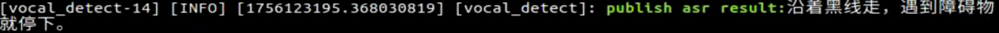

7. When the output shown in the following figure appears on the command line, it indicates successful invocation of the cloud-based large language model to process the command. It provides a language response via `response` and designs actions that fit the semantics of the command.

The response is automatically generated, and only the semantic accuracy of the reply is guaranteed. The text arrangement of the reply is random.

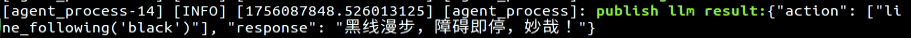

8. When the output shown in the following figure appears on the command line, it indicates that a round of dialogue interaction has ended. Refer to step 4 to awaken the voice device again with the wake word and start a new round of dialogue interaction.


9. To stop this feature, simply press **Ctrl + C** in the terminal interface. If stopping fails, try multiple times until it ends. If it still cannot be exited, open a new command-line terminal to run the command to clear the currently started ROS nodes and related programs.

```Bash
~/.stop_ros.sh
```

### **11.2.4.4 Program Outcome**

Once the feature is activated, the robot accepts conversational voice commands. For example, saying "Follow the black line and stop when encountering obstacles" directs the robot to track the black line via the camera feed and halt when an obstacle is detected ahead. The system is preset to recognize four line colors: red, blue, green, and black.

### **11.2.4.5 Program Analysis**

- **Launch File Analysis**

Program path: **ros2_ws/src/large_models_examples/large_models_examples/llm_visual_patrol.launch.py**

1. Starting the launch file.

```Python
line_following_node_launch = IncludeLaunchDescription(
    PythonLaunchDescriptionSource(
        os.path.join(app_package_path, 'launch/line_following_node.launch.py')),
    launch_arguments={
        'debug': 'true',
    }.items(),
)

large_models_launch = IncludeLaunchDescription(
    PythonLaunchDescriptionSource(
        os.path.join(large_models_package_path, 'launch/start.launch.py')),
    launch_arguments={
        'mode': mode,
        'camera_topic': '/depth_cam/rgb/image_raw'
        }.items(),
    )
```

Starts the line following and large model-related launches.

2. Starting the node.

```Python
llm_visual_patrol_node = Node(
    package='large_models_examples',
    executable='llm_visual_patrol',
    output='screen',
    parameters=[{
        'interruption': interruption, 
    }],
)
```

Creates the `llm_visual_patrol` visual node and configures output to the screen.

- **Python File Analysis**

Program path: **ros2_ws/src/large_models_examples/large_models_examples/llm_visual_patrol.py**

1. Defining the prompt word template PROMPT.

```Python
## Role Task
# You are an intelligent robot. You need to generate the corresponding json command based on the input content.

## Requirements
# 1. For any content input, the corresponding command must be found in the action function library, and the corresponding json command must be output.
# 2. Weave a refined 10 to 30 words, humorous, and endlessly varied feedback message for each action sequence to make the communication process interesting.
# 3. Output the json result directly, do not analyze, and do not output redundant content.
# 4. There are four colors as targets: red, green, blue, and black.
# 5. Format: {"action": ["xx", "xx"], "response": "xx"}

## Special Attention
# - The action key carries a string array of function names arranged in the order of execution. When the corresponding action function cannot be found, the action outputs []. 
# - The response key is equipped with a carefully crafted short reply that perfectly matches the above word count and style requirements.  
 
## Action Function Library
# - Follow lines of different colors: line_following('black') 

## Task Examples
# Input: Follow the black line
# Output: {"action": ["line_following('black')"], "response": "Received"}
'''
```

2. Class initialization.

```Python
def __init__(self, name):
    rclpy.init()
    super().__init__(name)

    self.action = []
    self.stop = True
    self.llm_result = ''
    # self.llm_result = '{"action": ["line_following(\'black\')"], "response": "ok！"}'
    self.running = True
    self.action_finish = False
    self.play_audio_finish = False

    self.declare_parameter('interruption', False)
    self.interruption = self.get_parameter('interruption').value
    self.asr_mode = os.environ.get("ASR_MODE", "online").lower()


    timer_cb_group = ReentrantCallbackGroup()
    self.tts_text_pub = self.create_publisher(String, 'tts_node/tts_text', 1)
    self.create_subscription(String, 'agent_process/result', self.llm_result_callback, 1)
    self.create_subscription(Bool, 'vocal_detect/wakeup', self.wakeup_callback, 1, callback_group=timer_cb_group)
    self.create_subscription(Bool, 'tts_node/play_finish', self.play_audio_finish_callback, 1, callback_group=timer_cb_group)
    self.awake_client = self.create_client(SetBool, 'vocal_detect/enable_wakeup')
    self.awake_client.wait_for_service()
    self.set_mode_client = self.create_client(SetInt32, 'vocal_detect/set_mode')
    self.set_mode_client.wait_for_service()

    self.set_model_client = self.create_client(SetModel, 'agent_process/set_model')
    self.set_model_client.wait_for_service()
    self.set_prompt_client = self.create_client(SetString, 'agent_process/set_prompt')
    self.set_prompt_client.wait_for_service()
    self.enter_client = self.create_client(Trigger, 'line_following/enter')
    self.enter_client.wait_for_service()
    self.start_client = self.create_client(SetBool, 'line_following/set_running')
    self.start_client.wait_for_service()
    self.set_target_client = self.create_client(SetColor, 'line_following/set_color')
    self.set_target_client.wait_for_service()

    self.timer = self.create_timer(0.0, self.init_process, callback_group=timer_cb_group)
```

Initializes the node and sets status variables, including stop flags, LLM processing results, and running status. It creates publishers for TTS text publishing and subscribers for receiving LLM results, voice wake-up signals, and audio playback completion status. It creates a service that clients use to control the wake-up function, set the LLM model, and control the line following module.

3. `get_node_state` Method

```Python
def get_node_state(self, request, response):
    return response
```

Service callback used for node status queries.

4. `init_process` Method

```Python
def init_process(self):
    self.timer.cancel()

    msg = SetModel.Request()

    msg.model_type = 'llm'
    if self.asr_mode == "offline":
        msg.model = 'qwen3:0.6b'
        msg.base_url = ollama_host
    else:
        msg.model = llm_model
        msg.api_key = api_key 
        msg.base_url = base_url
    self.send_request(self.set_model_client, msg)

    msg = SetString.Request()
    msg.data = PROMPT
    self.send_request(self.set_prompt_client, msg)

    init_finish = self.create_client(Trigger, 'line_following/init_finish')
    init_finish.wait_for_service()
    self.send_request(self.enter_client, Trigger.Request())
    speech.play_audio(start_audio_path)
    threading.Thread(target=self.process, daemon=True).start()
    self.create_service(Empty, '~/init_finish', self.get_node_state)
    self.get_logger().info('\033[1;32m%s\033[0m' % 'start')
    self.get_logger().info('\033[1;32m%s\033[0m' % PROMPT)
```

Initialization process completing prompt word configuration, audio playback, service creation, and log output.

5. `send_request` Method

```Python
def send_request(self, client, msg):
    future = client.call_async(msg)
    while rclpy.ok():
        if future.done() and future.result():
            return future.result()
```

Service invocation tool that waits synchronously for service responses.

6. `wakeup_callback` Method

```Python
def wakeup_callback(self, msg):
    if msg.data and self.llm_result:
        self.get_logger().info('wakeup interrupt')
        self.send_request(self.enter_client, Trigger.Request())
        self.stop = True
    elif msg.data and not self.stop:
        self.get_logger().info('wakeup interrupt')
        self.send_request(self.enter_client, Trigger.Request())
        self.stop = True
```

Listens for wake-up signals and interrupts the current line following action when a wake-up command is received.

7. `llm_result_callback` Method

```Python
def llm_result_callback(self, msg):
    self.llm_result = msg.data
```

Receives the LLM processing result and saves the result string to `llm_result` for subsequent processing.

8. `play_audio_finish_callback` Method

```Python
def play_audio_finish_callback(self, msg):
    self.play_audio_finish = msg.data
```

Listens for voice playback completion signals and updates the `play_audio_finish` status, which is used to synchronize the process.

9. `process` Method

```Python
def process(self):
    while self.running:
        if self.llm_result:
            msg = String()
            if 'action' in self.llm_result: # If there is a corresponding action returned, extract and process it
                result = eval(self.llm_result[self.llm_result.find('{'):self.llm_result.find('}')+1])
                if 'action' in result:
                    text = result['action']
                    # Use a regular expression to extract all strings in parentheses
                    pattern = r"line_following\('([^']+)'\)"
                    # Use re.search to find matching results
                    for i in text:
                        match = re.search(pattern, i)
                        # Extract the result
                        if match:
                            # Get all parameter parts (content within parentheses)
                            color = match.group(1)
                            self.get_logger().info(str(color))
                            color_msg = SetColor.Request()
                            color_msg.data = color
                            self.send_request(self.set_target_client, color_msg)
                            # Start sorting
                            start_msg = SetBool.Request()
                            start_msg.data = True 
                            self.send_request(self.start_client, start_msg)
                if 'response' in result:
                    msg.data = result['response']
            else: # No corresponding action, just answer
                msg.data = self.llm_result
            self.tts_text_pub.publish(msg)
            self.action_finish = True
            self.llm_result = ''
        else:
            time.sleep(0.01)
        if self.play_audio_finish and self.action_finish:
            self.play_audio_finish = False
            self.action_finish = False
            msg = SetBool.Request()
            msg.data = True
            self.send_request(self.awake_client, msg)
            if self.interruption:
                msg = SetInt32.Request()
                msg.data = 2
                self.send_request(self.set_mode_client, msg)
            self.stop = False
    rclpy.shutdown()
```

Processes commands generated by the LLM, parses actions, and controls the robot execution while processing voice feedback.

## **11.2.5 Color Tracking**

### **11.2.5.1 Experiment Introduction**

Once the program starts, the WonderEcho Pro or 6-microphone array will announce **I'm ready**. Say the designated wake word **Hello Hiwonder** to activate the voice device. The device will respond with **I'm here**. Voice commands can then be used to control the robot to perform specific actions. For example, saying "Track the red object" will prompt the terminal to print out the recognized voice. The device will announce its generated response. The robot will autonomously recognize the red object captured by the camera and track it.

### **11.2.5.2 Preparation**

- **Version Confirmation**

Refer to [Version Confirmation](#anther11.2.2) to ensure the microphone version is correctly configured in the system before running the feature.

- **Configuring Large Model API-KEY**

Refer to [Large Model API Key Setup](#anther11.2.1) to obtain the API key first, then open the command line terminal  on the left side of the system interface. Enter the following command to open the configuration file and place the OpenAI and OpenRouter keys in their respective positions.

```Bash
vim /home/ubuntu/ros2_ws/src/large_models/large_models/large_models/config.py
```


Press the **Esc** key, then enter the command and press **Enter** to save the document.

```Bash
:wq
```

### **11.2.5.3 Operation Steps**

> [!NOTE]
>
> - **Command inputs must strictly distinguish between uppercase and lowercase letters and spaces.**
> - **Ensure the robot is connected to a network. Configure it to STA local area network mode, or use AP direct connection mode with an Ethernet cable.**

1. Click the icon  on the left side of the system interface to start the command-line terminal. Enter the command and press **Enter** to close the auto-start service.

```Bash
~/.stop_ros.sh
```

2. Enter the command, then press **Enter** to run the color tracking feature.

```Bash
ros2 launch large_models_examples llm_color_track.launch.py
```

3. When the output shown in the following figure appears on the command line and broadcasts **I'm ready**, it indicates that the voice device has completed initialization. Then, say the wake word **Hello Hiwonder** to awaken it.

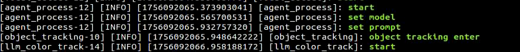

4. After the program is successfully loaded, the camera screen will appear.

5. When the output shown in the following figure appears on the command line and the voice device broadcasts **I'm here**, it indicates that the voice device has been awakened and activated. Recording of commands begins at this point.


6. When the output shown in the following figure appears on the command line, it indicates that the voice device prints out the recognized voice. Say the command "Track the red object".

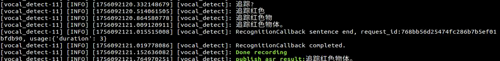

7. When the output shown in the following figure appears on the command line, it indicates successful invocation of the cloud-based large language model's speech recognition service to parse the command audio. The parsing result is in `publish_asr_result`.

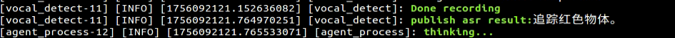

8. When the output shown in the following figure appears on the command line, it indicates successful invocation of the cloud-based large language model to process the command. It provides a language response via `response` and designs actions that fit the semantics of the command.

The response is automatically generated, and only the semantic accuracy of the reply is guaranteed. The text arrangement of the reply is random.

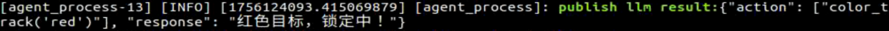

9. Then, the robot will recognize the red object in front of the camera and track it in real time.

10. When the output shown in the following figure appears on the command line, it indicates that a round of dialogue interaction has ended. Refer to step 4 to awaken the voice device again with the wake word and start a new round of dialogue interaction.


11. To stop this feature, simply press **Ctrl + C** in the terminal interface. If stopping fails, try multiple times until it ends. If it still cannot be exited, open a new command-line terminal to run the command to clear the currently started ROS nodes and related programs.

```Bash
~/.stop_ros.sh
```

### **11.2.5.4 Program Outcome**

Once the feature is activated, the robot accepts conversational voice commands. For example, saying "Track the red object" directs the robot to identify and track red objects using the camera feed. Similarly, saying "Track the blue object" or "Track the green object" instructs the robot to recognize and track the corresponding colors.

### **11.2.5.5 Program Analysis**

- **Launch File Analysis**

Program path: **ros2_ws/src/large_models_examples/large_models_examples/llm_color_track.launch.py**

1. Starting the launch file.

```Python
object_tracking_node_launch = IncludeLaunchDescription(
    PythonLaunchDescriptionSource(
        os.path.join(app_package_path, 'launch/object_tracking_node.launch.py')),
    launch_arguments={
        'debug': 'true',
    }.items(),
)

large_models_launch = IncludeLaunchDescription(
    PythonLaunchDescriptionSource(
        os.path.join(large_models_package_path, 'launch/start.launch.py')),
    launch_arguments={
        'mode': mode,
        'camera_topic': '/depth_cam/rgb/image_raw'    
    }.items(),
)
```

Object tracking and large model-related launch files.

2. Starting the node.

```Python
llm_color_track_node = Node(
    package='large_models_examples',
    executable='llm_color_track',
    output='screen',
    parameters=[{
        'interruption': interruption,
    }],
)
```

Starts the color tracking node and configures output to the screen.

- **Python File Analysis**

Program path: **ros2_ws/src/large_models_examples/large_models_examples/llm_color_track.py**

1. Defining the prompt word template PROMPT.

```Python
# Role Task
# You are an intelligent companion robot. You need to generate the corresponding json command based on the input content.

## Requirements
# 1. For any content input, the corresponding command must be found in the action function library, and the corresponding json command must be output.
# 2. Weave a refined 10 to 30 words, humorous, and endlessly varied feedback message for each action sequence to make the communication process interesting.
# 3. Output the json result directly, do not analyze, and do not output redundant content.
# 4. Format: {"action": ["xx", "xx"], "response": "xx"}

## Special Attention:
# - The action key carries a string array of function names arranged in the order of execution. When the corresponding action function cannot be found, the action outputs []. 
# - The response key is equipped with a carefully crafted short reply that perfectly matches the above word count and style requirements.  
 
## Action Function Library
# - Track objects of different colors: color_track('red') 

## Task Examples
# Input: Track the green object
# Output: {"action": ["color_track('green')"], "response": "Received"}
    '''
```

2. Class initialization.

```Python
def __init__(self, name):
    rclpy.init()
    super().__init__(name)

    self.action = []
    self.stop = True
    self.llm_result = ''
    # self.llm_result = '{"action": ["color_track(\'blue\')"], "response": "ok！"}'
    self.running = True
    self.action_finish = False
    self.play_audio_finish = False

    self.declare_parameter('interruption', False)
    self.interruption = self.get_parameter('interruption').value
    self.asr_mode = os.environ.get("ASR_MODE", "online").lower()

    timer_cb_group = ReentrantCallbackGroup()
    self.tts_text_pub = self.create_publisher(String, 'tts_node/tts_text', 1)
    self.create_subscription(String, 'agent_process/result', self.llm_result_callback, 1)
    self.create_subscription(Bool, 'vocal_detect/wakeup', self.wakeup_callback, 1, callback_group=timer_cb_group)
    self.create_subscription(Bool, 'tts_node/play_finish', self.play_audio_finish_callback, 1, callback_group=timer_cb_group)
    self.awake_client = self.create_client(SetBool, 'vocal_detect/enable_wakeup')
    self.awake_client.wait_for_service()
    self.set_mode_client = self.create_client(SetInt32, 'vocal_detect/set_mode')
    self.set_mode_client.wait_for_service()

    self.set_model_client = self.create_client(SetModel, 'agent_process/set_model')
    self.set_model_client.wait_for_service()
    self.set_prompt_client = self.create_client(SetString, 'agent_process/set_prompt')
    self.set_prompt_client.wait_for_service()
    self.enter_client = self.create_client(Trigger, 'object_tracking/enter')
    self.enter_client.wait_for_service()
    self.start_client = self.create_client(SetBool, 'object_tracking/set_running')
    self.start_client.wait_for_service()
    self.set_target_client = self.create_client(SetColor, 'object_tracking/set_color')
    self.set_target_client.wait_for_service()

    self.timer = self.create_timer(0.0, self.init_process, callback_group=timer_cb_group)
```

Initializes the node and initializes status parameters including the action list, control flags, and LLM processing results. It creates a TTS text publisher and subscribers for receiving LLM processing results, voice wake-up signals, and audio playback completion status. At the same time, it creates service client requests, including setting the LLM model, starting color tracking, and enabling the wake-up function. Finally, it creates a timer to start the initialization process.

3. `get_node_state` Method

```Python
def get_node_state(self, request, response):
    return response
```

Service callback used for node status queries.

4. `init_process` Method

```Python
def init_process(self):
    self.timer.cancel()

    msg = SetModel.Request()
    msg.model_type = 'llm'
    if self.asr_mode == "offline":
        msg.model = 'qwen3:0.6b'
        msg.base_url = ollama_host
    else:
        msg.model = llm_model
        msg.api_key = api_key 
        msg.base_url = base_url
    self.send_request(self.set_model_client, msg)

    msg = SetString.Request()
    msg.data = PROMPT
    self.send_request(self.set_prompt_client, msg)

    init_finish = self.create_client(Trigger, 'object_tracking/init_finish')
    init_finish.wait_for_service()
    self.send_request(self.enter_client, Trigger.Request())
    speech.play_audio(start_audio_path)
    threading.Thread(target=self.process, daemon=True).start()
    self.create_service(Empty, '~/init_finish', self.get_node_state)
    self.get_logger().info('\033[1;32m%s\033[0m' % 'start')
    self.get_logger().info('\033[1;32m%s\033[0m' % PROMPT)
```

By canceling the timer, it sequentially configures the LLM large language model parameters, sets the prompt word template, waits for the object tracking initialization to complete, and triggers entry into the tracking state. It plays the startup audio while starting the processing thread and creating the initialization completion status service. Finally, it outputs a green log message indicating the system is ready.

5. `send_request` Method

```Python
def send_request(self, client, msg):
    future = client.call_async(msg)
    while rclpy.ok():
        if future.done() and future.result():
            return future.result()
```

Service invocation tool, sending service requests and waiting for results to return to ensure service communication completion.

6. `wakeup_callback` Method

```Python
def wakeup_callback(self, msg):
    if msg.data and self.llm_result:
        self.get_logger().info('wakeup interrupt')
        self.send_request(self.enter_client, Trigger.Request())
        self.stop = True
    elif msg.data and not self.stop:
        self.get_logger().info('wakeup interrupt')
        self.send_request(self.enter_client, Trigger.Request())
        self.stop = True
```

When a voice wake-up signal is received, the current action is interrupted to ensure the robot can respond to new voice commands timely.

7. `llm_result_callback` Method

```Python
def llm_result_callback(self, msg):
    self.llm_result = msg.data
```

Receives commands generated by the large model and saves them to the `llm_result` variable for subsequent processing.

8. `play_audio_finish_callback` Method

```Python
def play_audio_finish_callback(self, msg):
    self.play_audio_finish = msg.data
```

Assigns the received message to `play_audio_finish` to determine the audio playback status.

9. `process` Method

```Python
def process(self):
    while self.running:
        if self.llm_result:
            msg = String()
            if 'action' in self.llm_result: # If there is a corresponding action returned, extract and process it
                result = eval(self.llm_result[self.llm_result.find('{'):self.llm_result.find('}')+1])
                if 'action' in result:
                    text = result['action']
                    # Use a regular expression to extract all strings in parentheses
                    pattern = r"color_track\('([^']+)'\)"
                    # Use re.search to find matching results
                    for i in text:
                        match = re.search(pattern, i)
                        # Extract the result
                        if match:
                            # Get all parameter parts (content within parentheses)
                            color = match.group(1)
                            self.get_logger().info(str(color))
                            color_msg = SetColor.Request()
                            color_msg.data = color
                            self.send_request(self.set_target_client, color_msg)
                            # Start sorting
                            start_msg = SetBool.Request()
                            start_msg.data = True 
                            self.send_request(self.start_client, start_msg)
                if 'response' in result:
                    msg.data = result['response']
            else: # No corresponding action, just answer
                msg.data = self.llm_result
            self.tts_text_pub.publish(msg)
            self.action_finish = True
            self.llm_result = ''
        else:
            time.sleep(0.01)
        if self.play_audio_finish and self.action_finish:
            self.play_audio_finish = False
            self.action_finish = False
            if self.interruption:
                msg = SetInt32.Request()
                msg.data = 2
                self.send_request(self.set_mode_client, msg)
            msg = SetBool.Request()
            msg.data = True
            self.send_request(self.awake_client, msg)
            self.stop = False
    rclpy.shutdown()
```

The system continuously monitors the large model's output. When an action command containing **color_track** is identified, a regular expression extracts the color parameter to set the target color and activate the tracking function. Simultaneously, the TTS module converts the text response into voice feedback. Upon task completion, the status flags reset, and the voice wake-up function is re-enabled to await the next command.
