# 2. Motion Control Course

## **Basic Control Course**

## 2.1 Gait Description

* **Gait Concept**

Robot gait refers to a periodic phenomenon describing animal locomotion. It also refers to the movement process of each leg of a robot following a specific sequence and trajectory, which is a critical factor in ensuring the stable operation of walking mechanisms. Research on gaits is primarily aimed at achieving stable periodic motion in robots.

In simple terms, it describes how animals walk. Common gait characteristics of hexapods include the tripod gait and the ripple gait.

**Tripod Gait**: Three alternating legs support the body. Specifically, when the left front leg touches the ground, the right rear leg and left rear leg touch the ground simultaneously, followed by the right front leg. This gait ensures stability during movement and reduces energy consumption.

**Ripple Gait**: The six legs of the animal touch the ground simultaneously according to a specific rhythm. Specifically, when the left front leg touches the ground, the other five legs will also touch the ground simultaneously. This gait improves movement speed and coordination.

The following table lists some common terms used in gait descriptions:

<table border="1">
<thead>
<tr>
<th style="background-color: ;">Term</th>
<th style="background-color: ;">Description</th>
</tr>
</thead>
<tbody>
<tr>
<td>Phase</td>
<td>The most direct understanding is the angle, representing the position within a periodic motion.</td>
</tr>
<tr>
<td>Phase difference</td>
<td>The difference in lead or lag of motion between different legs.</td>
</tr>
<tr>
<td>Swing phase</td>
<td>The leg is lifted and in an airborne state.</td>
</tr>
<tr>
<td>Stance phase</td>
<td>The leg is in contact with the ground.</td>
</tr>
<tr>
<td>Cycle</td>
<td>During locomotion, the entire process from one heel strike to the next heel strike on the same side is one cycle.</td>
</tr>
<tr>
<td>Gait frequency</td>
<td>The number of gait cycles completed per unit of time.</td>
</tr>
<tr>
<td>Step length</td>
<td>The distance moved by the foot end from lifting to landing within one cycle.</td>
</tr>
<tr>
<td>Stride length</td>
<td>The distance the body moves within one cycle.</td>
</tr>
<tr>
<td>Duty cycle</td>
<td>The ratio of the time a single leg is in the stance phase to the entire gait cycle.</td>
</tr>
</tbody>
</table>

## 2.2 Tripod Gait

### 2.2.1 Tripod Gait Description

**Tripod Gait** is a typical gait for hexapod walking robots to achieve locomotion. When insects of the class Hexapoda walk, the six legs generally do not move forward in a straight line simultaneously. Instead, the three pairs of legs are divided into two groups, alternating forward in a triangular support structure. Simply put, it is an alternating up-and-down movement in groups of three.

Under this triangular support structure, the body remains in a statically stable state.

In the tripod gait, each leg swings in a specific sequence. Generally speaking, in one step, three legs swing forward while the other three legs swing backward. This gait helps maintain balance and allows walking on uneven terrain.

The advantages of the hexapod robot tripod gait include:

1. **High stability**: Since the six legs can touch the ground simultaneously, the robot is less likely to tip over or lose balance. This allows the hexapod robot to perform better on unstable terrain.
2. **Strong adaptability**: The tripod gait allows the robot to better adapt to terrain and environments. Because the motion trajectory resembles a triangle, it can more easily cross obstacles or climb slopes.
3. **Good flexibility**: The tripod gait enables easy changes in direction and speed. This allows for better performance when rapid responses are required, such as avoiding obstacles or tracking targets in narrow spaces.

The following uses the diagrams below to analyze and explain the tripod gait:

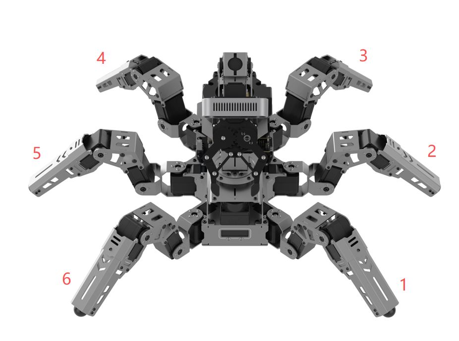

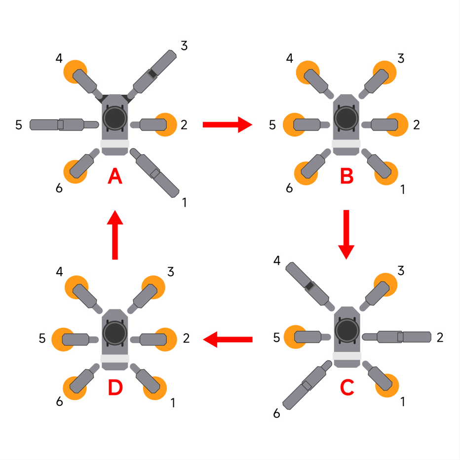

As shown in Figure A, legs 1, 3, and 5 of the hexapod robot are lifted and swing forward, while legs 2, 4, and 6 are used to support the body, ensuring the center of gravity is located at the intersection of the diagonals. At this time, legs 1, 3, and 5 are in the swing phase, and legs 2, 4, and 6 are in the stance phase.

As shown in Figure B, all six legs touch the ground simultaneously. The positions of legs 2, 4, and 6 remain unchanged, legs 1, 3, and 5 move forward, and all legs are in the stance phase.

As shown in Figure C, legs 2, 4, and 6 are lifted and swing forward, while legs 1, 3, and 5 are used to support the body, ensuring the center of gravity is located at the intersection of the diagonals. At this time, legs 2, 4, and 6 are in the swing phase, and legs 1, 3, and 5 are in the stance phase.

As shown in Figure D, all six legs touch the ground simultaneously. The positions of legs 1, 3, and 5 remain unchanged, legs 2, 4, and 6 move forward, and all legs are in the stance phase.

When these four sets of actions in Figure A, B, C, and D are completed, the hexapod robot completes one full cycle of motion.

### 2.1.2 Operation Steps

> [!NOTE]
> **Commands are strictly case-sensitive, and the Tab key can be used to auto-complete keywords.**

1. Power on the robot and connect it to the remote control software NoMachine.
2. Click the icon  on the system desktop to open the command line terminal.
3. Enter the command and press **Enter** to close the auto-start program.

```bash
~/.stop_ros.sh
```

4. Enter the command and press **Enter** to navigate to the directory where the source code file is located.

```bash
cd ros2_ws/src/example/example/body_control/include
```

5. Enter the command and press **Enter** to open the source code file.

```bash
vim tripod_gait.py 
```

6. Locate the code shown in the following block.

```python
def main(args=None):
    rclpy.init(args=args)
    node = TripodGait()

    node.move(gait=2)   # Go straight
    node.get_logger().info('\033[1;32m%s\033[0m' % 'forward')
    time.sleep(5)  # Wait for 5 seconds
    node.move(gait=0)     # Stop
    node.get_logger().info('\033[1;32m%s\033[0m' % 'stop')

    node.controller.destroy_node()  # Clean up the node
    rclpy.shutdown()  # Shutdown ROS 2
```

**gait** represents the gait mode. A value of **0** indicates stationary, a value of **1** indicates the ripple gait, and a value of **2** indicates the tripod gait. Ensure that **gait=2** is set to execute the tripod gait operation.

7. After the modification is complete, press the **Esc** key, enter `:wq` and press **Enter** to save and exit.

```bash
:wq
```

8. Enter the command and press **Enter** to run the program.

```bash
ros2 launch example tripod_gait.launch.py
```

9. To close the operation, use the shortcut key **Ctrl + C**.

### 2.1.3 Program Outcome

After the operation is initiated, the hexapod robot will advance for 5 seconds under the tripod gait, with the three pairs of legs divided into two groups alternating forward, and then come to a stop.

### 2.1.4 Program Analysis

The program source code is located at: **/home/ubuntu/ros2_ws/src/example/example/body_control/include/tripod_gait.py**

```python
class TripodGait(Node):
    def __init__(self):
        super().__init__('tripod_gait')
        self.controller = ControllerClient()
        self.client = self.create_client(Trigger, '/controller_manager/init_finish')
        self.client.wait_for_service()

    def move(
        self,
        gait=1,              # Gait type, 0 for stop, 1 for ripple gait, 2 for tripod gait
        stride=40.0,         # Stride length (mm), default 40mm, range 0~65
        height=15.0,         # Step height (mm), default 15mm, range 0~50
        direction=0,         # Movement direction (degrees), range 0°~360°, 0° is forward, increases counterclockwise
        rotation=0.0,        # Rotation angle, default no rotation, positive value for counterclockwise rotation, negative value for clockwise rotation
        time=1,              # Single step duration (seconds), default 1 second
        steps=0,             # Number of steps, 0 indicates continuous movement
        interrupt=True,      # Whether to allow interruption, default allowed
        relative_height=False # Whether the height is a relative value, default absolute height
    ):
        """Method to control robot movement

        Args:
            gait (int): Gait type (e.g., 1=ripple gait)
            stride (float): Stride size (millimeters)
            height (float): Leg lifting height (millimeters)
            direction (float): Movement direction (0=forward, 180=backward)
            rotation (float): Rotation angle (positive right, negative left)
            time (float): Single step execution time (seconds)
            steps (int): Number of moving steps (0=continuous)
            interrupt (bool): Whether to allow interruption by new commands
            relative_height (bool): Whether the height is a relative value
        """
        self.controller.traveling(
            gait=gait,
            stride=stride,
            height=height,
            direction=direction,
            rotation=rotation,
            time=time,
            steps=steps,
            interrupt=interrupt,
            relative_height=relative_height
        )
```

The program controls movement primarily by setting the parameters within the `move` function. The specific parameters are as follows:

The first parameter `gait` is the gait mode. A value of "0" represents stationary, a value of "1" represents the ripple gait, and a value of "2" represents the tripod gait.

The second parameter `stride` is the stride length in millimeters, with a default range of 0 to 65. Adjusting the value beyond this range may cause the robot to get stuck or trip.

The third parameter `height` is the step height in millimeters, with a default range of 0 to 50. Adjusting the value beyond this range may cause the robot to get stuck or trip.

The fourth parameter `direction` is the forward direction in degrees, with a value range of 0-360. When the value is 0-180, the hexapod robot moves forward. When the value is 180-360, the hexapod robot moves backward.

The fifth parameter `rotation` is the turning rate in radians per second. When the value is positive, the hexapod robot rotates counterclockwise. When the value is negative, the hexapod robot rotates clockwise.

The sixth parameter `time` is the interval duration for each step moved, in seconds.

The seventh parameter `steps` is the number of movement steps, and a value of "0" indicates continuous movement.

The eighth parameter `interrupt` is used to set whether execution can be interrupted.

The ninth parameter `relative_height` is used to set whether the step height **height** is relative to the ground. A value of **False** adopts relative height.

## 2.3 Ripple Gait

### 2.3.1 Ripple Gait Description

Ripple Gait is also known as overlapping wave gait or wave-shaped gait. In the following text, it is uniformly referred to as the ripple gait.

The hexapod robot ripple gait refers to a specific swinging pattern of the six legs during walking, forming a trajectory similar to a ripple. This gait design allows the robot to walk stably on various terrains and environments while improving walking efficiency and flexibility.

In the ripple gait, each leg of the robot swings according to a specific rhythm and sequence. In one step, each front leg steps forward while each rear leg pushes backward, forming a dynamic resembling a wave. This gait helps the robot maintain balance and walk on undulating terrain.

The advantages of the hexapod robot ripple gait include:

1. **High stability**: Since the six legs can touch the ground simultaneously, the robot is less likely to tip over or lose balance. This allows the hexapod robot to perform better on unstable terrain.
2. **High efficiency**: The ripple gait allows the robot to better adapt to terrain and environments, reducing energy consumption. In addition, because the motion trajectory resembles a wave, it can more easily cross obstacles or climb slopes.
3. **Good flexibility**: The ripple gait enables easy changes in direction and speed. This allows for better performance when rapid responses are required, such as avoiding obstacles or tracking targets in narrow spaces.


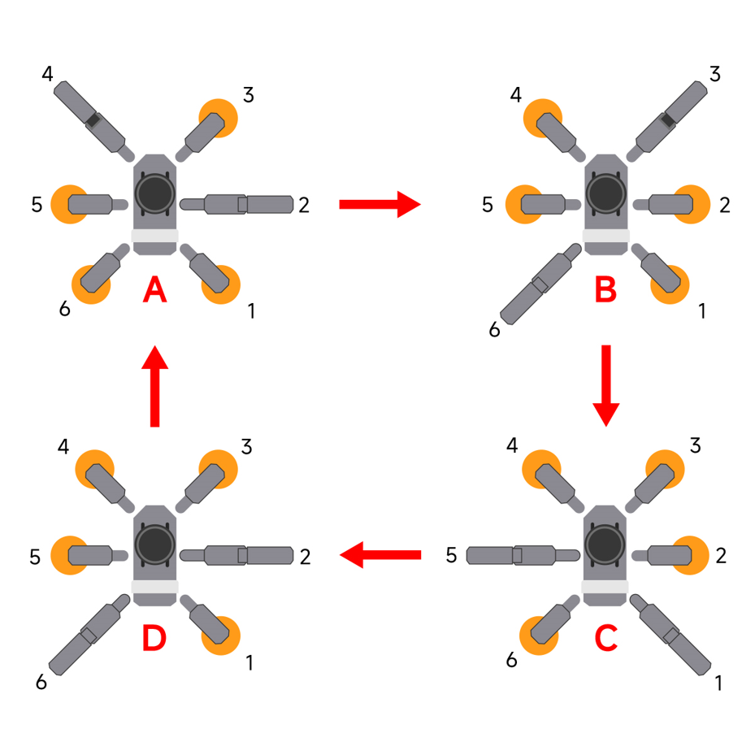

When the hexapod robot is in the ripple gait, each pair of opposing legs operates alternately. The following uses the diagrams above to analyze and explain the ripple gait:

As shown in Figure A, legs 2 and 4 of the hexapod robot are lifted and swing forward, while legs 1, 3, 5, and 6 are used to support the body, ensuring the center of gravity is located at the intersection of the diagonals. At this time, legs 2 and 4 are in the swing phase, and legs 1, 3, 5, and 6 are in the stance phase.

As shown in Figure B, legs 3 and 6 of the hexapod robot are lifted and swing forward, while legs 1, 2, 4, and 5 are used to support the body, ensuring the center of gravity is located at the intersection of the diagonals. At this time, legs 3 and 6 are in the swing phase, and legs 1, 2, 4, and 5 are in the stance phase.

As shown in Figure C, legs 1 and 5 of the hexapod robot are lifted and swing forward, while legs 2, 3, 4, and 6 are used to support the body, ensuring the center of gravity is located at the intersection of the diagonals. At this time, legs 1 and 5 are in the swing phase, and legs 2, 3, 4, and 6 are in the stance phase.

As shown in Figure D, legs 2 and 6 of the hexapod robot are lifted and swing forward, while legs 1, 3, 4, and 5 are used to support the body, ensuring the center of gravity is located at the intersection of the diagonals. At this time, legs 2 and 6 are in the swing phase, and legs 1, 3, 4, and 5 are in the stance phase.

### 2.3.2 Operation Steps

1. Power on the robot and connect it to the remote control software NoMachine.
2. Click the icon  on the system desktop to open the command line terminal.
3. Enter the command and press **Enter** to close the auto-start program.

```bash
~/.stop_ros.sh
```

4. Enter the command and press **Enter** to navigate to the directory where the source code file is located.

```bash
cd ros2_ws/src/example/example/body_control/include
```

5. Enter the command and press **Enter** to open the source code file.

```bash
vim tripod_gait.py 
```

6. Locate the code shown in the following block.

```python
def main(args=None):
    rclpy.init(args=args)
    node = TripodGait()

    node.move(gait=1)   # Go straight
    node.get_logger().info('\033[1;32m%s\033[0m' % 'forward')
    time.sleep(5)  # Wait for 5 seconds
    node.move(gait=0)     # Stop
    node.get_logger().info('\033[1;32m%s\033[0m' % 'stop')

    node.controller.destroy_node()  # Clean up the node
    rclpy.shutdown()  # Shutdown ROS 2
```

`gait` represents the gait mode. A value of **0** indicates stationary, a value of **1** indicates the ripple gait, and a value of **2** indicates the tripod gait. Ensure that `gait=1` is set to execute the ripple gait operation.

7. After the modification is complete, press the **Esc** key, enter `:wq`, and press **Enter** to save and exit.

```bash
:wq
```

8. Enter the command and press **Enter** to run the program.

```bash
ros2 launch example tripod_gait.launch.py
```

9. To close the operation, use the shortcut key **Ctrl + C**.

### 2.3.3 Program Outcome

After the operation is initiated, the hexapod robot will advance for 5 seconds under the ripple gait and then come to a stop.

### 2.3.4 Program Analysis

The program source code is located at: **/home/ubuntu/ros2_ws/src/example/example/body_control/include/tripod_gait.py**

```python
class TripodGait(Node):
    def __init__(self):
        super().__init__('tripod_gait')
        self.controller = ControllerClient()
        self.client = self.create_client(Trigger, '/controller_manager/init_finish')
        self.client.wait_for_service()

    def move(
        self,
        gait=1,              # Gait type, 0 for stop, 1 for ripple gait, 2 for tripod gait
        stride=40.0,         # Stride length (mm), default 40mm, range 0~65
        height=15.0,         # Step height (mm), default 15mm, range 0~50
        direction=0,         # Movement direction (degrees), range 0°~360°, 0° is forward, increases counterclockwise
        rotation=0.0,        # Rotation angle, default no rotation, positive value for counterclockwise rotation, negative value for clockwise rotation
        time=1,              # Single step duration (seconds), default 1 second
        steps=0,             # Number of steps, 0 indicates continuous movement
        interrupt=True,      # Whether to allow interruption, default allowed
        relative_height=False # Whether the height is a relative value, default absolute height
    ):
        """Method to control robot movement

        Args:
            gait (int): Gait type (e.g., 1=ripple gait)
            stride (float): Stride size (millimeters)
            height (float): Leg lifting height (millimeters)
            direction (float): Movement direction (0=forward, 180=backward)
            rotation (float): Rotation angle (positive right, negative left)
            time (float): Single step execution time (seconds)
            steps (int): Number of moving steps (0=continuous)
            interrupt (bool): Whether to allow interruption by new commands
            relative_height (bool): Whether the height is a relative value
        """
        self.controller.traveling(
            gait=gait,
            stride=stride,
            height=height,
            direction=direction,
            rotation=rotation,
            time=time,
            steps=steps,
            interrupt=interrupt,
            relative_height=relative_height
        )

```

The program controls movement primarily by setting the parameters within the `move` function. The specific parameters are as follows:

The first parameter `gait` is the gait mode. A value of "0" represents stationary, a value of "1" represents the ripple gait, and a value of "2" represents the tripod gait.

The second parameter `stride` is the stride length in millimeters, with a default range of 0 to 65. Adjusting the value beyond this range may cause the robot to get stuck or trip.

The third parameter `height` is the step height in millimeters, with a default range of 0 to 50. Adjusting the value beyond this range may cause the robot to get stuck or trip.

The fourth parameter `direction` is the forward direction in degrees, with a value range of 0-360. When the value is 0-180, the hexapod robot moves forward. When the value is 180-360, the hexapod robot moves backward.

The fifth parameter `rotation` is the turning rate in radians per second. When the value is positive, the hexapod robot rotates counterclockwise. When the value is negative, the hexapod robot rotates clockwise.

The sixth parameter `time` is the interval duration for each step moved, in seconds.

The seventh parameter `steps` is the number of movement steps, and a value of "0" indicates continuous movement.

The eighth parameter `interrupt` is used to set whether execution can be interrupted.

The ninth parameter `relative_height` is used to set whether the step height **height** is relative to the ground. A value of "False" adopts relative height.

## 2.4 Forward and Turning

### 2.4.1 Program Introduction

This section is based on the ripple gait. By modifying the corresponding parameters, the hexapod robot is configured to move forward and turn under the ripple gait.

### 2.4.2 Operation Steps

> [!NOTE]
> **Commands are strictly case-sensitive, and the Tab key can be used to auto-complete keywords.**

1. Power on the robot and connect it to the remote control software NoMachine.
2. Click the icon  on the system desktop to open the command line terminal.
3. Enter the command and press **Enter** to close the auto-start program.

```bash
~/.stop_ros.sh
```

4. Enter the command to initiate the operation and press **Enter**.

```bash
ros2 launch example forward_and_rorate.launch.py
```

5. To close this operation, press **Ctrl + C** in the terminal interface. If closing fails, try repeatedly.

### 2.4.3 Program Outcome

The hexapod robot will advance for 5 seconds under the ripple gait, then execute a counterclockwise turn at a speed of 0.5 radians per second for 5 seconds, and finally stop.

### 2.4.4 Program Analysis

* **Launch File Analysis**

The launch file is located at: **/home/ubuntu/ros2_ws/src/example/example/body_control/forward_and_rorate.launch.py**

1. Import the necessary libraries.

```python
import os
from ament_index_python.packages import get_package_share_directory

from launch_ros.actions import Node
from launch import LaunchDescription, LaunchService
from launch.actions import  OpaqueFunction, IncludeLaunchDescription
from launch.launch_description_sources import PythonLaunchDescriptionSource
```

2. Define the content to be launched, obtain the path of the `controller` package, and start the `controller.launch.py` file. Create the ROS2 node `forward_and_rorate_node`, define the executable file, and finally return the launch item list.

```python
def launch_setup(context):
    compiled = os.environ['need_compile']
    if compiled == 'True':
        controller_package_path = get_package_share_directory('controller')
    else:
        controller_package_path = '/home/ubuntu/ros2_ws/src/driver/controller'
    
    controller_launch = IncludeLaunchDescription(
        PythonLaunchDescriptionSource(
            os.path.join(controller_package_path, 'launch/controller.launch.py')),
    )
    forward_and_rorate_node = Node(
        package='example',
        executable='forward_and_rorate',
        output='screen',
    )

    return [
            controller_launch,
            forward_and_rorate_node,
            ]
```

3. The entry function of the `ROS 2 Launch` file defines the content to be launched.

```python
def generate_launch_description():
    return LaunchDescription([
        OpaqueFunction(function = launch_setup)
    ])
```

4. Create a `LaunchService` and pass the launch content to it for execution.

```python
if __name__ == '__main__':
    # Create a LaunchDescription object
    ld = generate_launch_description()

    ls = LaunchService()
    ls.include_launch_description(ld)
    ls.run()
```

* **Python Source Code Analysis**

The program source code is located at: **/home/ubuntu/ros2_ws/src/example/example/body_control/include/forward_and_rorate.py**

```python
def main(args=None):
    rclpy.init(args=args)
    node = ForwardAndRorate()

    node.move(gait=1)   # Go straight
    node.get_logger().info('\033[1;32m%s\033[0m' % 'forward')
    time.sleep(5)  # Wait for 5 seconds
    node.move(gait=1, rotation=0.5)  # Turn
    node.get_logger().info('\033[1;32m%s\033[0m' % 'rorate')
    time.sleep(5)  # Wait for 5 seconds
    node.move(gait=0) # Stop 
    node.get_logger().info('\033[1;32m%s\033[0m' % 'stop')

    node.controller.destroy_node()  # Clean up the node
    rclpy.shutdown()  # Shutdown ROS 2

```

1. Movement parameter adjustment

By setting the corresponding parameters, attributes such as the forward or turning speed and direction of the ROSpider hexapod robot can be adjusted.

```python
def move(
        self,
        gait=1,              # Gait type, 0 for stop, 1 for tripod gait, 2 for ripple gait
        stride=40.0,         # Stride length (mm), default 40mm, range 0~65
        height=15.0,         # Step height (mm), default 15mm, range 0~50
        direction=180,       # Movement direction (degrees), range 0°~360°, 0° is forward, increases counterclockwise
        rotation=0.0,        # Rotation angle, default no rotation, positive value for counterclockwise rotation, negative value for clockwise rotation
        time=1,              # Single step duration (seconds), default 1 second
        steps=0,             # Number of steps, 0 indicates continuous movement
        interrupt=True,      # Whether to allow interruption, default allowed
        relative_height=False # Whether the height is a relative value, default absolute height
    )
```

The program controls movement primarily by setting the parameters within the `move` function. The specific parameters are as follows:

The first parameter `gait` is the gait mode. A value of "0" represents stationary, a value of "1" represents the ripple gait, and a value of "2" represents the tripod gait.

The second parameter `stride` is the stride length in millimeters, with a default range of 0 to 65. Adjusting the value beyond this range may cause the robot to get stuck or trip.

The third parameter `height` is the step height in millimeters, with a default range of 0 to 50. Adjusting the value beyond this range may cause the robot to get stuck or trip.

The fourth parameter `direction` is the forward direction in degrees, with a value range of 0-360. When the value is 0-180, the hexapod robot moves forward. When the value is 180-360, the hexapod robot moves backward.

The fifth parameter `rotation` is the turning rate in radians per second. When the value is positive, the hexapod robot rotates counterclockwise. When the value is negative, the hexapod robot rotates clockwise.

The sixth parameter `time` is the interval duration for each step moved, in seconds.

The seventh parameter `steps` is the number of movement steps, and a value of "0" indicates continuous movement.

The eighth parameter `interrupt` is used to set whether execution can be interrupted.

The ninth parameter `relative_height` is used to set whether the step height **height** is relative to the ground. A value of **False** adopts relative height.

2. Basic configuration

By setting the corresponding parameters, the duration of the hexapod robot's forward movement and turning can be adjusted.

```python
 node.move(gait=1)   # Go straight
    node.get_logger().info('\033[1;32m%s\033[0m' % 'forward')
    time.sleep(5)  # Wait for 5 seconds
    node.move(gait=1, rotation=0.5)  # Turn
    node.get_logger().info('\033[1;32m%s\033[0m' % 'rorate')
    time.sleep(5)  # Wait for 5 seconds
    node.move(gait=0) # Stop 
    node.get_logger().info('\033[1;32m%s\033[0m' % 'stop')
```

The sequence of motion states is first to move forward via **forward**, then turn via **rotate**, and finally stop via **stop**. The `sleep` function between each state sets the duration of the current state, and the unit of the parameter within the function is seconds.

## 2.5 Left and Right Translation

### 2.5.1 Program Introduction

This section is based on the ripple gait. It demonstrates how to modify the corresponding parameters to control the hexapod robot to translate left and right under the ripple gait.

### 2.5.2 Operation Steps

> [!NOTE]
> **Commands are strictly case-sensitive, and the Tab key can be used to auto-complete keywords.**

1. Power on the robot and connect it to the remote control software NoMachine.
2. Click the icon  on the system desktop to open the command line terminal.
3. Enter the command and press **Enter** to close the auto-start program.

```bash
~/.stop_ros.sh
```

4. Enter the command to initiate the operation and press **Enter**.

```bash
ros2 launch example left_and_right.launch.py
```

5. To close this operation, press **Ctrl + C** in the terminal interface. If closing fails, try repeatedly.

### 2.5.3 Program Outcome

The hexapod robot will first translate left for 5 seconds under the ripple gait, then translate right for 5 seconds, and finally stop moving.

### 2.5.4 Program Analysis

* **Launch File Analysis**

The program source code is located at: **/home/ubuntu/ros2_ws/src/example/example/body_control/left_and_right.launch.py**

1. Import the necessary libraries.

```python
import os
from ament_index_python.packages import get_package_share_directory

from launch_ros.actions import Node
from launch import LaunchDescription, LaunchService
from launch.actions import  OpaqueFunction, IncludeLaunchDescription
from launch.launch_description_sources import PythonLaunchDescriptionSource
```

2. Define the content to be launched, obtain the path of the `controller` package, and start the `controller.launch.py` file. Create the ROS2 node `left_and_right`, define the executable file, and finally return the launch item list.

```python
def launch_setup(context):
    compiled = os.environ['need_compile']
    if compiled == 'True':
        controller_package_path = get_package_share_directory('controller')
    else:
        controller_package_path = '/home/ubuntu/ros2_ws/src/driver/controller'
    
    controller_launch = IncludeLaunchDescription(
        PythonLaunchDescriptionSource(
            os.path.join(controller_package_path, 'launch/controller.launch.py')),
    )
   
    left_and_right_node = Node(
        package='example',
        executable='left_and_right',
        output='screen',
    )

    return [
            controller_launch,
            left_and_right_node,
            ]
```

3. The entry function of the `ROS 2 Launch` file defines the content to be launched.

```python
def generate_launch_description():
    return LaunchDescription([
        OpaqueFunction(function = launch_setup)
    ])
```

4. Create a `LaunchService` and pass the launch content to it for execution.

```python
if __name__ == '__main__':
    # Create a LaunchDescription object
    ld = generate_launch_description()

    ls = LaunchService()
    ls.include_launch_description(ld)
    ls.run()
```

* **Python Source Code Analysis**

The program source code is located at: **/home/ubuntu/ros2_ws/src/example/example/body_control/include/left_and_right.py**

```python
def main(args=None):
    rclpy.init(args=args)
    node = LeftAndRight()

    node.move(gait=1, direction=math.radians(90))   # Translate left
    node.get_logger().info('\033[1;32m%s\033[0m' % 'move left')
    time.sleep(5)  # Wait for 5 seconds
    node.move(gait=1, direction=math.radians(270))  # Translate right
    node.get_logger().info('\033[1;32m%s\033[0m' % 'move right')
    time.sleep(5)  # Wait for 5 seconds
    node.move(gait=0) # Stop 
    node.get_logger().info('\033[1;32m%s\033[0m' % 'stop')


    node.controller.destroy_node()  # Clean up the node
    rclpy.shutdown()  # Shutdown ROS 2
```

1. Movement parameter adjustment

By setting the corresponding parameters, attributes such as the forward or turning speed and direction of the hexapod robot can be adjusted.

```python
def move(
        self,
        gait=1,              # Gait type, 0 for stop, 1 for tripod gait, 2 for ripple gait
        stride=40.0,         # Stride length (mm), default 40mm, range 0~65
        height=15.0,         # Step height (mm), default 15mm, range 0~50
        direction=180,       # Movement direction (degrees), range 0°~360°, 0° is forward, increases counterclockwise
        rotation=0.0,        # Rotation angle, default no rotation, positive value for counterclockwise rotation, negative value for clockwise rotation
        time=1,              # Single step duration (seconds), default 1 second
        steps=0,             # Number of steps, 0 indicates continuous movement
        interrupt=True,      # Whether to allow interruption, default allowed
        relative_height=False # Whether the height is a relative value, default absolute height
    )
```

The program controls movement primarily by setting the parameters within the `move` function. The specific parameters are as follows:

The first parameter `gait` is the gait mode. A value of "0" represents stationary, a value of "1" represents the ripple gait, and a value of "2" represents the tripod gait.

The second parameter `stride` is the stride length in millimeters, with a default range of 0 to 65. Adjusting the value beyond this range may cause the robot to get stuck or trip.

The third parameter `height` is the step height in millimeters, with a default range of 0 to 50. Adjusting the value beyond this range may cause the robot to get stuck or trip.

The fourth parameter `direction` is the forward direction in degrees, with a value range of 0-360. When the value is 0-180, the hexapod robot moves forward. When the value is 180-360, the hexapod robot moves backward.

The fifth parameter `rotation` is the turning rate in radians per second. When the value is positive, the hexapod robot rotates counterclockwise. When the value is negative, the hexapod robot rotates clockwise.

The sixth parameter `time` is the interval duration for each step moved, in seconds.

The seventh parameter `steps` is the number of movement steps, and a value of "0" indicates continuous movement.

The eighth parameter `interrupt` is used to set whether execution can be interrupted.

The ninth parameter `relative_height` is used to set whether the step height **height** is relative to the ground. A value of **False** adopts relative height.

2. Basic configuration

By setting the corresponding parameters, the translation direction and duration of the hexapod robot can be adjusted.

```python
    node.move(gait=1, direction=math.radians(90))   # Translate left
    node.get_logger().info('\033[1;32m%s\033[0m' % 'move left')
    time.sleep(5)  # Wait for 5 seconds
    node.move(gait=1, direction=math.radians(270))  # Translate right
    node.get_logger().info('\033[1;32m%s\033[0m' % 'move right')
    time.sleep(5)  # Wait for 5 seconds
    node.move(gait=0) # Stop 
    node.get_logger().info('\033[1;32m%s\033[0m' % 'stop')
```

The `math.radians()` function converts the angle into radians and passes it to the `move` function, which in turn controls the moving direction of the robot. The `sleep` function between each state sets the duration of the current state, and the unit of the parameter within the function is seconds.

## 2.6 Diagonal Translation

### 2.6.1 Program Introduction

This section is based on the ripple gait. It demonstrates how to modify the corresponding parameters to control the hexapod robot to translate diagonally under the ripple gait.

### 2.6.2 Operation Steps

> [!NOTE]
> **Commands are strictly case-sensitive, and the Tab key can be used to auto-complete keywords.**

1. Power on the robot and connect it to the remote control software NoMachine.
2. Click the icon  on the system desktop to open the command line terminal.
3. Enter the command and press **Enter** to close the auto-start program.

```bash
~/.stop_ros.sh
```

4. Enter the command to initiate the operation and press **Enter**.

```bash
ros2 launch example diagonally.launch.py
```

5. To close this operation, press **Ctrl + C** in the terminal interface. If closing fails, try repeatedly.

### 2.6.3 Program Outcome

The hexapod robot will translate towards the upper left for 5 seconds under the ripple gait and then stop moving.

### 2.6.4 Program Analysis

* **Launch File Analysis**

The program source code is located at: **/home/ubuntu/ros2_ws/src/example/example/body_control/diagonally.launch.py**

1. Import the necessary libraries.

```python
import os
from ament_index_python.packages import get_package_share_directory

from launch_ros.actions import Node
from launch import LaunchDescription, LaunchService
from launch.actions import  OpaqueFunction, IncludeLaunchDescription
from launch.launch_description_sources import PythonLaunchDescriptionSource
```

2. Define the content to be launched, obtain the path of the `controller` package, and start the `controller.launch.py` file. Create the ROS2 node `diagonally_node`, define the executable file, and finally return the launch item list.

```python
def launch_setup(context):
    compiled = os.environ['need_compile']
    direction = LaunchConfiguration('direction', default='45')
    direction_arg = DeclareLaunchArgument('direction', default_value=direction)
    if compiled == 'True':
        controller_package_path = get_package_share_directory('controller')
    else:
        controller_package_path = '/home/ubuntu/ros2_ws/src/driver/controller'
        

    controller_launch = IncludeLaunchDescription(
        PythonLaunchDescriptionSource(
            os.path.join(controller_package_path, 'launch/controller.launch.py')),
    )

    diagonally_node = Node(
        package='example',
        executable='diagonally',
        output='screen',
        parameters=[{'direction': direction}]
    )

    return [
            direction_arg,
            controller_launch,
            diagonally_node,
            ]
```

3. The entry function of the `ROS 2 Launch` file defines the content to be launched.

```python
def generate_launch_description():
    return LaunchDescription([
        OpaqueFunction(function = launch_setup)
    ])
```

4. Create a `LaunchService` and pass the launch content to it for execution.

```python
if __name__ == '__main__':
    # Create a LaunchDescription object
    ld = generate_launch_description()

    ls = LaunchService()
    ls.include_launch_description(ld)
    ls.run()
```

* **Python Source Code Analysis**

The program source code is located at: **/home/ubuntu/ros2_ws/src/example/example/body_control/include/diagonally.py**

```python
def main(args=None):
    rclpy.init(args=args)
    node = Diagonally()

    node.move(gait=1, direction=math.radians(node.direction))   
    node.get_logger().info('\033[1;32m%s\033[0m' % f'Movement angle {node.direction} degrees')
    time.sleep(5)  # Wait for 5 seconds
    node.move(gait=0) # Stop 
    node.get_logger().info('\033[1;32m%s\033[0m' % 'stop')

    node.controller.destroy_node()  # Clean up the node
    rclpy.shutdown()  # Shutdown ROS 2
```

1. Movement parameter adjustment

By setting the corresponding parameters, attributes such as the forward or turning speed and direction of the hexapod robot can be adjusted.

```python
def move(
        self,
        gait=1,              # Gait type, 0 for stop, 1 for tripod gait, 2 for ripple gait
        stride=40.0,         # Stride length (mm), default 40mm, range 0~65
        height=15.0,         # Step height (mm), default 15mm, range 0~50
        direction=180,       # Movement direction (degrees), range 0°~360°, 0° is forward, increases counterclockwise
        rotation=0.0,        # Rotation angle, default no rotation, positive value for counterclockwise rotation, negative value for clockwise rotation
        time=1,              # Single step duration (seconds), default 1 second
        steps=0,             # Number of steps, 0 indicates continuous movement
        interrupt=True,      # Whether to allow interruption, default allowed
        relative_height=False # Whether the height is a relative value, default absolute height
    )
```

The program controls movement primarily by setting the parameters within the `move` function. The specific parameters are as follows:

The first parameter `gait` is the gait mode. A value of "0" represents stationary, a value of "1" represents the ripple gait, and a value of "2" represents the tripod gait.

The second parameter `stride` is the stride length in millimeters, with a default range of 0 to 65. Adjusting the value beyond this range may cause the robot to get stuck or trip.

The third parameter `height` is the step height in millimeters, with a default range of 0 to 50. Adjusting the value beyond this range may cause the robot to get stuck or trip.

The fourth parameter `direction` is the forward direction in degrees, with a value range of 0-360. When the value is 0-180, the hexapod robot moves forward. When the value is 180-360, the hexapod robot moves backward.

The fifth parameter `rotation` is the turning rate in radians per second. When the value is positive, the hexapod robot rotates counterclockwise. When the value is negative, the hexapod robot rotates clockwise.

The sixth parameter `time` is the interval duration for each step moved, in seconds.

The seventh parameter `steps` is the number of movement steps, and a value of "0" indicates continuous movement.

The eighth parameter `interrupt` is used to set whether execution can be interrupted.

The ninth parameter `relative_height` is used to set whether the step height **height** is relative to the ground. A value of **False** adopts relative height.

2. Basic configuration

By setting the corresponding parameters, the movement direction and duration of the hexapod robot can be adjusted.

```python
    node.move(gait=1, direction=math.radians(node.direction))   
    node.get_logger().info('\033[1;32m%s\033[0m' % f'Movement angle {node.direction} degrees')
    time.sleep(5)  # Wait for 5 seconds
    node.move(gait=0) # Stop 
    node.get_logger().info('\033[1;32m%s\033[0m' % 'stop')
```

The `math.radians()` function converts the angle into radians and passes it to the `move` function. The `node.direction` defaults to 45°, which in turn controls the moving direction of the robot. The `sleep` function between each state sets the duration of the current state, and the unit of the parameter within the function is seconds.

## 2.7 Walking Speed Adjustment

### 2.7.1 Program Introduction

This section is based on the ripple gait. It demonstrates how to modify the corresponding parameters to adjust the walking speed of the hexapod robot under the ripple gait.

### 2.7.2 Operation Steps

> [!NOTE]
> **Commands are strictly case-sensitive, and the Tab key can be used to auto-complete keywords.**

1. Start the ROSpider and connect it to the remote control software NoMachine.
2. Click the icon  on the system desktop to open the command line terminal.
3. Enter the command and press **Enter** to close the auto-start program.

```bash
~/.stop_ros.sh
```

4. Enter the command to initiate the operation and press **Enter**.

```bash
ros2 launch example speed_control.launch.py
```

5. To close this operation, press **Ctrl + C** in the terminal interface. If closing fails, try repeatedly.

### 2.7.3 Program Outcome

The ROSpider will advance under the ripple gait, defaulting to a stride length of 40 millimeters and an interval duration of 1 second.

### 2.7.4 Program Analysis

* **Launch File Analysis**

The program source code is located at: **/home/ubuntu/ros2_ws/src/example/example/body_control/speed_control.launch.py**

1. Import the necessary libraries.

```python
import os
from ament_index_python.packages import get_package_share_directory

from launch_ros.actions import Node
from launch import LaunchDescription, LaunchService
from launch.actions import  OpaqueFunction, IncludeLaunchDescription
from launch.launch_description_sources import PythonLaunchDescriptionSource
```

2. Define the content to be launched, obtain the path of the `controller` package, and start the `controller.launch.py` file. Create the ROS2 node `speed_control_node`, define the executable file, and finally return the launch item list.

```python
def launch_setup(context):
    compiled = os.environ['need_compile']
    period = LaunchConfiguration('period', default='1')
    stride = LaunchConfiguration('stride', default='15')
    stride_arg = DeclareLaunchArgument('stride', default_value=stride)
    period_arg = DeclareLaunchArgument('period', default_value=period)
    if compiled == 'True':
        controller_package_path = get_package_share_directory('controller')
    else:
        controller_package_path = '/home/ubuntu/ros2_ws/src/driver/controller'
    
    controller_launch = IncludeLaunchDescription(
        PythonLaunchDescriptionSource(
            os.path.join(controller_package_path, 'launch/controller.launch.py')),
    )

   
    speed_control_node = Node(
        package='example',
        executable='speed_control',
        output='screen',
        parameters=[{'period': period, 'stride': stride}]
    )

    return [
            stride_arg,
            period_arg,
            controller_launch,
            speed_control_node,
            ]
```

3. The entry function of the `ROS 2 Launch` file defines the content to be launched.

```python
def generate_launch_description():
    return LaunchDescription([
        OpaqueFunction(function = launch_setup)
    ])
```

4. Create a `LaunchService` and pass the launch content to it for execution.

```python
if __name__ == '__main__':
    # Create a LaunchDescription object
    ld = generate_launch_description()

    ls = LaunchService()
    ls.include_launch_description(ld)
    ls.run()
```

* **Python Source Code Analysis**

The program source code is located at: **/home/ubuntu/ros2_ws/src/example/example/body_control/include/speed_control.py**

```python
def main(args=None):
    rclpy.init(args=args)
    node = SpeedControl()

    node.move(gait=1, stride=node.stride, time=node.period)   
    node.get_logger().info('\033[1;32m%s\033[0m' % f'stride: {node.stride}')
    node.get_logger().info('\033[1;32m%s\033[0m' % f'Interval time between each step {node.period}s')
    time.sleep(5)  # Wait for 5 seconds
    node.move(gait=0) # Stop 
    node.get_logger().info('\033[1;32m%s\033[0m' % 'stop')

    node.controller.destroy_node()  # Clean up the node
    rclpy.shutdown()  # Shutdown ROS 2
```

1. Movement parameter adjustment

By setting the corresponding parameters, attributes such as the forward or turning speed and direction of the hexapod robot can be adjusted.

```python
def move(
        self,
        gait=1,              # Gait type, 0 for stop, 1 for tripod gait, 2 for ripple gait
        stride=40.0,         # Stride length (mm), default 40mm, range 0~65
        height=15.0,         # Step height (mm), default 15mm, range 0~50
        direction=180,       # Movement direction (degrees), range 0°~360°, 0° is forward, increases counterclockwise
        rotation=0.0,        # Rotation angle, default no rotation, positive value for counterclockwise rotation, negative value for clockwise rotation
        time=1,              # Single step duration (seconds), default 1 second
        steps=0,             # Number of steps, 0 indicates continuous movement
        interrupt=True,      # Whether to allow interruption, default allowed
        relative_height=False # Whether the height is a relative value, default absolute height
    )
```

The program controls movement primarily by setting the parameters within the `move` function. The specific parameters are as follows:

The first parameter `gait` is the gait mode. A value of "0" represents stationary, a value of "1" represents the ripple gait, and a value of "2" represents the tripod gait.

The second parameter `stride` is the stride length in millimeters, with a default range of 0 to 65. Adjusting the value beyond this range may cause the robot to get stuck or trip.

The third parameter `height` is the step height in millimeters, with a default range of 0 to 50. Adjusting the value beyond this range may cause the robot to get stuck or trip.

The fourth parameter `direction` is the forward direction in degrees, with a value range of 0-360. When the value is 0-180, the hexapod robot moves forward. When the value is 180-360, the hexapod robot moves backward.

The fifth parameter `rotation` is the turning rate in radians per second. When the value is positive, the hexapod robot rotates counterclockwise. When the value is negative, the hexapod robot rotates clockwise.

The sixth parameter `time` is the interval duration for each step moved, in seconds.

The seventh parameter `steps` is the number of movement steps, and a value of "0" indicates continuous movement.

The eighth parameter `interrupt` is used to set whether execution can be interrupted.

The ninth parameter `relative_height` is used to set whether the step height **height** is relative to the ground. A value of **False** adopts relative height.

2. Basic configuration

By setting the corresponding parameters, the moving speed and duration can be adjusted by modifying the stride length and the time interval for each step of the hexapod robot.

```python
    node.move(gait=1, stride=node.stride, time=node.period)   
    node.get_logger().info('\033[1;32m%s\033[0m' % f'stride: {node.stride}')
    node.get_logger().info('\033[1;32m%s\033[0m' % f'Interval time between each step {node.period}s')
    time.sleep(5)  # Wait for 5 seconds
    node.move(gait=0) # Stop 
    node.get_logger().info('\033[1;32m%s\033[0m' % 'stop')

```

The `stride` parameter is the stride size, defaulting to 15 millimeters, and `period` is the time interval for each step, defaulting to 1 second. The `sleep` function between each state sets the duration of the current state, and the unit of the parameter within the function is seconds.

## 2.8 Broken Line Translation

### 2.8.1 Program Introduction

This section is based on the ripple gait. It demonstrates how to modify the corresponding parameters to make the hexapod robot perform a broken line translation under the ripple gait.

### 2.8.2 Operation Steps

> [!NOTE]
> **Commands are strictly case-sensitive, and the Tab key can be used to auto-complete keywords.**

1. Power on the robot and connect it to the remote control software NoMachine.
2. Click the icon  on the system desktop to open the command line terminal.
3. Enter the command and press **Enter** to close the auto-start program.

```bash
~/.stop_ros.sh
```

4. Enter the command to initiate the operation and press Enter.

```bash
ros2 launch example broken_line_walk.launch.py
```

5. To close this operation, press **Ctrl + C** in the terminal interface. If closing fails, try repeatedly.

### 2.8.3 Program Outcome

The hexapod robot will first move to the upper left for 4 seconds and then move to the upper right for 4 seconds under the ripple gait, repeating this cycle until **Ctrl + C** is pressed.

### 2.8.4 Program Analysis

* **Launch File Analysis**

The program source code is located at: **/home/ubuntu/ros2_ws/src/example/example/body_control/broken_line_walk.launch.py**

1. Import the necessary libraries.

```python
import os
from ament_index_python.packages import get_package_share_directory

from launch_ros.actions import Node
from launch import LaunchDescription, LaunchService
from launch.actions import  OpaqueFunction, IncludeLaunchDescription
from launch.launch_description_sources import PythonLaunchDescriptionSource
```

2. Define the content to be launched, obtain the path of the `controller` package, and start the `controller.launch.py` file. Create the ROS2 node `broken_line_walk_node`, define the executable file, and finally return the launch item list.

```python
def launch_setup(context):
    compiled = os.environ['need_compile']
    if compiled == 'True':
        controller_package_path = get_package_share_directory('controller')
    else:
        controller_package_path = '/home/ubuntu/ros2_ws/src/driver/controller'
    
    controller_launch = IncludeLaunchDescription(
        PythonLaunchDescriptionSource(
            os.path.join(controller_package_path, 'launch/controller.launch.py')),
    )

    broken_line_walk_node = Node(
        package='example',
        executable='broken_line_walk',
        output='screen',
    )

    return [
            controller_launch,
            broken_line_walk_node,
            ]
```

3. The entry function of the `ROS 2 Launch` file defines the content to be launched.

```python
def generate_launch_description():
    return LaunchDescription([
        OpaqueFunction(function = launch_setup)
    ])
```

4. Create a `LaunchService` and pass the launch content to it for execution.

```python
if __name__ == '__main__':
    # Create a LaunchDescription object
    ld = generate_launch_description()

    ls = LaunchService()
    ls.include_launch_description(ld)
    ls.run()
```

* **Python Source Code Analysis**

The program source code is located at: **/home/ubuntu/ros2_ws/src/example/example/body_control/include/broken_line_walk.py**

```python
def main(args=None):
    rclpy.init(args=args)
    node = BrokenLineWalk() 

        # Define a custom signal handler to ensure a stop command is sent when SIGINT is received
    def signal_handler(sig, frame):
        node.get_logger().info('\033[1;32m%s\033[0m' % 'Received SIGINT, stopping...')
        node.move(gait=0)  # Send stop command
        # Clean up the node and shutdown ROS2
        node.destroy_node()
        rclpy.shutdown()
        exit(0)
        
    signal.signal(signal.SIGINT, signal_handler)
    direction = [45, -45]

    try:
        while True:
            for angle in direction:
                node.move(gait=1, direction=math.radians(angle))
                time.sleep(4)
    except KeyboardInterrupt:
        node.get_logger().info('\033[1;32m%s\033[0m' % 'stop')
        node.move(gait=0) # Stop

    finally:
        node.move(gait=0) # Stop 
        node.controller.destroy_node()
        rclpy.shutdown()

```

1. Movement parameter adjustment

By setting the corresponding parameters, attributes such as the forward or turning speed and direction of the hexapod robot can be adjusted.

```python
def move(
        self,
        gait=1,              # Gait type, 0 for stop, 1 for tripod gait, 2 for ripple gait
        stride=40.0,         # Stride length (mm), default 40mm, range 0~65
        height=15.0,         # Step height (mm), default 15mm, range 0~50
        direction=180,       # Movement direction (degrees), range 0°~360°, 0° is forward, increases counterclockwise
        rotation=0.0,        # Rotation angle, default no rotation, positive value for counterclockwise rotation, negative value for clockwise rotation
        time=1,              # Single step duration (seconds), default 1 second
        steps=0,             # Number of steps, 0 indicates continuous movement
        interrupt=True,      # Whether to allow interruption, default allowed
        relative_height=False # Whether the height is a relative value, default absolute height
    )
```

The program controls movement primarily by setting the parameters within the `move` function. The specific parameters are as follows:

The first parameter `gait` is the gait mode. A value of "0" represents stationary, a value of "1" represents the ripple gait, and a value of "2" represents the tripod gait.

The second parameter `stride` is the stride length in millimeters, with a default range of 0 to 65. Adjusting the value beyond this range may cause the robot to get stuck or trip.

The third parameter `height` is the step height in millimeters, with a default range of 0 to 50. Adjusting the value beyond this range may cause the robot to get stuck or trip.

The fourth parameter `direction` is the forward direction in degrees, with a value range of 0-360. When the value is 0-180, the hexapod robot moves forward. When the value is 180-360, the hexapod robot moves backward.

The fifth parameter `rotation` is the turning rate in radians per second. When the value is positive, the hexapod robot rotates counterclockwise. When the value is negative, the hexapod robot rotates clockwise.

The sixth parameter `time` is the interval duration for each step moved, in seconds.

The seventh parameter `steps` is the number of movement steps, and a value of "0" indicates continuous movement.

The eighth parameter `interrupt` is used to set whether execution can be interrupted.

The ninth parameter `relative_height` is used to set whether the step height **height** is relative to the ground. A value of **False** adopts relative height.

2. Basic configuration

By setting the corresponding parameters, the movement direction and duration of the hexapod robot can be adjusted.

```python
    try:
        while True:
            for angle in direction:
                node.move(gait=1, direction=math.radians(angle))
                time.sleep(4)
    except KeyboardInterrupt:
        node.get_logger().info('\033[1;32m%s\033[0m' % 'stop')
        node.move(gait=0) # Stop

```

In the `while` loop, each angle in the `direction` list is iterated to control the movement direction of the robot. The `sleep` function between each state sets the duration of the current state, and the unit of the parameter within the function is seconds.

## 2.9 Square Translation

### 2.9.1 Program Introduction

This section is based on the ripple gait. It demonstrates how to modify the corresponding parameters to control the size of the square movement of the hexapod robot under the ripple gait.

### 2.9.2 Operation Steps

> [!NOTE]
> **Commands are strictly case-sensitive, and the Tab key can be used to auto-complete keywords.**

1. Power on the robot and connect it to the remote control software NoMachine.
2. Click the icon  on the system desktop to open the command line terminal.
3. Enter the command and press **Enter** to close the auto-start program.

```bash
~/.stop_ros.sh
```

4. Enter the command to initiate the operation and press **Enter**.

```bash
ros2 launch example square_walk.launch.py
```

5. To close this operation, press **Ctrl + C** in the terminal interface. If closing fails, try repeatedly.

### 2.9.3 Program Outcome

The hexapod robot will move sequentially in four directions, forward, right, backward, and left, for 4 seconds each under the ripple gait, and finally stop moving.

### 2.9.4 Program Analysis

* **Launch File Analysis**

The program source code is located at: **/home/ubuntu/ros2_ws/src/example/example/body_control/square_walk.launch.py**

1. Import the necessary libraries.

```python
import os
from ament_index_python.packages import get_package_share_directory

from launch_ros.actions import Node
from launch import LaunchDescription, LaunchService
from launch.actions import  OpaqueFunction, IncludeLaunchDescription
from launch.launch_description_sources import PythonLaunchDescriptionSource
```

2. Define the content to be launched, obtain the path of the `controller` package, and start the `controller.launch.py` file. Create the ROS2 node `square_walk_node`, define the executable file, and finally return the launch item list.

```python
def launch_setup(context):
    compiled = os.environ['need_compile']
    if compiled == 'True':
        controller_package_path = get_package_share_directory('controller')
    else:
        controller_package_path = '/home/ubuntu/ros2_ws/src/driver/controller'
    
    controller_launch = IncludeLaunchDescription(
        PythonLaunchDescriptionSource(
            os.path.join(controller_package_path, 'launch/controller.launch.py')),
    )
   
    square_walk_node = Node(
        package='example',
        executable='square_walk',
        output='screen',
    )

    return [
            controller_launch,
            square_walk_node,
            ]
```

3. The entry function of the `ROS 2 Launch` file defines the content to be launched.

```python
def generate_launch_description():
    return LaunchDescription([
        OpaqueFunction(function = launch_setup)
    ])
```

4. Create a `LaunchService` and pass the launch content to it for execution.

```python
if __name__ == '__main__':
    # Create a LaunchDescription object
    ld = generate_launch_description()

    ls = LaunchService()
    ls.include_launch_description(ld)
    ls.run()
```

* **Python Source Code Analysis**

The program source code is located at: **/home/ubuntu/ros2_ws/src/example/example/body_control/include/square_walk.py**

```python
def main():
    # Initialize ROS2 client library
    rclpy.init()
    node = SquareWalk()

    # Define a custom signal handler to ensure a stop command is sent when SIGINT is received
    def signal_handler(sig, frame):
        node.get_logger().info('\033[1;32m%s\033[0m' % 'Received SIGINT, stopping...')
        node.move(gait=0)  # Send stop command
        # Clean up the node and shutdown ROS2
        node.destroy_node()
        rclpy.shutdown()
        exit(0)

    signal.signal(signal.SIGINT, signal_handler)

    # Various directions for the robot to move in a square (unit: degrees)
    direction_angles = [0, 90, 180, 270]

    try:
        # Execute the movement in each direction sequentially
        for angle in direction_angles:
            node.get_logger().info('\033[1;32m%s\033[0m' % f'Moving in direction: {angle}°')
            # Send movement command after converting angle to radians
            node.move(gait=1, direction=math.radians(angle))
            time.sleep(4)  # Wait for a period of time before changing to the next direction

    except KeyboardInterrupt:
        node.get_logger().info('\033[1;32m%s\033[0m' % 'KeyboardInterrupt detected, stopping...')
        node.move(gait=0)

    finally:
        # Finally ensure the robot stops moving
        node.move(gait=0)
        node.destroy_node()
        rclpy.shutdown()
```

1. Movement parameter adjustment

By setting the corresponding parameters, attributes such as the forward or turning speed and direction of the hexapod robot can be adjusted.

```python
def move(
        self,
        gait=1,              # Gait type, 0 for stop, 1 for tripod gait, 2 for ripple gait
        stride=40.0,         # Stride length (mm), default 40mm, range 0~65
        height=15.0,         # Step height (mm), default 15mm, range 0~50
        direction=180,       # Movement direction (degrees), range 0°~360°, 0° is forward, increases counterclockwise
        rotation=0.0,        # Rotation angle, default no rotation, positive value for counterclockwise rotation, negative value for clockwise rotation
        time=1,              # Single step duration (seconds), default 1 second
        steps=0,             # Number of steps, 0 indicates continuous movement
        interrupt=True,      # Whether to allow interruption, default allowed
        relative_height=False # Whether the height is a relative value, default absolute height
    )
```

The program controls movement primarily by setting the parameters within the `move` function. The specific parameters are as follows:

The first parameter `gait` is the gait mode. A value of "0" represents stationary, a value of "1" represents the ripple gait, and a value of "2" represents the tripod gait.

The second parameter `stride` is the stride length in millimeters, with a default range of 0 to 65. Adjusting the value beyond this range may cause the robot to get stuck or trip.

The third parameter `height` is the step height in millimeters, with a default range of 0 to 50. Adjusting the value beyond this range may cause the robot to get stuck or trip.

The fourth parameter `direction` is the forward direction in degrees, with a value range of 0-360. When the value is 0-180, the hexapod robot moves forward. When the value is 180-360, the hexapod robot moves backward.

The fifth parameter `rotation` is the turning rate in radians per second. When the value is positive, the hexapod robot rotates counterclockwise. When the value is negative, the hexapod robot rotates clockwise.

The sixth parameter `time` is the interval duration for each step moved, in seconds.

The seventh parameter `steps` is the number of movement steps, and a value of "0" indicates continuous movement.

The eighth parameter `interrupt` is used to set whether execution can be interrupted.

The ninth parameter `relative_height` is used to set whether the step height **height** is relative to the ground. A value of **False** adopts relative height.

2. Basic configuration

By setting the corresponding parameters, the movement direction and duration of the hexapod robot can be adjusted.

```python
  try:
        # Execute the movement in each direction sequentially
        for angle in direction_angles:
            node.get_logger().info('\033[1;32m%s\033[0m' % f'Moving in direction: {angle}°')
            # Send movement command after converting angle to radians
            node.move(gait=1, direction=math.radians(angle))
            time.sleep(4)  # Wait for a period of time before changing to the next direction

    except KeyboardInterrupt:
        node.get_logger().info('\033[1;32m%s\033[0m' % 'KeyboardInterrupt detected, stopping...')
        node.move(gait=0)

```

In the `for` loop, each angle in the `direction_angles` list is iterated to control the movement direction of the robot. The `sleep` function between each state sets the duration of the current state, and the unit of the parameter within the function is seconds.

## 2.10 OLED Display

### 2.10.1 Program Introduction

This section introduces how to use ROS 2 and Python to create a node that publishes OLED display information to show the edited information on the OLED screen.

### 2.10.2 Operation Steps

> [!NOTE]
> **Commands are strictly case-sensitive, and the Tab key can be used to auto-complete keywords.**

1. Power on the robot and connect it to the remote control software NoMachine.
2. Click the icon  on the system desktop to open the command line terminal.
3. Enter the command and press **Enter** to close the auto-start program.

```bash
~/.stop_ros.sh
```

4. Enter the command to initiate the operation and press Enter.

```bash
ros2 launch example oled.launch.py
```

5. To close this operation, press **Ctrl + C** in the terminal interface. If closing fails, try repeatedly.

### 2.10.3 Program Outcome

The OLED screen will display two lines of information, with the first line being **Hello word** and the second line being **Hello Hiwonder**.

### 2.10.4 Program Analysis

* **Launch File Analysis**

The program source code is located at: **/home/ubuntu/ros2_ws/src/example/example/body_control/oled.launch.py**

1. Import the necessary libraries.

```python
import os
from ament_index_python.packages import get_package_share_directory

from launch_ros.actions import Node
from launch import LaunchDescription, LaunchService
from launch.actions import  OpaqueFunction, IncludeLaunchDescription
from launch.launch_description_sources import PythonLaunchDescriptionSource

```

2. Define the content to be launched, obtain the path of the `controller` package, and start the `controller.launch.py` file. Create the ROS2 node `oled_node`, define the executable file, and finally return the launch item list.

```python
def launch_setup(context):
    compiled = os.environ['need_compile']
    if compiled == 'True':
        controller_package_path = get_package_share_directory('controller')
    else:
        controller_package_path = '/home/ubuntu/ros2_ws/src/driver/controller'
    
    controller_launch = IncludeLaunchDescription(
        PythonLaunchDescriptionSource(
            os.path.join(controller_package_path, 'launch/controller.launch.py')),
    )

    oled_node = Node(
        package='example',
        executable='oled',
        output='screen',
    )

    return [      
            controller_launch,
            oled_node,
            ]
```

3. The entry function of the `ROS 2 Launch` file defines the content to be launched.

```python
def generate_launch_description():
    return LaunchDescription([
        OpaqueFunction(function = launch_setup)
    ])
```

4. Create a `LaunchService` and pass the launch content to it for execution.

```python
if __name__ == '__main__':
    # Create a LaunchDescription object
    ld = generate_launch_description()

    ls = LaunchService()
    ls.include_launch_description(ld)
    ls.run()
```

* **Python Source Code Analysis**

The program source code is located at: **/home/ubuntu/ros2_ws/src/example/example/body_control/include/oled.py**

```python
def main():
    rclpy.init()
    node = rclpy.create_node('oled')
    oled_pub = node.create_publisher(OLEDState, '/ros_robot_controller/set_oled', 1)

    node.client = node.create_client(Trigger, '/controller_manager/init_finish')
    node.client.wait_for_service()
    
    msg = OLEDState()
    msg.index = 1
    msg.text = 'Hello word'
    oled_pub.publish(msg)
    time.sleep(0.2)

    msg = OLEDState()
    msg.index = 2
    msg.text = 'Hello Hiwonder' 
    oled_pub.publish(msg)
```

Create a publisher named `oled_pub` to publish messages of type `OLEDState` to the topic `/ros_robot_controller/set_oled`. Create a client named `client` to request the `/controller_manager/init_finish` service using a message of type Trigger. Next, create and populate the `OLEDState` message, and then publish the message to the corresponding topic.

## 2.11 Host Computer Function Description

The host computer corresponds to the lower machine, used to send commands to the lower machine and receive feedback data from it. Generally, a computer serves as the host computer, controlling the lower machine through PC software running on the computer.

This section will introduce the interface and functions of the ROSpider PC software.

### 2.11.1 Host Computer Startup

There are two ways to start the host computer, which can be selected based on requirements.

* **Start using the desktop icon**

1. Start the hexapod robot and connect it to the remote control software NoMachine. Refer to the contents in the **[1. ROSpider User Manual\1.4 Development Environment Setup](https://wiki.hiwonder.com/projects/ROSpider/en/jetson-orin-nano-version/docs/1_ROSpider_User_Manual.html#development-environment-setup)** directory for remote connection.
2. Double-click the icon  on the system desktop to open the PC software.

* **Start using the command line**

1. Power on the robot and connect it to the remote control software NoMachine.
2. Click the icon  on the system desktop to open the command line terminal.
3. Enter the command to open the PC software and press **Enter**.

```bash
cd software/actionset_editor && python3 main.py
```

### 2.11.2 PC Software Interface Layout

The interface of the PC software is shown in the figure below, consisting of four areas: ① Servo control area, ② Action details list, ③ Action group setting area, and ④ Deviation setting area:

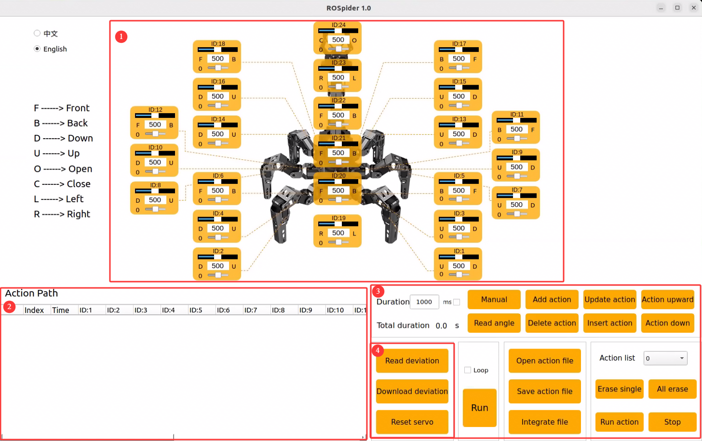

The functions of each area are introduced below.

### 2.11.3 Servo Control Area

The servo control area displays the selected servo icon. By adjusting the corresponding slider value, the rotation position of the servo can be adjusted, thereby adjusting the posture of ROSpider.

<table border="1">
<thead>
<tr>
<td>Icon</td>
<td>Function Description</td>
</tr>
<thead>
<tbody>
<tr>
<td></td>
<td>Servo ID number.</td>
</tr>
<tr>
<td></td>
<td>Used to adjust the angle position of the servo, with a value range from 0 to 1000.</td>
</tr>
<tr>
<td></td>
<td>Used to adjust the servo deviation, with a value range from -125 to 125. To prevent accidental operation, the deviation adjustment slider can only be dragged after clicking the "Read Deviation" button.</td>
</tr>
</tbody>
</table>

### 2.11.4 Action Details List

The action details list displays the current action number, execution time, and the position information of each servo within it.

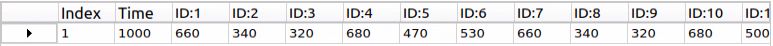

<table border="1">
<thead>
<tr>
<td>Icon</td>
<td>Function Description</td>
</tr>
<thead>
<tbody>
<tr>
<td></td>
<td>Action number.</td>
</tr>
<tr>
<td></td>
<td>The time required to execute the action, in ms.</td>
</tr>
<tr>
<td></td>
<td>The rotation position of the corresponding ID servo, which can be modified by double-clicking the value below .</td>
</tr>
<tr>
<td></td>
<td>Run the currently selected action.</td>
</tr>
</tbody>
</table>

### 2.11.5 Action Group Setting Area

The action group setting area allows operations such as adding, deleting, updating, inserting, running, opening, and connecting actions.

<table border="1">
<thead>
<tr>
<td>Icon</td>
<td>Function Description</td>
</tr>
<thead>
<tbody>
<tr>
<td>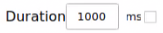</td>
<td>The time required to run a single action, which can be modified by clicking . Checking the small box after "ms" can lock the time value.</td>
</tr>
<tr>
<td>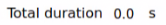</td>
<td>The total time required to run the complete action group.</td>
</tr>
<tr>
<td></td>
<td>Clicking this powers off the robot's servos, making the joints loose. At this time, the robot can be manually adjusted to design actions. If it cannot be adjusted, do not force it, just click again.</td>
</tr>
<tr>
<td></td>
<td>Read the position information of the manually adjusted servos. Needs to be used in conjunction with the "Manual Programming" button.</td>
</tr>
<tr>
<td></td>
<td>Integrate the current servo values in the servo control area into one action and add it to the last row of the action details list.</td>
</tr>
<tr>
<td></td>
<td>Delete the selected action in the action details list.</td>
</tr>
<tr>
<td></td>
<td>Replace the selected values in the action details list. Servo values are replaced with the current servo values in the servo control area, and the action running time is replaced with the time set in "Duration".</td>
</tr>
<tr>
<td></td>
<td>Insert a row of action above the selected action. The time of the action is the time in "Duration (ms)", and the angle value is the servo value in the servo control area.</td>
</tr>
<tr>
<td></td>
<td>Move the selected action up one row.</td>
</tr>
<tr>
<td></td>
<td>Move the selected action down one row.</td>
</tr>
<tr>
<td>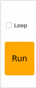</td>
<td>Clicking this button will run the actions in the action details list once. If "Loop" is checked, the robot will repeatedly run the actions.</td>
</tr>
<tr>
<td></td>
<td>Click to select the action group to be opened to load the action group data into the action details list.</td>
</tr>
<tr>
<td></td>
<td>Save the actions currently in the action details list to a specified location.</td>
</tr>
<tr>
<td></td>
<td>After opening an action group, click the connect action file button to continue opening another action group file, which can connect the two action group files into a new action group.</td>
</tr>
<tr>
<td>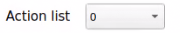</td>
<td>Saved action groups can be displayed in the PC software.</td>
</tr>
<tr>
<td></td>
<td>Delete the action group file in the current action group selection bar.</td>
</tr>
<tr>
<td></td>
<td>Caution: This action cannot be undone. Delete all action groups in the action group selection bar.</td>
</tr>
<tr>
<td></td>
<td>Execute the action group in the action group option box once.</td>
</tr>
<tr>
<td></td>
<td>Stop the currently running action group.</td>
</tr>
</tbody>
</table>


> [!NOTE]
> **Action group files are uniformly saved to the path /home/ubuntu/software/actionset_editor/ActionGroups.**

### 2.11.6 Deviation Setting Area

<table border="1">
<thead>
<tr>
<td>Icon</td>
<td>Function Description</td>
</tr>
<thead>
<tbody>
<tr>
<td></td>
<td>Read the current servo deviation value of the ROSpider.</td>
</tr>
<tr>
<td></td>
<td>Save the adjusted servo deviation value to the ROSpider.</td>
</tr>
<tr>
<td></td>
<td>Restore all servo parameters in the servo control area to 500.</td>
</tr>
</tbody>
</table>
> [!NOTE]
> **ROSpider has completed deviation adjustment before shipping.**


## 2.12 Action Editing Instruction

This lesson will edit an action group to make ROSpider **clap**. This action group contains 15 independent actions.

### 2.12.1 Action Editing

1. Power on the robot and connect it to the remote control software NoMachine. Refer to the contents in the **[1. ROSpider User Manual\1.4 Development Environment Setup](https://wiki.hiwonder.com/projects/ROSpider/en/jetson-orin-nano-version/docs/1_ROSpider_User_Manual.html#development-environment-setup)** directory for remote connection.
2. Double-click the icon  on the system desktop to open the PC software.
3. To facilitate subsequent explanations, the legs of ROSpider are sorted as shown in the figure below:

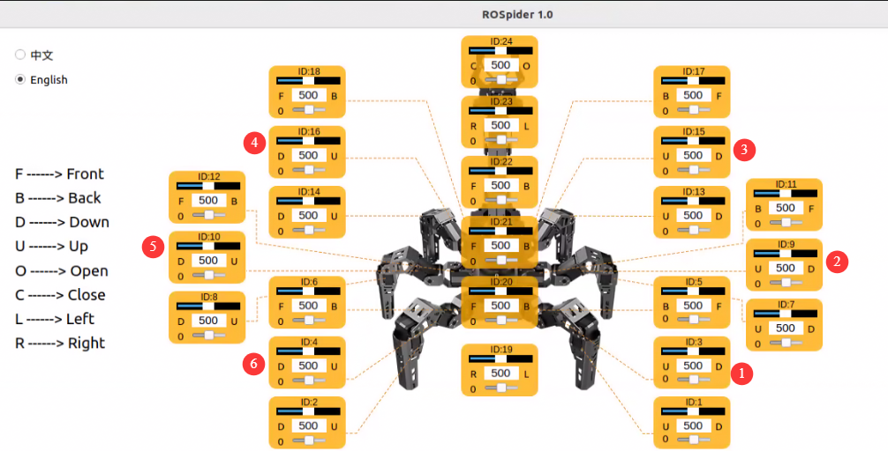

4. Action 1: Click the **Reset servo** button in the deviation adjustment area to restore the robot to its initial posture.

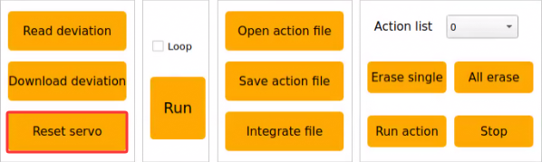

5. Change the action time to 500ms and click the **Add action** button in the action editing area to add the initial action to the action list.


The specific parameters of the action can be viewed in the action list area.

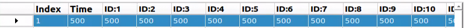

> [!NOTE]
> **Every subsequent edited action needs to be added to the action list.**

6. Drag the slider to adjust the parameter of servo No. 8 to 300.

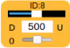

7. Action 2: Refer to the figure below to modify other servo parameters to make ROSpider lift legs No. 2 and No. 5, and add the action to the action list.


8. Action 3: Make legs No. 2 and No. 5 of ROSpider swing forward.

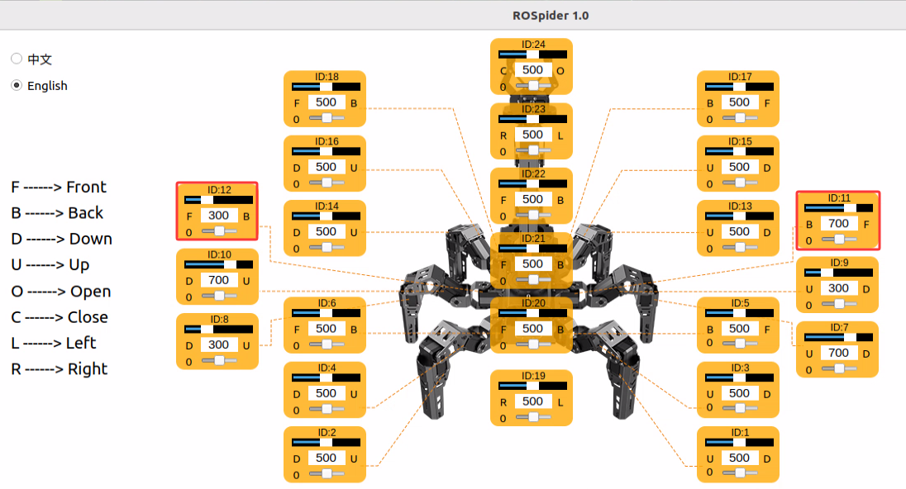

9. Action 4: Make legs No. 2 and No. 5 of ROSpider touch the ground.

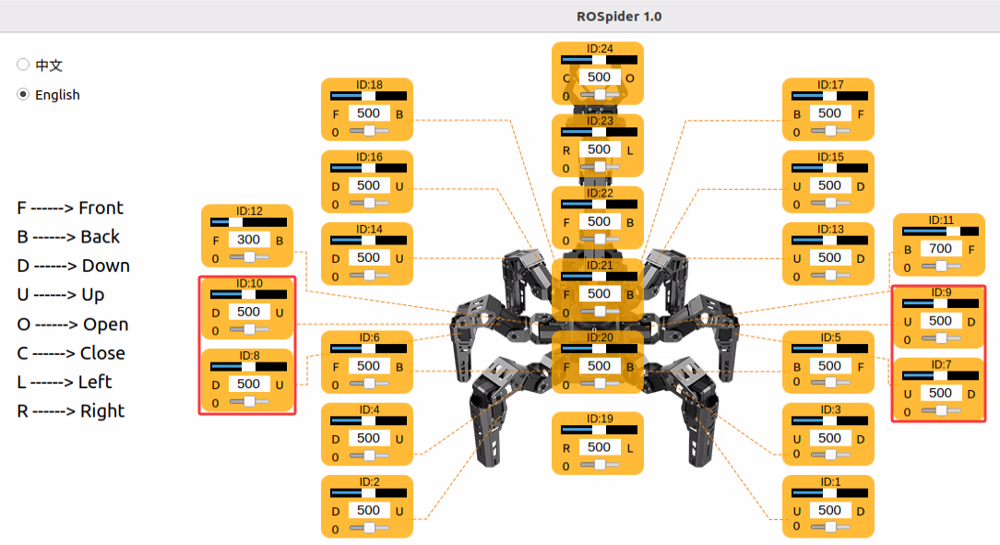

10. Action 5: Repeat Action 4 to make the action transition smoother and more fluent. Change the time to 200ms, and click the **Add action** button to add this action to the action list.

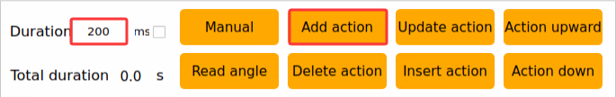

11. Action 6: Make legs No. 1 and No. 6 of ROSpider lift to the chest. Change the time to 700ms, and click the **Add action** button to add this action to the action list.

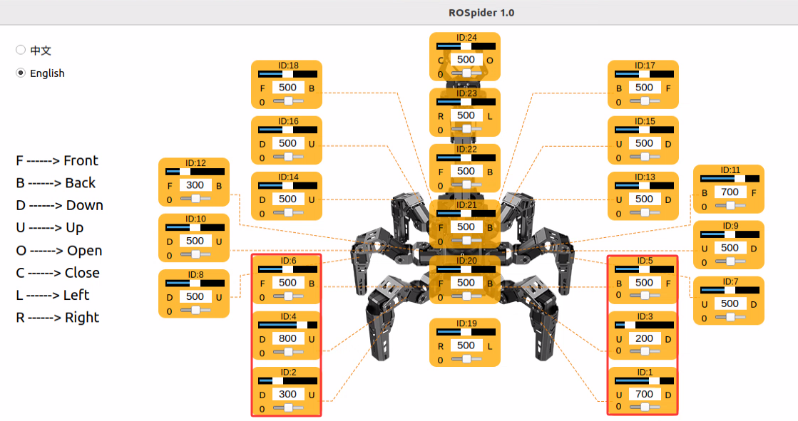

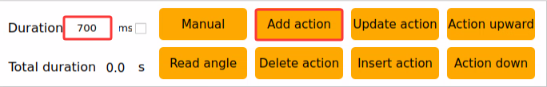

12. Action 7: Make legs No. 1 and No. 6 of ROSpider close slightly to clap. Change the time to 400ms, and click the **Add action** button to add this action to the action list.

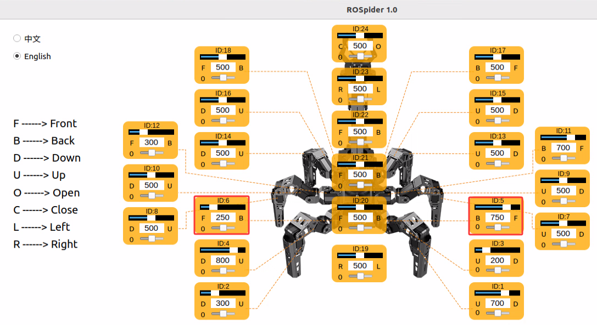

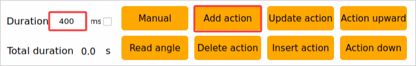

13. Action 8: Separate legs No. 1 and No. 6 of ROSpider.

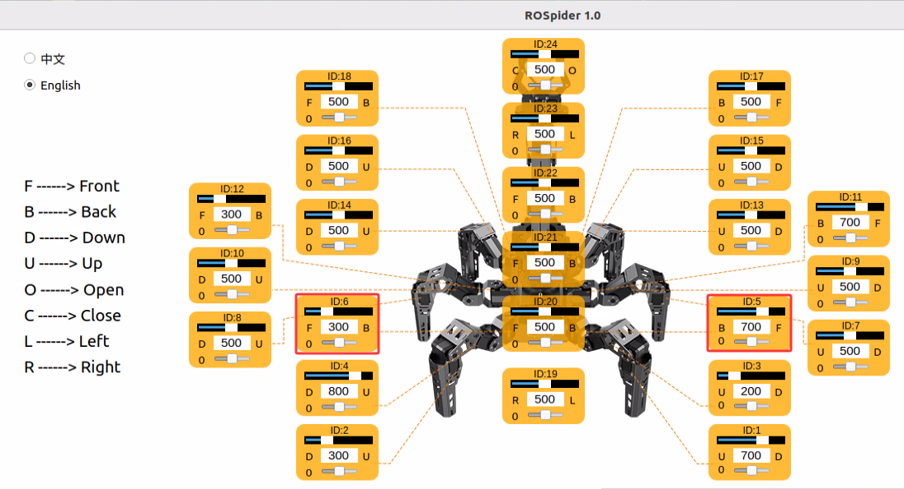

14. Action 9: Make legs No. 1 and No. 6 of ROSpider close slightly again to clap.

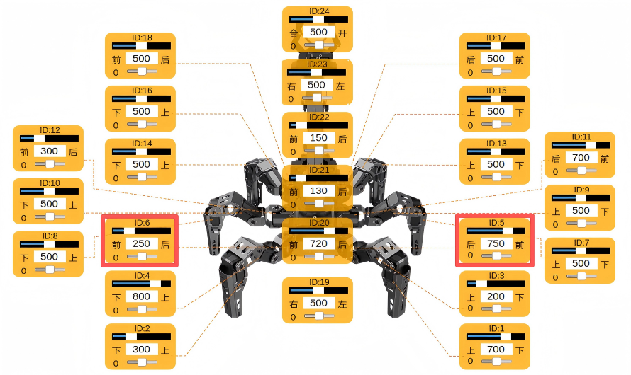

15. Action 10: Separate legs No. 1 and No. 6 of ROSpider.


16. Action 11: Repeat Action 10 to make the action transition smoother and more fluent. Change the time to 200ms, and click the **Add action** button to add this action to the action list.


17. Action 12: Reset legs No. 1 and No. 6 of ROSpider, meaning the respective servos on legs No. 1 and No. 6 return to the center. Change the time to 500ms, and click the **Add action** button to add this action to the action list.

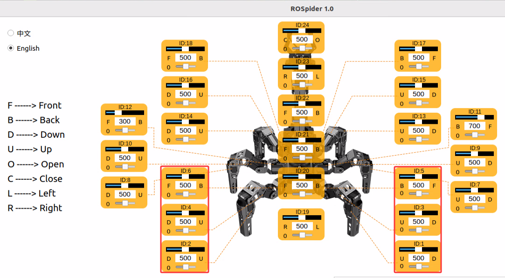


18. Action 13: Lift legs No. 2 and No. 5 of ROSpider. Change the time to 600ms, and click the **Add action** button to add this action to the action list.


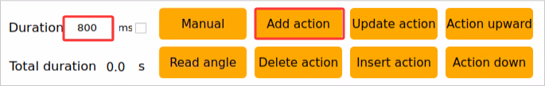

19. Action 14: Make legs No. 2 and No. 5 of ROSpider swing backward. Change the time to 500ms, and click the **Add action** button to add this action to the action list.


20. Action 15: Click the **Reset servo** button to restore the hexapod robot to its initial posture, and click the **Add action** button to add this action to the action list.

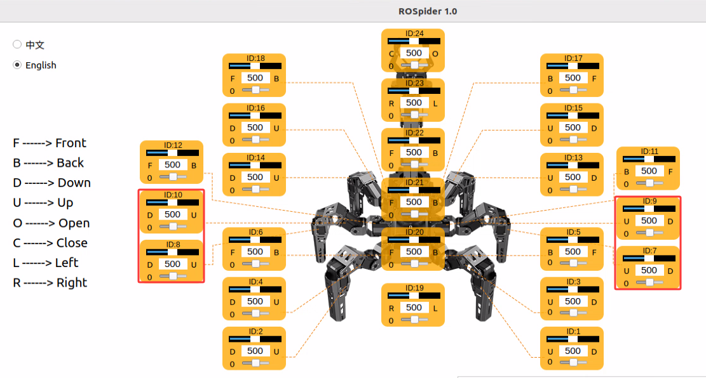

All numerical parameters of this action group are shown in the table below:

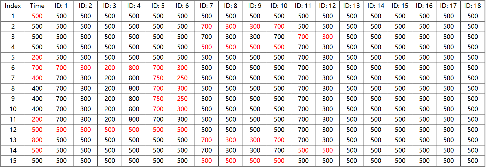

> [!NOTE]
> **The red values are the time parameters or servo parameters that need to be adjusted in each step.**

### 2.12.2 Action Saving

1. To facilitate later debugging and management, click the **Save Action File** button to save the action group.

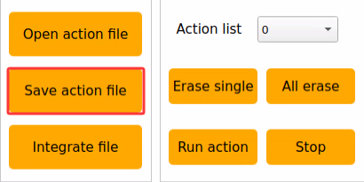

2. Select the save path as **/home/ubuntu/software/actionset_editor/ActionGroups**, name the action group **clap** here, and then click **Save** to save.

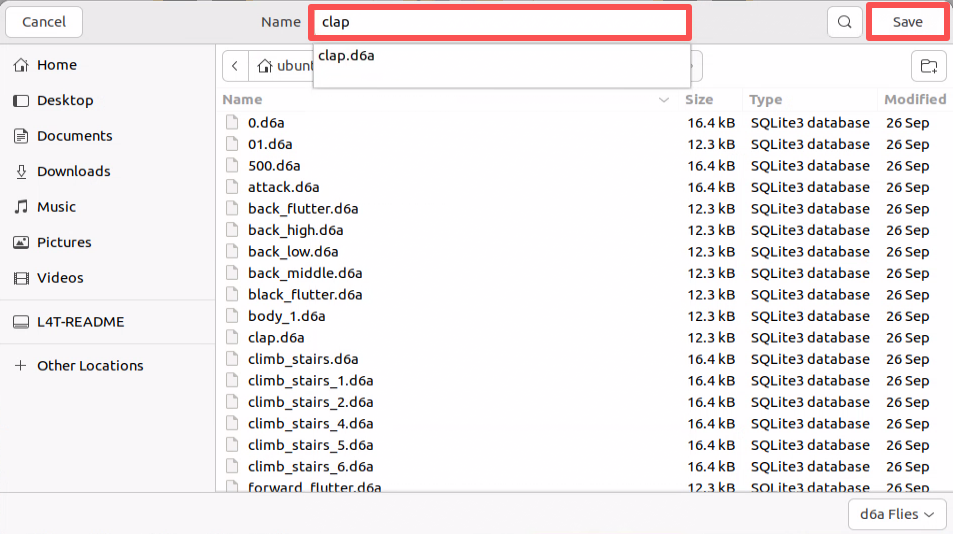

### 2.12.3 Action Group Invocation

1. Open the PC software and click **Action list**.

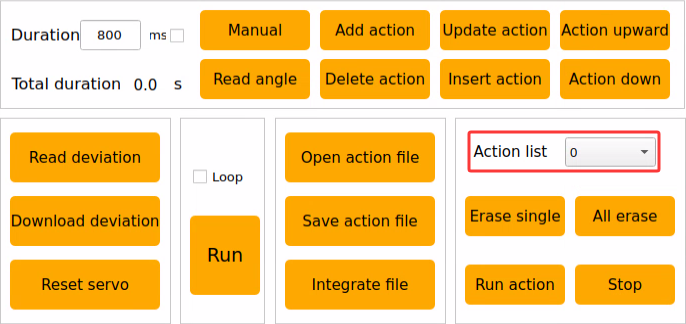

2. Select the name of the action group to be invoked.

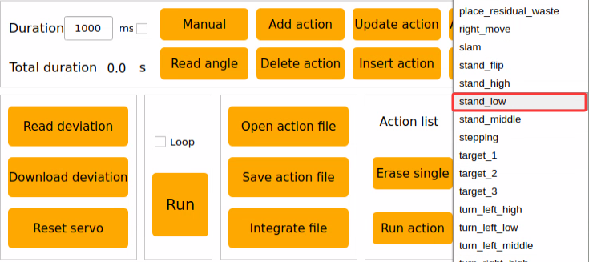

3. After selection, click **Run action**.

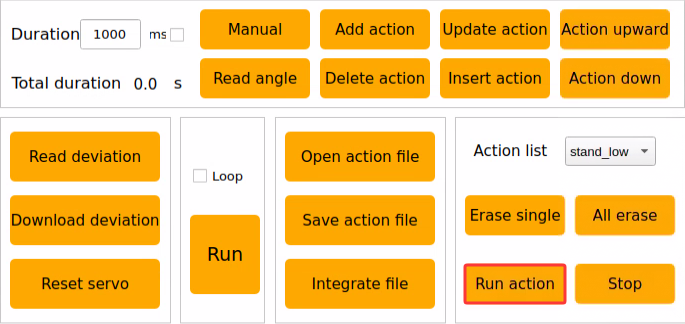

### 2.12.4 Integrating Action Groups

1. After remotely connecting to the system, start the PC software.

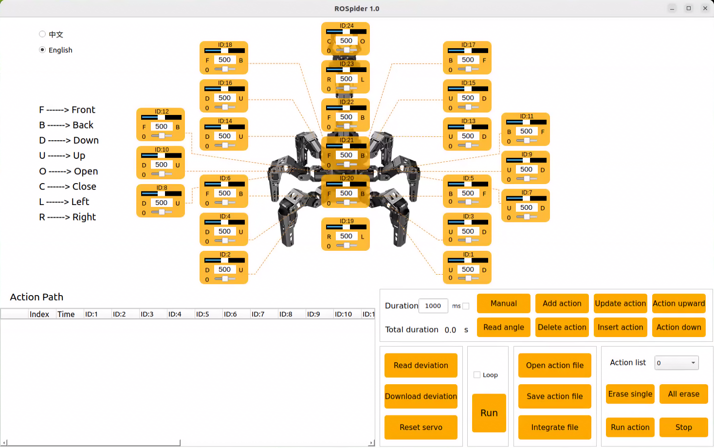

2. Click the **Open action file** button in the action group setting area, navigate to the directory **/home/ubuntu/software/actionset_editor/ActionGroups**, select **go_forward_high**, and double-click to open.

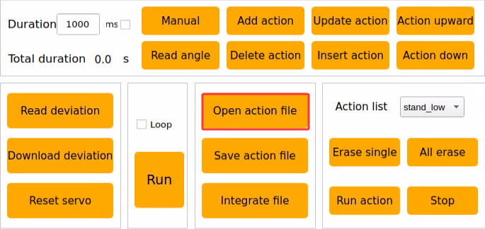

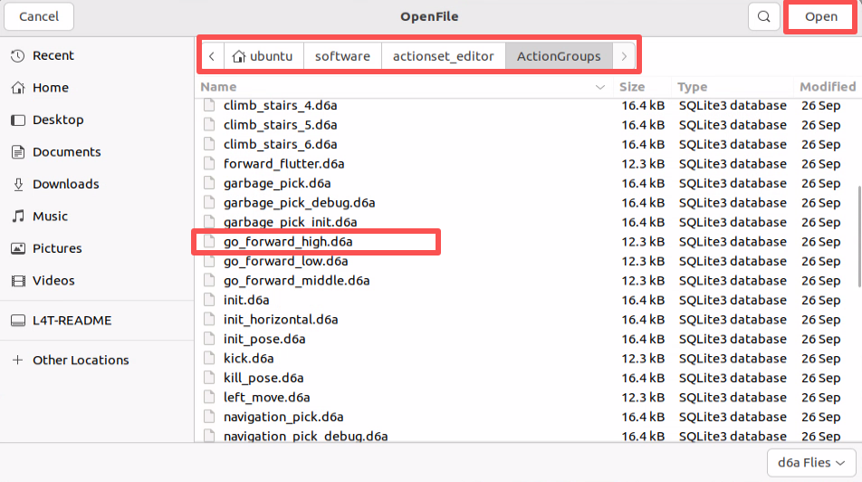

3. Click the **Integrate file** button in the action group setting area, navigate to the directory **/home/ubuntu/software/actionset_editor/ActionGroups**, select **go_forward_low**, and double-click to open.

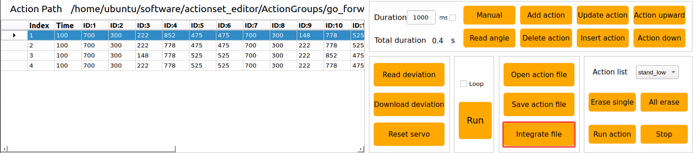

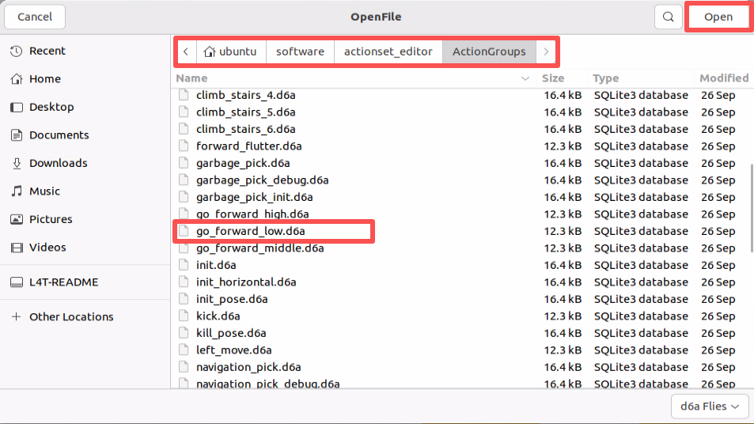

4. At this point, it can be seen that the integrated action group has been imported. Move the cursor to number 1, and then click **Run action** to run the new connected action group online once.

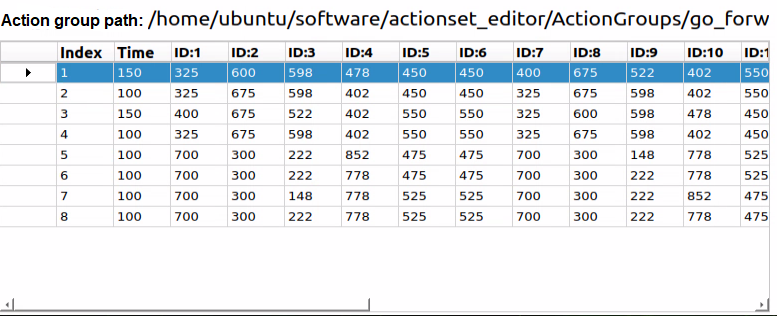

5. Click the **Save action file** button to save the newly connected action group for later debugging.

> [!NOTE]
> **English is recommended for naming to avoid failure for action invocation.**

## 2.13 App Custom Control

Previously, the editing method of the action group **clap** was introduced. This section will use the custom action group function of the app to make the ROSpider execute this action group.
To learn about the connection method of the app, refer to the related sections in directory **[1. ROSpider User Manual\1.3 Basic Robot Usage\1.3.3 App Installation and Connection](https://wiki.hiwonder.com/projects/ROSpider/en/jetson-orin-nano-version/docs/1_ROSpider_User_Manual.html#app-installation-and-connection)**.

<p id ="p2-13-1"></p>

### 2.13.1 View Built-in Action Groups

1. Power on the robot and connect it to the remote control software NoMachine. Refer to the contents in the **[1. ROSpider User Manual\1.4 Development Environment Setup](https://wiki.hiwonder.com/projects/ROSpider/en/jetson-orin-nano-version/docs/1_ROSpider_User_Manual.html#development-environment-setup)** directory for remote connection.
2. Click the icon  in the system status bar to open the file manager.
3. Navigate to the directory **/home/ubuntu/software/actionset_editor/ActionGroups** to view the names of all current action groups.

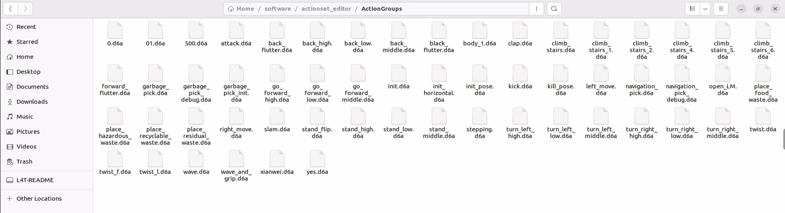

### 2.13.2 App Custom Action Group

1. Open the app **WonderNex** and connect to the ROSpider.
2. Click **Robot Control** on the mode selection interface to enter the operation interface for this mode.

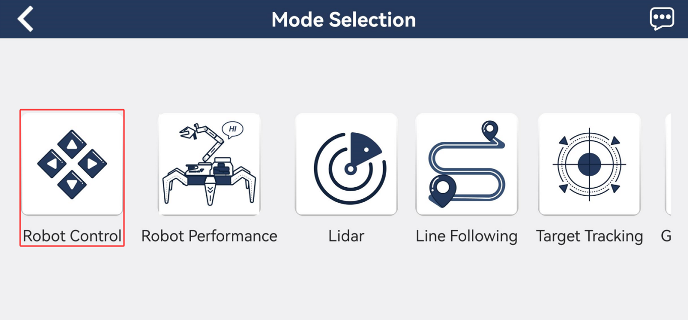

3. Click the icon  in the manual bar.

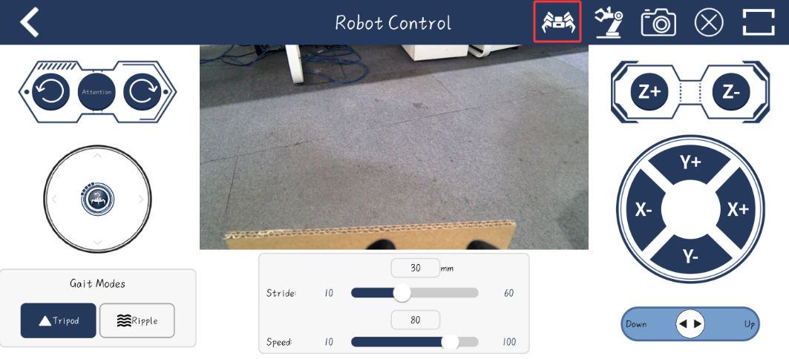

4. Click the **Add** button to add a custom action.

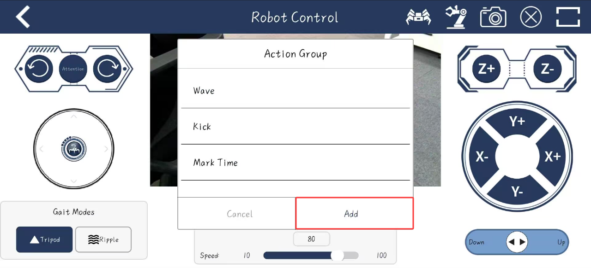

5. Fill in the required action information. Fill in **Clap** in the **Input action name** field, and **clap.d6a** in the **Input Action File Name** field. After filling in, click the **OK** button to complete the addition of the custom action.

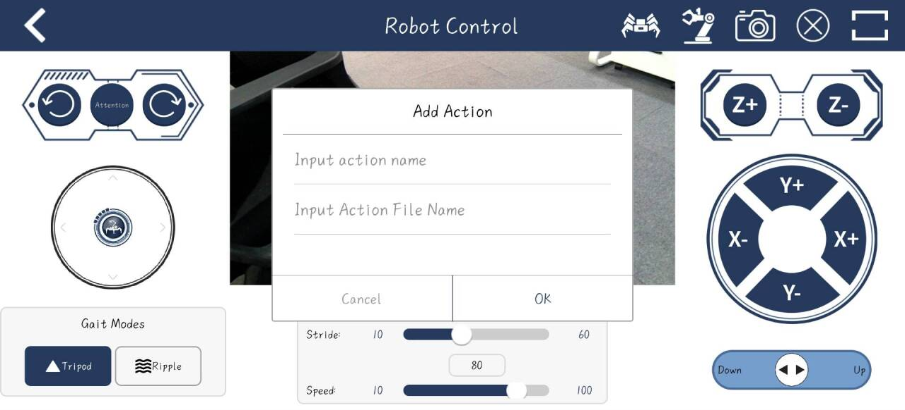

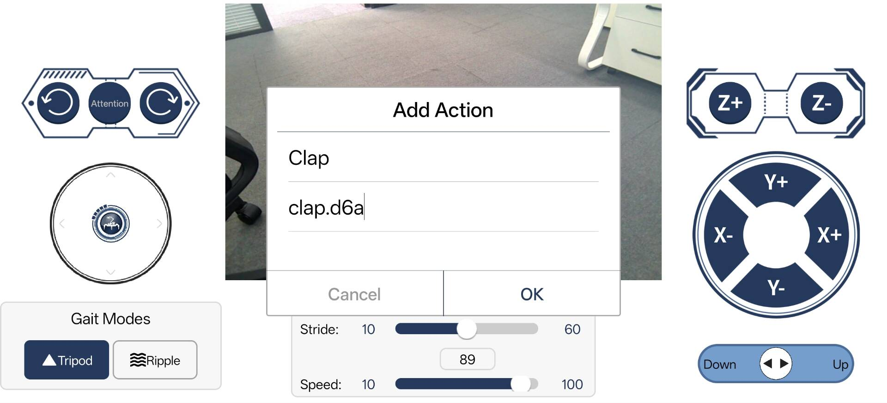

> [!NOTE]
> **The "Input action name" field can be filled in freely, while the "Input Action File Name" field needs to be filled with the name of the robot's built-in action group. To view the specific action group names, refer to [2.13.1 View Built-in Action Groups](#p2-13-1) for instructions.**

6. Click the icon  in the manual bar and select the **Clap** action. The robot will execute the corresponding action.


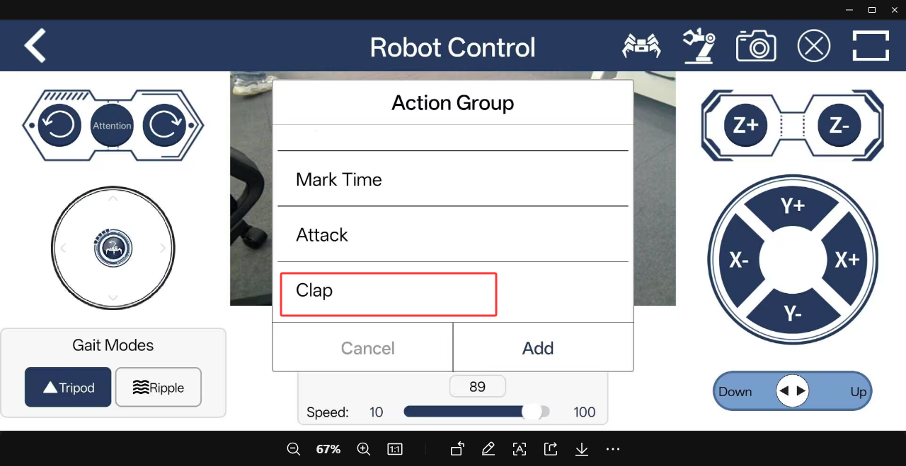

7. To modify the action, long-press the **Clap** text and follow the pop-up prompt. Click the **Edit** button to modify the settings of the custom action. Click the **Delete** button to delete the selected custom action.

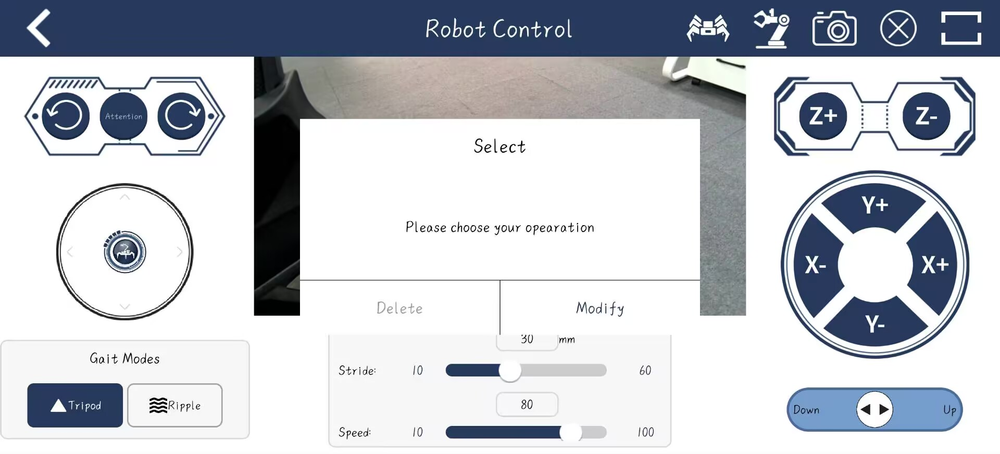

## 2.14 ROS Robot Host Computer Remote Control

> [!NOTE]
> **To avoid control conflicts or other issues, do not use the computer-side control software and the app for control at the same time.**

### 2.14.1 Host Computer Software Installation

The installation package of the computer-side control software is located in the **2. Softwares** directory. Double-click the installation package **[ROSpider Terminal Setup 1.0.0.exe](https://drive.google.com/drive/folders/1bSe7b36dKtH4FgoWORtREqIzb5oGVoOl?usp=sharing)** to install it.

### 2.14.2 Host Computer Software Connection

1. Power on the ROSpider.
2. Open the computer network settings. Desktop computers need to prepare their own wireless network card. If the ROSpider is in direct connection mode, the computer needs to be connected to the robot's hotspot. If it is in LAN mode, the computer needs to be connected to the same local area network.
3. Double-click the desktop icon on the computer to open the PC software.

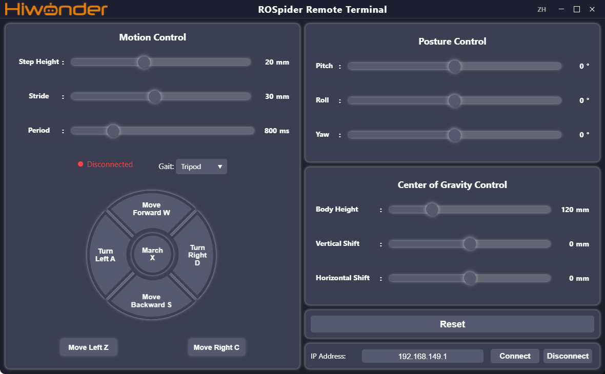

4. After filling in the corresponding IP address, which is **192.168.149.1** in the direct connection mode, click the **Connect** button at the bottom right of the software interface. Wait a moment for the PC software to complete the connection.

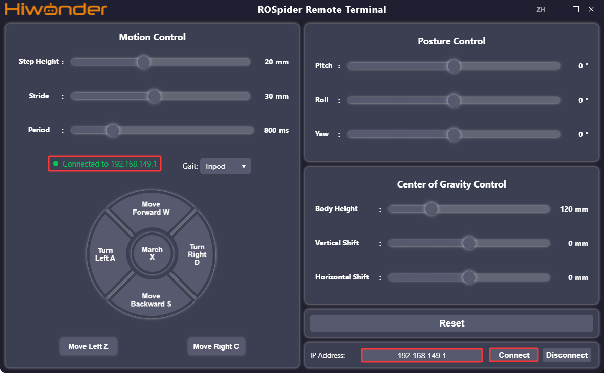

### 2.14.3 Interface Description

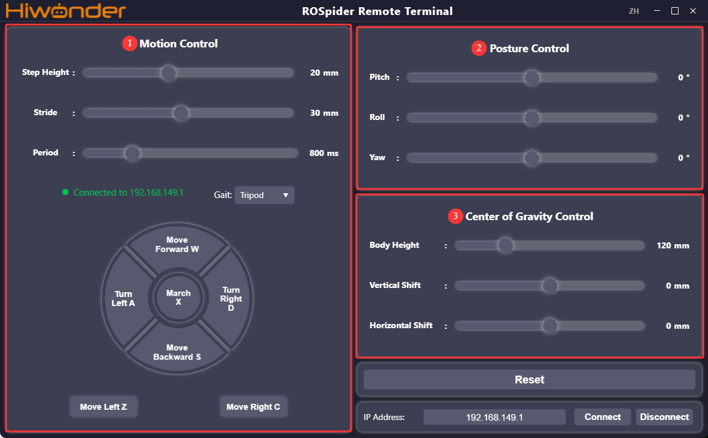

* **Movement Control Area**

<table border="1">
<thead>
<tr>
<td>Icon</td>
<td>Function Description</td>
</tr>
<thead>
<tbody>
<tr>
<td></td>
<td>Set the moving step height of the ROSpider, which is the maximum distance the foot tip can be lifted, in mm.</td>
</tr>
<tr>
<td></td>
<td>Set the moving stride length of the ROSpider, in mm.</td>
</tr>
<tr>
<td></td>
<td>Set the gait cycle of the ROSpider, which is the time required to complete a full gait, in ms.</td>
</tr>
<tr>
<td>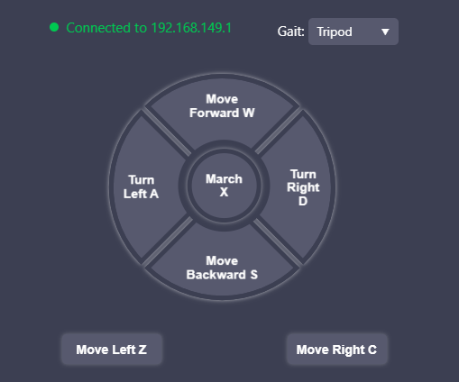</td>
<td>Set the gait of the ROSpider, which can be selected as ripple gait or tripod gait. Clicking the movement button controls the robot to execute the corresponding action once, and long-pressing the button controls the robot to execute the corresponding action continuously.</td>
</tr>
</tbody>
</table>


* **Posture Control Area**

<table border="1">
<thead>
<tr>
<td>Icon</td>
<td>Function Description</td>
</tr>
<thead>
<tbody>
<tr>
<td></td>
<td>Set the pitch angle of the ROSpider from the robot's first-person perspective, which is the angle of looking down or up. When the value is positive, the robot looks up, and when negative, the robot looks down. The larger the absolute value, the larger the angle of looking up or down.</td>
</tr>
<tr>
<td></td>
<td>Set the roll angle of the ROSpider from the robot's first-person perspective, which is the tilt angle of the body to the left or right. When the value is negative, the robot tilts to the right, and when positive, the robot tilts to the left. The larger the absolute value, the larger the tilt angle.</td>
</tr>
<tr>
<td></td>
<td>Set the yaw angle of the ROSpider from the robot's first-person perspective, which is the twisting amplitude of the body. When set to a positive value, left twisting is positive, and when set to a negative value, right twisting is positive. The larger the value, the larger the twisting amplitude.</td>
</tr>
</tbody>
</table>


* **Center of Gravity Adjustment Area**

<table border="1">
<thead>
<tr>
<td>Icon</td>
<td>Function Description</td>
</tr>
<thead>
<tbody>
<tr>
<td></td>
<td>Set the body height of the ROSpider, in mm.</td>
</tr>
<tr>
<td></td>
<td>Set the longitudinal center of gravity offset of the body. When the value is positive, the center of gravity shifts forward, and when negative, the center of gravity shifts backward.</td>
</tr>
<tr>
<td></td>
<td>Set the lateral center of gravity offset of the body. When the value is positive, the center of gravity shifts to the left, and when negative, the center of gravity shifts to the right.</td>
</tr>
</tbody>
</table>


## 2.15 IMU Calibration

> [!NOTE]
> **Calibration is only to reduce deviation. Actual hardware deviation will definitely exist, so during calibration, it only needs to be adjusted to be relatively accurate to meet specific requirements.**

The IMU (Inertial Measurement Unit) is a device that measures the three-axis attitude angle or angular rate and acceleration of an object. Gyroscopes and accelerometers are the main components of the IMU, providing a total of 6 degrees of freedom to measure the angular velocity and acceleration of an object in three-dimensional space.

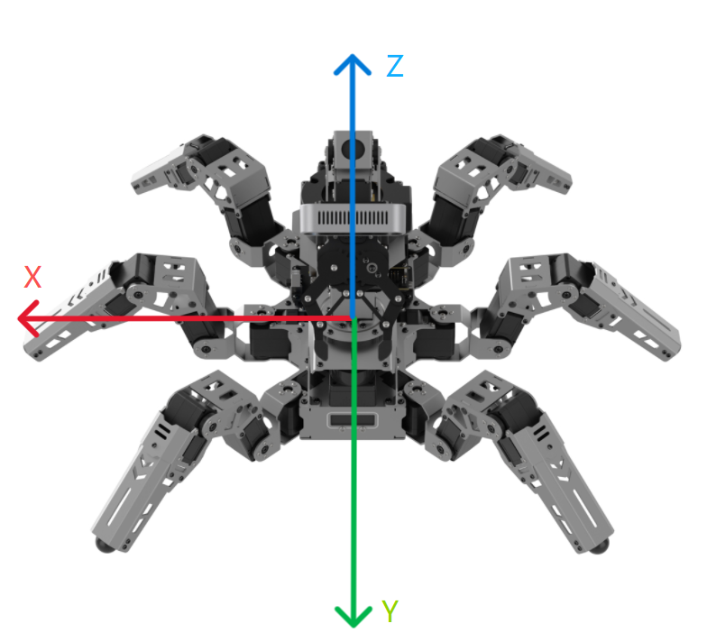

The figure above shows the positive directions of the three axes x, y, and z of the IMU. In the subsequent calibration process, calibration can be performed referring to the coordinate relationship in the figure above. After the node receives the first IMU message, a prompt will appear to hold the IMU in a specific direction, and then press **Enter** to record the measurement value. After completing all 6 directions, the node will calculate the calibration parameters and write them into the specified YAML file. The specific steps are as follows:

1. Power on the robot and connect it to the remote control software NoMachine.
2. Click the icon  on the system desktop to open the command line terminal.
3. Enter the command and press **Enter** to close the auto-start program.

```bash
~/.stop_ros.sh
```

4. Enter the command and press **Enter**.

```bash
ros2 launch ros_robot_controller ros_robot_controller.launch.py
```

5. Open a new command line terminal, then enter the command, and press **Enter** to start IMU calibration:

```bash
ros2 run imu_calib do_calib --ros-args -r imu:=/ros_robot_controller/imu_raw --param output_file:=/home/ubuntu/ros2_ws/src/peripherals/config/imu_calib.yaml
```

6. The following prompt will appear in the command line terminal, indicating that calibration of the angular velocity deviation in the positive direction of the IMU's x-axis can begin. Similarly, place the robot sideways from the perspective shown in the figure below, ensure the direction and angle of the sideways roll match the figure below, and press **Enter** to execute.


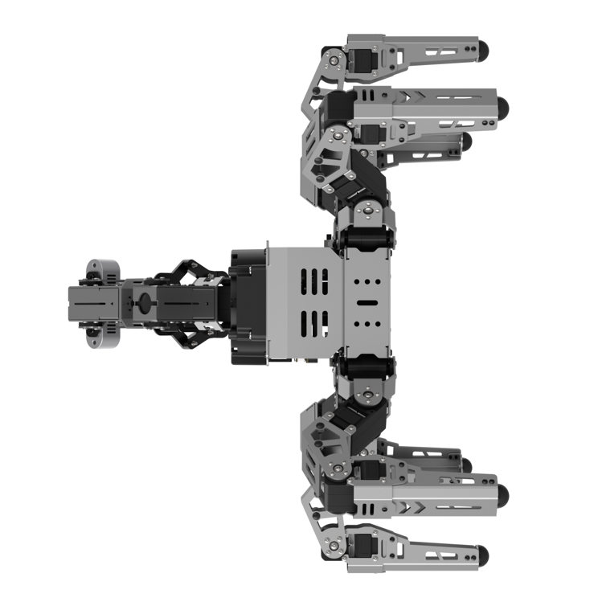

After each direction is successfully calibrated, the following prompt will appear:


7. Then, the following prompt will appear in the command line terminal, indicating that calibration of the angular velocity deviation in the negative direction of the IMU's x-axis can begin. Similarly, place the robot sideways from the perspective shown in the figure below, ensure the direction and angle of the sideways roll match the figure below, and press **Enter** to execute.


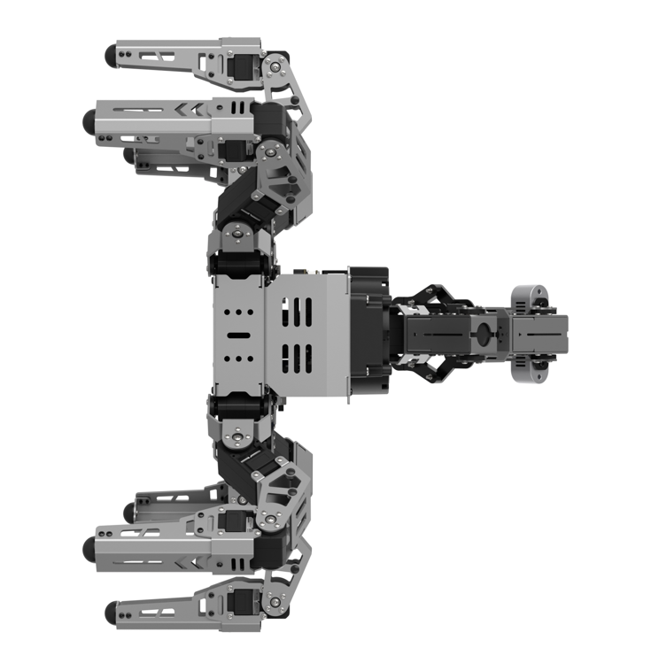

8. Next, the following prompt will appear in the command line terminal, indicating that calibration of the angular velocity deviation in the positive direction of the IMU's y-axis can begin. Similarly, place the robot facing upwards from the perspective shown in the figure below, ensure the direction and angle match the figure below, and press **Enter** to execute.


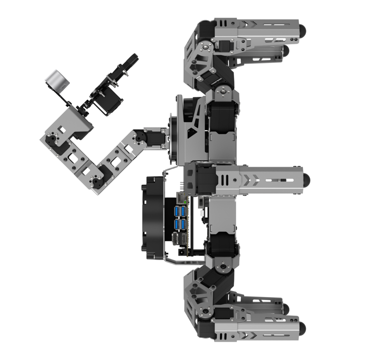

9. Then, the following prompt will appear in the command line terminal, indicating that calibration of the angular velocity deviation in the negative direction of the IMU's y-axis can begin. Similarly, place the robot facing downwards from the perspective shown in the figure below, ensure the direction and angle of the robot match the figure below, and press **Enter** to execute.


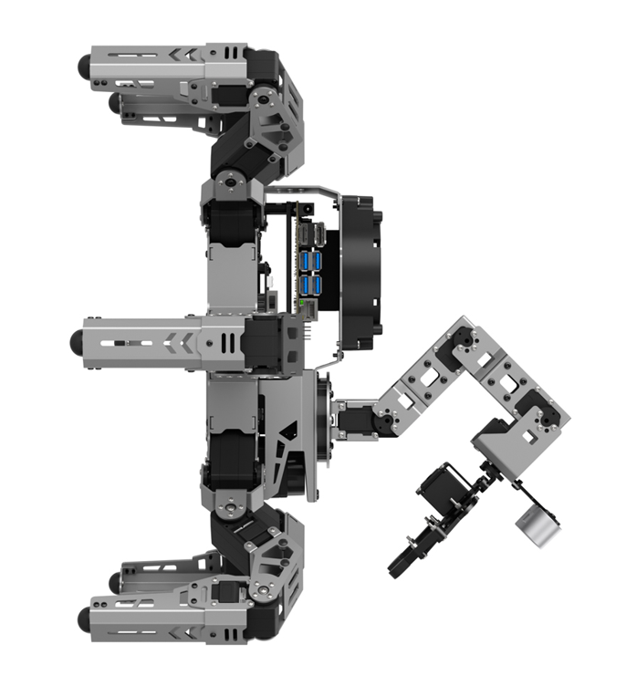

10. Then, the following prompt will appear in the command line terminal, indicating that calibration of the angular velocity deviation in the positive direction of the IMU's z-axis can begin. Pick up the robot, place it upright facing upwards, fix the robot properly, and press **Enter**. Similarly, place the robot from the perspective shown in the figure below, ensure the direction and angle of the robot match the figure below, and press **Enter** to execute.


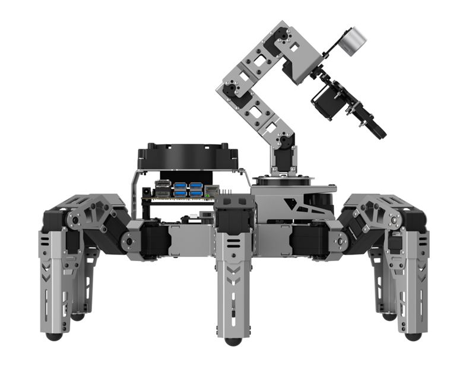

11. Then, the following prompt will appear in the command line terminal, indicating that calibration of the angular velocity deviation in the negative direction of the IMU's z-axis can begin. Similarly, place the robot from the perspective shown in the figure below, ensure the direction and angle of the robot match the figure below, and press **Enter** to execute.


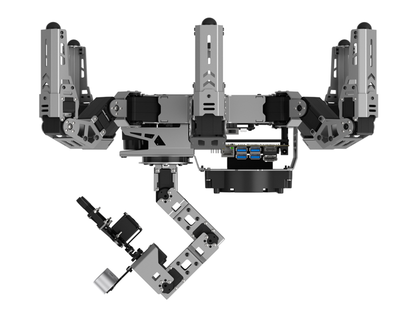

12. The following prompt indicates that the calibration is complete.

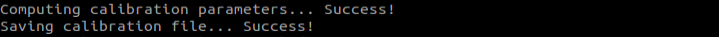

13. After calibration is complete, commands can be entered to view the calibrated effect:

```bash
ros2 launch peripherals imu_view.launch.py
```

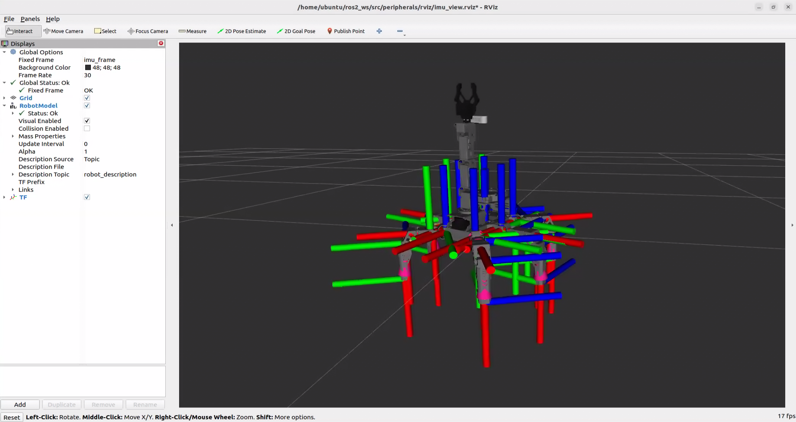


## **Advanced Robot Motion Control**

## 2.16 Establishment of Hexapod Robot Coordinate System

### 2.16.1 Coordinate System Introduction

To control the motion of ROSpider, inputting the coordinates for the footholds of the 6 legs allows the system to use inverse kinematics to output the required rotation angles for all servos, thereby enabling walking control.

First, establish the coordinate system for ROSpider. When establishing the coordinate system, the center point of the ROSpider body is taken as the origin coordinates (0, 0, 0). From a first-person perspective of the robot, the forward direction is the positive X-axis, the left side is the positive Y-axis, and the upward direction is the positive Z-axis, as shown in the following figure:

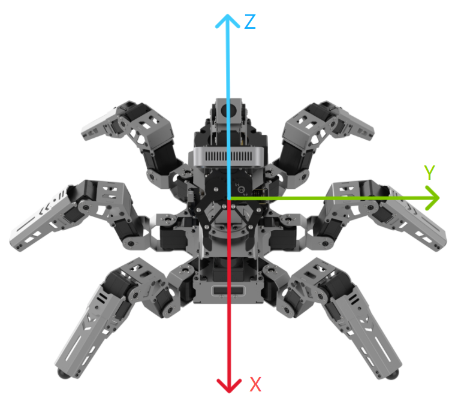

When setting coordinates, it is only necessary to configure the X, Y, and Z-axis values for the footholds of the 6 legs.

### 2.16.2 Coordinate Description

For a clearer understanding, the initial posture coordinates of ROSpider are utilized as an example.
The program source code is located at: **/home/ubuntu/ros2_ws/src/driver/controller/controller/bulid_in_pose.py**

Three initial coordinate points and heights are defined in the program.

```
X1 = 93.60
Y1 = 50.805
X2 = 0.0
Y2 = 73.535

INITIAL_X = 70.0
INITIAL_Y = 110.0
INITIAL_HEIGHT = 70.0
INITIAL_HEIGHT_M = 95
SLAM_HEIGHT = 100.0
```

The positions of Servo 11 and Servo 5 are shown in the following figure:

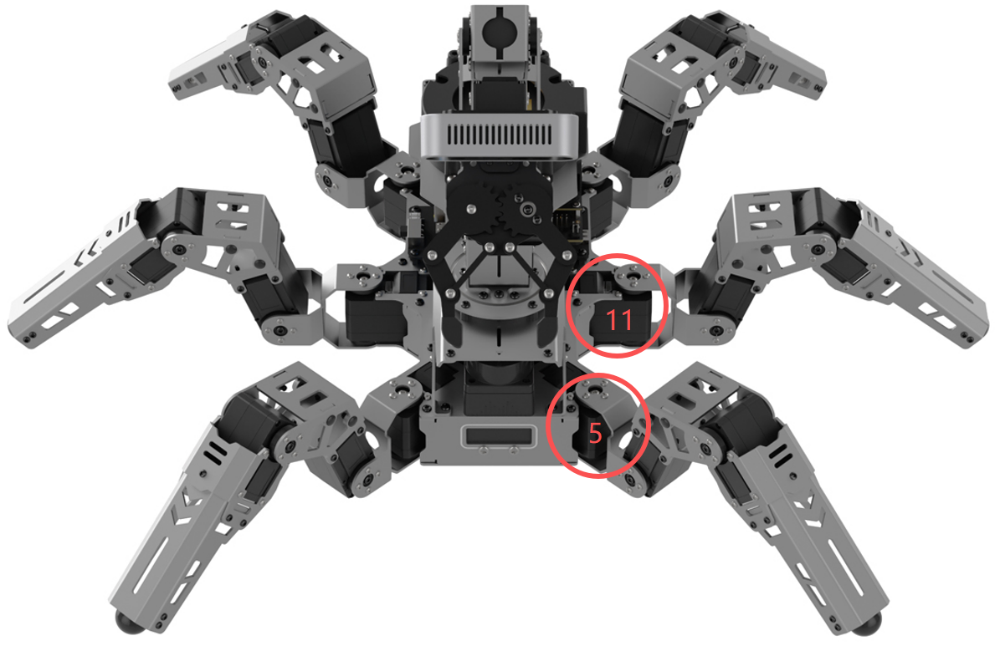

1. (X1, Y1) represents the innermost coordinate value of the left front leg with ID 5, indicating the offset from the servo rotation axis to the robot center.
2. (X2, Y2) represents the innermost coordinate value of the left middle leg with ID 11, indicating the offset from the servo rotation axis to the robot center.
3. (INITIAL_X, INITIAL_Y) represents the offset from the foot tip of each leg to the innermost servo rotation axis.
4. INITIAL_HEIGHT represents the vertical height offset from the foot tip of each leg to the robot center.
5. INITIAL_HEIGHT_M represents the vertical height offset from the foot tip of each leg to the robot center during mapping.
6. SLAM_HEIGHT represents the vertical height of the robot center during mapping.

```
DEFAULT_POSE = ((INITIAL_X + X1, INITIAL_Y + Y1 - 20, -INITIAL_HEIGHT),\
                (0.0, INITIAL_Y + Y2, -INITIAL_HEIGHT),\
                (-INITIAL_X - X1, INITIAL_Y + Y1 - 20, -INITIAL_HEIGHT),\
                (-INITIAL_X - X1, -INITIAL_Y - Y1 + 20, -INITIAL_HEIGHT),\
                (0.0, -INITIAL_Y - Y2, -INITIAL_HEIGHT),\
                (INITIAL_X + X1, -INITIAL_Y - Y1 + 20, -INITIAL_HEIGHT))

DEFAULT_POSE_M = ((INITIAL_X + X1, INITIAL_Y + Y1 - 20, -INITIAL_HEIGHT_M),\
                (0.0, INITIAL_Y + Y2, -INITIAL_HEIGHT_M),\
                (-INITIAL_X - X1, INITIAL_Y + Y1 - 20, -INITIAL_HEIGHT_M),\
                (-INITIAL_X - X1, -INITIAL_Y - Y1 + 20, -INITIAL_HEIGHT_M),\
                (0.0, -INITIAL_Y - Y2, -INITIAL_HEIGHT_M),\
                (INITIAL_X + X1, -INITIAL_Y - Y1 + 20, -INITIAL_HEIGHT_M))
```

In the initial posture, the positions of the robot's 6 legs are calculated from the three initial coordinate points and heights mentioned above. The first coordinate is the foothold for leg 1, and the subsequent coordinates are arranged in a counterclockwise order. `DEFAULT_POSE` is the default posture during robot operation, and `DEFAULT_POSE_M` is the posture during mapping and navigation. The leg numbering is shown in the following figure:


## 2.17 Brief Analysis of Inverse Kinematics

### 2.17.1 Inverse Kinematics Introduction

The inverse kinematics of the ROSpider hexapod robot is a crucial foundation for its trajectory planning and control. Whether the inverse kinematics solution is fast and accurate will directly affect the precision of ROSpider's trajectory planning and control. Therefore, designing a rapid and precise inverse kinematics solving method is of great importance.

For the ROSpider hexapod robot, inverse kinematics involves solving for the rotation angles of the three servos on each leg based on its foot tip coordinates. The servo positions and leg numbering are shown in the following figure:

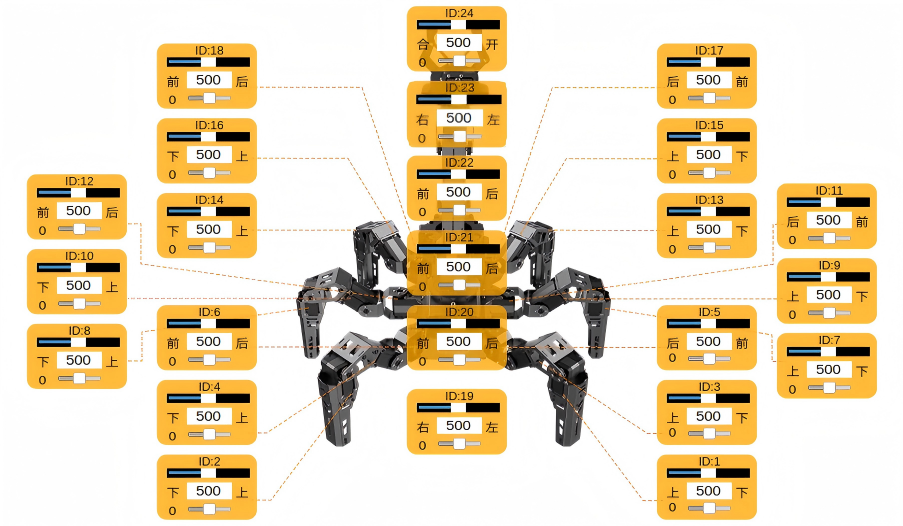

### 2.17.2 Brief Analysis of Inverse Kinematics Case

* **Experiment Introduction**

Based on inverse kinematics analysis, the solving steps are as follows:

1. Calculate the motion position of the leg according to the foot tip coordinates, and then solve for the corresponding servo rotation angles.
2. Calculate the corresponding numerical values based on the servo rotation angles to directly control the servo rotation for controlling the robot.

For a clearer understanding, the inverse kinematics of ROSpider will be analyzed here in conjunction with the control program.

* **Operation Steps**

> [!NOTE]
> **Commands are strictly case-sensitive, and the Tab key can be used to auto-complete keywords.**

1. Power on the robot and connect it to the remote control software NoMachine.
2. Click the icon  on the system desktop to open the command line terminal.
3. Enter the following command and press **Enter** to close the auto-start program.

```
~/.stop_ros.sh
```

4. Enter the command and press **Enter** to launch the feature.

```
ros2 launch example body_ik.launch.py
```

5. To close this application, simply press **Ctrl + C** in the terminal interface. If the feature does not close immediately, try pressing **Ctrl + C** a few more times.

* **Program Outcome**

Once the feature is launched, the robot's leg number 2 will retract and extend according to the set coordinates, and the servo rotation angles will be printed in the terminal.

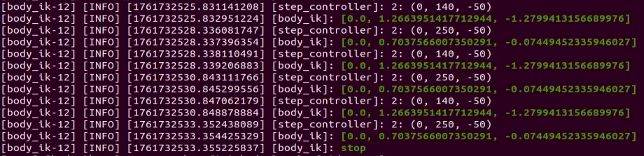

* **Program Analysis**

The source code for this program is located at: **/home/ubuntu/ros2_ws/src/example/example/body_control/include/body_ik.py**

```python
for i in range(3):
	joints = node.controller.set_leg_position(2, (0, 140, -50), 2)
	node.get_logger().info('\033[1;32m%s\033[0m' % str(joints))
	time.sleep(2.5)
	joints = node.controller.set_leg_position(2, (0, 250, -50), 2)
	node.get_logger().info('\033[1;32m%s\033[0m' % str(joints))

node.get_logger().info('\033[1;32m%s\033[0m' % 'stop')
```

The leg servo rotation is primarily controlled through the `set_leg_position` function.

Taking the code **joints = node.controller.set_leg_position(2, (0, 140, -50), 2)** as an example, the specific parameters are as follows:

The return parameter `joints` represents the returned servo rotation angles.

The input parameter `2` represents the robot's leg number, which is the middle leg on the left side.

The input parameter `(0, 140, -50)` represents the moving coordinate point, in the order of XYZ.

The input parameter `2` represents the time required for rotation, in seconds.

* **Coordinate Analysis**

From a first-person perspective of the robot, the robot center is the origin, the forward direction is the positive X-axis, the left side is the positive Y-axis, and the upward direction is the positive Z-axis, as shown in the following figure:


Analyzing the code "**joints = node.controller.set_leg_position(2, (0, 140, -50), 2)**, **(0, 140, -50)** is the coordinate position of leg 2 relative to the body center, in millimeters. Using these coordinates, the `set_leg_position` function calculates the required rotation angles for the three servos on leg 2 with IDs 11, 9, and 7. The calculation results are shown below:

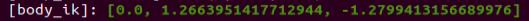

Since there is no change in the X-axis coordinate, servo 11 does not rotate.

In the initial posture, the Y-axis coordinate of the foot tip of leg 2 is around 193, so the Y-axis needs to decrease in the opposite direction to the 140 position.

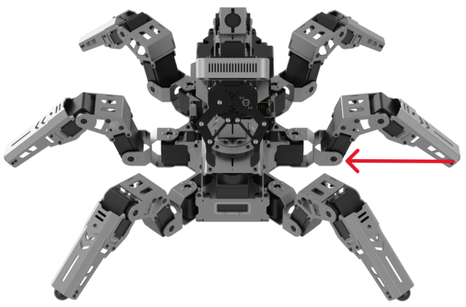

In the initial posture, the Z-axis coordinate of the foot tip of leg 2 is around -60, so the Z-axis needs to increase in the positive direction to the -50 position.

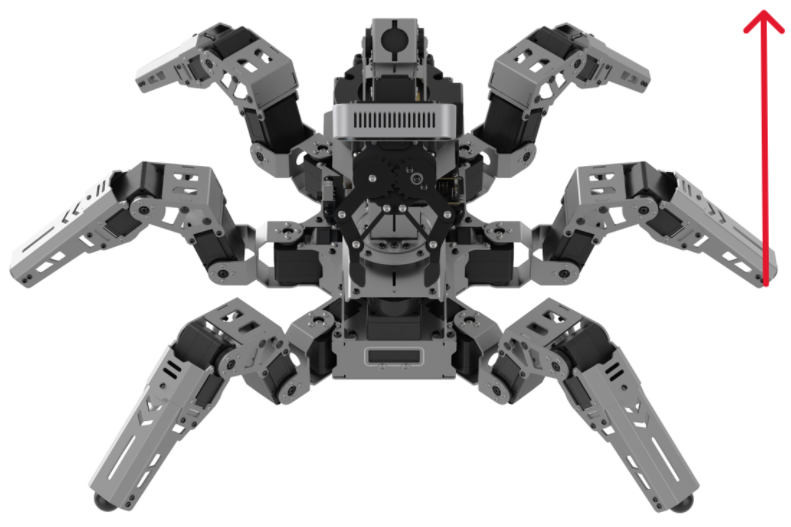

## 2.18 Static Posture Parameter Description

### 2.18.1 Experiment Introduction

The posture parameters of the ROSpider hexapod robot refer to the parameters when the robot is stationary, such as standing height, pitch angle, roll angle, etc.

By adjusting the coordinate values of the footholds of the 6 legs, the posture of the robot can be altered. When setting the posture, the **step_controller.py** file must be called.
The file path is: **/home/ubuntu/ros2_ws/src/driver/controller/controller/step_controller.py**

```python
def transform_pose_euler(self, translate, axis, euler, duration, degrees=True):
        """
        Change the robot's posture using translation transformation and Euler angles
        :param translate: Translation transformation of the body center offset (x, y, z)
        :param axis: The order of the three axes for Euler angles, such as 'xyz' or 'yzx'
        :param euler: Tuple of Euler angles, order must match the axis
        :param duration: Time taken to complete this transformation
        :param degrees: Whether Euler angles are in degrees. True for degrees, False for radians.
        """
        rotate = R.from_euler(axis, euler, degrees=degrees)  # use Euler angle to create transformer
        r = rotate.as_euler('xyz', degrees=False) # convert Euler angles to fixed order
        generator = PoseTransformer(PoseTransformerParams(translation=translate, rotation=r, duration=duration))

        if generator:
            with self.lock:
                generator.send(None)
                self.new_pose_transformer = generator
```

### 2.18.2 Parameter Description

By modifying the parameters, the static posture of ROSpider can be adjusted. The parameter adjustment location is shown below:

```
transform_pose_euler(self, translate, axis, euler, duration, degrees=True)
```

<table border="1">
<thead>
<tr>
<th style="background-color: ;">Parameter</th>
<th style="background-color: ;">Description</th>
</tr>
</thead>
<tbody>
<tr>
<td>translate</td>
<td>Translation transformation of the robot center offset (x, y, z), corresponding to the translation distance on each axis. Positive values indicate the positive direction, negative values indicate the opposite direction, measured in millimeters. If the set value is too large and exceeds the limit of the current posture, it cannot be executed.</td>
</tr>
<tr>
<td>axis</td>
<td>The order of the three axes for Euler angles. For instance, "xyz" means it will rotate around the X, Y, and Z axes in the specified order, respectively.</td>
</tr>
<tr>
<td>euler</td>
<td>Tuple of Euler angles, corresponding to the rotation angle of each axis. The setting order and length must match the former. Positive values indicate counterclockwise rotation, negative values indicate clockwise rotation.</td>
</tr>
<tr>
<td>duration</td>
<td>The time required to complete this transformation, in seconds.</td>
</tr>
<tr>
<td>degrees</td>
<td>Set whether the unit for Euler angles is degrees. True for degrees, False for radians.</td>
</tr>
</tbody>
</table>


Taking the example of translating the body forward by 20 mm along the X-axis, rotating clockwise by 15 degrees around the X-axis first, then counterclockwise by 15 degrees around the Y-axis, with a transformation time of 2 seconds, the parameters are set as follows:

```
transform_pose_euler((20,0,0), 'xyz', (-15,15,0), 2, degrees=True)
```

## 2.19 Walking Height Adjustment

### 2.19.1 Experiment Introduction

Based on the ripple gait, this section will demonstrate how to adjust the forward height of the ROSpider hexapod robot under the ripple gait by modifying the corresponding parameters.

### 2.19.2 Operation Steps

> [!NOTE]
> **Commands are strictly case-sensitive, and the Tab key can be used to auto-complete keywords.**

1. Power on the robot and connect it to the remote control software NoMachine.
2. Click the icon  on the system desktop to open the command line terminal.
3. Enter the following command and press **Enter** to close the auto-start program.

```
~/.stop_ros.sh
```

4. Enter the command and press **Enter** to launch the feature.

```
ros2 launch example height_adjustment.launch.py
```

5. To close this application, simply press **Ctrl + C** in the terminal interface. If the feature does not close immediately, try pressing **Ctrl + C** a few more times.

### 2.19.3 Program Outcome

ROSpider will raise and lower its body height while moving forward under the ripple gait.

### 2.19.4 Program Analysis

* **Launch File Analysis**

The program source code is located at: **/home/ubuntu/ros2_ws/src/example/example/body_control/height_adjustment.launch.py**

1. Import necessary libraries.

```python
import os
from ament_index_python.packages import get_package_share_directory

from launch_ros.actions import Node
from launch import LaunchDescription, LaunchService
from launch.actions import  OpaqueFunction, IncludeLaunchDescription
from launch.launch_description_sources import PythonLaunchDescriptionSource
```

2. Define the content to be launched, obtain the path of the `controller` package, and launch the `controller.launch` file. Create the ROS2 node `height_adjustment_node`, define the executable file, and finally, return the list of launch items.

```python
def launch_setup(context):
    compiled = os.environ['need_compile']
    if compiled == 'True':
        controller_package_path = get_package_share_directory('controller')
    else:
        controller_package_path = '/home/ubuntu/ros2_ws/src/driver/controller'
    
    controller_launch = IncludeLaunchDescription(
        PythonLaunchDescriptionSource(
            os.path.join(controller_package_path, 'launch/controller.launch.py')),
    )

    height_adjustment_node = Node(
        package='example',
        executable='height_adjustment',
        output='screen',
    )

    return [      
            controller_launch,
            height_adjustment_node,
            ]
```

3. The entry function of the `ROS 2 Launch` file defines the content to be launched.

```python
def generate_launch_description():
    return LaunchDescription([
        OpaqueFunction(function = launch_setup)
    ])
```

4. Create `LaunchService` and pass the launch content to it for execution.

```python
if __name__ == '__main__':
    # create a LaunchDescription object
    ld = generate_launch_description()

    ls = LaunchService()
    ls.include_launch_description(ld)
    ls.run()

```

* **Python Source Code Analysis**

The program source code is located at: **/home/ubuntu/ros2_ws/src/example/example/body_control/include/height_adjustment.py**

1. Instantiate gait control, initialize the robot's default posture, and gait parameters.

```python
def __init__(self):
	super().__init__('height_adjustment')
	self.step_controller = step_controller.StepController()
	self.client = self.create_client(Trigger, '/controller_manager/init_finish')
	self.client.wait_for_service()

	self.step_controller.set_build_in_pose('DEFAULT_POSE', 1)
	time.sleep(1)
	self.step_controller.set_step_mode(1, 40, 15, 0, 0, 0.8, repeat=0) # Move straight
```

2. The height is primarily adjusted by setting the parameters within the `transform_pose_euler` function.

```python
def transform(self):
	for _ in range(10):
		for i in range(20):
			self.step_controller.transform_pose_euler((0, 0, 3), 'xyz', (0,0,0), 0.1) # Raise body
			time.sleep(0.1)
		for i in range(20):
			self.step_controller.transform_pose_euler((0, 0, -3), 'xyz', (0,0,0), 0.1) # Lower body
			time.sleep(0.1)
```

(1) **(0, 0, 3)**: Translation transformation of the body center offset (x, y, z), in millimeters. Here, it represents raising the Z-axis by 3mm. X, Y value range: -50 to 50, in mm. Z value range: -30 to 90, in mm.

(2) '**xyz**': The order of the three axes for Euler angles.

(3) **(0,0,0)**: Tuple of Euler angles, order consistent with the former. Value range is -20 to 20, in degrees.

(4) **0.1**: The time required to complete the transformation, in seconds.

3. Reset to the robot's default posture.

```python
def reset(self):
	self.step_controller.set_build_in_pose('DEFAULT_POSE', 1)
	time.sleep(1)
```

### 2.19.5 Modifying Body Height

By default, the program raises or lowers by 60 millimeters in each cycle, divided into 20 executions, raising or lowering by 3 millimeters each time. Here, the transformation value for each execution is adjusted to 4 millimeters. Under the initial posture, the robot can descend by 30mm and ascend by 90mm.

> [!NOTE]
> **The number of executions multiplied by the height adjustment per execution must be less than 90mm. The default number of executions is 20, with an adjustment of 3mm per execution.**

1. Navigate to the source code path.

```
cd /home/ubuntu/ros2_ws/src/example/example/body_control/include
```

2. Enter the command to edit the code.

```
vim height_adjustment.py
```

3. Change the Z-axis transformation values to 4 and -4, then press the **ESC** key, type `:wq`, and press **Enter** to save and exit.

```python
for i in range(20):
	self.step_controller.transform_pose_euler((0, 0, 4), 'xyz', (0,0,0), 0.1) # Raise body
	time.sleep(0.1)
for i in range(20):
	self.step_controller.transform_pose_euler((0, 0, -4), 'xyz', (0,0,0), 0.1) # Lower body
	time.sleep(0.1)
```

## 2.20 Trunk Posture Adjustment

### 2.20.1 Experiment Introduction

This section will demonstrate how to adjust the trunk posture of the hexapod robot under the ripple gait by modifying the corresponding parameters.

### 2.20.2 Operation Steps

> [!NOTE]
> **Commands are strictly case-sensitive, and the Tab key can be used to auto-complete keywords.**

1. Power on the robot and connect it to the remote control software NoMachine.
2. Click the icon  on the system desktop to open the command line terminal.
3. Enter the following command and press **Enter** to close the auto-start program.

```
~/.stop_ros.sh
```

4. Enter the command and press **Enter** to launch the feature.

```
ros2 launch example posture_adjustment.launch.py
```

5. To close this application, simply press **Ctrl + C** in the terminal interface. If the feature does not close immediately, try pressing **Ctrl + C** a few more times.

### 2.20.3 Program Outcome

The body of ROSpider will perform two sets of actions. First part: rotate clockwise by 15 degrees around the X-axis, rotate counterclockwise by 15 degrees around the Y-axis to enter a posture tilted to the rear right, then rotate clockwise by 15 degrees around the Y-axis and counterclockwise by 15 degrees around the X-axis to restore the initial posture.

Second part: translate forward by 40 mm, then translate left by 40 mm to enter a posture leaning left, then translate backward by 40 mm and translate right by 40 mm to restore the initial posture.

### 2.20.4 Program Analysis

* **Launch File Analysis**

The program source code is located at: **/home/ubuntu/ros2_ws/src/example/example/body_control/posture_adjustment.launch.py**

1. Import necessary libraries.

```python
import os
from ament_index_python.packages import get_package_share_directory

from launch_ros.actions import Node
from launch import LaunchDescription, LaunchService
from launch.actions import  OpaqueFunction, IncludeLaunchDescription
from launch.launch_description_sources import PythonLaunchDescriptionSource
```

2. Define the content to be launched, obtain the path of the `controller` package, and launch the `controller.launch` file. Create the ROS2 node `posture_adjustment_node`, define the executable file, and finally, return the list of launch items.

```python
def launch_setup(context):
    compiled = os.environ['need_compile']
    if compiled == 'True':
        controller_package_path = get_package_share_directory('controller')
    else:
        controller_package_path = '/home/ubuntu/ros2_ws/src/driver/controller'
    
    controller_launch = IncludeLaunchDescription(
        PythonLaunchDescriptionSource(
            os.path.join(controller_package_path, 'launch/controller.launch.py')),
    )

    posture_adjustment_node = Node(
        package='example',
        executable='posture_adjustment',
        output='screen',
    )

    return [      
            controller_launch,
            posture_adjustment_node,
            ]
```

3. The entry function of the `ROS 2 Launch` file defines the content to be launched.

```python
def generate_launch_description():
    return LaunchDescription([
        OpaqueFunction(function = launch_setup)
    ])

```

4. Create `LaunchService` and pass the launch content to it for execution.

```python
if __name__ == '__main__':
    # create a LaunchDescription object
    ld = generate_launch_description()

    ls = LaunchService()
    ls.include_launch_description(ld)
    ls.run()
```

* **Python Source Code Analysis**

The program source code is located at: **/home/ubuntu/ros2_ws/src/example/example/body_control/include/posture_adjustment.py**

1. Instantiate gait control and initialize the robot's default posture.

```python
def __init__(self):
	super().__init__('posture_adjustment')
	self.step_controller = step_controller.StepController()
	self.client = self.create_client(Trigger, '/controller_manager/init_finish')
	self.client.wait_for_service()

	self.step_controller.set_build_in_pose('DEFAULT_POSE', 1)
	time.sleep(1)
```

2. The trunk posture is primarily adjusted by setting the parameters within the `transform_pose_euler` function.

```python
def transform(self):
	self.step_controller.transform_pose_euler((0, 0, 0), 'xyz', (-15, 0, 0), 1) # Rotate
	time.sleep(1)
	self.step_controller.transform_pose_euler((0, 0, 0), 'xyz', (0, 15, 0), 1) # Rotate
	time.sleep(1)
	self.step_controller.transform_pose_euler((0, 0, 0), 'yxz', (-15, 15, 0), 2) # Note Euler angle order
	time.sleep(2)
	self.step_controller.transform_pose_euler((40, 0, 0), 'xyz', (0, 0, 0), 1) # Translate, unit is mm
	time.sleep(1)
	self.step_controller.transform_pose_euler((0, 40, 0), 'xyz', (0, 0, 0), 1) # Translate, unit is mm
	time.sleep(1)
	self.step_controller.transform_pose_euler((-40, -40, 0), 'xyz', (0, 0, 0), 2) # Translate, unit is mm
	time.sleep(1)

```

(1) **(40, 0, 0)**: Translation transformation of the body center offset (x, y, z), in millimeters. Here, it represents moving 40mm in the positive direction on the X-axis. X, Y value range: -50 to 50, in mm. Z value range: -30 to 90, in mm.

(2) '**xyz**': The order of the three axes for Euler angles.

(3) **(-15,0,0)**: Tuple of Euler angles, order consistent with the former. Value range is -20 to 20, in degrees.

(4) **1**: The time required to complete the transformation, in seconds.

3. Reset to the robot's default posture.

```python
def reset(self):
	self.step_controller.set_build_in_pose('DEFAULT_POSE', 1)
	time.sleep(1)
```

### 2.20.5 Modifying Body Posture

After program execution, the Euler angle order of the first action is "xyz". The order will be modified to "yxz".

1. Navigate to the source code path.

```
cd /home/ubuntu/ros2_ws/src/example/example/body_control/include
```

2. Enter the command to edit the code.

```
vim posture_adjustment.py
```

3. Modify the Euler angle order of the first action to "yxz", then press the ESC key, type **:wq**, and press **Enter** to save and exit.

```python
def transform(self):
	self.step_controller.transform_pose_euler((0, 0, 0), 'yxz', (-15, 0, 0), 1) # Rotate
	time.sleep(1)
```

## 2.21 Body Twisting Experiment

### 2.21.1 Experiment Introduction

This section will demonstrate how to make ROSpider twist its body under the ripple gait by modifying the corresponding parameters.

### 2.21.2 Operation Steps

> [!NOTE]
> **Commands are strictly case-sensitive, and the Tab key can be used to auto-complete keywords.**

1. Power on the robot and connect it to the remote control software NoMachine.
2. Click the icon  on the system desktop to open the command line terminal.
3. Enter the following command and press **Enter** to close the auto-start program.

```
~/.stop_ros.sh
```

4. Enter the command and press **Enter** to launch the feature.

```
ros2 launch example body_wave.launch.py
```

5. To close this application, simply press **Ctrl + C** in the terminal interface. If the feature does not close immediately, try pressing **Ctrl + C** a few more times.

### 2.21.3 Program Outcome

The robot's body will continuously twist forward, backward, left, and right. Initially, the twist amplitude and speed will steadily increase. After a period, the twist amplitude and speed will begin to decrease continuously until restoring the initial posture.

### 2.21.4 Program Analysis

* **Launch File Analysis**

The program source code is located at: **/home/ubuntu/ros2_ws/src/example/example/body_control/body_wave.launch.py**

1. Import necessary libraries.

```python
import os
from ament_index_python.packages import get_package_share_directory

from launch_ros.actions import Node
from launch import LaunchDescription, LaunchService
from launch.actions import  OpaqueFunction, IncludeLaunchDescription
from launch.launch_description_sources import PythonLaunchDescriptionSource
```

2. Define the content to be launched, obtain the path of the `controller` package, and launch the `controller.launch` file. Create the ROS2 node `body_wave_node`, define the executable file, and finally, return the list of launch items.

```python
def launch_setup(context):
    compiled = os.environ['need_compile']
    if compiled == 'True':
        controller_package_path = get_package_share_directory('controller')
    else:
        controller_package_path = '/home/ubuntu/ros2_ws/src/driver/controller'
    
    controller_launch = IncludeLaunchDescription(
        PythonLaunchDescriptionSource(
            os.path.join(controller_package_path, 'launch/controller.launch.py')),
    )

    body_wave_node = Node(
        package='example',
        executable='body_wave',
        output='screen',
    )

    return [      
            controller_launch,
            body_wave_node,
            ]
```

3. The entry function of the `ROS 2 Launch` file defines the content to be launched.

```python
def generate_launch_description():
    return LaunchDescription([
        OpaqueFunction(function = launch_setup)
    ])
```

4. Create `LaunchService` and pass the launch content to it for execution.

```python
if __name__ == '__main__':
    # create a LaunchDescription object
    ld = generate_launch_description()

    ls = LaunchService()
    ls.include_launch_description(ld)
    ls.run()
```

* **Python Source Code Analysis**

The program source code is located at:

**/home/ubuntu/ros2_ws/src/example/example/body_control/include/body_wave.py**

1. Instantiate gait control and initialize the robot's default posture.

```python
def __init__(self):
	super().__init__('posture_adjustment')
	self.step_controller = step_controller.StepController()
	self.client = self.create_client(Trigger, '/controller_manager/init_finish')
	self.client.wait_for_service()

	self.step_controller.set_build_in_pose('DEFAULT_POSE', 1)
	time.sleep(1)

```

2. The posture is primarily adjusted by setting parameters within the `transform_euler` function. This function mainly uses translation transformation plus Euler angles to perform posture transformations, returning new foot tip coordinates.

```python
	def wave(self):
        """
        Body twist
        """
        duration = 0.03
        org_pose = tuple(build_in_pose.DEFAULT_POSE_M)
        time.sleep(0.8)
        # Gradually speed up and increase swing amplitude
        for j in range(7, 16, 2):
            i = 90 
            j = min(15, j)
            while i <= 360 + 85:
                if i == 90 and j == 7:
                    t = 0.5
                else:
                    t = duration
                i += 4 + j * 0.30
                x = math.sin(math.radians(i)) * (0.018 * (j + ((i - 90) / 360) * 2))
                y = math.cos(math.radians(i)) * (0.018 * (j + ((i - 90) / 360) * 2))
                pose = kinematics_calculate.transform_euler(org_pose, (0, 0, 0), 'xy', (x, y), degrees=False)
                self.step_controller.set_pose_base(pose, t)
                time.sleep(t)

        # Gradually slow down and decrease swing amplitude
        for j in range(15, 4, -3):
            i = 360 + 85
            while i >= 90:
                i += -(4 + j * 0.30)
                k = 360 + 90 - i + 90
                x = math.sin(math.radians(k)) * (0.018 * (j + (1 - (i - 90) / 360) * -3))
                y = math.cos(math.radians(k)) * (0.018 * (j + (1 - (i - 90) / 360) * -3))
                pose = kinematics_calculate.transform_euler(org_pose, (0, 0, 0), 'xy', (x, y), degrees=False)
                self.step_controller.set_pose_base(pose, duration)
                time.sleep(duration)
```

3. `transform_euler` function:
   (1) The first parameter `pose` is the posture to be transformed.
   (2) The second parameter `translate` is the translation transformation of the body center offset, in millimeters. The range depends on the actual posture situation of the robot. X, Y value range: -50 to 50, in mm. Z value range: -30 to 90, in mm.
   (3) The third parameter `axis` is the order of the three axes for Euler angles.
   (4) The fourth parameter `euler` is the tuple of Euler angles, corresponding to the rotation angle of each axis. The setting order and length must match the former. Positive values indicate counterclockwise rotation, negative values indicate clockwise rotation. Value range is -20 to 20, in degrees.
   (5) The fifth parameter `degrees` is used to set whether the unit for Euler angles is degrees. True for degrees, False for radians.
4. Reset to the robot's default posture.

```python
def reset(self):
	self.step_controller.set_build_in_pose('DEFAULT_POSE', 1)
	time.sleep(1)
```

### 2.21.5 Modifying Twist Amplitude

After execution, the robot's front half twist amplitude changes significantly. To make the twist amplitude increase more gently:

1. Navigate to the source code path.

```
cd /home/ubuntu/ros2_ws/src/example/example/body_control/include
```

2. Enter the command to edit the code.

```
vim body_wave.py
```

3. Modify the increment coefficient of variable `i`, changing 0.3 to 0.2, then press the **ESC** key, type `:wq`, and press **Enter** to save and exit.

```python
 	# Gradually speed up and increase swing amplitude
        for j in range(7, 16, 2):
            i = 90 
            j = min(15, j)
            while i <= 360 + 85:
                if i == 90 and j == 7:
                    t = 0.5
                else:
                    t = duration
                i += 4 + j * 0.20
```

## 2.22 Body Center of Mass Dance Experiment

### 2.22.1 Experiment Introduction

This section will demonstrate how to make ROSpider dance in place by drawing a circle with its body, achieved by modifying corresponding parameters.

### 2.22.2 Operation Steps

> [!NOTE]
> **Commands are strictly case-sensitive, and the Tab key can be used to auto-complete keywords.**

1. Power on the robot and connect it to the remote control software NoMachine.
2. Click the icon  on the system desktop to open the command line terminal.
3. Enter the following command and press **Enter** to close the auto-start program.

```
~/.stop_ros.sh
```

4. Enter the command and press **Enter** to launch the feature.

```
ros2 launch example body_circle.launch.py 
```

5. To close this application, simply press **Ctrl + C** in the terminal interface. If the feature does not close immediately, try pressing **Ctrl + C** a few more times.

### 2.22.3 Program Outcome

The body of ROSpider will use its center as the focal point to dance and trace out a circle, and the size of the drawn circle will gradually increase.

### 2.22.4 Program Analysis

* **Launch File Analysis**

The program source code is located at: **/home/ubuntu/ros2_ws/src/example/example/body_control/body_circle.launch.py**

1. Import necessary libraries.

```python
import os
from ament_index_python.packages import get_package_share_directory

from launch_ros.actions import Node
from launch import LaunchDescription, LaunchService
from launch.actions import  OpaqueFunction, IncludeLaunchDescription
from launch.launch_description_sources import PythonLaunchDescriptionSource
```

2. Define the content to be launched, obtain the path of the `controller` package, and launch the `controller.launch` file. Create the ROS2 node `body_circle_node`, define the executable file, and finally, return the list of launch items.

```python
def launch_setup(context):
    compiled = os.environ['need_compile']
    if compiled == 'True':
        controller_package_path = get_package_share_directory('controller')
    else:
        controller_package_path = '/home/ubuntu/ros2_ws/src/driver/controller'
    
    controller_launch = IncludeLaunchDescription(
        PythonLaunchDescriptionSource(
            os.path.join(controller_package_path, 'launch/controller.launch.py')),
    )

    body_circle_node = Node(
        package='example',
        executable='body_circle',
        output='screen',
    )

    return [      
            controller_launch,
            body_circle_node,
            ]

```

3. The entry function of the `ROS 2 Launch` file defines the content to be launched.

```python
def generate_launch_description():
    return LaunchDescription([
        OpaqueFunction(function = launch_setup)
    ])
```

4. Create `LaunchService` and pass the launch content to it for execution.

```python
if __name__ == '__main__':
    # create a LaunchDescription object
    ld = generate_launch_description()

    ls = LaunchService()
    ls.include_launch_description(ld)
    ls.run()
```

* **Python Source Code Analysis**

The program source code is located at: **/home/ubuntu/ros2_ws/src/example/example/body_control/include/body_circle.py**

1. Instantiate gait control and initialize the robot's default posture.

```python
def __init__(self):
	super().__init__('posture_adjustment')
	self.step_controller = step_controller.StepController()
	self.client = self.create_client(Trigger, '/controller_manager/init_finish')
	self.client.wait_for_service()

	self.step_controller.set_build_in_pose('DEFAULT_POSE', 1)
	time.sleep(1)
```

2. The posture is primarily adjusted by setting parameters within the `transform_euler` function. This function mainly uses translation transformation plus Euler angles to perform posture transformations, returning new foot tip coordinates.

```python
	def gen_circle(self, r):
        points = []
        for i in range(180, 0, -5):
            x = r * math.cos(math.radians(i))
            y = r * math.sin(math.radians(i))
            points.append((x, y))

        for i in range(360, 180, -5):
            x = r * math.cos(math.radians(i))
            y = r * math.sin(math.radians(i))
            points.append((x, y))
        return points


    def wave(self):
        """
        Body twist
        """
        self.step_controller.set_pose_base(build_in_pose.DEFAULT_POSE_M, 0.8)
        org_pose = tuple(build_in_pose.DEFAULT_POSE_M)
        time.sleep(0.8)
        for i in range(10, 40, +3):
            points = self.gen_circle(i)
            for x, y in points:
                pose = kinematics_calculate.transform_euler(org_pose, (x, y, 0), 'xyz', (0, 0, 0), degrees=False)
                self.step_controller.set_pose_base(pose, 0.02)
                time.sleep(0.02)

```

3. `transform_euler` function:
   (1) The first parameter `pose` is the posture to be transformed.
   (2) The second parameter `translate` is the translation transformation of the body center offset, in millimeters. The range depends on the actual posture situation of the robot. X, Y value range: -50 to 50, in mm. Z value range: -30 to 90, in mm.
   (3) The third parameter `axis` is the order of the three axes for Euler angles.
   (4) The fourth parameter `euler` is the tuple of Euler angles, corresponding to the rotation angle of each axis. The setting order and length must match the former. Positive values indicate counterclockwise rotation, negative values indicate clockwise rotation. Value range is -20 to 20, in degrees.
   (5) The fifth parameter `degrees` is used to set whether the unit for Euler angles is degrees. True for degrees, False for radians.
4. Reset to the robot's default posture.

```python
def reset(self):
	self.step_controller.set_build_in_pose('DEFAULT_POSE', 1)
	time.sleep(1)
```

### 2.22.5 Modifying Dance Amplitude

The program's default dance circle size ranges from **10~50**. This will be modified to **10~30**.

1. Navigate to the source code path.

```
cd /home/ubuntu/ros2_ws/src/example/example/body_control/include
```

2. Enter the command to edit the code.

```
vim body_circle.py
```

3. Modify the maximum range of the loop, changing 40 to 30, then press the **ESC** key, type `:wq`, and press **Enter** to save and exit.

```python
def wave(self):
        """
        Body twist
        """
        self.step_controller.set_pose_base(build_in_pose.DEFAULT_POSE_M, 0.8)
        org_pose = tuple(build_in_pose.DEFAULT_POSE_M)
        time.sleep(0.8)
        for i in range(10, 30, +3):
            points = self.gen_circle(i)
```

## 2.23 Robot Posture Self-Balancing

### 2.23.1 Experiment Introduction

First, the posture parameters of ROSpider must be initialized, setting it to an initial neutral posture to determine the robot's posture prior to detection.

Then, by subscribing to the topic messages published by the QMI8658 sensor node, real-time posture parameters of ROSpider are obtained and recorded.

Finally, based on changes in the posture parameters, the pitch and roll angles of ROSpider are reconfigured. Through inverse kinematic calculations, the servo rotation angles are obtained, and the servos are commanded to rotate to the specified angles, thereby completing ROSpider's self-balancing function.

### 2.23.2 Operation Steps

> [!NOTE]
> **Commands are strictly case-sensitive, and the Tab key can be used to auto-complete keywords.**

1. Power on the robot and connect it to the remote control software NoMachine.
2. Click the icon  on the system desktop to open the command line terminal.
3. Enter the following command and press **Enter** to close the auto-start program.

```
~/.stop_ros.sh
```

4. Enter the command and press **Enter** to launch the feature.

```
ros2 launch app self_balancing_node.launch.py debug:=true
```

5. To close this application, simply press **Ctrl + C** in the terminal interface. If the feature does not close immediately, try pressing **Ctrl + C** a few more times.

### 2.23.3 Program Outcome

The body of ROSpider will autonomously adjust its posture according to the incline of the surface, ensuring the horizontal stability of the body.

### 2.23.4 Program Analysis

* **Launch File Analysis**

The program source code is located at: **/home/ubuntu/ros2_ws/src/app/launch/self_balancing_node.launch.py**

1. Import necessary libraries.

```python
import os
from ament_index_python.packages import get_package_share_directory

from launch_ros.actions import Node
from launch.conditions import IfCondition
from launch import LaunchDescription, LaunchService
from launch.substitutions import LaunchConfiguration
from launch.launch_description_sources import PythonLaunchDescriptionSource
from launch.actions import IncludeLaunchDescription, OpaqueFunction, GroupAction, DeclareLaunchArgument
```

2. Define the content to be launched, obtain the path of the `controller` package, and launch the `controller.launch` file. Create the ROS2 node `self_balancing_node`, define the executable file, and finally, return the list of launch items.

```python
def launch_setup(context):
    compiled = os.environ['need_compile']
    debug = LaunchConfiguration('debug', default='false')
    debug_arg = DeclareLaunchArgument('debug', default_value=debug)

    if compiled == 'True':
        controller_package_path = get_package_share_directory('controller')
    else:
        controller_package_path = '/home/ubuntu/ros2_ws/src/driver/controller'

    self_balancing_node = GroupAction([

        IncludeLaunchDescription(
            PythonLaunchDescriptionSource(
                os.path.join(controller_package_path, 'launch/controller.launch.py')),
            condition=IfCondition(debug),
            ),

        Node(
            package='app',
            executable='self_balancing',
            output='screen',
            parameters=[{'debug': debug}],
            ),
    ])

    return [debug_arg,
            self_balancing_node,
            ]
```

3. The entry function of the `ROS 2 Launch` file defines the content to be launched.

```python
def generate_launch_description():
    return LaunchDescription([
        OpaqueFunction(function = launch_setup)
    ])
```

4. Create `LaunchService` and pass the launch content to it for execution.

```python
if __name__ == '__main__':
    # create a LaunchDescription object
    ld = generate_launch_description()

    ls = LaunchService()
    ls.include_launch_description(ld)
    ls.run()
```

* **Python Source Code Analysis**

The program source code is located at: **/home/ubuntu/ros2_ws/src/app/app/self_balancing_node.py**

1. Retrieve and process data from the IMU, and convert the IMU's quaternion posture into Euler angles.

```python
try:
	imu = self.imu_queue.get(block=True, timeout=1)
	q = imu.orientation
	r = R.from_quat((q.x, q.y, q.z, q.w))
	x, y, z = r.as_euler('xyz')
except queue.Empty:
	if not self.running:
		break
	else:
		continue
```

2. The posture is primarily adjusted by setting parameters within the `transform_euler` function. This function mainly uses translation transformation plus Euler angles to perform posture transformations, returning new foot tip coordinates.

```python
try:
	self.pid_pitch.update(y)
	self.pid_roll.update(x)
	new_pose = kinematics_calculate.transform_euler(build_in_pose.DEFAULT_POSE, (0, 0, 0), 'xyz',(self.pid_pitch.output*10,self.pid_roll.output*10, 0), degrees=False)
	self.step_controller.set_pose_base(new_pose, 0.02)
except Exception as e:
	self.get_logger().error(str(e))
	self.pitch = 0
	self.roll = 0
```

3. `transform_euler` function:
   (1) The first parameter `pose` is the posture to be transformed.
   (2) The second parameter `translate` is the translation transformation of the body center offset, in millimeters. The range depends on the actual posture situation of the robot. X, Y value range: -50 to 50, in mm. Z value range: -30 to 90, in mm.
   (3) The third parameter `axis` is the order of the three axes for Euler angles.
   (4) The fourth parameter `euler` is the tuple of Euler angles, corresponding to the rotation angle of each axis. The setting order and length must match the former. Positive values indicate counterclockwise rotation, negative values indicate clockwise rotation. Value range is -20 to 20, in degrees.
   (5) The fifth parameter `degrees` is used to set whether the unit for Euler angles is degrees. True for degrees, False for radians.
