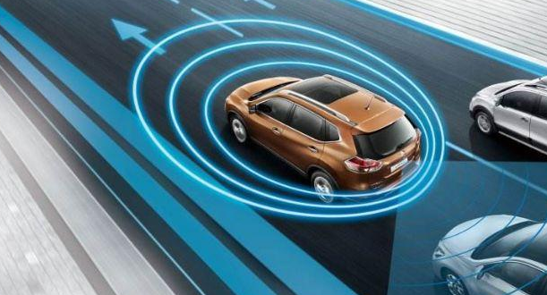
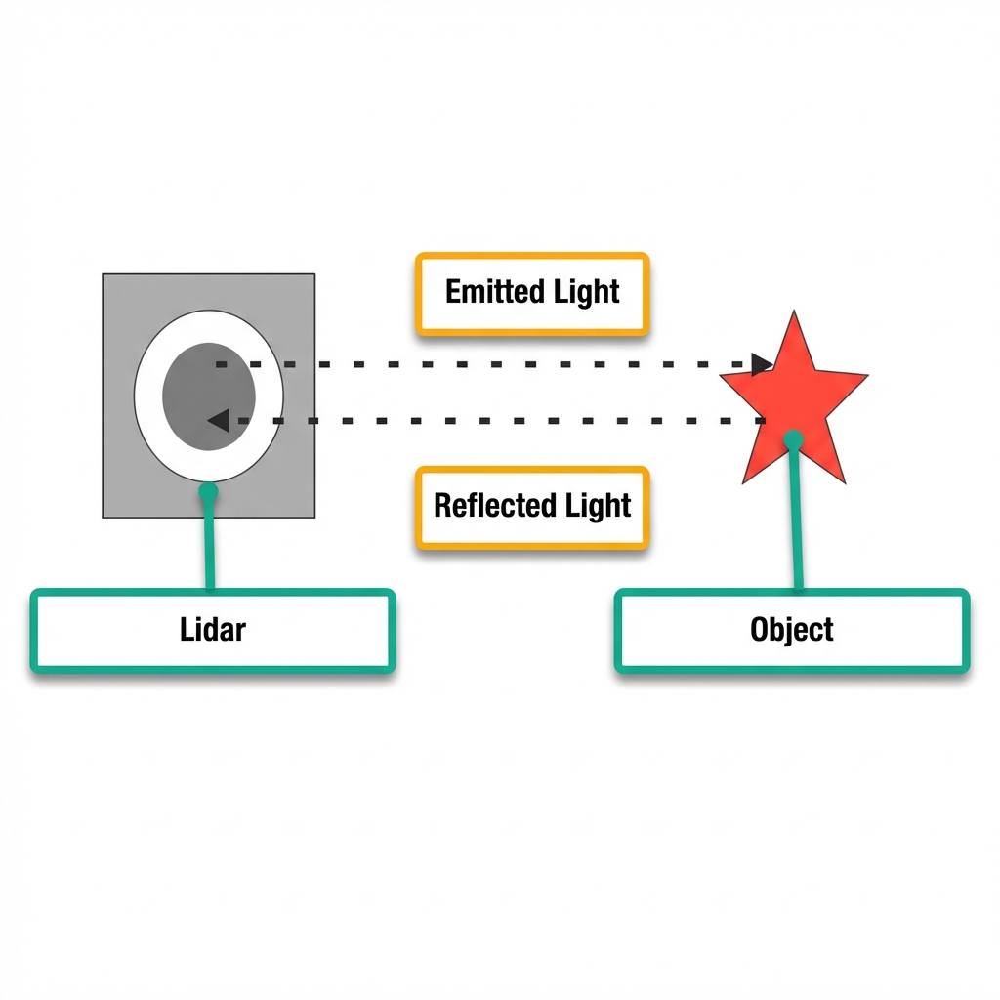
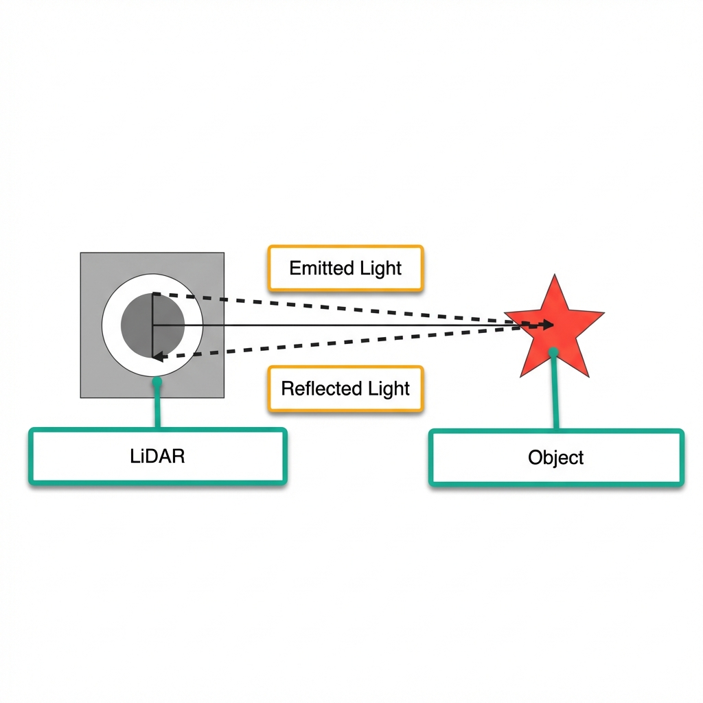
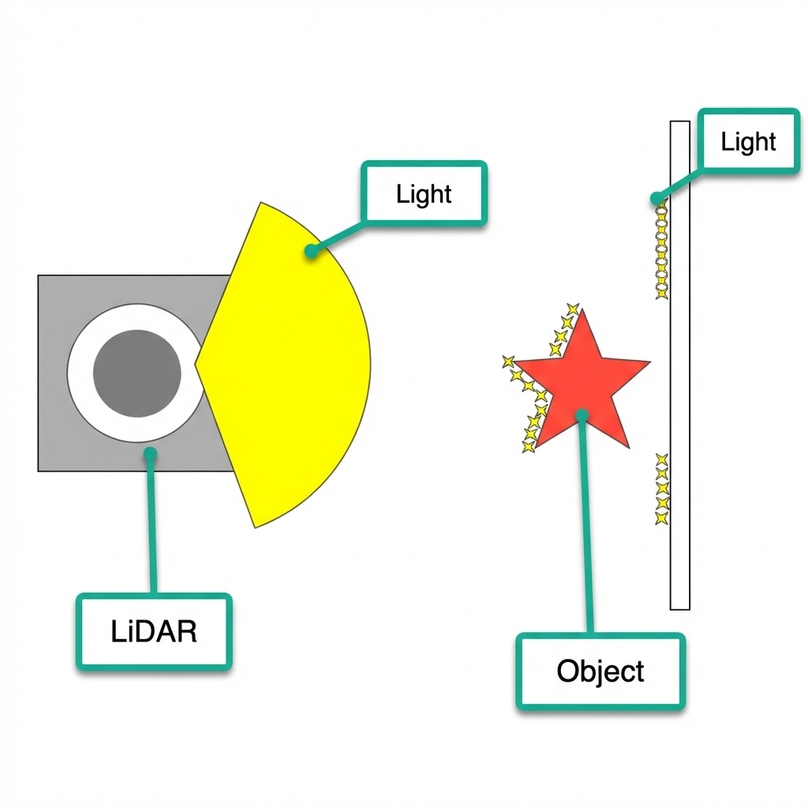
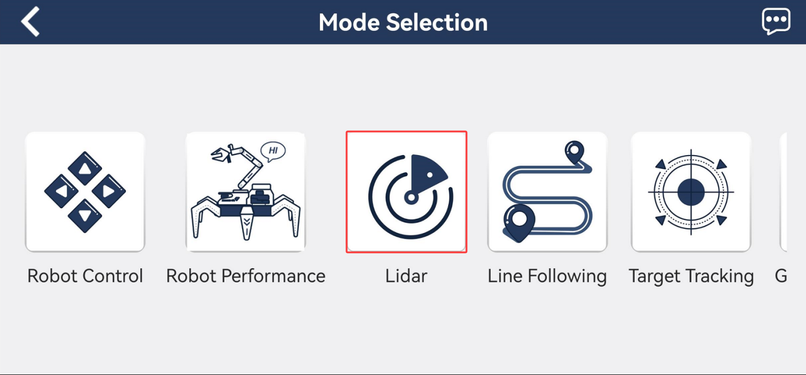
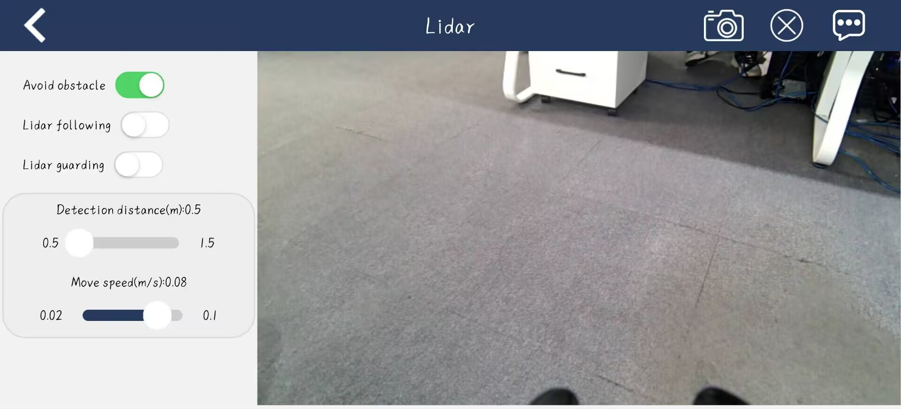
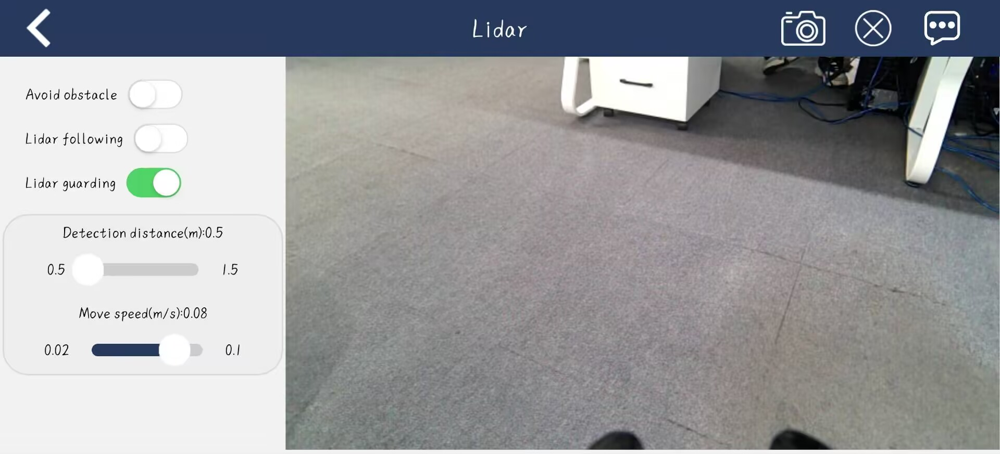

# 3. LiDAR Course

## 3.1 Introduction to LiDAR

### 3.1.1 Preface

As a high-precision, high-speed remote sensing technology, LiDAR plays an important role in mapping, autonomous driving, environmental perception, and robot navigation. This document introduces the principles, components, working mechanisms, application areas, and advantages of LiDAR, as well as its development trends.

LiDAR plays a critical role in autonomous driving and intelligent transportation by detecting obstacles, pedestrians, and vehicles on the road in real-time, providing precise distance and position information. In terms of robot navigation and environmental perception, LiDAR provides robots with accurate maps and surrounding environment information. Additionally, LiDAR is widely used in 3D modeling, map making, safety monitoring, and remote sensing mapping.



### 3.1.2 LiDAR Components and Classification

A LiDAR system consists of components such as a laser emitter, a receiver and photodetector, a scanning mechanism, and an angle resolution unit. The laser emitter generates the laser beam, the receiver and photodetector receive the reflected optical signals, the scanning mechanism scans the surrounding environment, and the angle resolution unit determines the position of the target object.
Based on the scanning method, LiDAR can be functionally divided into the following categories:

* **Rotating LiDAR**: By rotating the emitter or scanning mechanism, rotating LiDAR performs a full-range omnidirectional scan of the laser beam in the horizontal direction. They typically feature high scanning speeds and measurement precision, and are widely used in autonomous driving, 3D environmental modeling, and map-making.
* **Solid-State LiDAR**: Solid-state LiDAR uses solid-state laser emitters and requires no rotating parts. It is generally more compact, lightweight, and has lower power consumption. Solid-state LiDAR is suitable for application scenarios involving mobile devices, drones, and robots.
* **Mechanical LiDAR**: Mechanical LiDAR utilizes mechanical parts, such as rotating mirrors or rotating prisms, to achieve laser beam scanning. They usually offer long measurement distances and high measurement accuracy, but with slower scanning speeds. Mechanical LiDAR is widely used in topographic surveying, building scanning, and navigation.
* **Phase-Modulated LiDAR**: Phase-modulated LiDAR measures the distance between the target object and the radar by altering the phase of the laser beam. They typically possess high measurement accuracy and a large measurement range, making them widely used in map making, surveying, and industrial applications.
* **Flash LiDAR**: Flash LiDAR uses a single, brief, high-power laser pulse to illuminate the entire scene at once, and then captures the reflected optical signals through a receiver array. Featuring high speed and high resolution, it is suitable for applications like rapid scene capture and motion tracking.

## 3.2 LiDAR Working Principles and Ranging Methods

### 3.2.1 LiDAR Ranging

There are two common methods for LiDAR to determine the distance to a target: Triangulation and Time-of-Flight (ToF) ranging.

ToF ranging can be understood by referring to the diagram below. The LiDAR first shines light onto the object, which then reflects the light directly back to the LiDAR. The LiDAR calculates the time it takes for the light to return, multiplies this time by the speed of light, and divides the result by two to determine the distance between the object and the LiDAR.



Triangulation can be understood by referring to the diagram below. During manufacturing, the LiDAR is adjusted so that the light does not shine directly onto the object, but rather at a specific angle. This angle is preset and remains constant during operation. By substituting this angle into trigonometric functions, the distance from the object to the LiDAR can be calculated.



### 3.2.2 LiDAR Effects

Refer to the diagram below to understand the effect of LiDAR. The LiDAR emits light that illuminates the surface of an object. When the LiDAR receives the light reflected from the object, the outline of the object is marked at the illuminated position.



## 3.3 LiDAR Obstacle Avoidance

To understand the connection method for the app, please refer to **[1. ROSpider User Manual\1.3.3 App Installation and Connection](https://wiki.hiwonder.com/projects/ROSpider/en/jetson-orin-nano-version/docs/1_ROSpider_User_Manual.html#app-installation-and-connection)** for the relevant course.

### 3.3.1 Activation via App

1. Open the app **WonderNex** and connect to ROSpider.
2. In the mode selection interface, tap **Lidar** to enter the operation interface for this feature.



3. Tap the switch button on the right side of **Avoid obstacle** to activate this feature.



### 3.3.2 Activation via Commands

1. Start the robot and connect it to the remote control software NoMachine. For details on connecting to the remote desktop, refer to **[1. ROSpider User Manual\1.4 Development Environment Setup](https://wiki.hiwonder.com/projects/ROSpider/en/jetson-orin-nano-version/docs/1_ROSpider_User_Manual.html#development-environment-setup)**.
2. Click the icon  on the system desktop to open the command line terminal.
3. Enter the command to stop the auto-start service and press **Enter**.

```bash
~/.stop_ros.sh
```

4. Next, enter the command and press **Enter** to launch the LiDAR feature:

```bash
ros2 launch app lidar_node.launch.py debug:=true
```

5. Open a new command line terminal, enter the command, and press **Enter** to access the LiDAR feature:

```bash
ros2 service call /lidar_app/enter std_srvs/srv/Trigger {}
```

6. Then, in the current command line terminal, enter the command and press **Enter** to activate the LiDAR obstacle avoidance feature:

```bash
ros2 service call /lidar_app/set_running interfaces/srv/SetInt64 "{data: 1}"
```

7. To stop the current function, enter the command in the current command line terminal and press **Enter** to execute.

```bash
ros2 service call /lidar_app/set_running interfaces/srv/SetInt64 "{data: 0}"
```

8. To exit the feature, press **Ctrl + C** directly in the terminal interface from step 4.

### 3.3.2 Program Outcome

During the use of the LiDAR obstacle avoidance function, the object to be detected must be higher than the horizontal scanning height of the LiDAR. This ensures that the LiDAR mounted on the robot can effectively scan its position information. As the hexapod robot walks forward and detects an obstacle, it will automatically turn to avoid it.

## 3.4 LiDAR Following

To understand the connection method for the app, please refer to **[1. ROSpider User Manual\1.3.3 App Installation and Connection](https://wiki.hiwonder.com/projects/ROSpider/en/jetson-orin-nano-version/docs/1_ROSpider_User_Manual.html#app-installation-and-connection)** for the relevant course.

### 3.4.1 Activation via APP

1. Open the app **WonderNex** and connect to ROSpider.
2. In the mode selection interface, tap **Lidar** to enter the operation interface for this feature.


3. Tap the switch button on the right side of **Lidar following** to activate this feature.



### 3.4.2 Activation via Commands

1. Start the robot and connect it to the remote control software NoMachine. For details on connecting to the remote desktop, refer to **[1. ROSpider User Manual\1.4 Development Environment Setup](https://wiki.hiwonder.com/projects/ROSpider/en/jetson-orin-nano-version/docs/1_ROSpider_User_Manual.html#development-environment-setup)**.
2. Click the icon  on the system desktop to open the command line terminal.
3. Enter the command to stop the auto-start service and press **Enter**.

```bash
~/.stop_ros.sh
```

4. Next, enter the command and press **Enter** to launch the LiDAR feature:

```bash
ros2 launch app lidar_node.launch.py debug:=true
```

5. Open a new command line terminal, enter the command, and press **Enter** to access the LiDAR feature:

```bash
ros2 service call /lidar_app/enter std_srvs/srv/Trigger {}
```

6. Then, in the current command line terminal, enter the command and press **Enter** to activate the LiDAR following feature:

```bash
ros2 service call /lidar_app/set_running interfaces/srv/SetInt64 "{data: 2}"
```

7. To stop the current function, enter the command in the current command line terminal and press **Enter** to execute.

```bash
ros2 service call /lidar_app/set_running interfaces/srv/SetInt64 "{data: 0}"
```

8. To exit the feature, press **Ctrl + C** directly in the terminal interface from step 4.

### 3.4.2 Program Outcome

During the use of the LiDAR following feature, the object to be detected must be higher than the horizontal scanning height of the LiDAR. This ensures that the LiDAR mounted on the robot can effectively scan its position information. The robot will then adjust its own position so that the distance between the body and the obstacle is constantly maintained at a certain range.

## 3.5 LiDAR Guarding

To understand the connection method for the app, please refer to **[1. ROSpider User Manual\1.3.3 App Installation and Connection](https://wiki.hiwonder.com/projects/ROSpider/en/jetson-orin-nano-version/docs/1_ROSpider_User_Manual.html#app-installation-and-connection)** for the relevant course.

### 3.5.1 Activation via APP

1. Open the app **WonderNex** and connect to ROSpider.
2. In the mode selection interface, tap **Lidar** to enter the operation interface for this feature.


3. Tap the switch button on the right side of **Lidar guarding** to activate this feature.


### 3.5.2 Activation via Commands

1. Start the robot and connect it to the remote control software NoMachine. For details on connecting to the remote desktop, refer to **[1. ROSpider User Manual\1.4 Development Environment Setup](https://wiki.hiwonder.com/projects/ROSpider/en/jetson-orin-nano-version/docs/1_ROSpider_User_Manual.html#development-environment-setup)**.
2. Click the icon  on the system desktop to open the command line terminal.
3. Enter the command to stop the auto-start service and press **Enter**.

```bash
~/.stop_ros.sh
```

4. Next, enter the command and press **Enter** to launch the LiDAR feature:

```bash
ros2 launch app lidar_node.launch.py debug:=true
```

5. Open a new command line terminal, enter the command, and press **Enter** to access the LiDAR feature:

```bash
ros2 service call /lidar_app/enter std_srvs/srv/Trigger {}
```

6. Then, in the current command line terminal, enter the command and press **Enter** to activate the LiDAR guarding feature:

```bash
ros2 service call /lidar_app/set_running interfaces/srv/SetInt64 "{data: 3}"
```

7. To stop the current function, enter the command in the current command line terminal and press **Enter** to execute.

```bash
ros2 service call /lidar_app/set_running interfaces/srv/SetInt64 "{data: 0}"
```

8. To exit the feature, press **Ctrl + C** directly in the terminal interface from step 4.

### 3.5.2 Program Outcome

During the use of the LiDAR guarding feature, the object to be detected must be higher than the horizontal scanning height of the LiDAR. This ensures that the LiDAR mounted on the robot can effectively scan its position information. The robot will then adjust the orientation of its body to face the obstacle, aligning the camera directly toward the obstacle.
