# 5. Mapping and Navigation Course

## 5.1 Mapping Tutorial

### 5.1.1 Principles of SLAM Map Construction

* **Introduction to SLAM**

Taking human navigation as an example, before heading to a destination, the current location must be known, regardless of whether a map is available. While humans use their eyes, robots achieve this through **LiDAR**. SLAM, Simultaneous Localization and Mapping, refers to real-time positioning and map building.

Localization is the determination of the robot's pose within a coordinate system. The origin and posture of the coordinate system can be obtained from the first keyframe, an existing global map, landmark points, or GPS.

Mapping refers to creating a map of the surrounding environment perceived by the robot, with points serving as the basic geometric elements of the map. The primary functions of the map are localization and navigation. Navigation can be divided into path planning and movement execution. Planning includes global and local planning, while execution involves controlling the robot's movement after planning is complete.

* **Principles of SLAM Mapping**

SLAM mapping mainly involves the following three processes:

1. Preprocessing: Optimizing the raw point cloud data from the LiDAR, removing problematic data, or applying filtering.

Using a laser as the signal source, pulsed lasers emitted by the laser device hit surrounding obstacles, causing scattering.

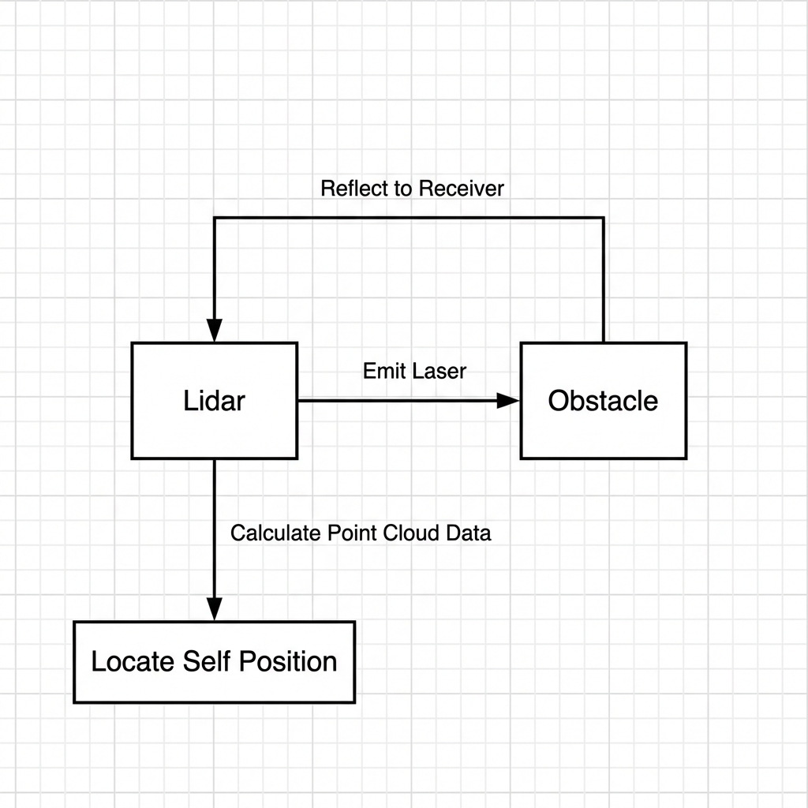

A portion of the light waves will reflect back to the LiDAR receiver, and based on the principles of laser distance measurement, the distance from the LiDAR to the target point can be calculated.

Regarding point clouds: Generally speaking, the environmental information acquired by LiDAR is called a point cloud. It reflects a portion of what the robot's "eyes" can see in its environment. The collected object information is presented as a series of scattered data points with accurate angles and distances.

2. Matching: Finding the corresponding position of the current local environment's point cloud data on the established map to perform matching.

Typically, laser SLAM systems calculate the change in relative movement distance and posture of the LiDAR by matching and comparing two point clouds from different times, thereby completing the robot's self-localization.

3. Map Fusion: Splicing the new round of data from the LiDAR into the original map, ultimately completing the map update.

* **Precautions for Map Construction**

1. When initiating the mapping process, it is recommended that the robot faces a straight wall, or a closed cardboard box is used as a substitute, allowing the LiDAR to scan as many points as possible.
2. Ensure the completeness of the map as much as possible. In the paths the robot might traverse, all surrounding 360° areas need to be explored by the LiDAR to increase the map's completeness.
3. When mapping in large environments, it is optimal to allow the robot to complete a mapping loop closure first, before proceeding to scan the minor details of the environment thoroughly.

* **Evaluating Map Construction Results**

Finally, after the map construction is completed, the following criteria can be used to determine whether the results meet navigation requirements:

1. Whether the edges of obstacles in the map are distinct.
2. Whether there are areas in the map that are inconsistent with the actual environment, e.g., presence or absence of loop closures.
3. Whether there are gray areas within the robot's action area on the map, e.g., unscanned areas.
4. Whether there are obstacles in the map that will not exist during subsequent localization, e.g., dynamic obstacles.
5. Whether it can be guaranteed that any position within the robot's active area has been fully explored within a 360-degree field of view.

### 5.1.2 slam_toolbox Mapping Algorithm

* **Algorithm Concepts**

The Slam Toolbox software package combines information from the laser rangefinder based on the format of LaserScan messages, and performs TF transformation from the `odom-> base` link, thereby creating a two-dimensional spatial map. This package allows the data and pose graph of the fully serialized, reloaded SLAM map to be used for continuous mapping, localization, merging, or other operations. It allows the SLAM Toolbox to run in both synchronous and asynchronous modes. The synchronous mode processes all valid sensor measurements regardless of lag, while the asynchronous mode processes them whenever possible.

In ROS2, it replaces packages like `gmapping`, `cartographer`, `karto`, and `hector`, offering fully featured SLAM. This functionality is built upon the powerful scan matcher of the Karto core, which has been extensively utilized and accelerated for this package. A new optimization plugin based on Google Ceres has also been introduced. Additionally, a new localization method called **elastic pose-graph localization** is introduced, which takes a sliding window of measurements and adds it to the graph for optimization and refinement. This allows for the tracking of changed local features in the environment rather than treating them as deviations. When leaving a certain area without affecting the long-term map, these redundant nodes are deleted.

Slam Toolbox is a suite of tools for 2D SLAM. Main features include:

1. Mapping and saving map pgm files.
2. Refining maps, re-mapping, or continuing to map on saved maps.
3. Long-term mapping: Loading saved maps to continue mapping while deleting irrelevant information from new LiDAR point clouds.
4. Optimizing localization mode on existing maps. It is also possible to use the **LiDAR Odometry** mode to run localization mode without mapping.
5. Synchronous and asynchronous mapping.
6. Dynamic map merging.
7. Plugin-based optimization solvers, featuring a new optimization plugin based on Google Ceres.
8. Interactive RVIZ plugin.
9. Providing RVIZ graphical manipulation tools for operating nodes and connections during mapping.
10. Map serialization and lossless data storage.

* **KARTO**

Karto_SLAM is based on the concept of graph optimization, using highly optimized and non-iterative Cholesky decomposition for sparse system decoupling as the solution. Graph optimization methods use the mean of the graph to represent the map. Each node represents a position point of the robot's trajectory and the sensor measurement data set. With the addition of each new node, calculations and updates are performed.

In the ROS version of Karto_SLAM, the Sparse Pose Adjustment (SPA) adopted is related to scan matching and loop closure detection. The more landmarks there are, the greater the memory requirement. However, compared to other methods, the graph optimization approach has a greater advantage in mapping large environments because it only contains a graph of points, which represent the robot's pose, solving for the pose before solving for the map.

The algorithmic program framework of Karto SLAM is shown in the figure below:

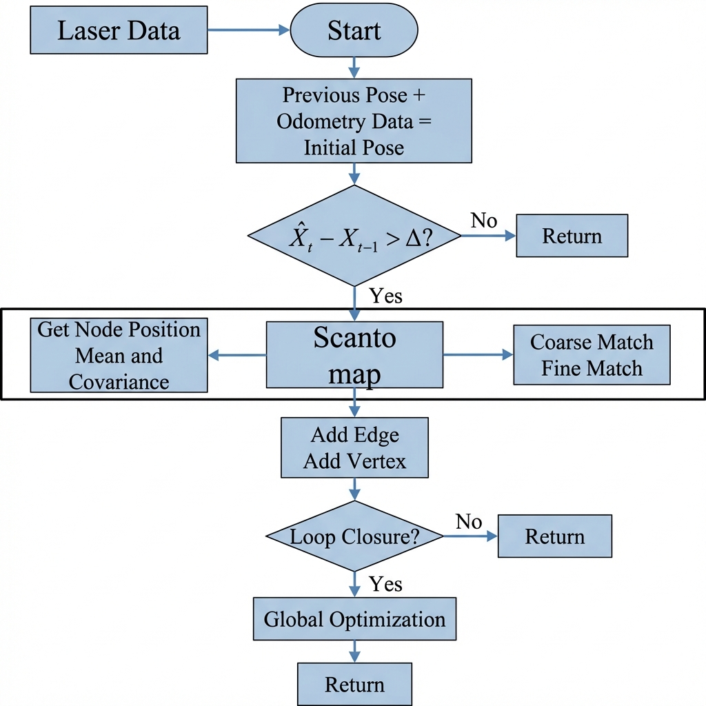

As can be seen from the above figure, the process is quite straightforward. In the traditional soft real-time operating mechanism of SLAM, processing is performed every time a frame of data enters, and then it returns.

* **Source Code and WIKI Addresses related to KartoSLAM:**

1. **KartoSLAM ROS Wiki: [http://wiki.ros.org/slam_karto](http://wiki.ros.org/slam_karto)**
2. **slam_karto package: [https://github.com/ros-perception/slam_karto](https://github.com/ros-perception/slam_karto)**
3. **open_karto open-source algorithm: [https://github.com/ros-perception/open_karto](https://github.com/ros-perception/open_karto)**

* **SLAM Mapping Steps**

1. Click the icon  on the system desktop to open the ROS2 command line terminal.
2. Enter the command to disable the app auto-start service.

```bash
~/.stop_ros.sh
```

3. Enter the command to start mapping.

```bash
ros2 launch slam slam.launch.py
```

4. Open a new command line terminal and enter the command to launch the rviz tool to display the mapping effect:

```bash
ros2 launch slam rviz_slam.launch.py
```

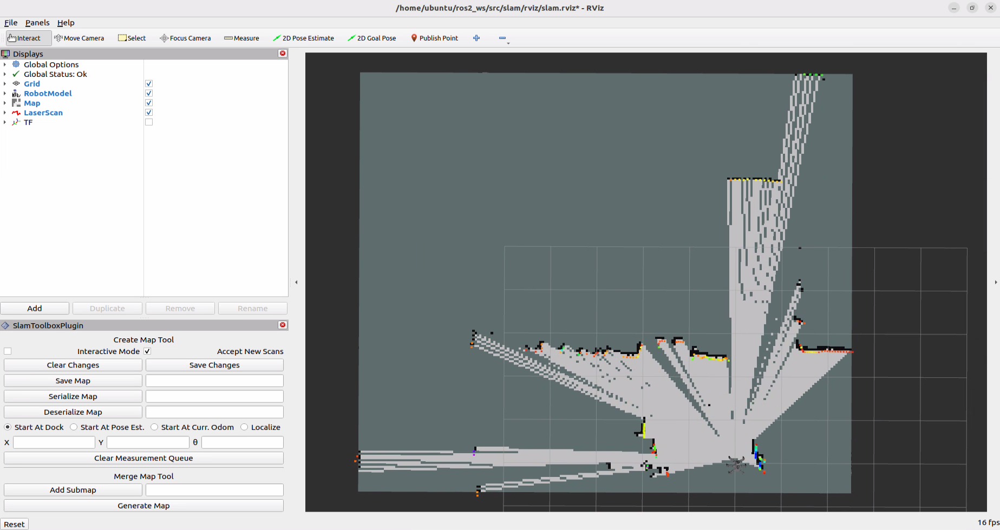

5. A wireless controller or keyboard can be used to control the movement of the robot. If keyboard control is selected, a new command line terminal must be opened, the command to start the keyboard control node entered, and the **Enter** key pressed:

```bash
ros2 launch peripherals teleop_key_control.launch.py
```

If the prompt shown in the figure below appears, the keyboard control service has started successfully.

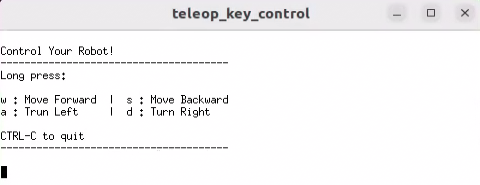

6. Control the robot to move around the current space to construct a more complete map. The table below lists the keyboard keys available for manipulating the robot's movement and their corresponding functions:

<table>
<tr>
<th>Keyboard Key</th>
<th>Robot Action</th>
</tr>
<tr>
<td>W</td>
<td>Short press, switch to forward state</td>
</tr>
<tr>
<td>S</td>
<td>Short press, switch to backward state</td>
</tr>
<tr>
<td>A</td>
<td>Short press, turn left</td>
</tr>
<tr>
<td>D</td>
<td>Short press, turn right</td>
</tr>
</table>
When controlling the robot's movement for mapping via the keyboard, the robot's moving speed can be appropriately reduced. The lower the robot's running speed, the smaller the relative error of the odometry, resulting in better mapping effects. As the robot moves, the map displayed in RVIZ will continuously increase until the map construction of the entire environmental scene is complete.

* **Saving the Map**

Open a new command line terminal, enter the command to save the map, and press **Enter**:

```bash
cd ~/ros2_ws/src/slam/maps && ros2 run nav2_map_server map_saver_cli -f "map_01" --ros-args -p map_subscribe_transient_local:=true
```

* **Effect Optimization**

If a more precise mapping effect is desired, the odometry can be optimized. The robot requires the use of odometry during mapping, and odometry relies on the IMU.

The robot itself comes with loaded calibrated IMU data. This data enables the robot to successfully complete mapping and navigation functions normally, but the IMU can still be calibrated to achieve higher precision.

* **Parameter Description**

Parameter files can be viewed under the path **~/ros2_ws/src/slam/config/slam.yaml**.

For a detailed explanation of the many parameters, please refer to the official introduction: [https://wiki.ros.org/slam_toolbox](https://wiki.ros.org/slam_toolbox).

* **Launch File Analysis**

This launch file is located at: **/home/ubuntu/ros2_ws/src/slam/launch/slam.launch.py**

1. Importing libraries

```python
import os
from ament_index_python.packages import get_package_share_directory

from launch_ros.actions import PushRosNamespace
from launch import LaunchDescription, LaunchService
from launch.substitutions import LaunchConfiguration
from launch.launch_description_sources import PythonLaunchDescriptionSource
from launch.actions import DeclareLaunchArgument, IncludeLaunchDescription, GroupAction, OpaqueFunction, TimerAction

```

Detailed explanations for the launch library can be found in the official ROS documentation: [https://docs.ros.org/en/humble/How-To-Guides/Launching-composable-nodes.html](https://docs.ros.org/en/humble/How-To-Guides/Launching-composable-nodes.html)

2. Setting paths

```python
if compiled == 'True':
    slam_package_path = get_package_share_directory('slam')
else:
    slam_package_path = '/home/ubuntu/ros2_ws/src/slam'
```

Use `get_package_share_directory` to obtain the path of the slam feature package.

3. Starting other launch files

```python
base_launch = IncludeLaunchDescription(
    PythonLaunchDescriptionSource(
        os.path.join(slam_package_path, 'launch/include/robot.launch.py')),
    launch_arguments={
        'sim': sim,
        'master_name': master_name,
        'robot_name': robot_name,
    }.items(),
)

slam_launch = IncludeLaunchDescription(
    PythonLaunchDescriptionSource(
        os.path.join(slam_package_path, 'launch/include/slam_base.launch.py')),
    launch_arguments={
        'use_sim_time': use_sim_time,
        'map_frame': map_frame,
        'odom_frame': odom_frame,
        'base_frame': base_frame,
        'scan_topic': '{}/scan'.format(frame_prefix),
        'enable_save': enable_save
    }.items(),
)

if slam_method == 'slam_toolbox':
    bringup_launch = GroupAction(
     actions=[
         PushRosNamespace(robot_name),
         base_launch,
         TimerAction(
             period=5.0,  # Delay to wait for other nodes to start up (delay to enable other nodes)
             actions=[slam_launch],
         ),
      ]
    )
```

`base_launch` is the hardware launch file required to start the program, `slam_launch` is the mapping launch file, and `bringup_launch` is the initial pose launch file.

<p id ="anther5.1.3"></p>

### 5.1.3 RTAB-VSLAM 3D Mapping

* **Introduction to RTAB-VSLAM**

RTAB-VSLAM is an appearance-based, real-time 3D mapping approach, which is an open-source library that achieves loop closure detection through memory management methods. By limiting the size of the map, it ensures that loop closure detection is always processed within a fixed time limit, thereby meeting the requirements for long-term and large-scale online environmental mapping.

* **Principles of RTAB-VSLAM**

RTAB-VSLAM 3D mapping utilizes feature-based mapping. The advantage is that general scenes can provide abundant feature points, offering good scene adaptability and allowing the use of feature points for relocalization. There are several disadvantages to this approach. First, feature point calculation algorithms are time-consuming. Second, the information utilized by feature points is too sparse, losing most of the information in the image. Third, the feature point method becomes ineffective for textureless areas. Finally, feature point matching is prone to mismatches, which significantly impacts the results.

Once the features in the images are obtained, features from different times need to be matched to form a loop closure detection. After matching is completed, the data is divided into two categories: Long-Term Memory (LTM) data and Short-Term Memory (STM) data. The LTM data is used for matching future data, while the STM data is used for matching continuously timed data.

When the RTAB-VSLAM algorithm runs, it first uses STM data to update the localization points and map. When data at a future moment successfully matches the LTM data, the corresponding LTM data is added to the STM data to update the localization points and map.

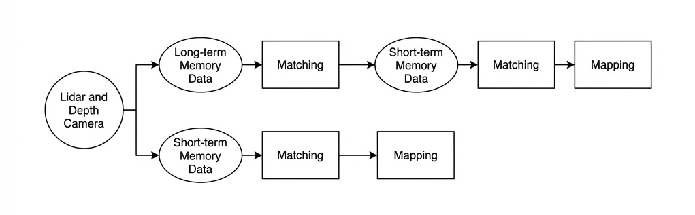

**RTAB-VSLAM Software Package Link: [https://github.com/introlab/rtabmap](https://github.com/introlab/rtabmap)**.

* **RTAB-VSLAM 3D Mapping Steps**

1. Click the icon  on the system desktop to open the ROS2 command line terminal. Enter the command to disable the app auto-start service:

```bash
~/.stop_ros.sh
```

2. Enter the command to start mapping:

```bash
ros2 launch slam rtabmap_slam.launch.py
```

3. Open a new command line terminal and enter the command to launch the rviz tool to display the mapping effect:

```bash
ros2 launch slam rviz_rtabmap.launch.py
```

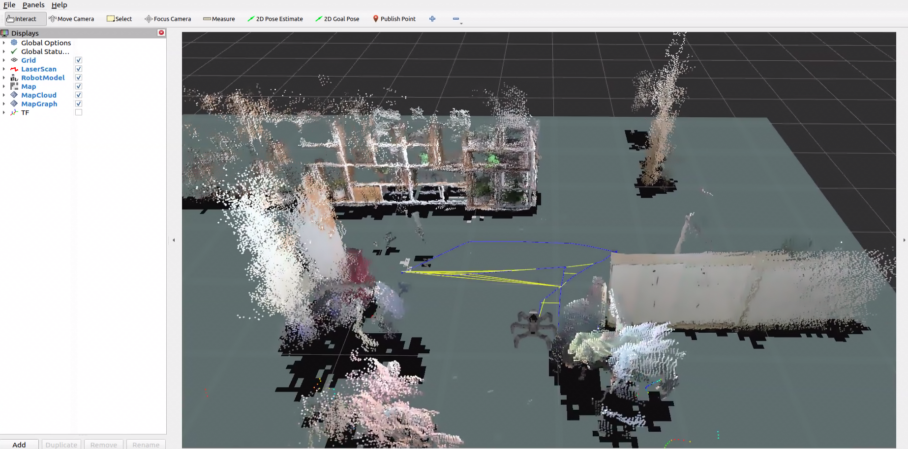

4. A wireless controller or keyboard can be used to control the movement of the robot. If keyboard control is selected, a new command-line terminal must be opened. Then enter the command to start the keyboard control node and press **Enter**:

```bash
ros2 launch peripherals teleop_key_control.launch.py
```

If the prompt shown in the figure below appears, the keyboard control service has started successfully.


5. Control the robot to move around the current space to construct a more complete map. The table below lists the keyboard keys available for manipulating the robot's movement and their corresponding functions:

<table>
<tr>
<th>Keyboard Key</th>
<th>Robot Action</th>
</tr>
<tr>
<td>W</td>
<td>Short press, switch to forward state</td>
</tr>
<tr>
<td>S</td>
<td>Short press, switch to backward state</td>
</tr>
<tr>
<td>A</td>
<td>Short press, turn left</td>
</tr>
<tr>
<td>D</td>
<td>Short press, turn right</td>
</tr>
</table>
When controlling the robot's movement for mapping via the keyboard, the robot's moving speed can be appropriately reduced. The lower the robot's running speed, the smaller the relative error of the odometry, resulting in better mapping effects. As the robot moves, the map displayed in RVIZ will continuously increase until the map construction of the entire environmental scene is complete.

* **Robot Map Saving**

After mapping is completed, the shortcut **Ctrl + C** can be used in the respective command-line terminal windows to close the currently running program.

> [!NOTE]
> **Manual saving is not required for 3D mapping. The map is saved automatically when the mapping process is terminated using Ctrl+C.**

* **Launch File Analysis**

This launch file is located at: **/home/ubuntu/ros2_ws/src/slam/launch/rtabmap_slam.launch.py**

1. Importing libraries

```python
import os
from ament_index_python.packages import get_package_share_directory

from launch_ros.actions import PushRosNamespace
from launch import LaunchDescription, LaunchService
from launch.substitutions import LaunchConfiguration
from launch.launch_description_sources import PythonLaunchDescriptionSource
from launch.actions import DeclareLaunchArgument, IncludeLaunchDescription, GroupAction, OpaqueFunction, TimerAction

```

Detailed explanations for the launch library can be found in the official ROS documentation: [https://docs.ros.org/en/humble/How-To-Guides/Launching-composable-nodes.html](https://docs.ros.org/en/humble/How-To-Guides/Launching-composable-nodes.html)

2. Setting paths

```python
if compiled == 'True':
    slam_package_path = get_package_share_directory('slam')
else:
    slam_package_path = '/home/ubuntu/ros2_ws/src/slam'
```

Use `get_package_share_directory` to obtain the path of the slam feature package.

3. Starting other launch files

```python
base_launch = IncludeLaunchDescription(
    PythonLaunchDescriptionSource(
        os.path.join(slam_package_path, 'launch/include/robot.launch.py')),
    launch_arguments={
        'sim': sim,
        'master_name': master_name,
        'robot_name': robot_name,
        'rtabmap_name': rtabmap_name,
        'action_name': 'init_horizontal',

    }.items(),
)

rtabmap_launch = IncludeLaunchDescription(
    PythonLaunchDescriptionSource(
        os.path.join(slam_package_path, 'launch/include/rtabmap.launch.py')),
    launch_arguments={
        'use_sim_time': use_sim_time,
    }.items(),
)

bringup_launch = GroupAction(
 actions=[
     PushRosNamespace(robot_name),
     base_launch,
     TimerAction(
         period=10.0,  # Delay to wait for other nodes to start up (delay to enable other nodes)
         actions=[rtabmap_launch],
     ),
  ]
)
```

`base_launch` is the hardware launch file required to start the program, `rtabmap_launch` is the rtab mapping launch file, and `bringup_launch` is the initial pose launch file.

## 5.2 Navigation Tutorial

### 5.2.1 ROS Autonomous Navigation

* **Overview**

Autonomous navigation is the method of guiding a device from one point on a designated route to another. The main application scenarios for navigation include:

Land applications: such as autonomous vehicle navigation, vehicle tracking and monitoring, intelligent vehicle information systems, Internet of Vehicles applications, railway operation monitoring, etc.

Marine applications: such as ocean transport, inland waterway transport, ship berthing and docking, etc.

Aviation applications: such as route navigation, airport surface monitoring, precision approaches, etc.

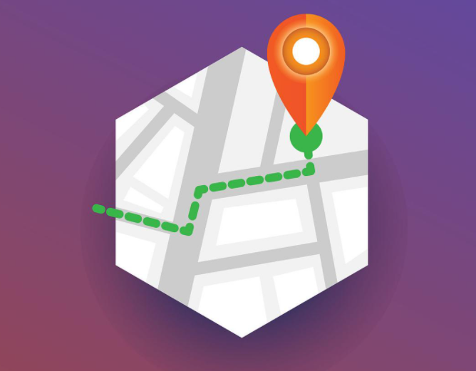

Adhering to the principle of not reinventing the wheel, the ROS navigation-related feature package suite provides a generalized implementation set for robot navigation. Developers no longer need to focus on the complex, low-level implementations of navigation algorithms and hardware interactions, while these are managed, iterated, and maintained by specialized research and development personnel. Developers can concentrate more on upper-level functions. To invoke navigation functions, the configuration files of each module simply need to be appropriately set based on the robot's specific parameters. Additionally, secondary development can be based on existing feature packages to implement customized requirements, greatly improving R&D efficiency and shortening the time to deployment.

In short, using the ROS navigation package suite offers advantages for general developers: it is developed and maintained by a professional team, providing stable and comprehensive functions, thus allowing developers to focus more on upper-level functional implementation, making development much more efficient.

* **Detailed Explanation of the Feature Package**

In this subsection, a detailed analysis and explanation of the navigation feature packages will be provided, along with usage instructions for the parameters.

1. Explanation of Principle Structural Framework

The Nav2 project inherits and expands on the spirit of the ROS navigation stack. The project strives to safely move a mobile robot from point A to point B. Nav2 can also be applied to other applications involving robot navigation, such as dynamic point tracking. During this process, dynamic path planning, calculating motor speeds, avoiding obstacles, and executing recovery behaviors are required.

Nav2 uses behavior trees to call modular servers to complete an action. An action can be calculating a path, controlling force, recovering, or any other operation related to navigation. These are all independent nodes that communicate with the behavior tree (BT) via ROS Action servers. The Nav2 architecture can be preliminarily understood by viewing the following diagram:


To further explain the architecture diagram above, it can be simply divided into one large component and three smaller components.

The Large Component:

BT Navigator Server: The navigation behavior tree server. This major server organizes and invokes the three smaller services below.

The Three Smaller Components:

Planner Server: The planning server, whose task is to compute paths that fulfill certain objective functions. Depending on the chosen nomenclature and algorithm, this path can also be called a route. In simple terms, it involves finding a path on the map.

Controller Server: The control server, also known in ROS1 as the local planner. It represents the method by which the globally calculated path is followed or a local task is completed. In simple terms, it involves controlling the robot's movement based on the found path.

Recovery Server: The recovery server acts as the backbone of a fault-tolerant system. The goal of the recovery tool is to handle unknown or faulty states of the system and manage them autonomously. In simple terms, it formulates strategies to restore normalcy when the robot encounters an unexpected situation, such as how to climb out of a pit it accidentally fell into while moving.

Through continuously switching between path planning, controlling the robot along the path, and autonomous recovery when encountering problems, the robot's autonomous navigation is achieved. During robot navigation, relying solely on a raw map built by SLAM is insufficient. During movement, the robot might encounter new obstacles, or it may find that obstacles in certain areas of the raw map have disappeared. Therefore, the map maintained during the robot navigation process is dynamic. Depending on the update frequency and usage, it can be categorized into the following two types:

**Global Costmap:**

The global costmap is primarily used by the global path planner. As seen in the architecture diagram above, it resides within the Planner Server.

It typically includes the following layers:

Static Map Layer: The static map layer, which usually consists of the completed static map built by SLAM.

Obstacle Map Layer: The obstacle map layer, used to dynamically record obstacle information perceived by sensors.

Inflation Layer: The inflation layer, which expands outward over the preceding two map layers to prevent the robot's exterior from colliding with obstacles.

**Local Costmap:**

The local costmap is primarily used by the local path planner. As seen in the architecture diagram above, it resides within the Controller Server.

It typically includes the following layers:

Obstacle Map Layer: The obstacle map layer, used to dynamically record obstacle information perceived by sensors.

Inflation Layer: The inflation layer, which expands outward over the obstacle map layer to prevent the robot's exterior from colliding with obstacles.

2. Installation of the Feature Package

> [!NOTE]
> **The navigation feature package is pre-installed on the robot at the factory. There is no need for reinstallation.**

The navigation system takes the navigation target, localization information, and map information as inputs, and outputs the actual control variables for manipulating the robot. First, the robot's current location must be known, and then the target the robot needs to reach must be known.

There are two ways to install the navigation feature package. One method is direct installation into the system via apt-get. 

> [!NOTE]
>
> **Replace the asterisk * in the command with the applicable ROS2 version.**

The commands are as follows:

```bash
sudo apt install ros-*-navigation2
```
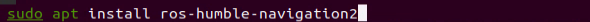

```bash
sudo apt install ros-*-nav2-bringup
```


To view the ROS2 version, the following command can be entered in the terminal:

```bash
echo $ROS_DISTRO
```

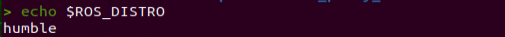

Another method involves downloading the source code of the feature package and compiling/installing it manually. If the navigation feature package is only being used for learning purposes, binary installation provides a quick and convenient approach. If modifications to the code within the feature package are necessary to improve the algorithm, manual installation from the source code is required.

Navigation Function wiki link: [https://wiki.ros.org/Robots/Nav2](https://wiki.ros.org/Robots/Nav2).

### 5.2.2 AMCL Adaptive Monte Carlo Localization

* **AMCL Localization**

Localization is the deduction of the robot's own position within the global map. SLAM also encompasses localization algorithm implementations, but SLAM localization is used for constructing the global map and belongs to the phase prior to navigation commencement. Current localization is utilized during navigation. The robot needs to move along the planned route, and localization can help determine whether the robot's actual trajectory meets expectations. Within the ROS navigation package suite `ros-navigation`, the AMCL localization system is provided to achieve robot localization during navigation.

AMCL (Adaptive Monte Carlo Localization) is a probabilistic localization system for 2D mobile robots. It implements the Adaptive Monte Carlo Localization method, capable of deducing the robot's position based on existing maps using a particle filter.

Localization addresses the association problem between the robot and obstacles, since path planning is essentially a decision-making process based on the obstacles surrounding the robot. Theoretically, as long as global localization is known and real-time obstacle avoidance is achieved with the aid of sensors like LiDAR, navigation tasks can be completed. However, the real-time performance and accuracy of global localization are generally not high. These are provided by local localization sensors like odometry and IMU, thereby ensuring the motion trajectory tracking matches the IMU's real-time capability and precision. The amcl node in the navigation package provides global localization by publishing `map_odom`. Global localization via amcl is not strictly mandatory, which can be replaced with any other global localization method capable of providing `map_odom`, such as utilizing SLAM, UWB, QR code localization, etc.

Global and local localization have already established a dynamic tf coordinate system `map_odom` -> `base_footprint`. The static tf coordinates between various sensors on the robot are provided through the robot's URDF model. This segment of TF relationships resolves the correlation between the robot and obstacles. For instance, if LiDAR detects an obstacle 3 meters ahead, utilizing the tf coordinates between the LiDAR and the robot's chassis—specifically the coordinate transformation from `base_link` to `laser_link`—the relationship between the obstacle and the robot chassis can be determined.

* **Particle Filter**

The Monte Carlo localization process simulates the particle update of a one-dimensional robot. First, a swarm of particles is randomly generated. Particles can have position, orientation, or state variables that need to be estimated, and each has a weight representing its similarity to the actual state of the system. Then, the state of each particle at the next time step is predicted; particles can be moved according to the predicted behavior of the true system. Following that, the weights of the particles are updated based on measurements. Particles that better match the measured values will be assigned higher weights. Resampling is then performed to discard highly improbable particles and replace them with more probable ones. Finally, the weighted average and covariance of the particle set are calculated to obtain state estimates.

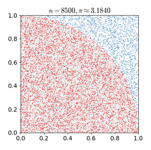

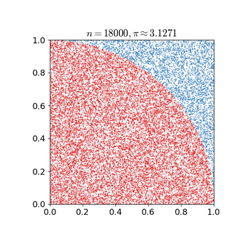

Monte Carlo methods vary but tend to follow a specific pattern:

1. Define the domain of possible inputs.
2. Randomly generate inputs from a probability distribution over the domain.
3. Perform deterministic computations on the inputs.
4. Aggregate the results.

There are two important considerations:

1. If these points are not uniformly distributed, the approximation will be poor.
2. This process requires a large number of points. If only a few points are randomly placed in the entire square, the approximation is usually poor. On average, as more points are placed, the approximation accuracy improves.

Monte Carlo particle filter algorithms have a very wide range of applications, for example: physical sciences, engineering, climatology, and computational biology.

* **Adaptive Monte Carlo Localization**

AMCL can be viewed as an improved version of the Monte Carlo Localization algorithm. It enhances real-time performance by utilizing fewer samples within the Monte Carlo Localization algorithm to reduce execution time. It implements the Adaptive or KLD-sampling Monte Carlo Localization method, wherein a particle filter is used against an existing map to track a robot's pose.

The Adaptive Monte Carlo Localization node primarily uses laser scans and LiDAR maps. It passes messages and completes the calculation of pose estimation. The implementation process first initializes the particle filter of the Adaptive Monte Carlo Localization algorithm according to various initialization parameters provided by the ROS system. If no initial pose is set, the Adaptive Monte Carlo Localization algorithm will assume the robot starts from the origin of the coordinate system, which can make computations relatively complex.

Therefore, it is recommended to set the initial pose via the **2D Pose Estimate** button in rviz.

For more content regarding Adaptive Monte Carlo Localization, refer to the wiki address link: [https://github.com/ros-planning/navigation](https://github.com/ros-planning/navigation).

* **Costmap**

Whether using a LiDAR or a depth camera as a sensor to generate a 2D or 3D SLAM map, it cannot be directly utilized for actual navigation, and the map must be converted into a costmap. ROS costmaps typically adopt a grid format. A single grid cell in a grid map occupies 1 byte, which is eight bits, capable of storing values from 0 to 255. In other words, each cell's cost, or the grid value, ranges from 0 to 255. Only three scenarios are required: Occupied for when an obstacle is present, Free for when there is no obstacle, and Unknown Space.

Before introducing `costmap_2d`, an algorithm must be presented: Bresenham's line algorithm. Bresenham's line algorithm is used to depict a line determined by two points. It calculates the points closest to a line segment on an n-dimensional raster. This algorithm only utilizes relatively fast integer addition, subtraction, and bit shifting, and is commonly used for drawing straight lines on computer screens. It is one of the earliest developed algorithms in computer graphics.


A set of virtual grid lines is constructed passing through the centers of pixels in each row and column, as shown in the figure above. The intersections between the line and each vertical grid line are calculated in order from the starting point to the ending point. Then, based on the sign of the error term, the pixel in that column closest to this intersection is determined.

Core idea of the algorithm: Assume: k = dy/dx. Since the starting point of the straight line is at the center of the pixel, the initial value of the error term d is d0 = 0. For every increment of 1 in the X subscript, the value of d correspondingly increments by the line's slope value k, i.e., d = d + k. Once d ≥ 1, subtract 1 from it to ensure d remains between 0 and 1. When d ≥ 0.5, it is closest to the upper-right pixel (x+1, y+1) relative to the current pixel. When d < 0.5, it is closer to the right-side pixel (x+1, y). For computational convenience, let e = d - 0.5; the initial value of e is -0.5, and the increment is k. When e ≥ 0, take the upper-right pixel (x+1, y+1) of the current pixel (xi, yi). When e < 0, it is closer to the right-side pixel (x+1, y). Integers can be used instead to avoid division. Because only the sign of the error term is utilized in the algorithm, the following substitution can be made: e1 = 2 * e * dx.

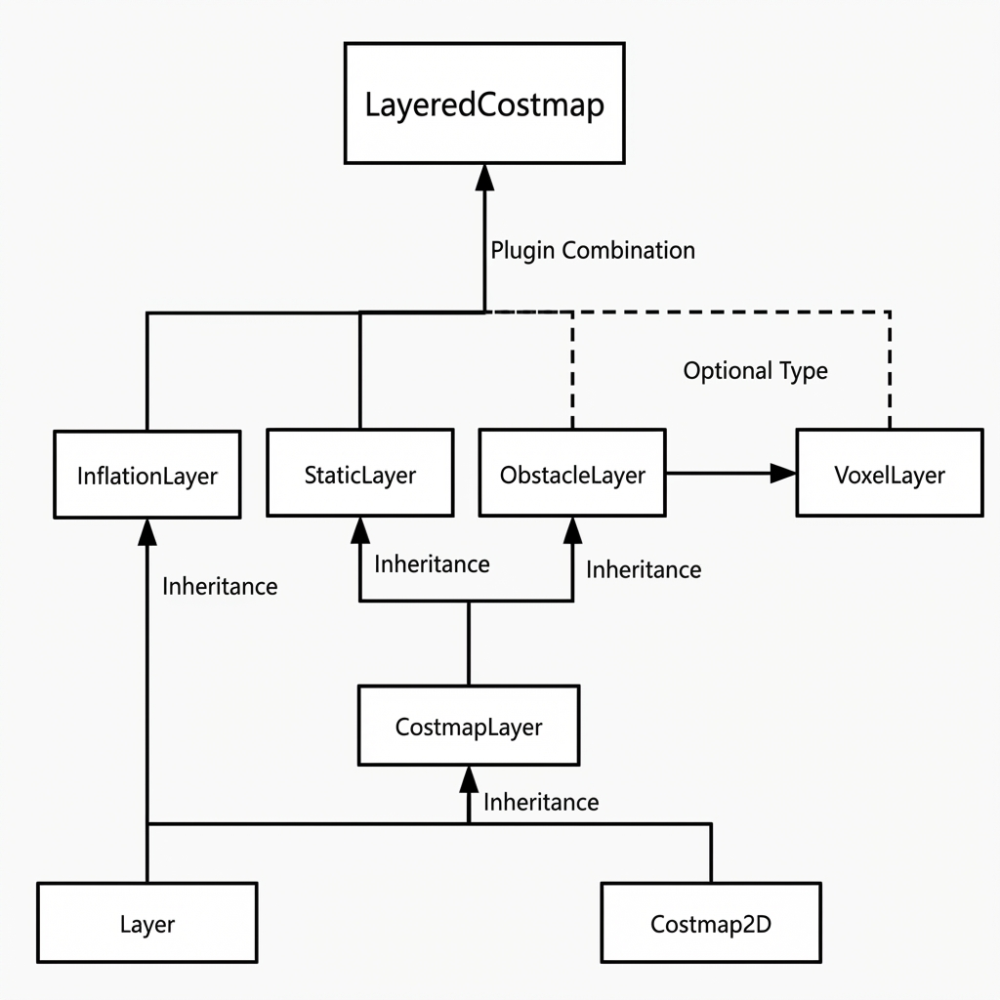

The `Costmap2D` class maintains the cost value of each grid. The `Layer` class is a virtual base class that unifies the interfaces of the various costmap layers of plugins. The most important interface functions among them are:

The `initialize` function, which calls the `onInitialize` function to initialize each costmap layer respectively;

The `matchSize` function: In the `StaticLayer` class and `ObstacleLayer` class, this function calls the `matchSize` function of the `CostmapLayer` class to initialize the size, resolution, origin, and default cost values of each costmap layer, keeping them consistent with the `layered_costmap`. For the `inflationLayer` class, a distance-dependent cost table is calculated based on the inflation radius. Cost values of inflated grids can later be queried using distance. A `seen_` array is also defined, which is used to mark whether a grid cell has been traversed. For the `VoxelLayer` class, the size of voxel blocks is initialized.

The `updateBounds` function, which adjusts the size range that needs updating for the current costmap layer. For the `StaticLayer` class, the map update boundary is defined by the size of the static map. **Note:** The static layer is generally only used within the global costmap. For the `ObstacleLayer` class, boundaries for obstacles are determined by iterating through the sensor data in `clearing_observations`.

The `initialize` function and `matchSize` function each execute only once. The `updateBounds` function and `updateCosts` function execute periodically, with execution frequency determined by `map_update_frequency`.

The `CostmapLayer` class simultaneously inherits from the `Layer` class and `Costmap2D` class, and provides several operational methods for updating cost values. The `StaticLayer` class and `ObstacleLayer` class both inherit from the `CostmapLayer` class because they need to save the cost values for instantiating the costmap layers. The `StaticLayer` class uses static grid map data to update its own costmap. The `ObstacleLayer` class utilizes sensor data to update its costmap. Compared to the `ObstacleLayer` class, the `VoxelLayer` class additionally considers z-axis data. Differences in effect are mainly reflected in obstacle clearance: one executes clearance on a 2D plane, while the other clears in 3D.

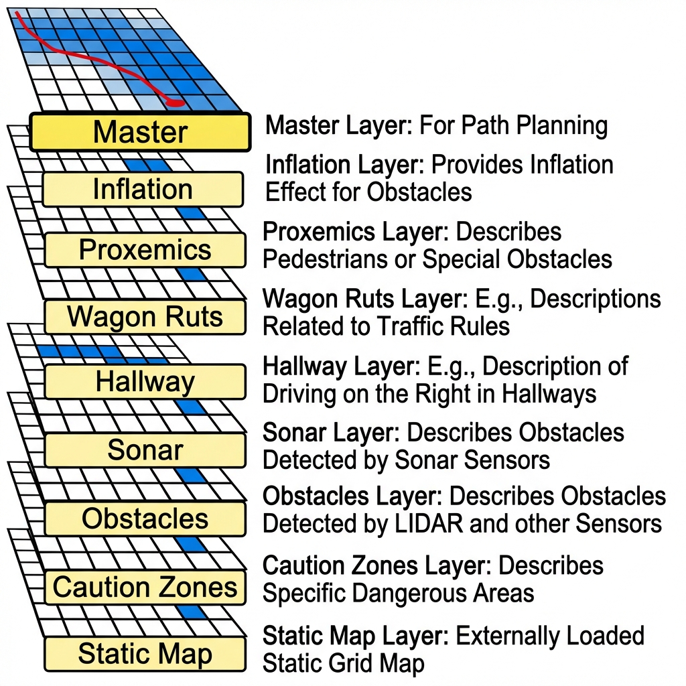

Costmap obstacle metric scaling is very flexible. Specific layers can be created according to requirements, and obstacle information of concern is then maintained on that layer. If only a LiDAR is installed on the robot, an Obstacles layer needs to be created to maintain the obstacle information scanned by the LiDAR. If an ultrasonic sensor is added to the robot, a Sonar layer needs to be created to maintain the obstacle information scanned by the acoustic sensor. Each layer can possess its own obstacle update rules, such as adding obstacles, deleting obstacles, updating confidence levels of obstacle points, etc., significantly increasing the extensibility of the navigation system.

### 5.2.3 Global Path Planning

Based on the degree of understanding of the environment by the mobile robot, environmental properties, and utilized algorithms, path planning can be divided into environment-based path planning algorithms, map-knowledge-based path planning algorithms, and completeness-based path planning algorithms.


Commonly used path planning algorithms in autonomous robot navigation include Dijkstra, A\*, D\*, PRM, RRT, genetic algorithms, ant colony algorithms, fuzzy algorithms, etc.

`Dijkstra` and `A*` used in robotics belong to graph-structure-based path search algorithms. The navigation package suite incorporates `navfn`, `global planner`, and `carrot planner` global path planning plugins. One of these can be selected and loaded into `move_base` for use, or a third-party global path planning plugin can be loaded into `move_base`, such as `SBPL_Lattice_Planner` or `srl_global_planner`. Alternatively, custom global path planning plugins can be developed according to the `nav_core` interface specifications.

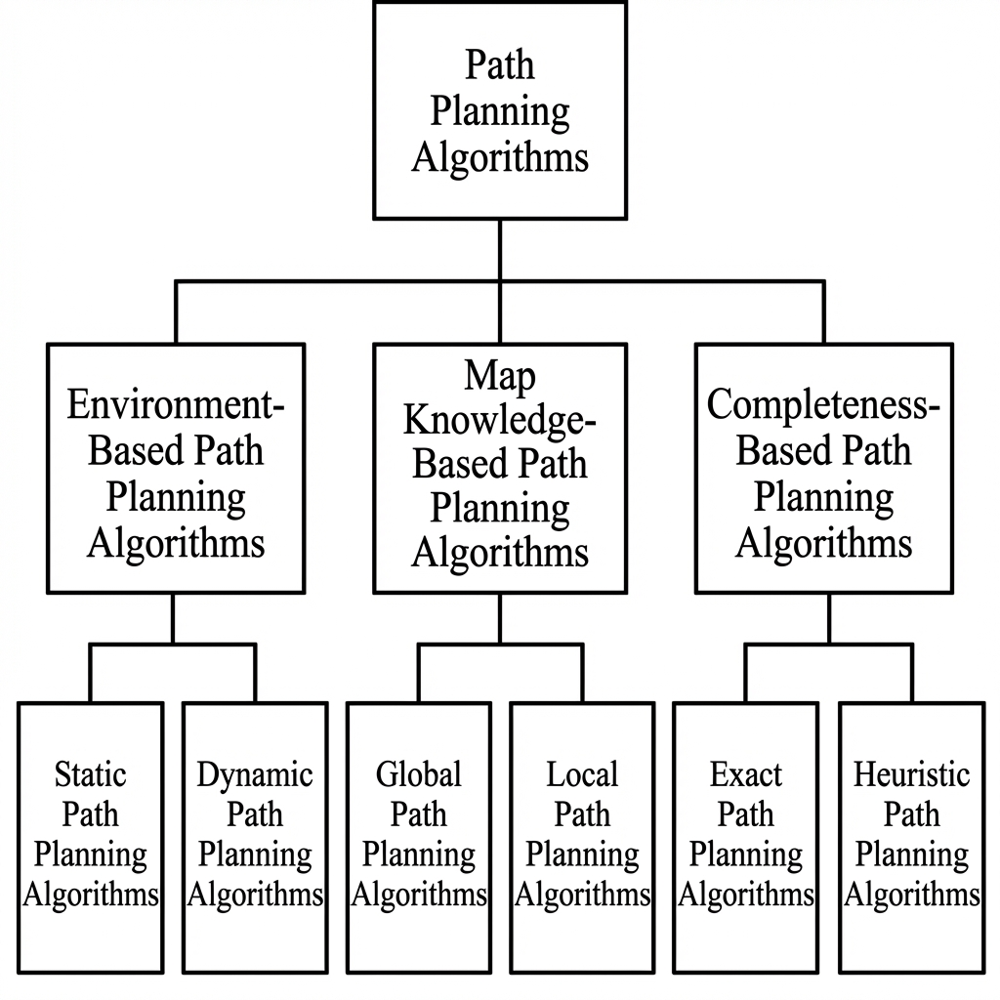

Mobile robot navigation relies on path planning to reach a target point. The navigation planning layer can be divided into a global path planning layer, a local path planning layer, and an action execution layer.

1. Global path planning layer: Based on a given target, it accepts weight map information to generate a global weight map, planning a global path from the starting point to the target position, which serves as a reference for local path planning.
2. Local path planning layer: As the local planning component of the navigation system, it accepts the local weight map information generated from the weight map and plans the local path based on nearby obstacle information.
3. Action execution layer: Combining instructions from the upper layer and path planning, it issues current actions for the mobile robot.

As a key area of research in mobile robotics, the quality of mobile robot path planning algorithms heavily determines the working efficiency of the robot.

* **Dijkstra's Algorithm**

Dijkstra's algorithm is a typical shortest-path algorithm. It is a single-source shortest-path algorithm characterized by expanding outwardly layer by layer starting from the initial point. That is, it uses a breadth-first search approach until the destination is reached. It is a breadth-first algorithm that takes edge weights into account and is one of the most commonly used algorithms for solving global path planning problems.

Below is a graphical illustration of Dijkstra's algorithm:

1. Initially, `dis[start]` is initialized to 0, and all other points are initialized to infinity (inf).

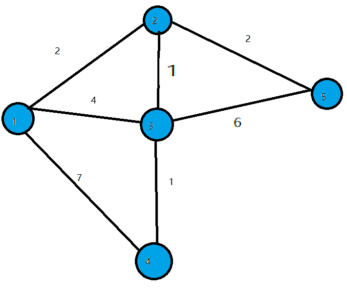

2. In the first iteration, find the point 1 with the minimum `dis` value, turn 1 into a white point, and modify the `dis` values of all blue points connected to 1. This results in `dis[2]=2`, `dis[3]=4`, and `dis[4]=7`.


3. In the second iteration, find the point 2 with the minimum `dis` value, turn 2 into a white point, and modify the `dis` values of all blue points connected to 2. This results in `dis[3]=3` and `dis[5]=4`.


4. In the third iteration, find the point 3 with the minimum `dis` value, turn 3 into a white point, and modify the `dis` values of all blue points connected to 3. This results in `dis[4]=4`.

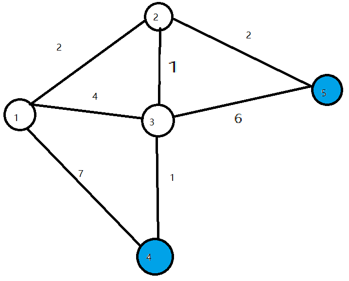

5. In the next two iterations, points 4 and 5 are sequentially set as white points. The algorithm terminates, and the shortest paths to all points are determined.

For more information and usage instructions regarding Dijkstra's algorithm, please check the wiki link: [http://wiki.ros.org/navfn](http://wiki.ros.org/navfn)

* **A* Algorithm**

The A* algorithm is a modification of Dijkstra's algorithm optimized for a single destination. Dijkstra's algorithm can find paths to all locations, while the A* algorithm searches for a path to one location or the closest among several locations. It prioritizes paths that appear closer to the target.

The formula for the A* algorithm is: F = G + H, where the G value is the movement cost to move from the starting point to a specified grid cell, and the H value is the estimated cost to move from the specified grid cell to the destination. The H value can be calculated in the following two ways:

1. The Manhattan distance calculates horizontal and vertical movement distances, as it is incapable of diagonal calculation.


2. The Diagonal distance calculates horizontal and vertical movement distances while allowing for diagonal calculation.


For an introduction and instructions on how to use the A* algorithm, please refer to the wiki link: [http://wiki.ros.org/global planner](http://wiki.ros.org/global planner).

redblobgames website: [https://www.redblobgames.com/pathfinding/a-star/introduction.html#graphs](https://www.redblobgames.com/pathfinding/a-star/introduction.html#graphs).

### 5.2.4 Local Path Planning

Global path planning takes starting and target points as inputs and utilizes the obstacle information described by the global map to plan a global path from start to target. A global path is formed by connecting discrete path points sequentially. Because it only considers static obstacle information, the global path cannot be used directly for navigation control, but can only serve as a macroscopic reference for navigation.

* **DWA Algorithm**

1. Introduction

The DWA algorithm, also known as the Dynamic Window Approach, is a classic algorithm used for mobile robot path planning and motion control. The DWA algorithm realizes safe navigation for a robot on a known map by searching for the optimal combination of velocity and angular velocity within the state space of linear and angular velocities. The basic description and some formulas of the DWA algorithm are as follows.

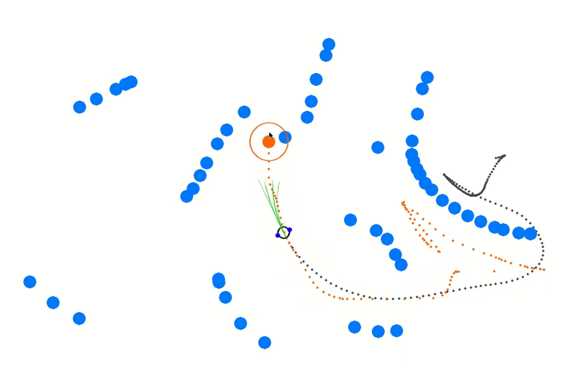

The main idea behind the DWA algorithm is that at every time step, the robot considers its current state and sensor information, then generates a set of possible motion trajectories, also called a dynamic window, in the state space of velocity and angular velocity. It subsequently evaluates these trajectories to select the optimal one. Evaluation criteria typically include obstacle avoidance, maximizing forward directional velocity, and minimizing angular velocity. By continuously repeating this process, the robot can plan its motion trajectory in real time to cope with dynamic environments and obstacles.

2. Formulas

(1) Robot state: Position (x, y) and orientation θ.

(2) Motion control parameters: Linear velocity V and angular velocity ω.

(3) Sampling ranges for velocity and angular velocity: V<sub>min</sub>, V<sub>max</sub>, and ω<sub>min</sub>, ω<sub>max</sub>.

(4) Time step size: Δt.

Formulas are as follows:

1. Velocity Sampling: The DWA algorithm first performs sampling in the state space of velocity and angular velocity to generate a set of possible velocity-angular velocity pairs. These pairs comprise the dynamic window.

V<sub>samples</sub> = [v<sub>min</sub>, v<sub>max</sub>]

ω<sub>samples</sub> = [-ω<sub>max</sub>, ω<sub>max</sub>]

Where (V<sub>samples</sub>) represents the velocity sampling range, and (ω<sub>samples</sub>) represents the angular velocity sampling range.

2. Motion Simulation: For each velocity-angular velocity pair, the DWA algorithm runs a motion simulation to calculate the trajectory the robot will take when adopting this velocity-angular velocity combination in its current state.

x(t+1) = x(t) + v * cos(θ(t)) * Δt

y(t+1) = y(t) + v * sin(θ(t)) * Δt

θ(t+1) = θ(t) + ω * Δt

Where x(t) and y(t) denote the robot's position, θ(t) denotes the robot's heading, v is linear velocity, ω is angular velocity, and Δt is the time step size.

3. Trajectory Evaluation: For each generated trajectory, the DWA algorithm assesses it through an evaluation function, incorporating metrics such as an obstacle avoidance evaluation, maximum velocity evaluation, and minimum angular velocity evaluation.

(1) Obstacle avoidance evaluation: Detecting whether the trajectory intersects with obstacles.

(2) Maximum velocity evaluation: Checking whether the maximum linear velocity on the trajectory is within the permissible range.

(3) Minimum angular velocity evaluation: Checking whether the minimum angular velocity on the trajectory is within the permissible range. The evaluation function can be defined and adjusted based on task requirements.

4. Selecting the Optimal Trajectory: The DWA algorithm selects the trajectory with the highest evaluation score as the robot's next move.


* **Extensions**

The DWA algorithm is a foundational algorithm in the field of mobile robotics. It has numerous extended and improved versions, such as DWA*, e-DWA, and DP-DWA, which are used to improve path planning performance and efficiency.

Links for DWA algorithm extensions and learning:

1. DWA algorithm extension: [https://arxiv.org/abs/1703.08862.](https://arxiv.org/abs/1703.08862)
2. Enhanced DWA (e-DWA) algorithm: [https://arxiv.org/abs/1612.07470](https://arxiv.org/abs/1612.07470).
3. DP-DWA algorithm — DP-based Dynamic Window Approach： [https://arxiv.org/abs/1909.05305](https://arxiv.org/abs/1909.05305).
4. Wiki link: [http://wiki.ros.org/dwa_local_planner](http://wiki.ros.org/dwa_local_planner).

These links contain detailed information regarding the DWA algorithm and its extensions, as well as pointers for further research.

* **TEB Algorithm**

1. Introduction

The TEB (Timed Elastic Band) algorithm is employed for path planning and motion planning, mainly used in applications involving robots and autonomous vehicles. The central idea of the TEB algorithm is to model the path planning problem as an optimization problem. The goal is to generate the optimal trajectory within a given time, satisfying the kinematic constraints of the robot or vehicle, as well as obstacle avoidance requirements. Key characteristics of the TEB algorithm include:

(1) Hierarchical time representation: The TEB algorithm introduces the concept of time stratification, dividing the trajectory into multiple time steps. Each time step corresponds to a position of the robot or vehicle on the trajectory. This aids in establishing time constraints and avoiding collisions.

(2) Trajectory parameterization: The TEB algorithm parameterizes the trajectory into a series of displacements and velocities to facilitate optimization. Each time step has a displacement and a velocity parameter.

(3) Constraint optimization: The TEB algorithm considers the kinematic constraints of the robot, obstacle avoidance constraints, and trajectory smoothness constraints. These constraints are modeled as part of the objective function in the optimization problem.

(4) Optimization solving: The TEB algorithm uses optimization techniques like Quadratic Programming (QP) or Nonlinear Programming (NLP) to solve for the optimal parameters of the trajectory to satisfy the constraints.

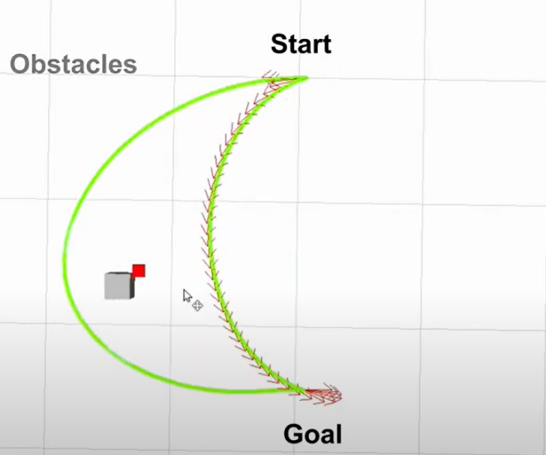


2. Formulas

The figure below describes the optimization objective function in the TEB algorithm:

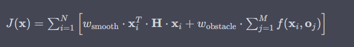

Where:

J(x) is the objective function, and x consists of the trajectory parameters.

w<sub>smooth</sub> and w<sub>obstacle</sub> are the weights for smoothness and obstacle avoidance, respectively.

H is the smoothness penalty matrix.

f(x<sub>i</sub>, o<sub>j</sub>) represents the obstacle cost function between trajectory point x<sub>i</sub> and obstacle o<sub>j</sub>.

(1) State Definition:

First, define the state of the robot in the path planning problem.

Position: P = [X, Y], indicating the robot's position on the 2D plane.

Velocity: V = [Vx, Vy], indicating the robot's velocity along the X and Y axes.

Time: t, indicating time.

Control input: u = [ux, uy], indicating the robot's control input, which could be velocity or acceleration.

Robot trajectory: x(t) = [p(t), v(t)], representing the robot's state at time t.

(2) Objective Function:

The core of the TEB algorithm is an optimization problem aimed at minimizing an objective function consisting of multiple components:


Where:

J<sub>smooth</sub>(x): Smoothness objective function, used to ensure the generated trajectory is smooth.

J<sub>obstacle</sub>(x): Obstacle avoidance objective function, used to avoid collisions with obstacles.

J<sub>dynamic</sub>(x): Kinematic objective function, used to ensure the robot's kinematic constraints are met.

(3) Smoothness objective function Jsmooth(x):

The smoothness objective function usually involves trajectory curvature to guarantee a smooth output. It can be expressed as:


Where k(t) is the curvature.

(4) Obstacle avoidance objective function Jobstacle(x):

The obstacle avoidance objective function computes the distance between trajectory points and obstacles, penalizing trajectory points that approach obstacles. The specific obstacle cost function f(x, o) can be set based on requirements.


(5) Kinematic objective function J<sub>dynamic</sub>(x):

The kinematic objective function ensures that the generated trajectory satisfies the robot's kinematic constraints, which can be defined based on the robot's kinematic and dynamic models. Generally, this involves limits on velocity and acceleration.

(6) Optimization:

Finally, the TEB algorithm solves the aforementioned objective function as a constrained optimization problem. This incorporates optimization variables for trajectory parameters, time allocation, and control inputs. This optimization problem is normally a Nonlinear Programming (NLP) problem.

* **Extensions**

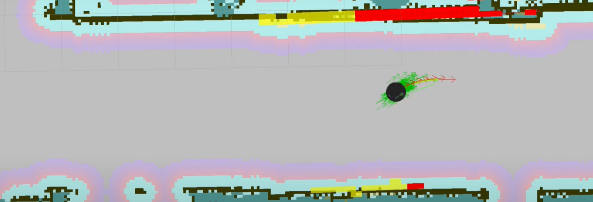

The TEB algorithm is a vital technology in the domain of path planning, sporting numerous extended and improved variations. Below are learning links and extension topics helpful for gaining a deeper understanding of the TEB algorithm and related concepts:

1. Original paper for the TEB algorithm: One of the best learning resources is reviewing the original TEB algorithm paper for an in-depth understanding of its underlying principles and applications.

- Original TEB Paper: **Trajectory modification considering dynamic constraints of autonomous robots** by M. Rösmann et al.

2. ROS implementation of TEB: The TEB algorithm ROS package is a common implementation applied to robot path planning.

ROS TEB Local Planner Package: [https://github.com/rst-tu-dortmund/teb_local_planner](https://github.com/rst-tu-dortmund/teb_local_planner)

Wiki official website: [http://wiki.ros.org/teb_local_planner](http://wiki.ros.org/teb_local_planner)

These materials are beneficial for more deeply studying the TEB algorithm and areas related to path planning.

### 5.2.4 LiDAR Single-Point, Multi-Point Navigation, and Obstacle Avoidance

1. Click the icon  on the system desktop to open the command line terminal. Enter the command to disable the app auto-start service:

```bash
~/.stop_ros.sh
```

2. Enter the command to start the navigation service, and press **Enter**:

```bash
ros2 launch navigation navigation.launch.py map:=map_01
```

The **map_01** at the end of the command is the map name, which can be modified based on specific requirements. The storage path for maps is **/home/ubuntu/ros2_ws/src/slam/maps**.

3. Open a new command line terminal and enter the command to start the rviz tool to display navigation:

```bash
ros2 launch navigation rviz_navigation.launch.py
```

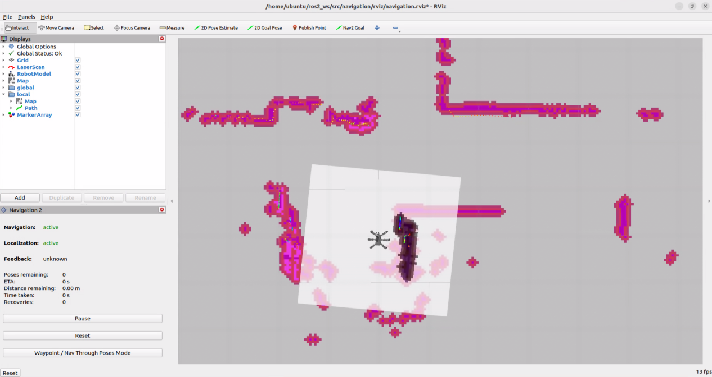

* **Single-Point Navigation**

In the software menu bar, **2D Pose Estimate** is used to set the robot's initial position, **2D Goal Pose** is used to set a single target point for the robot, and **Publish Point** is used to set multiple target points for the robot.

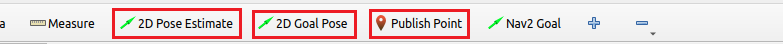

1. Click 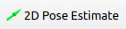 to set the robot's initial position. Choose a position on the map interface, and click and drag the mouse to set the robot's pose.

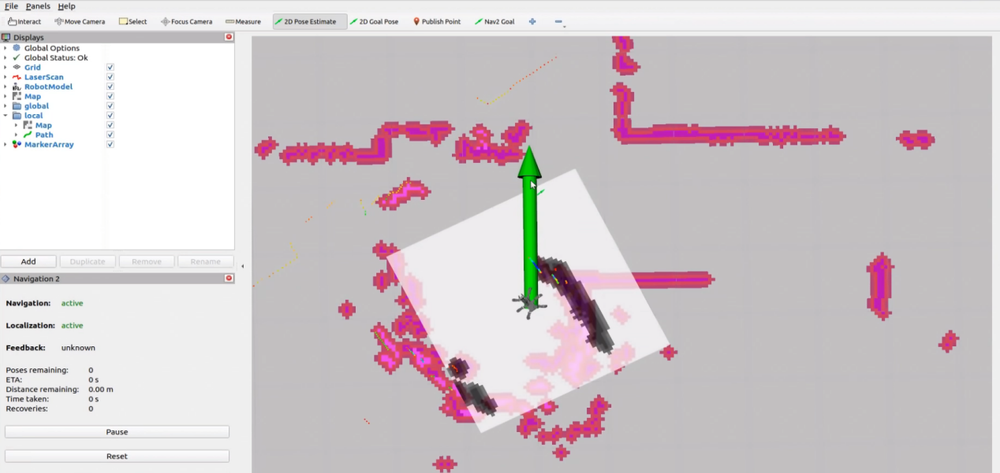

2. The effect after setting the robot's initial position is shown in the figure below:

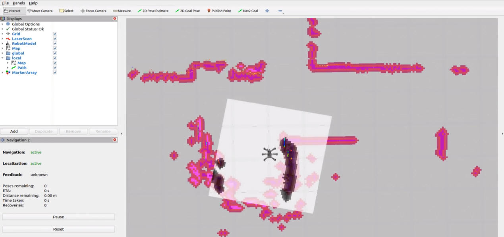

3. Click the icon 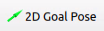, select a location on the map interface as the target point, and click once with the mouse at that point. Once selected, the robot will automatically generate a route and move to the target point.

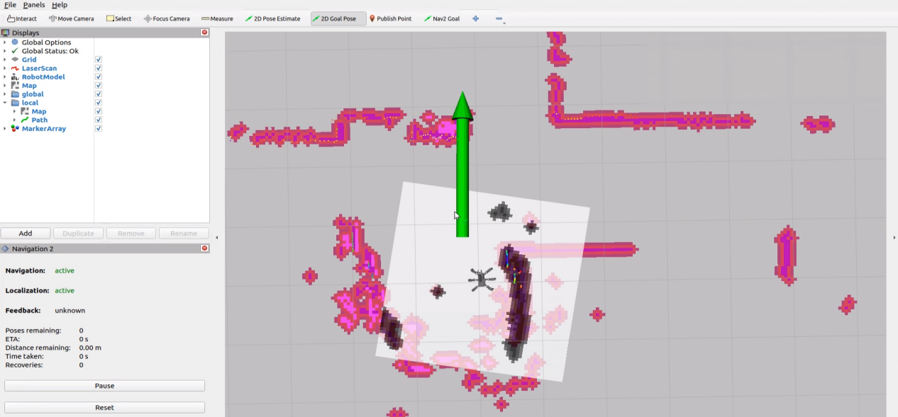

4. After the target point is determined, the map will display two paths. The line composed of green segments is the straight-line path between the robot and the target point, while the dark blue line is the robot's planned path.

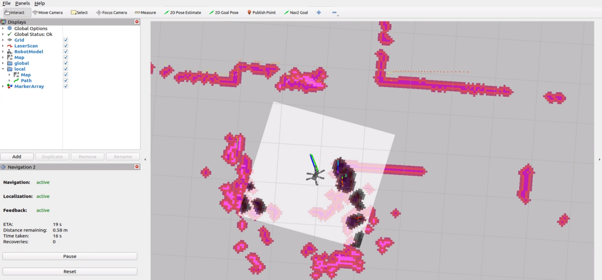

5. When encountering obstacles, the robot will bypass them while continuously adjusting its posture and movement trajectory.

* **Multi-Point Navigation**

1. Click the `Waypoint` button to enable multi-point navigation:

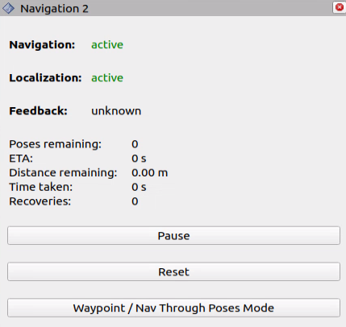

2. Set the respective navigation points via , as shown below:

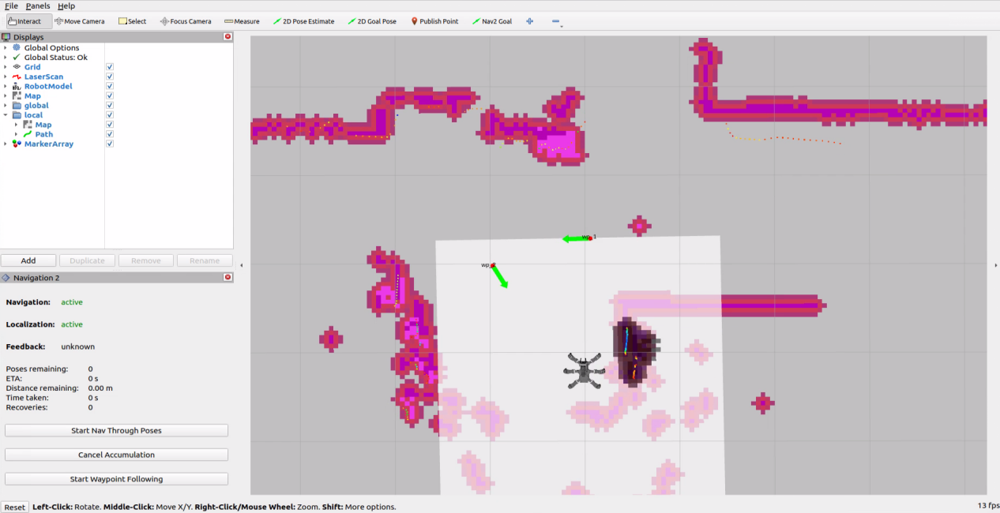

3. Finally, click `Start Nav Through Poses` or `Start Waypoint Following` to navigate. `Start Nav Through Poses` will not be concerned with the robot's posture when reaching each navigation point, while `Start Waypoint Following` controls the robot to achieve a specific posture at each point.
4. The execution effect of multi-point navigation is shown below, with the robot reaching the target points in sequence:

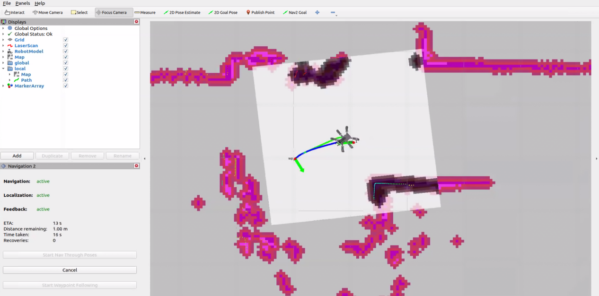

5. The completed state of multi-point navigation is shown in the figure below:

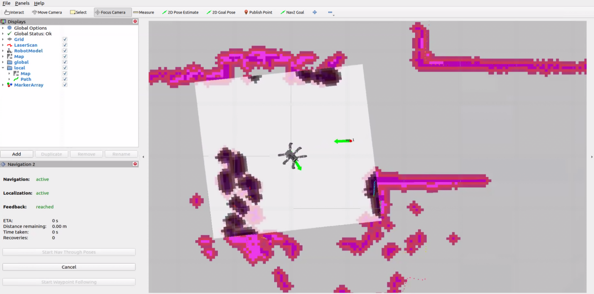

* **Launch File Analysis**

This launch file path is located at: **/home/ubuntu/ros2_ws/src/navigation/launch/navigation.launch.py**

1. Importing libraries.

```python
import os
from ament_index_python.packages import get_package_share_directory

from launch_ros.actions import PushRosNamespace
from launch import LaunchDescription, LaunchService
from launch.substitutions import LaunchConfiguration
from launch.launch_description_sources import PythonLaunchDescriptionSource
from launch.actions import DeclareLaunchArgument, IncludeLaunchDescription, GroupAction, OpaqueFunction, TimerAction
```

2. Setting paths.

```python
if compiled == 'True':
    slam_package_path = get_package_share_directory('slam')
    navigation_package_path = get_package_share_directory('navigation')
else:
    slam_package_path = '/home/ubuntu/ros2_ws/src/slam'
    navigation_package_path = '/home/ubuntu/ros2_ws/src/navigation'
```

Use `get_package_share_directory` to obtain the paths for the slam and navigation feature packages.

3. Starting other launch files.

```python
base_launch = IncludeLaunchDescription(
    PythonLaunchDescriptionSource(os.path.join(slam_package_path, 'launch/include/robot.launch.py')),
    launch_arguments={
        'sim': sim,
        'master_name': master_name,
        'robot_name': robot_name
    }.items(),
)

navigation_launch = IncludeLaunchDescription(
    PythonLaunchDescriptionSource(os.path.join(navigation_package_path, 'launch/include/bringup.launch.py')),
    launch_arguments={
        'use_sim_time': use_sim_time,
        'map': os.path.join(slam_package_path, 'maps', map_name + '.yaml'),
        'params_file': os.path.join(navigation_package_path, 'config', 'nav2_params.yaml'),
        'namespace': robot_name,
        'use_namespace': use_namespace,
        'autostart': 'true',
        'use_teb': use_teb,
    }.items(),
)

bringup_launch = GroupAction(
 actions=[
     PushRosNamespace(robot_name),
     base_launch,
     TimerAction(
         period=10.0,  # Delay to wait for other nodes to start up (delay for enabling other nodes)
         actions=[navigation_launch],
     ),
  ]
)
```

`base_launch` is used to launch the hardware, `navigation_launch` initiates the navigation algorithms, and `bringup_launch` serves as an initialization action.

### 5.2.5 RTAB-VSLAM 3D Navigation

* **Algorithm Introduction and Principles**

For an introduction and principles of the RTAB-VSLAM algorithm, refer to [5.1.3 RTAB-VSLAM 3D Mapping](#anther5.1.3) for more details.

* **Operating Steps**

1. Power on the robot and connect it to the remote control software VNC. For details on how to connect to the remote desktop, refer to section **[1. ROSpider User Manual -> 1.4 Development Environment Setup](https://wiki.hiwonder.com/projects/ROSpider/en/latest/docs/1.%20ROSpider%20User%20Manual.html#development-environment-setup)**.
2. Click the icon  on the system desktop to open the command line terminal. Enter the command to disable the app auto-start service:

```bash
~/.stop_ros.sh
```

3. Enter the command to start navigation, and press **Enter**:

```bash
ros2 launch navigation rtabmap_navigation.launch.py
```

4. Open a new command-line terminal and enter the command to start the rviz tool to display navigation:

```bash
ros2 launch navigation rviz_rtabmap_navigation.launch.py
```

In the software menu bar, **2D Goal Pose** is used to set a single target point for the robot, and **Publish Point** is used to set multiple target points.


5. Click the icon , select a location on the map interface as the target point, and click once with the mouse at that point. Once selected, the robot will automatically generate a route and move to the target point.

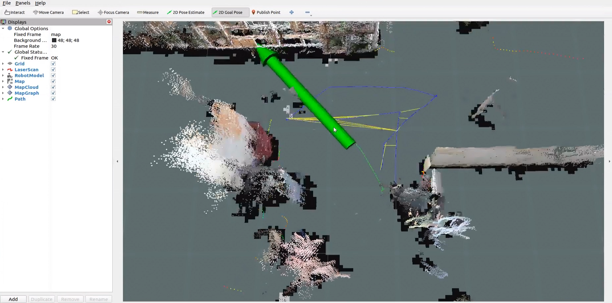

6. After the target point is determined, the map will display the path between the robot and the target point.

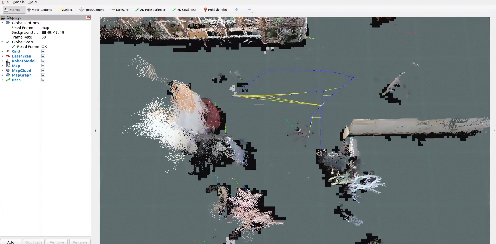

7. When encountering obstacles, the robot will bypass them while continuously adjusting its posture and movement trajectory.

* **Launch File Analysis**

This launch file path is located at: **/home/ubuntu/ros2_ws/src/navigation/launch/rtabmap_navigation.launch.py**

1. Importing libraries.

```python
import os
from ament_index_python.packages import get_package_share_directory

from launch_ros.actions import PushRosNamespace
from launch import LaunchDescription, LaunchService
from launch.substitutions import LaunchConfiguration
from launch.launch_description_sources import PythonLaunchDescriptionSource
from launch.actions import DeclareLaunchArgument, IncludeLaunchDescription, GroupAction, OpaqueFunction, TimerAction

```

2. Setting paths.

```python
if compiled == 'True':
    slam_package_path = get_package_share_directory('slam')
    navigation_package_path = get_package_share_directory('navigation')
else:
    slam_package_path = '/home/ubuntu/ros2_ws/src/slam'
    navigation_package_path = '/home/ubuntu/ros2_ws/src/navigation'
```

Use `get_package_share_directory` to obtain the paths for the slam and navigation feature packages.

3. Starting other launch files.

```python
base_launch = IncludeLaunchDescription(
    PythonLaunchDescriptionSource(os.path.join(slam_package_path, 'launch/include/robot.launch.py')),
    launch_arguments={
        'sim': sim,
        'master_name': master_name,
        'robot_name': robot_name,
        'action_name': 'init_horizontal',
    }.items(),
)

navigation_launch = IncludeLaunchDescription(
    PythonLaunchDescriptionSource(os.path.join(navigation_package_path, 'launch/include/bringup.launch.py')),
    launch_arguments={
        'use_sim_time': use_sim_time,
        'map': os.path.join(slam_package_path, 'maps', map_name + '.yaml'),
        'params_file': os.path.join(navigation_package_path, 'config', 'nav2_params.yaml'),
        'namespace': robot_name,
        'use_namespace': use_namespace,
        'autostart': 'true',
        'rtabmap': 'true',
    }.items(),
)

rtabmap_launch = IncludeLaunchDescription(
    PythonLaunchDescriptionSource(
        os.path.join(navigation_package_path, 'launch/include/rtabmap.launch.py')),
    launch_arguments={
        'use_sim_time': use_sim_time,
    }.items(),
)

bringup_launch = GroupAction(
 actions=[
     PushRosNamespace(robot_name),
     base_launch,
     TimerAction(
         period=10.0,  # Delay to wait for other nodes to start up (delay for enabling other nodes)
         actions=[navigation_launch],
     ),
     rtabmap_launch
  ]
)
```

The `base_launch` file is used to launch the hardware, `navigation_launch` initiates the 2D navigation algorithms, `rtabmap_launch` initiates the 3D navigation algorithms, and `bringup_launch` handles the initialization actions.