# 6. ROS+OpenCV Course

## 6.1 Color Threshold Adjustment

Under different lighting conditions, the presented color of objects varies, which impacts color recognition features to a certain extent. To address this issue, this lesson covers how to use the **LAB_TOOL** tool to adjust color thresholds.

### 6.1.1 Starting LAB_TOOL

> [!NOTE]
> **Commands are strictly case-sensitive, and the Tab key can be used to auto-complete keywords.**

1. Power on the robot and connect it to the remote control software, VNC. For instructions on connecting to the remote desktop, refer to **[1. ROSpider User Manual \1.4 Development Environment Setup](https://wiki.hiwonder.com/projects/ROSpider/en/raspberry-pi-version/docs/1_ROSpider_User_Manual.html#development-environment-setup)**.
2. Click the desktop icon  to open the terminal.
3. Enter the command to stop the auto-start service.

```
~/.stop_ros.sh
```

4. Enter the command to start the depth camera node.

```
ros2 launch peripherals depth_camera.launch.py 
```

5. Open a new terminal and enter the command to open the lab_tool.

```
python3 ~/software/lab_tool/main.py
```

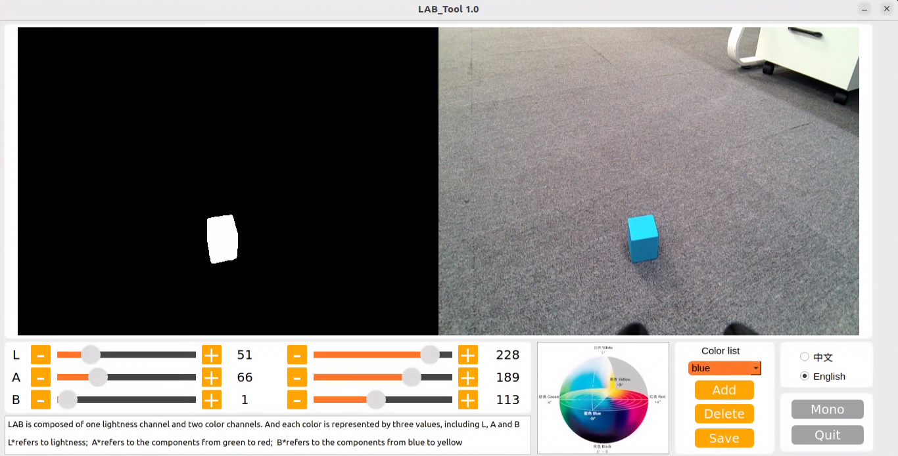

6. For interface button descriptions and usage, refer to the subsequent sections of this document. To close the tool, click the **Quit** button in the bottom right corner.

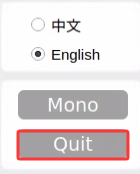

7. After closing the LAB_TOOL, enter the command to restart the app auto-start service before using the app to control the robot. Once started, the robotic arm will return to its initial position.

```
sudo systemctl restart start_app_node.service
```

> [!NOTE]
> **If the app auto-start service is not running, the corresponding app features will not function correctly. Alternatively, restarting the robot will automatically trigger the app auto-start service.**

### 6.1.2 LAB_TOOL Interface Description

The LAB_TOOL software interface is divided into a video feed display area and a recognition adjustment area.

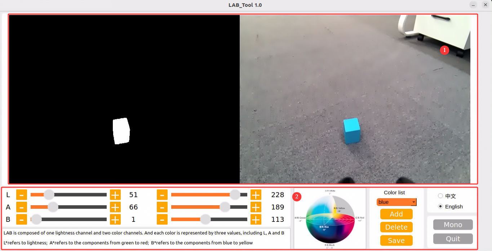

1. Video Feed Display Area: The left side shows the processed camera feed, and the right side shows the original feed.

> [!NOTE]
> **If the video feed does not display, the camera connection has failed. Check the cable connection at the corresponding port, or try replugging it to resolve the issue.**

2. Recognition Adjustment Area: Used to adjust color thresholds. The functions of each button are described in the table below:

<table border="1">
<thead>
<tr>
<th>Icon</th>
<th>Function Description</th>
</tr>
</thead>
<tbody>
<tr>
<td>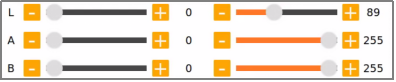</td>
<td>
<p>The L, A, and B sliders are used to adjust the numerical values of the L, A, and B components of the video feed.<p>
<p>The left slider represents the "min" value of each component, and the right slider represents the "max" value of each component.<p>
</td>
</tr>
<tr>
<td>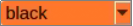</td>
<td>Select the color for threshold adjustment.</td>
</tr>
<tr>
<td></td>
<td>Delete the currently selected color.</td>
</tr>
<tr>
<td></td>
<td>Add a recognizable color.</td>
</tr>
<tr>
<td></td>
<td>Save the color threshold adjustment results.</td>
</tr>
<tr>
<td></td>
<td>Click this button to switch between the depth camera and the monocular camera.</td>
</tr>
<tr>
<td></td>
<td>Close the LAB_TOOL.</td>
</tr>
</tbody>
</table>


### 6.1.3 Adjusting Color Thresholds

1. Open the LAB_TOOL, and select the color to be adjusted in the color list within the recognition adjustment area. Here, red is used as an example.
2. Set both the **min** and **max** values of the L, A, and B components to **0** and **255** respectively.

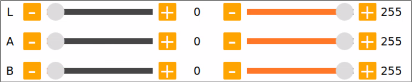

3. Place a colored object within the camera's field of view. Refer to the LAB color space distribution chart, and adjust the L, A, and B components toward the target recognition color range.

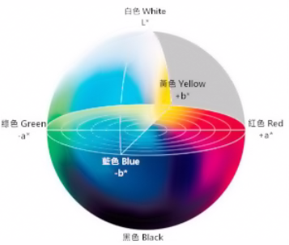

Red is closer to "+a", so the A component needs to be increased. Keep the **max** value of the A component unchanged and increase its **min** value until the colored object area in the left display screen turns white, while other areas turn black.

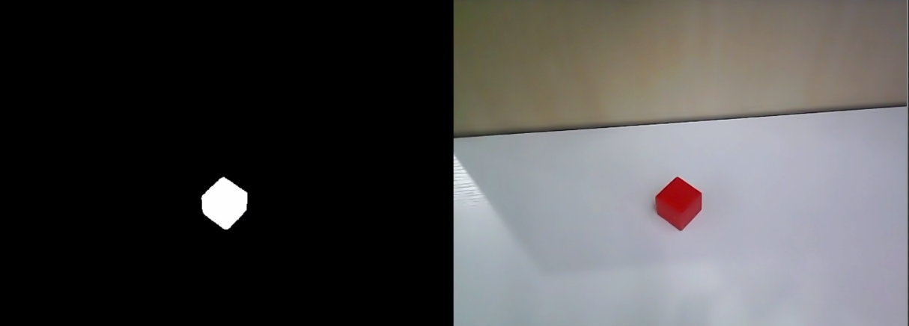

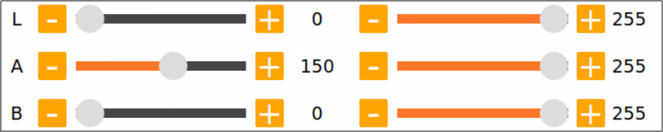

4. Adjust the remaining L and B components based on the environment. If the red color appears too light, increase the **min** value of the L component. If it appears too dark, decrease the **max** value of the L component. If the red color is too warm, increase the **min** value of the B component. If it is too cool, decrease the **max** value of the B component.

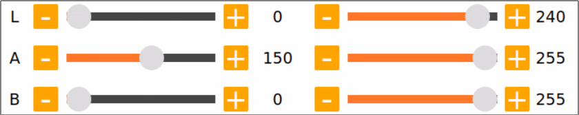

The table below provides parameter information for LAB threshold adjustment:

<table border="1">
<thead>
<tr>
<th>Color Component</th>
<th>Component Value Range</th>
<th>Corresponding Color Range</th>
</tr>
</thead>
<tbody>
<tr>
<td>L</td>
<td>0~255</td>
<td>Black-White (-L ~ +L)</td>
</tr>
<tr>
<td>A</td>
<td>0~255</td>
<td>Green-Red (-a ~ +a)</td>
</tr>
<tr>
<td>B</td>
<td>0~255</td>
<td>Blue-Yellow (-b ~ +b)</td>
</tr>
</tbody>
</table>

5. Click the **Save** button in the recognition adjustment area to save the color threshold parameters.

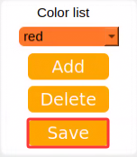

### 6.1.4 Adding New Recognition Colors

In addition to the built-in recognition colors, other recognizable colors can be added. Here, yellow is used as an example. The specific operational steps are as follows:

1. Open the LAB_TOOL and click the **Add** button.

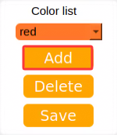

2. Enter the color name in the **Name** field and click **OK**.

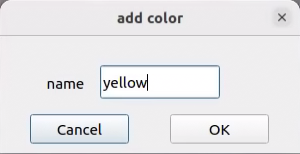

3. Select the newly added color from the color list.

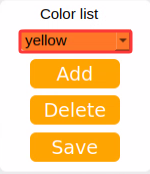

4. Place the colored object within the camera's field of view. Drag the sliders for the L, A, and B components to adjust the threshold until the colored object area in the left display screen turns white, while other areas turn black.

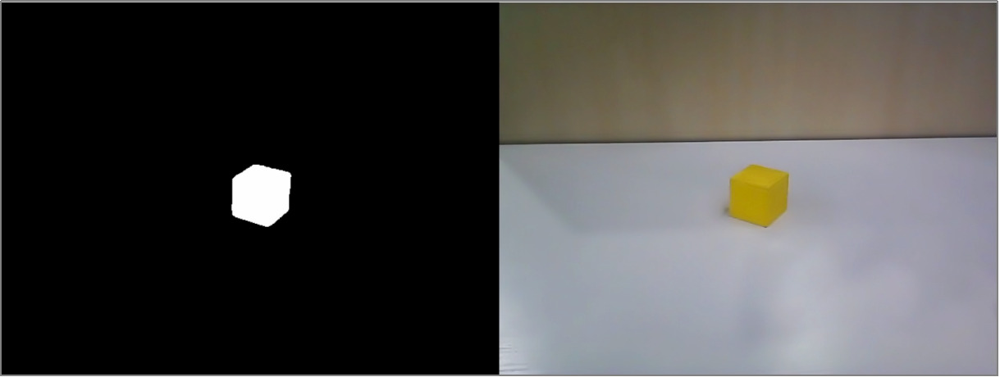

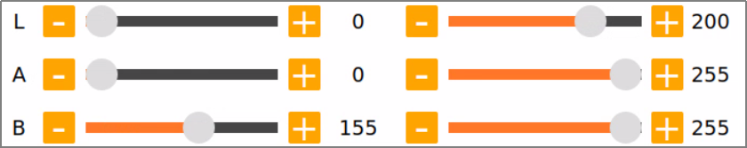

5. Click the **Save** button in the recognition adjustment area to save the color threshold parameters.

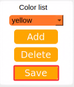

After adjusting the color thresholds, press **Ctrl + C** to close the camera service, and click **Close** to exit the interface.

## 6.2 Color Recognition

This section utilizes OpenCV to recognize red, green, and blue objects, displaying the recognition results on the video feed. Before starting the feature, prepare three objects colored red, green, and blue, respectively.

### 6.2.1 Experiment Overview

First, the camera's RGB image is acquired, and the image undergoes scaling and Gaussian blur processing. The color space of the image is then converted from RGB to LAB. For more details on the LAB color space, refer to **[1. Tutorials\2. Basics Course\3. OpenCV Computer Vision Course](https://drive.google.com/drive/folders/1mJOYpvnyMda1xGvtPgTvoBUd1zHdh9Db?usp=sharing)**.

Next, object colors within the circle are recognized using color thresholds, and a mask is applied to portions of the image. Masking uses a selected image, graphic, or object to globally or locally obscure the processed image. Following morphological opening and closing operations on the object image, the object with the largest contour is ultimately circled.

Opening operation: Erosion followed by dilation. Purpose: Used to eliminate small objects, smooth shape boundaries without changing area. It can remove small granular noise and disconnect adhered objects.

Erosion: Eliminates object boundary points, shrinking the boundary inward, which removes objects smaller than the structural element.

Dilation: Expands object boundary points, merging all background points contacting the object into the object, thereby expanding the boundary outward.

Finally, the recognition results are fed back onto the video feed.

### 6.2.2 Operation Steps

> [!NOTE]
> **Commands are strictly case-sensitive, and the Tab key can be used to auto-complete keywords.**

1. Power on the robot and connect it to the remote control software, VNC. For instructions on connecting to the remote desktop, refer to **[1. ROSpider User Manual \ 1.4 Development Environment Setup](https://wiki.hiwonder.com/projects/ROSpider/en/raspberry-pi-version/docs/1_ROSpider_User_Manual.html#development-environment-setup)**.
2. Click the desktop icon  to open the terminal.
3. Enter the command to stop the auto-start service.

```
~/.stop_ros.sh
```

4. Enter the command to start the color recognition feature.

```
ros2 launch example color_recognition_node.launch.py
```

5. To close the feature, press **Ctrl + C** in the terminal interface. If the feature does not close immediately, try pressing **Ctrl + C** a few more times.

### 6.2.3 Program Outcome

> [!NOTE]
> **After starting the feature, ensure that no other objects containing the target colors exist within the camera's field of view to avoid affecting the performance.**

After starting the feature, place the target object within the camera's field of view. When the target object is recognized, the buzzer will emit a short beep, the video feed will mark the target object with a circle of the corresponding color, and the color name will be printed in the terminal. Upon recognizing red, servo No. 22 will rotate once, upon recognizing blue, servo No. 23 will rotate once, and upon recognizing green, servo No. 19 will rotate once. The program can recognize objects that are red, blue, and green.

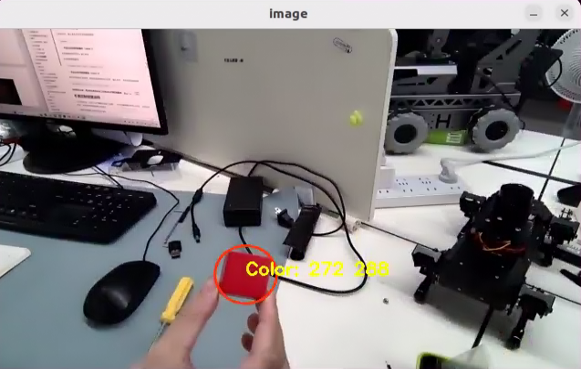

### 6.2.4 Program Analysis

#### 6.2.4.1 Launch File Analysis

The program source code is located at:

**/home/ubuntu/ros2_ws/src/example/example/opencv_example/color_recognition_node.launch.py**

* Defines the content to be launched, acquires the path to the controller package, and launches the `color_detect_node.launch` and `controller.launch` files. Creates the ROS2 node `color_recognition_node`, defines the executable file, and finally returns the launch items list.

```python
def launch_setup(context):
    compiled = os.environ['need_compile']

    if compiled == 'True':
        controller_package_path = get_package_share_directory('controller')
        example_package_path = get_package_share_directory('example')
    else:
        controller_package_path = '/home/ubuntu/ros2_ws/src/driver/controller'
        example_package_path = '/home/ubuntu/ros2_ws/src/example'
    color_detect_launch = IncludeLaunchDescription(
        PythonLaunchDescriptionSource(
            os.path.join(example_package_path, 'example/opencv_example/color_detect_node.launch.py')),
    )
    controller_launch = IncludeLaunchDescription(
        PythonLaunchDescriptionSource(
            os.path.join(controller_package_path, 'launch/controller.launch.py')),
    )

    color_recognition_node = Node(
        package='example',
        executable='color_recognition',
        output='screen',
    )

    return [
            controller_launch,
            color_detect_launch,
            color_recognition_node,
            ]
```

* Entry function of the ROS2 Launch file, defining the content to be launched.

```python
def generate_launch_description():
    return LaunchDescription([
        OpaqueFunction(function = launch_setup)
    ])
```

* Creates a `LaunchService` and passes the launch content to it for execution.

```python
if __name__ == '__main__':
    # Create a LaunchDescription object
    ld = generate_launch_description()

    ls = LaunchService()
    ls.include_launch_description(ld)
    ls.run()
```

#### 6.2.4.2 Python Source Code Analysis

The program source code is located at:

**/home/ubuntu/ros2_ws/src/example/example/opencv_example/include/color_recognition_node.py**

* The program sets up subscriptions to the `'/color_detect/color_info'` and `'/color_detect/image_result'` topics, while also creating the `'~/start'` service. Additionally, it establishes a client to request the `/controller_manager/init_finish` service and initializes the `buzzer_pub` and `joints_pub` publishers. Finally, it configures the color detection and ROI clients before starting a timer.

```python
	self.create_subscription(ColorsInfo, '/color_detect/color_info', self.get_color_callback, 1)
	self.create_subscription(Image, '/color_detect/image_result', self.image_callback, 1)
	timer_cb_group = ReentrantCallbackGroup()
	self.create_service(Trigger, '~/start', self.start_srv_callback, callback_group=timer_cb_group) # Enter the feature

	self.client = self.create_client(Trigger, '/controller_manager/init_finish')
	self.client.wait_for_service()
	self.buzzer_pub = self.create_publisher(BuzzerState, 'ros_robot_controller/set_buzzer', 1)
	self.joints_pub = self.create_publisher(ServosPosition, 'servo_controller', 1)

	self.set_color_client = self.create_client(SetColorDetectParam, '/color_detect/set_param', callback_group=timer_cb_group)
	self.set_roi_client = self.create_client(SetCircleROI, '/color_detect/set_circle_roi', callback_group=timer_cb_group)
	self.set_color_client.wait_for_service()
	self.set_roi_client.wait_for_service()

	self.timer = self.create_timer(0.0, self.init_process, callback_group=timer_cb_group)
```

* This initialization function sets the robot's posture and robotic arm servo positions, calls the `start_srv_callback` service callback function, and starts two threads to execute the target functions.

```python
	def init_process(self):
        self.timer.cancel()

        self.start_srv_callback(Trigger.Request(), Trigger.Response())
        self.controller.set_build_in_pose('DEFAULT_POSE', 1)
        joint_angle = [500, 750, 200, 150, 500, 600]
        set_servo_position(self.joints_pub, 1, ((19, joint_angle[0]), (20, joint_angle[1]), (21, joint_angle[2]), (22, joint_angle[3]), (23, joint_angle[4]), (24, joint_angle[5])))

        threading.Thread(target=self.action, daemon=True).start()
        threading.Thread(target=self.main, daemon=True).start()
        self.create_service(Trigger, '~/init_finish', self.get_node_state)
        self.get_logger().info('\033[1;32m%s\033[0m' % 'start')
```

* Service callback function used to start the color recognition function and return a response.

```python
    def start_srv_callback(self, request, response):
        self.get_logger().info('\033[1;32m%s\033[0m' % "start color recognition")

        msg = SetColorDetectParam.Request()
        msg_red = ColorDetect()
        msg_red.color_name = 'red'
        msg_red.detect_type = 'circle'
        msg_green = ColorDetect()
        msg_green.color_name = 'green'
        msg_green.detect_type = 'circle'
        msg_blue = ColorDetect()
        msg_blue.color_name = 'blue'
        msg_blue.detect_type = 'circle'
        msg.data = [msg_red, msg_green, msg_blue]
        res = self.send_request(self.set_color_client, msg)
        if res.success:
            self.get_logger().info('\033[1;32m%s\033[0m' % 'set color success')
        else:
            self.get_logger().info('\033[1;32m%s\033[0m' % 'set color fail')
         
        response.success = True
        response.message = "start"
        return response
```

* Action function configuring the corresponding actions to execute after a color is detected.

```python
    def action(self):
        while self.running:
            if self.start_action:
                self.get_logger().info('\033[1;32mcolor: %s\033[0m' % self.target_color)
                msg = BuzzerState()
                msg.freq = 2500
                msg.on_time = 0.1
                msg.off_time = 0.5
                msg.repeat = 1
                self.buzzer_pub.publish(msg)
                if self.target_color == 'red':
                    set_servo_position(self.joints_pub, 0.5, (((22, 200), )))
                    time.sleep(0.5)
                    set_servo_position(self.joints_pub, 0.5, (((22, 100), )))
                    time.sleep(0.5)
                    set_servo_position(self.joints_pub, 0.5, (((22, 150), )))
                    time.sleep(0.5)
                elif self.target_color == 'green':
                    set_servo_position(self.joints_pub, 0.5, (((19, 400), )))
                    time.sleep(0.5)
                    set_servo_position(self.joints_pub, 0.5, (((19, 600), )))
                    time.sleep(0.5)
                    set_servo_position(self.joints_pub, 0.5, (((19, 500), )))
                    time.sleep(0.5)
                elif self.target_color == 'blue':
                    set_servo_position(self.joints_pub, 0.5, (((23, 400), )))
                    time.sleep(0.5)
                    set_servo_position(self.joints_pub, 0.5, (((23, 600), )))
                    time.sleep(0.5)
                    set_servo_position(self.joints_pub, 0.5, (((23, 500), )))
                    time.sleep(0.5)
                self.start_action = False
            else:
                time.sleep(0.01)
```

* Acquires the image, triggers corresponding actions via recognized colors, and finally displays the image.

```python
    def main(self):
        count = 0
        while self.running:
            try:
                image = self.image_queue.get(block=True, timeout=1)
            except queue.Empty:
                if not self.running:
                    break
                else:
                    continue
            if self.color in ['red', 'green', 'blue']:
                if not self.start_action :
                    self.count += 1
                    if self.count > 30:
                        self.count = 0
                        self.target_color = self.color
                        self.start_action = True
                else:
                    count = 0
            if image is not None:
                cv2.imshow('image', image)
                key = cv2.waitKey(1)
                if key == ord('q') or key == 27:  # Press Q or Esc to exit
                    self.running = False
        self.controller.run_action('init')
        rclpy.shutdown()
```

* Image reception and processing callback function.

```python
    def image_callback(self, msg):
        rgb_image = self.bridge.imgmsg_to_cv2(msg, 'rgb8')
        result_image = np.copy(rgb_image)

        try:
            with self.lock:
                result_image = self.image_proc(rgb_image, result_image)
        except Exception as e:
            self.get_logger().error(str(e))
        if self.display:
            cv2.imshow('image', cv2.cvtColor(result_image, cv2.COLOR_RGB2BGR))
            cv2.waitKey(1)
        self.result_publisher.publish(self.bridge.cv2_to_imgmsg(result_image, "rgb8"))
```

## 6.3 AprilTag Tag Recognition

### 6.3.1 Experiment Overview

First, the RGB image is obtained by subscribing to the topic message published by the camera node, and it undergoes grayscale conversion and scaling processing.

Next, tag information is acquired, such as the tag ID, tag center point, and corner coordinates.

Finally, camera calibration is performed to feed back the tag recognition results via the video feed.

### 6.3.2 Operation Steps

> [!NOTE]
> **Commands are strictly case-sensitive, and the Tab key can be used to auto-complete keywords.**

1. Power on the robot and connect it to the remote control software, VNC. For instructions on connecting to the remote desktop, refer to **[1. ROSpider User Manual \ 1.4 Development Environment Setup](https://wiki.hiwonder.com/projects/ROSpider/en/raspberry-pi-version/docs/1_ROSpider_User_Manual.html#development-environment-setup)**.
2. Click the desktop icon  to open the terminal.
3. Enter the command to stop the auto-start service.

```
~/.stop_ros.sh
```

4. Enter the command to start the tag recognition feature.

```
ros2 launch example apriltag_recognition.launch.py
```

5. To close the feature, press **Ctrl + C** in the terminal interface. If the feature does not close immediately, try pressing **Ctrl + C** a few more times.

### 6.3.3 Program Outcome

After starting the feature, place the tag card within the camera's field of view. When the tag is recognized, a coordinate axis will be drawn at the tag on the video feed, the four corners of the tag will be marked with small blue dots, and the tag's ID will be displayed.

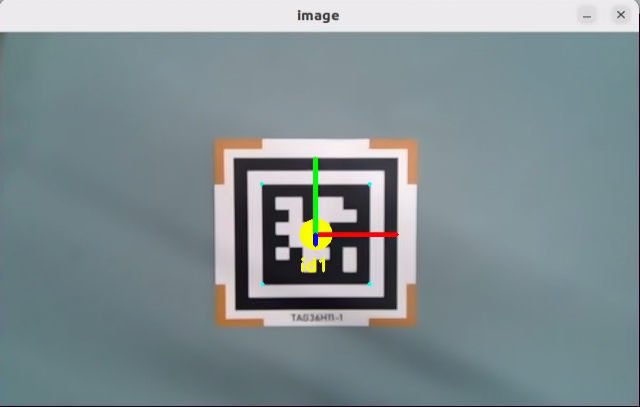

### 6.3.4 Program Analysis

#### 6.3.4.1 Launch File Analysis

The program source code is located at:

**/home/ubuntu/ros2_ws/src/example/example/opencv_example/apriltag_recognition.launch.py**

* The program defines the content to be launched, acquires the path to the peripherals package, and launches the `depth_camera_launch` file. Creates the ROS2 node `apriltag_recognition_node`, defines the executable file, and finally returns the launch items list.

```python
def launch_setup(context):
    compiled = os.environ['need_compile']
    enable_display = LaunchConfiguration('enable_display', default='True')
    enable_display_arg = DeclareLaunchArgument('enable_display', default_value=enable_display)

    
    if compiled == 'True':
        peripherals_package_path = get_package_share_directory('peripherals')
    else:
        peripherals_package_path = '/home/ubuntu/ros2_ws/src/peripherals'
    
    depth_camera_launch = IncludeLaunchDescription(
        PythonLaunchDescriptionSource(
            os.path.join(peripherals_package_path, 'launch/depth_camera.launch.py')),
    )


    apriltag_recognition_node = Node(
        package='example',
        executable='apriltag_recognition',
        output='screen',
        parameters=[{'enable_display': enable_display,}]

    )

    return [
            enable_display_arg,
            depth_camera_launch,
            apriltag_recognition_node,
            ]
```

* Entry function of the ROS2 Launch file, defining the content to be launched.

```python
def generate_launch_description():
    return LaunchDescription([
        OpaqueFunction(function = launch_setup)
    ])
```

* Creates a `LaunchService` and passes the launch content to it for execution.

```python
if __name__ == '__main__':
    # Create a LaunchDescription object
    ld = generate_launch_description()

    ls = LaunchService()
    ls.include_launch_description(ld)
    ls.run()
```

#### 6.3.4.2 Python Source Code Analysis

The program source code is located at:

**/home/ubuntu/ros2_ws/src/example/example/opencv_example/include/apriltag_recognition.py**

* The parameter `OBJP` refers to the world coordinates of the feature points. The parameter `AXIS` refers to the 3D coordinates of three-dimensional points in the world coordinate system. The parameter `CIRCLE` is an array representing a circular set of points.

```python
OBJP = np.array([[-1, -1,  0],
                 [ 1, -1,  0],
                 [-1,  1,  0],
                 [ 1,  1,  0],
                 [ 0,  0,  0]], dtype=np.float32)

AXIS = np.float32([[0, 0, 0],
                   [1.5, 0, 0], 
                   [0, 1.5, 0], 
                   [0, 0, 1.5]])
CIRCLE = np.float32([[0.3 * math.cos(math.radians(i)), 0.3 * math.sin(math.radians(i)), 0] for i in range(360)])
AXIS = np.append(AXIS, CIRCLE, axis=0)
```

* The `draw` function is used to draw the four points and three coordinate axes.

```python
def draw(img, corners, imgpts):
    imgpts = np.int32(imgpts).reshape(-1,2)
    cv2.drawContours(img, [imgpts[4:]], -1, (255, 255, 0), -1)
    cv2.line(img, tuple(imgpts[0]), tuple(imgpts[1]), (255, 0, 0), 3)
    cv2.line(img, tuple(imgpts[0]), tuple(imgpts[2]), (0, 255, 0), 3)
    cv2.line(img, tuple(imgpts[0]), tuple(imgpts[3]), (0, 0, 255), 3)
    return img
```

* Sets the camera intrinsic matrix and distortion coefficients, subscribes to images and camera information, and publishes tag information and image processing results.

```python
        self.camera_intrinsic = np.array([[619.063979, 0, 302.560920],
                                          [0, 613.745352, 237.714934],
                                          [0, 0, 1]], dtype=np.float32)
        self.dist_coeffs = np.array([0.103085, -0.175586, -0.001190, -0.007046, 0.000000])
        self.tag_detector = apriltag("tag36h11")

        self.image_sub = self.create_subscription(Image, '/depth_cam/rgb/image_raw' , self.image_callback, 1)  # Camera image subscription
        self.camera_info_sub = self.create_subscription(CameraInfo, '/depth_cam/rgb/camera_info' , self.camera_info_callback, 1)  # Camera info subscription
        self.apriltag_info_pub = self.create_publisher(ApriltagsInfo, '~/apriltag_info', 1) # Tag info publishing
        self.result_publisher = self.create_publisher(Image, '~/image_result', 1)  # Image processing result publishing
        # self.declare_parameter('enable_display', False)
        self.display = self.get_parameter('enable_display').value
```

* `camera_info_callback`: A callback function used to handle subscriptions to camera info messages, updating the camera intrinsic matrix and distortion coefficients.

```python
    def camera_info_callback(self, msg):
        with self.lock:
            self.camera_intrinsic = np.array(msg.k).reshape(3, 3)
            self.dist_coeffs = np.array(msg.d)
```

* `image_callback`: A callback function used to handle image messages from the image subscriber, including image conversion, processing, visual display, and publishing the processed image to a designated topic.

```python
    def image_callback(self, msg):
        rgb_image = self.bridge.imgmsg_to_cv2(msg, 'rgb8')
        result_image = np.copy(rgb_image)

        try:
            with self.lock:
                result_image = self.image_proc(rgb_image, result_image)
        except Exception as e:
            self.get_logger().error(str(e))
        if self.display:
            cv2.imshow('image', cv2.cvtColor(result_image, cv2.COLOR_RGB2BGR))
            cv2.waitKey(1)
        self.result_publisher.publish(self.bridge.cv2_to_imgmsg(result_image, "rgb8"))
```

* Draws tag corners and center points, and performs pose estimation. The parameter `corners` refers to the pixel coordinates of feature points in the image. The parameter `rvecs` refers to the rotation vector transforming the world coordinate system to the camera coordinate system. The parameter `tvecs` refers to the translation vector transforming the world coordinate system to the camera coordinate system.

```python
    tag_center = common.point_remapped(tag_center, (int(w/2), int(h/2)), (w, h))
    corners = np.array([lb, rb, lt, rt, tag_center], dtype=np.float32).reshape(5, -1)
    ret, rvecs, tvecs = cv2.solvePnP(OBJP, corners, self.camera_intrinsic, self.dist_coeffs)
    imgpts, _ = cv2.projectPoints(AXIS, rvecs, tvecs, self.camera_intrinsic, self.dist_coeffs)
```

## 6.4 AR Vision

### 6.4.1 Experiment Overview

First, the RGB image is obtained by subscribing to the topic message published by the camera node, and it undergoes grayscale conversion and scaling processing.

Next, tags are detected to acquire tag information, such as the tag ID, tag center point, and corner coordinates.

Finally, through operations like model projection and polygon filling, a 3D image is rendered at a specified location on the video feed.

### 6.4.2 Operation Steps

> [!NOTE]
> **Commands are strictly case-sensitive, and the Tab key can be used to auto-complete keywords.**

1. Power on the robot and connect it to the remote control software, VNC. For instructions on connecting to the remote desktop, refer to **[1. ROSpider User Manual \ 1.4 Development Environment Setup](https://wiki.hiwonder.com/projects/ROSpider/en/raspberry-pi-version/docs/1_ROSpider_User_Manual.html#development-environment-setup)**.
2. Click the desktop icon  to open the terminal.
3. Enter the command to stop the auto-start service.

```
~/.stop_ros.sh
```

4. Enter the command to start the AR vision feature.

```
ros2 launch example ar.launch.py
```

5. To close the feature, press **Ctrl + C** in the terminal interface. If the feature does not close immediately, try pressing **Ctrl + C** a few more times.

### 6.4.3 Program Outcome

After starting the feature, place the tag card within the camera's field of view. When the tag is recognized, a coordinate axis will be drawn at the tag on the video feed, the four corners of the tag will be marked with small blue dots, and the tag's ID will be displayed.

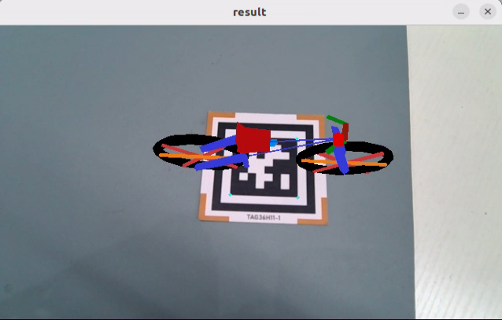

### 6.4.4 Program Analysis

#### 6.4.4.1 Launch File Analysis

The program source code is located at:

**/home/ubuntu/ros2_ws/src/example/example/opencv_example/ar.launch.py**

* The program defines the content to be launched, acquires the path to the peripherals package, and launches the `depth_camera_launch` file. Creates the ROS2 node `ar_node`, defines the executable file, and finally returns the launch items list.

```python
def launch_setup(context):

    compiled = os.environ['need_compile']
    model = LaunchConfiguration('model', default='bicycle')
    model_arg = DeclareLaunchArgument('model', default_value=model)

    if compiled == 'True':
        peripherals_package_path = get_package_share_directory('peripherals')
    else:
        peripherals_package_path = '/home/ubuntu/ros2_ws/src/peripherals'
    
    depth_camera_launch = IncludeLaunchDescription(
        PythonLaunchDescriptionSource(
            os.path.join(peripherals_package_path, 'launch/depth_camera.launch.py')),
    )

    ar_node = Node(
        package='example',
        executable='ar',
        output='screen',
        parameters=[{"model": model}],
    )

    return [
            model_arg,
            depth_camera_launch,
            ar_node,
            ]
```

* Entry function of the ROS2 Launch file, defining the content to be launched.

```python
def generate_launch_description():
    return LaunchDescription([
        OpaqueFunction(function = launch_setup)
    ])
```

* Creates a `LaunchService` and passes the launch content to it for execution.

```python
if __name__ == '__main__':
    # Create a LaunchDescription object
    ld = generate_launch_description()

    ls = LaunchService()
    ls.include_launch_description(ld)
    ls.run()
```

#### 6.4.4.2 Python Source Code Analysis

The program source code is located at:

**/home/ubuntu/ros2_ws/src/example/example/opencv_example/include/ar.py**

* Obtains the default storage path for the model.

```
MODEL_PATH = os.path.join(os.path.abspath(os.path.join(os.path.split(os.path.realpath(__file__))[0])), '3d_model')
```

* The `draw_rectangle` function is used to draw a cube. The parameter `img` is the image on which to draw the cube. The parameter `imgpts` refers to the corner points of the cube. Finally, it returns the image with the drawn cube.

```python
def draw_rectangle(img, imgpts):
    imgpts = np.int32(imgpts).reshape(-1, 2)
    cv2.drawContours(img, [imgpts[:4]], -1, (0, 255, 0), -3)  # Draw contour points, filled
    for i, j in zip(range(4), range(4, 8)):
        cv2.line(img, tuple(imgpts[i]), tuple(imgpts[j]), (255), 3)  # Draw points connected by lines
    cv2.drawContours(img, [imgpts[4:]], -1, (0, 0, 255), 3)  # Draw contour points, unfilled
    
    return img
```

* Obtains related information about the 3D image, such as vertex position information and color information.

```python
	if self.target_model != 'rectangle':  # If the cube is not being drawn
		# Load the model
		obj = obj_load(os.path.join(MODEL_PATH, self.target_model + '.obj'), swapyz=True)
		obj.faces = obj.faces[::-1]
		new_faces = []
		# Analyze the model and get the point coordinates
		for face in obj.faces:
			face_vertices = face[0]
			points = []
			colors = []
			for vertex in face_vertices:
				data = obj.vertices[vertex - 1]
				points.append(data[:3])
				if self.target_model != 'cow' and self.target_model != 'wolf':
					colors.append(data[3:])
			scale_matrix = np.array([[1, 0, 0], [0, 1, 0], [0, 0, 1]]) * MODELS_SCALE[self.target_model]  # Scale
			points = np.dot(np.array(points), scale_matrix)
```

* Conversion from Euler angles to rotation matrix: Converts Euler angles to a rotation matrix to subsequently adjust the viewing angle of the 3D image. The parameter `'xyz'` is the axis of rotation. The parameter `(0, 0, 180)` represents the rotation angle, namely the Euler angles. The parameter `degrees=True` dictates the unit of the rotation angle. If set to `True`, the unit is degrees.

```python
if self.target_model == 'bicycle':
	points = np.array([[p[0] - 670, p[1] - 350, p[2]] for p in points])
	points = R.from_euler('xyz', (0, 0, 180), degrees=True).apply(points)
elif self.target_model == 'fox':
	points = np.array([[p[0], p[1], p[2]] for p in points])
	points = R.from_euler('xyz', (0, 0, -90), degrees=True).apply(points)
elif self.target_model == 'chair':
	points = np.array([[p[0], p[1], p[2]] for p in points])
	points = R.from_euler('xyz', (0, 0, -90), degrees=True).apply(points)
else:
	points = np.array([[p[0], p[1], p[2]] for p in points])
```

* `image_callback`: A callback function used to handle image messages from the image subscriber, including image conversion, processing, visual display, and publishing the processed image to a designated topic.

```python
    def image_callback(self, ros_image):
        # Image callback
        # Convert ROS image into numpy format
        cv_image = self.bridge.imgmsg_to_cv2(ros_image, "rgb8")
        rgb_image = np.array(cv_image, dtype=np.uint8)
        result_image = np.copy(rgb_image)
        with self.lock:
            try:
                # Process image
                result_image = self.image_proc(rgb_image, result_image)
            except Exception as e:
                self.get_logger().info(str(e))
            cv2.imshow("result", cv2.cvtColor(result_image, cv2.COLOR_RGB2BGR))
            cv2.waitKey(1)
        # Convert opencv format into ros format
        self.result_publisher.publish(self.bridge.cv2_to_imgmsg(result_image, "rgb8"))
```

* Creates and reshapes the coordinate system position array for the four corners and center point of the tag. The parameter `corners` refers to the pixel coordinates of the feature points in the image. The parameter `rvecs` refers to the rotation vector transforming the world coordinate system to the camera coordinate system. The parameter `tvecs` refers to the translation vector transforming the world coordinate system to the camera coordinate system.

```python
		corners = np.array([lb, rb, lt, rt, tag_center], dtype=np.float32).reshape(5, -1)
		ret, rvecs, tvecs = cv2.solvePnP(OBJP, corners, self.camera_intrinsic, self.dist_coeffs)
	if self.target_model == 'rectangle':  
		imgpts, jac = cv2.projectPoints(AXIS, rvecs, tvecs, self.camera_intrinsic, self.dist_coeffs)
```

## 6.5 Color Block Coordinate Positioning

### 6.5.1 Experiment Overview

First, the RGB image is obtained by subscribing to the topic message published by the camera node. The image undergoes scaling and Gaussian blur processing, and its color space is converted from RGB to LAB.

Subsequently, the image is subjected to binarization, erosion, and dilation to acquire the maximum contour of the target color within the image.

Finally, the recognition results are fed back through the video feed and the terminal interface.

### 6.5.2 Operation Steps

> [!NOTE]
> * **Commands are strictly case-sensitive, and the Tab key can be used to auto-complete keywords.**
> * **The recognizable colors for this feature are red, green, and blue.**
>

1. Power on the robot and connect it to the remote control software, VNC. For instructions on connecting to the remote desktop, refer to **[1. ROSpider User Manual \ 1.4 Development Environment Setup](https://wiki.hiwonder.com/projects/ROSpider/en/raspberry-pi-version/docs/1_ROSpider_User_Manual.html#development-environment-setup)**.
2. Click the desktop icon  to open the terminal.
3. Enter the command to stop the auto-start service.

```
~/.stop_ros.sh
```

4. Enter the command to start the color block coordinate positioning feature. To locate other colored blocks, change `red` to the desired color.

```
ros2 launch example color_position.launch.py color:=red
```

5. To close the feature, press **Ctrl + C** in the terminal interface. If the feature does not close immediately, try pressing **Ctrl + C** a few more times.

### 6.5.3 Program Outcome

> [!NOTE]
> **After starting the feature, ensure that no other objects containing the recognized color exist within the camera's field of view to avoid affecting the performance.**

After starting the feature, place the target object within the camera's field of view. When the target object is recognized, the buzzer will emit a short beep, the video feed will mark the target object with a circle of the corresponding color, and the color name will be printed in the terminal. Upon recognizing red, servo No. 22 will rotate once, upon recognizing blue, servo No. 23 will rotate once, and upon recognizing green, servo No. 19 will rotate once. The program can recognize red, blue, and green objects.

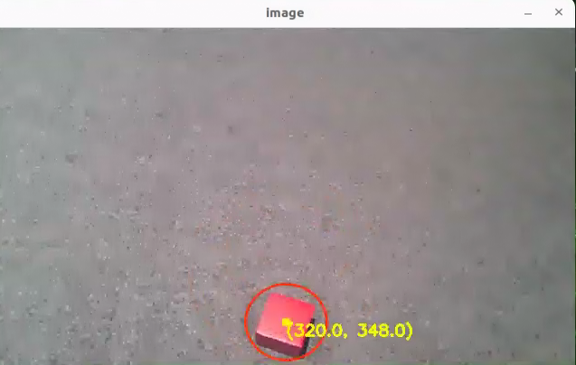

### 6.5.4 Program Analysis

#### 6.5.4.1 Launch File Analysis

The program source code is located at:

**/home/ubuntu/ros2_ws/src/example/example/opencv_example/color_position.launch.py**

* The program defines the content to be launched, acquires the path to the `controller` and `example` packages, and launches the `color_detect_node.launch` and `controller.launch` files. Creates the ROS2 node `color_position_node`, defines the executable file, and finally returns the launch items list.

```python
def launch_setup(context):
    compiled = os.environ['need_compile']
    color = LaunchConfiguration('color', default='red')
    color_arg = DeclareLaunchArgument('color', default_value=color)
    if compiled == 'True':
        controller_package_path = get_package_share_directory('controller')
        example_package_path = get_package_share_directory('example')
    else:
        controller_package_path = '/home/ubuntu/ros2_ws/src/driver/controller'
        example_package_path = '/home/ubuntu/ros2_ws/src/example'
    color_detect_launch = IncludeLaunchDescription(
        PythonLaunchDescriptionSource(
            os.path.join(example_package_path, 'example/opencv_example/color_detect_node.launch.py')),
    )
    controller_launch = IncludeLaunchDescription(
        PythonLaunchDescriptionSource(
            os.path.join(controller_package_path, 'launch/controller.launch.py')),
    )

    color_position_node = Node(
        package='example',
        executable='color_position',
        output='screen',
        parameters=[{'color': color}]
    )

    return [color_arg,
            controller_launch,
            color_detect_launch,
            color_position_node,
            ]
```

* Entry function of the ROS2 Launch file, defining the content to be launched.

```python
def generate_launch_description():
    return LaunchDescription([
        OpaqueFunction(function = launch_setup)
    ])
```

* Creates a `LaunchService` and passes the launch content to it for execution.

```python
if __name__ == '__main__':
    # Create a LaunchDescription object
    ld = generate_launch_description()

    ls = LaunchService()
    ls.include_launch_description(ld)
    ls.run()
```

#### 6.5.4.2 Python Source Code Analysis

The program source code is located at:

**/home/ubuntu/ros2_ws/src/example/example/opencv_example/include/color_position.py**

* Creates subscriptions to the `'/color_detect/color_info'` and `'/color_detect/image_result'` topics, creates the `'~/start'` service, and creates a client to request the `/controller_manager/init_finish` service. Creates publishers `buzzer_pub` and `joints_pub`, sets up the color detection and ROI clients, and finally creates a timer.

```python
    self.create_subscription(ColorsInfo, '/color_detect/color_info', self.get_color_callback, 1)
    self.create_subscription(Image, '/color_detect/image_result', self.image_callback, 1)
    timer_cb_group = ReentrantCallbackGroup()
    self.create_service(Trigger, '~/start', self.start_srv_callback, callback_group=timer_cb_group) # Enter the feature

    self.client = self.create_client(Trigger, '/controller_manager/init_finish')
    self.client.wait_for_service()
    self.controller = step_controller.StepController()
    self.buzzer_pub = self.create_publisher(BuzzerState, 'ros_robot_controller/set_buzzer', 1)
    self.joints_pub = self.create_publisher(ServosPosition, 'servo_controller', 1)

    self.set_color_client = self.create_client(SetColorDetectParam, '/color_detect/set_param', callback_group=timer_cb_group)
    self.set_roi_client = self.create_client(SetCircleROI, '/color_detect/set_circle_roi', callback_group=timer_cb_group)
    self.set_color_client.wait_for_service()
    self.set_roi_client.wait_for_service()
    
    self.timer = self.create_timer(0.0, self.init_process, callback_group=timer_cb_group)
```

* This initialization function initializes robot posture and robotic arm servo positions, calls the `start_srv_callback` service callback function, and starts a thread to execute the target function.

```python
    def init_process(self):
        self.timer.cancel()

        self.start_srv_callback(Trigger.Request(), Trigger.Response())
        self.controller.set_build_in_pose('DEFAULT_POSE', 1)
        joint_angle = [500, 670, 40, 210, 500, 600]
        set_servo_position(self.joints_pub, 1, ((19, joint_angle[0]), (20, joint_angle[1]), (21, joint_angle[2]), (22, joint_angle[3]), (23, joint_angle[4]), (24, joint_angle[5])))

        threading.Thread(target=self.main, daemon=True).start()
        self.create_service(Trigger, '~/init_finish', self.get_node_state)
        self.get_logger().info('\033[1;32m%s\033[0m' % 'start')
```

* Service callback function used to start the color recognition function and return a response.

```python
    def start_srv_callback(self, request, response):
        self.get_logger().info('\033[1;32m%s\033[0m' % "start color position")

        msg = SetColorDetectParam.Request()
        color_msg = ColorDetect()
        color_msg.color_name = self.target_color
        color_msg.detect_type = 'circle'
      
        msg.data = [color_msg]
        res = self.send_request(self.set_color_client, msg)
        if res.success:
            self.get_logger().info('\033[1;32m%s\033[0m' % 'set color success')
        else:
            self.get_logger().info('\033[1;32m%s\033[0m' % 'set color fail')
         
        response.success = True
        response.message = "start"
        return response
```

* Acquires the image, recognizes the colored object, marks the center point, and finally displays the image.

```python
    def main(self):
        while self.running:
            try:
                image = self.image_queue.get(block=True, timeout=1)
            except queue.Empty:
                if not self.running:
                    break
                else:
                    continue
            if self.color in ['red', 'green', 'blue'] :
                self.count += 1
                if self.count > 30:
                    self.count = 0
                    self.target_color = self.color
            else:
                self.count = 0
            if image is not None:
                if self.center is not None:
                    cv2.circle(image, (int(self.center[0]), int(self.center[1])), 5, (0, 255, 255), -1)
                    string = "({:0.1f}, {:0.1f})".format(self.center[0], self.center[1])
                    cv2.putText(image, string, (int(self.center[0]), int(self.center[1] + 16)), cv2.FONT_HERSHEY_SIMPLEX, 0.6, (0, 255, 255), 2)
                cv2.imshow('image', image)
                key = cv2.waitKey(1)
                if key == ord('q') or key == 27:  # Press Q or Esc to exit
                    self.running = False
        rclpy.shutdown()

```

* Image reception and processing callback function.

```python
    def image_callback(self, msg):
        rgb_image = self.bridge.imgmsg_to_cv2(msg, 'rgb8')
        result_image = np.copy(rgb_image)

        if self.id :
            self.get_logger().info(f"ID: {str(self.id)}, X: {self.center[0]:.2f}, Y: {self.center[1]:.2f}, W: {self.width:.2f}")

        cv2.imshow('image', cv2.cvtColor(result_image, cv2.COLOR_RGB2BGR))
        cv2.waitKey(1)
```

## 6.6 Color Tracking

### 6.6.1 Experiment Overview

First, the RGB image is obtained by subscribing to the topic message published by the camera node. The image undergoes scaling and Gaussian blur processing, and its color space is converted from RGB to LAB.

Subsequently, the image is subjected to binarization, erosion, and dilation to acquire the maximum contour of the target color within the image.

Finally, the target contour is marked on the video feed. And based on the relative position of the contour center and the image center, ROSpider adjusts its own position to achieve tracking of the target contour.

### 6.6.2 Operation Steps

> [!NOTE]
> * **Commands are strictly case-sensitive, and the Tab key can be used to auto-complete keywords.**
>

1. Power on the robot and connect it to the remote control software, VNC. For instructions on connecting to the remote desktop, refer to **[1. ROSpider User Manual \ 1.4 Development Environment Setup](https://wiki.hiwonder.com/projects/ROSpider/en/raspberry-pi-version/docs/1_ROSpider_User_Manual.html#development-environment-setup)**.
2. Click the desktop icon  to open the terminal.
3. Enter the command to stop the auto-start service.

```
~/.stop_ros.sh
```

4. Enter the command to start the color block tracking node.

```
ros2 launch app object_tracking_node.launch.py debug:=true
```

5. Open another terminal, enter the command, and press **Enter** to start the feature:

```
ros2 service call /object_tracking/enter std_srvs/srv/Trigger {}
```

6. Left-click the mouse in the video feed to select the object to be tracked.

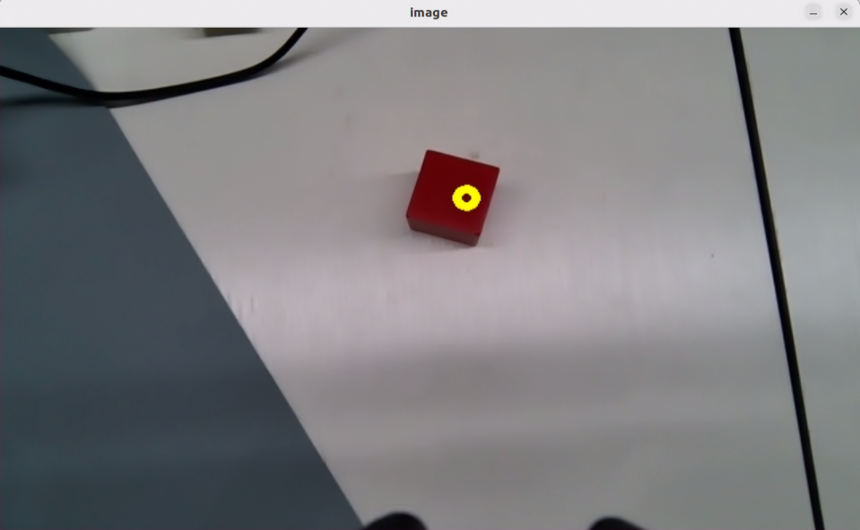

7. Next, enter the command in the current terminal and press **Enter** to initiate tracking:

```
ros2 service call /object_tracking/set_running std_srvs/srv/SetBool "{data: True}"
```

8. To close the feature, press **Ctrl + C** in the first terminal interface. If the feature does not close immediately, try pressing **Ctrl + C** a few more times.

### 6.6.3 Program Outcome

> [!NOTE]
> **After starting the feature, ensure that no other objects containing the recognized color exist within the camera's field of view to avoid affecting the performance.**

After starting the feature, place the target object within the camera's field of view. When the target object is recognized, ROSpider will track the object.

### 6.6.4 Program Analysis

#### 6.6.4.1 Launch File Analysis

The program source code is located at:

**/home/ubuntu/ros2_ws/src/app/launch/object_tracking_node.launch.py**

* The program defines the content to be launched, acquires the path to the `controller` and `peripherals` packages, and launches the `depth_camera.launch` and `controller.launch` files. Defines the `object_tracking` executable file and finally returns the launch items list.

```python
def launch_setup(context):
    compiled = os.environ['need_compile']
    debug = LaunchConfiguration('debug', default='false')
    debug_arg = DeclareLaunchArgument('debug', default_value=debug)
    if compiled == 'True':
        controller_package_path = get_package_share_directory('controller')
        peripherals_package_path = get_package_share_directory('peripherals')
    else:
        controller_package_path = '/home/ubuntu/ros2_ws/src/driver/controller'
        peripherals_package_path = '/home/ubuntu/ros2_ws/src/peripherals'


    object_tracking_node = GroupAction([
        IncludeLaunchDescription(
            PythonLaunchDescriptionSource(
                os.path.join(peripherals_package_path, 'launch/depth_camera.launch.py')),
            condition=IfCondition(debug),
            ),

        IncludeLaunchDescription(
            PythonLaunchDescriptionSource(
                os.path.join(controller_package_path, 'launch/controller.launch.py')),
            condition=IfCondition(debug),
            ),

        Node(
            package='app',
            executable='object_tracking',
            output='screen',
            parameters=[{'debug': debug}],
            ),
    ])

    return [debug_arg,
            object_tracking_node,
            ]
```

* The entry function of the `ROS2 Launch` file defines the content to be launched.

```python
def generate_launch_description():
    return LaunchDescription([
        OpaqueFunction(function = launch_setup)
    ])
```

* Creates a `LaunchService` and passes the launch content to it for execution.

```python
if __name__ == '__main__':
    # Create a LaunchDescription object
    ld = generate_launch_description()**

    ls = LaunchService()
    ls.include_launch_description(ld)
    ls.run()
```

#### 6.6.4.2 Python Source Code Analysis

The program source code is located at:

**/home/ubuntu/ros2_ws/src/app/app/object_tracking.py**

* Image processing, including color space conversion, binarization, erosion, dilation, and selecting objects of an appropriate area size.

```python
    mask = cv2.inRange(image, lowerb, upperb) # Binarization

    eroded = cv2.erode(mask, cv2.getStructuringElement(cv2.MORPH_RECT, (3, 3)))  # Erode
    dilated = cv2.dilate(eroded, cv2.getStructuringElement(cv2.MORPH_RECT, (3, 3)))  # Dilate
    contours = cv2.findContours(dilated, cv2.RETR_EXTERNAL, cv2.CHAIN_APPROX_NONE)[-2]  # Find contours
    contour_area = map(lambda c: (c, math.fabs(cv2.contourArea(c))), contours)  # Calculate the area of each contour
    contour_area = list(filter(lambda c: c[1] > 40, contour_area))  # Remove contours with area that is too small

```

* The initialization process for the ROS2 node, including loading data and creating queues, clients, services, and publishers.

```python
        self.lab_data = common.get_yaml_data("/home/ubuntu/software/lab_tool/lab_config.yaml")
        self.image_queue = queue.Queue(2)
        self.controller = controller_client.ControllerClient()
        self.cmd_vel_pub = self.create_publisher(Twist, '/controller/cmd_vel', 1)
        self.result_publisher = self.create_publisher(Image, '~/image_result',  1)
        self.enter_srv = self.create_service(Trigger, '~/enter', self.enter_srv_callback)
        self.exit_srv = self.create_service(Trigger, '~/exit', self.exit_srv_callback)
        self.set_running_srv = self.create_service(SetBool, '~/set_running', self.set_running_srv_callback)
        self.set_color_srv = self.create_service(SetString, '~/set_color', self.set_color_srv_callback)
        self.set_target_color_srv = self.create_service(SetPoint, '~/set_target_color', self.set_target_color_srv_callback)
        self.get_target_color_srv = self.create_service(Trigger, '~/get_target_color', self.get_target_color_srv_callback)
        self.set_threshold_srv = self.create_service(SetFloat64, '~/set_threshold', self.set_threshold_srv_callback)
        self.joints_pub = self.create_publisher(ServosPosition, 'servo_controller', 1)
        self.cmd_param_pub = self.create_publisher(CmdParam, '/step_controller/cmd_param', 1) # Walking posture control  
```

* Acquires the image, converts the image from RGB to BGR color space using OpenCV, and sets the window position and mouse click event callback function.

```python
    def main(self):
        while True:
            try:
                image = self.image_queue.get(block=True, timeout=1)
            except queue.Empty:
                continue

            result = cv2.cvtColor(image, cv2.COLOR_RGB2BGR)
 
            cv2.imshow("image", cv2.resize(result, (display_size[0], display_size[1])))
            if self.debug and not self.set_callback:
                self.set_callback = True
                # Set callback function for mouse clicking event
                cv2.setMouseCallback("image", self.mouse_callback)
            k = cv2.waitKey(1)
            if k != -1:
                break
            if self.debug and not self.set_above:
                cv2.moveWindow('image', 1920 - display_size[0], 0)
                os.system("wmctrl -r image -b add,above")
                self.set_above = True
        rclpy.shutdown()
```

* Defines the callback function for the mouse click event. When the mouse is clicked, the X and Y positions are recorded and converted to coordinates relative to the image width and height.

```python
    def mouse_callback(self, event, x, y, flags, param):
        if event == cv2.EVENT_LBUTTONDOWN:
            self.get_logger().info("x:{} y{}".format(x, y))
            msg = SetPoint.Request()
            if self.image_height is not None and self.image_width is not None:
                msg.data.x = x / display_size[0]
                msg.data.y = y / display_size[1]
                self.set_target_color_srv_callback(msg, SetPoint.Response())
```

* `enter_srv_callback` service callback function, executed when a service request is received. Used to initialize and reset variables and settings, such as initial robotic arm position, initial robot posture, and to end the current running state.

```python
    def enter_srv_callback(self, request, response):
        self.get_logger().info('\033[1;32m%s\033[0m' % 'object tracking enter')
        with self.lock:
            self.is_running = False
            self.threshold = 0.5
            self.tracker = None
            self.color_picker = None
            self.dist_threshold = 0.3
            self.color = ''
            if self.image_sub is None:
                self.image_sub = self.create_subscription(Image, '/depth_cam/rgb/image_raw', self.image_callback, 1)  # Subscribe to the camera

            set_servo_position(self.joints_pub, 1, ((24, 500), (23, 500), (22, 150), (21, 130), (20, 720), (19, 500)))

            cmd_param = CmdParam()
            cmd_param.pose = 'DEFAULT_POSE'
            cmd_param.gait = 1
            cmd_param.height = 10
            cmd_param.period = 1.0
            self.cmd_param_pub.publish(cmd_param)
        response.success = True
        response.message = "enter"
        return response

```

* Processes image data from the camera, executes tasks such as color picking and object tracking, and publishes control commands based on tracking results.

```python
    def image_callback(self, ros_image):
        # Convert RGB format of ROS to that of OpenCV
        cv_image = self.bridge.imgmsg_to_cv2(ros_image, "rgb8")**
        rgb_image = np.array(cv_image, dtype=np.uint8)
        self.image_height, self.image_width = rgb_image.shape[:2]

        result_image = np.copy(rgb_image)  # The image used for displaying the result
        with self.lock:
            if self.use_color_picker:
                # Color picker and object tracking are mutually exclusive. If the color picker exists, start picking colors
                if self.color_picker is not None:  # Color picker exists
                    target_color, result_image = self.color_picker(rgb_image, result_image)
                    if target_color is not None:
                        self.color_picker = None
                        self.tracker = ObjectTracker(target_color, self)
                        # self.get_logger().info("target color: {}".format(target_color))**
                else:
                    if self.tracker is not None:
                        try:
                            result_image, twist = self.tracker(rgb_image, result_image, self.threshold)
                            if self.is_running:
                                self.cmd_vel_pub.publish(twist)
                            else:
                                self.tracker.pid_dist.clear()
                                self.tracker.pid_yaw.clear()
                        except Exception as e:
                            self.get_logger().error(str(e))
            else:
                if self.color in common.range_rgb:
                    self.tracker = ObjectTracker([None, common.range_rgb[self.color]], self)
                    result_image, twist = self.tracker(rgb_image, result_image, self.threshold, self.lab_data['lab'][self.camera_type][self.color], False)
                    if self.is_running:
                        self.cmd_vel_pub.publish(twist)
                    else:
                        self.tracker.pid_dist.clear()
                        self.tracker.pid_yaw.clear()
```

## 6.7 AprilTag Tag Positioning

### 6.7.1 Experiment Overview

First, convert the image from RGB to grayscale using the `cvtColor` function. Next, recognize the tag via the `tag_detector.detect` function to obtain the tag's ID, center point, and coordinates for its four corners. Finally, encircle the four corners of the tag, draw the tag's 3D coordinate axis, and display the tag's ID and coordinate position.

### 6.7.2 Operation Steps

> [!NOTE]
> **Commands are strictly case-sensitive, and the Tab key can be used to auto-complete keywords.**

1. Power on the robot and connect it to the remote control software, VNC. For instructions on connecting to the remote desktop, refer to **[1. ROSpider User Manual \ 1.4 Development Environment Setup](https://wiki.hiwonder.com/projects/ROSpider/en/raspberry-pi-version/docs/1_ROSpider_User_Manual.html#development-environment-setup)**.
2. Click the desktop icon  to open the terminal.
3. Enter the command to stop the auto-start service.

```
~/.stop_ros.sh
```

4. Enter the command to start the tag positioning feature.

```
ros2 launch example apriltag_position.launch.py
```

5. To close the feature, press **Ctrl + C** in the terminal interface. If the feature does not close immediately, try pressing **Ctrl + C** a few more times.

### 6.7.3 Program Outcome

Once the program runs, it will recognize the tag in the frame, draw the 3D coordinate axis and corners at the tag's center, and print the recognized tag ID and coordinate position information to the terminal.

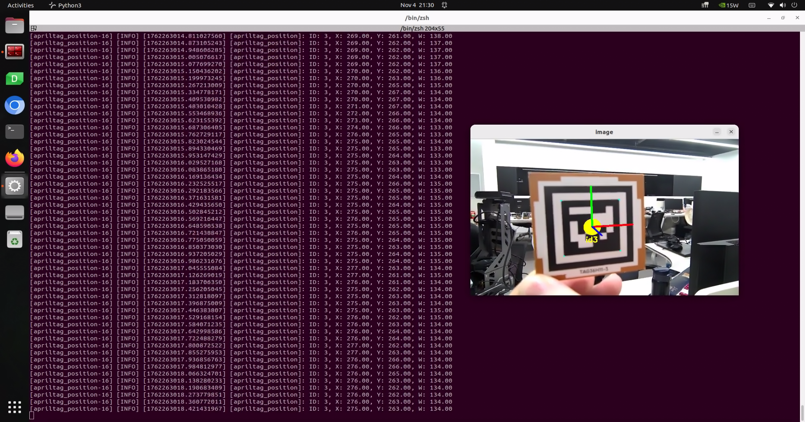

### 6.7.4 Program Analysis

#### 6.7.4.1 Launch File Analysis

The program source code is located at:

**/home/ubuntu/ros2_ws/src/example/example/opencv_example/apriltag_position.launch.py**

* The program defines the content to be launched, acquires the path to the `controller` and `example` packages, and launches the `apriltag_recognition.launch` and `controller.launch` files. Creates the ROS2 node `apriltag_position_node`, defines the executable file, and finally returns the launch items list.

```python
def launch_setup(context):
    compiled = os.environ['need_compile']
    enable_display = LaunchConfiguration('enable_display', default='false')
    enable_display_arg = DeclareLaunchArgument('enable_display', default_value=enable_display)

    if compiled == 'True':
        controller_package_path = get_package_share_directory('controller')
        example_package_path = get_package_share_directory('example')
    else:
        controller_package_path = '/home/ubuntu/ros2_ws/src/driver/controller'
        example_package_path = '/home/ubuntu/ros2_ws/src/example'

    controller_launch = IncludeLaunchDescription(
        PythonLaunchDescriptionSource(
            os.path.join(controller_package_path, 'launch/controller.launch.py')),
    )

    apriltag_recognition_launch = IncludeLaunchDescription(
        PythonLaunchDescriptionSource(
            os.path.join(example_package_path, 'example/opencv_example/apriltag_recognition.launch.py')),
            launch_arguments={
                'enable_display': enable_display,
            }.items()
    )

    apriltag_position_node = Node(
        package='example',
        executable='apriltag_position',
        output='screen',
    )

    return [
            enable_display_arg,
            controller_launch,
            apriltag_recognition_launch,
            apriltag_position_node,
            ]
```

* Entry function of the `ROS2 Launch` file, defining the content to be launched.

```python
def generate_launch_description():
    return LaunchDescription([
        OpaqueFunction(function = launch_setup)
    ])
```

* Creates a `LaunchService` and passes the launch content to it for execution.

```python
if __name__ == '__main__':
    # Create a LaunchDescription object
    ld = generate_launch_description()

    ls = LaunchService()
    ls.include_launch_description(ld)
    ls.run()
```

#### 6.7.4.2 Python Source Code Analysis

The program source code is located at:

**/home/ubuntu/ros2_ws/src/example/example/opencv_example/include/apriltag_position.py**

* Creates subscriptions to the `'/apriltag_detect/image_result'` and `'/apriltag_detect/apriltag_info'` topics, creates the `joints_pub` publisher, and finally creates a timer.

```python
	self.joints_pub = self.create_publisher(ServosPosition, 'servo_controller', 1)

	self.image_sub = self.create_subscription(Image, '/apriltag_detect/image_result' , self.image_callback, 1)  # Image subscription
	self.apriltag_info_sub = self.create_subscription(ApriltagsInfo, '/apriltag_detect/apriltag_info',  self.apriltag_info_callback, 1) # Tag info subscription

	self.timer = self.create_timer(0.0, self.init_process, callback_group=timer_cb_group)
```

* Initialization function, initializing robot posture and robotic arm servo positions.

```python
    def init_process(self):
        self.timer.cancel()

        self.controller.set_build_in_pose('DEFAULT_POSE', 1)
        joint_angle = [500, 750, 200, 150, 500, 600]
        set_servo_position(self.joints_pub, 1, ((19, joint_angle[0]), (20, joint_angle[1]), (21, joint_angle[2]), (22, joint_angle[3]), (23, joint_angle[4]), (24, joint_angle[5])))
```

* The `apriltag_info_callback` callback function is used to extract the center position, width, and ID of the tag.

```python
    def apriltag_info_callback(self, msg):
        data = msg.data
        if data != []:
            self.center = (data[0].x, data[0].y)
            self.width = data[0].w
            self.id = data[0].id
        else:
            self.id = ''
```

* Image reception and processing callback function, including image data format conversion and image display.

```python
    def image_callback(self, msg):
        rgb_image = self.bridge.imgmsg_to_cv2(msg, 'rgb8')
        result_image = np.copy(rgb_image)

        if self.id :
            self.get_logger().info(f"ID: {str(self.id)}, X: {self.center[0]:.2f}, Y: {self.center[1]:.2f}, W: {self.width:.2f}")

        cv2.imshow('image', cv2.cvtColor(result_image, cv2.COLOR_RGB2BGR))
        cv2.waitKey(1)
```

## 6.8 AprilTag Tag Tracking

### 6.8.1 Experiment Overview

As a visual positioning marker, AprilTag functions similarly to a QR code or barcode, assisting in quickly detecting markers and calculating relative positions. Its primary feature scope includes AR, robotics, and camera calibration.

The implementation steps for the tag tracking experiment are as follows:

First, tag recognition is required, involving operations such as image grayscale conversion and positioning.

Subsequently, the detected tags are encoded and decoded to acquire information such as tag coordinates and IDs, and the tag recognition results are fed back through the video feed and the terminal interface.

Finally, based on the distance between the tag and the camera, ROSpider is controlled to follow the tag, thereby achieving the tag tracking function.

### 6.8.2 Operation Steps

> [!NOTE]
> **Commands are strictly case-sensitive, and the Tab key can be used to auto-complete keywords.**

1. Power on the robot and connect it to the remote control software, VNC. For instructions on connecting to the remote desktop, refer to **[1. ROSpider User Manual \ 1.4 Development Environment Setup](https://wiki.hiwonder.com/projects/ROSpider/en/raspberry-pi-version/docs/1_ROSpider_User_Manual.html#development-environment-setup)**.
2. Click the desktop icon  to open the terminal.
3. Enter the command to stop the auto-start service.

```
~/.stop_ros.sh
```

4. Enter the command to start the tag tracking node.

```
ros2 launch example apriltag_track.launch.py
```

5. To close the feature, press **Ctrl + C** in the terminal interface. If the feature does not close immediately, try pressing **Ctrl + C** a few more times.

### 6.8.3 Program Outcome

Once the program is running, the robot will remain in place, stepping continuously using a tripod gait. When tag No. 1 appears in the frame, it will recognize the tag, draw the 3D coordinate axis and corners at the tag center, and the robot will simultaneously follow the tag as it moves.

### 6.8.4 Program Analysis

#### 6.8.4.1 Launch File Analysis

The program source code is located at:

**/home/ubuntu/ros2_ws/src/example/example/opencv_example/apriltag_track.launch.py**

* The program defines the content to be launched, acquires the path to the controller and example packages, and launches the `apriltag_recognition.launch` and `controller.launch` files. Defines the `apriltag_track_node` executable file, and finally returns the launch items list.

```python
def launch_setup(context):
    compiled = os.environ['need_compile']
    enable_display = LaunchConfiguration('enable_display', default='false')
    enable_display_arg = DeclareLaunchArgument('enable_display', default_value=enable_display)
    target_tag = LaunchConfiguration('target_tag', default='1')
    target_tag_arg = DeclareLaunchArgument('target_tag', default_value=target_tag)
    
    if compiled == 'True':
        controller_package_path = get_package_share_directory('controller')
        example_package_path = get_package_share_directory('example')
    else:
        controller_package_path = '/home/ubuntu/ros2_ws/src/driver/controller'
        example_package_path = '/home/ubuntu/ros2_ws/src/example'

    controller_launch = IncludeLaunchDescription(
        PythonLaunchDescriptionSource(
            os.path.join(controller_package_path, 'launch/controller.launch.py')),
    )

    apriltag_recognition_launch = IncludeLaunchDescription(
        PythonLaunchDescriptionSource(
            os.path.join(example_package_path, 'example/opencv_example/apriltag_recognition.launch.py')),
            launch_arguments={
                'enable_display': enable_display,
            }.items()
    )

    apriltag_track_node = Node(
        package='example',
        executable='apriltag_track',
        output='screen',
        parameters=[ {'target_tag': target_tag}]

    )

    return [
            enable_display_arg,
            target_tag_arg,
            controller_launch,
            apriltag_recognition_launch,
            apriltag_track_node,
            ]
```

* Entry function of the `ROS2 Launch` file, defining the content to be launched.

```python
def generate_launch_description():
    return LaunchDescription([
        OpaqueFunction(function = launch_setup)
    ])
```

* Creates a `LaunchService` and passes the launch content to it for execution.

```python
if __name__ == '__main__':
    # Create a LaunchDescription object
    ld = generate_launch_description()

    ls = LaunchService()
    ls.include_launch_description(ld)
    ls.run()
```

#### 6.8.4.2 Python Source Code Analysis

The program source code is located at:

**/home/ubuntu/ros2_ws/src/example/example/opencv_example/include/apriltag_track.py**

* The initialization process for the ROS2 node, including the creation of node communication, subscriptions, publishers, services, and timers.

```python
        self.cmd_vel_pub = self.create_publisher(Twist, '/controller/cmd_vel', 1)
        self.image_sub = self.create_subscription(Image, '/apriltag_detect/image_result' , self.image_callback, 1)  # Image subscription
        self.apriltag_info_sub = self.create_subscription(ApriltagsInfo, '/apriltag_detect/apriltag_info',  self.apriltag_info_callback, 1) # Tag info subscription

        self.set_target_tag_srv = self.create_service(SetPoint, '~/set_target_tag', self.set_target_tag_srv_callback)
        self.joints_pub = self.create_publisher(ServosPosition, 'servo_controller', 1)

        self.timer_cb_group = ReentrantCallbackGroup()
        self.client = self.create_client(Trigger, '/controller_manager/init_finish',  callback_group=self.timer_cb_group)
        self.client.wait_for_service()
        self.timer = self.create_timer(0.0, self.init_process, callback_group=self.timer_cb_group)

        self.create_service(Trigger, '~/init_finish', self.get_node_state)
```

* Initialization function, initializing robot posture and robotic arm servo positions.

```python
    def init_process(self):
        self.timer.cancel()
        self.controller.set_build_in_pose('DEFAULT_POSE', 1)
        joint_angle = [500, 750, 200, 150, 500, 600]
        set_servo_position(self.joints_pub, 1, ((19, joint_angle[0]), (20, joint_angle[1]), (21, joint_angle[2]), (22, joint_angle[3]), (23, joint_angle[4]), (24, joint_angle[5])))
        threading.Thread(target=self.main, daemon=True).start()
```

* `apriltag_info_callback` callback function used to extract the center position, width, and ID of the tag.

```python
    def apriltag_info_callback(self, msg):
        data = msg.data
        if data != []:
            self.x = data[0].x
            self.distance = data[0].d
            self.tag_id = data[0].id

        else:
            self.x = 0
            self.distance = 0
            self.tag_id = ''
```

* The `set_target_tag_srv_callback` function is used to set the target tag. It receives request data from the client, updates the tag, and returns a success response.

```python
    def set_target_tag_srv_callback(self, request, response):
        with self.lock:
            self.target_tag = request
            self.get_logger().info('\033[1;32mset_target_color %s\033[0m' % self.target_tag)

        response.success = True
        response.message = "set_target_color"
        return response
```

* In the `main` function, a loop is set up to process image data from the image queue, adjust the robot's movement based on information such as target tag, distance, and coordinates, while utilizing PID control for fine adjustment.

```python
    def main(self):
        while True:
            try:
                image = self.image_queue.get(block=True, timeout=1)
            except queue.Empty:
                continue

            result = cv2.cvtColor(image, cv2.COLOR_RGB2BGR)
            twist = Twist()
            if self.tag_id == self.target_tag and self.distance !=0 and self.x !=0:
                if abs(self.distance - self.d_stop) > 1:
                    self.pid_dist.update(self.distance - self.d_stop)
                    twist.linear.x = common.set_range(self.pid_dist.output, -0.01, 0.01) * -3
                else:
                    twist.linear.x = 0.0
                    self.pid_dist.clear()

                if abs(self.x - self.x_stop) > 20:
                    self.pid_yaw.update(self.x - self.x_stop)
                    twist.angular.z = common.set_range(self.pid_yaw.output, -1, 1) * 0.2
                else:
                    twist.angular.z = 0.0
                    self.pid_yaw.clear()
                self.cmd_vel_pub.publish(twist)

            else:
                self.cmd_vel_pub.publish(Twist())
                self.pid_dist.clear()
                self.pid_yaw.clear()
            cv2.imshow("image", result)
            k = cv2.waitKey(1)
            if k != -1:
                break

        self.cmd_vel_pub.publish(Twist())
        rclpy.shutdown()
```

## 6.9 Autonomous Line Following

### 6.9.1 Experiment Overview

First, the threshold range for the target recognition color is obtained from the parameter server, and the RGB image is acquired by subscribing to the topic message published by the camera node.

Subsequently, the image is subjected to processing steps such as Gaussian blur, binarization, erosion, and dilation to acquire the maximum contour of the target color within the image.

Next, based on the contour information, the position offset of ROSpider relative to the line track is calculated.

Finally, the PID controller is updated to control the robot to move along the line.

### 6.9.2 Operation Steps

> [!NOTE]
> * **Commands are strictly case-sensitive, and the Tab key can be used to auto-complete keywords.**
> * **After starting the feature, ensure that no other objects with colors similar to the recognized color exist within the camera's field of view to avoid affecting the performance.**
>

1. Power on the robot and connect it to the remote control software, VNC. For instructions on connecting to the remote desktop, refer to **[1. ROSpider User Manual \ 1.4 Development Environment Setup](https://wiki.hiwonder.com/projects/ROSpider/en/raspberry-pi-version/docs/1_ROSpider_User_Manual.html#development-environment-setup)**.
2. Click the desktop icon  to open the terminal.
3. Enter the command to stop the auto-start service.

```
~/.stop_ros.sh
```

4. Enter the command to start the line following node.

```
ros2 launch app line_following_node.launch.py debug:=true
```

5. Open another terminal, enter the command, and press **Enter** to start the feature:

```
ros2 service call /line_following/enter std_srvs/srv/Trigger {}
```

6. Left-click the mouse in the video feed to select the line to be tracked.

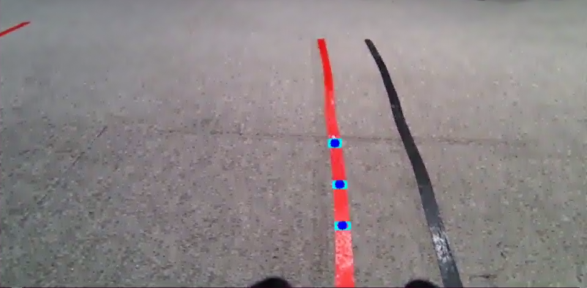

7. Next, enter the command in the current terminal and press **Enter** to initiate tracking:

```
ros2 service call /line_following/set_running std_srvs/srv/SetBool "{data: True}"
```

8. To close the feature, press **Ctrl + C** in the first terminal interface. If the feature does not close immediately, try pressing **Ctrl + C** a few more times.

### 6.9.3 Program Outcome

> [!NOTE]
> **After starting the feature, ensure that no other objects containing the recognized color exist within the camera's field of view to avoid affecting the performance.**

Place the robot on the deployed track. After starting the feature, if a line segment featuring the target recognition color is detected, the robot will move forward along the line.

### 6.9.4 Program Analysis

#### 6.9.4.1 Launch File Analysis

The program source code is located at:

**/home/ubuntu/ros2_ws/src/app/launch/line_following_node.launch.py**

* The program defines the content to be launched, acquires the path to the `controller` and `peripherals` packages, and launches the `lidar.launch`, `depth_camera.launch`, and `controller.launch` files. Defines the `line_following` executable file, and finally returns the launch items list.

```python
def launch_setup(context):
    compiled = os.environ['need_compile']
    debug = LaunchConfiguration('debug', default='false')
    debug_arg = DeclareLaunchArgument('debug', default_value=debug)
    if compiled == 'True':
        controller_package_path = get_package_share_directory('controller')
        peripherals_package_path = get_package_share_directory('peripherals')
    else:
        controller_package_path = '/home/ubuntu/ros2_ws/src/driver/controller'
        peripherals_package_path = '/home/ubuntu/ros2_ws/src/peripherals'
    line_following_node = GroupAction([
        IncludeLaunchDescription(
            PythonLaunchDescriptionSource(
                os.path.join(peripherals_package_path, 'launch/lidar.launch.py')),
            condition=IfCondition(debug),
            ),

        IncludeLaunchDescription(
            PythonLaunchDescriptionSource(
                os.path.join(peripherals_package_path, 'launch/depth_camera.launch.py')),
            condition=IfCondition(debug),
            ),

        IncludeLaunchDescription(
            PythonLaunchDescriptionSource(
                os.path.join(controller_package_path, 'launch/controller.launch.py')),
            condition=IfCondition(debug),
            ),

        Node(
            package='app',
            executable='line_following',
            output='screen',
            parameters=[{'debug': debug}],
            ),
    ])

    return [debug_arg,
            line_following_node,
            ]
```

* Entry function of the `ROS2 Launch` file, defining the content to be launched.

```python
def generate_launch_description():
    return LaunchDescription([
        OpaqueFunction(function = launch_setup)
    ])
```

* Creates a `LaunchService` and passes the launch content to it for execution.

```python
if __name__ == '__main__':
    # Create a LaunchDescription object
    ld = generate_launch_description()

    ls = LaunchService()
    ls.include_launch_description(ld)
    ls.run()
```

#### 6.9.4.2 Python Source Code Analysis

The program source code is located at:

**/home/ubuntu/ros2_ws/src/app/app/line_following.py**

* `get_area_max_contour` is used to find the contour with the largest area from the given contours and returns that contour and its area. The parameter `contours` represents a list of contours, and the parameter `threshold` represents the area threshold.

```python
    def get_area_max_contour(contours, threshold=100):
        '''
        Get the contour of the largest area
        :param contours:
        :param threshold:
        :return:
        '''
        contour_area = zip(contours, tuple(map(lambda c: math.fabs(cv2.contourArea(c)), contours)))
        contour_area = tuple(filter(lambda c_a: c_a[1] > threshold, contour_area))
        if len(contour_area) > 0:
            max_c_a = max(contour_area, key=lambda c_a: c_a[1])
            return max_c_a
        return None
```

* Image processing, including selecting the ROI area, color space conversion, Gaussian blur, binarization, erosion, dilation, and selecting object contours of appropriate area size.

```python
    blob = image[int(roi[0]*h):int(roi[1]*h), int(roi[2]*w):int(roi[3]*w)]  # Intercept roi
    img_lab = cv2.cvtColor(blob, cv2.COLOR_RGB2LAB)  # Convert rgb into lab
    img_blur = cv2.GaussianBlur(img_lab, (3, 3), 3)  # Perform Gaussian filtering to reduce noise
    mask = cv2.inRange(img_blur, lowerb, upperb)  # Image binarization
    eroded = cv2.erode(mask, cv2.getStructuringElement(cv2.MORPH_RECT, (3, 3)))  # Corrode
    dilated = cv2.dilate(eroded, cv2.getStructuringElement(cv2.MORPH_RECT, (3, 3)))  # Dilate
    contours = cv2.findContours(dilated, cv2.RETR_EXTERNAL, cv2.CHAIN_APPROX_TC89_L1)[-2]  # Find the contour
    max_contour_area = self.get_area_max_contour(contours, 30)  # Get the contour corresponding to the largest contour
```

* The initialization process for the ROS2 node, including the creation of servers and publishers.

```python
    self.cmd_vel_pub = self.create_publisher(Twist, '/controller/cmd_vel', 1)  # Chassis control
    self.result_publisher = self.create_publisher(Image, '~/image_result', 1)  # Publish the image processing result
    self.create_service(Trigger, '~/enter', self.enter_srv_callback)  # Enter the feature
    self.create_service(Trigger, '~/exit', self.exit_srv_callback)  # Exit the game
    self.create_service(SetBool, '~/set_running', self.set_running_srv_callback)  # Start the game
    self.set_color_srv = self.create_service(SetString, '~/set_color', self.set_color_srv_callback)
    self.create_service(SetPoint, '~/set_target_color', self.set_target_color_srv_callback)  # Set the color
    self.create_service(Trigger, '~/get_target_color', self.get_target_color_srv_callback)   # Get the color
    self.create_service(SetFloat64, '~/set_threshold', self.set_threshold_srv_callback)  # Set the threshold
    self.joints_pub = self.create_publisher(ServosPosition, 'servo_controller', 1)
```

* Acquires the image, converts the image from RGB to BGR color space using OpenCV, and sets the window position and mouse click event callback function.

```python
    def main(self):
        while True:
            try:
                image = self.image_queue.get(block=True, timeout=1)
            except queue.Empty:
                continue

            result = cv2.cvtColor(image, cv2.COLOR_RGB2BGR)
            cv2.imshow("image", cv2.resize(result, (display_size[0], display_size[1])))
            # cv2.imshow("image", result)
            if self.debug and not self.set_callback:
                self.set_callback = True
                # Set callback function for mouse clicking event
                cv2.setMouseCallback("image", self.mouse_callback)
            k = cv2.waitKey(1)
            if k != -1:
                break
            if self.debug and not self.set_above:
                cv2.moveWindow('image', 1920 - display_size[0], 0)
                os.system("wmctrl -r image -b add,above")
                self.set_above = True
        # self.cmd_vel_pub.publish(Twist())
        rclpy.shutdown()
```

* Defines the callback function for the mouse click event. When the mouse is clicked, the X and Y positions are recorded and converted to coordinates relative to the image width and height.

```python
    def mouse_callback(self, event, x, y, flags, param):
        if event == cv2.EVENT_LBUTTONDOWN:
            self.get_logger().info("x:{} y{}".format(x, y))
            msg = SetPoint.Request()
            if self.image_height is not None and self.image_width is not None:
                msg.data.x = x / display_size[0]
                msg.data.y = y / display_size[1]
                self.set_target_color_srv_callback(msg, SetPoint.Response())
```

* `enter_srv_callback` service callback function, executed when a service request is received. Used to initialize and reset variables and settings as well as receive LiDAR data, such as initial robotic arm position, PID parameters, and ending the current running state.

```python
    def enter_srv_callback(self, request, response):
        self.get_logger().info('\033[1;32m%s\033[0m' % "line following enter")
        with self.lock:
            self.color = ''
            self.stop = False
            self.is_running = False
            self.color_picker = None
            self.pid = pid.PID(1.1, 0.0, 0.0)
            self.follower = None
            self.threshold = 0.5
            self.empty = 0
            if self.image_sub is None:
                self.image_sub = self.create_subscription(Image, '/depth_cam/rgb/image_raw', self.image_callback, 1)  # Subscribe to the camera

            if self.lidar_sub is None:
                qos = QoSProfile(depth=1, reliability=QoSReliabilityPolicy.BEST_EFFORT)
                self.lidar_sub = self.create_subscription(LaserScan, '/scan', self.lidar_callback, qos)  # Subscribe to Lidar data
            set_servo_position(self.joints_pub, 1, ((24, 500), (23, 500), (22, 150), (21, 130), (20, 720), (19, 500)))

        response.success = True
        response.message = "enter"
        return response
```

* The `set_target_color_srv_callback` function is used to set the target color service, retrieve the color selection coordinates from the client request, and select the color accordingly. If the coordinate value is `-1`, the color picker is cleared.

```python
    def set_target_color_srv_callback(self, request, response):
        self.get_logger().info('\033[1;32m%s\033[0m' % "set_target_color")
        with self.lock:
            self.use_color_picker = True
            x, y = request.data.x, request.data.y
            self.follower = None
            if x == -1 and y == -1:
                self.color_picker = None
            else:
                self.color_picker = ColorPicker(request.data, 5)
        response.success = True
        response.message = "set_target_color"
        return response
```

* `lidar_callback` LiDAR scan callback function is used to process LiDAR data, determine the distance of the closest objects on the left and right sides, and decide whether to stop the robot based on the set stop threshold. If no obstacles are detected for 5 consecutive times, the status is reset to continue running.

```python
    def lidar_callback(self, lidar_data):
        # Data size = scanning angle / the increased angle per scan
        min_index = int(math.radians(MAX_SCAN_ANGLE / 2.0) / lidar_data.angle_increment)
        max_index = int(math.radians(MAX_SCAN_ANGLE / 2.0) / lidar_data.angle_increment)
        left_ranges = lidar_data.ranges[:max_index]  # Left data
        right_ranges = lidar_data.ranges[::-1][:max_index]  # Right data

        # Get data according to settings
        angle = self.scan_angle / 2
        angle_index = int(angle / lidar_data.angle_increment + 0.50)
        left_range, right_range = np.array(left_ranges[:angle_index]), np.array(right_ranges[:angle_index])

        left_nonzero = left_range.nonzero()
        right_nonzero = right_range.nonzero()
        left_nonan = np.isfinite(left_range[left_nonzero])
        right_nonan = np.isfinite(right_range[right_nonzero])
        # Take the nearest distance left and right
        min_dist_left_ = left_range[left_nonzero][left_nonan]
        min_dist_right_ = right_range[right_nonzero][right_nonan]
        if len(min_dist_left_) > 0 and len(min_dist_right_) > 0:
            min_dist_left = min_dist_left_.min()
            min_dist_right = min_dist_right_.min()
            if min_dist_left < self.stop_threshold or min_dist_right < self.stop_threshold:
                self.stop = True
            else:
                self.count += 1
                if self.count > 5:
                    self.count = 0
                    self.stop = False
```

## 6.10 KCF Object Recognition

### 6.10.1 KCF Introduction

KCF, Kernel Correlation Filter, is an algorithm proposed by Joao F. Henriques, Rui Caseiro, Pedro Martins, and Jorge Batista in 2014.

KCF is a discriminative tracking method. Its principle primarily involves using the circulant matrix of the area around the target to collect positive and negative samples, training a target detector, and using the target detector to check whether the predicted position in the next frame is the target. The training set is then updated based on the new detection results, subsequently updating the target detector.

### 6.10.2 Experiment Overview

The implementation workflow for this experiment is as follows:

First, instantiate the KCF tracker, and obtain the real-time camera image by subscribing to the topic message published by the camera node.

Subsequently, perform processing such as conversion, scaling, and copying on the acquired camera feed.

Next, use the `selectROI` function to let a target area be bounded via a bounding box, obtaining the rectangle data of the target area. Combine this with the image frame to initialize the KCF tracker and start tracking.

Finally, utilize the constructed detection model to detect data points in the image, update the rectangle data of the target area, draw the rectangular area using the `rectangle` function, and reflect this on the video feed.

### 6.10.3 Operation Steps

> [!NOTE]
> **Commands are strictly case-sensitive, and the Tab key can be used to auto-complete keywords.**

1. Power on the robot and connect it to the remote control software, VNC. For instructions on connecting to the remote desktop, refer to **[1. ROSpider User Manual \ 1.4 Development Environment Setup](https://wiki.hiwonder.com/projects/ROSpider/en/raspberry-pi-version/docs/1_ROSpider_User_Manual.html#development-environment-setup)**.
2. Click the desktop icon  to open the terminal.
3. Enter the command to stop the auto-start service.

```
~/.stop_ros.sh
```

4. Enter the command to start the KCF object recognition feature.

```
ros2 launch example kcf.launch.py
```

5. To close the feature, press **Ctrl + C** in the terminal interface. If the feature does not close immediately, try pressing **Ctrl + C** a few more times.

### 6.10.4 Program Outcome

After starting the feature, press the **S** key, and left-click the mouse to draw a box around the tracking target in the current frozen frame. To redraw the box, press the **C** key, and press the **S** key again.

After selection is complete, press the **Space** key or **Enter** key to start tracking. A blue box will mark the tracking target in the video feed, and the robot will rotate left and right based on the target's position to track it.

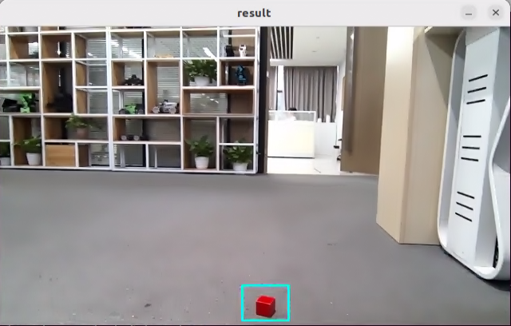

### 6.10.5 Program Analysis

#### 6.10.5.1 Launch File Analysis

The program source code is located at:

**/home/ubuntu/ros2_ws/src/example/example/opencv_example/kcf.launch.py**

* The program defines the content to be launched, acquires the path to the `controller` and `peripherals` packages, and launches the `depth_camera.launch.py` and `controller.launch` files. Creates the ROS2 node `kcf_node`, defines the executable file, and finally returns the launch items list.

```python
def launch_setup(context):
    compiled = os.environ['need_compile']

    if compiled == 'True':
        controller_package_path = get_package_share_directory('controller')
        peripherals_package_path = get_package_share_directory('peripherals')
    else:
        controller_package_path = '/home/ubuntu/ros2_ws/src/driver/controller'
        peripherals_package_path = '/home/ubuntu/ros2_ws/src/peripherals'

    depth_camera_launch = IncludeLaunchDescription(
        PythonLaunchDescriptionSource(
            os.path.join(peripherals_package_path, 'launch/depth_camera.launch.py')),
    )

    controller_launch = IncludeLaunchDescription(
        PythonLaunchDescriptionSource(
            os.path.join(controller_package_path, 'launch/controller.launch.py')),
    )

    kcf_node = Node(
        package='example',
        executable='kcf',
        output='screen',
    )

    return [
            controller_launch,
            depth_camera_launch,
            kcf_node,
            ]
```

* Entry function of the ROS2 Launch file, defining the content to be launched.

```python
def generate_launch_description():
    return LaunchDescription([
        OpaqueFunction(function = launch_setup)
    ])
```

* Creates a `LaunchService` and passes the launch content to it for execution.

```python
if __name__ == '__main__':
    # Create a LaunchDescription object
    ld = generate_launch_description()**

    ls = LaunchService()
    ls.include_launch_description(ld)
    ls.run()
```

#### 6.10.5.2 Python Source Code Analysis

The program source code is located at:

**/home/ubuntu/ros2_ws/src/example/example/opencv_example/include/kcf.py**

* The initialization process for the ROS2 node, including the creation of clients, publishers, subscribers, and timers.

```python
        self.joints_pub = self.create_publisher(ServosPosition, '/servo_controller', 1) # Servo control
        self.cmd_vel_pub = self.create_publisher(Twist, '/controller/cmd_vel', 1)  # Chassis control

        self.image_sub = self.create_subscription(Image, '/depth_cam/rgb/image_raw', self.image_callback, 1)  # Subscribe to the camera

        timer_cb_group = ReentrantCallbackGroup()
        self.client = self.create_client(Trigger, '/controller_manager/init_finish')
        self.client.wait_for_service()

        self.timer = self.create_timer(0.0, self.init_process, callback_group=timer_cb_group)
```

* The initialization function, initializing robot movement and robotic arm servo positions, starts a thread to execute the target function.

```python
    def init_process(self):
        self.timer.cancel()

        self.controller.traveling(gait=-2, time=1, steps=0)
        joint_angle = [500, 750, 200, 150, 500, 600]
        set_servo_position(self.joints_pub, 1, ((19, joint_angle[0]), (20, joint_angle[1]), (21, joint_angle[2]), (22, joint_angle[3]), (23, joint_angle[4]), (24, joint_angle[5])))

        threading.Thread(target=self.main, daemon=True).start()
        self.create_service(Trigger, '~/init_finish', self.get_node_state)
        self.get_logger().info('\033[1;32m%s\033[0m' % 'Press “S" in the picture window to start tracking the target, then press the "space" to start tracking')
```

* Image reception and processing callback function, including image data format conversion and image display.

```python
    def image_callback(self, ros_image):
        # Convert the screen to opencv format
        cv_image = self.bridge.imgmsg_to_cv2(ros_image, "bgr8")
        bgr_image = np.array(cv_image, dtype=np.uint8)

        if self.image_queue.full():
            # If the queue is full, discard the oldest image
            self.image_queue.get()
        # Put the image into the queue
        self.image_queue.put(bgr_image)
```

* The `main` function processes the image data in the video stream and uses OpenCV's KCF tracker to perform object tracking.

```python
    def main(self):
        while self.running:
            rgb_image = self.image_queue.get()
            result_image = np.copy(rgb_image)
            factor = 1
            rgb_image = cv2.resize(rgb_image, (int(result_image.shape[1]/ factor), int(result_image.shape[0]/ factor)))

            if self.tracker is None:
                if self.enable_select:
                    roi = cv2.selectROI("result", result_image, False)
                    roi =  tuple(int(i / factor)for i in roi)

                    if roi[2] > 0 and roi[3] > 0:
                        param = cv2.TrackerKCF.Params()
                        param.detect_thresh = 0.2
                        self.tracker = cv2.TrackerKCF_create(param)
                        self.tracker.init(rgb_image, roi)

            else:
                twist = Twist()
                status, box = self.tracker.update(rgb_image)
                if status:
                    p1 = int(box[0] * factor), int(box[1] * factor)
                    p2 = p1[0] + int(box[2] * factor), p1[1] + int(box[3] * factor)
                    cv2.rectangle(result_image, p1, p2, (255, 255, 0), 2)
                    center_x, center_y = (p1[0] + p2[0]) / 2, (p1[1] + p2[1]) / 2
           

                    self.pid_x.SetPoint = result_image.shape[1]/2 
                    self.pid_x.update(center_x)

                    self.pid_x.SetPoint = result_image.shape[1]/2 
                    self.pid_x.update(center_x)
                    if self.pid_x.output :
                        twist.angular.z = (common.set_range(self.pid_x.output, -10, 10)/ 10.0) * 0.3
                        self.cmd_vel_pub.publish(twist)
                    else:
                        self.cmd_vel_pub.publish(Twist())

                else:
                    self.cmd_vel_pub.publish(Twist())

            cv2.imshow("result", result_image)

            key = cv2.waitKey(1)
            if key == ord('s'): # Press 's' to start selecting the tracking target
                self.controller.traveling(gait=-2, time=1, steps=0)
                self.tracker = None
                self.enable_select = True

        rclpy.shutdown()
```

