# 7. ROS + Machine Learning Course

## 7.1 Machine Learning Basics

### 7.1.1 Introduction to Machine Learning

#### 7.1.1.1 Overview

Artificial Intelligence (AI) is a new technological science focused on the theories, methods, technologies, and applications used to simulate, extend, and augment human intelligence.

AI encompasses various fields such as machine learning, computer vision, natural language processing, and deep learning. Among them, machine learning is a subfield of AI, and deep learning is a specific type of machine learning.

Since its inception, AI has seen rapid development in both theory and technology, with expanding application areas, gradually evolving into an independent discipline.

#### 7.1.1.2 What Is Machine Learning

Machine Learning is the core of AI and the fundamental approach to enabling machine intelligence. It is an interdisciplinary field involving probability theory, statistics, approximation theory, convex analysis, algorithmic complexity, and more.


The essence of machine learning lies in enabling computers to simulate or implement human learning behaviors in order to acquire new knowledge or skills, and reorganize existing knowledge structures to continuously improve performance. From a practical perspective, machine learning involves training models using data and making predictions with those models.

Take AlphaGo as an example—it was the first AI program to defeat a professional human Go player and later a world champion. AlphaGo operates based on deep learning, which involves learning the underlying patterns and hierarchical representations from sample data to gain insights.

#### 7.1.1.3 Types of Machine Learning

Machine learning is generally classified into supervised learning and unsupervised learning, with the key distinction being whether the dataset's categories or patterns are known.

* **Supervised Learning**

Supervised learning provides a dataset along with correct labels or answers. The algorithm learns to map inputs to outputs based on this labeled data. This is the most common type of machine learning.

Labeled Data: Supervised learning uses training data that includes both input features and corresponding labels or outputs. Features describe the attributes of the data, while labels represent the target variable the model is expected to predict or classify. For instance, in image recognition, a large number of images of dogs can be labeled as "dog." The machine learns to recognize dogs in new images through this data.


Model Selection: Choosing the appropriate model to represent the relationship in the data is crucial. Common models include linear regression, logistic regression, decision trees, support vector machines (SVM), and deep neural networks. The choice depends on the data characteristics and the specific problem.

Feature Engineering: This involves preprocessing and transforming raw data to extract meaningful features. It includes data cleaning, handling missing values, normalization or standardization, feature selection, and feature transformation. Good feature engineering enhances model performance and generalization.

Training and Optimization: Using labeled training data, the model is trained to fit the underlying relationships. This typically involves defining a loss function, selecting an appropriate optimization algorithm, and iteratively adjusting model parameters to minimize the loss. Common optimization methods include gradient descent and stochastic gradient descent.

Model Evaluation: After training, the model is evaluated to assess its performance on new data. Common metrics include accuracy, precision, recall, F1-score, and ROC curves. Evaluating the model ensures it is suitable for real-world applications.

In summary, supervised learning involves using labeled training data to build a model that can classify or predict unseen data. Key steps include model selection, feature engineering, model training and optimization, and performance evaluation. Together, these steps form the foundation of supervised learning.

* **Unsupervised Learning**

Unsupervised learning involves providing the algorithm with data without labels or known answers. All data is treated equally, and the machine is expected to uncover hidden structures or patterns.

For example, in image classification, if you provide a set of images containing cats and dogs without any labels. The algorithm will analyze the data and automatically group the images into two categories—cat images and dog images—based on similarities.


### 7.1.2 Introduction to Machine Learning Libraries

#### 7.1.2.1 Common Machine Learning Frameworks

There are many machine learning frameworks available. The most commonly used include PyTorch, TensorFlow, PaddlePaddle, and MXNet.

#### 7.1.2.2 PyTorch

Torch is an open-source machine learning framework under the BSD License, widely used for its powerful multi-dimensional array operations. PyTorch is a machine learning library based on Torch but offers greater flexibility, supports dynamic computation graphs, and provides a Python interface.

Unlike TensorFlow’s static computation graphs, PyTorch uses dynamic computation graphs, which can be modified in real-time according to the needs of the computation. PyTorch allows developers to accelerate tensor operations using GPUs, build dynamic graphs, and perform automatic differentiation.


#### 7.1.2.3 Tensorflow

TensorFlow is an open-source machine learning framework designed to simplify the process of building, training, evaluating, and saving neural networks. It enables the implementation of machine learning and deep learning concepts in the simplest way. With its foundation in computational algebra and optimization techniques,

TensorFlow allows for efficient mathematical computations. It can run on a wide range of hardware—from supercomputers to embedded systems—making it highly versatile. TensorFlow supports CPU, GPU, or both simultaneously. Compared to other frameworks, TensorFlow is best suited for industrial deployment, making it highly appropriate for use in production environments.


#### 7.1.2.4 PaddlePaddle

PaddlePaddle, developed by Baidu, is China’s first open-source, industrial-grade deep learning platform. It integrates a deep learning training and inference framework, a library of foundational models, end-to-end development tools, and a rich suite of supporting components. Built on years of Baidu’s R\&D and real-world applications in deep learning, PaddlePaddle is powerful and versatile.

In recent years, deep learning has achieved outstanding performance across many fields such as image recognition, speech recognition, natural language processing, robotics, online advertising, medical diagnostics, and finance.


#### 7.1.2.5 MXNet

MXNet is another high-performance deep learning framework that supports multiple programming languages, including Python, C++, Scala, and R. It offers data flow graphs similar to those in Theano and TensorFlow and supports multi-GPU configuration. It also includes high-level components for model building, comparable to those in Lasagne and Blocks, and can run on nearly any hardware platform—including mobile devices.


MXNet is designed to maximize efficiency and flexibility. As an accelerated library, it provides powerful tools for developers to take full advantage of GPUs and cloud computing. MXNet supports distributed deployment via a parameter server and can scale almost linearly across multiple CPUs and GPUs.


## 7.2 Machine Learning Application

### 7.2.1 GPU Acceleration

#### 7.2.1.1 Introduction to GPU-Accelerated Computing

GPU stands for Graphics Processing Unit, which is also known as the display core, visual processor, or display chip. A GPU is a microprocessor designed to perform image rendering and image-related computation tasks on devices such as personal computers, workstations, game consoles, tablets, and smartphones.

GPU-accelerated computing refers to the use of both the GPU and CPU together to speed up the execution of scientific, analytical, engineering, consumer, and enterprise applications. This acceleration capability enables faster performance for applications running on various platforms, including cars, smartphones, tablets, drones, and robots.

#### 7.2.1.2 Performance Comparison: GPU vs. CPU

The CPU is designed for general-purpose computing, which handles multitasking and system-level operations, but has limited computational throughput. In contrast, the GPU is designed for high-volume, repetitive calculations and excels at tasks involving massive parallelism, though it is less suited for complex logical operations.

Architecture Differences The CPU follows a serial architecture with a small number of powerful cores, making it ideal for executing single tasks quickly. The GPU adopts a parallel architecture with a large number of simpler cores, making it highly efficient at executing many tasks simultaneously.

In terms of hardware structure, the CPU is equipped with multiple functional modules, allowing it to handle complex computational environments. In contrast, the GPU has a relatively simpler architecture, with the majority of its transistors dedicated to stream processors and memory controllers.

In a CPU, most transistors are used to build control circuits and cache, with only a small portion allocated to actual computation. This design enhances the CPU’s versatility, enabling it to process a wide range of data types and perform complex logical operations, but it also limits its computational performance.

In a GPU, however, most transistors are devoted to specialized circuits and pipelines. This configuration significantly boosts the GPU’s processing speed and greatly enhances its floating-point computational power.

#### 7.2.1.3 Advantages of GPU

GPUs have a large number of cores and are suitable for large-scale parallel data processing, making them particularly advantageous for repetitive tasks in multimedia processing.

Take deep learning as an example—the neural network systems it relies on are designed to analyze massive amounts of data at high speed, and such analysis is exactly what GPUs excel at.

Moreover, the GPU architecture does not include dedicated image processing algorithms; instead, it is optimized based on CPU architecture. Therefore, in addition to image processing, GPUs are also widely used in fields such as scientific computing, cryptographic cracking, numerical analysis, big data processing, and financial analysis, where parallel computing is required.

### 7.2.2 YOLO26 Model

#### 7.2.2.1 Overview of the YOLO Models

* **YOLO Series**

YOLO (You Only Look Once) is a One-stage, deep learning-based regression approach to object detection.

Before the advent of YOLOv1, the R-CNN family of algorithms dominated the object detection field. Although the R-CNN series achieved high detection accuracy, its Two-stage architecture limited its speed, making it unsuitable for real-time applications.

To address this issue, the YOLO series was developed. The core idea behind YOLO is to redefine object detection as a regression problem. It processes the entire image as input to the network and directly outputs Bounding Box coordinates along with their corresponding class labels. Compared to traditional object detection methods, YOLO offers faster detection speed and higher average precision.

* **YOLO26**

YOLO26 is the next-generation real-time object detection model introduced by Ultralytics. Built upon the foundation of previous YOLO versions, it features significant optimizations that deliver substantial improvements in both detection speed and accuracy.

**Core Features of YOLO26**

**1.** **Simplified Architecture**: Removes Distribution Focal Loss (DFL) to streamline bounding box regression and enhance export compatibility.

**2.** **End-to-End Inference**: Utilizes an NMS-free (Non-Maximum Suppression) design to directly output detection results, significantly reducing latency and deployment complexity.

**3.** **Training Enhancements**: Introduces Progressive Loss Balancing (ProgLoss) and Small Target-Aware Label Assignment (STAL) to improve the stability of small object detection.

**4.** **Optimizer Innovations**: Utilizes the MuSGD optimizer, which combines the strengths of SGD and Muon to accelerate model convergence.

**5.** **Multi-Task Support**: Features a unified framework that supports object detection, instance segmentation, pose estimation, oriented object detection, and image classification.

**6.** **Edge Optimization**: Supports FP16/INT8 quantization, enabling low-latency, real-time inference on edge devices such as the NVIDIA Jetson.

**7.** **Performance**: Achieves high precision on benchmarks such as COCO, delivering up to a 43% increase in CPU inference speed compared to previous generations.

#### 7.2.2.2 YOLOv26 Model Structure

* **Components**

1. Convolutional Layer: Feature Extraction

Convolution is the process where an entity at multiple past time points does or is subjected to the same action, influencing its current state. Convolution can be divided into **convolution** and **multiplication**.

**Convolution** can be understood as flipping the data, and **multiplication** as the accumulation of the influence that past data has on the current data. The data flipping is done to establish relationships between data points, facilitating the calculation of accumulated influence with a proper reference.

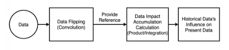

In YOLOv26, the data to be processed are images, which are two-dimensional in computer vision. Accordingly, the convolution is a two-dimensional convolution. The purpose of 2D convolution is to extract features from images. To perform a 2D convolution, it is necessary to understand the convolution kernel.

The convolution kernel is the unit region over which the convolution calculation is performed each time. The unit is pixels, and the convolution sums the pixel values within the region. Typically, convolution is done by sliding the kernel across the image, and the kernel size is manually set.

When performing convolution, depending on the desired effect, the image borders may be padded with zeros or extended by a certain number of pixels, and then the convolution results are placed back into the corresponding positions in the image. For example, a 6×6 image is first expanded to 7×7, then convolved with the kernel, and finally, the results are filled back into a blank 6×6 image.

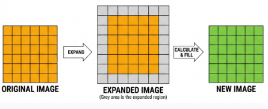

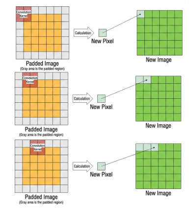

2. Pooling Layer: Feature Amplification

The pooling layer, also called the downsampling layer, is usually used together with convolution layers. After convolution, pooling performs further sampling on the extracted features. Pooling includes various types, such as global pooling, average pooling, max pooling, etc., each producing different effects.

To make it easier to understand, max pooling is used here as an example. Before understanding max pooling, it is important to know about the filter, which is like the convolution kernel—a manually set region that slides over the image and selects pixels within the area.

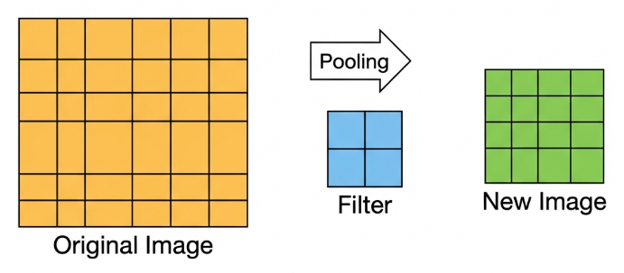

Max pooling keeps the most prominent features and discards others. For example, starting with a 6×6 image, applying a 2×2 filter for max pooling produces a new image with reduced size.

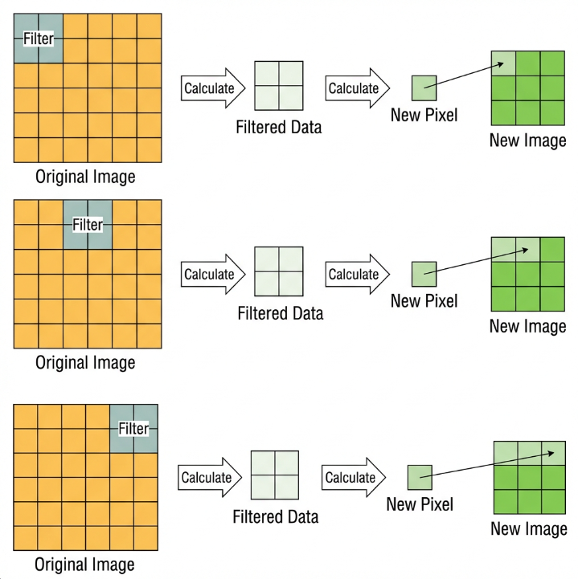

3. Upsampling Layer: Restoring Image Size

Upsampling can be understood as “reverse pooling.” After pooling, the image size shrinks, and upsampling restores the image to its original size. However, only the size is restored, the pooled features are also modified accordingly.

For example, starting with a 6×6 image, applying a 3×3 filter for upsampling produces a new image.

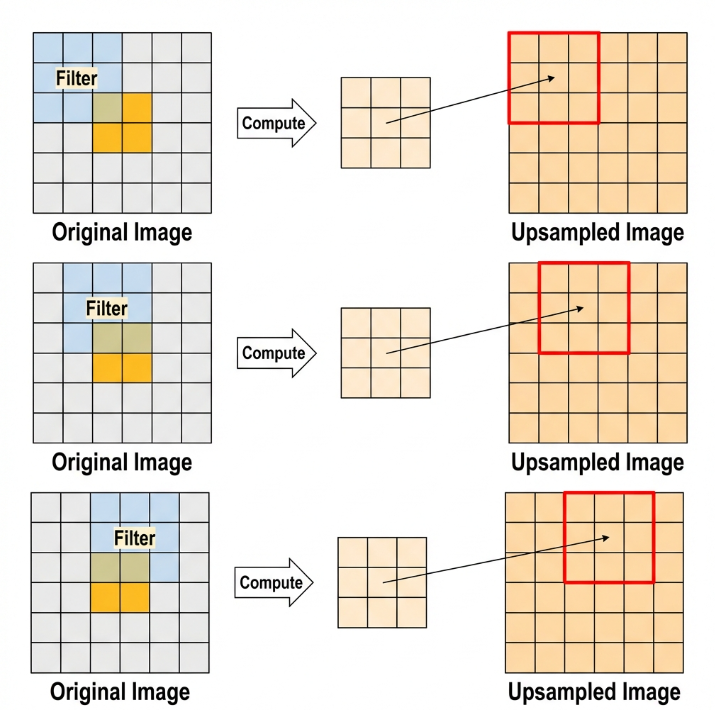

4. Batch Normalization Layer: Data Regularization

Batch normalization means rearranging the data neatly, which reduces the computational difficulty of the model and helps map data better into the activation functions.

Batch normalization reduces the loss rate of features during each calculation, retaining more features for the next computation. After multiple computations, the model’s sensitivity to the data increases.

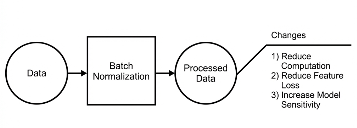

5. ReLU Layer: Activation Function

Activation functions are added during model construction to introduce non-linearity. Without activation functions, each layer is essentially a matrix multiplication. Every layer’s output is a linear function of the previous layer’s input, so no matter how many layers the neural network has, the output is just a linear combination of the input. This prevents the model from adapting to actual situations.

There are many activation functions, commonly ReLU, Tanh, Sigmoid, etc. Here, ReLU is used as an example. ReLU is a piecewise function that replaces all values less than 0 with 0 and keeps positive values unchanged.


6. ADD Layer: Tensor Addition

Features can be significant or insignificant. The ADD layer adds feature tensors together to enhance the significant features.

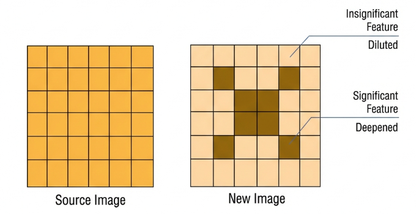

7. Concat Layer: Tensor Concatenation

The Concat layer concatenates feature tensors to combine features extracted by different methods, thereby preserving more features.

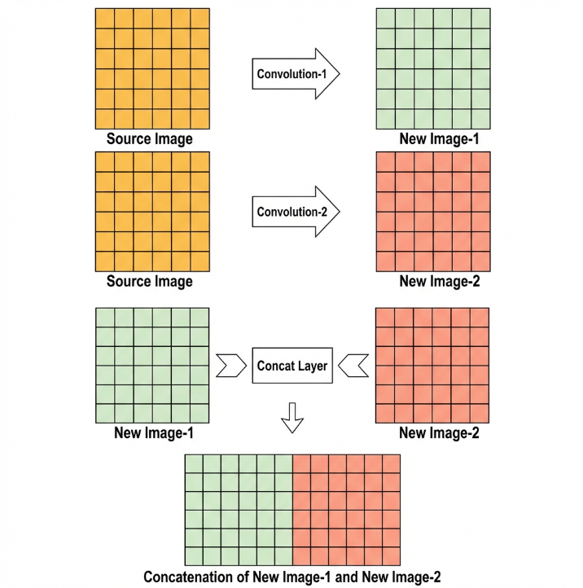

* **Composite Elements**

When building a model, using only the basic layers mentioned earlier can lead to overly lengthy, disorganized code with unclear hierarchy. To improve modeling efficiency, these basic elements are often grouped into modular units for reuse.

1. Convolutional Block

A convolutional block consists of a convolutional layer, a batch normalization layer, and an activation function. The process follows this order: convolution → batch normalization → activation.

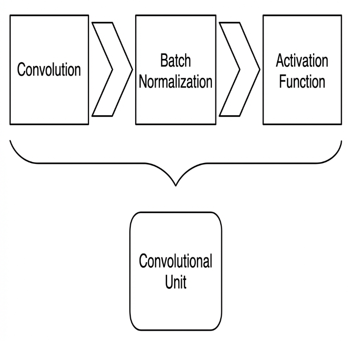

2. Strided Sampling and Concatenation Unit（Focus）

The input image is first divided into multiple large regions. Then, small image patches located at the same relative position within each large region are concatenated together to form a new image. This effectively splits the input image into several smaller images. Finally, an initial sampling is performed on the images using a convolutional block.

As shown in the figure below, for a 6×6 image, if each large region is defined as 2×2, the image can be divided into 9 large regions, and each contains 4 small patches.

By taking the small patches at position 1 from each large region and concatenating them, a 3×3 image can be formed. The patches at other positions are concatenated in the same way.  
Ultimately, the original 6×6 image is decomposed into four 3×3 images.

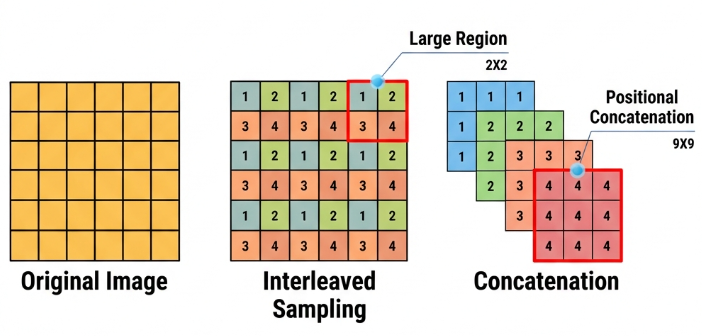

3. Residual Block

The residual block enables the model to learn subtle variations in the image. Its structure is relatively simple and involves merging data from two paths.

In the first path, two convolutional blocks are used to extract features from the image. In the second path, the original image is passed through directly without convolution. Finally, the outputs from both paths are added together to enhance learning.

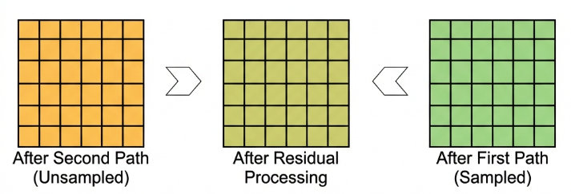

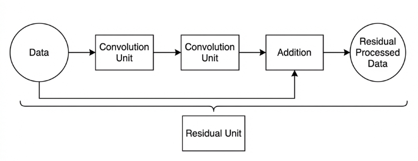

4. Composite Convolutional Block

In YOLOv26, a key feature of the composite convolutional block is its customizable design, allowing convolutional blocks to be configured as needed. This structure also uses two paths whose outputs are merged.

The first path contains a single convolutional layer for feature extraction, while the second path includes 2𝑥+1 convolutional blocks followed by an additional convolutional layer. After sampling and concatenation, batch normalization is applied to standardize the data, followed by an activation function. Finally, a convolutional block is used to process the combined features.

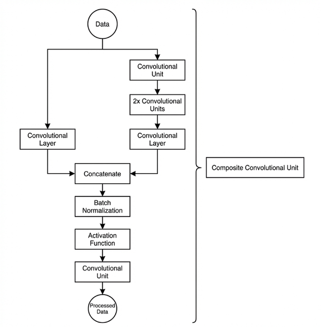

5. Composite Residual Convolutional Block

The composite residual convolutional block modifies the composite convolutional block by replacing the 2𝑥 convolutional blocks with   
𝑥 residual blocks. In YOLOv26, this block is also customizable, allowing residual blocks to be tailored according to specific requirements.

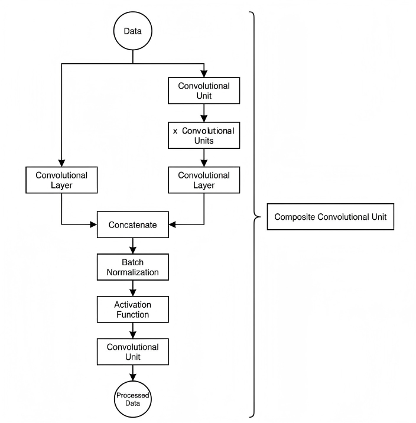

6. Composite Pooling Block

The output from a convolutional block is simultaneously passed through three separate max pooling layers, while an additional unprocessed copy is preserved. The resulting four feature maps are then concatenated and passed through a convolutional block. By processing data with the composite pooling block, the original features can be significantly enhanced and emphasized.

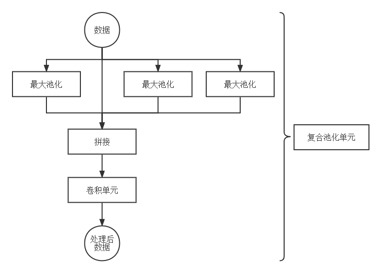

### 7.2.3 YOLOv26 Workflow

This section explains the model’s processing flow using the concepts of prior boxes, prediction boxes, and anchor boxes involved in YOLOv26.

#### 7.2.3.1 Prior Box

When an image is fed into the model, predefined regions of interest must be specified. These regions are marked using prior boxes, which serve as initial bounding box templates indicating potential object locations in the image.

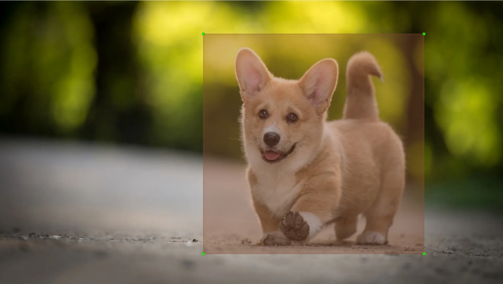

#### 7.2.3.2 Prediction Box

Prediction boxes are generated by the model as output and do not require manual input. When the first batch of training data is fed into the model, the prediction boxes are automatically created. The center points of prediction boxes tend to be located in areas where similar objects frequently appear.

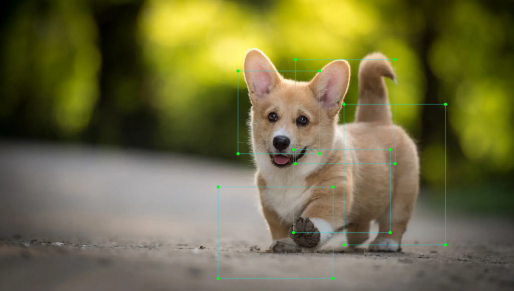

#### 7.2.3.3 Anchor Box

Since predicted boxes may have deviations in size and location, anchor boxes are introduced to correct these predictions.

Anchor boxes are positioned based on the predicted boxes. By influencing the generation of subsequent predicted boxes, anchor boxes are placed around their relative centers to guide future predictions.

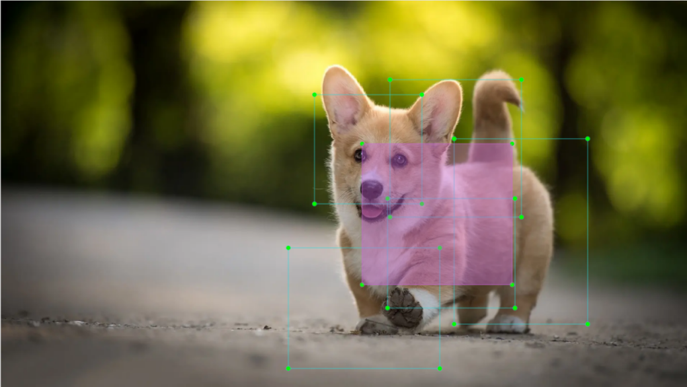

#### 7.2.3.4 Project Process

Once the bounding box annotations are complete, prior boxes appear on the image. When the image data is input into the model, predicted boxes are generated based on the locations of the prior boxes. Subsequently, anchor boxes are generated to adjust the predicted results. The weights from this round of training are then updated in the model.

With each new training iteration, the predicted boxes are influenced by the anchor boxes from the previous round. This process is repeated until the predicted boxes gradually align with the prior boxes in both size and location.

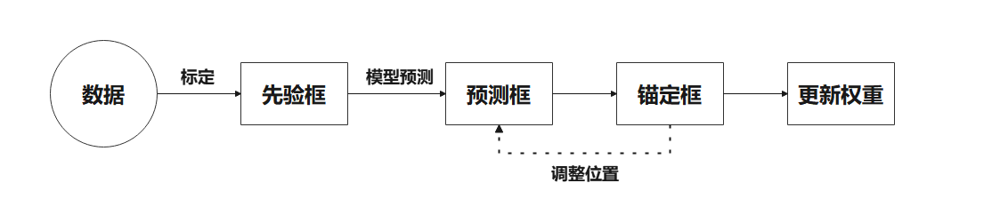

<p id ="anther7.3.5"></p>

### 7.2.4 Image Collection and Annotation

Training the YOLOv11 model requires a large amount of data, so data collection and annotation must be performed first to prepare for model training.

In this example, the demonstration uses traffic signs as target objects.

#### 7.2.4.1 Image Collection

1. Power on the robot and connect it via the NoMachine remote control software.

2. Click the terminal icon 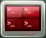 in the system desktop to open a command-line window.

3. Stop the app auto-start service by entering the following command:

```
~/.stop_ros.sh
```

4. Start the depth camera service with the command.

```
ros2 launch peripherals depth_camera.launch.py
```

5. Open a new command-line terminal and enter the command to create a directory for storing your dataset. For example, create a directory named **my_data**.

```
mkdir -p ~/my_data
```

6. Then, launch the tool by entering the following command.

```
cd ~/software/collect_picture && python3 main.py
```

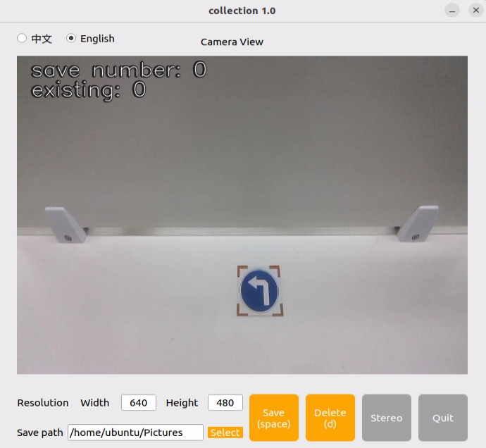

The **save number** in the top-left corner of the tool interface shows the ID of the saved image. The **existing** shows how many images have already been saved.

7. Click `Select` to change the save path to the **my_data** folder created before.

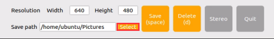

8. After selecting the target directory, click `Choose`.

9. Place the target in front of the camera's view, click the `Save(Space)` button, or press the `space` key to save the current camera frame.

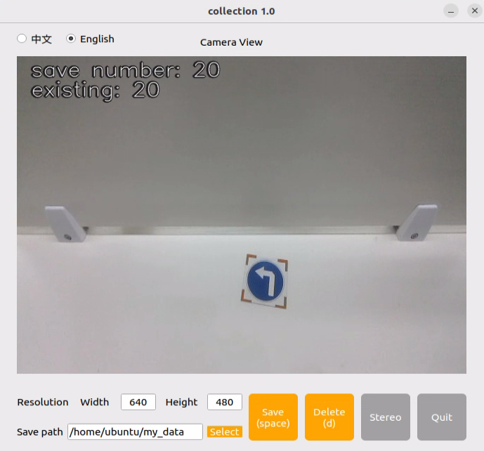

A `JPEGImages` folder will be automatically created under the directory **/home/ubuntu/my_data** to store the images.

> [!NOTE]
>
> * **To improve model reliability, capture the target object from various distances, angles, and tilts.**
>
> * **To ensure recognition stability, model training requires a substantial number of images. Collecting approximately 100 images per category is recommended.**

10. After collecting images, click the `Quit` button to close the tool.

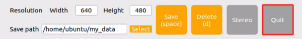

11. Then press **Ctrl + C** in all open terminal windows to exit—this completes the image collection process.

#### 7.2.4.2 Image Annotation

After acquiring images, image annotation is required. Annotation is essential for functional datasets because it informs the training model about the categories of important image sections, enabling the model to accurately recognize these categories in new, unseen images later.

> [!NOTE]
> **Commands are strictly case-sensitive, and the Tab key can be used to auto-complete keywords.**

1. Click the desktop icon  to open the terminal, and enter the command to launch the image annotation software.

```bash
python3 ~/software/roLabelImg/roLabelImg.py
```

2. After opening the software, click **File** in the top left corner, select **Open Dir**, navigate to the directory containing the acquired images, and click the **Open** button.

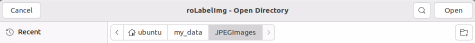

3. Click **File** in the top left corner and select **Change default saved Annotation dir** to modify the save path. Select the **Annotations** directory within the `my_data` folder, and then click the **Open** button.

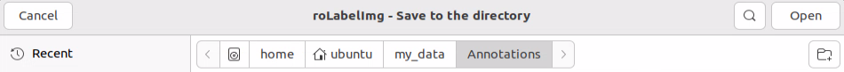

4. Click **View** in the top left corner and select **Advanced Mode** to enable the rotational annotation feature.

   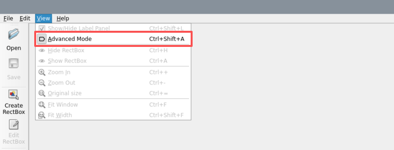

5. Keyboard shortcuts are utilized as follows: **e** annotates a rotated target, **d** moves to the next image, **a** moves to the previous image, **c** applies a slight clockwise rotation, **x** applies a slight counterclockwise rotation, **v** applies a large clockwise rotation, and **z** applies a large counterclockwise rotation. After annotating each image, press **Ctrl + S** or click the **Save** icon on the left to save the progress.

> [!NOTE]
> **Be sure to use the 'C' and 'X' keys to rotate and align the bounding box with the object's edges. Misalignment will negatively affect subsequent recognition.**

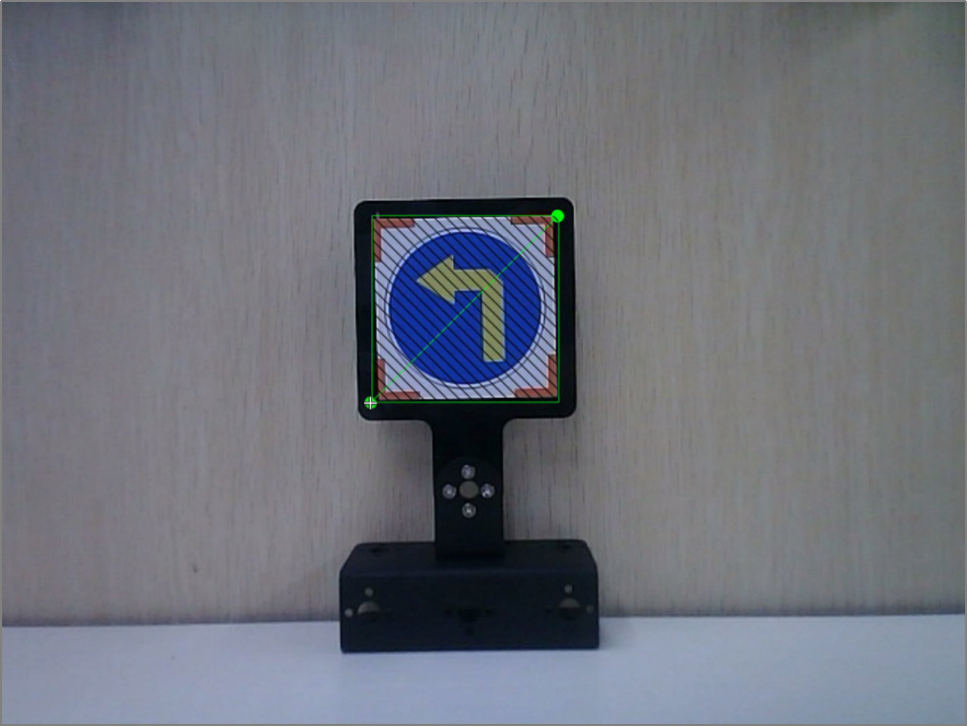

6. In the pop-up window, assign a category name to the target content. Here, it is named **left**. After naming, click the **OK** button or press **Enter** to save this category.

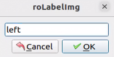

7. Use the shortcut **Ctrl + S** to save the annotation data for the current image.
8. Press the **D** key to proceed to the next image for annotation. Repeat steps 5-7 until all images are successfully annotated, and then click the close button in the top right corner of the software to exit.

### 7.2.5 Data Format Conversion

1. Click the desktop icon  to open a terminal, and enter the command.

```bash
vim ~/my_data/classes.names
```

2. Press the **i** key to write the annotated category **left** into the text file. If there are multiple different categories, insert line breaks for each entry.
3. Once complete, press the **ESC** key, enter the following command, and press **Enter** to save and exit.

```bash
:wq
```

> [!NOTE]
> **The class names added here must exactly match the names used within the image annotation software.**

4. Return to the terminal, enter the command to convert the data format, and press **Enter**.

```bash
python3 ~/third_party_ros2/yolo/xml2yolo_obb.py --data ~/my_data --yaml ~/my_data/data.yaml
```

### 7.2.6 Training the Model

> [!NOTE]
> **Commands are strictly case-sensitive, and the Tab key can be used to auto-complete keywords.**

1. Enter the command to start training and press **Enter**.

```bash
python3 ~/third_party_ros2/yolo/train.py --img 320 --weights yolo26n.pt --data /home/ubuntu/my_data/data.yaml --batch 4 --epochs 300
```

In the command, `img` specifies the image size, `batch` dictates the number of images per input batch, and `epochs` represents the number of training iterations. These parameters can be modified based on actual requirements. To improve model reliability, the number of epochs can be increased. However, this will correspondingly increase the overall training time.

2. The appearance of the content shown in the figure below indicates that training is currently in progress.

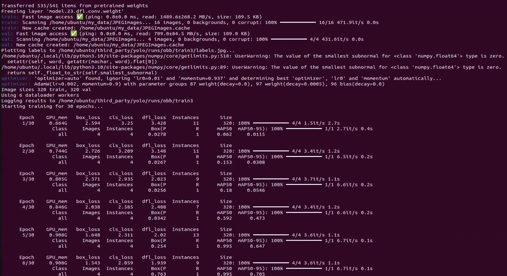

3. Once model training is complete, the terminal will print the path to the generated files, indicating that the training results have been successfully saved to this directory.

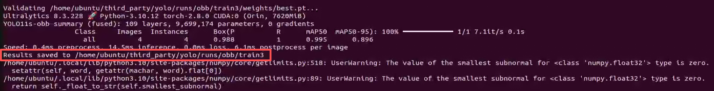

### 7.2.7 Exporting and Using the engine Model

1. Using the previously generated training result path as an example, copy the generated `.pt` file to the folder `~/third_party_ros2/yolo/`. Ensure the specific path matches the local environment setup.

```bash
cp ~/runs/detcet/train3/weights/best.pt ~/third_party_ros2/yolo/
```

2. Enter the command to open the launch file.

```bash
gedit /home/ubuntu/ros2_ws/src/example/example/yolo_detect/yolo_detect_demo.py
```

Enter the trained model class name `left` in `CLASSES_NAMES_DEFAULT`, then save the file and exit.

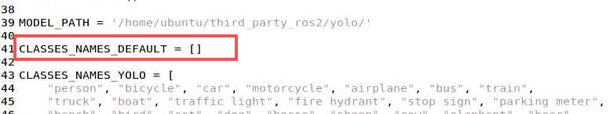

7. Enter the command and press **Enter** to verify the model's recognition performance.

```bash
ros2 launch example yolo_detect_demo.launch.py model_name:=best
```

### 7.2.8 Waste Classification

#### 7.2.8.1 Experiment Overview

First, the program subscribes to the real-time video feed data published by the camera node and converts it into numpy format. Next, the image is input into the YOLO network, where operations such as scaling, transposition, and array expansion are performed to obtain the processing results.

Subsequently, the acquired waste card image coordinates are converted back to the original image coordinates. Based on the recognized waste names, they are categorized according to predefined rules to retrieve the corresponding waste category names. Finally, the targets are enclosed in bounding boxes, displaying the waste names along with their recognition confidence scores.

#### 7.2.8.2 Operation Steps

> [!NOTE]
> **Commands are strictly case-sensitive, and the Tab key can be used to auto-complete keywords.**

1. Start the robot and connect to the desktop remotely via NoMachine.
2. Click the desktop icon  to open a terminal.
3. Enter the command and press **Enter** to stop the auto-start service.

```bash
~/.stop_ros.sh
```

4. Enter the command and press **Enter** to start the application.

```bash
ros2 launch example garbage_classification.launch.py
```

5. To close the application, press **Ctrl + C** in the terminal interface. If it fails to close, retry repeatedly.

#### 7.2.8.3 Program Outcome

After starting the feature, place a waste card in front of the camera. Once the camera recognizes the waste card, the corresponding name will be displayed on the video feed, and the robotic arm will grab the waste block and place it in a designated location according to its category.

<table>
<thead>
<tr>
<th>Garbage Category</th>
<th>Cards</th>
</tr>
</thead>
<tbody>
<tr>
<td>hazardous_waste (Hazardous Waste)</td>
<td>Storage Battery, Marker, Oral Liquid Bottle</td>
</tr>
<tr>
<td>recyclable_waste (Recyclable Waste)</td>
<td>Plastic Bottle, Umbrella, Toothbrush</td>
</tr>
<tr>
<td>food_waste (Food Waste)</td>
<td>Banana Peel, Ketchup, Broken Bones</td>
</tr>
<tr>
<td>residual_waste (Residual Waste)</td>
<td>Cigarette End, Plate, Disposable Chopsticks</td>
</tr>
</tbody>
</table>

## 7.3 MediaPipe Human-Robot Interaction

### 7.3.1 MediaPipe Introduction and Quick Start

#### 7.3.1.1 Introduction to MediaPipe

MediaPipe is an open-source multimedia machine learning model application framework. It operates cross-platform on mobile devices, workstations, and servers, and supports mobile GPU acceleration. It also supports the TensorFlow and TF Lite inference engines, allowing any TensorFlow and TF Lite models to be utilized on MediaPipe. Additionally, on mobile and embedded platforms, MediaPipe supports device-native GPU acceleration.

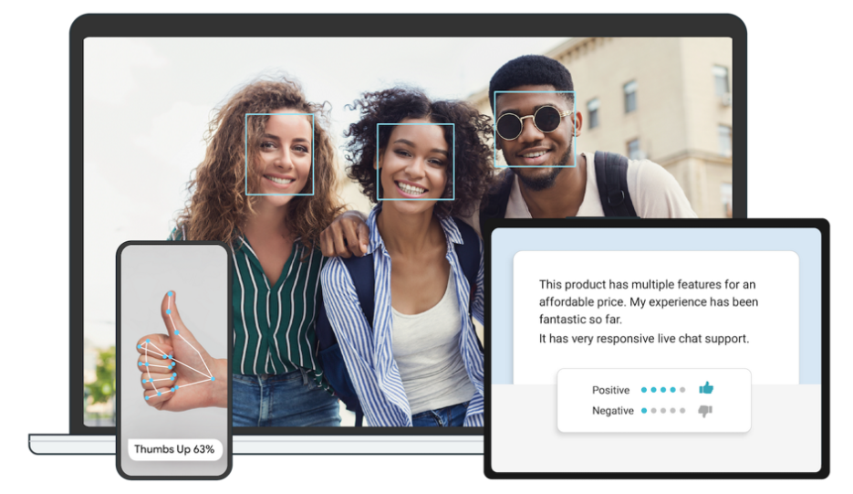

#### 7.3.1.2 MediaPipe Pros and Cons

* **Advantages of MediaPipe**

1. Supports various platforms and languages, such as iOS, Android, C++, Python, JavaScript, Coral, etc.
2. Fast processing speed. Models can generally achieve real-time execution.
3. High reusability for both models and code.

* **Disadvantages of MediaPipe**

1. Slightly heavy for mobile platforms, requiring at least 10MB of storage space.
2. Deeply dependent on TensorFlow. Switching to other machine learning frameworks requires significant code modifications.
3. Utilizes static graphs, which helps improve efficiency but makes debugging more difficult.

#### 7.3.1.3 MediaPipe Workflow

The following figure illustrates the MediaPipe workflow. The solid line section requires manual coding, while the dashed line section does not. AI-related models are already integrated internally within MediaPipe, allowing developers to utilize MediaPipe to quickly deduce the framework needed to implement a specific function.

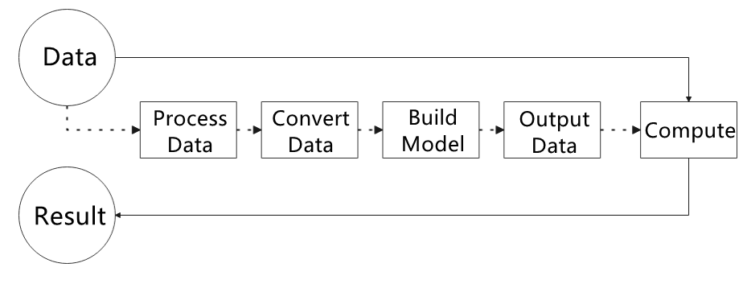

* **Dependencies**

MediaPipe relies on OpenCV to process video and FFMPEG to process audio data. It has other dependencies as well, such as OpenGL/Metal, TensorFlow, Eigen, etc. It is recommended to have a basic understanding of OpenCV before starting with MediaPipe. Refer to [1. Tutorials\2. Basics Course\3. OpenCV Computer Vision Course](https://drive.google.com/drive/folders/1X_9v5NEq8JVsFhc1CJ0OyW7e6nQME2yI?usp=sharing) for related information.

* **MediaPipe Solutions**

Solutions are open-source, pre-built examples based on specific pre-trained TensorFlow or TFLite models. MediaPipe Solutions are built on top of the framework. Currently, 16 Solutions are provided. These include Face Detection, Face Mesh, Iris, Hands, Pose, Holistic, and more.

#### 7.3.1.4 MediaPipe Learning Resources

MediaPipe Official Website: [https://developers.google.com/mediapipe](https://developers.google.com/mediapipe)

MediaPipe Wiki: [http://i.bnu.edu.cn/wiki/index.php?title=Mediapipe](http://i.bnu.edu.cn/wiki/index.php?title=Mediapipe)

MediaPipe GitHub: [https://github.com/google/mediapipe](https://github.com/google/mediapipe)

dlib Official Website: [http://dlib.net/](http://dlib.net/)

dlib GitHub: [https://github.com/davisking/dlib](https://github.com/davisking/dlib)

### 7.3.2 Fingertip Trajectory Recognition

By using the MediaPipe hand detection model to identify palm joints, the robot begins to lock onto the fingertip within the frame after recognizing a specific gesture, tracking the fingertip, and drawing its movement trajectory.

#### 7.3.2.1 Experiment Introduction

First, a hand recognizer is instantiated to obtain hand keypoint information and connect the keypoints.

Next, the keypoints are normalized to calculate the finger angles and the current gesture.

Finally, under a specific gesture, the system begins tracking and recording the movement trajectory points of the finger, returning the recognized trajectory image.

This section utilizes two technologies. One is the computer vision library OpenCV, used to acquire the incoming image and perform color space conversion, outputting the recognized hand feature model points. The recognition method employs MediaPipe, a cross-platform, open-source framework developed by Google for building real-time, machine-learning-based applications.

It provides a series of computer vision and machine learning algorithms and tools, including object detection, face detection, keypoint detection, hand tracking, semantic segmentation, etc. These algorithms are pre-trained, can run on mobile devices, desktops, and servers, achieve real-time processing, and finally display the recognized gesture features on the screen.

#### 7.3.2.2 Operation Steps

> [!NOTE]
> **Commands are strictly case-sensitive, and the Tab key can be used to auto-complete keywords.**

1. Power on ROSpider and remotely connect to the system desktop via NoMachine. For instructions on connecting to the remote desktop, refer to **[1. ROSpider User Manual \1.4 Development Environment Setup](https://wiki.hiwonder.com/projects/ROSpider/en/jetson-nano-version/docs/1_ROSpider_User_Manual.html#development-environment-setup)**.
2. Click the desktop icon  to open the command line terminal.
3. Enter the command and press **Enter** to stop auto-start services.

```bash
~/.stop_ros.sh
```

4. Enter the command to start the feature and press **Enter**.

```bash
ros2 launch example finger_trajectory.launch.py
```

5. To stop the feature, press **Ctrl + C** in the terminal interface. If the feature does not close immediately, try pressing **Ctrl + C** a few more times.

#### 7.3.2.3 Program Outcome

After starting the feature, place a hand within the camera's recognition range. Once the robot detects the hand, the hand keypoints will be connected. When a single extended index finger is detected, the buzzer will emit a beep, entering the fingertip trajectory recognition mode, and the fingertip's trajectory will be drawn on the screen.

When the gesture changes to an open palm with five fingers spreading, trajectory recognition will stop, and a recognized trajectory image window will be returned.

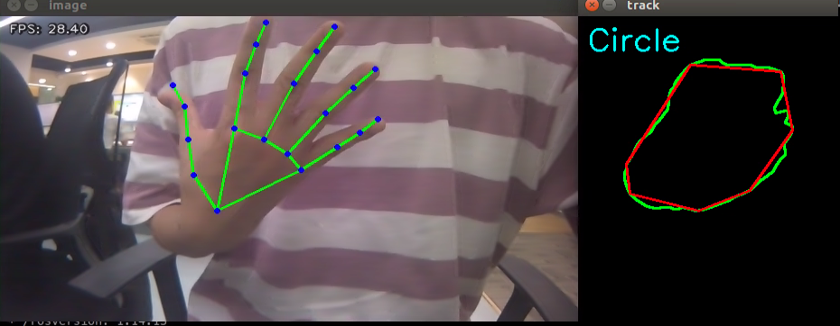

#### 7.3.2.4 Program Analysis

* **Launch File Analysis**

This launch file is located at: **ros2_ws/src/example/example/mediapipe_example/finger_trajectory.launch.py**

1. Start other launch files, such as the file used to start the depth camera.

```python
depth_camera_launch = IncludeLaunchDescription(
    PythonLaunchDescriptionSource(
        os.path.join(peripherals_package_path, 'launch/depth_camera.launch.py')),
)
```

2. Start the node used for fingertip trajectory recognition.

```python
finger_trajectory_node = Node(
    package='example',
    executable='finger_trajectory',
    output='screen',
)
```

* **Python File Analysis**

The program source code is located at: **ros2_ws/src/example/example/mediapipe_example/include/finger_trajectory.py**

1. Finger Type Classification

```python
def hand_angle(landmarks):
    angle_list = []
    # thumb 
    angle_ = vector_2d_angle(landmarks[3] - landmarks[4], landmarks[0] - landmarks[2])
    angle_list.append(angle_)
    # index 
    angle_ = vector_2d_angle(landmarks[0] - landmarks[6], landmarks[7] - landmarks[8])
    angle_list.append(angle_)
    # middle 
    angle_ = vector_2d_angle(landmarks[0] - landmarks[10], landmarks[11] - landmarks[12])
    angle_list.append(angle_)
    # ring 
    angle_ = vector_2d_angle(landmarks[0] - landmarks[14], landmarks[15] - landmarks[16])
    angle_list.append(angle_)
    # pink 
    angle_ = vector_2d_angle(landmarks[0] - landmarks[18], landmarks[19] - landmarks[20])
    angle_list.append(angle_)
    angle_list = [abs(a) for a in angle_list]
    return angle_list
```

After extracting the hand feature points, logical processing is required. By determining the angle relationships between feature points, the specific finger type can be identified. Pass the feature point collection `landmarks(results)`, then use the `vector_2d_angle` function to calculate the angles between corresponding feature points.

2. Gesture Feature Detection

```python
def h_gesture(angle_list):
    thr_angle, thr_angle_thumb, thr_angle_s = 65.0, 53.0, 49.0
    if (angle_list[0] < thr_angle_s) and (angle_list[1] < thr_angle_s) and (angle_list[2] < thr_angle_s) and (
            angle_list[3] < thr_angle_s) and (angle_list[4] < thr_angle_s):
        gesture_str = "five"
    elif (angle_list[0] > 5) and (angle_list[1] < thr_angle_s) and (angle_list[2] > thr_angle) and (
            angle_list[3] > thr_angle) and (angle_list[4] > thr_angle):
        gesture_str = "one"
    else:
        gesture_str = "none"
    return gesture_str
```

Determines the current gesture based on finger bending angles.

3. `draw_points` Function

```python
def draw_points(img, points, tickness=4, color=(255, 0, 0)):
    points = np.array(points).astype(dtype=np.int32)
    if len(points) > 2:
        for i, p in enumerate(points):
            if i + 1 >= len(points):
                break
            cv2.line(img, p, points[i + 1], color, tickness)
```

Connects the recorded trajectory points point by point and draws them on the image.

4. `get_track_img` Function

```python
def get_track_img(points):
    points = np.array(points).astype(dtype=np.int32)
    x_min, y_min = np.min(points, axis=0).tolist()
    x_max, y_max = np.max(points, axis=0).tolist()
    track_img = np.full([y_max - y_min + 100, x_max - x_min + 100, 1], 0, dtype=np.uint8)
    points = points - [x_min, y_min]
    points = points + [50, 50]
    draw_points(track_img, points, 1, (255, 255, 255))
    return track_img

```

Generates a trajectory image with a black background and white lines using the recorded trajectory points.

5. Class Initialization

```python
def __init__(self, name):
    rclpy.init()
    super().__init__(name, allow_undeclared_parameters=True, automatically_declare_parameters_from_overrides=True)
    self.drawing = mp.solutions.drawing_utils
    self.timer = time.time()

    self.hand_detector = mp.solutions.hands.Hands(
        static_image_mode=False,
        max_num_hands=1,
        min_tracking_confidence=0.05,
        min_detection_confidence=0.6
    )


    self.bridge = CvBridge()  # For conversion between ROS Image messages and OpenCV images
    self.image_queue = queue.Queue(maxsize=2)
    self.state = State.NULL
    self.running = True
    self.points = []
    self.start_count = 0
    self.no_finger_timestamp = time.time()

    timer_cb_group = ReentrantCallbackGroup()
    self.image_sub = self.create_subscription(Image, '/depth_cam/rgb/image_raw', self.image_callback, 1)  # Subscribe to the camera
    self.joints_pub = self.create_publisher(ServosPosition, '/servo_controller', 1) # Servo control

    threading.Thread(target=self.main, daemon=True).start()
    self.get_logger().info('\033[1;32m%s\033[0m' % 'Press the Spacebar to clear the recorded trajectory.')  
```

Initializes the node, creating image subscriptions and servo control publishing.

6. Image Callback

```python
def image_callback(self, ros_image):
    # Convert the screen to OpenCV format
    cv_image = self.bridge.imgmsg_to_cv2(ros_image, "bgr8")
    bgr_image = np.array(cv_image, dtype=np.uint8)

    if self.image_queue.full():
        # If the queue is full, discard the oldest image
        self.image_queue.get()
    # Put the image into the queue
    self.image_queue.put(bgr_image)
```

Converts ROS image messages to OpenCV format and caches them.

7. Main Loop

```python
def main(self):
    while self.running:

        bgr_image = self.image_queue.get()
        bgr_image = cv2.flip(bgr_image, 1) # Mirrored image
        result_image = np.copy(bgr_image) # Make a copy for result display to prevent modification of the image during processing
        if self.timer <= time.time() and self.state == State.RUNNING:
            self.state = State.NULL
        try:
            results = self.hand_detector.process(bgr_image) if self.state != State.RUNNING else None
            if results is not None and results.multi_hand_landmarks:
                gesture = "none"
                index_finger_tip = [0, 0]
                self.no_finger_timestamp = time.time()  # Note the current time for timeout handling
                for hand_landmarks in results.multi_hand_landmarks:
                    self.drawing.draw_landmarks(
                        result_image,
                        hand_landmarks,
                        mp.solutions.hands.HAND_CONNECTIONS)
                    landmarks = get_hand_landmarks(bgr_image, hand_landmarks.landmark)
                    angle_list = (hand_angle(landmarks))
                    gesture = (h_gesture(angle_list))
                    index_finger_tip = landmarks[8].tolist()

                if self.state == State.NULL:
                    if gesture == "one":  # Detect the index finger extended while the other fingers are clenched into a fist
                        self.start_count += 1
                        if self.start_count > 20:
                            self.state = State.TRACKING
                            self.points = []
                    else:
                        self.start_count = 0

                elif self.state == State.TRACKING:
                    if gesture == "five": # Finish drawing when all five fingers are spread out
                        self.state = State.NULL

                        # Generate a black and white trajectory image
                        track_img = get_track_img(self.points)
                        contours = cv2.findContours(track_img, cv2.RETR_EXTERNAL, cv2.CHAIN_APPROX_NONE)[-2]
                        contour, area = get_area_max_contour(contours, 300)

                        # Identify the drawn shape based on the trajectory image
                        track_img = cv2.fillPoly(track_img, [contour, ], (255, 255, 255))
                        for _ in range(3):
                            track_img = cv2.erode(track_img, cv2.getStructuringElement(cv2.MORPH_RECT, (5, 5)))
                            track_img = cv2.dilate(track_img, cv2.getStructuringElement(cv2.MORPH_RECT, (5, 5)))
                        contours = cv2.findContours(track_img, cv2.RETR_EXTERNAL, cv2.CHAIN_APPROX_NONE)[-2]
                        contour, area = get_area_max_contour(contours, 300)
                        h, w = track_img.shape[:2]

                        track_img = np.full([h, w, 3], 0, dtype=np.uint8)
                        track_img = cv2.drawContours(track_img, [contour, ], -1, (0, 255, 0), 2)
                        approx = cv2.approxPolyDP(contour, 0.026 * cv2.arcLength(contour, True), True)
                        track_img = cv2.drawContours(track_img, [approx, ], -1, (0, 0, 255), 2)

                        print(len(approx))
                        # Determine the shape based on the number of vertices in the contour envelope
                        if len(approx) == 3:
                            cv2.putText(track_img, 'Triangle', (10, 40),cv2.FONT_HERSHEY_SIMPLEX, 1.2, (255, 255, 0), 2)
                        if len(approx) == 4 or len(approx) == 5:
                            cv2.putText(track_img, 'Square', (10, 40),cv2.FONT_HERSHEY_SIMPLEX, 1.2, (255, 255, 0), 2)
                        if 5 < len(approx) < 10:
                            cv2.putText(track_img, 'Circle', (10, 40),cv2.FONT_HERSHEY_SIMPLEX, 1.2, (255, 255, 0), 2)
                        if len(approx) == 10:
                            cv2.putText(track_img, 'Star', (10, 40),cv2.FONT_HERSHEY_SIMPLEX, 1.2, (255, 255, 0), 2)

                        cv2.imshow('track', track_img)

                    else:
                        if len(self.points) > 0:
                            if distance(self.points[-1], index_finger_tip) > 5:
                                self.points.append(index_finger_tip)
                        else:
                            self.points.append(index_finger_tip)

                    draw_points(result_image, self.points)
                else:
                    pass
            else:
                if self.state == State.TRACKING:
                    if time.time() - self.no_finger_timestamp > 2:
                        self.state = State.NULL
                        self.points = []

        except Exception as e:
            self.get_logger().error(str(e))

        cv2.imshow('image', result_image)
        key = cv2.waitKey(1) 

        if key == ord(' '): # Press the spacebar to clear the recorded trajectory
            self.points = []
```

Detects hand keypoints using MediaPipe and draws the keypoint connections. Detecting the **one** gesture with the index finger extended clears the historical trajectory. Detecting the **five** gesture with five fingers extended ends the trajectory, generates the trajectory image, and recognizes the shape. Listens for keyboard events, pressing the spacebar to clear the trajectory.

### 7.3.3 Gesture Recognition

Through the gesture recognition program, the recognized gesture information is printed on the image and the terminal.

#### 7.3.3.1 Experiment Introduction

First, a hand recognition model needs to be set up, and the RGB image is obtained by subscribing to the topic messages published by the camera node.

Subsequently, the image undergoes processing such as flipping, and the hand information within the image is detected.

Finally, the recognition results are fed back in the command line terminal and the returned video frame.

#### 7.3.3.2 Operation Steps

> [!NOTE]
> **Commands are strictly case-sensitive, and the Tab key can be used to auto-complete keywords.**

1. Power on ROSpider and remotely connect to the system desktop via NoMachine. For instructions on connecting to the remote desktop, refer to **[1. ROSpider User Manual \1.4 Development Environment Setup](https://wiki.hiwonder.com/projects/ROSpider/en/jetson-nano-version/docs/1_ROSpider_User_Manual.html#development-environment-setup)**.
2. Click the desktop icon  to open the command line terminal.
3. Enter the command and press **Enter** to stop auto-start services.

```bash
~/.stop_ros.sh
```

4. Enter the command and press **Enter** to start the feature.

```bash
ros2 launch example hand_detect.launch.py
```

5. To stop the feature, press **Ctrl + C** in the terminal interface. If the feature does not close immediately, try pressing **Ctrl + C** a few more times.

#### 7.3.3.3 Program Outcome

After starting the feature, perform specific gestures within the camera's field of view. When the robot recognizes a gesture, hand keypoints will be identified in the returned video frame.

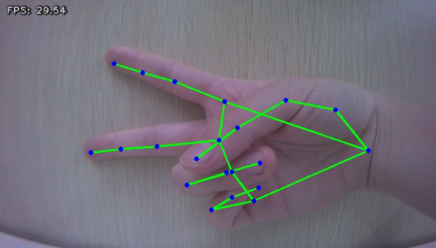

#### 7.3.3.4 Program Analysis

* **Launch File Analysis**

This launch file is located at: **ros2_ws/src/example/example/mediapipe_example/hand_detect.launch.py**

1. Start other launch files, such as the file used to start the depth camera.

```python
depth_camera_launch = IncludeLaunchDescription(
    PythonLaunchDescriptionSource(
        os.path.join(peripherals_package_path, 'launch/depth_camera.launch.py')),
)
```

2. Start the node used for gesture recognition.

```python
hand_detect_node = Node(
    package='example',
    executable='hand_detect',
    output='screen',
)
```

* **Python File Analysis**

The program source code is located at: **ros2_ws/src/example/example/mediapipe_example/include/hand_detect.py**

1. Class Initialization

```python
def __init__(self, name):
    rclpy.init()
    super().__init__(name)
    self.running = True
    self.bridge = CvBridge()
    model_path = os.path.join(os.path.abspath(os.path.split(os.path.realpath(__file__))[0]), 'model/hand_landmarker.task')
    base_options = python.BaseOptions(model_asset_path=model_path)
    options = vision.HandLandmarkerOptions(base_options=base_options, num_hands=2)
    self.detector = vision.HandLandmarker.create_from_options(options)
    self.image_queue = queue.Queue(maxsize=2)
    self.image_sub = self.create_subscription(Image, '/depth_cam/rgb/image_raw', self.image_callback, 1)
    self.get_logger().info('\033[1;32m%s\033[0m' % 'start')
    threading.Thread(target=self.main, daemon=True).start()
```

Initializes the node, creating image subscriptions and a data queue.

2. Image Callback

```python
def image_callback(self, ros_image):
    cv_image = self.bridge.imgmsg_to_cv2(ros_image, "rgb8")
    rgb_image = np.array(cv_image, dtype=np.uint8)
    if self.image_queue.full():
        # If the queue is full, remove the oldest image
        self.image_queue.get()
        # Put the image into the queue
    self.image_queue.put(rgb_image)

```

Receives ROS image messages, converts the format, and caches them in the queue.

3. Main Loop

```python
def main(self):
    while self.running:
        try:
            image = self.image_queue.get(block=True, timeout=1)
        except queue.Empty:
            if not self.running:
                break
            else:
                continue
        image = cv2.flip(image, 1)
        mp_image = mp.Image(image_format=mp.ImageFormat.SRGB, data=image)
        detection_result = self.detector.detect(mp_image)
        annotated_image = draw_hand_landmarks_on_image(image, detection_result)
        result_image = cv2.cvtColor(annotated_image, cv2.COLOR_RGB2BGR)
        cv2.imshow('hand_detect', result_image)
        key = cv2.waitKey(1)
        if key == ord('q') or key == 27:  # Press Q or Esc to quit
            break
    cv2.destroyAllWindows()
    rclpy.shutdown()
```

Continuously fetches images from the queue, executes hand keypoint detection, performs visualization drawing, and handles the exit logic.

### 7.3.4 Gesture Control

Utilizing MediaPipe's hand detection model and the logical calculation of feature points, the robot is controlled to perform corresponding actions after recognizing specific gestures, such as a finger heart, fist, etc.

#### 7.3.4.1 Experiment Introduction

First, a MediaPipe hand detection model must be set up, and the image is obtained by subscribing to topic messages published by the camera node.

Then, the image undergoes processing such as flipping, and the hand information within the image is detected.

Next, based on the connections of hand keypoints, the finger angles are calculated to complete gesture determination.

Finally, the robot is commanded to execute the feedback action for the gesture, the gesture name is printed in the returned video frame, and the hand keypoints and connections are identified.

This section utilizes the computer vision library OpenCV to acquire incoming images and perform color space conversion, outputting the recognized hand feature model points. The recognition method uses MediaPipe, a cross-platform, open-source framework developed by Google for building real-time, machine-learning-based applications. It provides a series of computer vision and machine learning algorithms and tools, including object detection, face detection, keypoint detection, hand tracking, semantic segmentation, etc. These pre-trained algorithms can run on mobile devices, desktops, and servers, achieving real-time processing and displaying the recognized gesture features on the screen.

#### 7.3.4.2 Operation Steps

> [!NOTE]
> **Commands are strictly case-sensitive, and the Tab key can be used to auto-complete keywords.**

1. Power on ROSpider and remotely connect to the system desktop via NoMachine. For instructions on connecting to the remote desktop, refer to **[1. ROSpider User Manual \1.4 Development Environment Setup](https://wiki.hiwonder.com/projects/ROSpider/en/jetson-nano-version/docs/1_ROSpider_User_Manual.html#development-environment-setup)**.
2. Click the desktop icon  to open the command line terminal.
3. Enter the command and press **Enter** to stop auto-start services.

```bash
~/.stop_ros.sh
```

4. Enter the command to start the feature and press **Enter**.

```bash
ros2 launch example hand_gesture.launch.py
```

5. To stop the feature, press **Ctrl + C** in the terminal interface. If the feature does not close immediately, try pressing **Ctrl + C** a few more times.

#### 7.3.4.3 Program Outcome

After starting the feature, perform specific gestures within the camera's field of view. When a gesture is recognized, the robot will execute the corresponding feedback action. In addition, the gesture name will be printed, and hand keypoints will be marked in the returned video frame.

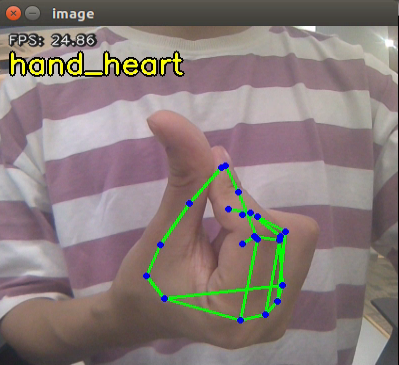

The following table explains the recognizable gestures:

| **Gesture Name** | **Gesture Description** | **Example**                                                  | **Feedback Action**                 |
| ---------------- | ----------------------- | ------------------------------------------------------------ | ----------------------------------- |
| gun              | Finger gun              | 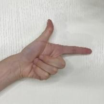 | Attack (attack)                     |
| hand_heart       | Finger heart            | 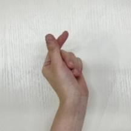 | Twist body (twist_l)                |
| OK               | OK                      | 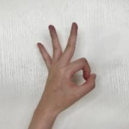 | Wave left front leg to greet (wave) |
| fist             | Fist                    | 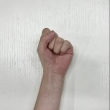 | Lunge forward (forward_flutter)     |


#### 7.3.4.4 Program Analysis

* **Launch File Analysis**

This launch file is located at: **ros2_ws/src/example/example/mediapipe_example/hand_gesture.launch.py**

1. Start other launch files, such as the files used to start the depth camera and servo control.

```python
depth_camera_launch = IncludeLaunchDescription(
    PythonLaunchDescriptionSource(
        os.path.join(peripherals_package_path, 'launch/depth_camera.launch.py')),
)

controller_launch = IncludeLaunchDescription(
    PythonLaunchDescriptionSource(
        os.path.join(controller_package_path, 'launch/controller.launch.py')),
)
```

2. Start the node used for gesture control.

```python
hand_gesture_node = Node(
    package='example',
    executable='hand_gesture',
    output='screen',
)
```

* **Python File Analysis**

The program source code is located at: **ros2_ws/src/example/example/mediapipe_example/include/hand_gesture.py**

1. Finger Type Classification

```python
def hand_angle(landmarks):
    angle_list = []
    # thumb 
    angle_ = vector_2d_angle(landmarks[3] - landmarks[4], landmarks[0] - landmarks[2])
    angle_list.append(angle_)
    # index 
    angle_ = vector_2d_angle(landmarks[0] - landmarks[6], landmarks[7] - landmarks[8])
    angle_list.append(angle_)
    # middle 
    angle_ = vector_2d_angle(landmarks[0] - landmarks[10], landmarks[11] - landmarks[12])
    angle_list.append(angle_)
    # ring 
    angle_ = vector_2d_angle(landmarks[0] - landmarks[14], landmarks[15] - landmarks[16])
    angle_list.append(angle_)
    # pink 
    angle_ = vector_2d_angle(landmarks[0] - landmarks[18], landmarks[19] - landmarks[20])
    angle_list.append(angle_)
    angle_list = [abs(a) for a in angle_list]
    return angle_list
```

After extracting the hand feature points, logical processing is required to calculate the angles between corresponding feature points using the `vector_2d_angle` function, thus identifying the specific finger type from the passed feature point collection `landmarks(results)`.

2. Gesture Feature Detection

```python
def h_gesture(angle_list):
    thr_angle, thr_angle_thumb, thr_angle_s = 65.0, 53.0, 49.0
    if (angle_list[0] > thr_angle_thumb) and (angle_list[1] > thr_angle) and (angle_list[2] > thr_angle) and (
            angle_list[3] > thr_angle) and (angle_list[4] > thr_angle):
        gesture_str = "fist"
    elif (angle_list[0] < thr_angle_s) and (angle_list[1] < thr_angle_s) and (angle_list[2] > thr_angle) and (
            angle_list[3] > thr_angle) and (angle_list[4] > thr_angle):
        gesture_str = "gun"
    elif (angle_list[0] < thr_angle_s) and (angle_list[1] > thr_angle) and (angle_list[2] > thr_angle) and (
            angle_list[3] > thr_angle) and (angle_list[4] > thr_angle):
        gesture_str = "hand_heart"
    elif (angle_list[0] > 5) and (angle_list[1] < thr_angle_s) and (angle_list[2] > thr_angle) and (
            angle_list[3] > thr_angle) and (angle_list[4] > thr_angle):
        gesture_str = "one"
    elif (angle_list[0] > thr_angle_thumb) and (angle_list[1] < thr_angle_s) and (angle_list[2] < thr_angle_s) and (
            angle_list[3] > thr_angle) and (angle_list[4] > thr_angle):
        gesture_str = "two"
    elif (angle_list[0] > thr_angle_thumb) and (angle_list[1] < thr_angle_s) and (angle_list[2] < thr_angle_s) and (
            angle_list[3] < thr_angle_s) and (angle_list[4] > thr_angle):
        gesture_str = "three"
    elif (angle_list[0] > thr_angle_thumb) and (angle_list[1] > thr_angle) and (angle_list[2] < thr_angle_s) and (
            angle_list[3] < thr_angle_s) and (angle_list[4] < thr_angle_s):
        gesture_str = "OK"
    elif (angle_list[0] > thr_angle_thumb) and (angle_list[1] < thr_angle_s) and (angle_list[2] < thr_angle_s) and (
            angle_list[3] < thr_angle_s) and (angle_list[4] < thr_angle_s):
        gesture_str = "four"
    elif (angle_list[0] < thr_angle_s) and (angle_list[1] < thr_angle_s) and (angle_list[2] < thr_angle_s) and (
            angle_list[3] < thr_angle_s) and (angle_list[4] < thr_angle_s):
        gesture_str = "five"
    elif (angle_list[0] < thr_angle_s) and (angle_list[1] > thr_angle) and (angle_list[2] > thr_angle) and (
            angle_list[3] > thr_angle) and (angle_list[4] < thr_angle_s):
        gesture_str = "six"
    else:
        gesture_str = "none"

    return gesture_str
```

Determines the current gesture based on finger bending angles.

3. Class Initialization

```python
def __init__(self, name):
    rclpy.init()
    super().__init__(name, allow_undeclared_parameters=True, automatically_declare_parameters_from_overrides=True)
    self.drawing = mp.solutions.drawing_utils
    self.hand_detector = mp.solutions.hands.Hands(
        static_image_mode=False,
        max_num_hands=1,
        min_tracking_confidence=0.4,
        min_detection_confidence=0.4
    )

    self.lock = threading.RLock()
    self.fps = fps.FPS()  # FPS calculator
    self.bridge = CvBridge()  # For conversion between ROS Image messages and OpenCV images
    self.image_queue = queue.Queue(maxsize=2)
    self.running = True
    self.draw = True
    self.state = State.NULL
    self.points = [[0, 0], ]
    self.no_finger_timestamp = time.time()
    self.one_count = 0
    self.count = 0
    self.direction = ""
    self.last_gesture = "none"
    self.gesture = None
    self.debug = self.get_parameter('debug').value
    self.controller = step_controller.StepController()
    self.gesture_list = ('gun', 'hand_heart', 'OK', 'fist')

    self.timer_cb_group = ReentrantCallbackGroup()
    self.joints_pub = self.create_publisher(ServosPosition, '/servo_controller', 1) # Servo control
    self.buzzer_pub = self.create_publisher(BuzzerState, '/ros_robot_controller/set_buzzer', 1) # Buzzer control

    self.agc_controller = ActionGroupController(self.create_publisher(ServosPosition, 'servo_controller', 1), '/home/ubuntu/software/actionset_editor/ActionGroups')
    self.client = self.create_client(Trigger, '/controller_manager/init_finish')
    self.client.wait_for_service()

    self.image_sub = self.create_subscription(Image, '/depth_cam/rgb/image_raw', self.image_callback, 1)  # Subscribe to the camera
    self.timer = self.create_timer(0.0, self.init_process, callback_group=self.timer_cb_group)
```

Initializes the node, creating image subscriptions, and servo and buzzer control publishing.

4. `init_process` Method

```python
def init_process(self):
    self.timer.cancel()
    self.init_action()

    threading.Thread(target=self.main, daemon=True).start()
    threading.Thread(target=self.do_act, daemon=True).start()
    self.create_service(Trigger, '~/init_finish', self.get_node_state)
    self.get_logger().info('\033[1;32m%s\033[0m' % 'start')
```

Node initialization workflow, starting core threads and services.

5. `init_action` Method

```python
def init_action(self):
    self.controller.set_build_in_pose('DEFAULT_POSE', 1)
    time.sleep(1)
    joint_angle = [500, 750, 200, 150, 500, 600]
    set_servo_position(self.joints_pub, 1, ((19, joint_angle[0]), (20, joint_angle[1]), (21, joint_angle[2]), (22, joint_angle[3]), (23, joint_angle[4]), (24, joint_angle[5])))
    time.sleep(1)
```

Initialization action upon node startup, putting the robot into the initial pose.

6. `do_act` Method

```python
def do_act(self):
    ACTION = {  'gun' : 'attack',
                'hand_heart' : 'twist_l',
                'OK' : 'wave',
                'fist' : 'forward_flutter'}

    LOCK_SERVOS={'19':500, '20':750, '21':200, '22':150,  '23':500,  '24':600}

    while self.running:
        with self.lock:
            if self.gesture is not None and self.gesture in ACTION:
                self.set_buzzer(0.2, 0.01, 1)
                self.agc_controller.run_action(ACTION[self.gesture],lock_servos=LOCK_SERVOS)
                self.count = 0
                self.last_gesture = "none"
                self.state = State.NULL
                self.draw = True
                self.gesture = None
        time.sleep(0.01)
```

Gesture action mapping execution thread, converting valid detected gestures into robot actions.

7. Buzzer

```python
def set_buzzer(self, on_time, off_time, repeat):
    # Set buzzer
    msg = BuzzerState()
    msg.freq = 1900
    msg.on_time = on_time
    msg.off_time = off_time
    msg.repeat = repeat
    self.buzzer_pub.publish(msg)

```

Controls the buzzer sound, providing feedback for successful gesture recognition.

8. Image Callback

```python
def image_callback(self, ros_image):
    # Convert the screen to OpenCV format
    cv_image = self.bridge.imgmsg_to_cv2(ros_image, "bgr8")
    bgr_image = np.array(cv_image, dtype=np.uint8)

    if self.image_queue.full():
        # If the queue is full, discard the oldest image
        self.image_queue.get()
    # Put the image into the queue
    self.image_queue.put(bgr_image)
```

Converts ROS image messages to OpenCV format and caches them in the queue.

9. Main Loop

```python
def main(self):
    while self.running:
        bgr_image = self.image_queue.get()
        bgr_image = cv2.flip(bgr_image, 1) # Mirrored image
        result_image = np.copy(bgr_image) # Make a copy for result display to prevent modification of the image during processing

        if time.time() - self.no_finger_timestamp > 2:
            self.direction = ""
        else:
            if self.direction != "":
                cv2.putText(result_image, self.direction, (10, 100), cv2.FONT_HERSHEY_SIMPLEX, 1, (255, 0, 0), 2)
        try:
            results = self.hand_detector.process(bgr_image) # Hand and key points recognition
            if results.multi_hand_landmarks and self.draw :
                gesture = "none"
                index_finger_tip = [0, 0]
                for hand_landmarks in results.multi_hand_landmarks: 
                    self.drawing.draw_landmarks(
                        result_image,
                        hand_landmarks,
                        mp.solutions.hands.HAND_CONNECTIONS)
                    h, w = bgr_image.shape[:2]
                    landmarks = get_hand_landmarks((w, h), hand_landmarks.landmark)
                    angle_list = hand_angle(landmarks)
                    gesture = h_gesture(angle_list) # Judge gesture based on key points position
                    index_finger_tip = landmarks[8].tolist()

                cv2.putText(result_image, gesture.upper(), (10, 100), cv2.FONT_HERSHEY_SIMPLEX, 1.2, (0, 0, 0), 5)
                cv2.putText(result_image, gesture.upper(), (10, 100), cv2.FONT_HERSHEY_SIMPLEX, 1.2, (255, 255, 0), 2)
                draw_points(result_image, self.points[1:])
                if self.state != State.RUNNING :
                    if gesture in self.gesture_list :
                        if gesture == self.last_gesture :
                            self.count += 1
                        else:
                            self.count = 0
                        if self.count > 20:
                            self.count = 0
                            self.state = State.RUNNING
                            self.draw = False
                            self.gesture = gesture
                else:
                    self.count = 0
                self.last_gesture = gesture

            else:
                if self.state != State.NULL:
                    if time.time() - self.no_finger_timestamp > 2:
                        self.one_count = 0
                        self.points = [[0, 0],]
                        self.state = State.NULL

        except Exception as e:
            self.get_logger().error(str(e))

        if result_image is not None :
            cv2.imshow('result_image', result_image)
            key = cv2.waitKey(1)
    self.init_action()
    rclpy.shutdown()
```

Fetches the image from the queue, detects hand keypoints via MediaPipe, calculates finger angles to obtain the gesture type, draws the gesture name on the image, and displays the processed image using `cv2.imshow`.

### 7.3.5 Face Detection and Tracking

Using MediaPipe's face detection model, ROSpider adjusts the pan-tilt servo angles based on the face's position, enabling real-time face tracking.

#### 7.3.5.1 Experiment Introduction

First, a face detection model is established, and the RGB image is acquired by subscribing to the topic messages published by the camera node.

Subsequently, face information within the image is detected and processed to determine the tracking target.

Finally, ROSpider is controlled to track the face based on the distance between the target face center and the center of the frame.

#### 7.3.5.2 Operation Steps

> [!NOTE]
> **Commands are strictly case-sensitive, and the Tab key can be used to auto-complete keywords.**

1. Power on ROSpider and remotely connect to the system desktop via NoMachine. For instructions on connecting to the remote desktop, refer to **[1. ROSpider User Manual \1.4 Development Environment Setup](https://wiki.hiwonder.com/projects/ROSpider/en/jetson-nano-version/docs/1_ROSpider_User_Manual.html#development-environment-setup)**.
2. Click the desktop icon  to open the command line terminal.
3. Enter the command and press **Enter** to stop auto-start services.

```bash
~/.stop_ros.sh
```

4. Enter the command to start the feature program and press **Enter**.

```bash
ros2 launch example face_track.launch.py
```

5. To stop the feature, press **Ctrl + C** in the terminal interface. If the feature does not close immediately, try pressing **Ctrl + C** a few more times.

#### 7.3.5.3 Program Outcome

After starting the feature, when a face is recognized in the camera's field of view, the robot will adjust the rotation angle of the pan-tilt servos based on the face's location to track. Additionally, the target face and facial keypoints will be marked in the returned video frame.

#### 7.3.5.4 Program Analysis

* **Launch File Analysis**

This launch file is located at: **ros2_ws/src/example/example/mediapipe_example/face_track.launch.py**

1. Start other launch files, such as those for the depth camera and servo control.

```python
depth_camera_launch = IncludeLaunchDescription(
    PythonLaunchDescriptionSource(
        os.path.join(peripherals_package_path, 'launch/depth_camera.launch.py')),
)

controller_launch = IncludeLaunchDescription(
    PythonLaunchDescriptionSource(
        os.path.join(controller_package_path, 'launch/controller.launch.py')),
)
```

2. Start the node used for face tracking.

```python
face_track_node = Node(
    package='example',
    executable='face_track',
    output='screen',
)
```

* **Python File Analysis**

The program source code is located at: **ros2_ws/src/example/example/mediapipe_example/include/face_track.py**

1. Class Initialization

```python
def __init__(self, name):
    rclpy.init()
    super().__init__(name, allow_undeclared_parameters=True, automatically_declare_parameters_from_overrides=True)
    self.face_detector = mp.solutions.face_detection.FaceDetection(
        min_detection_confidence=0.3,
    )
    self.running = True
    self.bridge = CvBridge()
    self.fps = fps.FPS()
    self.controller = step_controller.StepController()
    self.image_queue = queue.Queue(maxsize=2)

    self.z_dis = 0.28
    self.y_dis = 500
    self.x_init = 0.18
    self.pid_z = pid.PID(0.00006, 0.0, 0.0)
    self.pid_y = pid.PID(0.055, 0.0, 0.0)
    self.detected_face = 0 
    self.joints_pub = self.create_publisher(ServosPosition, '/servo_controller', 1) # Servo control

    self.image_sub = self.create_subscription(Image, '/depth_cam/rgb/image_raw', self.image_callback, 1)  # Subscribe to the camera

    self.result_publisher = self.create_publisher(Image, '~/image_result', 1)  # Publish the image processing result
    timer_cb_group = ReentrantCallbackGroup()
    self.create_service(Trigger, '~/start', self.start_srv_callback) # Enter application mode
    self.create_service(Trigger, '~/stop', self.stop_srv_callback, callback_group=timer_cb_group) # Exit application mode
    self.client = self.create_client(Trigger, '/controller_manager/init_finish')
    self.client.wait_for_service()
    self.client = self.create_client(Trigger, '/arm_kinematics/init_finish')
    self.client.wait_for_service()

    self.kinematics_client = self.create_client(SetRobotPose, '/arm_kinematics/set_pose_target')
    self.kinematics_client.wait_for_service()

    self.timer = self.create_timer(0.0, self.init_process, callback_group=timer_cb_group)
```

Initializes the node, creating image subscriptions, servo control publishing, and creating services.

2. `init_process` Method

```python
def init_process(self):
    self.timer.cancel()

    self.init_action()
    self.start_srv_callback(Trigger.Request(), Trigger.Response())

    threading.Thread(target=self.main, daemon=True).start()
    self.create_service(Trigger, '~/init_finish', self.get_node_state)
    self.get_logger().info('\033[1;32m%s\033[0m' % 'start')
```

Node initialization workflow, starting core threads and services.

3. `init_action` Method

```python
def init_action(self):
    self.controller.set_build_in_pose('DEFAULT_POSE', 1)

    msg = set_pose_target([self.x_init, 0.0, self.z_dis], 0.0, [-90.0, 90.0], 1.0)
    res = self.send_request(self.kinematics_client, msg)
    if res.pulse:
        servo_data = res.pulse
        set_servo_position(self.joints_pub, 1.5, ((24, 500), (23, 500), (22, servo_data[3]), (21, servo_data[2]), (20, servo_data[1]), (19, servo_data[0])))
        time.sleep(1.8)
```

Initialization action upon node startup, putting the robot into the initial pose.

4. Main Loop

```python
def main(self):

    while self.running:
        bgr_image = self.image_queue.get()

        result_image = np.copy(bgr_image)
        results = self.face_detector.process(bgr_image)
        boxes, keypoints = mp_face_location(results, bgr_image)
        o_h, o_w = bgr_image.shape[:2]
        if len(boxes) > 0:
            self.detected_face += 1 
            self.detected_face = min(self.detected_face, 20) # Ensure that the count is never greater than 20

            # Start tracking if a face is detected in five consecutive frames to avoid false positives
            if self.detected_face >= 5:
                center = [box_center(box) for box in boxes] # Calculate the center coordinate of all human faces
                dist = [distance(c, (o_w / 2, o_h / 2)) for c in center] # Calculate the distance from the center of each detected face to the center of the screen
                face = min(zip(boxes, center, dist), key=lambda k: k[2]) # Identify the face with the minimum distance to the center of the screen

                center_x, center_y = face[1]
                t1 = time.time()
                self.pid_y.SetPoint = result_image.shape[1]/2 
                self.pid_y.update(center_x)
                self.y_dis += self.pid_y.output
                if self.y_dis < 200:
                    self.y_dis = 200
                if self.y_dis > 800:
                    self.y_dis = 800

                self.pid_z.SetPoint = result_image.shape[0]/2 
                self.pid_z.update(center_y)
                self.z_dis += self.pid_z.output
                if self.z_dis > 0.30:
                    self.z_dis = 0.30
                if self.z_dis < 0.23:
                    self.z_dis = 0.23
                msg = set_pose_target([self.x_init, 0.0, self.z_dis], 0.0, [-180.0, 180.0], 1.0)
                res = self.send_request(self.kinematics_client, msg)
                t2 = time.time()
                t = t2 - t1
                if t < 0.02:
                    time.sleep(0.02 - t)
                if res.pulse:
                    servo_data = res.pulse
                    set_servo_position(self.joints_pub, 0.02, ((24, 500), (23, 500), (22, servo_data[3]), (21, servo_data[2]), (20, servo_data[1]), (19, int(self.y_dis))))
                else:
                    set_servo_position(self.joints_pub, 0.02, ((19, int(self.y_dis)), ))

            result_image = show_faces( result_image, bgr_image, boxes, keypoints) # Display the detected faces and facial key points on the screen
        else: # Here is the processing for when no face is detected         
            if self.detected_face > 0:
                self.detected_face -= 1
            else:
                self.pid_z.clear()
                self.pid_y.clear()


        self.result_publisher.publish(self.bridge.cv2_to_imgmsg(result_image, "bgr8"))
        self.fps.update()
        self.fps.show_fps(result_image)
        cv2.imshow("result", result_image)
        cv2.waitKey(1)

    self.init_action()
    rclpy.shutdown()
```

Fetches the image from the queue, calls MediaPipe to detect and process the image, extracts bounding boxes and keypoints, calculates the distance from the center of all detected faces to the screen center, selects the closest face as the tracking target, draws bounding boxes and keypoints on the image, publishes the processed image, and displays it via `cv2.imshow`.

### 7.3.6 Body Motion Control

By utilizing MediaPipe for real-time deep-learning-based body feature matching, followed by logical calculation of feature points, the robot is controlled to perform corresponding actions.

This section utilizes the computer vision library OpenCV to acquire incoming images and perform color space conversion, outputting the recognized hand feature model points. The recognition method uses MediaPipe, a cross-platform, open-source framework developed by Google for building real-time, machine-learning-based applications. It provides a series of computer vision and machine learning algorithms and tools, including object detection, face detection, keypoint detection, hand tracking, semantic segmentation, etc. These pre-trained algorithms can run on mobile devices, desktops, and servers, achieving real-time processing and displaying the recognized gesture features on the screen.

#### 7.3.6.1 Experiment Introduction

First, a human pose estimator is instantiated to obtain body keypoint information and connect the keypoints.

Then, after processing the points, the arm motion is determined using manual 2D geometric features.

Finally, when both arms are raised high, the system prepares to enter imitation mode. Once the arms are spread horizontally, the motion imitation begins.

#### 7.3.6.2 Operation Steps

> [!NOTE]
> **Commands are strictly case-sensitive, and the Tab key can be used to auto-complete keywords.**

1. Power on ROSpider and remotely connect to the system desktop via NoMachine. For instructions on connecting to the remote desktop, refer to **[1. ROSpider User Manual \1.4 Development Environment Setup](https://wiki.hiwonder.com/projects/ROSpider/en/jetson-nano-version/docs/1_ROSpider_User_Manual.html#development-environment-setup)**.
2. Click the desktop icon  to open the command line terminal.
3. Enter the command and press **Enter** to stop auto-start services.

```bash
~/.stop_ros.sh
```

4. Enter the command to start the feature and press **Enter**.

```bash
ros2 launch example pose_control.launch.py
```

5. To stop the feature, press **Ctrl + C** in the terminal interface. If the feature does not close immediately, try pressing **Ctrl + C** a few more times.

#### 7.3.6.3 Program Outcome

After starting the feature, the robot will switch to a ready pose for imitation. Standing in front of the camera allows body keypoints to be detected and visualized with connecting lines on the display.

When a pose with both arms raised high is recognized, the buzzer will emit a beep, preparing to enter imitation mode. When both arms are then spread horizontally, the robot will begin imitating the motion, and the front legs will move accordingly.

When the system recognizes both arms raised and crossed, it will exit imitation mode.

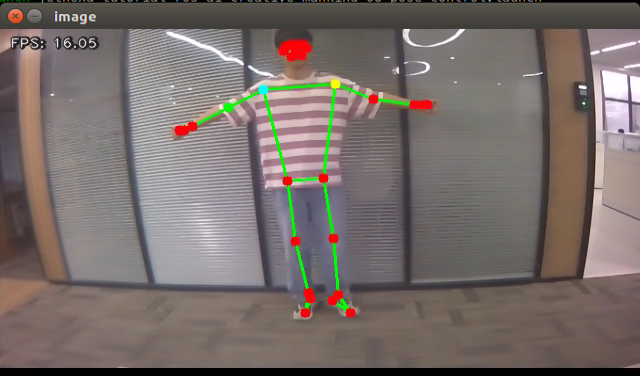

#### 7.3.6.4 Program Analysis

* **Launch File Analysis**

This launch file is located at: **ros2_ws/src/example/example/mediapipe_example/pose_control.launch.py**

1. Start other launch files, such as those for the depth camera and servo control.

```python
depth_camera_launch = IncludeLaunchDescription(
    PythonLaunchDescriptionSource(
        os.path.join(peripherals_package_path, 'launch/depth_camera.launch.py')),
)

controller_launch = IncludeLaunchDescription(
    PythonLaunchDescriptionSource(
        os.path.join(controller_package_path, 'launch/controller.launch.py')),
)
```

2. Start the node used for somatosensory control.

```python
pose_control_node = Node(
    package='example',
    executable='pose_control',
    output='screen',
)
```

* **Python File Analysis**

The program source code is located at: **ros2_ws/src/example/example/mediapipe_example/include/pose_control.py**

1. `get_angle` Function

```python
def get_angle(p1, p2, p3):
    angle = vector_2d_angle(p2 - p1, p3 - p2)
    return angle
```

Calculates the angle formed by three points, with p2 as the vertex.

2. `is_pentagon` Function

```python
def is_pentagon(landmarks):
    shoulder_width = distance(landmarks[12], landmarks[11])  # Shoulder width
    hand_dist = distance(landmarks[16], landmarks[15])  # The distance between the two wrists
    if hand_dist > shoulder_width:  # The hand distance is smaller than the shoulder width
        return False
    for p in landmarks[:7]:  # Both wrists are above the head, higher than the eyes and nose
        if landmarks[15][1] > p[1] or landmarks[16][1] > p[1]:
            return False
    if get_angle(landmarks[11], landmarks[12], landmarks[14]) < 40:
        return False  # The left upper arms are raised more than 40 degrees above the shoulder
    if get_angle(landmarks[13], landmarks[11], landmarks[12]) < 40:
        return False  # The right upper arms are raised more than 40 degrees above the shoulder
    return True
```

Determines the "**both hands raised above the head, arms forming a pentagon with the shoulders**" action, which is the trigger condition to start imitation.

3. `is_level` Function

```python
def is_level(landmarks, angle_threshold=15):
    p0 = landmarks[12].copy()
    p0[0] = 0
    if abs(get_angle(p0, landmarks[12], landmarks[11])) > angle_threshold:
        return False
    return True
```

Determines whether the shoulders are level with the frame.

4. `is_flat` Function

```python
def is_flat(landmarks, angle_threshold):
    arm_marks = [15, 13, 11, 12, 14, 16]
    for i in range(3):
        angle = get_angle(landmarks[arm_marks[i]], landmarks[arm_marks[i + 1]], landmarks[arm_marks[i + 2]])
        if abs(angle) > angle_threshold:
            return False
    return is_level(landmarks, angle_threshold)
```

Determines whether both arms are spread out.

5. `is_cross` Function

```python
def is_cross(landmarks):
    if landmarks[16][0] <= landmarks[15][0]:
        return False
    return is_pentagon(landmarks)
```

Determines whether both arms are raised high and crossed.

6. `mp_pose_landmarks` Function

```python
def mp_pose_landmarks(results, img_rgb, draw=True):
    lm_list = []
    if results and results.pose_landmarks:
        h, w, = img_rgb.shape[:2]
        for idx, lm in enumerate(results.pose_landmarks.landmark):
            cx, cy = int(lm.x * w), int(lm.y * h)
            lm_list.append([cx, cy])
            if draw:
                cv2.circle(img_rgb, (cx, cy), 5, (255, 0, 0), cv2.FILLED)

        cv2.circle(img_rgb, lm_list[11], 5, (255, 255, 0), cv2.FILLED)
        cv2.circle(img_rgb, lm_list[12], 5, (0, 255, 255), cv2.FILLED)
        cv2.circle(img_rgb, lm_list[14], 5, (0, 255, 0), cv2.FILLED)

    if len(lm_list) > 0:
        return np.array(lm_list)
    else:
        return None
```

Extracts keypoint coordinates from pose detection results and visualizes them.

7. Class Initialization

```python
def __init__(self):
    super().__init__('pose_control_node')

    # Initialize MediaPipe pose detection
    self.pose = mp.solutions.pose.Pose(
        static_image_mode=False,
        model_complexity=1,
        min_detection_confidence=0.6,
        min_tracking_confidence=0.7
    )
    self.drawing = mp.solutions.drawing_utils
    self.bridge = CvBridge()
    self.timer_cb_group = ReentrantCallbackGroup()

    self.image_sub = self.create_subscription(Image, '/depth_cam/rgb/image_raw', self.image_callback, 1)  # Subscribe to the camera
    self.joints_pub = self.create_publisher(ServosPosition, '/servo_controller', 1) # Servo control
    self.buzzer_pub = self.create_publisher(BuzzerState, '/ros_robot_controller/set_buzzer', 1) # Buzzer control

    self.agc_controller = ActionGroupController(self.create_publisher(ServosPosition, 'servo_controller', 1), '/home/ubuntu/software/actionset_editor/ActionGroups')
    self.client = self.create_client(Trigger, '/controller_manager/init_finish')
    self.client.wait_for_service()

    # State initialization
    self.state = State.NULL
    self.timestamp = 0
    self.r_x_dist = 0
    self.l_x_dist = 0
    self.count = 0

    self.timer = self.create_timer(0.0, self.init_process, callback_group=self.timer_cb_group)
```

Initializes the node, creating image subscriptions, servo control, and buzzer control.

8. `reset_servos` Method

```python
def reset_servos(self):
    self.get_logger().info("Resetting servos...")
    set_servo_position(self.joints_pub, 1, ((5, RIGHT_SERVO_I_DEFAULT), (3, RIGHT_SERVO_M_DEFAULT), (1, RIGHT_SERVO_O_DEFAULT), (6, LEFT_SERVO_I_DEFAULT), (4, LEFT_SERVO_M_DEFAULT), (2, LEFT_SERVO_O_DEFAULT)))
    time.sleep(1.2)
```

Resets the positions of the 6 servos on both legs.

9. `stop_imitation` Method

```python
def stop_imitation(self):
    self.state = State.NULL
    self.reset_servos()
    self.set_buzzer(0.2, 0.01, 1)
    self.get_logger().info("Imitation mode exited")
```

Exits imitation mode and restores the initial state.

10. `process_landmarks` Method

```python
def process_landmarks(self, landmarks):
    if self.state == State.NULL:
        if time.time() - self.timestamp > 5:
            if is_pentagon(landmarks):
                self.enter_imitation_mode()
    elif self.state == State.INTO_IMITATION_1:
        self.handle_imitation_transition(landmarks)
    else:
        self.handle_imitation(landmarks)
```

Parses human pose based on the node state to achieve state transitions.

11. `handle_imitation` Method

```python
def handle_imitation(self, landmarks):
    self.timestamp = time.time()
    if not is_cross(landmarks):
        self.adjust_servos(landmarks)
    else:
        self.stop_imitation()
```

Processes real-time movements during imitation mode.

12. `adjust_servos` Method

```python
def adjust_servos(self, landmarks):

    left_angle_2 = get_angle(landmarks[11], landmarks[12], landmarks[14])
    left_angle_3 = get_angle(landmarks[12], landmarks[14], landmarks[16])
    right_angle_2 = get_angle(landmarks[12], landmarks[11], landmarks[13])
    right_angle_3 = get_angle(landmarks[11], landmarks[13], landmarks[15])

    raw_right_servo_2 = int(RIGHT_SERVO_M_DEFAULT + PULSE_PER_DEGREE * right_angle_2)
    raw_right_servo_3 = int(RIGHT_SERVO_O_DEFAULT + PULSE_PER_DEGREE * right_angle_3)
    raw_left_servo_2 = int(LEFT_SERVO_M_DEFAULT + PULSE_PER_DEGREE * left_angle_2)
    raw_left_servo_3 = int(LEFT_SERVO_O_DEFAULT + PULSE_PER_DEGREE * left_angle_3)

    r_x_dist = distance(landmarks[13], landmarks[11])
    l_x_dist = distance(landmarks[12], landmarks[14])

    left_angle_1 = self.clamp(90.0 - l_x_dist / self.l_x_dist * 90.0, 0, 120)
    right_angle_1 = self.clamp(90.0 - r_x_dist / self.r_x_dist * 90.0, 0, 120)

    raw_left_servo_1 = int(LEFT_SERVO_I_DEFAULT - PULSE_PER_DEGREE * left_angle_1)
    raw_right_servo_1 = int(RIGHT_SERVO_I_DEFAULT + PULSE_PER_DEGREE * right_angle_1)

    current_servo_values = {
        "right_servo_1": raw_right_servo_1,
        "right_servo_2": raw_right_servo_2,
        "right_servo_3": raw_right_servo_3,
        "left_servo_1": raw_left_servo_1,
        "left_servo_2": raw_left_servo_2,
        "left_servo_3": raw_left_servo_3,
    }

    servo_positions_list = []
    for servo_name, limits in SERVO_LIMITS.items():
        current_value = current_servo_values.get(servo_name)
        servo_id = SERVO_IDS.get(servo_name)

        if current_value is not None and servo_id is not None:
            min_val, max_val = limits
            clamped_value = self.clamp(current_value, min_val, max_val)
            servo_positions_list.append((servo_id, clamped_value))
        else:
            print(f"Warning: Missing value or ID for servo '{servo_name}'")

    servo_positions = tuple(servo_positions_list)

    set_servo_position(self.joints_pub, 0.02, servo_positions)
    time.sleep(0.02)
```

Calculates and controls the servo pulse values based on the human upper limb angles.

13. `update_display` Method

```python
def update_display(self, image):

    cv2.imshow("image", cv2.resize(image, (display_size[0], display_size[1])))
    cv2.waitKey(1)
```

Scales the image according to `display_size` and displays the window using `cv2.imshow`.