# 8 Robotic Arm Vision Applications

<p id ="p8-1"></p>

## 8.1 Servo Deviation Calibration

As the robot is operated, mechanical angle deviations on the mounted servos will increase over time. If the robot's joints fail to reach the specified target points during operation, manual calibration of the servo deviations is required by following the steps in this document.

> [!NOTE]
> **All servos are factory-calibrated prior to shipment. Consequently, calibration is unnecessary upon unboxing or during the initial period of operation. Manual calibration following this document is only required if significant deviations occur that impair normal functionality.**

### 8.1.1 Calibration Standards

Before starting servo deviation calibration, identify the ID number of each servo in the PC software.

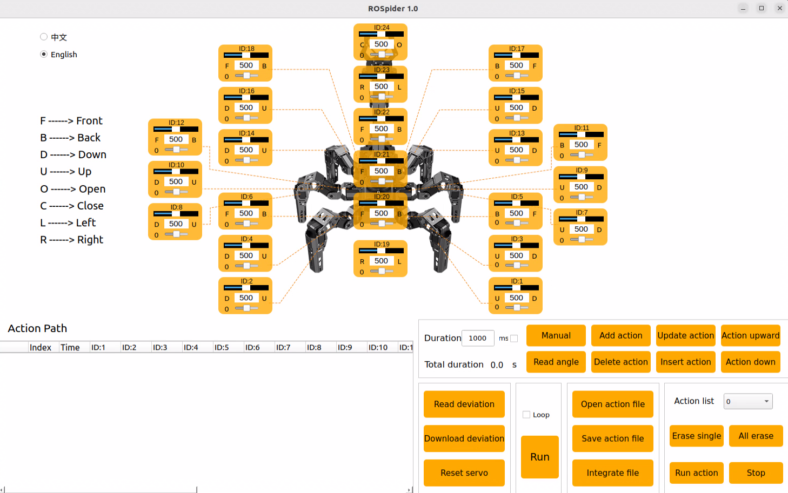

During servo deviation calibration, refer to the standard calibration diagram. The robot's calibration is considered acceptable only when all four of the following criteria are strictly met:

1. The robotic arm points straight up and is perpendicular to the chassis. As seen from the image, several servos align on the center servo horn, meaning a conceptual connection line through the center screws of the servo horns can pass vertically through these servos.

   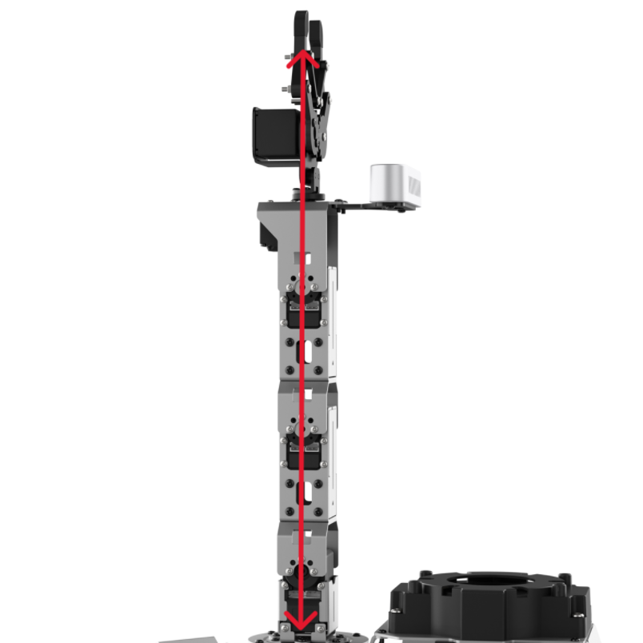

2. The opening distance of the robotic arm's gripper should be maintained at 2-3 cm. This distance serves as the neutral point standard for the gripper servo. The measurement can be quickly verified using the combined width of an index and middle finger. A perfect fit indicates the standard is met.

   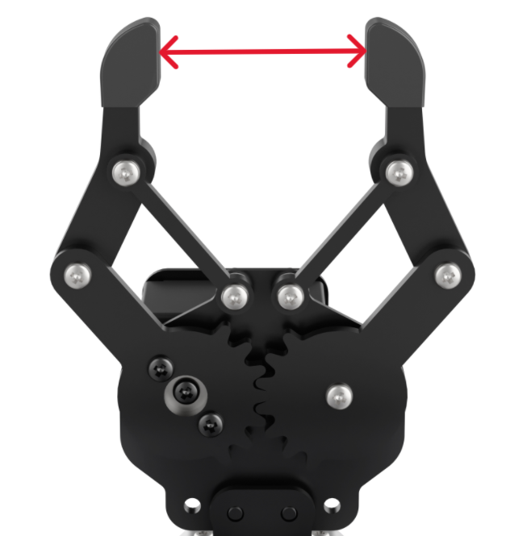

3. The leg forms a 90° right angle in the reset state.

   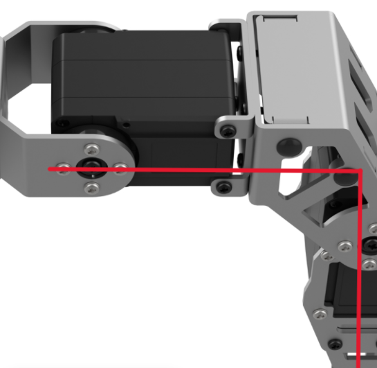

4. The edge of the large U-shaped cross bracket on the chassis is parallel to the edge of the inner servo.

   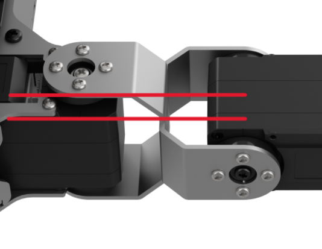

### 8.1.2 Calibration Steps

After understanding the calibration standards, the robot's deviation can be calibrated accordingly.

Specific steps are as follows:

1. Connect the robot, then click the ROSpider PC software icon on the desktop. 
2. Click the **Reset servo** button. For example, a deviation has occurred on servo ID 21 in the robotic arm.

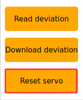

3. Click the **Read deviation** button to obtain the corresponding deviation value of the servo currently mounted on the robotic arm.

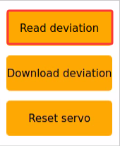

4. Wait for the **success!** pop-up window to appear, then click the **OK** button.

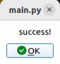

5. Check the deviation value of servo **ID: 21**, as shown in the figure below. In the figure, each servo has its corresponding ID number. The upper slider represents the current position, the middle value displays its numerical position, and the bottom slider represents the set deviation value of the servo.


6. The current deviation value of servo 21 is -12. When such a deviation occurs on servo 21, it needs to be adjusted in the opposite direction until it is calibrated to the first state outlined in **[8.1.1 Calibration Standards](#p8-1-1)**.


7. The deviation value of servo 21 is now adjusted to "6", completing the deviation calibration for servo 21. The current value must be saved to the robot's system according to subsequent steps. After the robot restarts, it will read the currently saved deviation for servo control. The calibration method for servos with other ID numbers is identical.

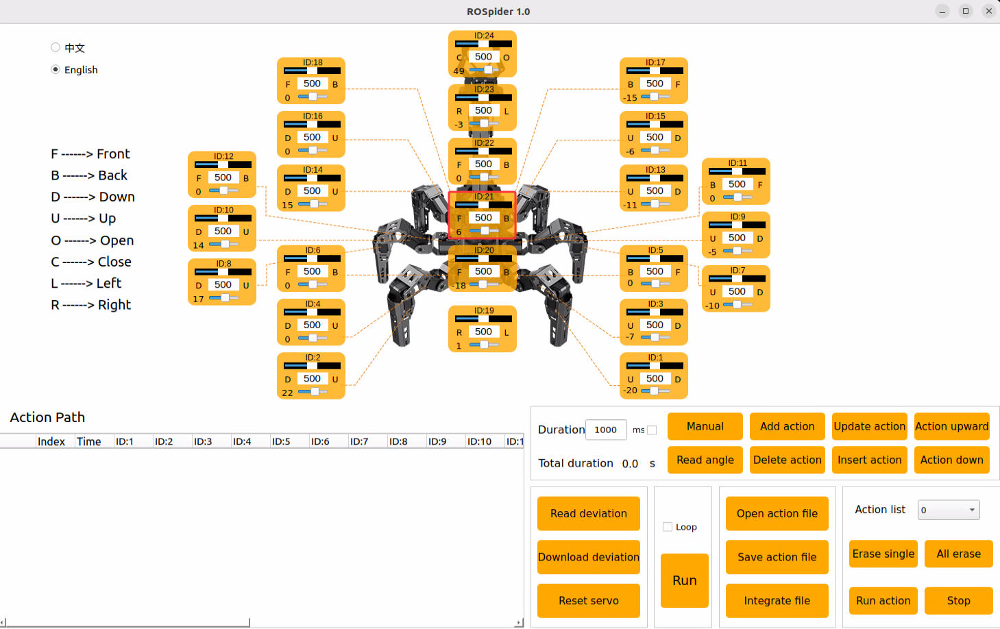

8. Click **Download deviation**.

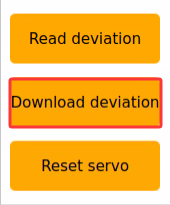

9. Wait for the **success!** prompt window to appear, click **OK** to exit the window, thus completing the deviation calibration for servo 21.

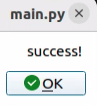

10. When it is necessary to return the robotic arm to the initialized state, select **init** in the action group, and then click **Run action**.

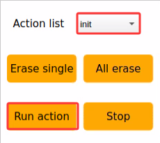

11. If any other bus servos on the robot exhibit unacceptable deviations, repeat the steps above by adjusting the corresponding servo ID slider in the PC software to correct the alignment.

## 8.2 2D Vision: Color Tracking

### 8.2.1 Experiment Introduction

The first-person perspective utilizes the robot's own viewpoint to complete color block tracking tasks. Before starting, the color blocks required for the experiment must be prepared. First, the program subscribes to the topic message published by the color recognition node to obtain the recognized color information. Then, after matching the target color, it acquires the center position of the target image. Finally, it calculates the angle required to align the center of the frame with the target image center via inverse kinematics, publishes the corresponding topic message, and controls the servo rotation to make the robotic arm track the target movement.

### 8.2.2 Operation Steps

> [!NOTE]
>
> **Commands are strictly case-sensitive, and the Tab key can be used to auto-complete keywords.**

1. Power on ROSpider and connect it to the remote control software VNC. For instructions on connecting to the remote desktop, refer to **[1. ROSpider User Manual \ 1.4 Development Environment Setup](https://wiki.hiwonder.com/projects/ROSpider/en/raspberry-pi-version/docs/1_ROSpider_User_Manual.html#development-environment-setup)**.

2. Click the desktop icon  to open the terminal.

3. Enter the command to stop auto-start services.


```
~/.stop_ros.sh
```

4. Enter the command to launch the color recognition feature.


```
ros2 launch example color_track_node.launch.py
```

5. To stop the feature, press **Ctrl + C** in the command line terminal interface. If the feature does not close immediately, try pressing **Ctrl + C** a few more times.

### 8.2.3 Program Outcome

After launching the feature, place a red block in front of the camera. The returned video feed will mark the identified target color, and the robotic arm will continuously track the movement of the target block.

### 8.2.4 Program Analysis

#### 8.2.4.1 Launch File Analysis

This launch file is located at:

**/home/ubuntu/ros2_ws/src/example/example/color_track/color_track_node.launch.py**

* The program defines the content to be launched, obtains the paths for the `controller`, `arm_kinematics`, and `example` packages, and launches the `controller.launch`, `arm_kinematics_node.launch`, and `color_detect_node.launch` files. It creates the ROS2 node `color_track_node`, defines the executable file, and finally returns the launch list.

```python
    if compiled == 'True':
        controller_package_path = get_package_share_directory('controller')
        arm_kinematics_package_path = get_package_share_directory('arm_kinematics')
        example_package_path = get_package_share_directory('example')
    else:
        controller_package_path = '/home/ubuntu/ros2_ws/src/driver/controller'
        arm_kinematics_package_path = '/home/ubuntu/ros2_ws/src/driver/arm_kinematics'
        example_package_path = '/home/ubuntu/ros2_ws/src/example'

    controller_launch = IncludeLaunchDescription(
        PythonLaunchDescriptionSource(
            os.path.join(controller_package_path, 'launch/controller.launch.py')),
    )


    arm_kinematics_launch = IncludeLaunchDescription(
        PythonLaunchDescriptionSource(
            os.path.join(arm_kinematics_package_path, 'launch/arm_kinematics_node.launch.py')),
    )

    color_detect_launch = IncludeLaunchDescription(
        PythonLaunchDescriptionSource(
            os.path.join(example_package_path, 'example/opencv_example/color_detect_node.launch.py')),
        launch_arguments={
            'enable_display': enable_display,
        }.items()
    )


    color_track_node = Node(
        package='example',
        executable='color_track',
        output='screen',
        parameters=[{'start': start}]
    )
```

* The entry function for the **ROS2 Launch** file, defining the content to be launched.

```python
def generate_launch_description():
    return LaunchDescription([
        OpaqueFunction(function = launch_setup)
    ])
```

* Creates a `LaunchService` and passes the launch content to it for execution.

```python
if __name__ == '__main__':
    # Create a LaunchDescription object
    ld = generate_launch_description()

    ls = LaunchService()
    ls.include_launch_description(ld)
    ls.run()
```

#### 8.2.4.2 Python Source Code Analysis

The program source code is located at:

**/home/ubuntu/ros2_ws/src/example/example/color_track/color_track_node.py**

* The program creates a `joints_pub` publisher for sending servo control messages. It creates a subscription to the `'/color_detect/color_info'` topic, and clients to request services such as `'/controller_manager/init_finish'`, `'/arm_kinematics/init_finish'`, and `'/color_detect/set_param'`. It also initializes the robotic arm position and robot pose.

```python
	self.joints_pub = self.create_publisher(ServosPosition, '/servo_controller', 1) # Servo control

	self.create_subscription(ColorsInfo, '/color_detect/color_info', self.get_color_callback, 1)

	timer_cb_group = ReentrantCallbackGroup()
	self.create_service(Trigger, '~/start', self.start_srv_callback) # Enter the feature
	self.create_service(Trigger, '~/stop', self.stop_srv_callback, callback_group=timer_cb_group) # Exit the feature
	self.create_service(SetString, '~/set_color', self.set_color_srv_callback, callback_group=timer_cb_group) # Set color
	self.client = self.create_client(Trigger, '/controller_manager/init_finish')
	self.client.wait_for_service()
	self.client = self.create_client(Trigger, '/arm_kinematics/init_finish')
	self.client.wait_for_service()
	self.set_color_client = self.create_client(SetColorDetectParam, '/color_detect/set_param', callback_group=timer_cb_group)
	self.set_color_client.wait_for_service()

	self.arm_kinematics_client = self.create_client(SetRobotPose, '/arm_kinematics/set_pose_target')
	self.arm_kinematics_client.wait_for_service()

	self.timer = self.create_timer(0.0, self.init_process, callback_group=timer_cb_group)
```

* The `set_color_srv_callback` callback function receives the `SetColorDetectParam` service request, extracts color data from the request, and initiates the color tracking function by sending a service request.

```python
    def set_color_srv_callback(self, request, response):
        self.get_logger().info('\033[1;32m%s\033[0m' % "set_color")
        msg = SetColorDetectParam.Request()
        msg_red = ColorDetect()
        msg_red.color_name = request.data
        msg_red.detect_type = 'circle'
        msg.data = [msg_red]
        res = self.send_request(self.set_color_client, msg)
        if res.success:
            self.get_logger().info('\033[1;32m%s\033[0m' % 'start_track_%s'%msg_red.color_name)
        else:
            self.get_logger().info('\033[1;32m%s\033[0m' % 'track_fail')
        response.success = True
        response.message = "set_color"
        return response

```

* The main control function processes visual input in robot control by obtaining color block data via the `get_color_callback` callback. It controls the movement of the robotic arm based on the target center position in the image. PID controllers are simultaneously used to calculate the arm's displacement, adjusting its position through inverse kinematics and servo control.

```python
    def main(self):
        while self.running:
            if self.center is not None and self.start:
                t1 = time.time()
                center = self.center

                self.pid_y.SetPoint = center.width/2 
                self.pid_y.update(center.x)
                self.y_dis += self.pid_y.output
                
                if self.y_dis < 200:
                    self.y_dis = 200
                if self.y_dis > 600:
                    self.y_dis = 600

                self.pid_z.SetPoint = center.height/2 
                self.pid_z.update(center.y)
                self.z_dis += self.pid_z.output
                if self.z_dis > 0.37:
                    self.z_dis = 0.37
                if self.z_dis < 0.30:
                    self.z_dis = 0.30
                msg = set_pose_target([self.x_init, 0.0, self.z_dis], 0.0, [-180.0, 180.0], 1.0)
                res = self.send_request(self.arm_kinematics_client, msg)
                t2 = time.time()
                t = t2 - t1
                if t < 0.02:
                    time.sleep(0.02 - t)
                if res.pulse:
                    servo_data = res.pulse
                    set_servo_position(self.joints_pub, 0.02, ((24, 500), (23, 500), (22, servo_data[3]), (21, servo_data[2]), (20, servo_data[1]),(19, int(self.y_dis))))
                else:
                    set_servo_position(self.joints_pub, 0.02, ((19, int(self.y_dis)), ))
            else:
                time.sleep(0.01)

        self.init_action()
        rclpy.shutdown()
```

## 8.3 2D Vision: Auto Shooting

### 8.3.1 Experiment Introduction

First, the program utilizes OpenCV for color recognition and image processing. Upon identifying the target, it analyzes the image position feedback to determine if the target is centered. If centered, the robot approaches the target and executes a kick once within a designated range. Otherwise, the robot adjusts left or right to align with the target center before repeating the approach sequence.

### 8.3.2 Operation Steps

> [!NOTE]
> **Commands are strictly case-sensitive, and the Tab key can be used to auto-complete keywords.**

1. Power on ROSpider and connect it to the remote control software VNC. For instructions on connecting to the remote desktop, refer to **[1. ROSpider User Manual \ 1.4 Development Environment Setup](https://wiki.hiwonder.com/projects/ROSpider/en/raspberry-pi-version/docs/1_ROSpider_User_Manual.html#development-environment-setup)**.
2. Click the desktop icon  to open the terminal.
3. Enter the command to stop auto-start services.

```
~/.stop_ros.sh
```

4. Enter the command to launch the auto-shooting feature.

```
ros2 launch app intelligent_kick_node.launch.py debug:=true
```

5. Open a new command terminal and enter the command to request the service to start.

```
ros2 service call /intelligent_kick/enter std_srvs/srv/Trigger {}
```

6. Left-click the video stream to sample a color. Then, enter the command in the newly opened terminal to start the feature.

```
ros2 service call /intelligent_kick/set_running std_srvs/srv/SetBool "{data: True}"
```

7. To stop the feature, press **Ctrl + C** in the command line terminal interface. If the feature does not close immediately, try pressing **Ctrl + C** a few more times.

### 8.3.3 Program Outcome

When a red ball appears in the camera's view, the robot will automatically perform color recognition. Once detected, the robot will adjust its position to approach the ball and kick it forward.

### 8.3.4 Program Analysis

#### 8.3.4.1 Launch File Analysis

This launch file is located at:

**/home/ubuntu/ros2_ws/src/app/launch/intelligent_kick_node.launch.py**

* The program defines the content to be launched, obtains paths for the `controller` and `example` packages, and launches `controller.launch` and `color_detect_node.launch`. It creates the ROS2 node `intelligent_kick_node`, defines the executable file, and finally returns the launch list.

```python
def launch_setup(context):
    compiled = os.environ['need_compile']
    debug = LaunchConfiguration('debug', default='false')
    debug_arg = DeclareLaunchArgument('debug', default_value=debug)
    if compiled == 'True':
        controller_package_path = get_package_share_directory('controller')
        peripherals_package_path = get_package_share_directory('peripherals')
    else:
        controller_package_path = '/home/ubuntu/ros2_ws/src/driver/controller'
        peripherals_package_path = '/home/ubuntu/ros2_ws/src/peripherals'


    intelligent_kick_node = GroupAction([
        IncludeLaunchDescription(
            PythonLaunchDescriptionSource(
                os.path.join(peripherals_package_path, 'launch/depth_camera.launch.py')),
            condition=IfCondition(debug),
            ),

        IncludeLaunchDescription(
            PythonLaunchDescriptionSource(
                os.path.join(controller_package_path, 'launch/controller.launch.py')),
            condition=IfCondition(debug),
            ),

        Node(
            package='app',
            executable='intelligent_kick',
            output='screen',
            parameters=[{'debug': debug}],
            ),
    ])

    return [debug_arg,
            intelligent_kick_node,
            ]
```

* The entry function for the **ROS2 Launch** file, defining the content to be launched.

```python
def generate_launch_description():
    return LaunchDescription([
        OpaqueFunction(function = launch_setup)
    ])
```

* Creates a `LaunchService` and passes the launch content to it for execution.

```python
if __name__ == '__main__':
    # Create a LaunchDescription object
    ld = generate_launch_description()

    ls = LaunchService()
    ls.include_launch_description(ld)
    ls.run()
```

#### 8.3.4.2 Python Source Code Analysis

The program source code is located at:

**/home/ubuntu/ros2_ws/src/app/app/intelligent_kick.py**

* The program creates `joints_pub` and `cmd_vel_pub` publishers to send servo and chassis control messages. Creates subscriptions to `'/color_detect/color_info'` topics, and clients to request services like `'/controller_manager/init_finish'`, `'/arm_kinematics/init_finish'`, and `'/color_detect/set_param'`. Initializes the robotic arm position and robot pose.

```python
        self.joints_pub = self.create_publisher(ServosPosition, '/servo_controller', 1) # Servo control
        self.cmd_vel_pub = self.create_publisher(Twist, '/controller/cmd_vel', 1)  # Chassis control
        self.image_sub = self.create_subscription(Image, '/color_detect/image_result', self.image_callback , 1)
        self.create_subscription(ColorsInfo, '/color_detect/color_info', self.get_color_callback, 1)

        timer_cb_group = ReentrantCallbackGroup()
        self.create_service(Trigger, '~/start', self.start_srv_callback) # Enter feature
        self.create_service(SetString, '~/set_color', self.set_color_srv_callback, callback_group=timer_cb_group) # Set color
        self.client = self.create_client(Trigger, '/controller_manager/init_finish')
        self.client.wait_for_service()
        self.client = self.create_client(Trigger, '/arm_kinematics/init_finish')
        self.client.wait_for_service()
        self.set_color_client = self.create_client(SetColorDetectParam, '/color_detect/set_param', callback_group=timer_cb_group)
        self.set_color_client.wait_for_service()

        self.arm_kinematics_client = self.create_client(SetRobotPose, '/arm_kinematics/set_pose_target')
        self.arm_kinematics_client.wait_for_service()
```

* The `set_color_srv_callback` callback receives `SetColorDetectParam` service requests, extracts color data, and starts color tracking via a service request.

```python
    def set_color_srv_callback(self, request, response):
        self.get_logger().info('\033[1;32m%s\033[0m' % "set_color")
        msg = SetColorDetectParam.Request()
        msg_red = ColorDetect()
        msg_red.color_name = request.data
        msg_red.detect_type = 'circle'
        msg.data = [msg_red]
        res = self.send_request(self.set_color_client, msg)
        if res.success:
            self.get_logger().info('\033[1;32m%s\033[0m' % 'start_track_%s'%msg_red.color_name)
        else:
            self.get_logger().info('\033[1;32m%s\033[0m' % 'track_fail')
        response.success = True
        response.message = "set_color"
        return response
```

* Uses PID for servo control, where `pid_y` controls servo 19 and `pid_x` controls servo 22. Range limits prevent out-of-bounds movement, utilizing `y_dis` and `x_dis` to set servo positions. `pid_Y` dictates the robot's left/right rotation, while `pid_X` dictates forward/backward movement. Once the target is detected within the kicking zone, the kicking action is triggered.

```python
    self.pid_y.SetPoint = center.width/2 
    self.pid_y.update(center.x)
    self.y_dis += self.pid_y.output

    if self.y_dis < 350:
    self.y_dis = 350
    if self.y_dis > 650:
    self.y_dis = 650
    if self.x_dis < 150:
    self.x_dis = 150
    if self.x_dis > 250:
    self.x_dis = 250

    self.pid_x.SetPoint = center.height/2 
    self.pid_x.update(center.y)
    self.x_dis += self.pid_x.output

    t2 = time.time()
    t = t2 - t1
    if t < 0.02:
    time.sleep(0.02 - t)

    set_servo_position(self.joints_pub, 0.02, ((19, self.y_dis), (22, int(self.x_dis))))
    self.pid_Y.SetPoint = 500  # Initial value for servo 19
    self.pid_Y.update(self.y_dis)
    self.pid_X.SetPoint = 200  # Initial value for servo 22
    self.pid_X.update(self.x_dis)

    if self.pid_Y.output < -0.5 :
    twist.angular.z = 0.1
    elif self.pid_Y.output > 0.5:
    twist.angular.z = -0.1
    elif self.pid_X.output < 1 or center.y < 225:
    twist.linear.x = 0.03
    elif self.pid_X.output > 1.2 or center.y > 280:
    twist.linear.x = -0.02
    elif 300 < center.x < 330 and 225 < center.y < 280:
    self.kick = True

    if self.kick:
    self.kick_ball(center)
    self.kick = False
```

## 8.4 2D Vision: Navigation & Transport

### 8.4.1 Experiment Introduction

First, the program subscribes to the camera node's topic to acquire image frames. Next, it initiates the navigation service to retrieve the target destination. Finally, once the destination is reached and the target color block is detected, the servo control node publishes messages to control the robotic arm and execute the pick-and-place task.

### 8.4.2 Operation Steps

> [!NOTE]
> **Commands are strictly case-sensitive, and the Tab key can be used to auto-complete keywords.**

1. Power on ROSpider and connect it to the remote control software VNC. For instructions on connecting to the remote desktop, refer to **[1. ROSpider User Manual \ 4. Development Environment Setup](https://drive.google.com/drive/folders/18o7y4ArbtcjvzoS_NZuUUEdmDrNqfb_f?usp=sharing)**. If mapping has not yet been performed, map the environment and save the map according to the mapping and navigation tutorial.
2. Click the desktop icon  to open the terminal.
3. Enter the command to stop auto-start services.

```
~/.stop_ros.sh
```

4. Enter the command to start the gripper calibration. Wait for the robotic arm's initial descent, then manually position the red block between the gripper jaws. Finally, wait for the arm's second descent to secure the block.

```
ros2 launch example automatic_pick.launch.py debug:=pick
```

5. Press **Ctrl + C** in the terminal interface to close grasping calibration, and enter the command to launch the navigation & transport feature.

```
ros2 launch example navigation_transport.launch.py map:=map_01
```

5. To stop the feature, press **Ctrl + C** in the command-line terminal interface. If the feature does not close immediately, try pressing **Ctrl + C** a few more times.

### 8.4.3 Program Outcome

After opening RVIZ, verify whether the robot's position on the map corresponds to its actual physical location. If it does not match, manual adjustment is required utilizing the **2D Pose Estimate** tool in RVIZ. The RVIZ software menu bar contains four tools: **2D Pose Estimate**, **2D Goal Pose**, **Publish Point**, and **Nav2 Goal**.

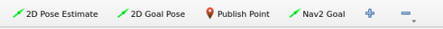

**2D Pose Estimate** configures the robot's initial position. **2D Goal Pose** sets a single target point for the robot, suitable for basic navigation tasks that do not involve complex issues like obstacle avoidance and path planning. **Publish Point** defines multiple target points for the robot. **Nav2 Goal** designates more complex navigation targets, such as specifying a target point, a target posture, or a target area.
Click the **2D Goal Pose** tool in the software menu bar, select a location on the map interface as the target point, and single-click with the mouse at that point. Once selected, the robot will automatically generate a route and move to the target point.

Upon navigating to the location containing the **red block**, the robot will automatically grasp the color block after recognition. It will then navigate to the next destination, automatically placing the block upon arrival, thus completing the transport task.

> [!NOTE]
> **The program executes only one pick-and-place task per run. To repeat the process, the demo must be relaunched.**

### 8.4.4 Program Analysis

#### 8.4.4.1 Launch File Analysis

This launch file is located at:

**/home/ubuntu/ros2_ws/src/example/example/navigation_transport/navigation_transport.launch.py**

* The program defines the content to launch, obtains paths for the slam, navigation, and example packages, and launches the `automatic_pick.launch`, `bringup.launch`, and `color_detect_node.launch` files. It creates the ROS2 nodes `navigation_transport_node` and `rviz_node`, defines executables, and creates action groups to delay navigation startup. Finally returns the launch list.

```python
    if compiled == 'True':
        slam_package_path = get_package_share_directory('slam')
        navigation_package_path = get_package_share_directory('navigation')
        example_package_path = get_package_share_directory('example')
    else:
        slam_package_path = '/home/ubuntu/ros2_ws/src/slam'
        navigation_package_path = '/home/ubuntu/ros2_ws/src/navigation'
        example_package_path = '/home/ubuntu/ros2_ws/src/example'
        
    automatic_pick_launch = IncludeLaunchDescription(
        PythonLaunchDescriptionSource(os.path.join(example_package_path, 'example/navigation_transport/automatic_pick.launch.py')),
        launch_arguments={
            'broadcast': broadcast,
            'debug': debug,
            'place_without_color': place_without_color,
            'place_position': place_position,
            'master_name': master_name,
            'robot_name': robot_name,
            'enable_display': 'false',
        }.items(),
    )

    navigation_launch = IncludeLaunchDescription(
        PythonLaunchDescriptionSource(os.path.join(navigation_package_path, 'launch/include/bringup.launch.py')),
        launch_arguments={
            'use_sim_time': 'false',
            'map': os.path.join(slam_package_path, 'maps', map_name + '.yaml'),
            'params_file': os.path.join(navigation_package_path, 'config', 'nav2_params.yaml'),
            'namespace': robot_name,
            'use_namespace': 'false',
            'autostart': 'true',
        }.items(),
    )

    navigation_transport_node = Node(
        package='example',
        executable='navigation_transport',
        output='screen',
        parameters=[{'map_frame': 'map', 'nav_goal': '/nav_goal'}]
    )

    rviz_node = ExecuteProcess(
            cmd=['rviz2', 'rviz2', '-d', os.path.join(navigation_package_path, 'rviz/navigation_transport.rviz')],
            output='screen'
        )

    bringup_launch = GroupAction(
     actions=[
         PushRosNamespace(robot_name),
         automatic_pick_launch,
         TimerAction(
             period=10.0,  # Delay for enabling other nodes
             actions=[navigation_launch],
         ),
      ]
    )
```

* Entry function for the **ROS2 Launch** file, defining the content to be launched.

```python
def generate_launch_description():
    return LaunchDescription([
        OpaqueFunction(function = launch_setup)
    ])
```

* Creates a `LaunchService`, passing the launch content to it for execution.

```python
if __name__ == '__main__':
    # Create a LaunchDescription object
    ld = generate_launch_description()

    ls = LaunchService()
    ls.include_launch_description(ld)
    ls.run()
```

#### 8.4.4.2 Python Source Code Analysis

The program source code is located at:

**/home/ubuntu/ros2_ws/src/example/example/navigation_transport/navigation_transport.py**

* The program creates `goal_pub`, `nav_pub`, and `mark_pub` publishers to publish pose, navigation targets, and path marker messages respectively. It establishes a subscription to the `self.nav_goal` navigation target topic, and creates clients to request services like `'/automatic_pick/pick'`, `'/automatic_pick/place'`, and `'/automatic_pick/get_parameters'`.

```python
        self.goal_pub = self.create_publisher(PoseStamped, '/goal_pose', 1)
        self.nav_pub = self.create_publisher(PoseStamped, self.nav_goal, 1)
        self.mark_pub = self.create_publisher(MarkerArray, 'path_point', 1)
        
        self.create_subscription(PoseStamped, self.nav_goal, self.goal_callback, 1, callback_group=timer_cb_group)

        self.create_service(SetPose2D, '~/place', self.start_place_srv_callback)
       
        self.pick_client = self.create_client(Trigger, '/automatic_pick/pick', callback_group=timer_cb_group)
        self.place_client = self.create_client(Trigger, '/automatic_pick/place', callback_group=timer_cb_group)

        self.pick_client.wait_for_service()
        self.place_client.wait_for_service()

        self.get_param_client = self.create_client(GetParameters, '/automatic_pick/get_parameters', callback_group=timer_cb_group)
        self.get_param_client.wait_for_service()
```

* `start_place_srv_callback` is the placement service callback function. Upon receiving a placement target, it constructs a target `PoseStamped` and publishes it to the navigation node `self.nav_pub`. It displays a location marker in RVIZ using a random color and the `flag.dae` mesh model to show the placement point, finally returning a Trigger type service response.

```python
    def start_place_srv_callback(self, request, response):
        self.get_logger().info('start navigaiton place')

        markerArray = MarkerArray()
        pose = PoseStamped()
        pose.header.frame_id = self.map_frame
        pose.header.stamp = self.navigator.get_clock().now().to_msg()
        data = request.data
        q = common.rpy2qua(math.radians(data.roll), math.radians(data.pitch), math.radians(data.yaw))
        pose.pose.position.x = data.x
        pose.pose.position.y = data.y
        pose.pose.orientation = q

        # Mark the point with number to display
        marker = Marker()
        marker.header.frame_id = self.map_frame

        marker.type = marker.MESH_RESOURCE
        marker.mesh_resource = "package://example/resource/flag.dae"
        marker.action = marker.ADD
        # Size
        marker.scale.x = 0.08
        marker.scale.y = 0.08
        marker.scale.z = 0.2
        # Color
        color = list(np.random.choice(range(256), size=3))
        marker.color.a = 1.0
        marker.color.r = color[0] / 255.0
        marker.color.g = color[1] / 255.0
        marker.color.b = color[2] / 255.0
        # Display time. If not set, it will be kept by default
        # Position posture
        marker.pose.position.x = pose.pose.position.x
        marker.pose.position.y = pose.pose.position.y
        marker.pose.orientation = pose.pose.orientation
        markerArray.markers.append(marker)

        self.mark_pub.publish(markerArray)
        self.nav_pub.publish(pose)

        response.success = True
        response.message = "navigation place"
        return response
```

* `goal_callback` is the callback executed after subscribing to the target point topic. Its primary function determines whether the current system state is: `start` / `pick_finish` / `place_finish`. Based on the state, it decides whether to execute pick navigation or place navigation by calling Nav2 navigation `goToPose()`. It automatically invokes the `Pick` or `Place` service upon navigation completion.

```python
    def goal_callback(self, msg):
        # Obtain the navigation point to be published
        self.get_logger().info('\033[1;32m%s\033[0m' % str(msg))

        get_parameters_request = GetParameters.Request()
        get_parameters_request.names = ['status']
        status = self.send_request(self.get_param_client, get_parameters_request).values[0].string_value
        self.get_logger().info('\033[1;32m%s\033[0m' % status)
        if status == 'start' or status == 'place_finish':  # In the state of ready to pick
            self.pick = True
            self.place = False
            self.get_logger().info('\033[1;32m%s\033[0m' % 'nav pick')

            self.navigator.goToPose(msg)
            self.haved_publish_goal = True
        elif status == 'pick_finish':  # In the state of ready to place
            self.pick = False
            self.place = True
            self.get_logger().info('\033[1;32m%s\033[0m' % 'nav place')

            self.navigator.goToPose(msg)
            self.haved_publish_goal = True

        if self.haved_publish_goal:
            i = 0
            while not self.navigator.isTaskComplete():
                i = i + 1
                feedback = self.navigator.getFeedback()
                if feedback and i % 5 == 0:
                    self.get_logger().info(
                        'Estimated time of arrival: '
                        + '{0:.0f}'.format(
                            Duration.from_msg(feedback.estimated_time_remaining).nanoseconds
                            / 1e9
                        )
                        + ' seconds.'
                    )

                    # Some navigation timeout to demo cancellation
                    if Duration.from_msg(feedback.navigation_time) > Duration(seconds=600.0):
                        self.navigator.cancelTask()

                    # Some navigation request change to demo preemption
                    # if Duration.from_msg(feedback.navigation_time) > Duration(seconds=18.0):
                    #     self.goal_pub.publish(self.goal_pose)
                # self.get_logger().info('\033[1;32m%s\033[0m' % 'feedback')
            # Do something depending on the return code
            result = self.navigator.getResult()
            if result == TaskResult.SUCCEEDED:
                self.get_logger().info('Goal succeeded!')
                if self.pick:
                    res = self.send_request(self.pick_client, Trigger.Request())
                    if res.success:
                        self.get_logger().info('start pick')
                    else:
                        self.get_logger().info('start pick failed')
                else:
                    res = self.send_request(self.place_client, Trigger.Request())
                    if res.success:
                        self.get_logger().info('start place')
                    else:
                        self.get_logger().info('start place failed')

                self.haved_publish_goal = False
            elif result == TaskResult.CANCELED:
                self.get_logger().info('Goal was canceled!')
            elif result == TaskResult.FAILED:
                self.get_logger().info('Goal failed!')
            else:
                self.get_logger().info('Goal has an invalid return status!')
```

### 8.4.5 Deviation Adjustment

If the gripper fails to align properly during picking operations, parameters within the source code can be adjusted to calibrate the deviation. The source file is located at: **/home/ubuntu/ros2_ws/src/example/example/navigation_transport/automatic_pick.py**.

1. If the robot is equipped with a depth camera, the X, Y, and Z axis offsets can be tuned directly at this location.

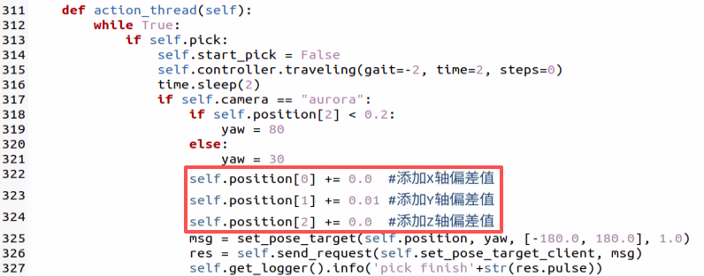

2. If the robot is equipped with a monocular camera, depth data cannot be acquired. Therefore, the corresponding action group must be modified in these lines to calibrate. It is highly recommended to first load the target action group into the PC software and execute it to verify the adjustments visually.

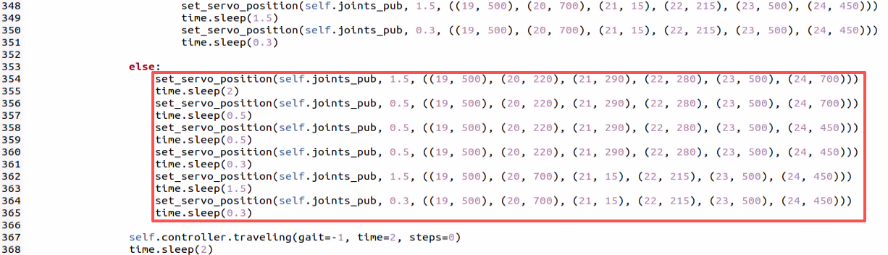

## 8.5 3D Vision: Fall Prevention

### 8.5.1 Experiment Introduction

During navigation, mobile robots may encounter hazards such as downward steps or drop-offs. Without appropriate detection and avoidance mechanisms, the robot risks falling. On flat terrain, depth readings remain within a consistent range and vary smoothly. Conversely, a sudden jump in these distance values indicates a step or drop-off ahead. Therefore, ensuring safety during autonomous navigation is critical. By utilizing a depth camera to acquire depth data, the system can accurately assess the safety of the robot's forward path.

### 8.5.2 Operation Steps

> [!NOTE]
> **Commands are strictly case-sensitive, and the Tab key can be used to auto-complete keywords.**

1. Power on ROSpider and connect it to the remote control software VNC. For instructions on connecting to the remote desktop, refer to **[1. ROSpider User Manual \ 1.4 Development Environment Setup](https://wiki.hiwonder.com/projects/ROSpider/en/raspberry-pi-version/docs/1_ROSpider_User_Manual.html#development-environment-setup)**.
2. Click the desktop icon  to open the terminal.
3. Enter the command to stop auto-start services.

```
~/.stop_ros.sh
```

4. Enter the command to launch the fall prevention feature.

```
ros2 launch example prevent_falling.launch.py
```

5. To stop the feature, press **Ctrl + C** in the command line terminal interface. If the feature does not close immediately, try pressing **Ctrl + C** a few more times.

### 8.5.3 Program Outcome

Following the feature launch, the terminal will display the depth camera feed. The robot will move forward autonomously. Upon encountering high or low terrain immediately ahead, the robot will automatically turn in place and assess the flatness of the new forward position. It proceeds forward if flat, or continues to turn in place until flat ground is detected ahead.

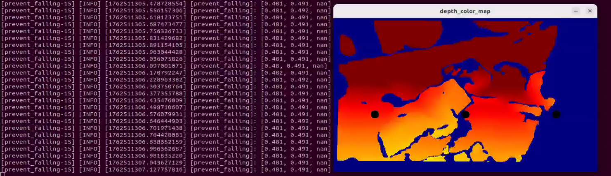

> [!NOTE]
> **Upon initial setup or whenever the robot is relocated, the command `ros2 launch example prevent_falling.launch.py debug:=true` must be executed to calibrate the current surface and establish a safe baseline. For subsequent operations in the same location, running the file `ros2 launch example prevent_falling.launch.py` will maintain this calibrated safety state.**

### 8.5.4 Program Analysis

#### 8.5.4.1 Launch File Analysis

This launch file is located at:

**/home/ubuntu/ros2_ws/src/example/example/rgbd_example/prevent_falling.launch.py**

* The program defines the content to launch, acquires paths for the controller, peripherals, and example packages, and launches `depth_camera.launch` and `controller.launch`. It creates the ROS2 node `prevent_falling_node`, specifying the executable file, and returns the launch list.

```python
def launch_setup(context):
    compiled = os.environ['need_compile']
    debug = LaunchConfiguration('debug', default='false')
    debug_arg = DeclareLaunchArgument('debug', default_value=debug)
    if compiled == 'True':
        controller_package_path = get_package_share_directory('controller')
        peripherals_package_path = get_package_share_directory('peripherals')
        example_package_path = get_package_share_directory('example')
    else:
        controller_package_path = '/home/ubuntu/ros2_ws/src/driver/controller'
        peripherals_package_path = '/home/ubuntu/ros2_ws/src/peripherals'
        example_package_path = '/home/ubuntu/ros2_ws/src/example'
    depth_camera_launch = IncludeLaunchDescription(
        PythonLaunchDescriptionSource(
            os.path.join(peripherals_package_path, 'launch/depth_camera.launch.py')),
    )
    controller_launch = IncludeLaunchDescription(
        PythonLaunchDescriptionSource(
            os.path.join(controller_package_path, 'launch/controller.launch.py')),
    )

    prevent_falling_node = Node(
        package='example',
        executable='prevent_falling',
        output='screen',
        parameters=[os.path.join(example_package_path, 'config/plane_distance.yaml'), {'debug': debug}]
    )

    return [debug_arg,
            depth_camera_launch,
            controller_launch,
            prevent_falling_node,
            ]
```

* Entry function for the **ROS2 Launch** file, defining launch content.

```python
def generate_launch_description():
    return LaunchDescription([
        OpaqueFunction(function = launch_setup)
    ])
```

* Creates a `LaunchService` to execute the defined launch content.

```python
if __name__ == '__main__':
    # Create a LaunchDescription object
    ld = generate_launch_description()

    ls = LaunchService()
    ls.include_launch_description(ld)
    ls.run()
```

#### 8.5.4.2 Python Source Code Analysis

The program source code is located at:

**/home/ubuntu/ros2_ws/src/example/example/rgbd_example/include/prevent_falling.py**

* The program subscribes to the `'/depth_cam/depth/image_raw'` topic and initiates a client request to the `'/controller_manager/init_finish'` service. It creates `cmd_vel_pub` and `joints_pub` publishers for sending servo and chassis control messages, and initializes arm position and robot pose.

```python
        self.joints_pub = self.create_publisher(ServosPosition, '/servo_controller', 1) # Servo control
        self.cmd_vel_pub = self.create_publisher(Twist, '/controller/cmd_vel', 1)  # Chassis control
        self.create_subscription(Image, '/depth_cam/depth/image_raw', self.depth_callback, 1)

        self.client = self.create_client(Trigger, '/controller_manager/init_finish')
        self.client.wait_for_service()
        
        set_servo_position(self.joints_pub, 1, ((19, 500), (20, 700), (21, 85), (22, 150), (23, 500), (24, 700)))
        self.controller.set_build_in_pose('DEFAULT_POSE', 1)

        time.sleep(1)

        threading.Thread(target=self.main, daemon=True).start()
        self.create_service(Trigger, '~/init_finish', self.get_node_state)
```

* The `get_roi_distance` function extracts depth information for a designated Region of Interest (ROI) from the depth image, computing its average depth value.

```python
    def get_roi_distance(self, depth_image, roi):
        roi_image = depth_image[roi[0]:roi[1], roi[2]:roi[3]]

        try:
            distance = round(float(np.mean(roi_image[np.logical_and(roi_image>0, roi_image<30000)])/1000), 3)
        except:
            distance = 0
        return distance
```

* The `move_policy` function governs the robot's movement decisions for turning or proceeding based on measured depth values for the left, center, and right regions.

```python
    def move_policy(self, left_distance, center_distance, right_distance): 
        if abs(left_distance - self.plane_high) > 0.04 or abs(center_distance - self.plane_high) > 0.04 or abs(right_distance - self.plane_high) > 0.04:
            twist = Twist()
            twist.angular.z = 0.2
            self.turn = True
            self.time_stamp = time.time() + 0.3
            self.cmd_vel_pub.publish(twist)
        else:
            if self.turn:
                self.current_time_stamp = time.time()
                if self.time_stamp < self.current_time_stamp:
                    self.turn = False
                    self.cmd_vel_pub.publish(Twist())
                    self.time_stamp = time.time() + 0.2
            else:
                self.current_time_stamp = time.time()
                if self.time_stamp < self.current_time_stamp:
                    twist = Twist()
                    twist.linear.x = 0.05
                    self.cmd_vel_pub.publish(twist)
```

* Converts the depth image into an applicable format for display, translating processed depth images into color mappings. Three circles are mapped to indicate the left, center, and right ROIs, with circle placement derived from central ROI coordinates. Finally, it calculates the average depth across these three ROIs.

```python
	depth_color_map = cv2.applyColorMap(cv2.convertScaleAbs(depth_image, alpha=0.45), cv2.COLORMAP_JET)
	cv2.circle(depth_color_map, (int((self.left_roi[2] + self.left_roi[3]) / 2), int((self.left_roi[0] + self.left_roi[1]) / 2)), 10, (0, 0, 0), -1)
	cv2.circle(depth_color_map, (int((self.center_roi[2] + self.center_roi[3]) / 2), int((self.center_roi[0] + self.center_roi[1]) / 2)), 10, (0, 0, 0), -1)
	cv2.circle(depth_color_map, (int((self.right_roi[2] + self.right_roi[3]) / 2), int((self.right_roi[0] + self.right_roi[1]) / 2)), 10, (0, 0, 0), -1)

	left_distance = self.get_roi_distance(depth_image, self.left_roi)
	center_distance = self.get_roi_distance(depth_image, self.center_roi)
	right_distance = self.get_roi_distance(depth_image, self.right_roi)
	self.get_logger().info(str([left_distance, center_distance, right_distance]))
```

## 8.6 3D Vision: Bridge Crossing

### 8.6.1 Experiment Introduction

Crossing a narrow bridge involves multiple technical aspects, primarily balance control and environmental sensing. To maintain stability, precise pose control is required, encompassing exact adjustments to the center of gravity and leg joint angles. This is achieved using robotic dynamic models and control algorithms like PID or fuzzy logic control. Additionally, real-time environmental perception is essential. The system must detect the width, height, and slope of the bridge to execute necessary pose corrections. Ultimately, implementing this functionality demands significant experimental testing and system tuning.

### 8.6.2 Operation Steps

> [!NOTE]
> **Commands are strictly case-sensitive, and the Tab key can be used to auto-complete keywords.**

1. Power on ROSpider and connect it to the remote control software VNC. For instructions on connecting to the remote desktop, refer to **[1. ROSpider User Manual \ 1.4 Development Environment Setup](https://wiki.hiwonder.com/projects/ROSpider/en/raspberry-pi-version/docs/1_ROSpider_User_Manual.html#development-environment-setup)**.
2. Click the desktop icon  to open the terminal.
3. Enter the command to stop auto-start services.

```
~/.stop_ros.sh
```

4. Enter the command to launch the bridge crossing feature.

```
ros2 launch example cross_bridge.launch.py
```

5. To stop the feature, press **Ctrl + C** in the command line terminal interface. If the feature does not close immediately, try pressing **Ctrl + C** a few more times.

### 8.6.3 Program Outcome

Once the bridge environment is set up, start the program. The robot will dynamically adjust its pose to smoothly navigate the narrow bridge without falling off.

> [!NOTE]
> **Upon initial setup of the Bridge Crossing feature, or whenever the robot is relocated, the command `ros2 launch example cross_bridge.launch.py debug:=true` must be executed. This calibrates the bridge environment and establishes a standard detection baseline. For subsequent operations in the exact same location, running `ros2 launch example cross_bridge.launch.py` will utilize this established baseline.**

### 8.6.4 Program Analysis

#### 8.6.4.1 Launch File Analysis

This launch file is located at:

**/home/ubuntu/ros2_ws/src/example/example/rgbd_example/cross_bridge.launch.py**

* The program defines launch content, retrieves paths for **controller**, **peripherals**, and **example** packages, and launches `depth_camera.launch` and `controller.launch`. It creates the ROS2 node `cross_bridge_node`, sets the executable file, and returns the launch list.

```python
def launch_setup(context):
    compiled = os.environ['need_compile']
    debug = LaunchConfiguration('debug', default='false')
    debug_arg = DeclareLaunchArgument('debug', default_value=debug)
    if compiled == 'True':
        controller_package_path = get_package_share_directory('controller')
        peripherals_package_path = get_package_share_directory('peripherals')
        example_package_path = get_package_share_directory('example')
    else:
        controller_package_path = '/home/ubuntu/ros2_ws/src/driver/controller'
        peripherals_package_path = '/home/ubuntu/ros2_ws/src/peripherals'
        example_package_path = '/home/ubuntu/ros2_ws/src/example'
    depth_camera_launch = IncludeLaunchDescription(
        PythonLaunchDescriptionSource(
            os.path.join(peripherals_package_path, 'launch/depth_camera.launch.py')),
    )
    controller_launch = IncludeLaunchDescription(
        PythonLaunchDescriptionSource(
            os.path.join(controller_package_path, 'launch/controller.launch.py')),
    )

    cross_bridge_node = Node(
        package='example',
        executable='cross_bridge',
        output='screen',
        parameters=[os.path.join(example_package_path, 'config/bridge_plane_distance.yaml'), {'debug': debug}]
    )

    return [debug_arg,
            depth_camera_launch,
            controller_launch,
            cross_bridge_node,
            ]
```

* Entry function for the **ROS2 Launch** file, defining the content to be launched.

```python
def generate_launch_description():
    return LaunchDescription([
        OpaqueFunction(function = launch_setup)
    ])
```

* Creates a `LaunchService` and passes the launch content to it for execution.

```python
if __name__ == '__main__':
    # Create a LaunchDescription object
    ld = generate_launch_description()

    ls = LaunchService()
    ls.include_launch_description(ld)
    ls.run()
```

#### 8.6.4.2 Python Source Code Analysis

The program source code is located at:

**/home/ubuntu/ros2_ws/src/example/example/rgbd_example/include/cross_bridge.py**

* The program subscribes to the `'/depth_cam/depth/image_raw'` topic, creates the client to request the `'/controller_manager/init_finish'` service, establishes `cmd_vel_pub` and `joints_pub` publishers for passing chassis and servo control messages, and initializes robotic arm location and posture.

```python
    self.joints_pub = self.create_publisher(ServosPosition, '/servo_controller', 1) # Servo control
    self.cmd_vel_pub = self.create_publisher(Twist, '/controller/cmd_vel', 1)  # Chassis control
    self.cmd_param_pub = self.create_publisher(CmdParam, '/step_controller/cmd_param', 1) # Walking posture control  
    self.image_sub = self.create_subscription(Image, '/depth_cam/depth/image_raw', self.depth_callback, 1)
    self.camera_info_sub = self.create_subscription(CameraInfo, '/depth_cam/rgb/camera_info', self.camera_info_callback, 1)


    self.client = self.create_client(Trigger, '/controller_manager/init_finish')
    self.client.wait_for_service()

    self.controller.set_build_in_pose('DEFAULT_POSE', 1)
    set_servo_position(self.joints_pub, 1, ((19, 500), (20, 727), (21, 80), (22, 160), (23, 500), (24, 700)))
```

* The `get_roi_distance` function assesses specific ROI depth information from the depth image and computes the corresponding average depth.

```python
    def get_roi_distance(self, depth_image, roi):
        roi_image = depth_image[roi[0]:roi[1], roi[2]:roi[3]]
        try:
            distance = round(float(np.mean(roi_image[np.logical_and(roi_image > 0, roi_image < 30000)]) / 1000), 3)
        except:
            distance = 0
        return distance

```

* The `move_policy` evaluates depth values captured from five locations, including left, forward-left, forward, right, and forward-right, to dictate ensuing actions based on the `plane_high` baseline. Actions may involve tweaking posture states between narrow/default posture, altering body elevation, and adjusting linear and angular speeds.

```python
    def move_policy(self, left_distance, left_distance_1, center_distance, right_distance, right_distance_1):
        if abs(left_distance_1 - self.plane_high) > 0.04 and abs(right_distance_1 - self.plane_high) > 0.04 :
            self.twist.linear.x = 0.02
            desired_pose = 'NARROW_POSE'
            desired_height = 5
        else :
            self.twist.linear.x = 0.0
            desired_pose  = 'DEFAULT_POSE'
            desired_height = 20        
        
        if desired_pose != self.current_pose:
            # Only send a command when a pose change is needed            
            cmd_param = CmdParam()
            cmd_param.gait = 1
            cmd_param.period = 1.0
            cmd_param.pose = desired_pose
            cmd_param.height = desired_height
            self.cmd_param_pub.publish(cmd_param)
            
            # Update the current pose state
            self.current_pose = desired_pose


        if abs(left_distance - self.plane_high) > 0.04:
            if abs(center_distance - self.plane_high) > 0.04:
                self.twist.angular.z = -0.2
            else:
                self.twist.angular.z = -0.1
        elif abs(right_distance - self.plane_high) > 0.04:
            if abs(center_distance - self.plane_high) > 0.04:
                self.twist.angular.z = 0.2
            else:
                self.twist.angular.z = 0.1
        else:
            self.twist.angular.z = 0.0
        if abs(left_distance - self.plane_high) > 0.04 and abs(right_distance - self.plane_high) > 0.04 and abs(center_distance - self.plane_high) > 0.04:
            self.twist = Twist()

        self.cmd_vel_pub.publish(self.twist)

```

* Processes the depth image into an applicable format, transferring processed mappings into colored representations. Five circles mark the regions of interest for left, forward-left, forward, right, and forward-right, which are localized via corresponding ROI focal centers. Finalizes calculating the average depth relative to the five respective ROIs.

```python
	left_roi_1 = [self.left_roi_1[0] - 50, self.left_roi_1[1] - 50, self.left_roi_1[2] - 60, self.left_roi_1[3] - 60] 
	left_roi = [self.left_roi[0] - 50, self.left_roi[1] - 50, self.left_roi[2] - 30, self.left_roi[3] - 30] 
	center_roi = [self.center_roi[0] - 50, self.center_roi[1] - 50, self.center_roi[2], self.center_roi[3]] 
	right_roi = [self.right_roi[0] - 50, self.right_roi[1] - 50, self.right_roi[2] + 30, self.right_roi[3] + 30] 
	right_roi_1 = [self.right_roi_1[0] - 50, self.right_roi_1[1] - 50, self.right_roi_1[2] + 60, self.right_roi_1[3] + 60] 
	cv2.circle(depth_color_map, (int((left_roi_1[2] + left_roi_1[3]) / 2), int((left_roi_1[0] + left_roi_1[1]) / 2)), 10, (0, 0, 0), -1)
	cv2.circle(depth_color_map, (int((left_roi[2] + left_roi[3]) / 2), int((left_roi[0] + left_roi[1]) / 2)), 10, (0, 0, 0), -1)
	cv2.circle(depth_color_map, (int((right_roi[2] + right_roi[3]) / 2), int((right_roi[0] + right_roi[1]) / 2)), 10, (0, 0, 0), -1)
	cv2.circle(depth_color_map, (int((center_roi[2] + center_roi[3]) / 2), int((center_roi[0] + center_roi[1]) / 2)), 10, (0, 0, 0), -1)
	cv2.circle(depth_color_map, (int((right_roi_1[2] + right_roi_1[3]) / 2), int((right_roi_1[0] + right_roi_1[1]) / 2)), 10, (0, 0, 0), -1)

	left_distance = self.get_roi_distance(depth_image, left_roi)
	center_distance = self.get_roi_distance(depth_image, self.center_roi)
	right_distance = self.get_roi_distance(depth_image, right_roi)
	left_distance_1 = self.get_roi_distance(depth_image, left_roi_1)
	right_distance_1 = self.get_roi_distance(depth_image, right_roi_1)

```

## 8.7 3D Vision: Object Grasping

### 8.7.1 Experiment Introduction

By integrating depth vision and robot control technologies, the system identifies and tracks specific colored objects to execute precise grasping actions. The depth camera acquires RGB and depth data, enabling color-tracking algorithms to localize the target object for robotic arm manipulation. Core features include utilizing the OpenCV library to detect specific colors in the image feed, processing depth information to calculate the object's exact 3D spatial coordinates, and applying PID controllers to continuously adjust the robotic arm's trajectory to accurately track and approach the target. Applications include automated production lines for precise pick-and-place tasks, service robotics, and automated material handling.

### 8.7.2 Operation Steps

> [!NOTE]
> **Commands are strictly case-sensitive, and the Tab key can be used to auto-complete keywords.**

1. Power on ROSpider and connect it to the remote control software VNC. For instructions on connecting to the remote desktop, refer to **[1. ROSpider User Manual \ 1.4 Development Environment Setup](https://wiki.hiwonder.com/projects/ROSpider/en/raspberry-pi-version/docs/1_ROSpider_User_Manual.html#development-environment-setup)**.
2. Click the desktop icon  to open the terminal.
3. Enter the command to stop auto-start services.

```
~/.stop_ros.sh
```

4. Enter the command to launch the 3D vision object grasping feature.

```
ros2 launch example track_and_grab.launch.py
```

5. To stop the feature, press **Ctrl + C** in the command line terminal interface. If the feature does not close immediately, try pressing **Ctrl + C** a few more times.

### 8.7.3 Program Outcome

Once the program is run, objects within the camera frame will be identified. The robotic arm will track and subsequently grasp the targeted object.

### 8.7.4 Program Analysis

#### 8.7.4.1 Launch File Analysis

This launch file is located at:

**/home/ubuntu/ros2_ws/src/example/example/rgbd_example/track_and_grab.launch.py**

* The program defines the necessary launch components. It retrieves the package paths for the **controller**, **peripherals**, and **arm_kinematics** packages, and includes the `depth_camera.launch`, `controller.launch`, and `arm_kinematics_node.launch` files. It then creates the `track_and_grab_node` ROS 2 node, specifying its executable. Finally, it returns the complete launch description.

```python
    if compiled == 'True':
        controller_package_path = get_package_share_directory('controller')
        peripherals_package_path = get_package_share_directory('peripherals')
        arm_kinematics_package_path = get_package_share_directory('arm_kinematics')
    else:
        controller_package_path = '/home/ubuntu/ros2_ws/src/driver/controller'
        peripherals_package_path = '/home/ubuntu/ros2_ws/src/peripherals'
        arm_kinematics_package_path = '/home/ubuntu/ros2_ws/src/driver/arm_kinematics'
    depth_camera_launch = IncludeLaunchDescription(
        PythonLaunchDescriptionSource(
            os.path.join(peripherals_package_path, 'launch/depth_camera.launch.py')),
    )
    controller_launch = IncludeLaunchDescription(
        PythonLaunchDescriptionSource(
            os.path.join(controller_package_path, 'launch/controller.launch.py')),
    )

    arm_kinematics_launch = IncludeLaunchDescription(
        PythonLaunchDescriptionSource(
            os.path.join(arm_kinematics_package_path, 'launch/arm_kinematics_node.launch.py')),
    )

    track_and_grab_node = Node(
        package='example',
        executable='track_and_grab',
        output='screen',
        parameters=[{'color': color}, {'start': start}]
    )

    return [start_arg,
            color_arg,
            depth_camera_launch,
            controller_launch,
            arm_kinematics_launch,
            track_and_grab_node,
            ]
```

* The entry point function of the ROS 2 launch file, specifying the nodes to be launched.

```python
def generate_launch_description():
    return LaunchDescription([
        OpaqueFunction(function = launch_setup)
    ])
```

* Creates a `LaunchService` instance, providing it with the launch description for execution.

```python
if __name__ == '__main__':
    # Create a LaunchDescription object
    ld = generate_launch_description()

    ls = LaunchService()
    ls.include_launch_description(ld)
    ls.run()
```

#### 8.7.4.2 Python Source Code Analysis

The program source code is located at:

**/home/ubuntu/ros2_ws/src/example/example/rgbd_example/include/track_and_grab.py**

* The `proc` function detects blocks of a specified color within the image feed, defaulting to red. It utilizes a minimum enclosing circle to estimate the center of the recognized object, specifically identifying the leftmost block to extract its position and radius. Subsequently, a PID controller adjusts the pitch and yaw—modifying the robotic arm's horizontal and vertical angles—to align the camera with the target blob, before returning the required data.

```python
    def proc(self, source_image, result_image, color_ranges):
        h, w = source_image.shape[:2]
        color = color_ranges['lab']['Stereo'][self.target_color]
        img = cv2.resize(source_image, (int(w/2), int(h/2)))
        img_blur = cv2.GaussianBlur(img, (3, 3), 3) # Gaussian blur
        img_lab = cv2.cvtColor(img_blur, cv2.COLOR_RGB2LAB) # Convert to the LAB space
        mask = cv2.inRange(img_lab, tuple(color['min']), tuple(color['max'])) # Binarization

        # Smooth the edges, remove small patches, and merge adjacent patches
        eroded = cv2.erode(mask, cv2.getStructuringElement(cv2.MORPH_RECT, (3, 3)))
        dilated = cv2.dilate(eroded, cv2.getStructuringElement(cv2.MORPH_RECT, (3, 3)))
        # Find out the contour with the maximal area
        contours = cv2.findContours(dilated, cv2.RETR_EXTERNAL, cv2.CHAIN_APPROX_NONE)[-2]
        min_c = None
        for c in contours:
            if math.fabs(cv2.contourArea(c)) < 50:
                continue
            (center_x, center_y), radius = cv2.minEnclosingCircle(c) # The minimum circumcircle
            if min_c is None:
                min_c = (c, center_x)
            elif center_x < min_c[1]:
                if center_x < min_c[1]:
                    min_c = (c, center_x)

        # If there are contours that meet the requirements
        if min_c is not None:
            (center_x, center_y), radius = cv2.minEnclosingCircle(min_c[0]) # The minimum circumcircle

            # Encircle the recognized color block to be tracked
            circle_color = common.range_rgb[self.target_color] if self.target_color in common.range_rgb else (0x55, 0x55, 0x55)
            cv2.circle(result_image, (int(center_x * 2), int(center_y * 2)), int(radius * 2), circle_color, 2)
            center_x = center_x * 2
            center_x_1 = center_x / w
            if abs(center_x_1 - 0.7) > 0.02:  # Stop moving if the difference range is less than a certain value
                self.pid_yaw.SetPoint = 0.5  # Our goal is to position the color block at the center of the frame, which is at the halfway point of the entire pixel width of the frame
                self.pid_yaw.update(center_x_1)
                self.yaw = min(max(self.yaw + self.pid_yaw.output, 0), 1000)
            else:
                self.pid_yaw.clear() # If it has already reached the center, reset the PID controller

            center_y = center_y * 2
            center_y_1 = center_y / h
            if abs(center_y_1 - 0.7) > 0.02:
                self.pid_pitch.SetPoint = 0.5
                self.pid_pitch.update(center_y_1)
                self.pitch = min(max(self.pitch + self.pid_pitch.output, 100), 720)
            else:
                self.pid_pitch.clear()
            return (result_image, (self.pitch, self.yaw), (center_x, center_y), radius * 2)
        else:
            return (result_image, None, None, 0)
```

* Synchronously retrieve messages from the three topics: `depth_cam/rgb/image_raw`, `/depth_cam/depth/image_raw`, and `/depth_cam/depth/camera_info`.

```python
        rgb_sub = message_filters.Subscriber(self, Image, '/depth_cam/rgb/image_raw')
        depth_sub = message_filters.Subscriber(self, Image, '/depth_cam/depth/image_raw')
        info_sub = message_filters.Subscriber(self, CameraInfo, '/depth_cam/depth/camera_info')
```

* The `get_endpoint` function retrieves the pose of the robotic arm's end-effector. It converts the returned position and quaternion into a 4x4 homogeneous transformation matrix.

```python
    def get_endpoint(self):
        endpoint = self.send_request(self.get_current_pose_client, GetRobotPose.Request()).pose
        self.endpoint = common.xyz_quat_to_mat([endpoint.position.x, endpoint.position.y, endpoint.position.z],
                                        [endpoint.orientation.w, endpoint.orientation.x, endpoint.orientation.y, endpoint.orientation.z])
        return self.endpoint
```

* The `main` function continuously reads RGB images, depth maps, and camera parameters from the image queue. It performs color target tracking on the acquired images, calculates the target's 3D spatial coordinates based on its pixel coordinates and depth, and transforms these into the robotic arm's world coordinate system to execute the pick-and-place task.

```python
def main(self):
        while self.running:
            try:
                ros_rgb_image, ros_depth_image, depth_camera_info = self.image_queue.get(block=True, timeout=1)
                # cv2.imshow("111", ros_rgb_image)
            except queue.Empty:
                if not self.running:
                    break
                else:
                    continue
            try:
                rgb_image = np.ndarray(shape=(ros_rgb_image.height, ros_rgb_image.width, 3), dtype=np.uint8, buffer=ros_rgb_image.data)
                depth_image = np.ndarray(shape=(ros_depth_image.height, ros_depth_image.width), dtype=np.uint16, buffer=ros_depth_image.data)
                result_image = np.copy(rgb_image)
                key = cv2.waitKey(1)
                h, w = depth_image.shape[:2]
                depth = np.copy(depth_image).reshape((-1, ))
                depth[depth<=0] = 55555
                
                sim_depth_image = np.clip(depth_image, 0, 2000).astype(np.float64)

                sim_depth_image = sim_depth_image / 2000.0 * 255.0
                bgr_image = cv2.cvtColor(rgb_image, cv2.COLOR_RGB2BGR)
                depth_color_map = cv2.applyColorMap(sim_depth_image.astype(np.uint8), cv2.COLORMAP_JET)

                if self.tracker is not None and self.moving == False and time.time() > self.start_stamp and self.start:
                    result_image, p_y, center, r = self.tracker.proc(bgr_image, result_image, self.lab_data)
                    if p_y is not None:
                        set_servo_position(self.joints_pub, 0.02, ((19, int(p_y[1])), (22, int(p_y[0]))))
                        center_x, center_y = center
                        if center_x > w:
                            center_x = w
                        if center_y > h:
                            center_y = h
                        if abs(self.last_pitch_yaw[0] - p_y[0]) < 3 and abs(self.last_pitch_yaw[1] - p_y[1]) < 3:
                            if time.time() - self.stamp > 2:
                                self.stamp = time.time()
                                roi = [int(center_y) - 5, int(center_y) + 5, int(center_x) - 5, int(center_x) + 5]
                                if roi[0] < 0:
                                    roi[0] = 0
                                if roi[1] > h:
                                    roi[1] = h
                                if roi[2] < 0:
                                    roi[2] = 0
                                if roi[3] > w:
                                    roi[3] = w                      
                                roi_distance = depth_image[roi[0]:roi[1], roi[2]:roi[3]]
                                
                                valid_mask = (roi_distance > 0) & (roi_distance < 10000)
                                if np.any(valid_mask):
                                    dist = round(float(roi_distance[valid_mask].mean()/1000.0), 3)
                                    # dist += 0.015 # Object radius compensation
                                    dist += 0.015 # Error compensation
                                    K = depth_camera_info.k
                                    self.get_endpoint()
                                    position = depth_pixel_to_camera((center_x, center_y), dist, (K[0], K[4], K[2], K[5]))
                                    
                                    position[0] -= 0.01  # The RGB and depth camera TFs have a 1cm offset
                                    pose_end = np.matmul(self.hand2cam_tf_matrix, common.xyz_euler_to_mat(position, (0, 0, 0)))  # Relative coordinates of the end-effector after transformation
                                    world_pose = np.matmul(self.endpoint, pose_end)  # Transform to the robotic arm's world coordinates
                                    pose_t, pose_R = common.mat_to_xyz_euler(world_pose)
                                    self.stamp = time.time()
                                    self.moving = True
                                    self.get_logger().info('\033[1;32m%s\033[0m' % "stop"+str(pose_t))
                                    threading.Thread(target=self.pick, args=(pose_t,)).start()
                                else:
                                    txt = "DISTANCE ERROR !!!"
                        else:
                            self.stamp = time.time()
                        dist = depth_image[int(center_y),int(center_x)]
                        if dist < 100:
                            txt = "TOO CLOSE !!!"
                        else:
                            txt = "Dist: {}mm".format(dist)
                        cv2.circle(result_image, (int(center_x), int(center_y)), 5, (255, 255, 255), -1)
                        cv2.circle(depth_color_map, (int(center_x), int(center_y)), 5, (255, 255, 255), -1)
                        cv2.putText(depth_color_map, txt, (10, 400 - 20), cv2.FONT_HERSHEY_PLAIN, 2.0, (0, 0, 0), 10, cv2.LINE_AA)
                        cv2.putText(depth_color_map, txt, (10, 400 - 20), cv2.FONT_HERSHEY_PLAIN, 2.0, (255, 255, 255), 2, cv2.LINE_AA)
                        self.last_pitch_yaw = p_y
                    else:
                        self.stamp = time.time()
                if self.enable_disp:
                    result_image = np.concatenate([result_image, depth_color_map, ], axis=1)

                    cv2.imshow("depth", result_image)
                    key = cv2.waitKey(1)
                    if key == ord('q') or key == 27:  # Press Q or Esc to exit
                        self.running = False

            except Exception as e:
                self.get_logger().info('error1: ' + str(e))
        rclpy.shutdown()
```

## 8.8 3D Vision: Shape Recognition & Grasping

### 8.8.1 Experiment Introduction

Object classification is widely utilized in industry, such as for parts sorting on production lines and cargo classification in logistics warehouses. These applications require fast and accurate object recognition and classification to improve production efficiency and automation. In production line parts sorting, robots utilize machine vision and image processing technologies to recognize various types of parts, sorting them into different locations based on predefined classification criteria. This improves production efficiency and precision while reducing manual intervention and error rates.

Furthermore, object classification has numerous other industrial applications, including quality inspection, defect detection, and automated assembly. These applications all require rapid and precise object recognition and classification to ensure process stability and quality. This section simulates industrial object classification, enabling the robot to recognize objects of different shapes and colors within its current environment.

### 8.8.2 Operation Steps

> [!NOTE]
> * **Commands are strictly case-sensitive, and the Tab key can be used to auto-complete keywords.**
> * **Before running this feature, the robot's overall deviation must be adjusted according to  [8.1 Servo Deviation Calibration](#p8-1). Otherwise, the performance of subsequent applications will be negatively affected.**
>

1. Power on ROSpider and connect it to the remote control software VNC. For instructions on connecting to the remote desktop, refer to **[1. ROSpider User Manual \ 1.4 Development Environment Setup](https://wiki.hiwonder.com/projects/ROSpider/en/raspberry-pi-version/docs/1_ROSpider_User_Manual.html#development-environment-setup)**.
2. Click the desktop icon  to open the terminal.
3. Enter the command to stop auto-start services.

```
~/.stop_ros.sh
```

4. Enter the command to launch the 3D vision shape recognition & grasping feature.

```
ros2 launch example object_classification.launch.py debug:=true
```

5. To stop the feature, press **Ctrl + C** in the command line terminal interface. If the feature does not close immediately, try pressing **Ctrl + C** a few more times.

### 8.8.3 Program Outcome

Place target objects, such as cuboids, spheres, and cylinders of various colors, in front of the camera. The system sequentially recognizes and grasps these items based on their proximity to the center of the visual field. Once grasped, each object is placed into a designated location according to its specific category.

### 8.8.4 Program Analysis

#### 8.8.4.1 Launch File Analysis

This launch file is located at:

**/home/ubuntu/ros2_ws/src/example/example/rgbd_example/object_classification.launch.py**

* This program defines the necessary launch components. It retrieves the package paths for the **controller**, **peripherals**, **arm_kinematics**, and **example** packages, and includes the **depth_camera.launch**, **controller.launch**, and **arm_kinematics_node.launch** files. It then creates the `object_classification_node` ROS 2 node, specifying its executable. Finally, it returns the complete launch description.

```python
    if compiled == 'True':
        controller_package_path = get_package_share_directory('controller')
        peripherals_package_path = get_package_share_directory('peripherals')
        arm_kinematics_package_path = get_package_share_directory('arm_kinematics')
        example_package_path = get_package_share_directory('example')
    else:
        controller_package_path = '/home/ubuntu/ros2_ws/src/driver/controller'
        peripherals_package_path = '/home/ubuntu/ros2_ws/src/peripherals'
        arm_kinematics_package_path = '/home/ubuntu/ros2_ws/src/driver/arm_kinematics'
        example_package_path = '/home/ubuntu/ros2_ws/src/example'
    depth_camera_launch = IncludeLaunchDescription(
        PythonLaunchDescriptionSource(
            os.path.join(peripherals_package_path, 'launch/depth_camera.launch.py')),
    )
    controller_launch = IncludeLaunchDescription(
        PythonLaunchDescriptionSource(
            os.path.join(controller_package_path, 'launch/controller.launch.py')),
    )

    arm_kinematics_launch = IncludeLaunchDescription(
        PythonLaunchDescriptionSource(
            os.path.join(arm_kinematics_package_path, 'launch/arm_kinematics_node.launch.py')),
    )

    object_classification_node = Node(
        package='example',
        executable='object_classification',
        output='screen',
        parameters=[os.path.join(example_package_path, 'config/object_classification_plane_distance.yaml'), {'category': category, 'start': start, 'debug': debug}]
    )

    return [start_arg,
            debug_arg,
            category_arg,
            depth_camera_launch,
            controller_launch,
            arm_kinematics_launch,
            object_classification_node,
            ]
```

* Serves as the entry point function for the ROS 2 launch script, defining the necessary launch components.

```python
def generate_launch_description():
    return LaunchDescription([
        OpaqueFunction(function = launch_setup)
    ])
```

* Instantiates a `LaunchService` and passes the compiled launch description to it for execution.

```python
if __name__ == '__main__':
    # Create a LaunchDescription object
    ld = generate_launch_description()

    ls = LaunchService()
    ls.include_launch_description(ld)
    ls.run()
```

#### 8.8.4.2 Python Source Code Analysis

The program source code is located at:

**/home/ubuntu/ros2_ws/src/example/example/rgbd_example/include/object_classification.py**

* The program creates the `joints_pub` and `buzzer_pub` publishers to issue servo control messages. Initializes subscriptions to synchronously retrieve messages from three topics: `depth_cam/rgb/image_raw`, `/depth_cam/depth/image_raw`, and `/depth_cam/depth/camera_info`. Creates clients to request multiple services, including `/controller_manager/init_finish`, `/arm_kinematics/set_joint_value_target`, and `/arm_kinematics/set_pose_target`.

```python
        self.joints_pub = self.create_publisher(ServosPosition, '/servo_controller', 1)
        self.buzzer_pub = self.create_publisher(BuzzerState, '/ros_robot_controller/set_buzzer', 1)
        
        self.create_service(Trigger, '~/start', self.start_srv_callback)
        self.create_service(Trigger, '~/stop', self.stop_srv_callback)
        self.create_service(SetStringList, '~/set_shape', self.set_shape_srv_callback)
        self.create_service(SetStringList, '~/set_color', self.set_color_srv_callback)
        
        rgb_sub = message_filters.Subscriber(self, Image, '/depth_cam/rgb/image_raw')
        depth_sub = message_filters.Subscriber(self, Image, '/depth_cam/depth/image_raw')
        info_sub = message_filters.Subscriber(self, CameraInfo, '/depth_cam/depth/camera_info')

        # Synchronize timestamps, allowing a time discrepancy of up to 0.03 seconds
        sync = message_filters.ApproximateTimeSynchronizer([rgb_sub, depth_sub, info_sub], 3, 0.02)
        sync.registerCallback(self.multi_callback)
        self.client = self.create_client(Trigger, '/controller_manager/init_finish')
        self.client.wait_for_service()

        timer_cb_group = ReentrantCallbackGroup()
        self.set_joint_value_target_client = self.create_client(SetJointValue, '/arm_kinematics/set_joint_value_target', callback_group=timer_cb_group)
        self.set_joint_value_target_client.wait_for_service()
        self.kinematics_client = self.create_client(SetRobotPose, '/arm_kinematics/set_pose_target')
        self.kinematics_client.wait_for_service()

        self.controller = ActionGroupController(self.create_publisher(ServosPosition, 'servo_controller', 1), '/home/ubuntu/software/actionset_editor/ActionGroups')
```

* The `init_process` function cancels any existing timers and stops scheduled tasks. It executes the initialization action `run_action("init")` and restores the default pose. Depending on the `start` parameter value, it selects different initialization workflows between shape and color, and processes the relevant messages via service callbacks. A background thread is started to execute the main working logic. A ROS 2 service `~/init_finish` is created, with `self.get_node_state` is assigned as its callback.

```python
    def init_process(self):
        self.timer.cancel()
        self.controller.run_action("init")
        self.goto_default()

        if self.get_parameter('start').value:
            if self.get_parameter('category').value == 'shape':
                msg = SetStringList.Request()
                msg.data = ['sphere', 'cuboid', 'cylinder']
                self.set_shape_srv_callback(msg, SetStringList.Response())
            else:
                msg = SetStringListi.Request()
                msg.data = ['red', 'green', 'blue']
                self.set_color_srv_callback(msg, SetStringList.Response())

        threading.Thread(target=self.main, daemon=True).start()
        self.create_service(Trigger, '~/init_finish', self.get_node_state)
        self.get_logger().info('\033[1;32m%s\033[0m' % 'start')
```

* The `goto_default` function sets the target joint positions, utilizing `kinematics_control.set_joint_value_target()` to define the target values for each robot joint. It sends a request via `send_request` to acquire the robot's current position and pose information. The `set_servo_position` function is called to set the target servo positions, controlling the movement of each robot servo. Finally, the `common.xyz_quat_to_mat()` function converts the robot's position and pose into a transformation matrix, typically utilized for subsequent calculations or action execution.

```python
    def goto_default(self):
        msg = kinematics_control.set_joint_value_target([500.0, 470.0, 220.0, 90.0, 500.0])
        endpoint = self.send_request(self.set_joint_value_target_client, msg)
        pose_t = endpoint.pose.position
        pose_r = endpoint.pose.orientation
        set_servo_position(self.joints_pub, 1, ((19, 500), (20, 470), (21, 220), (22, 90), (23, 500), (24, 700)))
        self.endpoint = common.xyz_quat_to_mat([pose_t.x, pose_t.y, pose_t.z], [pose_r.w, pose_r.x, pose_r.y, pose_r.z])
```

* The `main` function retrieves RGB and depth images from the image queue. In debug mode, it records and saves depth data while triggering the buzzer. In normal mode, it processes the depth image, applies color mapping, and performs object recognition and sorting. Based on the recognition results, it controls the robotic arm's movements. A window displays the synthesized depth and RGB images in real time, drawing the object's position and shape.

```python
    def main(self):
        count = 0
        while self.running:
            try:
                ros_rgb_image, ros_depth_image, depth_camera_info = self.image_queue.get(block=True, timeout=1)
            except queue.Empty:
                if not self.running:
                    break
                else:
                    continue
            try:
                rgb_image = np.ndarray(shape=(ros_rgb_image.height, ros_rgb_image.width, 3), dtype=np.uint8, buffer=ros_rgb_image.data)
                depth_image = np.ndarray(shape=(ros_depth_image.height, ros_depth_image.width), dtype=np.uint16, buffer=ros_depth_image.data)
                depth_image = depth_image.copy()
                min_dist = self.get_min_distance(depth_image)
                if self.debug:
                    count += 1
                    self.get_logger().info(str(min_dist))
                    if count > 50:
                        count = 0
                        data = {'/**': {'ros__parameters': {'plane_distance': {}}}}
                        data['/**']['ros__parameters']['plane_distance'] = int(min_dist)
                        common.save_yaml_data(data, os.path.join(
                            os.path.abspath(os.path.join(os.path.split(os.path.realpath(__file__))[0], '../../..')),
                            'config/object_classification_plane_distance.yaml'))
                        msg = BuzzerState()
                        msg.freq = 1900
                        msg.on_time = 0.2
                        msg.off_time = 0.01
                        msg.repeat = 1
                        self.buzzer_pub.publish(msg)
                        self.debug = False
                else:
                    # Limit the pixel values of the depth image within the range of 0 to 350, and normalize the pixel values of the depth image to the range of 0 to 255
                    sim_depth_image = np.clip(depth_image, 0, 350).astype(np.float64) / 350 * 255
                    
                    depth_color_map = cv2.applyColorMap(sim_depth_image.astype(np.uint8), cv2.COLORMAP_JET)
                    if not self.moving:
                        object_info_list = self.shape_recognition(rgb_image, depth_image, depth_color_map, depth_camera_info.k, min_dist)
                        if self.start:
                            reorder_object_info_list = object_info_list
                            if object_info_list:
                                if self.last_object_info_list:
                                    # Reorder based on the contrast of the previous object's position
                                    reorder_object_info_list = position_reorder(object_info_list, self.last_object_info_list, 20)
                            if reorder_object_info_list:
                                if not self.target_shapes:
                                    if self.shapes is not None:
                                        indices = [i for i, info in enumerate(reorder_object_info_list) if info[0].split('_')[0] in self.shapes]
                                    else:
                                        indices = [i for i, info in enumerate(reorder_object_info_list) if self.color_comparison(info[-2]) in self.colors]
                                    if indices:
                                        min_depth_index = min(indices, key=lambda i: reorder_object_info_list[i][2])
                                        self.target_shapes = reorder_object_info_list[min_depth_index][0].split('_')[0]
                                else:

                                    target_index = [i for i, info in enumerate(reorder_object_info_list) if info[0].split('_')[0] == self.target_shapes]
                                    if target_index:
                                        target_index = target_index[0]
                                        obejct_info = reorder_object_info_list[target_index]
                                        x, y, w, h, center, width, height = obejct_info[3]
                                        angle = obejct_info[-1]
                                        cv2.putText(depth_color_map, self.target_shapes, (x + w // 2, y + (h // 2) - 10), cv2.FONT_HERSHEY_COMPLEX, 1.0,
                                                    (0, 0, 0), 2, cv2.LINE_AA)
                                        cv2.putText(depth_color_map, self.target_shapes, (x + w // 2, y + (h // 2) - 10), cv2.FONT_HERSHEY_COMPLEX, 1.0,
                                                    (255, 255, 255), 1)
                                        cv2.drawContours(depth_color_map, [np.int0(cv2.boxPoints((center, (width, height), angle)))], -1,
                                                         (0, 0, 255), 2, cv2.LINE_AA)
                                        position = obejct_info[1]
                                        e_distance = round(math.sqrt(pow(self.last_position[0] - position[0], 2)) + math.sqrt(
                                            pow(self.last_position[1] - position[1], 2)), 5)
                                        if e_distance <= 0.005:
                                            self.count += 1
                                        else:
                                            self.count = 0
                                        if self.count > 5:
                                            self.count = 0
                                            self.target_shapes = None
                                            self.moving = True

                                            threading.Thread(target=self.move, args=(obejct_info,)).start()
                                        self.last_position = position
                                    else:
                                        self.target_shapes = None

                            self.last_object_info_list = reorder_object_info_list

                    cv2.rectangle(rgb_image, (self.roi[2], self.roi[0]), (self.roi[3], self.roi[1]), (255, 255, 0), 1)
                    # bgr_image = cv2.cvtColor(rgb_image, cv2.COLOR_RGB2BGR)

                    self.fps.update()
                    result_image = np.concatenate([depth_color_map, rgb_image], axis=1)
                    cv2.imshow("depth", result_image)
                    key = cv2.waitKey(1)
                    if key == ord('q') or key == 27:  # Press q or esc to exit
                        self.running = False
            except Exception as e:
                self.get_logger().info(str(e))
        rclpy.shutdown()
```

## 8.9 3D Vision: Volume Measurement

### 8.9.1 Experiment Introduction

This application implements a depth map-based object recognition and volume calculation system. It primarily enables the robotic arm to recognize and classify objects via depth images and calculate their volumes, such as cuboids, spheres, and cylinders. The code framework is based on ROS 2, integrating computer vision and robot control technologies. By combining these technologies, an efficient object recognition and classification system is realized, offering broad application prospects, particularly in automated production lines and warehouse management.

### 8.9.2 Operation Steps

> [!NOTE]
> * **Commands are strictly case-sensitive, and the Tab key can be used to auto-complete keywords.**
> * **Before running this feature, the robot's overall deviation must be adjusted according to  [8.1 Servo Deviation Calibration](#p8-1). Otherwise, the performance of subsequent applications will be negatively affected.**
>

1. Power on ROSpider and connect it to the remote control software VNC. For instructions on connecting to the remote desktop, refer to **[1. ROSpider User Manual \ 1.4 Development Environment Setup](https://wiki.hiwonder.com/projects/ROSpider/en/raspberry-pi-version/docs/1_ROSpider_User_Manual.html#development-environment-setup)**.
2. Click the desktop icon  to open the terminal.
3. Enter the command to stop auto-start services.

```
~/.stop_ros.sh
```

4. Enter the command to launch the 3D vision volume measurement feature.

```
ros2 launch example object_volume_measurement.launch.py debug:=true
```

5. To stop the feature, press **Ctrl + C** in the command line terminal interface. If the feature does not close immediately, try pressing **Ctrl + C** a few more times.

### 8.9.3 Program Outcome

After starting the feature, the robot will recognize objects in the frame and calculate their volumes.

### 8.9.4 Program Analysis

#### 8.9.4.1 Launch File Analysis

This launch file is located at:

**/home/ubuntu/ros2_ws/src/example/example/rgbd_example/object_volume_measurement.launch.py**

* This script defines the necessary launch components. It retrieves the package paths for the **controller**, **peripherals**, and **example** packages, and includes the **depth_camera.launch** and **controller.launch** files. It then creates the `object_volume_measurement_node` ROS 2 node, specifying its executable. Finally, it returns the complete launch description.

```python
    if compiled == 'True':
        controller_package_path = get_package_share_directory('controller')
        peripherals_package_path = get_package_share_directory('peripherals')
        example_package_path = get_package_share_directory('example')
    else:
        controller_package_path = '/home/ubuntu/ros2_ws/src/driver/controller'
        peripherals_package_path = '/home/ubuntu/ros2_ws/src/peripherals'
        example_package_path = '/home/ubuntu/ros2_ws/src/example'
    depth_camera_launch = IncludeLaunchDescription(
        PythonLaunchDescriptionSource(
            os.path.join(peripherals_package_path, 'launch/depth_camera.launch.py')),
    )
    controller_launch = IncludeLaunchDescription(
        PythonLaunchDescriptionSource(
            os.path.join(controller_package_path, 'launch/controller.launch.py')),
    )

    object_volume_measurement_node = Node(
        package='example',
        executable='object_volume_measurement',
        output='screen',
        parameters=[os.path.join(example_package_path, 'config/object_classification_plane_distance.yaml'), {'start': start, 'debug': debug}]
    )

    return [start_arg,
            debug_arg,
            category_arg,
            depth_camera_launch,
            controller_launch,
            object_volume_measurement_node,
            ]
```

* Serves as the entry point function for the ROS 2 launch script, defining the necessary launch components.

```python
def generate_launch_description():
    return LaunchDescription([
        OpaqueFunction(function = launch_setup)
    ])
```

* Instantiates a `LaunchService` and passes the compiled launch description to it for execution.

```python
if __name__ == '__main__':
    # Create a LaunchDescription object
    ld = generate_launch_description()

    ls = LaunchService()
    ls.include_launch_description(ld)
    ls.run()
```

#### 8.9.4.2 Python Source Code Analysis

The program source code is located at:

**/home/ubuntu/ros2_ws/src/example/example/rgbd_example/include/object_volume_measurement.py**

* The program creates the `joints_pub` and `buzzer_pub` publishers to issue servo control messages. Initializes subscriptions to synchronously retrieve messages from three topics: `depth_cam/rgb/image_raw`, `/depth_cam/depth/image_raw`, and `/depth_cam/depth/camera_info`. Creates clients to request multiple services, including `/controller_manager/init_finish`, `/arm_kinematics/set_joint_value_target`, and `/arm_kinematics/set_pose_target`.

```python
	    self.joints_pub = self.create_publisher(ServosPosition, '/servo_controller', 1)
        self.buzzer_pub = self.create_publisher(BuzzerState, '/ros_robot_controller/set_buzzer', 1)
        self.step_controller = step_controller.StepController()
        
        self.create_service(Trigger, '~/start', self.start_srv_callback)
        self.create_service(Trigger, '~/stop', self.stop_srv_callback)
        self.create_service(SetStringList, '~/set_shape', self.set_shape_srv_callback)
        
        rgb_sub = message_filters.Subscriber(self, Image, '/depth_cam/rgb/image_raw')
        depth_sub = message_filters.Subscriber(self, Image, '/depth_cam/depth/image_raw')
        info_sub = message_filters.Subscriber(self, CameraInfo, '/depth_cam/depth/camera_info')

        # Synchronize timestamps, allowing a time discrepancy of up to 0.03 seconds
        sync = message_filters.ApproximateTimeSynchronizer([rgb_sub, depth_sub, info_sub], 3, 0.02)
        sync.registerCallback(self.multi_callback)
        self.client = self.create_client(Trigger, '/controller_manager/init_finish')
        self.client.wait_for_service()

       
        timer_cb_group = ReentrantCallbackGroup()
        self.set_joint_value_target_client = self.create_client(SetJointValue, '/arm_kinematics/set_joint_value_target', callback_group=timer_cb_group)
        self.set_joint_value_target_client.wait_for_service()
        self.kinematics_client = self.create_client(SetRobotPose, '/arm_kinematics/set_pose_target')
        self.kinematics_client.wait_for_service()

        self.controller = ActionGroupController(self.create_publisher(ServosPosition, 'servo_controller', 1), '/home/ubuntu/software/actionset_editor/ActionGroups')
```

* The `init_process` function cancels any existing timers and stops scheduled tasks. It executes the initialization action to restore the robot's default pose. If the `start` parameter is `True`, it sets a group of object shapes to spheres, cuboids, or cylinders, and sends requests via service callbacks. A new `self.main()` thread is started to run the main task, allowing the main program to continue executing. It creates a `~/init_finish` service and assigns the `self.get_node_state` callback function.

```python
    def init_process(self):
        self.timer.cancel()
        self.controller.run_action("init")
        self.goto_default()

        if self.get_parameter('start').value:
            msg = SetStringList.Request()
            msg.data = ['sphere', 'cuboid', 'cylinder']
            self.set_shape_srv_callback(msg, SetStringList.Response())

        threading.Thread(target=self.main, daemon=True).start()
        self.create_service(Trigger, '~/init_finish', self.get_node_state)
        self.get_logger().info('\033[1;32m%s\033[0m' % 'start')

```

* The `goto_default` function sets the target joint positions, utilizing `kinematics_control.set_joint_value_target()` to define the target values for each robot joint. It sends a request via `send_request` to acquire the robot's current position and pose information. The `set_servo_position` function is called to set the target servo positions, controlling the movement of each robot servo. Finally, the `common.xyz_quat_to_mat()` function converts the robot's position and pose into a transformation matrix, typically utilized for subsequent calculations or action execution.

```python
	def goto_default(self):
        msg = kinematics_control.set_joint_value_target([500.0, 470.0, 220.0, 90.0, 500.0])
        endpoint = self.send_request(self.set_joint_value_target_client, msg)
        pose_t = endpoint.pose.position
        pose_r = endpoint.pose.orientation
        set_servo_position(self.joints_pub, 1, ((19, 500), (20, 470), (21, 220), (22, 90), (23, 500), (24, 700)))
        self.endpoint = common.xyz_quat_to_mat([pose_t.x, pose_t.y, pose_t.z], [pose_r.w, pose_r.x, pose_r.y, pose_r.z])
```

* The `main` function retrieves RGB and depth images from the image queue for data processing. In debug mode, it records and saves depth data. In normal mode, it processes the depth image, applies color mapping, and performs object recognition. Based on the recognition results, it draws bounding boxes to annotate the target objects and tracks their movement. The depth information and RGB images are displayed on the screen in real time.

```python
	def main(self):
        count = 0
        while self.running:
            try:
                ros_rgb_image, ros_depth_image, depth_camera_info = self.image_queue.get(block=True, timeout=1)
            except queue.Empty:
                if not self.running:
                    break
                else:
                    continue
            try:
                rgb_image = np.ndarray(shape=(ros_rgb_image.height, ros_rgb_image.width, 3), dtype=np.uint8, buffer=ros_rgb_image.data)
                depth_image = np.ndarray(shape=(ros_depth_image.height, ros_depth_image.width), dtype=np.uint16, buffer=ros_depth_image.data)
                depth_image = depth_image.copy()
                min_dist = self.get_min_distance(depth_image)
                if self.debug:
                    count += 1
                    self.get_logger().info(str(min_dist))
                    if count > 50:
                        count = 0
                        data = {'/**': {'ros__parameters': {'plane_distance': {}}}}
                        data['/**']['ros__parameters']['plane_distance'] = int(min_dist)
                        common.save_yaml_data(data, os.path.join(
                            os.path.abspath(os.path.join(os.path.split(os.path.realpath(__file__))[0], '../../..')),
                            'config/object_classification_plane_distance.yaml'))
                        msg = BuzzerState()
                        msg.freq = 1900
                        msg.on_time = 0.2
                        msg.off_time = 0.01
                        msg.repeat = 1
                        self.buzzer_pub.publish(msg)
                        self.debug = False
                else:
                    # Limit the pixel values of the depth image within the range of 0 to 350, and normalize the pixel values of the depth image to the range of 0 to 255
                    sim_depth_image = np.clip(depth_image, 0, 350).astype(np.float64) / 350 * 255
                    
                    depth_color_map = cv2.applyColorMap(sim_depth_image.astype(np.uint8), cv2.COLORMAP_JET)
                    if not self.moving:
                        object_info_list = self.shape_recognition(rgb_image, depth_image, depth_color_map, depth_camera_info.k, min_dist)
                        if self.start:
                            reorder_object_info_list = object_info_list
                            if object_info_list:
                                if self.last_object_info_list:
                                    # Reorder based on the contrast of the previous object's position
                                    reorder_object_info_list = position_reorder(object_info_list, self.last_object_info_list, 20)
                            if reorder_object_info_list:
                                if not self.target_shapes:
                                    indices = [i for i, info in enumerate(reorder_object_info_list) if info[0].split('_')[0] in self.shapes]
                                    if indices:
                                        min_depth_index = min(indices, key=lambda i: reorder_object_info_list[i][2])
                                        self.target_shapes = reorder_object_info_list[min_depth_index][0].split('_')[0]
                                else:

                                    target_index = [i for i, info in enumerate(reorder_object_info_list) if info[0].split('_')[0] == self.target_shapes]
                                    if target_index:
                                        target_index = target_index[0]
                                        obejct_info = reorder_object_info_list[target_index]
                                        x, y, w, h, center, width, height = obejct_info[3]
                                        angle = obejct_info[-1]
                                        # cv2.putText(depth_color_map, self.target_shapes, (x + w // 2, y + (h // 2) - 10), cv2.FONT_HERSHEY_COMPLEX, 1.0,
                                        #             (0, 0, 0), 2, cv2.LINE_AA)
                                        # cv2.putText(depth_color_map, self.target_shapes, (x + w // 2, y + (h // 2) - 10), cv2.FONT_HERSHEY_COMPLEX, 1.0,
                                        #             (255, 255, 255), 1)
                                        # cv2.drawContours(depth_color_map, [np.int0(cv2.boxPoints((center, (width, height), angle)))], -1,
                                        #                  (0, 0, 255), 2, cv2.LINE_AA)
                                        position = obejct_info[1]
                                        e_distance = round(math.sqrt(pow(self.last_position[0] - position[0], 2)) + math.sqrt(
                                            pow(self.last_position[1] - position[1], 2)), 5)
                                        if e_distance <= 0.005:
                                            self.count += 1
                                        else:
                                            self.count = 0
                                        if self.count > 5:
                                            self.count = 0
                                            self.target_shapes = None
                                            # self.moving = True

                                            # threading.Thread(target=self.move, args=(obejct_info,)).start()
                                        self.last_position = position
                                    else:
                                        self.target_shapes = None

                            self.last_object_info_list = reorder_object_info_list

                    cv2.rectangle(rgb_image, (self.roi[2], self.roi[0]), (self.roi[3], self.roi[1]), (255, 255, 0), 1)
                    # bgr_image = cv2.cvtColor(rgb_image, cv2.COLOR_RGB2BGR)

                    self.fps.update()
                    result_image = np.concatenate([depth_color_map, rgb_image], axis=1)
                    cv2.imshow("depth", result_image)
                    key = cv2.waitKey(1)
                    if key == ord('q') or key == 27:  # Press q or esc to exit
                        self.running = False
            except Exception as e:
                self.get_logger().info(str(e))
        rclpy.shutdown()
```
