# 9. Voice Control Course


## 9.1 Voice Device Installation

First, connect the data cable to the interface at the bottom of the microphone. Then, align the four empty slots of the microphone with the four holes on the top bracket of the robot. Use a screwdriver and four M4 screws to secure the microphone to the bracket.

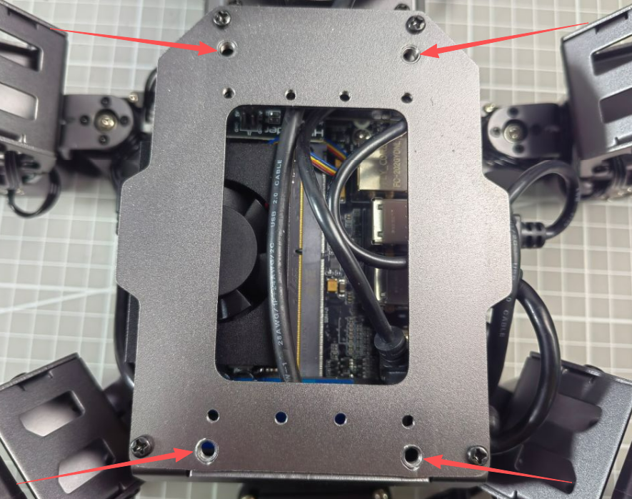

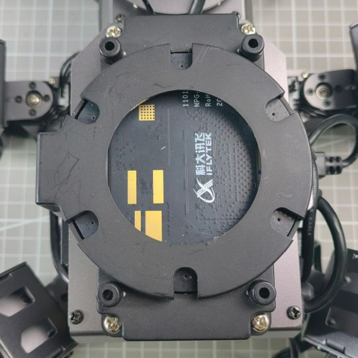

<p id ="anther9.2"></p>

## 9.2 Switching Wake Words

The system uses the English wake-up phrase **Hello Hiwonder** by default. To use a different wake word or command, follow the steps below.

1. For robots with the WonderEcho Pro: Make sure the corresponding language firmware is flashed first. Refer to the tutorial [02 Firmware Flashing](https://drive.google.com/drive/folders/1k99wcXlh2hoAdDcCBwK_ws4eVpDZGrMG?usp=sharing) under the folder **Voice Control Basic Lesson** for detailed instructions.
2. For robots using the 6-Microphone Array: Set the recognition language via the desktop configuration tool. Double-click the **Tool** icon 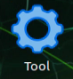on the system desktop.

3. In the Tool interface, switch the language, then click **Save** → **Apply** → **Quit**. The default language is **English**.

4. After restarting the robot, the wake word will be successfully switched.

<p id ="anther9.3"></p>

## 9.3 6-Microphone Array Configuration (Must Read)

### 9.3.1 Apply for Offline Speech Recognition Resources and App ID

Since offline speech recognition is used in this section, an offline speech resource package from iFLYTEK is required. The offline speech package is only available to accounts registered in supported regions. The following steps describe how to complete the registration process.

1. Visit the iFlytek Open Platform at https://www.xfyun.cn/, and create a new account.

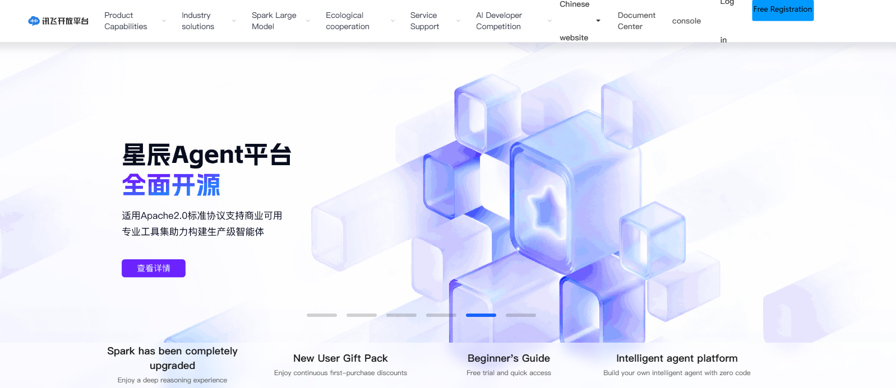

2. Choose **Login with phone number** and fill in the required information. For international access, the corresponding country code should be selected.


3. Once registered, click **console** to create a new application.


4. Fill in the required fields and click **Submit**.

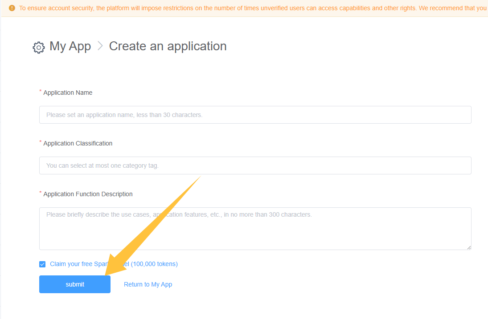

5. Open the newly created application.

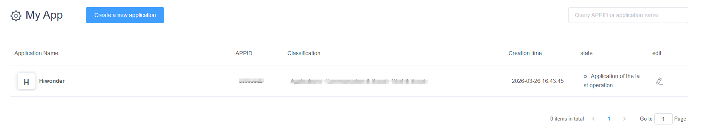

6. Click on **Offline Voice Command Recognition**, locate the corresponding APPID in the red box shown below. Then navigate to **Offline command word recognition SDK** → **Linux MSC** and click the **download** button.

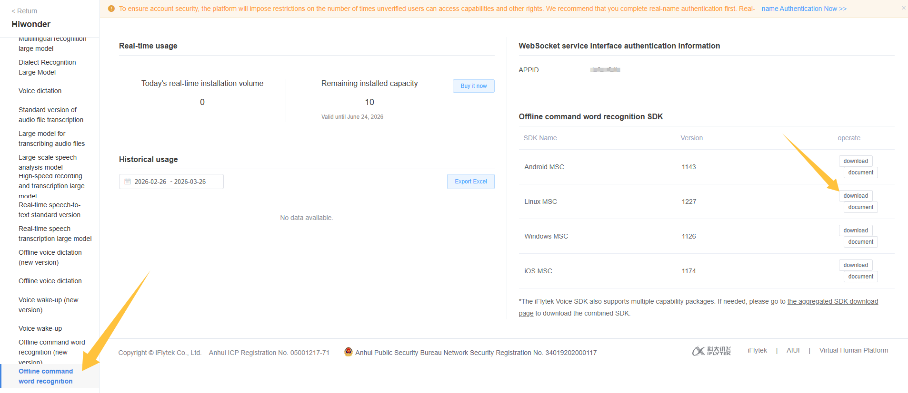

7. Click **Return to the old version**.

   

8. Select **Linux**, choose the required features, click **SDK Download**, and click **Sure** to begin the download.

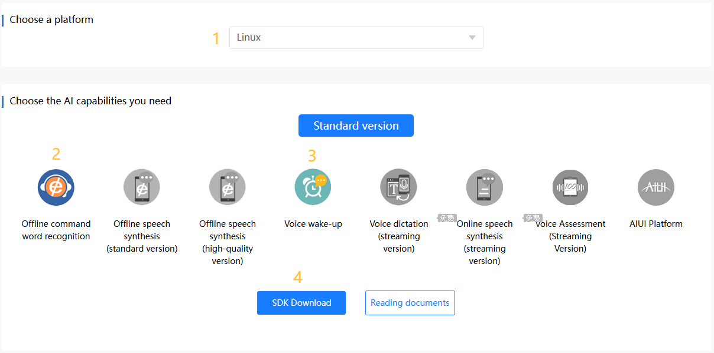


9. Then, click **Go to set a personalized wake word experience package** to set the wake word and submit.

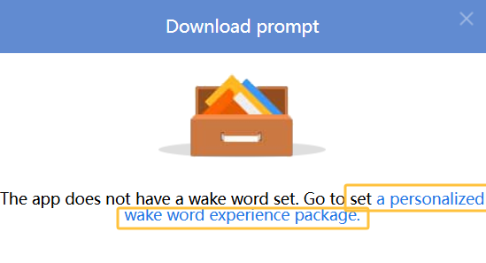

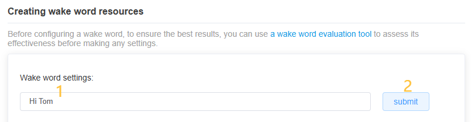

10. In the pop-up window, click **Go to SDK Download Center** to download the file by repeating Step 8.


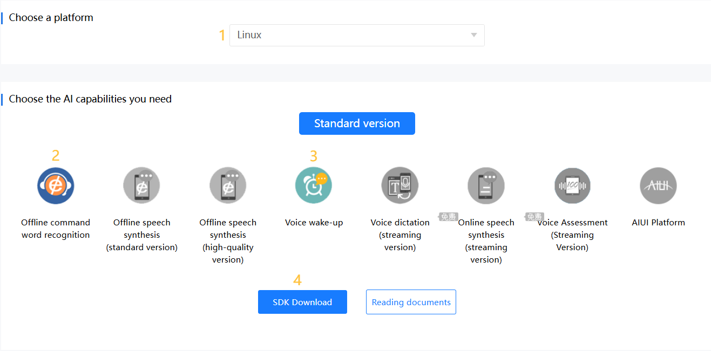

> [!NOTE]
>
> **Each newly registered application can be used for free for 90 days. After the free period expires, continued use requires a paid plan. When an application expires, a new one can be registered, with a maximum of five applications per account. The process for creating a new app is the same.**

### 9.3.2 Replacing Offline Voice Resources and ID

1. Extract the compressed package from the provided materials.


Open the folder named **Linux_aitalk_exp1227_01997b6c**. The version ID, such as **1227_01997b6c**, may vary depending on the official release. Navigate to the **bin/msc/res/asr** directory and locate the **common.jet** file. Drag this file onto the desktop of the robot’s system image.

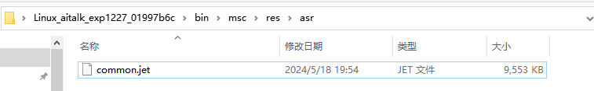

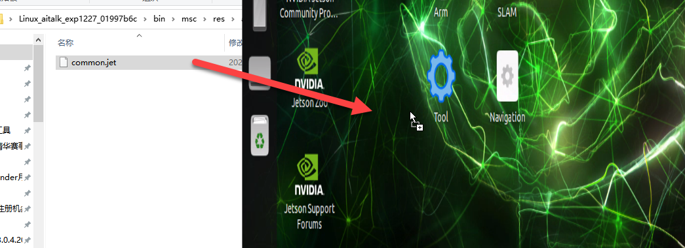

2. Click the icon  on the system desktop to open the command line terminal.

3. Enter the command and press **Enter** to replace the **common.jet** file.

```bash
cp /home/ubuntu/Desktop/common.jet /home/ubuntu/ros2_ws/src/xf_mic_asr_offline/config/msc/res/asr/
```

4. Enter the command and press **Enter** to modify the APPID:

```bash
vim ./ros2_ws/src/xf_mic_asr_offline/launch/mic_init.launch.py
```

5. Find the code shown in the figure below:


6. Press the **i** key to enter edit mode and modify it to the applied APPID.

## 9.4 Voice-Controlled Robot Movement

### 9.4.1 Experiment Introduction

This experiment uses the voice recognition function to control the robot to make corresponding movements, such as moving forward and backward via voice commands.

Programmatically, by subscribing to the voice recognition service published by the microphone array node, the system processes the audio for sound source localization, noise reduction, and speech recognition to extract the recognized commands and the angle of the sound source. Next, after successfully waking the robot and speaking specific phrases, the robot will provide the corresponding audio feedback. Additionally, upon recognizing specific colors, the issued voice commands will control the robot chassis to execute actions such as moving forward, moving backward, turning left, and turning right.

Please refer to the **9.4.2 Preparation** section below to complete the necessary setup for this experiment, and then follow the **9.4.3 Operation Steps** to learn and experience this module.

### 9.4.2 Preparation

1. Before starting this section, install the voice module onto the robot and plug it into the USB port of the hub. If the module is already installed, skip this step.
2. Refer to [9.3 6-Microphone Array Configuration (Must Read)](#anther9.3) in the current directory to complete the APPID application and file replacement.
3. By default, the system uses the English wake word **Hello Hiwonder**. To switch the wake words or when using the AI Voice Box **WonderEcho Pro**, the voice interaction command words must be flashed. Refer to the [9.2 Switching Wake Words](#anther9.2) section in this document for instructions on switching the language or flashing the command words.

### 9.4.3 Operation Steps

> [!NOTE]
> **Commands are strictly case-sensitive, and the Tab key can be used to auto-complete keywords.**

1. Power on ROSpider and connect it to the remote control software VNC. For instructions on connecting to the remote desktop, refer to **[1. ROSpider User Manual \ 1.4 Development Environment Setup](https://wiki.hiwonder.com/projects/ROSpider/en/latest/docs/1.%20ROSpider%20User%20Manual.html#development-environment-setup)**.
2. Click the icon  on the system desktop to open the command-line terminal.
3. Enter the command to disable the app auto-start service:

```bash
~/.stop_ros.sh
```

4. Enter the command and press **Enter** to enable the voice control function:

```bash
ros2 launch xf_mic_asr_offline voice_control_move.launch.py
```

5. To close this function, press the shortcut key **Ctrl + C**. If it cannot be closed, please try repeatedly.

### 9.4.4 Program Outcome

Once the program loads successfully, first say the wake word **Hello Hiwonder**, wait for the voice device to reply with **I'm here**, and then issue the next voice command. For example, say **go forward**. After recognizing the voice command, the robot will announce **Okay, starting to move forward** and execute the corresponding movement.

The commands and their corresponding control actions are as follows:

| **Command Sentence** | **Corresponding Function**    |
| -------------------- | ----------------------------- |
| go forward           | Go forward                    |
| go backward          | Go backward                   |
| turn left            | Turn left                     |
| turn right           | Turn right                    |
| move left            | Move left                     |
| move right           | Move right                    |
| dance                | Dance                         |
| come here            | Move towards the sound source |


> [!NOTE]
> * **To ensure optimal performance, operate this feature in a quiet environment.**
> * **For best results, say the wake word before issuing each voice command.**
> * **Speak all voice commands loudly and clearly.**
> * **Issue voice commands one at a time. Wait for the robot to complete its action and provide feedback before issuing the next command.**
>

### 9.4.5 Program Analysis

Controlling the robot's movement via voice involves establishing communication between the voice control node and the robot's underlying drive node. This allows the robot to execute specific actions based on the issued voice commands.

* **Launch File Analysis**

The launch startup file is located at: **ros2_ws/src/xf_mic_asr_offline/launch/voice_control_move.launch.py**

1. Start the launch files.

```python
controller_launch = IncludeLaunchDescription(
    PythonLaunchDescriptionSource(
        os.path.join(controller_package_path, 'launch/controller.launch.py')),
)

lidar_launch = IncludeLaunchDescription(
    PythonLaunchDescriptionSource(
        os.path.join(peripherals_package_path, 'launch/lidar.launch.py')),
)

mic_launch = IncludeLaunchDescription(
    PythonLaunchDescriptionSource(
        os.path.join(xf_mic_asr_offline_package_path, 'launch/mic_init.launch.py')),
)
```

`controller_launch` is used to start chassis control. After starting, servos can be controlled.

`lidar_launch` starts the LiDAR and will publish LiDAR data.

`mic_launch` starts the microphone function.

2. Start node.

```python
voice_control_move_node = Node(
    package='xf_mic_asr_offline',
    executable='voice_control_move.py',
    output='screen',
    parameters=[{'move': move}],
)
```

`voice_control_move_node` is used to call the voice-controlled movement program.

* **Python File**

The program source code is located at: **ros2_ws/src/xf_mic_asr_offline/scripts/voice_control_move.py**

1. Class Initialization

```python
def __init__(self, name):
    rclpy.init()
    super().__init__(name)

    self.angle = None
    self.words = None
    self.running = True
    self.haved_stop = False
    self.lidar_follow = False
    self.start_follow = False
    self.last_status = Twist()
    self.threshold = 3
    self.speed = 0.3
    self.stop_dist = 0.4
    self.count = 0
    self.scan_angle = math.radians(90)
    self.declare_parameter('move', False)
    self.move = self.get_parameter('move').value

    self.pid_yaw = pid.PID(1.6, 0, 0.16)
    self.pid_dist = pid.PID(1.7, 0, 0.16)

    self.language = os.environ['ASR_LANGUAGE']
    self.controller = controller_client.ControllerClient()
    self.agc_controller = ActionGroupController(self.create_publisher(ServosPosition, 'servo_controller', 1), '/home/ubuntu/software/actionset_editor/ActionGroups')
    self.cmd_vel_pub = self.create_publisher(Twist, '/controller/cmd_vel', 1)
    self.buzzer_pub = self.create_publisher(BuzzerState, '/ros_robot_controller/set_buzzer', 1)
    qos = QoSProfile(depth=1, reliability=QoSReliabilityPolicy.BEST_EFFORT)
    self.create_subscription(String, '/asr_node/voice_words', self.words_callback, 1)
    self.create_subscription(Int32, '/awake_node/angle', self.angle_callback, 1)

    self.client = self.create_client(Trigger, '/asr_node/init_finish')
    self.client.wait_for_service()  # Blocking wait
    self.declare_parameter('delay', 0)
    time.sleep(self.get_parameter('delay').value)

    self.get_logger().info('Wake up word: hello hiwonder')
    self.get_logger().info('No need to wake up within 15 seconds after waking up')
    self.get_logger().info('Voice command: turn left/turn right/go forward/go backward/come here /dance')
    self.time_stamp = time.time()
    self.current_time_stamp = time.time()
    threading.Thread(target=self.main, daemon=True).start()
    self.create_service(Trigger, '~/init_finish', self.get_node_state)
    self.play('running')

    if self.language == 'Chinese':
        self.get_logger().info('\033[1;32m%s\033[0m' % '准备就绪')
    else:
        self.get_logger().info('\033[1;32m%s\033[0m' % 'I am ready')
```

Initialize the node to complete initialization tasks such as parameter configuration, topic subscription, publication, and service creation.

2. `get_node_state` Method

```python
def get_node_state(self, request, response):
    response.success = True
    return response
```

Service callback to return the status of whether the node is ready.

3. `play` Method

```python
def play(self, name):
    voice_play.play(name, language=self.language)
```

Play audio.

4. `words_callback` Method

```python
def words_callback(self, msg):
    self.words = json.dumps(msg.data, ensure_ascii=False)[1:-1]
    if self.language == 'Chinese':
        self.words = self.words.replace(' ', '')
    self.get_logger().info('words:%s' % self.words)
    if self.words is not None and self.words not in ['wake-up-success', 'Sleep', 'Fail-5-times',
                                                     'Fail-10-times']:
        pass
    elif self.words == 'wake-up-success':
        self.play('awake')
    elif self.words == 'Sleep':
        msg = BuzzerState()
        msg.freq = 1000
        msg.on_time = 0.1

        msg.off_time = 0.01
        msg.repeat = 1
        self.buzzer_pub.publish(msg)
```

Voice recognition callback function to process voice recognition results.

5. `angle_callback` Method

```python
def angle_callback(self, msg):
    self.angle = msg.data
    self.get_logger().info('angle:%s' % self.angle)
    self.start_follow = False
    self.start_follow = False 
```

Sound source recognition callback function. The sound source is read based on the wake-up direction. This source is the angle identified by the microphone sound source positioning.

6. `main` Method

```python
def main(self):
    while True:
        if self.words is not None:
            self.move = True
            twist = Twist()
            if self.words == '前进' or self.words == 'go forward':
                self.play('go')
                self.time_stamp = time.time() + 4
                twist.linear.x = 0.05
            elif self.words == '后退' or self.words == 'go backward':
                self.play('back')
                self.time_stamp = time.time() + 4
                twist.linear.x = -0.05
            elif self.words == '左转' or self.words == 'turn left':
                self.play('turn_left')
                self.time_stamp = time.time() + 4
                twist.angular.z = 0.3
            elif self.words == '右转' or self.words == 'turn right':
                self.play('turn_right')
                self.time_stamp = time.time() + 4
                twist.angular.z = -0.3
            elif self.words == '左平移' or self.words == 'move left':
                self.play('move_left')
                self.time_stamp = time.time() + 4
                twist.linear.y = 0.05
            elif self.words == '右平移' or self.words == 'move right':
                self.play('move_right')
                self.time_stamp = time.time() + 4
                twist.linear.y = -0.05
            elif self.words == '跳个舞吧' or self.words == 'dance':
                self.play('dance')
                self.agc_controller.run_action('twist')

            elif self.words == '过来' or self.words == 'come here':
                self.play('come')
                self.get_logger().info('\033[1;32m%s\033[0m' % self.angle)

                if 270 > self.angle > 90:
                    twist.angular.z = -0.3
                    self.time_stamp = time.time() + abs(math.radians(self.angle - 90) / twist.angular.z)
                else:
                    twist.angular.z = 0.3
                    if self.angle <= 90:
                        self.angle = 90 - self.angle
                    else:
                        self.angle = 450 - self.angle
                    self.time_stamp = time.time() + abs(math.radians(self.angle) / twist.angular.z)
                self.lidar_follow = True
            elif self.words == '休眠(Sleep)':
                time.sleep(0.01)
            self.words = None
            self.haved_stop = False
            if self.move:
                self.cmd_vel_pub.publish(twist)

        else:
            time.sleep(0.01)
        self.current_time_stamp = time.time()
        if self.time_stamp < self.current_time_stamp and not self.haved_stop and self.move:
            self.controller.traveling(gait=-2, time=1, steps=0)
            self.haved_stop = True
            if self.lidar_follow:
                self.lidar_follow = False
                self.start_follow = True
```

The execution strategy after receiving commands. Different linear and angular velocities are published based on different commands, which are used to control the robot to perform different movements.
